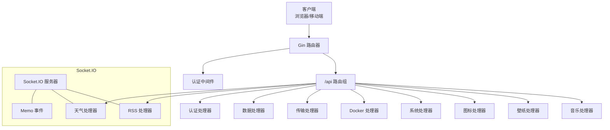
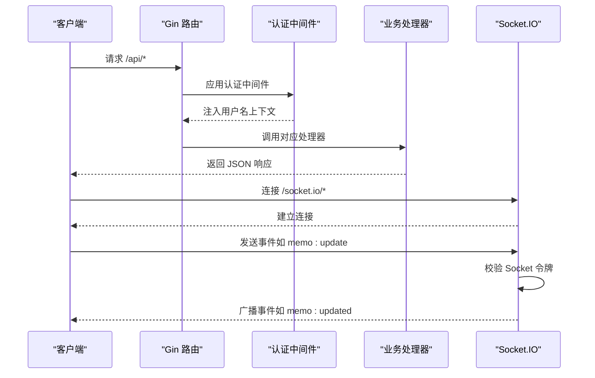
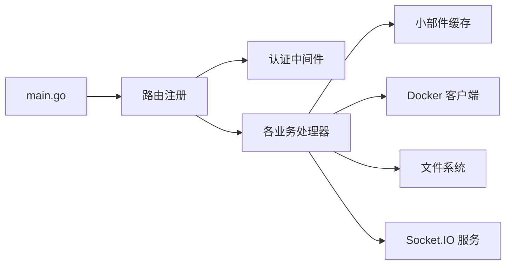

# API 参考

<cite>
**本文档引用的文件**
- [main.go](file://backend/main.go)
- [auth.go](file://backend/handlers/auth.go)
- [data.go](file://backend/handlers/data.go)
- [docker.go](file://backend/handlers/docker.go)
- [system.go](file://backend/handlers/system.go)
- [transfer.go](file://backend/handlers/transfer.go)
- [memo.go](file://backend/handlers/memo.go)
- [rss.go](file://backend/handlers/rss.go)
- [weather.go](file://backend/handlers/weather.go)
- [icons.go](file://backend/handlers/icons.go)
- [wallpaper.go](file://backend/handlers/wallpaper.go)
- [music.go](file://backend/handlers/music.go)
- [config.go](file://backend/config/config.go)
- [models.go](file://backend/models/models.go)
- [auth_middleware.go](file://backend/middleware/auth.go)
- [widget_cache.go](file://backend/handlers/widget_cache.go)
</cite>

## 目录
1. [简介](#简介)
2. [项目结构](#项目结构)
3. [核心组件](#核心组件)
4. [架构总览](#架构总览)
5. [详细组件分析](#详细组件分析)
6. [依赖关系分析](#依赖关系分析)
7. [性能考量](#性能考量)
8. [故障排查指南](#故障排查指南)
9. [结论](#结论)
10. [附录](#附录)

## 简介
本文件为 OFlatNas 后端服务的完整 API 参考，覆盖认证、数据管理、文件传输、Docker 管理、系统服务、天气与 RSS 小组件、图标与壁纸、音乐管理等模块。文档提供每个接口的请求方法、URL 模式、参数说明、响应格式、错误码以及认证机制与安全注意事项，并给出常见使用场景与调用示例路径。

## 项目结构
后端采用 Gin 框架，通过路由组划分 API 命名空间，统一启用日志、恢复、Gzip 压缩与跨域策略；WebSocket 使用 Socket.IO，支持事件驱动的数据推送与实时交互。

图表来源
- [main.go:25-267](file://backend/main.go#L25-L267)
- [auth_middleware.go:33-61](file://backend/middleware/auth.go#L33-L61)

章节来源
- [main.go:25-267](file://backend/main.go#L25-L267)
- [config.go:35-86](file://backend/config/config.go#L35-L86)

## 核心组件
- 路由与中间件
  - 日志、恢复、Gzip 压缩、请求体大小限制、CORS 允许源动态配置
  - Socket.IO 集成，支持 polling 与 websocket 传输层，按 Origin 白名单校验
- 认证与授权
  - JWT HS256 签发与校验，支持 Authorization 头或查询参数 token
  - 可选认证中间件允许匿名访问但可读取用户名上下文
- 数据与缓存
  - 用户数据与系统配置读写，带版本号与幂等保存
  - 统一小部件缓存（RSS/热点/天气），含 TTL 与并发刷新控制
- 文件传输
  - 分片上传、断点续传、缩略图生成、下载令牌鉴权
- Docker 管理
  - 容器列表、状态统计、容器操作、更新检测、调试导出
- 系统服务
  - 系统资源统计、公网 IP 获取、Ping/RTT、自定义脚本、音乐列表
- 实时通信
  - Socket.IO 事件：memo 更新、todo 更新、网络模式切换与心跳、天气与 RSS 数据推送

章节来源
- [main.go:34-115](file://backend/main.go#L34-L115)
- [auth_middleware.go:12-61](file://backend/middleware/auth.go#L12-L61)
- [widget_cache.go:36-154](file://backend/handlers/widget_cache.go#L36-L154)

## 架构总览
下图展示 API 与 Socket.IO 的整体交互关系及关键数据流。

图表来源
- [main.go:79-115](file://backend/main.go#L79-L115)
- [memo.go:25-39](file://backend/handlers/memo.go#L25-L39)

## 详细组件分析

### 认证接口
- 登录
  - 方法与路径：POST /api/login
  - 请求体：用户名、密码
  - 响应：成功返回 token 与用户名；失败返回错误信息
  - 安全：密码支持明文迁移与 bcrypt 存储；单用户模式自动回退 admin
  - 示例路径：[登录实现:18-114](file://backend/handlers/auth.go#L18-L114)

- 用户管理（受保护）
  - GET /api/admin/users：列出普通用户（仅管理员）
  - POST /api/admin/users：新增普通用户（仅管理员）
  - DELETE /api/admin/users/:usr：删除普通用户（仅管理员）
  - 示例路径：[用户管理实现:121-208](file://backend/handlers/auth.go#L121-L208)

- 认证机制
  - Authorization: Bearer <token> 或查询参数 token
  - 可选认证：OptionalAuthMiddleware 支持匿名访问但可读取用户名
  - 示例路径：[认证中间件:33-61](file://backend/middleware/auth.go#L33-L61)

章节来源
- [auth.go:18-114](file://backend/handlers/auth.go#L18-L114)
- [auth.go:121-208](file://backend/handlers/auth.go#L121-L208)
- [auth_middleware.go:33-61](file://backend/middleware/auth.go#L33-L61)

### 数据管理接口
- 获取用户数据
  - 方法与路径：GET /api/data
  - 查询参数：可选 token（匿名访问时）
  - 响应：返回用户数据（过滤敏感字段），游客仅返回公开项
  - 缓存：基于文件修改时间的内存缓存，命中时快速返回
  - 示例路径：[获取数据实现:159-322](file://backend/handlers/data.go#L159-L322)

- 获取版本号
  - 方法与路径：GET /api/version
  - 响应：返回当前用户数据版本号
  - 示例路径：[获取版本实现:324-343](file://backend/handlers/data.go#L324-L343)

- 获取小部件数据
  - 方法与路径：GET /api/widgets/:id
  - 响应：返回指定小部件的 data 字段
  - 示例路径：[获取小部件实现:345-383](file://backend/handlers/data.go#L345-L383)

- 保存用户数据
  - 方法与路径：POST /api/save
  - 请求体：完整用户数据（含版本号），服务端自动递增版本
  - 响应：返回新版本号
  - 示例路径：[保存数据实现:638-744](file://backend/handlers/data.go#L638-L744)

- 导入/重置/默认模板
  - POST /api/data/import：导入 JSON 配置（复用保存逻辑）
  - POST /api/reset：重置为默认模板
  - POST /api/default/save：保存当前数据为默认模板（去除敏感字段）
  - 示例路径：[导入/重置/默认实现:746-788](file://backend/handlers/data.go#L746-L788)

- 备份与版本管理
  - GET /api/config-versions：获取历史版本列表
  - POST /api/config-versions：保存当前配置为新版本
  - POST /api/config-versions/restore：恢复指定版本
  - DELETE /api/config-versions/:id：删除指定版本
  - 示例路径：[版本管理实现](file://backend/handlers/data.go)

章节来源
- [data.go:159-383](file://backend/handlers/data.go#L159-L383)
- [data.go:324-343](file://backend/handlers/data.go#L324-L343)
- [data.go:638-744](file://backend/handlers/data.go#L638-L744)
- [data.go:746-788](file://backend/handlers/data.go#L746-L788)

### 文件传输接口
- 文本消息发送
  - 方法与路径：POST /api/transfer/text
  - 请求体：text
  - 响应：返回新增条目
  - 示例路径：[发送文本实现:282-316](file://backend/handlers/transfer.go#L282-L316)

- 分片上传初始化
  - 方法与路径：POST /api/transfer/upload/init
  - 请求体：fileName, size, mime, fileKey, chunkSize
  - 响应：uploadId, totalChunks, chunkSize
  - 示例路径：[上传初始化实现:331-381](file://backend/handlers/transfer.go#L331-L381)

- 上传分片
  - 方法与路径：POST /api/transfer/upload/chunk
  - 表单：uploadId, index, chunk
  - 响应：成功标记
  - 示例路径：[上传分片实现:383-467](file://backend/handlers/transfer.go#L383-L467)

- 完成上传
  - 方法与路径：POST /api/transfer/upload/complete
  - 请求体：uploadId
  - 响应：返回新增条目（含缩略图）
  - 示例路径：[完成上传实现:469-580](file://backend/handlers/transfer.go#L469-L580)

- 下载令牌
  - 方法与路径：POST /api/transfer/download-token
  - 请求体：url
  - 响应：签名后的 token（10 分钟有效期）
  - 示例路径：[下载令牌实现:582-622](file://backend/handlers/transfer.go#L582-L622)

- 列表与删除
  - GET /api/transfer/items?type=&limit=
  - DELETE /api/transfer/items/:id（IDOR 校验）
  - 示例路径：[列表与删除实现:200-280](file://backend/handlers/transfer.go#L200-L280)

- 文件与缩略图
  - GET /api/transfer/file/:filename（支持 token 或登录态）
  - GET /api/transfer/thumb/:filename/:size（64/128/256）
  - 示例路径：[文件/缩略图实现:673-720](file://backend/handlers/transfer.go#L673-L720)

- 手动生成缩略图
  - POST /api/transfer/generate-thumb/:filename/:size
  - POST /api/transfer/regenerate-thumbs
  - 示例路径：[缩略图生成实现:724-794](file://backend/handlers/transfer.go#L724-L794)

章节来源
- [transfer.go:200-280](file://backend/handlers/transfer.go#L200-L280)
- [transfer.go:282-316](file://backend/handlers/transfer.go#L282-L316)
- [transfer.go:331-381](file://backend/handlers/transfer.go#L331-L381)
- [transfer.go:383-467](file://backend/handlers/transfer.go#L383-L467)
- [transfer.go:469-580](file://backend/handlers/transfer.go#L469-L580)
- [transfer.go:582-622](file://backend/handlers/transfer.go#L582-L622)
- [transfer.go:673-720](file://backend/handlers/transfer.go#L673-L720)
- [transfer.go:724-794](file://backend/handlers/transfer.go#L724-L794)

### Docker 管理接口
- 列表与状态
  - GET /api/docker-status：是否有可用更新
  - GET /api/docker/debug：Docker 客户端调试快照
  - GET /api/docker/containers：容器列表（含更新标记与统计）
  - GET /api/docker/info：Docker 信息与版本
  - 示例路径：[状态与列表实现:423-421](file://backend/handlers/docker.go#L423-L421)

- 容器操作
  - GET /api/docker/container/:id/inspect-lite：容器轻量检查（网络模式与端口）
  - POST /api/docker/container/:id/:action（start/stop/restart）
  - 示例路径：[容器操作实现:438-483](file://backend/handlers/docker.go#L438-L483)

- 更新检测
  - POST /api/docker/check-updates：触发更新检查，异步更新状态
  - GET /api/docker/export-logs：导出调试日志（JSON）
  - 示例路径：[更新检测实现:664-758](file://backend/handlers/docker.go#L664-L758)

章节来源
- [docker.go:423-421](file://backend/handlers/docker.go#L423-L421)
- [docker.go:438-483](file://backend/handlers/docker.go#L438-L483)
- [docker.go:664-758](file://backend/handlers/docker.go#L664-L758)

### 系统服务接口
- 系统统计
  - GET /api/system/stats：CPU/内存/磁盘/网络/系统信息
  - 示例路径：[系统统计实现:51-203](file://backend/handlers/system.go#L51-L203)

- 自定义脚本
  - GET /api/custom-scripts：按用户返回 CSS/JS 列表
  - POST /api/custom-scripts：保存用户自定义脚本
  - 示例路径：[自定义脚本实现:205-272](file://backend/handlers/system.go#L205-L272)

- 公网 IP 与延迟
  - GET /api/ip?refresh=1：获取公网 IP 与位置信息（带缓存）
  - GET /api/ping?target=：ICMP/Ping 延迟测试
  - GET /api/rtt：毫秒级 RTT 快速检测
  - 示例路径：[IP/延迟实现:349-465](file://backend/handlers/system.go#L349-L465)

- 音乐列表
  - GET /api/music-list：扫描音乐目录返回文件名列表
  - 示例路径：[音乐列表实现:594-619](file://backend/handlers/system.go#L594-L619)

- 访客追踪
  - POST /api/visitor/track：匿名访问统计
  - 示例路径：[访客追踪实现](file://backend/handlers/system.go)

章节来源
- [system.go:51-203](file://backend/handlers/system.go#L51-L203)
- [system.go:205-272](file://backend/handlers/system.go#L205-L272)
- [system.go:349-465](file://backend/handlers/system.go#L349-L465)
- [system.go:594-619](file://backend/handlers/system.go#L594-L619)

### 天气与 RSS 小组件
- 天气
  - GET /api/weather：查询天气（支持多源缓存）
  - Socket 事件：weather:fetch（推送 weather:data/error）
  - 示例路径：[天气实现:163-206](file://backend/handlers/weather.go#L163-L206)

- RSS
  - GET /api/rss?url=&force=：获取 RSS 条目（带缓存与刷新）
  - Socket 事件：rss:fetch（推送 rss:data/rss:error）
  - 示例路径：[RSS 实现:201-252](file://backend/handlers/rss.go#L201-L252)

- 小部件缓存
  - 统一缓存结构：kind/key/ttl/status/updatedAt
  - 示例路径：[小部件缓存实现:36-154](file://backend/handlers/widget_cache.go#L36-L154)

章节来源
- [weather.go:163-206](file://backend/handlers/weather.go#L163-L206)
- [rss.go:201-252](file://backend/handlers/rss.go#L201-L252)
- [widget_cache.go:36-154](file://backend/handlers/widget_cache.go#L36-L154)

### 图标与壁纸接口
- 图标
  - GET /api/ali-icons：阿里图标库代理（解决跨域）
  - GET /api/get-icon-base64?url=：远程图标转 Base64
  - POST /api/icon-cache：缓存远程或 DataURL 图标（自动 WebP 规范化）
  - 示例路径：[图标实现:230-334](file://backend/handlers/icons.go#L230-L334)

- 壁纸
  - POST /api/wallpaper/resolve：解析最终 URL（HEAD）
  - POST /api/wallpaper/fetch：下载并保存壁纸至 PC/APP 目录
  - GET /api/backgrounds, /api/mobile_backgrounds：列出壁纸
  - DELETE /api/backgrounds/:name, /api/mobile_backgrounds/:name：删除壁纸（IDOR 校验）
  - POST /api/backgrounds/upload, /api/mobile_backgrounds/upload：上传壁纸
  - 示例路径：[壁纸实现:18-267](file://backend/handlers/wallpaper.go#L18-L267)

章节来源
- [icons.go:230-334](file://backend/handlers/icons.go#L230-L334)
- [wallpaper.go:18-267](file://backend/handlers/wallpaper.go#L18-L267)

### 音乐管理接口
- 上传音乐
  - POST /api/music/upload：支持 MP3/FLAC/WAV/M4A/OGG
  - 示例路径：[音乐上传实现:13-56](file://backend/handlers/music.go#L13-L56)

章节来源
- [music.go:13-56](file://backend/handlers/music.go#L13-L56)

### WebSocket 与 Socket.IO 接口
- 连接
  - 客户端通过 /socket.io/* 连接，服务端按 Origin 白名单放行
  - 示例路径：[Socket.IO 初始化:79-115](file://backend/main.go#L79-L115)

- 事件绑定
  - memo/update：广播 memo:updated
  - todo/update：广播 todo:updated
  - network:mode：广播网络模式与用户名
  - network:heartbeat：心跳回显
  - weather:fetch：天气数据推送
  - rss:fetch：RSS 数据推送
  - 示例路径：[事件绑定实现:25-96](file://backend/handlers/memo.go#L25-L96)

- 令牌校验
  - 所有事件均要求携带有效 Bearer 令牌（HS256）
  - 示例路径：[令牌校验实现:204-225](file://backend/handlers/memo.go#L204-L225)

章节来源
- [main.go:79-115](file://backend/main.go#L79-L115)
- [memo.go:25-96](file://backend/handlers/memo.go#L25-L96)
- [memo.go:204-225](file://backend/handlers/memo.go#L204-L225)

## 依赖关系分析
- 组件耦合
  - 主路由集中注册各处理器，中间件统一注入认证上下文
  - Socket.IO 通过全局服务对象广播事件，处理器负责事件绑定
  - 小部件缓存独立文件持久化，避免重复拉取上游数据
- 外部依赖
  - Docker 客户端按配置或环境变量自动协商主机
  - 天气/天气代理使用第三方 API，带缓存与降级策略
  - 文件传输使用本地磁盘与索引文件，支持缩略图生成

图表来源
- [main.go:165-254](file://backend/main.go#L165-L254)
- [widget_cache.go:41-44](file://backend/handlers/widget_cache.go#L41-L44)
- [docker.go:42-66](file://backend/handlers/docker.go#L42-L66)

章节来源
- [main.go:165-254](file://backend/main.go#L165-L254)
- [widget_cache.go:41-44](file://backend/handlers/widget_cache.go#L41-L44)
- [docker.go:42-66](file://backend/handlers/docker.go#L42-L66)

## 性能考量
- 压缩与缓存
  - Gzip 压缩显著降低传输体积
  - GetData 基于文件修改时间的内存缓存，减少 IO
  - 小部件缓存（RSS/天气）带 TTL，支持后台刷新
- 并发与限流
  - Docker 统一客户端，批量统计使用并发信号量
  - 传输缩略图生成使用并发限流，避免阻塞
- I/O 优化
  - 传输分片上传使用文件锁与原子更新索引
  - 图标缓存命中直接返回，避免重复写盘

章节来源
- [main.go:42-46](file://backend/main.go#L42-L46)
- [data.go:193-317](file://backend/handlers/data.go#L193-L317)
- [transfer.go:140-192](file://backend/handlers/transfer.go#L140-L192)
- [docker.go:318-352](file://backend/handlers/docker.go#L318-L352)

## 故障排查指南
- 认证失败
  - 确认 Authorization 头或 token 参数正确，HS256 令牌未过期
  - 单用户模式下 admin 回退逻辑
  - 参考：[认证中间件:33-61](file://backend/middleware/auth.go#L33-L61)，[登录实现:18-114](file://backend/handlers/auth.go#L18-L114)

- 传输异常
  - 上传初始化/分片/完成流程需严格匹配 uploadId 与索引
  - 下载需使用 download-token 或登录态
  - 参考：[传输实现:331-580](file://backend/handlers/transfer.go#L331-L580)

- Docker 不可用
  - 检查 enableDocker 与 DOCKER_HOST 配置，确认 Socket 可达
  - 使用 /api/docker/debug 查看诊断快照
  - 参考：[Docker 实现:42-66](file://backend/handlers/docker.go#L42-L66)

- 天气/RSS 获取失败
  - 检查缓存状态与 TTL，必要时强制刷新
  - 参考：[天气实现:163-206](file://backend/handlers/weather.go#L163-L206)，[RSS 实现:201-252](file://backend/handlers/rss.go#L201-L252)

章节来源
- [auth_middleware.go:33-61](file://backend/middleware/auth.go#L33-L61)
- [auth.go:18-114](file://backend/handlers/auth.go#L18-L114)
- [transfer.go:331-580](file://backend/handlers/transfer.go#L331-L580)
- [docker.go:42-66](file://backend/handlers/docker.go#L42-L66)
- [weather.go:163-206](file://backend/handlers/weather.go#L163-L206)
- [rss.go:201-252](file://backend/handlers/rss.go#L201-L252)

## 结论
本 API 参考覆盖了 OFlatNas 的核心功能：认证、数据管理、文件传输、Docker 管理、系统服务、实时通信与小部件缓存。通过统一的中间件与 Socket.IO 事件机制，系统在保证安全性的同时提供了良好的扩展性与性能表现。建议在生产环境中合理设置 CORS 与密钥轮换，并对 Docker 与外部 API 的可用性进行监控。

## 附录

### API 版本管理与向后兼容
- 版本号字段
  - 用户数据包含 version 字段，保存时自动递增
  - GET /api/version 返回当前版本号，用于轻量同步判断
- 兼容性策略
  - 读取时对未知字段保持原样，避免破坏性变更
  - 导入/重置/默认模板提供平滑迁移路径
- 建议
  - 新增字段时保持默认值与兼容解析
  - 重要变更前提供迁移脚本或双版本过渡

章节来源
- [data.go:324-343](file://backend/handlers/data.go#L324-L343)
- [data.go:638-744](file://backend/handlers/data.go#L638-L744)

### 常见使用场景与调用示例路径
- 登录并获取用户数据
  - POST /api/login → GET /api/data
  - 示例路径：[登录:18-114](file://backend/handlers/auth.go#L18-L114)，[获取数据:159-322](file://backend/handlers/data.go#L159-L322)

- 上传文件并生成缩略图
  - POST /api/transfer/upload/init → POST /api/transfer/upload/chunk × N → POST /api/transfer/upload/complete → GET /api/transfer/thumb/:name/:size
  - 示例路径：[上传流程:331-580](file://backend/handlers/transfer.go#L331-L580)

- 管理 Docker 容器
  - GET /api/docker/containers → POST /api/docker/container/:id/start|stop|restart
  - 示例路径：[容器操作:438-483](file://backend/handlers/docker.go#L438-L483)

- 实时协作编辑
  - Socket 事件：memo:update → 广播 memo:updated
  - 示例路径：[事件绑定:25-39](file://backend/handlers/memo.go#L25-L39)