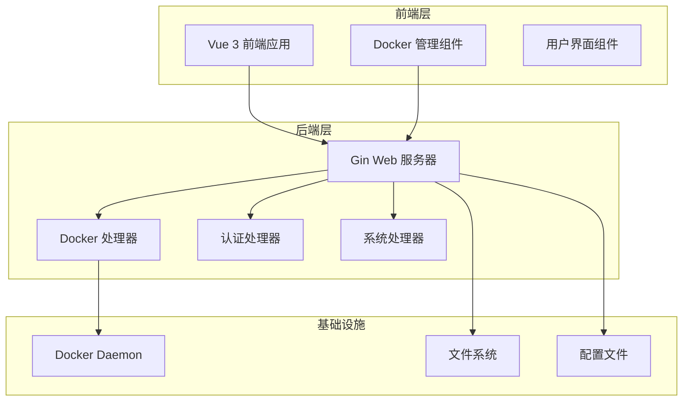
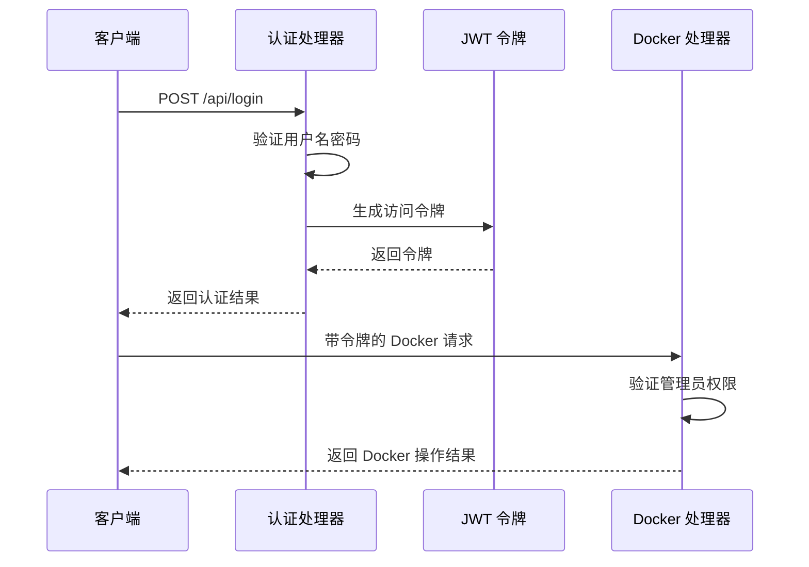
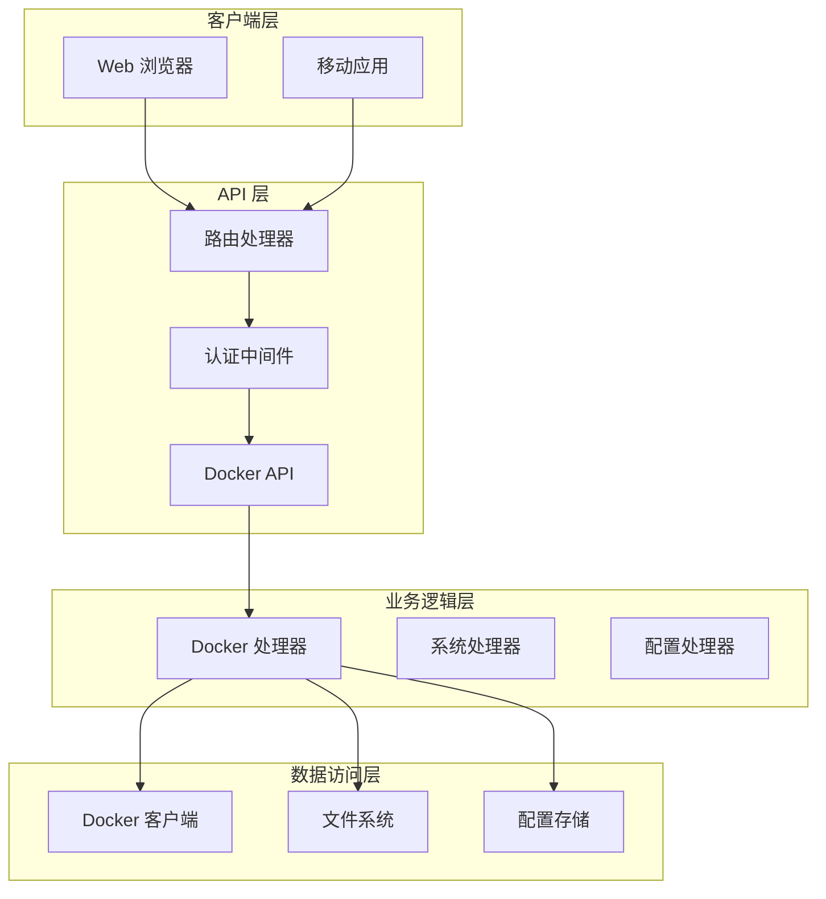
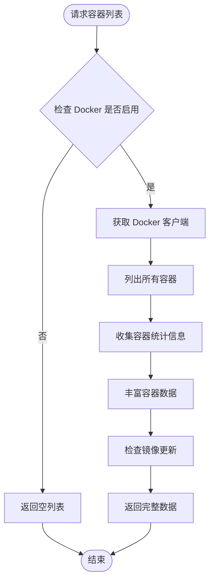
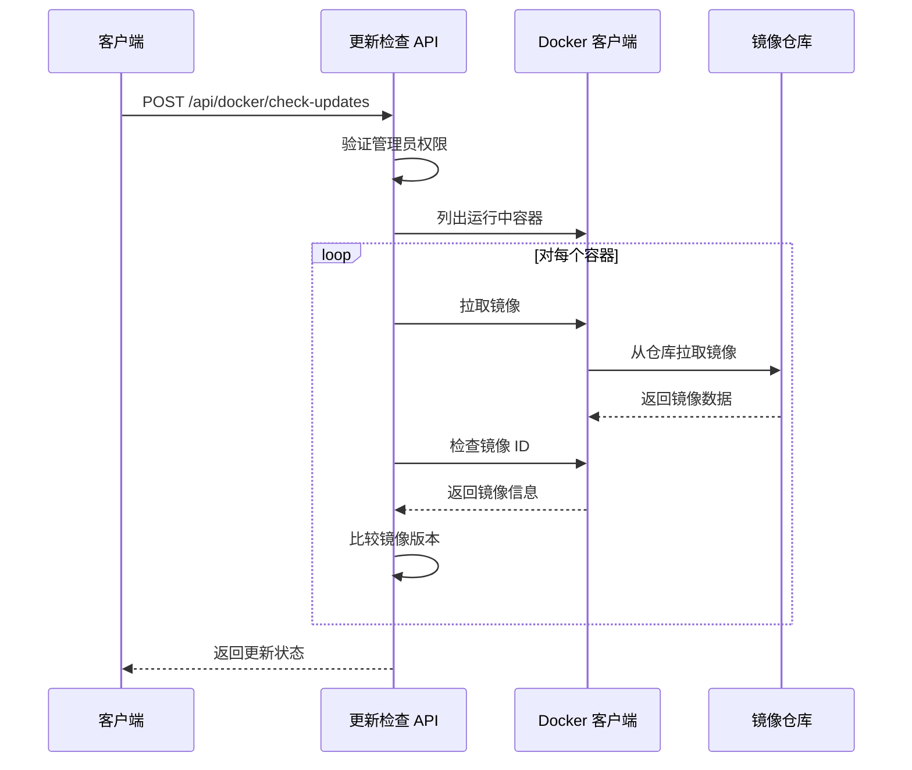
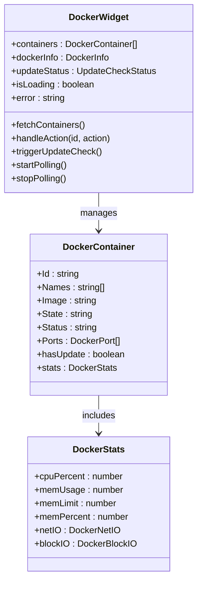
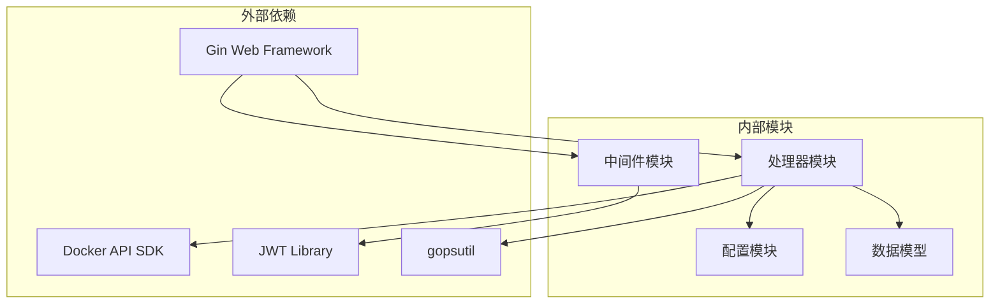
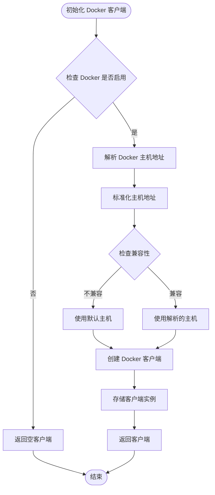

# Docker 管理 API

<cite>
**本文档引用的文件**
- [backend/main.go](file://backend/main.go)
- [backend/handlers/docker.go](file://backend/handlers/docker.go)
- [backend/config/config.go](file://backend/config/config.go)
- [backend/models/models.go](file://backend/models/models.go)
- [backend/middleware/auth.go](file://backend/middleware/auth.go)
- [frontend/src/components/DockerWidget.vue](file://frontend/src/components/DockerWidget.vue)
- [Dockerfile](file://Dockerfile)
- [README.md](file://README.md)
</cite>

## 目录
1. [简介](#简介)
2. [项目结构](#项目结构)
3. [核心组件](#核心组件)
4. [架构概览](#架构概览)
5. [详细组件分析](#详细组件分析)
6. [依赖关系分析](#依赖关系分析)
7. [性能考虑](#性能考虑)
8. [故障排除指南](#故障排除指南)
9. [结论](#结论)

## 简介

OFlatNas Docker 管理系统是一个基于 Vue 3 与 Go(Gin) 构建的轻量级个人导航页与仪表盘系统，专门集成了 Docker 容器管理功能。该系统提供了完整的 Docker 管理 API，包括容器状态查询、启动停止控制、镜像管理等核心功能。

系统的核心特性包括：
- **多端统一入口**：将常用网站、内网服务和工具聚合在同一仪表盘
- **Docker 管理**：内置 Docker 管理组件，支持查看、启动、停止、重启 Docker 容器、升级镜像等
- **智能网络环境检测**：根据用户访问来源自动切换内外网访问策略
- **本地数据可控**：配置与数据存储在本地目录，迁移与备份更方便
- **资源内存占用极低**：NAS 端占用 100MB 内存，访问端真实内存占用不到 80 兆

## 项目结构

OFlatNas 采用前后端分离的架构设计，主要分为以下几个核心模块：

**图表来源**
- [backend/main.go:1-267](file://backend/main.go#L1-L267)
- [Dockerfile:1-93](file://Dockerfile#L1-L93)

**章节来源**
- [backend/main.go:165-254](file://backend/main.go#L165-L254)
- [Dockerfile:64-93](file://Dockerfile#L64-L93)

## 核心组件

### Docker 管理 API

系统提供了完整的 Docker 管理 API 接口，主要包括以下功能：

#### 容器管理接口
- `GET /api/docker/containers` - 获取所有 Docker 容器列表
- `GET /api/docker/info` - 获取 Docker 信息
- `GET /api/docker/container/:id/inspect-lite` - 获取容器详细信息
- `POST /api/docker/container/:id/:action` - 执行容器操作（start/stop/restart）

#### 镜像管理接口
- `POST /api/docker/check-updates` - 触发镜像更新检查
- `GET /api/docker/export-logs` - 导出 Docker 日志

#### 系统状态接口
- `GET /api/docker-status` - 获取 Docker 状态
- `GET /api/docker/debug` - 获取 Docker 调试信息

**章节来源**
- [backend/main.go:215-221](file://backend/main.go#L215-L221)
- [backend/handlers/docker.go:354-483](file://backend/handlers/docker.go#L354-L483)

### 认证与授权

系统采用 JWT Token 进行用户认证，所有 Docker 管理操作都需要管理员权限。

#### 认证流程

**图表来源**
- [backend/handlers/auth.go:18-114](file://backend/handlers/auth.go#L18-L114)
- [backend/middleware/auth.go:33-60](file://backend/middleware/auth.go#L33-L60)

**章节来源**
- [backend/handlers/auth.go:18-114](file://backend/handlers/auth.go#L18-L114)
- [backend/middleware/auth.go:33-60](file://backend/middleware/auth.go#L33-L60)

## 架构概览

### 系统架构设计

**图表来源**
- [backend/main.go:34-115](file://backend/main.go#L34-L115)
- [backend/handlers/docker.go:42-66](file://backend/handlers/docker.go#L42-L66)

### Docker 客户端配置

系统支持多种 Docker 守护进程连接方式：

| 连接方式 | 配置示例 | 适用场景 |
|---------|---------|---------|
| Unix Socket | `unix:///var/run/docker.sock` | 本地 Docker 环境 |
| TCP 连接 | `tcp://127.0.0.1:2375` | 远程 Docker 环境 |
| Windows Named Pipe | `npipe:////./pipe/docker_engine` | Windows Docker 环境 |

**章节来源**
- [backend/handlers/docker.go:74-161](file://backend/handlers/docker.go#L74-L161)
- [backend/config/config.go:102-151](file://backend/config/config.go#L102-L151)

## 详细组件分析

### Docker 容器管理

#### 容器状态查询流程

**图表来源**
- [backend/handlers/docker.go:354-421](file://backend/handlers/docker.go#L354-L421)

#### 容器操作执行

系统支持三种基本的容器操作：

| 操作类型 | API 路径 | 描述 | 权限要求 |
|---------|---------|------|---------|
| 启动容器 | `POST /api/docker/container/:id/start` | 启动指定容器 | 管理员 |
| 停止容器 | `POST /api/docker/container/:id/stop` | 停止指定容器 | 管理员 |
| 重启容器 | `POST /api/docker/container/:id/restart` | 重启指定容器 | 管理员 |

**章节来源**
- [backend/handlers/docker.go:438-483](file://backend/handlers/docker.go#L438-L483)

### 镜像更新管理

#### 自动更新检查机制

**图表来源**
- [backend/handlers/docker.go:664-758](file://backend/handlers/docker.go#L664-L758)

#### 更新状态跟踪

系统维护详细的镜像更新状态：

| 字段名称 | 类型 | 描述 |
|---------|------|------|
| lastCheck | int64 | 最后检查时间戳 |
| isChecking | bool | 是否正在检查 |
| lastError | string | 最后一次错误信息 |
| checkedCount | int | 已检查容器数量 |
| totalCount | int | 总容器数量 |
| updateCount | int | 发现更新的容器数量 |
| failures | []UpdateFailure | 更新失败列表 |

**章节来源**
- [backend/handlers/docker.go:169-182](file://backend/handlers/docker.go#L169-L182)
- [backend/handlers/docker.go:664-758](file://backend/handlers/docker.go#L664-L758)

### 前端 Docker 管理组件

#### 容器监控与控制

前端 Docker 管理组件提供了直观的容器管理界面：

**图表来源**
- [frontend/src/components/DockerWidget.vue:1-800](file://frontend/src/components/DockerWidget.vue#L1-L800)

**章节来源**
- [frontend/src/components/DockerWidget.vue:1-800](file://frontend/src/components/DockerWidget.vue#L1-L800)

## 依赖关系分析

### 核心依赖关系

**图表来源**
- [backend/main.go:3-23](file://backend/main.go#L3-L23)
- [backend/handlers/docker.go:3-26](file://backend/handlers/docker.go#L3-L26)

### Docker 客户端初始化流程

**图表来源**
- [backend/handlers/docker.go:42-66](file://backend/handlers/docker.go#L42-L66)

**章节来源**
- [backend/handlers/docker.go:42-161](file://backend/handlers/docker.go#L42-L161)

## 性能考虑

### 缓存策略

系统采用了多层次的缓存策略来优化 Docker 操作性能：

1. **容器统计信息缓存**：容器统计信息缓存时间为 10 秒
2. **镜像更新状态缓存**：更新状态缓存时间为 30 秒
3. **容器详情缓存**：容器详情缓存时间为 60 秒

### 并发控制

系统使用信号量和互斥锁来控制并发访问：

- **统计信息收集并发**：最多 5 个并发请求
- **容器操作互斥**：防止重复的容器操作
- **配置读写互斥**：保护系统配置的线程安全

**章节来源**
- [backend/handlers/docker.go:292-352](file://backend/handlers/docker.go#L292-L352)
- [backend/handlers/docker.go:318-339](file://backend/handlers/docker.go#L318-L339)

## 故障排除指南

### 常见问题诊断

#### Docker 连接问题

| 问题症状 | 可能原因 | 解决方案 |
|---------|---------|---------|
| "Docker not available" | Docker 守护进程未启动 | 启动 Docker 服务 |
| "Docker.sock 权限错误" | 权限不足 | 添加用户到 docker 组 |
| "主机地址不兼容" | Docker 主机配置错误 | 检查 DOCKER_HOST 环境变量 |
| "连接超时" | 网络问题 | 检查防火墙和网络连接 |

#### 权限问题

- **认证失败**：检查 JWT 令牌的有效性和过期时间
- **管理员权限不足**：确保使用管理员账户进行 Docker 操作
- **文件权限问题**：检查 /var/run/docker.sock 的权限设置

#### 性能问题

- **响应缓慢**：检查 Docker 守护进程负载
- **内存使用过高**：监控容器资源使用情况
- **API 响应超时**：调整超时参数或优化 Docker 操作

**章节来源**
- [backend/handlers/docker.go:423-436](file://backend/handlers/docker.go#L423-L436)
- [backend/handlers/docker.go:572-606](file://backend/handlers/docker.go#L572-L606)

### 调试信息获取

系统提供了详细的调试接口：

- **`GET /api/docker/debug`**：获取 Docker 客户端调试信息
- **`GET /api/docker/export-logs`**：导出完整的 Docker 系统日志
- **`GET /api/docker-status`**：获取 Docker 系统状态

**章节来源**
- [backend/handlers/docker.go:572-606](file://backend/handlers/docker.go#L572-L606)

## 结论

OFlatNas Docker 管理系统提供了一个功能完整、性能优异的 Docker 容器管理解决方案。系统的主要优势包括：

1. **完整的 API 覆盖**：从基础的容器状态查询到高级的镜像更新管理
2. **强大的前端集成**：直观的 Docker 管理界面，支持实时监控和控制
3. **灵活的配置选项**：支持多种 Docker 守护进程连接方式
4. **完善的错误处理**：提供详细的错误信息和故障排除指导
5. **高性能设计**：采用多层缓存和并发控制机制

该系统特别适合需要在个人或小型企业环境中管理 Docker 容器的用户，提供了比传统 Docker CLI 更友好的用户体验，同时保持了强大的功能和灵活性。

通过合理的配置和使用，用户可以轻松地管理和监控他们的 Docker 容器，实现高效的容器化应用部署和运维。