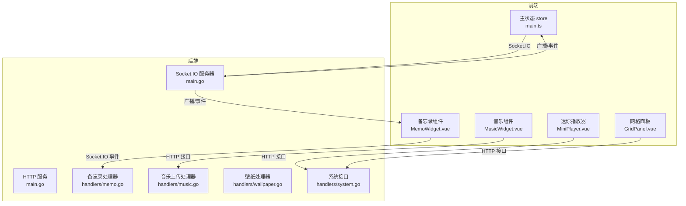
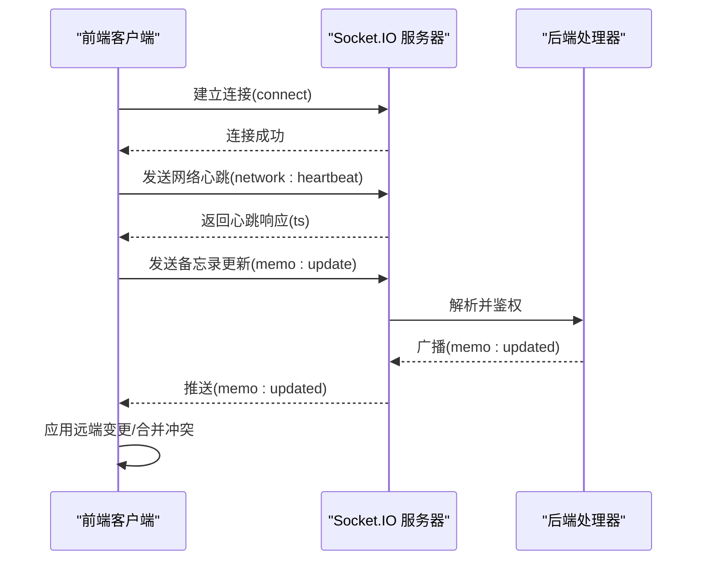
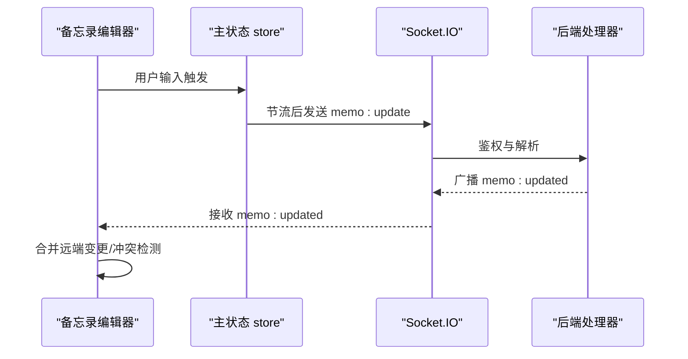
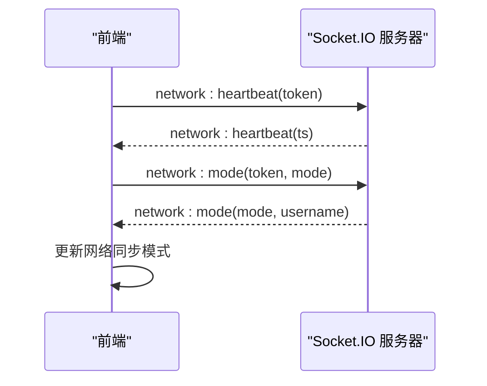
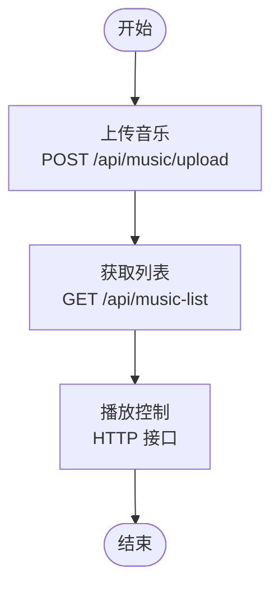
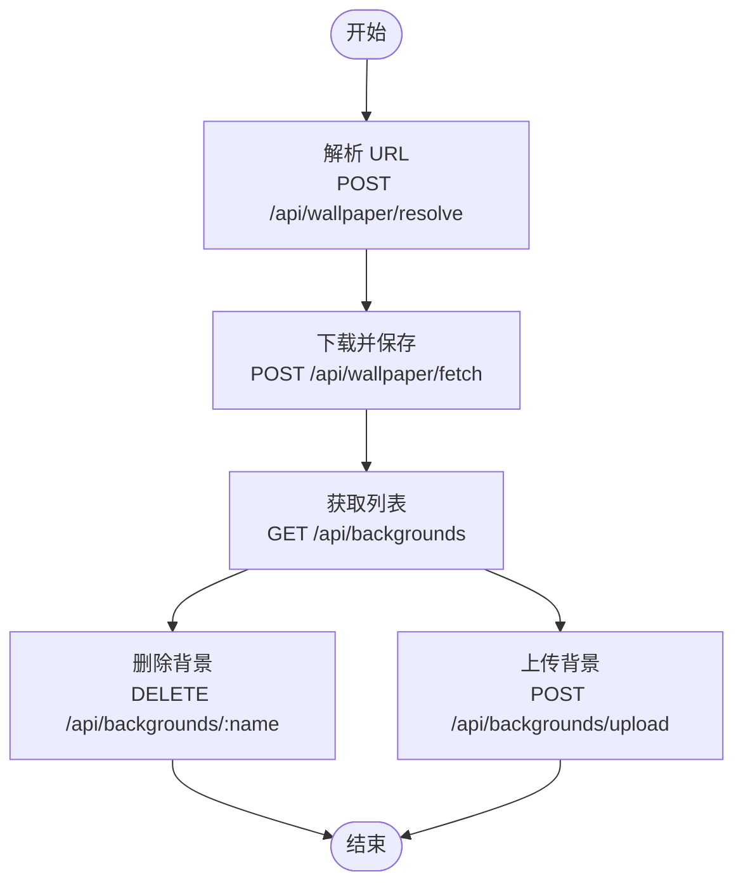
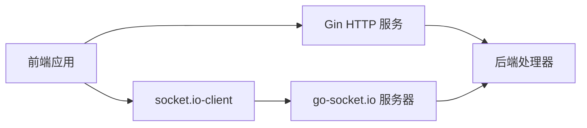

# 实时通信 API

<cite>
**本文档引用的文件**
- [backend/main.go](file://backend/main.go)
- [backend/handlers/memo.go](file://backend/handlers/memo.go)
- [backend/handlers/music.go](file://backend/handlers/music.go)
- [backend/handlers/wallpaper.go](file://backend/handlers/wallpaper.go)
- [backend/handlers/system.go](file://backend/handlers/system.go)
- [frontend/src/stores/main.ts](file://frontend/src/stores/main.ts)
- [frontend/src/components/MemoWidget.vue](file://frontend/src/components/MemoWidget.vue)
- [frontend/src/components/MusicWidget.vue](file://frontend/src/components/MusicWidget.vue)
- [frontend/src/components/MiniPlayer.vue](file://frontend/src/components/MiniPlayer.vue)
- [frontend/src/components/GridPanel.vue](file://frontend/src/components/GridPanel.vue)
</cite>

## 目录
1. [简介](#简介)
2. [项目结构](#项目结构)
3. [核心组件](#核心组件)
4. [架构总览](#架构总览)
5. [详细组件分析](#详细组件分析)
6. [依赖分析](#依赖分析)
7. [性能考虑](#性能考虑)
8. [故障排除指南](#故障排除指南)
9. [结论](#结论)

## 简介
本文件为 OFlatNas 实时通信系统的完整 API 文档，聚焦 WebSocket 连接、Socket.IO 事件与实时数据同步接口。内容涵盖组件状态同步、图标管理、音乐播放控制、备忘录协作、壁纸轮播等功能的实时接口定义，包括连接建立、消息格式、事件类型、数据同步协议、连接状态管理、重连机制与错误处理策略，并提供实际的实时通信示例与缓存一致性保障机制说明。

## 项目结构
- 后端基于 Go 语言，使用 Gin 框架与 go-socket.io 提供实时通信能力，统一暴露 /socket.io/* 路由。
- 前端基于 Vue 3 + Pinia，使用 socket.io-client 建立长连接，结合 HTTP 轮询作为兜底方案。
- 实时通信涉及两类通道：
  - Socket.IO 事件通道：用于低延迟的实时协作与状态广播。
  - HTTP 接口通道：用于数据持久化、查询与兜底同步。

图表来源
- [backend/main.go:94-114](file://backend/main.go#L94-L114)
- [frontend/src/stores/main.ts:30-36](file://frontend/src/stores/main.ts#L30-L36)

章节来源
- [backend/main.go:94-114](file://backend/main.go#L94-L114)
- [frontend/src/stores/main.ts:30-36](file://frontend/src/stores/main.ts#L30-L36)

## 核心组件
- Socket.IO 服务器与路由
  - 在后端通过 go-socket.io 创建服务器，绑定 /socket.io/* 路由，支持 polling 与 websocket 两种传输方式，启用跨域校验。
  - 统一注册事件处理器：memo、todo、network 等。
- 前端 Socket 客户端
  - 使用 socket.io-client，默认启用重连与传输顺序为 polling, websocket。
  - 主状态 store 统一维护连接状态、心跳、系统配置拉取与事件监听绑定。
- 实时协作组件
  - 备忘录组件：支持实时协作编辑、冲突检测与回滚。
  - 音乐组件：支持播放队列与播放控制的远程同步。
  - 迷你播放器：支持播放状态与切换歌曲的本地/远程同步。

章节来源
- [backend/main.go:94-114](file://backend/main.go#L94-L114)
- [frontend/src/stores/main.ts:30-36](file://frontend/src/stores/main.ts#L30-L36)
- [frontend/src/components/MemoWidget.vue:581-622](file://frontend/src/components/MemoWidget.vue#L581-L622)

## 架构总览
实时通信采用“Socket.IO 事件 + HTTP 兜底”的混合架构：
- 事件通道：用于高频、低延迟的协作与状态广播（如备忘录协同、网络模式广播）。
- HTTP 通道：用于数据持久化、查询与兜底同步（如备忘录保存、音乐列表获取）。

图表来源
- [backend/handlers/memo.go:25-38](file://backend/handlers/memo.go#L25-L38)
- [backend/handlers/memo.go:84-95](file://backend/handlers/memo.go#L84-L95)
- [frontend/src/stores/main.ts:58-96](file://frontend/src/stores/main.ts#L58-L96)
- [frontend/src/components/MemoWidget.vue:581-622](file://frontend/src/components/MemoWidget.vue#L581-L622)

## 详细组件分析

### 备忘录实时协作
- 事件定义
  - 客户端发送：memo:update
  - 服务端广播：memo:updated
- 数据模型
  - 更新负载包含 token、widgetId、content。
  - 广播负载包含 widgetId、content。
- 冲突处理
  - 前端维护 serverTs 与本地内容，冲突时弹窗提示并允许用户选择本地或远端版本。
  - 支持智能冲突检测：若仅布局/分组/配置变化而内容未变，可静默同步。
- 同步策略
  - 在 LAN 模式下优先使用 Socket.IO 事件进行广播；在弱网/隧道环境下回退至 HTTP 轮询。
  - 输入冷却与节流：避免频繁广播，提升网络效率。

图表来源
- [backend/handlers/memo.go:25-38](file://backend/handlers/memo.go#L25-L38)
- [frontend/src/components/MemoWidget.vue:581-622](file://frontend/src/components/MemoWidget.vue#L581-L622)
- [frontend/src/components/MemoWidget.vue:493-511](file://frontend/src/components/MemoWidget.vue#L493-L511)

章节来源
- [backend/handlers/memo.go:13-38](file://backend/handlers/memo.go#L13-L38)
- [frontend/src/components/MemoWidget.vue:493-511](file://frontend/src/components/MemoWidget.vue#L493-L511)
- [frontend/src/components/MemoWidget.vue:308-462](file://frontend/src/components/MemoWidget.vue#L308-L462)

### 网络模式与心跳
- 事件定义
  - 客户端发送：network:mode、network:heartbeat
  - 服务端广播/响应：network:mode、network:heartbeat
- 功能说明
  - network:mode：切换网络模式（auto、lan、wan、latency），服务端广播给所有连接方。
  - network:heartbeat：客户端定期发送心跳，服务端返回时间戳，用于判断连接健康与网络质量。
- 前端策略
  - 根据心跳结果动态调整同步策略（如切换 LAN/WAN/弱网模式）。
  - 在弱网模式下降低心跳频率，减少请求压力。

图表来源
- [backend/handlers/memo.go:66-95](file://backend/handlers/memo.go#L66-L95)
- [frontend/src/stores/main.ts:58-96](file://frontend/src/stores/main.ts#L58-L96)
- [frontend/src/stores/main.ts:444-467](file://frontend/src/stores/main.ts#L444-L467)

章节来源
- [backend/handlers/memo.go:57-95](file://backend/handlers/memo.go#L57-L95)
- [frontend/src/stores/main.ts:437-467](file://frontend/src/stores/main.ts#L437-L467)

### 音乐播放控制
- HTTP 接口
  - 上传音乐：POST /api/music/upload（受鉴权保护）
  - 获取音乐列表：GET /api/music-list（公开）
- 组件行为
  - 音乐组件通过 HTTP 接口获取播放队列与播放状态，支持播放/暂停/切换歌曲等操作。
  - 迷你播放器负责基础播放控制与自动播放手势处理。

图表来源
- [backend/handlers/music.go:13-55](file://backend/handlers/music.go#L13-L55)
- [backend/handlers/system.go:594-619](file://backend/handlers/system.go#L594-L619)
- [frontend/src/components/MusicWidget.vue:223-326](file://frontend/src/components/MusicWidget.vue#L223-L326)
- [frontend/src/components/MiniPlayer.vue:46-103](file://frontend/src/components/MiniPlayer.vue#L46-L103)

章节来源
- [backend/handlers/music.go:13-55](file://backend/handlers/music.go#L13-L55)
- [backend/handlers/system.go:594-619](file://backend/handlers/system.go#L594-L619)
- [frontend/src/components/MusicWidget.vue:223-326](file://frontend/src/components/MusicWidget.vue#L223-L326)
- [frontend/src/components/MiniPlayer.vue:46-103](file://frontend/src/components/MiniPlayer.vue#L46-L103)

### 壁纸轮播与背景管理
- HTTP 接口
  - 解析壁纸 URL：POST /api/wallpaper/resolve
  - 下载并保存壁纸：POST /api/wallpaper/fetch
  - 列表查询：GET /api/backgrounds、GET /api/mobile_backgrounds
  - 删除背景：DELETE /api/backgrounds/:name、DELETE /api/mobile_backgrounds/:name
  - 上传背景：POST /api/backgrounds/upload、POST /api/mobile_backgrounds/upload
- 组件行为
  - 前端通过这些接口获取/管理壁纸列表，实现轮播与切换。

图表来源
- [backend/handlers/wallpaper.go:22-143](file://backend/handlers/wallpaper.go#L22-L143)
- [backend/handlers/wallpaper.go:145-267](file://backend/handlers/wallpaper.go#L145-L267)

章节来源
- [backend/handlers/wallpaper.go:18-143](file://backend/handlers/wallpaper.go#L18-L143)
- [backend/handlers/wallpaper.go:145-267](file://backend/handlers/wallpaper.go#L145-L267)

### 系统状态与网络检测
- HTTP 接口
  - 获取系统统计：GET /api/system-stats
  - 获取公网 IP：GET /api/ip
  - Ping 检测：GET /api/ping
  - RTT 测量：GET /api/rtt
- 组件行为
  - 前端通过这些接口进行网络质量检测与系统监控，辅助实时同步策略调整。

章节来源
- [backend/handlers/system.go:51-203](file://backend/handlers/system.go#L51-L203)
- [backend/handlers/system.go:274-465](file://backend/handlers/system.go#L274-L465)
- [backend/handlers/system.go:534-592](file://backend/handlers/system.go#L534-L592)
- [backend/handlers/system.go:621-628](file://backend/handlers/system.go#L621-L628)

## 依赖分析
- 后端依赖
  - go-socket.io：提供 Socket.IO 服务器与事件处理。
  - Gin：提供 HTTP 路由与中间件（CORS、Gzip、鉴权等）。
- 前端依赖
  - socket.io-client：WebSocket/Polling 客户端。
  - Pinia：状态管理，集中维护连接状态、心跳与系统配置。
  - Vue 3：组件化 UI，配合实时组件实现协作与同步。

图表来源
- [backend/main.go:15-23](file://backend/main.go#L15-L23)
- [frontend/src/stores/main.ts:4-6](file://frontend/src/stores/main.ts#L4-L6)

章节来源
- [backend/main.go:15-23](file://backend/main.go#L15-L23)
- [frontend/src/stores/main.ts:4-6](file://frontend/src/stores/main.ts#L4-L6)

## 性能考虑
- 传输优化
  - 后端启用 Gzip 压缩，降低网络传输体积。
  - Socket.IO 同时支持 polling 与 websocket，自动选择最优传输方式。
- 心跳与重连
  - 前端周期性发送 network:heartbeat，服务端返回时间戳，用于判断连接健康。
  - 弱网模式下降低心跳频率，减少请求压力。
- 同步策略
  - LAN 模式优先使用 Socket.IO 事件广播；弱网/隧道场景回退 HTTP 轮询。
  - 备忘录组件采用输入冷却与节流，避免频繁广播。
- 缓存与一致性
  - 前端维护本地缓存与服务端快照，冲突时进行智能检测与提示，保证最终一致性。

## 故障排除指南
- 连接问题
  - 检查 CORS 配置与 Origin 校验，确保前端域名在允许列表中。
  - 确认 /socket.io/* 路由映射正确，避免静态资源拦截。
- 心跳与重连
  - 若 network:heartbeat 未收到响应，检查网络状况与代理设置。
  - 前端重连参数可调（reconnectionAttempts 等），观察日志定位问题。
- 冲突与同步
  - 备忘录冲突时，按提示选择本地或远端版本；若内容一致，可静默同步。
  - 若 HTTP 轮询失败，检查鉴权头与超时设置。
- 音乐与壁纸
  - 上传失败时检查文件类型与大小限制，确认鉴权与权限。
  - 壁纸下载失败时检查 URL 协议与目标主机白名单。

章节来源
- [backend/main.go:67-77](file://backend/main.go#L67-L77)
- [frontend/src/stores/main.ts:58-101](file://frontend/src/stores/main.ts#L58-L101)
- [frontend/src/components/MemoWidget.vue:308-462](file://frontend/src/components/MemoWidget.vue#L308-L462)
- [backend/handlers/music.go:13-55](file://backend/handlers/music.go#L13-L55)
- [backend/handlers/wallpaper.go:22-143](file://backend/handlers/wallpaper.go#L22-L143)

## 结论
OFlatNas 的实时通信体系通过 Socket.IO 与 HTTP 接口的协同，实现了高效、可靠的多组件实时同步。备忘录协作、音乐播放控制、壁纸管理等功能均具备完善的事件协议、冲突处理与兜底策略。建议在复杂网络环境中优先启用 LAN 模式，在弱网场景下合理利用 HTTP 轮询与心跳降级策略，以获得最佳用户体验。