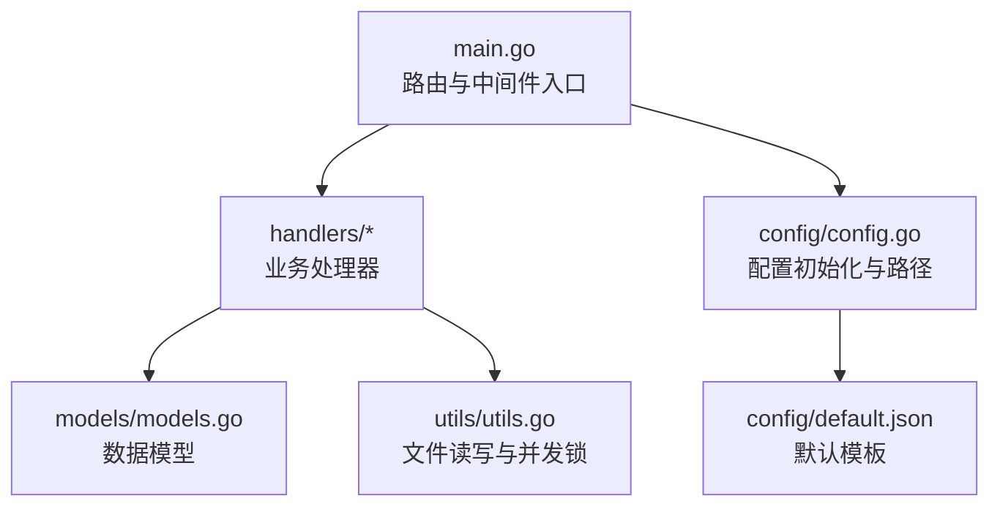
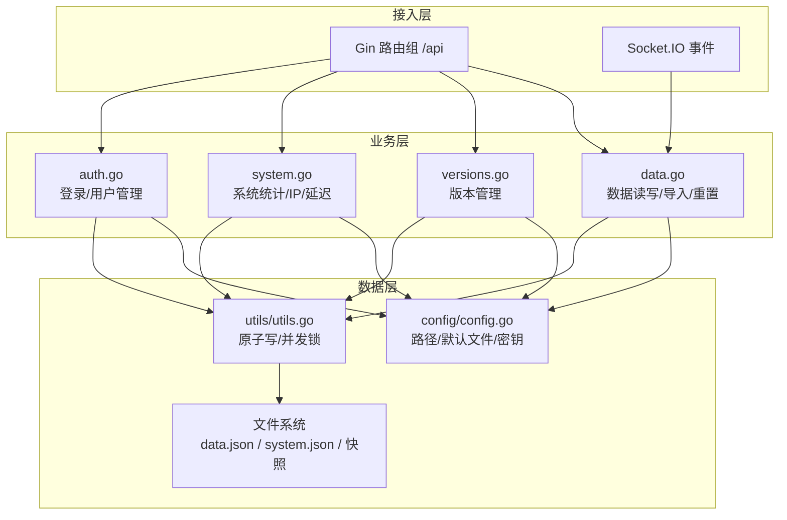
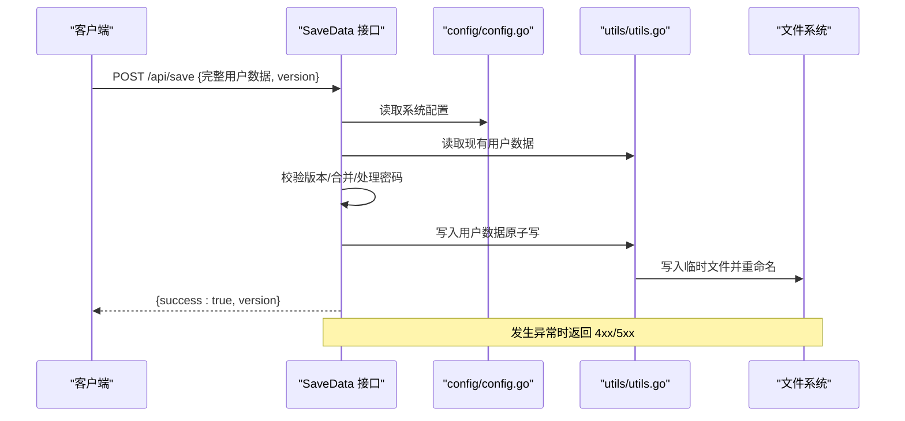
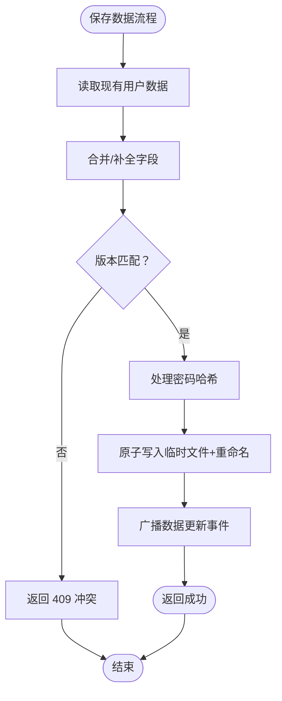
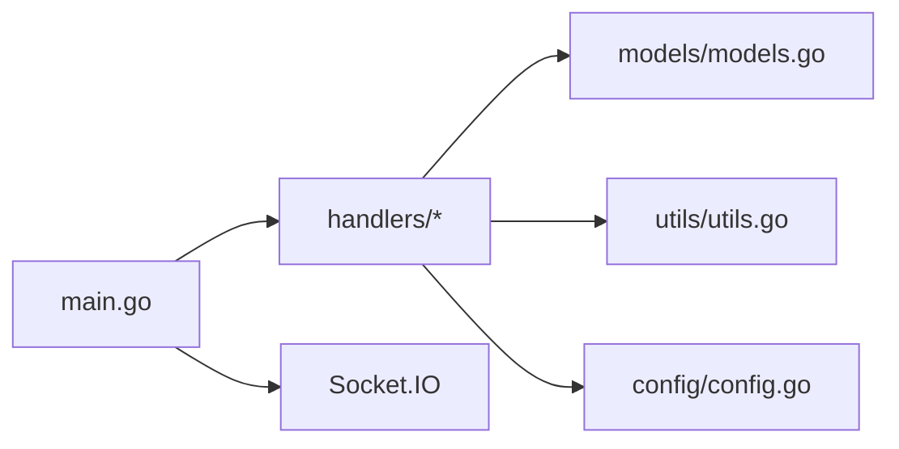

# 数据管理 API

<cite>
**本文引用的文件**
- [backend/main.go](file://backend/main.go)
- [backend/config/config.go](file://backend/config/config.go)
- [backend/config/default.json](file://backend/config/default.json)
- [backend/handlers/data.go](file://backend/handlers/data.go)
- [backend/handlers/versions.go](file://backend/handlers/versions.go)
- [backend/handlers/system.go](file://backend/handlers/system.go)
- [backend/handlers/auth.go](file://backend/handlers/auth.go)
- [backend/models/models.go](file://backend/models/models.go)
- [backend/utils/utils.go](file://backend/utils/utils.go)
</cite>

## 目录
1. [简介](#简介)
2. [项目结构](#项目结构)
3. [核心组件](#核心组件)
4. [架构总览](#架构总览)
5. [详细组件分析](#详细组件分析)
6. [依赖分析](#依赖分析)
7. [性能考虑](#性能考虑)
8. [故障排查指南](#故障排查指南)
9. [结论](#结论)
10. [附录](#附录)

## 简介
本文件为 OFlatNas 数据管理系统提供的完整 API 文档，覆盖配置文件读写、数据导入导出、版本控制与回滚、系统配置管理、用户数据存储、备份恢复、以及数据持久化实现原理与最佳实践。文档面向开发者与运维人员，提供接口定义、请求参数、响应格式、数据结构说明、数据校验规则、错误处理机制，并给出典型使用场景与排障建议。

## 项目结构
后端采用 Gin 框架，路由在主程序中集中注册；配置初始化在 config 包完成；业务逻辑集中在 handlers；模型定义在 models；工具函数在 utils；默认模板在 config/default.json。

图表来源
- [backend/main.go:165-254](file://backend/main.go#L165-L254)
- [backend/config/config.go:35-86](file://backend/config/config.go#L35-L86)
- [backend/handlers/data.go:159-322](file://backend/handlers/data.go#L159-L322)
- [backend/models/models.go:1-118](file://backend/models/models.go#L1-L118)
- [backend/utils/utils.go:57-76](file://backend/utils/utils.go#L57-L76)

章节来源
- [backend/main.go:165-254](file://backend/main.go#L165-L254)
- [backend/config/config.go:35-86](file://backend/config/config.go#L35-L86)

## 核心组件
- 配置管理
  - 初始化系统配置与默认模板，确保关键数据文件存在
  - 提供系统配置读取与更新接口
- 用户数据管理
  - 获取用户数据、保存数据、导入数据、重置数据
  - 支持单用户/多用户模式下的数据隔离
- 版本控制与回滚
  - 保存配置快照、列出快照、按 ID 回滚、删除快照
- 文件与静态资源
  - 静态文件服务、缩略图生成与预览、上传分片与合并
- 系统状态与工具
  - 系统统计、公网 IP 查询、延迟检测、音乐列表
- 安全与认证
  - 登录、用户管理（增删）、JWT 鉴权

章节来源
- [backend/config/config.go:102-151](file://backend/config/config.go#L102-L151)
- [backend/handlers/data.go:638-744](file://backend/handlers/data.go#L638-L744)
- [backend/handlers/versions.go:33-184](file://backend/handlers/versions.go#L33-L184)
- [backend/handlers/system.go:51-203](file://backend/handlers/system.go#L51-L203)
- [backend/handlers/auth.go:18-114](file://backend/handlers/auth.go#L18-L114)

## 架构总览
后端通过 Gin 路由注册各类 API，统一启用日志、恢复、Gzip 压缩与跨域策略；Socket.IO 提供实时事件推送；配置模块负责目录与默认文件初始化；处理器层负责业务编排与数据持久化；工具层提供原子写入与并发锁保障。

图表来源
- [backend/main.go:165-254](file://backend/main.go#L165-L254)
- [backend/handlers/data.go:159-322](file://backend/handlers/data.go#L159-L322)
- [backend/handlers/versions.go:78-124](file://backend/handlers/versions.go#L78-L124)
- [backend/handlers/system.go:51-203](file://backend/handlers/system.go#L51-L203)
- [backend/handlers/auth.go:18-114](file://backend/handlers/auth.go#L18-L114)
- [backend/config/config.go:35-86](file://backend/config/config.go#L35-L86)
- [backend/utils/utils.go:57-76](file://backend/utils/utils.go#L57-L76)

## 详细组件分析

### 配置文件读写接口
- GET /api/system-config
  - 功能：读取系统配置
  - 认证：可选
  - 响应：系统配置对象
- POST /api/system-config
  - 功能：更新系统配置
  - 认证：必需
  - 请求体：系统配置字段（如 authMode、enableDocker）
  - 响应：成功/失败
- GET /api/config/proxy-status
  - 功能：代理状态查询
  - 认证：可选
  - 响应：布尔或状态对象
- GET /api/custom-scripts
  - 功能：读取自定义脚本（CSS/JS）
  - 认证：可选
  - 响应：{ css: [], js: [] }
- POST /api/custom-scripts
  - 功能：保存自定义脚本
  - 认证：必需
  - 请求体：{ css: [], js: [] }
  - 响应：成功/失败

章节来源
- [backend/main.go:169-179](file://backend/main.go#L169-L179)
- [backend/handlers/system.go:205-272](file://backend/handlers/system.go#L205-L272)

### 数据导入导出与版本控制
- GET /api/data
  - 功能：获取用户数据（支持访客过滤与敏感字段清理）
  - 认证：可选
  - 响应：用户数据 + systemConfig + version
- GET /api/version
  - 功能：获取当前版本号
  - 认证：可选
  - 响应：{ version: number }
- POST /api/save
  - 功能：保存/更新用户数据（含版本冲突检测）
  - 认证：必需
  - 请求体：完整用户数据（包含 groups、widgets、appConfig 等）
  - 响应：{ success: true, version: number }
- POST /api/data/import
  - 功能：导入 JSON 配置（复用保存逻辑）
  - 认证：必需
  - 请求体：同上
  - 响应：同保存
- POST /api/default/save
  - 功能：将当前用户数据保存为默认模板
  - 认证：必需
  - 响应：成功/失败
- POST /api/reset
  - 功能：以默认模板重置当前用户数据
  - 认证：必需
  - 响应：成功/失败
- GET /api/config-versions
  - 功能：列出配置快照
  - 认证：必需
  - 响应：{ versions: [ { id, label, createdAt, size } ] }
- POST /api/config-versions
  - 功能：保存当前配置为快照
  - 认证：必需
  - 请求体：{ label: string }
  - 响应：成功/失败
- POST /api/config-versions/restore
  - 功能：按 ID 回滚到指定快照（保留密码与用户名）
  - 认证：必需
  - 请求体：{ id: string }
  - 响应：成功/失败
- DELETE /api/config-versions/:id
  - 功能：删除指定快照
  - 认证：必需
  - 参数：id
  - 响应：成功/失败

数据模型与字段说明
- 用户数据结构（节选）
  - groups: 数组，元素为分组对象
  - widgets: 数组，元素为挂件对象
  - appConfig: 应用配置对象
  - version: 数字版本号
  - username/password/created_at 等
- 分组与条目
  - 分组包含 items 数组，条目包含标题、URL、图标、是否公开等
- 挂件
  - type、enable、isPublic、data、layouts 等
- 应用配置
  - 背景、主题、搜索引擎、天气源、挂件区域尺寸等
- 系统配置
  - authMode: "single" 或 "multi"
  - enableDocker: 布尔
  - dockerHost: 可选

数据验证与错误处理
- 版本冲突：当客户端版本与服务器不一致时返回 409
- 密码处理：保存时自动哈希，读取时移除敏感字段
- 敏感字段清理：访客访问时移除 lanUrl、backupLanUrls、lanHost 等
- 并发安全：原子写入与文件级互斥锁，避免竞态

图表来源
- [backend/handlers/data.go:638-744](file://backend/handlers/data.go#L638-L744)
- [backend/config/config.go:102-151](file://backend/config/config.go#L102-L151)
- [backend/utils/utils.go:57-76](file://backend/utils/utils.go#L57-L76)

章节来源
- [backend/handlers/data.go:159-343](file://backend/handlers/data.go#L159-L343)
- [backend/handlers/data.go:746-788](file://backend/handlers/data.go#L746-L788)
- [backend/handlers/versions.go:33-205](file://backend/handlers/versions.go#L33-L205)
- [backend/models/models.go:1-118](file://backend/models/models.go#L1-L118)

### 系统配置管理与用户数据存储
- GET /api/admin/users
  - 功能：管理员查看所有用户
  - 认证：必需（admin）
  - 响应：{ users: [string] }
- POST /api/admin/users
  - 功能：新增用户
  - 认证：必需（admin）
  - 请求体：{ username, password }
  - 响应：成功/失败
- DELETE /api/admin/users/:usr
  - 功能：删除用户
  - 认证：必需（admin）
  - 参数：usr
  - 响应：成功/失败
- GET /api/system/stats
  - 功能：系统资源统计（CPU/内存/磁盘/网络/OS）
  - 认证：必需
  - 响应：{ success: true, data: {...} }
- GET /api/ip
  - 功能：公网 IP 与位置信息（支持刷新）
  - 认证：可选
  - 查询参数：refresh=1|true
  - 响应：{ success, ip, location, country, region, city, ... }
- GET /api/rtt
  - 功能：简单 RTT 时间戳
  - 认证：可选
  - 响应：{ success: true, time: number }
- GET /api/music-list
  - 功能：音乐文件列表
  - 认证：可选
  - 响应：字符串数组（相对路径）

章节来源
- [backend/handlers/auth.go:121-208](file://backend/handlers/auth.go#L121-L208)
- [backend/handlers/system.go:51-203](file://backend/handlers/system.go#L51-L203)
- [backend/handlers/system.go:349-465](file://backend/handlers/system.go#L349-L465)
- [backend/handlers/system.go:621-629](file://backend/handlers/system.go#L621-L629)
- [backend/handlers/system.go:594-619](file://backend/handlers/system.go#L594-L619)

### 备份恢复与数据持久化
- 默认模板与初始化
  - 若 data.json 不存在，使用嵌入的 default.json 初始化
  - 确保 system.json、amap_stats.json、visitors.json、custom_scripts.json、widget_cache.json 存在
- 数据持久化策略
  - 原子写入：先写临时文件再重命名，避免部分写入
  - 文件级互斥锁：同一文件并发写入串行化
  - 缓存：GetData 结果按文件修改时间缓存，降低读放大
- 备份与恢复
  - SaveDefault：将当前用户数据保存为默认模板
  - ResetData：以默认模板重置当前用户数据
  - 版本快照：保存/列出/回滚/删除

图表来源
- [backend/handlers/data.go:638-744](file://backend/handlers/data.go#L638-L744)
- [backend/utils/utils.go:43-55](file://backend/utils/utils.go#L43-L55)

章节来源
- [backend/config/config.go:153-180](file://backend/config/config.go#L153-L180)
- [backend/config/config.go:210-256](file://backend/config/config.go#L210-L256)
- [backend/utils/utils.go:57-76](file://backend/utils/utils.go#L57-L76)
- [backend/handlers/data.go:790-808](file://backend/handlers/data.go#L790-L808)

### 认证与安全
- POST /api/login
  - 功能：登录并签发 JWT
  - 请求体：{ username, password }
  - 响应：{ success: true, token, username }
- 中间件
  - OptionalAuthMiddleware：可选鉴权（用于 GET /api/data、/api/version 等）
  - AuthMiddleware：必需鉴权（受保护路由）

章节来源
- [backend/handlers/auth.go:18-114](file://backend/handlers/auth.go#L18-L114)
- [backend/main.go:165-254](file://backend/main.go#L165-L254)

## 依赖分析
- 组件耦合
  - handlers 依赖 config（路径/默认文件）、models（数据结构）、utils（文件操作）
  - main.go 注册路由并注入 Socket.IO 与中间件
- 外部依赖
  - Gin、Socket.IO、bcrypt、jwt、gopsutil（系统统计）
- 循环依赖
  - 未发现循环依赖

图表来源
- [backend/main.go:165-254](file://backend/main.go#L165-L254)
- [backend/handlers/data.go:159-322](file://backend/handlers/data.go#L159-L322)
- [backend/models/models.go:1-118](file://backend/models/models.go#L1-L118)
- [backend/utils/utils.go:57-76](file://backend/utils/utils.go#L57-L76)
- [backend/config/config.go:35-86](file://backend/config/config.go#L35-L86)

章节来源
- [backend/main.go:165-254](file://backend/main.go#L165-L254)
- [backend/handlers/data.go:159-322](file://backend/handlers/data.go#L159-L322)
- [backend/models/models.go:1-118](file://backend/models/models.go#L1-L118)
- [backend/utils/utils.go:57-76](file://backend/utils/utils.go#L57-L76)
- [backend/config/config.go:35-86](file://backend/config/config.go#L35-L86)

## 性能考虑
- 缓存
  - GetData 使用基于文件修改时间的只读缓存，显著降低读取开销
- 压缩
  - 启用 Gzip 压缩，减少内网/慢速网络传输体积
- 原子写入
  - 通过临时文件+重命名避免部分写入与并发冲突
- 系统统计
  - CPU/网络速率计算带锁与去抖动，避免频繁计算
- 超时与慢请求告警
  - 登录与保存接口设置合理超时；SaveData 对慢请求进行日志告警

## 故障排查指南
- 401 未授权
  - 确认已登录并携带有效 JWT；受保护路由需 AuthMiddleware
- 409 版本冲突
  - 客户端版本与服务器不一致，请先拉取最新数据再提交
- 500 写入失败
  - 检查磁盘空间与权限；确认目标文件未被外部进程占用
- 公网 IP 查询失败
  - 检查网络连通性与 ip-api.com 可达性；可使用 refresh=true 强制刷新
- Socket.IO 连接失败
  - 检查 CORS 配置与 Origin 白名单；确认 /socket.io/* 路由正确转发

章节来源
- [backend/handlers/data.go:675-678](file://backend/handlers/data.go#L675-L678)
- [backend/handlers/system.go:349-465](file://backend/handlers/system.go#L349-L465)
- [backend/main.go:48-77](file://backend/main.go#L48-L77)

## 结论
本 API 体系围绕“配置即代码”的理念设计，提供从系统配置、用户数据、版本快照到系统状态的全链路能力。通过原子写入、并发锁、缓存与压缩等手段，在保证数据一致性的同时兼顾性能与可靠性。建议在生产环境中结合快照策略与备份流程，确保可回滚与可恢复。

## 附录

### API 一览表（按功能分组）
- 配置管理
  - GET /api/system-config
  - POST /api/system-config
  - GET /api/config/proxy-status
  - GET /api/custom-scripts
  - POST /api/custom-scripts
- 数据管理
  - GET /api/data
  - GET /api/version
  - POST /api/save
  - POST /api/data/import
  - POST /api/default/save
  - POST /api/reset
- 版本控制
  - GET /api/config-versions
  - POST /api/config-versions
  - POST /api/config-versions/restore
  - DELETE /api/config-versions/:id
- 系统与工具
  - GET /api/system/stats
  - GET /api/ip
  - GET /api/rtt
  - GET /api/music-list
- 认证与用户
  - POST /api/login
  - GET /api/admin/users
  - POST /api/admin/users
  - DELETE /api/admin/users/:usr

### 数据结构参考
- 用户数据（简化）
  - groups: [{ id, title, items: [...] }]
  - widgets: [{ id, type, enable, isPublic, data, layouts?, x,y,w,h,colSpan,rowSpan? }]
  - appConfig: { background, mobileBackground, wallpaperConfig, theme, customCss, customJs, ... }
  - version: number
- 系统配置
  - authMode: "single" | "multi"
  - enableDocker: boolean
  - dockerHost?: string
- 版本快照
  - id: string
  - label: string
  - createdAt: number
  - data: object（用户数据）

章节来源
- [backend/models/models.go:1-118](file://backend/models/models.go#L1-L118)
- [backend/config/default.json:1-147](file://backend/config/default.json#L1-L147)