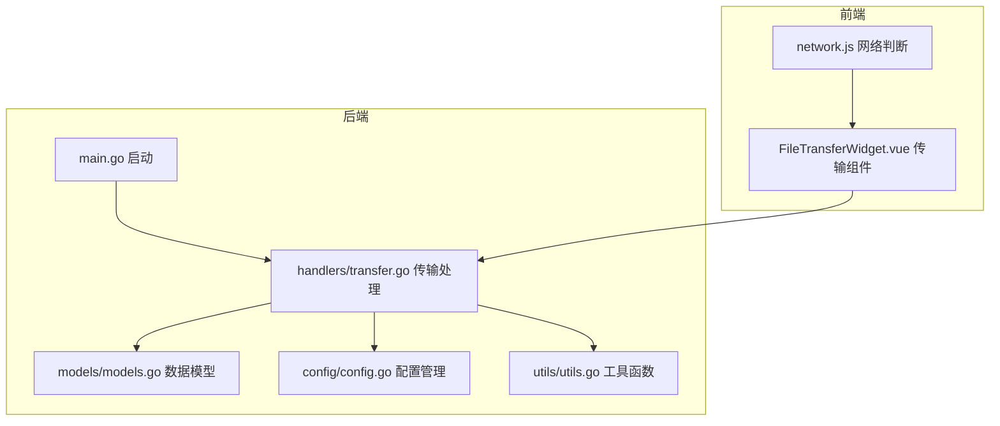
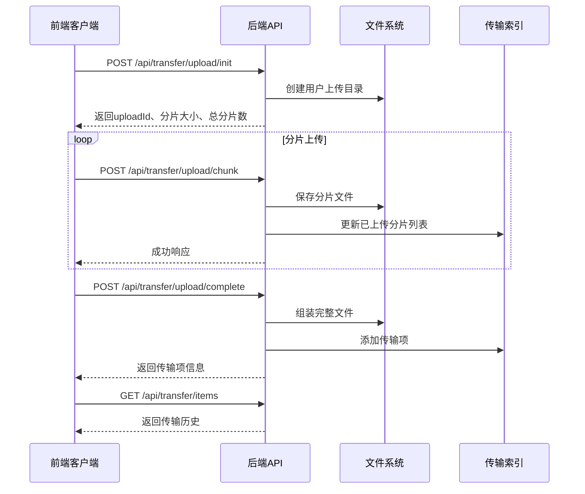
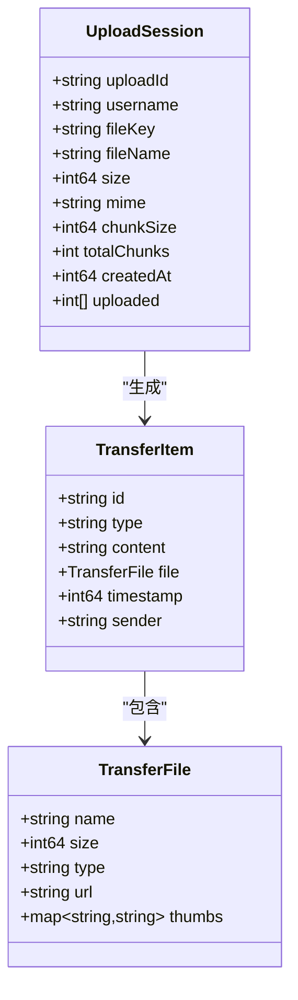
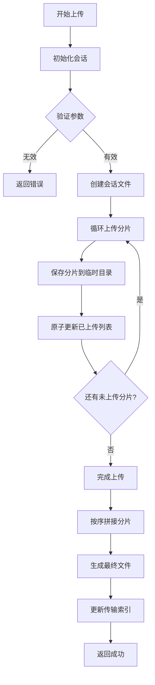
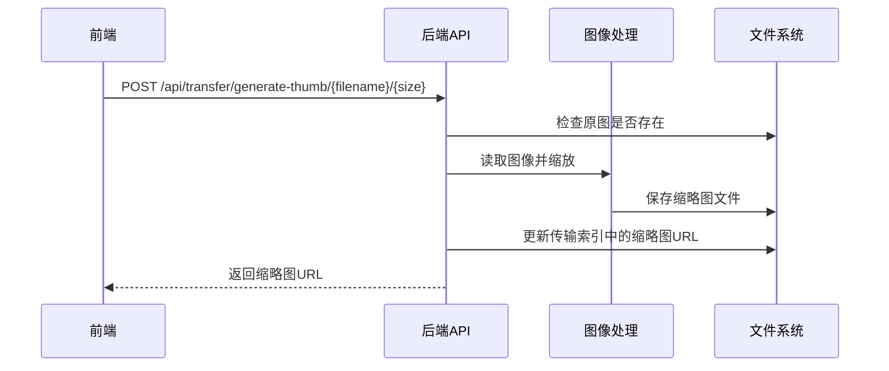
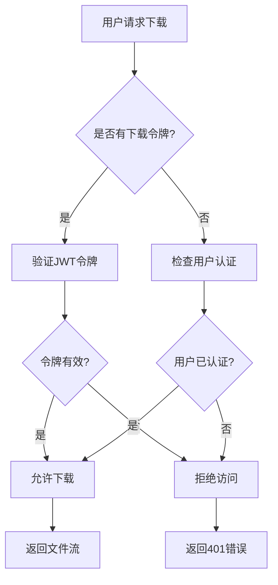
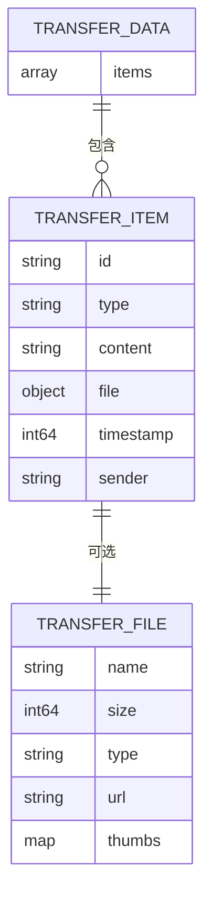
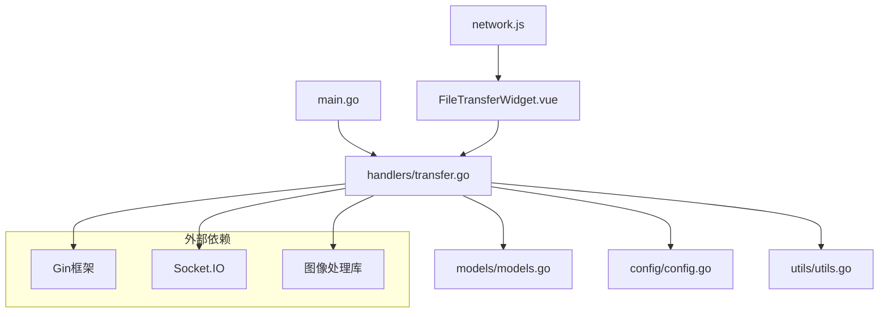

# 文件传输 API

<cite>
**本文档引用的文件**
- [main.go](file://backend/main.go)
- [transfer.go](file://backend/handlers/transfer.go)
- [transfer_test.go](file://backend/handlers/transfer_test.go)
- [models.go](file://backend/models/models.go)
- [config.go](file://backend/config/config.go)
- [utils.go](file://backend/utils/utils.go)
- [FileTransferWidget.vue](file://frontend/src/components/FileTransferWidget.vue)
- [network.js](file://frontend/src/utils/network.js)
</cite>

## 目录
1. [简介](#简介)
2. [项目结构](#项目结构)
3. [核心组件](#核心组件)
4. [架构概览](#架构概览)
5. [详细组件分析](#详细组件分析)
6. [依赖分析](#依赖分析)
7. [性能考虑](#性能考虑)
8. [故障排除指南](#故障排除指南)
9. [结论](#结论)
10. [附录](#附录)

## 简介
本文件传输系统基于 Gin 框架构建，提供完整的文件上传、下载、断点续传、进度查询、缩略图生成与管理功能。系统采用分片上传策略，支持并发控制与错误恢复，适用于大文件传输场景。前端通过 Vue 组件实现用户交互，后端提供 RESTful API 和 Socket.IO 实时通知。

## 项目结构
后端采用分层架构：
- handlers 层：业务逻辑处理（文件传输、缩略图、索引管理）
- models 层：数据模型定义（传输项、文件信息）
- config 层：配置管理（目录路径、密钥）
- utils 层：通用工具（文件锁、JSON 操作）

**图表来源**
- [main.go:1-267](file://backend/main.go#L1-L267)
- [transfer.go:1-968](file://backend/handlers/transfer.go#L1-L968)
- [models.go:1-118](file://backend/models/models.go#L1-L118)
- [config.go:1-257](file://backend/config/config.go#L1-L257)
- [utils.go:1-76](file://backend/utils/utils.go#L1-L76)
- [FileTransferWidget.vue:1-1801](file://frontend/src/components/FileTransferWidget.vue#L1-L1801)
- [network.js:1-176](file://frontend/src/utils/network.js#L1-L176)

**章节来源**
- [main.go:1-267](file://backend/main.go#L1-L267)
- [transfer.go:1-968](file://backend/handlers/transfer.go#L1-L968)
- [models.go:1-118](file://backend/models/models.go#L1-L118)
- [config.go:1-257](file://backend/config/config.go#L1-L257)
- [utils.go:1-76](file://backend/utils/utils.go#L1-L76)
- [FileTransferWidget.vue:1-1801](file://frontend/src/components/FileTransferWidget.vue#L1-L1801)
- [network.js:1-176](file://frontend/src/utils/network.js#L1-L176)

## 核心组件
- 传输处理器：负责分片上传、断点续传、文件组装、索引更新
- 缩略图服务：支持多种尺寸缩略图生成与缓存
- 索引管理：维护传输历史、文件元数据
- 认证与授权：JWT 下载令牌、会话权限验证
- 并发控制：文件锁、队列管理、最大并发限制

**章节来源**
- [transfer.go:1-968](file://backend/handlers/transfer.go#L1-L968)
- [models.go:98-118](file://backend/models/models.go#L98-L118)
- [utils.go:9-21](file://backend/utils/utils.go#L9-L21)

## 架构概览
系统采用前后端分离架构，后端提供 RESTful API，前端通过 WebSocket 实时接收传输状态更新。

**图表来源**
- [transfer.go:331-580](file://backend/handlers/transfer.go#L331-L580)
- [FileTransferWidget.vue:649-764](file://frontend/src/components/FileTransferWidget.vue#L649-L764)

## 详细组件分析

### 传输处理器
传输处理器实现了完整的分片上传流程，包括初始化、分片上传、完成合并和错误恢复。

**图表来源**
- [transfer.go:318-329](file://backend/handlers/transfer.go#L318-L329)
- [models.go:98-117](file://backend/models/models.go#L98-L117)

#### 分片上传流程
1. 初始化阶段：验证请求参数，计算分片数量，创建会话文件
2. 上传阶段：保存分片到临时目录，原子性更新已上传分片列表
3. 完成阶段：按顺序拼接所有分片，生成文件并更新索引

**图表来源**
- [transfer.go:331-580](file://backend/handlers/transfer.go#L331-L580)

**章节来源**
- [transfer.go:318-580](file://backend/handlers/transfer.go#L318-L580)
- [transfer_test.go:1-23](file://backend/handlers/transfer_test.go#L1-L23)

### 缩略图生成系统
系统支持自动缩略图生成，包括64×64、128×128、256×256三种尺寸。

**图表来源**
- [transfer.go:724-794](file://backend/handlers/transfer.go#L724-L794)

#### 缩略图处理特性
- 自动检测图像类型并解码
- 智能缩放算法保证质量
- 多尺寸缓存策略
- 支持增量生成和批量重建

**章节来源**
- [transfer.go:140-198](file://backend/handlers/transfer.go#L140-L198)
- [transfer.go:724-871](file://backend/handlers/transfer.go#L724-L871)

### 下载与访问控制
系统提供安全的文件下载机制，支持基于 JWT 的一次性下载令牌。

**图表来源**
- [transfer.go:582-622](file://backend/handlers/transfer.go#L582-L622)
- [transfer.go:673-720](file://backend/handlers/transfer.go#L673-L720)

**章节来源**
- [transfer.go:582-720](file://backend/handlers/transfer.go#L582-L720)

### 传输索引管理
系统维护一个 JSON 格式的传输索引文件，记录所有传输历史和文件元数据。

**图表来源**
- [models.go:115-118](file://backend/models/models.go#L115-L118)
- [models.go:98-117](file://backend/models/models.go#L98-L117)

**章节来源**
- [models.go:98-118](file://backend/models/models.go#L98-L118)
- [transfer.go:200-280](file://backend/handlers/transfer.go#L200-L280)

## 依赖分析
系统依赖关系清晰，模块间耦合度低，便于维护和扩展。

**图表来源**
- [main.go:1-267](file://backend/main.go#L1-L267)
- [transfer.go:1-968](file://backend/handlers/transfer.go#L1-L968)
- [models.go:1-118](file://backend/models/models.go#L1-L118)
- [config.go:1-257](file://backend/config/config.go#L1-L257)
- [utils.go:1-76](file://backend/utils/utils.go#L1-L76)
- [FileTransferWidget.vue:1-1801](file://frontend/src/components/FileTransferWidget.vue#L1-L1801)
- [network.js:1-176](file://frontend/src/utils/network.js#L1-L176)

**章节来源**
- [main.go:1-267](file://backend/main.go#L1-L267)
- [transfer.go:1-968](file://backend/handlers/transfer.go#L1-L968)

## 性能考虑
系统在设计时充分考虑了性能优化：

### 存储策略
- 分片上传避免大文件一次性写入
- 原子文件操作确保数据一致性
- 缓存机制减少重复计算

### 并发控制
- 文件锁防止竞态条件
- 最大并发限制避免资源耗尽
- 进度跟踪实时反馈

### 网络优化
- Gzip 压缩减少传输体积
- CDN 友好 URL 结构
- 条件请求支持缓存

## 故障排除指南
常见问题及解决方案：

### 上传失败
- 检查网络连接稳定性
- 验证磁盘空间充足
- 确认文件权限正确

### 断点续传异常
- 检查会话文件完整性
- 验证分片索引一致性
- 清理临时文件后重试

### 缩略图生成失败
- 确认图像格式受支持
- 检查内存使用情况
- 验证输出目录权限

**章节来源**
- [transfer.go:430-467](file://backend/handlers/transfer.go#L430-L467)
- [transfer.go:890-967](file://backend/handlers/transfer.go#L890-L967)

## 结论
OFlatNas 文件传输系统提供了完整的文件传输解决方案，具有以下优势：
- 支持大文件分片上传，具备良好的可扩展性
- 提供断点续传和错误恢复机制
- 内置缩略图生成功能，提升用户体验
- 采用安全的访问控制和认证机制
- 前后端分离架构，便于维护和扩展

系统适合企业内部文件共享、媒体资产管理等场景，可通过配置调整满足不同规模的需求。

## 附录

### API 接口定义

#### 传输管理
- `POST /api/transfer/upload/init` - 初始化分片上传
- `POST /api/transfer/upload/chunk` - 上传单个分片
- `POST /api/transfer/upload/complete` - 完成分片合并
- `GET /api/transfer/items` - 获取传输历史
- `DELETE /api/transfer/items/:id` - 删除传输项

#### 文件操作
- `GET /api/transfer/file/:filename` - 下载文件
- `GET /api/transfer/thumb/:filename/:size` - 获取缩略图
- `POST /api/transfer/download-token` - 生成下载令牌

#### 缩略图管理
- `POST /api/transfer/generate-thumb/:filename/:size` - 生成指定尺寸缩略图
- `POST /api/transfer/regenerate-thumbs` - 批量重建缩略图

**章节来源**
- [main.go:237-247](file://backend/main.go#L237-L247)
- [transfer.go:582-794](file://backend/handlers/transfer.go#L582-L794)

### 前端集成示例
前端组件实现了完整的文件传输功能，包括拖拽上传、进度显示、批量操作等。

**章节来源**
- [FileTransferWidget.vue:649-764](file://frontend/src/components/FileTransferWidget.vue#L649-L764)
- [network.js:1-176](file://frontend/src/utils/network.js#L1-L176)