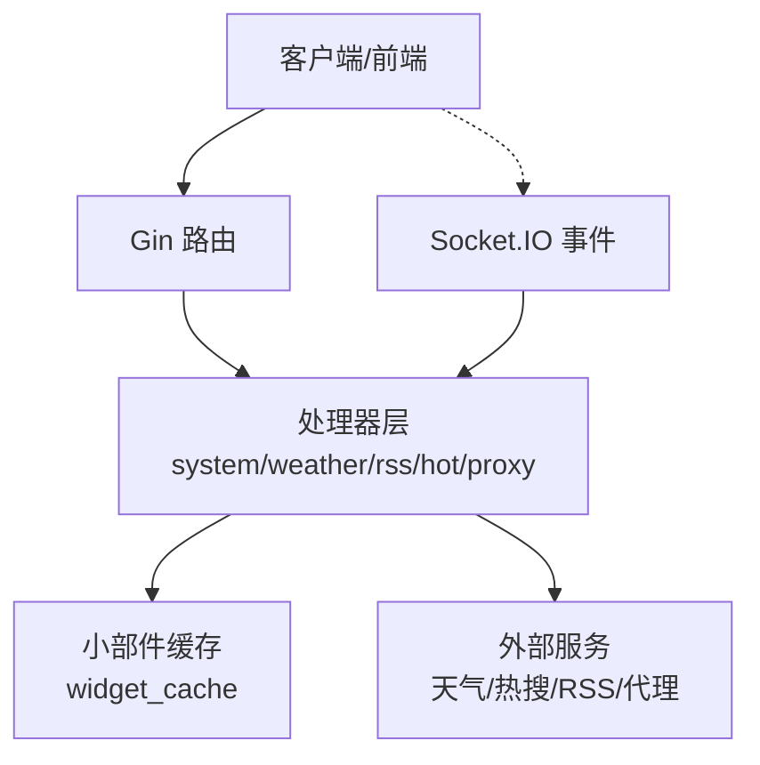
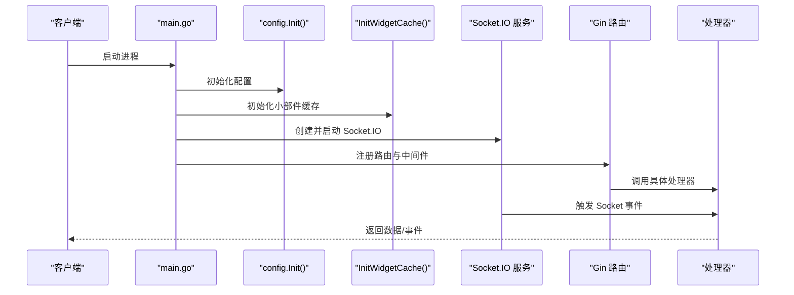
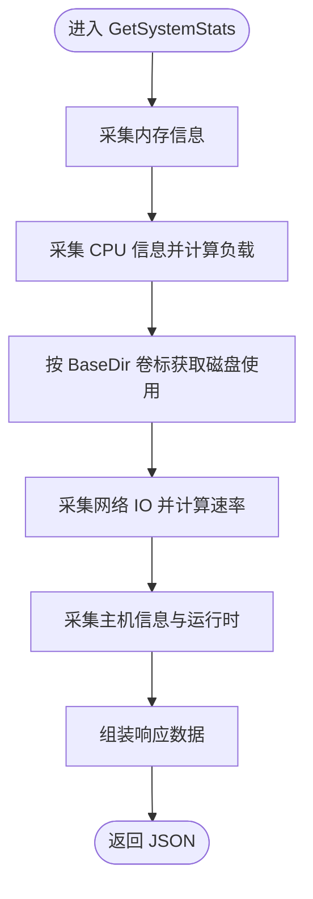
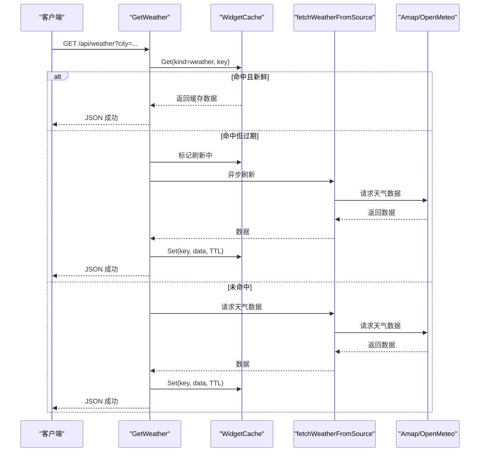
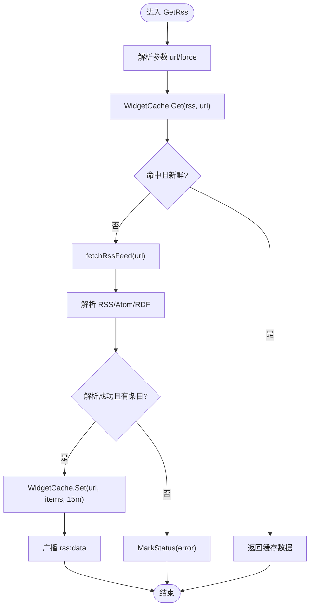
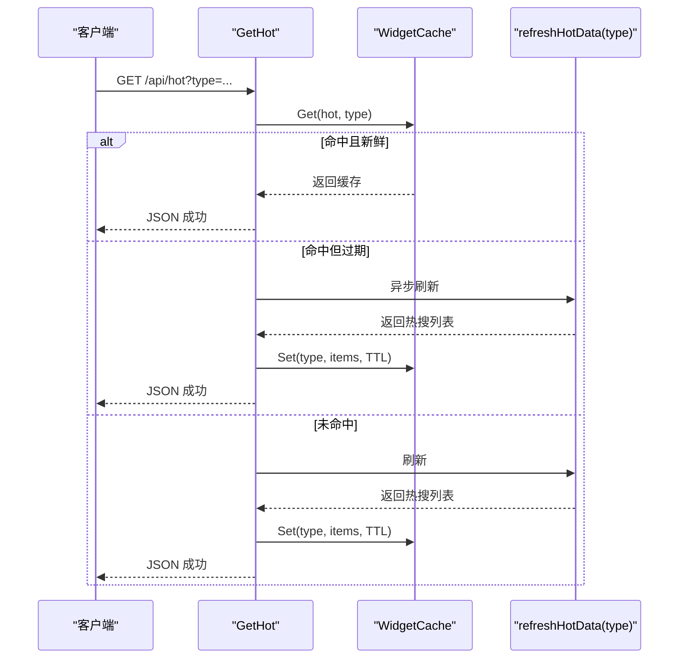
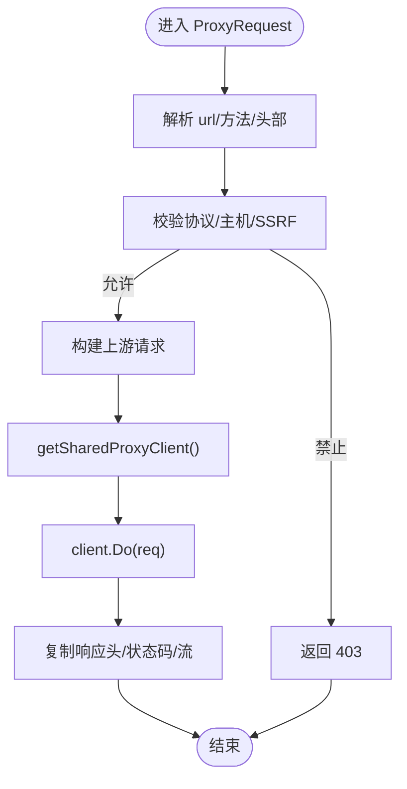
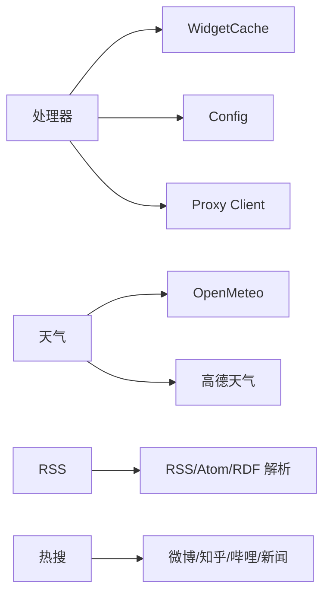

# 系统服务 API

<cite>
**本文引用的文件列表**
- [backend/main.go](file://backend/main.go)
- [backend/handlers/system.go](file://backend/handlers/system.go)
- [backend/handlers/weather.go](file://backend/handlers/weather.go)
- [backend/handlers/rss.go](file://backend/handlers/rss.go)
- [backend/handlers/hot.go](file://backend/handlers/hot.go)
- [backend/handlers/proxy.go](file://backend/handlers/proxy.go)
- [backend/handlers/widget_cache.go](file://backend/handlers/widget_cache.go)
- [backend/config/config.go](file://backend/config/config.go)
- [backend/models/models.go](file://backend/models/models.go)
- [README.md](file://README.md)
</cite>

## 目录
1. [简介](#简介)
2. [项目结构](#项目结构)
3. [核心组件](#核心组件)
4. [架构总览](#架构总览)
5. [详细组件分析](#详细组件分析)
6. [依赖关系分析](#依赖关系分析)
7. [性能考量](#性能考量)
8. [故障排查指南](#故障排查指南)
9. [结论](#结论)
10. [附录](#附录)

## 简介
本文件面向 OFlatNas 系统服务模块，提供系统监控、天气数据、RSS 订阅、热搜追踪、代理服务等接口的完整 API 文档。内容涵盖：
- 请求参数、响应格式与数据获取流程
- 定时任务调度、数据缓存策略与错误处理机制
- 实际服务调用示例与配置方法
- 性能优化建议与常见问题排查

## 项目结构
后端基于 Gin 框架，通过 Socket.IO 提供实时事件通道，同时暴露 RESTful API。主要模块包括：
- 路由与中间件：CORS、GZIP、日志、恢复、静态资源
- Socket.IO 事件：天气、RSS、热搜、备忘录、待办、网络状态等
- 处理器：系统状态、天气、RSS、热搜、代理、文件传输、Docker 管理等
- 缓存：统一小部件缓存（widget_cache）
- 配置：路径与默认配置初始化
- 模型：用户、组件、配置、传输项等数据模型

图表来源
- [backend/main.go:165-254](file://backend/main.go#L165-L254)
- [backend/handlers/widget_cache.go:13-39](file://backend/handlers/widget_cache.go#L13-L39)

章节来源
- [backend/main.go:1-267](file://backend/main.go#L1-L267)
- [backend/config/config.go:15-86](file://backend/config/config.go#L15-L86)

## 核心组件
- 系统监控与网络检测：CPU/内存/磁盘/网络、Ping、RTT、IP 查询
- 天气服务：OpenMeteo/Amap 天气数据获取与缓存
- RSS 订阅：多格式解析、缓存与异步刷新
- 热搜追踪：微博/知乎/哔哩哔哩/国内新闻
- 代理服务：HTTP/HTTPS/SOCKS5 代理、主机白名单与 SSRF 防护
- 文件传输与媒体：音乐列表、缩略图生成与静态资源
- Docker 管理：容器列表、信息、日志导出、动作控制
- 小部件缓存：统一 TTL 管理、并发刷新锁、持久化

章节来源
- [backend/handlers/system.go:51-203](file://backend/handlers/system.go#L51-L203)
- [backend/handlers/weather.go:163-206](file://backend/handlers/weather.go#L163-L206)
- [backend/handlers/rss.go:201-252](file://backend/handlers/rss.go#L201-L252)
- [backend/handlers/hot.go:132-170](file://backend/handlers/hot.go#L132-L170)
- [backend/handlers/proxy.go:123-130](file://backend/handlers/proxy.go#L123-L130)
- [backend/handlers/widget_cache.go:41-154](file://backend/handlers/widget_cache.go#L41-L154)

## 架构总览
后端启动时初始化配置、缓存、Docker、IP 获取与数据预热；注册 Socket.IO 事件与 REST API 路由；启用 CORS、GZIP、日志与恢复中间件；提供静态资源与代理能力。

图表来源
- [backend/main.go:25-111](file://backend/main.go#L25-L111)
- [backend/config/config.go:35-86](file://backend/config/config.go#L35-L86)
- [backend/handlers/widget_cache.go:41-44](file://backend/handlers/widget_cache.go#L41-L44)

## 详细组件分析

### 系统监控与网络检测
- 接口
  - GET /api/system/stats：返回 CPU、内存、磁盘、网络、操作系统与运行时信息
  - GET /api/ip：查询公网 IP 与地理信息，支持强制刷新
  - GET /api/ping：对指定目标执行 ping 并返回延迟
  - GET /api/rtt：返回服务端时间戳，用于前端 RTT 测量
  - GET /api/music-list：列出服务器端音乐文件
- 数据结构
  - CPU：负载、用户/系统占比、核心数、品牌/厂商、主频
  - 内存：总量、已用、活跃、可用
  - 磁盘：类型、容量、使用量、使用率、挂载点
  - 网络：按网卡聚合的收发速率
  - OS：发行版、版本、主机名、架构、开机时长
- 缓存与刷新
  - IP 查询带缓存与定时刷新（每 6 小时）
  - 网络速率计算基于两次采样差值，避免瞬时波动
- 错误处理
  - 外部 API 失败时回退到客户端 IP 与本地缓存
  - Ping 解析失败时返回错误信息
- 示例
  - 获取系统统计：GET /api/system/stats
  - 查询公网 IP：GET /api/ip?refresh=1
  - 网络延迟测试：GET /api/ping?target=223.5.5.5
  - RTT 测量：GET /api/rtt

图表来源
- [backend/handlers/system.go:51-203](file://backend/handlers/system.go#L51-L203)

章节来源
- [backend/handlers/system.go:51-203](file://backend/handlers/system.go#L51-L203)
- [backend/handlers/system.go:288-465](file://backend/handlers/system.go#L288-L465)
- [backend/handlers/system.go:534-629](file://backend/handlers/system.go#L534-L629)

### 天气服务
- 接口
  - GET /api/weather：获取天气数据，支持来源与密钥参数
  - GET /api/amap/weather：代理高德天气接口
  - GET /api/amap/ip：代理高德 IP 接口
  - Socket 事件：weather:fetch（客户端发起，服务端返回 weather:data 或 weather:error）
- 参数
  - city：城市名称（必填）
  - source：来源（amap/open-meteo）
  - key/projectId/keyId/privateKey：高德 API 密钥与鉴权参数
- 数据结构
  - temp、city、text、humidity
  - today：当日最低/最高温度
  - forecast：未来若干天的温度范围
- 缓存策略
  - 小部件缓存：按城市+来源+密钥构建键，TTL 依据来源与密钥存在性动态调整
  - Amap 原始响应缓存：2 小时内复用
- 刷新机制
  - 首次命中缓存但过期时，后台异步刷新并广播给 Socket 客户端
- 错误处理
  - 外部接口失败标记状态并返回错误
  - 解析失败或城市不存在时返回错误
- 示例
  - 获取天气：GET /api/weather?city=北京&source=amap&key=YOUR_KEY
  - 代理高德天气：GET /api/amap/weather?city=北京&key=YOUR_KEY&extensions=base

图表来源
- [backend/handlers/weather.go:163-206](file://backend/handlers/weather.go#L163-L206)
- [backend/handlers/weather.go:114-146](file://backend/handlers/weather.go#L114-L146)
- [backend/handlers/widget_cache.go:80-123](file://backend/handlers/widget_cache.go#L80-L123)

章节来源
- [backend/handlers/weather.go:163-206](file://backend/handlers/weather.go#L163-L206)
- [backend/handlers/weather.go:208-275](file://backend/handlers/weather.go#L208-L275)
- [backend/handlers/weather.go:345-491](file://backend/handlers/weather.go#L345-L491)
- [backend/handlers/weather.go:572-642](file://backend/handlers/weather.go#L572-L642)

### RSS 订阅
- 接口
  - GET /api/rss：获取 RSS 条目，支持强制刷新
  - Socket 事件：rss:fetch（客户端发起，服务端返回 rss:data 或 rss:error）
- 参数
  - url：RSS/Atom 地址（必填）
  - force：是否忽略缓存
- 数据结构
  - items：标题、链接、发布时间、摘要片段
- 缓存策略
  - 小部件缓存：按 URL 作为键，TTL 15 分钟
  - 首次命中缓存但过期时，后台异步刷新并广播
- 解析流程
  - 支持 RSS 2.0、Atom、RDF
  - 自动尝试 HTTP/HTTPS 两种方案
  - 使用代理客户端与合适的 UA/Referer
- 错误处理
  - 解析失败或空结果时标记状态并返回错误
- 示例
  - 获取 RSS：GET /api/rss?url=https%3A%2F%2Ffeeds.feedburner.com%2F&force=true

图表来源
- [backend/handlers/rss.go:201-252](file://backend/handlers/rss.go#L201-L252)
- [backend/handlers/rss.go:254-322](file://backend/handlers/rss.go#L254-L322)
- [backend/handlers/widget_cache.go:80-123](file://backend/handlers/widget_cache.go#L80-L123)

章节来源
- [backend/handlers/rss.go:201-252](file://backend/handlers/rss.go#L201-L252)
- [backend/handlers/rss.go:364-429](file://backend/handlers/rss.go#L364-L429)

### 热搜追踪
- 接口
  - GET /api/hot：获取热搜列表，支持类型与强制刷新
  - Socket 事件：hot:fetch（客户端发起，服务端返回 hot:data 或 hot:error）
- 类型
  - weibo、news、zhihu、bilibili
- TTL
  - 不同类型有不同的缓存 TTL
- 数据结构
  - title、url、hot（热度描述）
- 刷新机制
  - 首次命中缓存但过期时，后台异步刷新并广播
- 示例
  - 获取微博热搜：GET /api/hot?type=weibo

图表来源
- [backend/handlers/hot.go:132-170](file://backend/handlers/hot.go#L132-L170)
- [backend/handlers/hot.go:31-79](file://backend/handlers/hot.go#L31-L79)
- [backend/handlers/widget_cache.go:80-123](file://backend/handlers/widget_cache.go#L80-L123)

章节来源
- [backend/handlers/hot.go:132-170](file://backend/handlers/hot.go#L132-L170)
- [backend/handlers/hot.go:81-130](file://backend/handlers/hot.go#L81-L130)

### 代理服务
- 接口
  - GET /api/proxy：通用代理转发（支持 HTTP/HTTPS）
  - GET /api/wallpaper/proxy：壁纸代理（带白名单与 UUID 回传）
  - GET /api/config/proxy-status：查询代理可用状态
- 代理配置
  - 支持环境变量 PROXY_URL、HTTP_PROXY、HTTPS_PROXY、http_proxy、https_proxy
  - 支持协议：http、https、socks5、socks5h
- 主机白名单与防护
  - 默认允许部分壁纸源，可通过环境变量追加
  - 禁止访问 localhost、私有/链路本地 IP
- 示例
  - 代理请求：GET /api/proxy?url=https%3A%2F%2Fexample.com
  - 查询代理状态：GET /api/config/proxy-status

图表来源
- [backend/handlers/proxy.go:132-198](file://backend/handlers/proxy.go#L132-L198)
- [backend/handlers/proxy.go:19-51](file://backend/handlers/proxy.go#L19-L51)
- [backend/handlers/proxy.go:314-342](file://backend/handlers/proxy.go#L314-L342)

章节来源
- [backend/handlers/proxy.go:123-130](file://backend/handlers/proxy.go#L123-L130)
- [backend/handlers/proxy.go:132-198](file://backend/handlers/proxy.go#L132-L198)
- [backend/handlers/proxy.go:19-51](file://backend/handlers/proxy.go#L19-L51)

### 文件传输与媒体
- 接口
  - GET /api/music-list：列出可播放的音乐文件
  - GET /api/transfer/file/:filename：下载文件
  - GET /api/transfer/thumb/:filename/:size：获取缩略图
  - POST /api/transfer/upload/init：初始化上传
  - POST /api/transfer/upload/chunk：上传分片
  - POST /api/transfer/upload/complete：完成上传
  - POST /api/transfer/download-token：生成下载令牌
  - POST /api/transfer/generate-thumb/:filename/:size：生成缩略图
  - POST /api/transfer/regenerate-thumbs：批量重生成缩略图
- 数据结构
  - TransferItem、TransferFile 等
- 示例
  - 获取音乐列表：GET /api/music-list

章节来源
- [backend/handlers/system.go:594-619](file://backend/handlers/system.go#L594-L619)
- [backend/models/models.go:98-118](file://backend/models/models.go#L98-L118)

### Docker 管理
- 接口
  - GET /api/docker-status：Docker 状态
  - GET /api/docker/debug：Docker 调试信息
  - GET /api/system-config：系统配置
  - GET /api/docker/containers：容器列表
  - GET /api/docker/info：Docker 信息
  - GET /api/docker/export-logs：导出日志
  - GET /api/docker/container/:id/inspect-lite：容器轻量检查
  - POST /api/docker/check-updates：触发更新检查
  - POST /api/docker/container/:id/:action：容器动作（启动/停止/重启/删除等）
  - POST /api/custom-scripts：保存自定义脚本（CSS/JS）
- 示例
  - 获取容器列表：GET /api/docker/containers

章节来源
- [backend/main.go:171-253](file://backend/main.go#L171-L253)
- [backend/handlers/system.go:205-272](file://backend/handlers/system.go#L205-L272)

## 依赖关系分析
- 组件耦合
  - 处理器依赖配置与缓存；缓存依赖数据目录；Socket 事件与 REST API 共享缓存
  - 天气、RSS、热搜共享统一缓存与刷新锁
  - 代理模块提供共享客户端，支持多种协议
- 外部依赖
  - 天气：OpenMeteo、高德天气
  - 热搜：微博、知乎、哔哩哔哩、中国新闻网
  - 网络：gopsutil（系统信息）、Socket.IO（实时通信）

图表来源
- [backend/handlers/widget_cache.go:13-39](file://backend/handlers/widget_cache.go#L13-L39)
- [backend/handlers/weather.go:345-491](file://backend/handlers/weather.go#L345-L491)
- [backend/handlers/rss.go:364-429](file://backend/handlers/rss.go#L364-L429)
- [backend/handlers/hot.go:81-130](file://backend/handlers/hot.go#L81-L130)

章节来源
- [backend/handlers/widget_cache.go:41-154](file://backend/handlers/widget_cache.go#L41-L154)
- [backend/handlers/proxy.go:247-308](file://backend/handlers/proxy.go#L247-L308)

## 性能考量
- 缓存策略
  - 小部件缓存：按类型区分键空间，TTL 动态调整，避免频繁外部请求
  - Amap 原始响应缓存：降低第三方限流压力
  - 刷新锁：防止并发重复刷新
- 网络优化
  - GZIP 压缩、CORS 白名单、代理客户端复用
  - RSS/热搜/天气异步刷新，保证接口快速返回
- 资源管理
  - 系统监控采样间隔与速率计算，避免抖动
  - 静态资源与缩略图生成，减少前端渲染开销

## 故障排查指南
- 代理不可用
  - 检查环境变量格式与可达性
  - 访问 /api/config/proxy-status 确认状态
  - 查看后端日志中的代理错误信息
- 天气/热搜/RSS 获取失败
  - 检查缓存状态与刷新锁
  - 确认外部服务可用性与网络连通
  - 查看错误事件或错误响应
- IP 查询异常
  - 强制刷新参数与超时设置
  - 校验客户端 IP 来源与代理头
- Docker 相关
  - 确认 Docker 守护进程与权限
  - 检查容器动作与日志导出

章节来源
- [README.md:90-97](file://README.md#L90-L97)
- [backend/handlers/weather.go:114-146](file://backend/handlers/weather.go#L114-L146)
- [backend/handlers/rss.go:82-135](file://backend/handlers/rss.go#L82-L135)
- [backend/handlers/hot.go:31-79](file://backend/handlers/hot.go#L31-L79)

## 结论
本 API 文档覆盖了 OFlatNas 的核心服务模块，提供了系统监控、天气、RSS、热搜与代理的完整接口说明与实践建议。通过统一的小部件缓存与异步刷新机制，系统在保证数据新鲜度的同时，有效降低了外部依赖的压力。配合代理与白名单机制，系统在复杂网络环境下具备良好的稳定性与安全性。

## 附录
- 环境变量
  - BASE_DIR：基础目录
  - PROXY_URL/HTTP_PROXY/HTTPS_PROXY：代理配置
  - WALLPAPER_WHITELIST：壁纸源白名单
  - PORT：服务端口（默认 3000）
  - CORS_ALLOW_ORIGINS：CORS 允许来源（逗号分隔）
- 配置文件
  - system.json：系统配置
  - data.json：用户布局与组件配置
  - widget_cache.json：小部件缓存
  - custom_scripts.json：用户自定义 CSS/JS
  - visitors.json：访客统计
  - amap_stats.json：高德调用统计

章节来源
- [backend/config/config.go:35-86](file://backend/config/config.go#L35-L86)
- [backend/config/config.go:210-256](file://backend/config/config.go#L210-L256)
- [README.md:197-214](file://README.md#L197-L214)