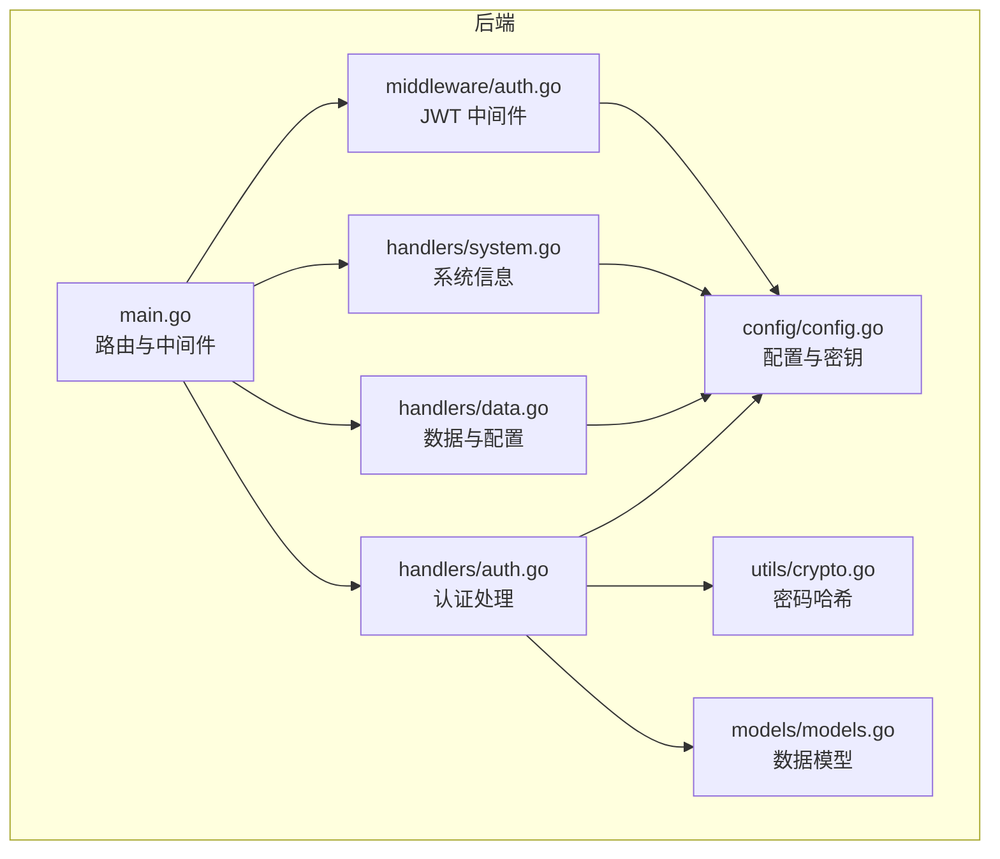
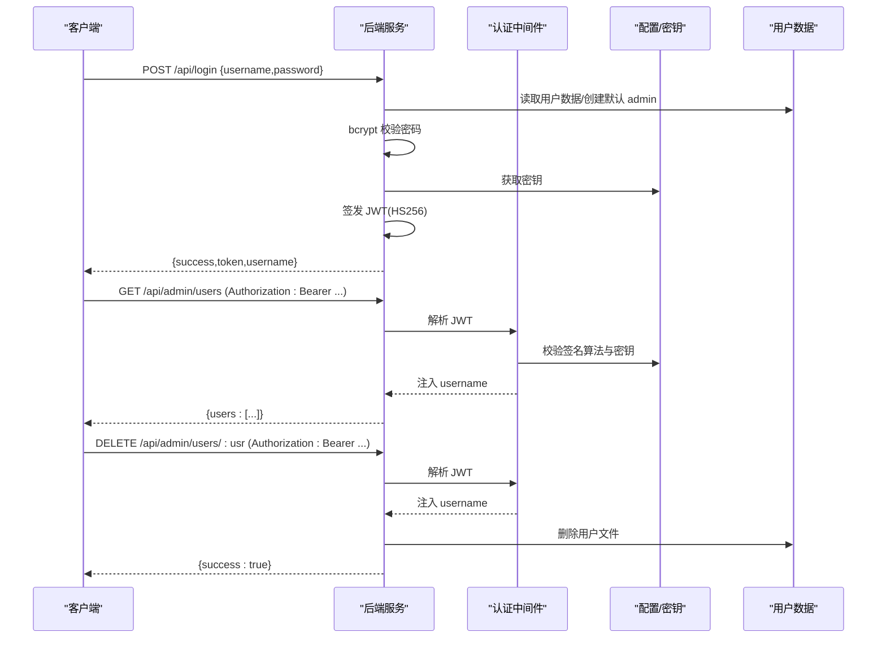
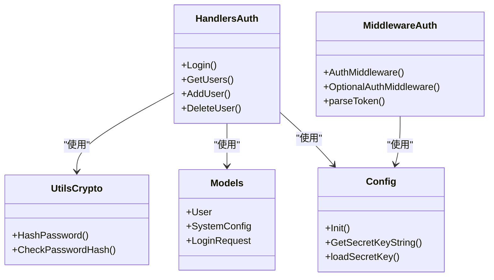

# 认证 API

<cite>
**本文档引用的文件**
- [backend/handlers/auth.go](file://backend/handlers/auth.go)
- [backend/middleware/auth.go](file://backend/middleware/auth.go)
- [backend/utils/crypto.go](file://backend/utils/crypto.go)
- [backend/models/models.go](file://backend/models/models.go)
- [backend/config/config.go](file://backend/config/config.go)
- [backend/main.go](file://backend/main.go)
- [backend/handlers/data.go](file://backend/handlers/data.go)
- [backend/handlers/system.go](file://backend/handlers/system.go)
- [backend/config/default.json](file://backend/config/default.json)
- [frontend/src/components/LoginModal.vue](file://frontend/src/components/LoginModal.vue)
- [frontend/src/components/SettingsModal.vue](file://frontend/src/components/SettingsModal.vue)
</cite>

## 目录
1. [简介](#简介)
2. [项目结构](#项目结构)
3. [核心组件](#核心组件)
4. [架构总览](#架构总览)
5. [详细组件分析](#详细组件分析)
6. [依赖关系分析](#依赖关系分析)
7. [性能考量](#性能考量)
8. [故障排查指南](#故障排查指南)
9. [结论](#结论)
10. [附录](#附录)

## 简介
本文件为 OFlatNas 认证系统的详细 API 文档，覆盖登录接口、用户管理接口以及权限控制机制。内容包括：
- JWT 令牌生成与验证流程
- 用户密码加密存储策略
- 单用户模式与多用户模式的差异与配置
- 认证中间件的使用方法与安全注意事项
- 完整的请求参数、响应格式与错误码说明
- 实际 API 调用示例（登录、创建用户、删除用户等）

## 项目结构
后端采用 Go Gin 框架，认证相关模块分布如下：
- handlers/auth.go：登录、用户查询、新增用户、删除用户
- middleware/auth.go：JWT 解析与认证中间件
- utils/crypto.go：密码哈希工具
- models/models.go：数据模型（含系统配置）
- config/config.go：系统初始化、配置读取与密钥管理
- main.go：路由注册与中间件装配
- handlers/data.go：系统配置读取与更新
- handlers/system.go：系统信息与 IP 查询等

图表来源
- [backend/main.go:165-254](file://backend/main.go#L165-L254)
- [backend/handlers/auth.go:1-211](file://backend/handlers/auth.go#L1-L211)
- [backend/middleware/auth.go:1-61](file://backend/middleware/auth.go#L1-L61)
- [backend/config/config.go:1-257](file://backend/config/config.go#L1-L257)
- [backend/utils/crypto.go:1-16](file://backend/utils/crypto.go#L1-L16)
- [backend/models/models.go:1-118](file://backend/models/models.go#L1-L118)

章节来源
- [backend/main.go:165-254](file://backend/main.go#L165-L254)

## 核心组件
- 登录接口：接收用户名/密码，校验后签发 JWT
- 用户管理接口：查询用户列表、新增用户、删除用户（仅管理员）
- 权限控制：基于 JWT 的认证中间件，保护受保护路由
- 密码存储：bcrypt 哈希，兼容明文迁移
- 模式切换：单用户模式与多用户模式，通过系统配置控制

章节来源
- [backend/handlers/auth.go:18-114](file://backend/handlers/auth.go#L18-L114)
- [backend/handlers/auth.go:121-208](file://backend/handlers/auth.go#L121-L208)
- [backend/middleware/auth.go:33-60](file://backend/middleware/auth.go#L33-L60)
- [backend/utils/crypto.go:7-15](file://backend/utils/crypto.go#L7-L15)
- [backend/models/models.go:81-90](file://backend/models/models.go#L81-L90)

## 架构总览
认证流程概览：
- 客户端调用登录接口，服务端验证凭据
- 验证通过后签发 JWT（HS256），有效期 30 天
- 后续请求携带 Authorization: Bearer <token> 或查询参数 token
- 中间件解析 JWT 并注入用户名上下文
- 受保护路由仅对已认证用户开放

图表来源
- [backend/handlers/auth.go:18-114](file://backend/handlers/auth.go#L18-L114)
- [backend/handlers/auth.go:121-208](file://backend/handlers/auth.go#L121-L208)
- [backend/middleware/auth.go:12-31](file://backend/middleware/auth.go#L12-L31)
- [backend/config/config.go:182-208](file://backend/config/config.go#L182-L208)

## 详细组件分析

### 登录接口
- 路径：POST /api/login
- 请求体字段：
  - username: 字符串（单用户模式可为空，默认 admin）
  - password: 字符串（必填）
- 成功响应：
  - success: 布尔
  - token: 字符串（JWT）
  - username: 字符串
- 失败响应：
  - error: 字符串（例如 "User not found or password incorrect"、"Password incorrect"、"Invalid request"）

实现要点：
- 支持单用户模式：当 authMode 为 single 且 username 为空时，强制使用 admin
- 支持多用户模式：从 users 目录读取对应用户 JSON 文件
- 默认 admin 创建：若 admin 不存在且为单用户模式，自动创建默认 admin 用户（密码哈希）
- 密码校验：优先 bcrypt；若存储为明文则转换为 bcrypt 并回写
- JWT 签发：HS256，有效期 30 天，包含 username

章节来源
- [backend/handlers/auth.go:18-114](file://backend/handlers/auth.go#L18-L114)
- [backend/config/config.go:102-151](file://backend/config/config.go#L102-L151)

### 用户管理接口
- 查询用户列表
  - 方法：GET /api/admin/users
  - 权限：仅管理员
  - 成功响应：{ users: [string] }
  - 失败响应：{ error: string }
- 新增用户
  - 方法：POST /api/admin/users
  - 请求体：{ username: string, password: string }
  - 成功响应：{ success: true }
  - 失败响应：{ error: string }（用户名为空、用户名冲突、无法保存等）
- 删除用户
  - 方法：DELETE /api/admin/users/:usr
  - 权限：仅管理员
  - 成功响应：{ success: true }
  - 失败响应：{ error: string }（非法用户名、权限不足、删除失败等）

实现要点：
- 仅管理员可操作
- 用户名不可为 admin（保留）
- 用户数据以 JSON 文件形式存储在 users 目录
- 新增用户密码使用 bcrypt 哈希

章节来源
- [backend/handlers/auth.go:121-208](file://backend/handlers/auth.go#L121-L208)

### 权限控制与中间件
- 认证中间件 AuthMiddleware
  - 从 Header Authorization 或查询参数 token 读取 JWT
  - 使用 HS256 校验签名与算法
  - 将 username 注入上下文，继续后续处理器
  - 未通过校验返回 401 Unauthorized
- 可选认证中间件 OptionalAuthMiddleware
  - 仅在存在有效 JWT 时注入 username，否则放行
- 受保护路由组
  - /api/admin/* 下的所有接口均受 AuthMiddleware 保护

章节来源
- [backend/middleware/auth.go:33-60](file://backend/middleware/auth.go#L33-L60)
- [backend/main.go:199-253](file://backend/main.go#L199-L253)

### JWT 令牌生成与验证流程
- 生成
  - HS256 签名，包含 username 与过期时间（当前时间 + 30 天）
  - 密钥来源于配置文件中的 secret.key
- 验证
  - 仅接受 HS256 算法
  - 使用相同密钥进行签名验证
  - 从请求头 Authorization: Bearer <token> 或查询参数 token 提取

章节来源
- [backend/handlers/auth.go:100-113](file://backend/handlers/auth.go#L100-L113)
- [backend/middleware/auth.go:12-31](file://backend/middleware/auth.go#L12-L31)
- [backend/config/config.go:182-208](file://backend/config/config.go#L182-L208)

### 密码加密存储
- 存储策略
  - bcrypt 哈希：优先使用 bcrypt 存储密码
  - 明文兼容：若发现明文密码，首次登录时自动转换为 bcrypt 并回写
- 工具函数
  - HashPassword：生成 bcrypt 哈希
  - CheckPasswordHash：比较 bcrypt 哈希与明文

章节来源
- [backend/handlers/auth.go:78-97](file://backend/handlers/auth.go#L78-L97)
- [backend/utils/crypto.go:7-15](file://backend/utils/crypto.go#L7-L15)

### 单用户模式与多用户模式
- 单用户模式（authMode: "single"）
  - 登录界面仅需输入密码，用户名固定为 admin
  - admin 数据存储于 data.json
  - 默认 admin 密码为 "admin"
- 多用户模式（authMode: "multi"）
  - 登录界面需要用户名与密码
  - 用户数据存储于 users/<username>.json
  - 管理员可创建/删除用户
- 模式切换
  - 仅管理员可修改系统配置中的 authMode
  - 切换时需注意数据隔离与备份

章节来源
- [backend/handlers/data.go:176-179](file://backend/handlers/data.go#L176-L179)
- [backend/handlers/data.go:839-868](file://backend/handlers/data.go#L839-L868)
- [backend/config/default.json:141-142](file://backend/config/default.json#L141-L142)
- [frontend/src/components/LoginModal.vue:40-45](file://frontend/src/components/LoginModal.vue#L40-L45)
- [frontend/src/components/SettingsModal.vue:4512-4544](file://frontend/src/components/SettingsModal.vue#L4512-L4544)

### API 定义与示例

- 登录接口
  - 方法：POST /api/login
  - 请求体：
    - username: 字符串（单用户模式可为空）
    - password: 字符串（必填）
  - 成功响应：
    - success: true
    - token: JWT 字符串
    - username: 字符串
  - 错误响应：
    - error: 字符串（例如 "User not found or password incorrect"、"Invalid request"）

- 查询用户列表
  - 方法：GET /api/admin/users
  - 认证：需要管理员权限
  - 成功响应：{ users: [string] }

- 新增用户
  - 方法：POST /api/admin/users
  - 请求体：{ username: string, password: string }
  - 成功响应：{ success: true }

- 删除用户
  - 方法：DELETE /api/admin/users/:usr
  - 认证：需要管理员权限
  - 成功响应：{ success: true }

- 获取系统配置
  - 方法：GET /api/system-config
  - 成功响应：{ authMode: "single"|"multi", enableDocker: boolean }

- 更新系统配置（切换模式）
  - 方法：POST /api/system-config
  - 认证：需要管理员权限
  - 请求体：{ authMode: "single"|"multi" }
  - 成功响应：{ success: true }

章节来源
- [backend/handlers/auth.go:18-114](file://backend/handlers/auth.go#L18-L114)
- [backend/handlers/auth.go:121-208](file://backend/handlers/auth.go#L121-L208)
- [backend/handlers/data.go:839-868](file://backend/handlers/data.go#L839-L868)

## 依赖关系分析

图表来源
- [backend/handlers/auth.go:1-211](file://backend/handlers/auth.go#L1-L211)
- [backend/middleware/auth.go:1-61](file://backend/middleware/auth.go#L1-L61)
- [backend/utils/crypto.go:1-16](file://backend/utils/crypto.go#L1-L16)
- [backend/models/models.go:1-118](file://backend/models/models.go#L1-L118)
- [backend/config/config.go:1-257](file://backend/config/config.go#L1-L257)

章节来源
- [backend/handlers/auth.go:1-211](file://backend/handlers/auth.go#L1-L211)
- [backend/middleware/auth.go:1-61](file://backend/middleware/auth.go#L1-L61)
- [backend/utils/crypto.go:1-16](file://backend/utils/crypto.go#L1-L16)
- [backend/models/models.go:1-118](file://backend/models/models.go#L1-L118)
- [backend/config/config.go:1-257](file://backend/config/config.go#L1-L257)

## 性能考量
- JWT 验证开销极小，主要成本在 bcrypt 校验与文件读写
- 用户数据按用户文件存储，读写路径明确，适合多用户模式
- 建议：
  - 在高并发场景下，确保 users 目录具备良好磁盘性能
  - 对频繁访问的用户数据可考虑缓存策略（当前实现未内置缓存）
  - 合理设置密钥长度与 bcrypt 迭代次数以平衡安全性与性能

## 故障排查指南
常见问题与定位建议：
- 401 未授权
  - 检查 Authorization 头或查询参数 token 是否正确传递
  - 确认签名算法为 HS256，密钥与服务端一致
- 用户名或密码错误
  - 确认单/多用户模式下的用户名填写
  - 若为单用户模式，用户名可留空
- 用户不存在或密码不正确
  - 检查 users 目录下是否存在对应用户 JSON 文件
  - 若为首次登录且密码为明文，系统会自动转换为 bcrypt 并回写
- 管理员权限不足
  - 仅 admin 用户可执行用户管理与系统配置更新
- 模式切换失败
  - 确认请求体中 authMode 为 "single" 或 "multi"
  - 切换前建议导出配置，避免数据丢失

章节来源
- [backend/middleware/auth.go:33-60](file://backend/middleware/auth.go#L33-L60)
- [backend/handlers/auth.go:18-114](file://backend/handlers/auth.go#L18-L114)
- [backend/handlers/auth.go:121-208](file://backend/handlers/auth.go#L121-L208)
- [backend/handlers/data.go:845-868](file://backend/handlers/data.go#L845-L868)

## 结论
OFlatNas 的认证系统以 JWT 为核心，结合 bcrypt 密码哈希与灵活的单/多用户模式，提供了简洁而安全的认证能力。通过中间件统一处理认证逻辑，受保护路由清晰可控。建议在生产环境中：
- 使用 HTTPS 传输，防止令牌与凭据泄露
- 定期轮换密钥并妥善保管
- 在多用户模式下做好数据隔离与备份
- 结合前端提示与系统配置变更的确认流程，降低误操作风险

## 附录

### API 调用示例

- 成功登录（单用户模式）
  - 请求：POST /api/login
  - Body：{ "username": "", "password": "admin" }
  - 响应：{ "success": true, "token": "<JWT>", "username": "admin" }

- 成功登录（多用户模式）
  - 请求：POST /api/login
  - Body：{ "username": "testuser", "password": "admin" }
  - 响应：{ "success": true, "token": "<JWT>", "username": "testuser" }

- 查询用户列表（管理员）
  - 请求：GET /api/admin/users
  - 头部：Authorization: Bearer <JWT>
  - 响应：{ "users": ["testuser"] }

- 新增用户（管理员）
  - 请求：POST /api/admin/users
  - 头部：Authorization: Bearer <JWT>
  - Body：{ "username": "newuser", "password": "newpass" }
  - 响应：{ "success": true }

- 删除用户（管理员）
  - 请求：DELETE /api/admin/users/newuser
  - 头部：Authorization: Bearer <JWT>
  - 响应：{ "success": true }

- 切换为多用户模式（管理员）
  - 请求：POST /api/system-config
  - 头部：Authorization: Bearer <JWT>
  - Body：{ "authMode": "multi" }
  - 响应：{ "success": true }

章节来源
- [backend/handlers/auth.go:18-114](file://backend/handlers/auth.go#L18-L114)
- [backend/handlers/auth.go:121-208](file://backend/handlers/auth.go#L121-L208)
- [backend/handlers/data.go:839-868](file://backend/handlers/data.go#L839-L868)