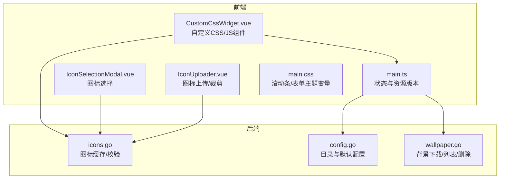
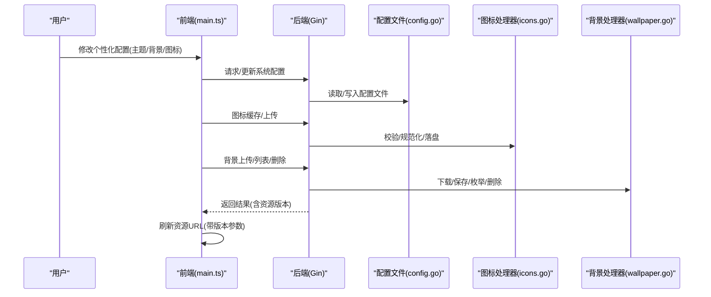
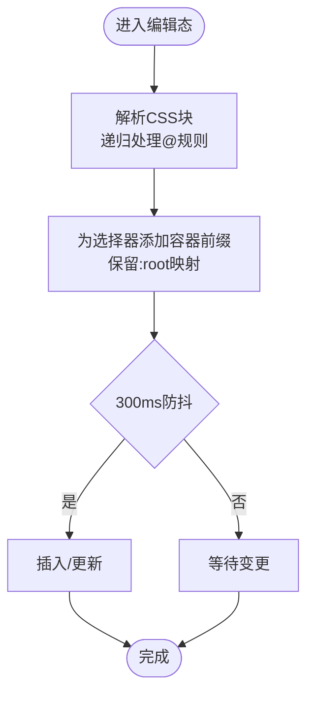
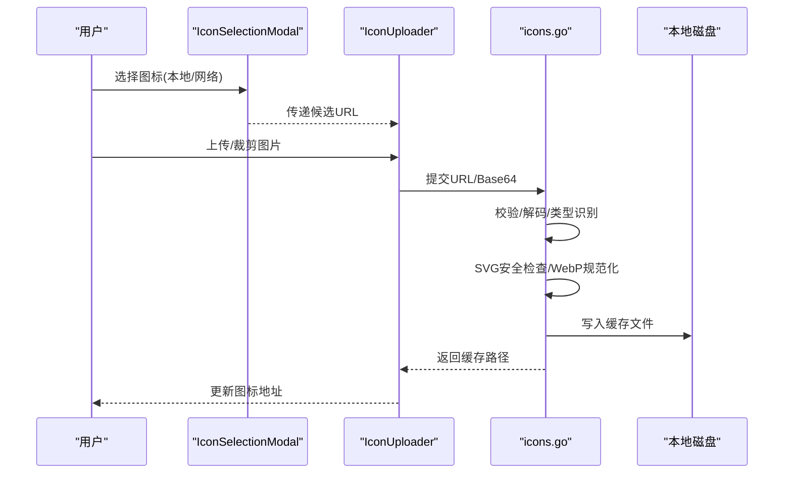
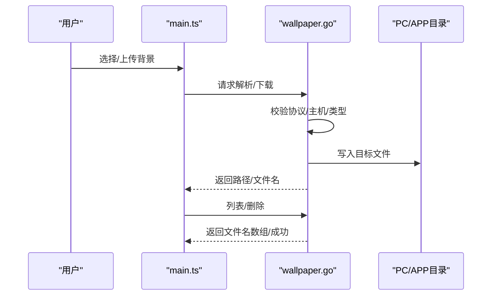
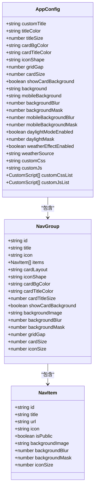
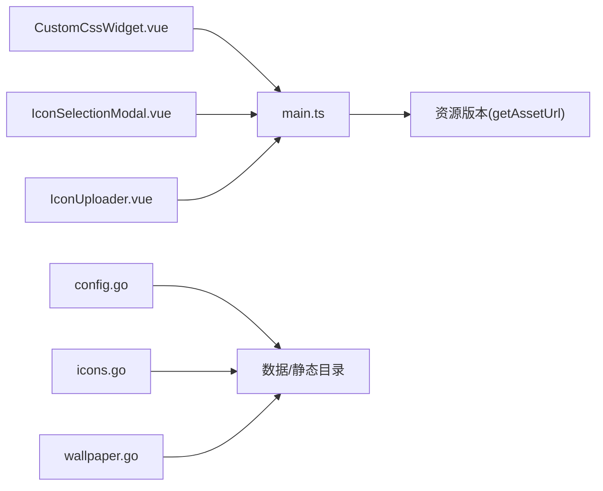

# 个性化定制

<cite>
**本文引用的文件**
- [CustomCssWidget.vue](file://frontend/src/components/CustomCssWidget.vue)
- [icons.go](file://backend/handlers/icons.go)
- [wallpaper.go](file://backend/handlers/wallpaper.go)
- [IconSelectionModal.vue](file://frontend/src/components/IconSelectionModal.vue)
- [IconUploader.vue](file://frontend/src/components/IconUploader.vue)
- [main.ts](file://frontend/src/stores/main.ts)
- [types.ts](file://frontend/src/types.ts)
- [config.go](file://backend/config/config.go)
- [default.json](file://backend/config/default.json)
- [main.css](file://frontend/src/assets/main.css)
</cite>

## 目录
1. [简介](#简介)
2. [项目结构](#项目结构)
3. [核心组件](#核心组件)
4. [架构总览](#架构总览)
5. [详细组件分析](#详细组件分析)
6. [依赖关系分析](#依赖关系分析)
7. [性能考量](#性能考量)
8. [故障排查指南](#故障排查指南)
9. [结论](#结论)
10. [附录](#附录)

## 简介
本文件面向 OFlatNas 的个性化定制能力，系统性讲解前端与后端在“自定义 CSS/JS、图标管理、背景设置、分组卡片背景”等方面的实现与使用方法，并提供从入门到进阶的实践路径。同时，结合主题系统与扩展机制，给出性能优化与安全注意事项，帮助用户充分释放系统的定制潜力。

## 项目结构
- 前端采用 Vue 3 + Vite 构建，通过 Pinia 状态管理与 Socket.IO 实时同步。
- 后端采用 Go + Gin，提供图标缓存、背景图上传与轮播、系统配置持久化等能力。
- 数据与静态资源目录由后端统一初始化与管理，前端通过 API 获取与更新个性化配置。

图表来源
- [main.ts:561-577](file://frontend/src/stores/main.ts#L561-L577)
- [CustomCssWidget.vue:1-444](file://frontend/src/components/CustomCssWidget.vue#L1-L444)
- [IconSelectionModal.vue:1-195](file://frontend/src/components/IconSelectionModal.vue#L1-L195)
- [IconUploader.vue:1-209](file://frontend/src/components/IconUploader.vue#L1-L209)
- [config.go:35-86](file://backend/config/config.go#L35-L86)
- [icons.go:108-228](file://backend/handlers/icons.go#L108-L228)
- [wallpaper.go:145-186](file://backend/handlers/wallpaper.go#L145-L186)

章节来源
- [main.ts:561-577](file://frontend/src/stores/main.ts#L561-L577)
- [config.go:35-86](file://backend/config/config.go#L35-L86)

## 核心组件
- 自定义 CSS/JS 组件：提供 HTML/CSS/JS 编辑、作用域隔离、实时预览、模块/非模块脚本执行、导入导出与 AI 助手提示词。
- 图标管理：本地/网络图标选择、自动缓存、SVG 安全校验、WebP 规范化、Base64 获取。
- 背景设置：PC/移动端背景上传、列表排序、删除与轮播控制。
- 主题系统：通过应用配置中的主题变量与 CSS 变量实现明暗/风格切换。

章节来源
- [CustomCssWidget.vue:1-444](file://frontend/src/components/CustomCssWidget.vue#L1-L444)
- [icons.go:108-228](file://backend/handlers/icons.go#L108-L228)
- [wallpaper.go:145-186](file://backend/handlers/wallpaper.go#L145-L186)
- [types.ts:86-189](file://frontend/src/types.ts#L86-L189)
- [main.css:35-78](file://frontend/src/assets/main.css#L35-L78)

## 架构总览
前端通过状态存储与资源版本控制，拉取并应用个性化配置；后端负责数据持久化与资源处理，提供安全与性能保障。

图表来源
- [main.ts:122-154](file://frontend/src/stores/main.ts#L122-L154)
- [config.go:102-151](file://backend/config/config.go#L102-L151)
- [icons.go:108-228](file://backend/handlers/icons.go#L108-L228)
- [wallpaper.go:64-143](file://backend/handlers/wallpaper.go#L64-L143)

## 详细组件分析

### 自定义 CSS/JS 组件（CustomCssWidget）
- 作用域隔离：解析 CSS 字符串，按块级规则递归处理，自动为选择器添加容器前缀，保留 @media/@keyframes 等条件规则，支持 :root 映射到当前容器。
- 实时预览：CSS 内容变更后进行防抖更新，提升交互体验。
- 脚本执行：支持模块与非模块两种脚本；非模块脚本注入上下文对象，提供查询、事件总线、清理回调等能力；模块脚本原样注入。
- 导入导出：支持从 JSON/文本导入，导出为 JSON；提供 AI 助手提示词一键复制。

图表来源
- [CustomCssWidget.vue:30-84](file://frontend/src/components/CustomCssWidget.vue#L30-L84)
- [CustomCssWidget.vue:99-105](file://frontend/src/components/CustomCssWidget.vue#L99-L105)

章节来源
- [CustomCssWidget.vue:1-444](file://frontend/src/components/CustomCssWidget.vue#L1-L444)

### 图标管理（IconSelectionModal / IconUploader / icons.go）
- 图标选择：支持本地与网络图标源，提供自动计时选择与分页加载。
- 图标上传/裁剪：支持本地文件上传、缩放与裁剪至固定尺寸，生成 DataURL。
- 图标缓存：接收远程 URL 或 Base64，进行类型检测、大小限制、SVG 安全校验、WebP 规范化与本地落盘，返回缓存路径。
- 安全策略：黑名单主机限制、SVG 关键字过滤、最大 5MB 限制。

图表来源
- [IconSelectionModal.vue:19-54](file://frontend/src/components/IconSelectionModal.vue#L19-L54)
- [IconUploader.vue:49-104](file://frontend/src/components/IconUploader.vue#L49-L104)
- [icons.go:108-228](file://backend/handlers/icons.go#L108-L228)
- [icons.go:441-460](file://backend/handlers/icons.go#L441-L460)

章节来源
- [IconSelectionModal.vue:1-195](file://frontend/src/components/IconSelectionModal.vue#L1-L195)
- [IconUploader.vue:1-209](file://frontend/src/components/IconUploader.vue#L1-L209)
- [icons.go:108-228](file://backend/handlers/icons.go#L108-L228)

### 背景设置（wallpaper.go / main.ts）
- 背景解析：支持 HTTP(S) URL 解析，返回最终可用地址。
- 背景下载：根据设备类型区分 PC/移动端目录，自动推断扩展名，写入文件并返回 Web 访问路径。
- 背景列表：按修改时间倒序列出，支持排序与默认项优先。
- 删除与上传：基于用户名与命名规则进行权限校验，防止越权删除；支持多文件上传。

图表来源
- [wallpaper.go:22-56](file://backend/handlers/wallpaper.go#L22-L56)
- [wallpaper.go:64-143](file://backend/handlers/wallpaper.go#L64-L143)
- [wallpaper.go:145-186](file://backend/handlers/wallpaper.go#L145-L186)
- [wallpaper.go:188-231](file://backend/handlers/wallpaper.go#L188-L231)
- [wallpaper.go:233-267](file://backend/handlers/wallpaper.go#L233-L267)

章节来源
- [wallpaper.go:1-268](file://backend/handlers/wallpaper.go#L1-L268)
- [main.ts:248-281](file://frontend/src/stores/main.ts#L248-L281)

### 主题系统与扩展（types.ts / main.css / default.json）
- 主题变量：应用配置中包含大量主题字段，如标题颜色/字号、卡片背景色、网格间距、图标形状、搜索引擎等。
- CSS 变量：通过 CSS 类与变量实现明暗主题切换与组件风格统一。
- 默认模板：后端提供默认配置模板，前端首次加载时初始化。

图表来源
- [types.ts:86-189](file://frontend/src/types.ts#L86-L189)
- [types.ts:26-62](file://frontend/src/types.ts#L26-L62)
- [types.ts:1-24](file://frontend/src/types.ts#L1-L24)
- [default.json:1-147](file://backend/config/default.json#L1-L147)
- [main.css:35-78](file://frontend/src/assets/main.css#L35-L78)

章节来源
- [types.ts:1-298](file://frontend/src/types.ts#L1-L298)
- [default.json:1-147](file://backend/config/default.json#L1-L147)
- [main.css:1-132](file://frontend/src/assets/main.css#L1-L132)

## 依赖关系分析
- 前端状态与资源版本：通过资源版本参数实现缓存失效与热更新。
- 后端目录与默认配置：统一初始化数据与静态资源目录，确保运行时一致性。
- 图标与背景处理：后端承担安全校验与资源落盘职责，前端仅负责调用与展示。

图表来源
- [main.ts:561-577](file://frontend/src/stores/main.ts#L561-L577)
- [config.go:93-100](file://backend/config/config.go#L93-L100)
- [icons.go:108-228](file://backend/handlers/icons.go#L108-L228)
- [wallpaper.go:110-143](file://backend/handlers/wallpaper.go#L110-L143)

章节来源
- [main.ts:561-577](file://frontend/src/stores/main.ts#L561-L577)
- [config.go:93-100](file://backend/config/config.go#L93-L100)

## 性能考量
- 资源缓存与失效：通过资源版本参数与缓存头策略，避免重复下载与闪烁。
- 图标处理：启用 WebP 规范化与大小限制，降低传输与渲染成本。
- 背景轮播：合理设置轮播间隔与模式，避免频繁 IO 与内存占用。
- CSS 作用域：局部作用域减少全局污染，提升样式计算效率。

## 故障排查指南
- 图标无法缓存/显示异常
  - 检查 URL 是否受主机限制或超出大小限制。
  - 确认 SVG 是否包含不安全元素。
  - 查看后端日志与错误响应体。
- 背景上传失败
  - 确认上传文件类型与大小限制。
  - 检查目标目录权限与磁盘空间。
  - 核对删除接口的用户名与文件名规则。
- 自定义 CSS/JS 不生效
  - 确认已保存并触发作用域更新。
  - 检查脚本是否为模块/非模块格式，以及上下文注入是否正确。
  - 清除浏览器缓存或强制刷新资源版本。

章节来源
- [icons.go:108-228](file://backend/handlers/icons.go#L108-L228)
- [wallpaper.go:188-231](file://backend/handlers/wallpaper.go#L188-L231)
- [CustomCssWidget.vue:178-195](file://frontend/src/components/CustomCssWidget.vue#L178-L195)

## 结论
OFlatNas 在前端与后端层面提供了完善的个性化定制能力：自定义 CSS/JS 的安全执行与作用域隔离、图标的安全缓存与规范化、背景的上传与轮播管理，以及通过配置与 CSS 变量实现的主题系统。遵循本文的最佳实践与安全注意事项，用户可以高效地构建从基础到高级的个性化体验。

## 附录
- 入门步骤
  - 设置标题与颜色：在应用配置中调整标题与颜色。
  - 应用卡片背景：在分组/导航项中开启卡片背景并设置颜色/模糊/遮罩。
  - 上传背景：通过上传接口选择图片，或使用解析接口获取最终地址。
  - 自定义 CSS/JS：在自定义组件中编写并保存，利用作用域隔离与实时预览。
- 进阶技巧
  - 使用模块脚本引入外部依赖，注意安全与体积。
  - 通过 CSS 变量与主题开关实现明暗模式切换。
  - 对大图标的 SVG 进行精简与内联，减少请求次数。
- 安全与合规
  - 严格限制远程主机与内容类型，避免 XSS 与恶意资源。
  - 对用户上传的图片进行尺寸与格式校验，必要时进行压缩。
  - 定期清理图标缓存与背景文件，控制存储占用。