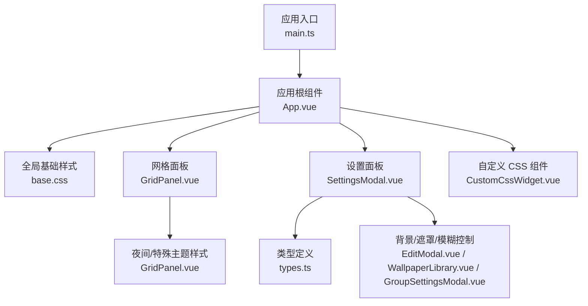
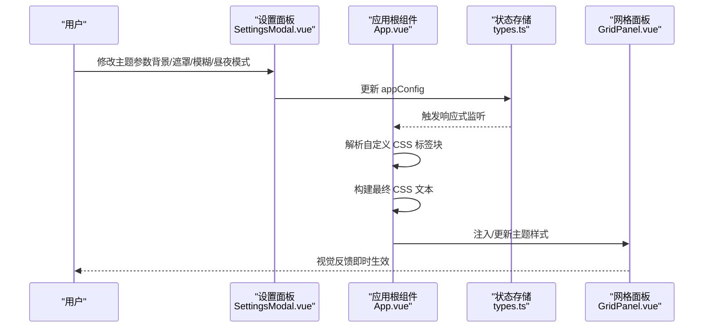
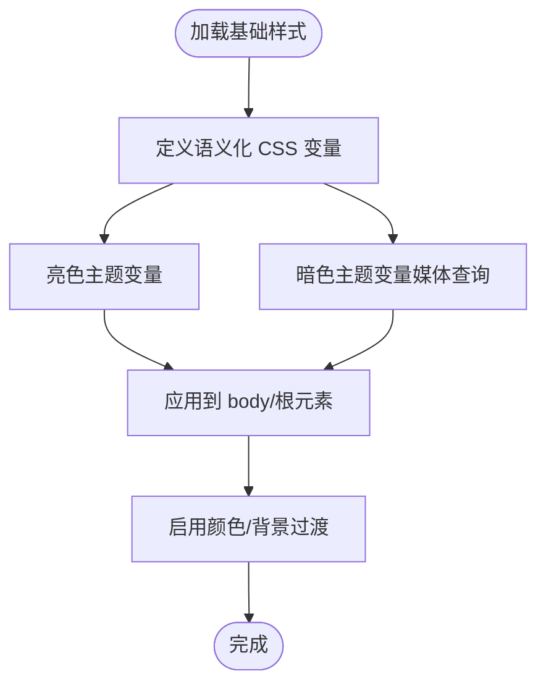
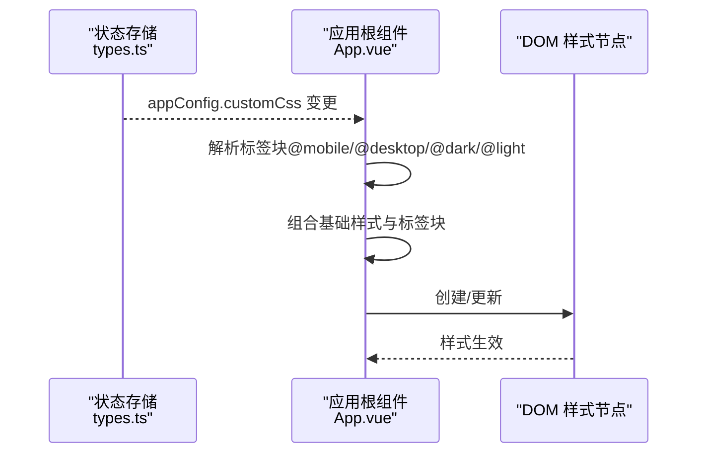
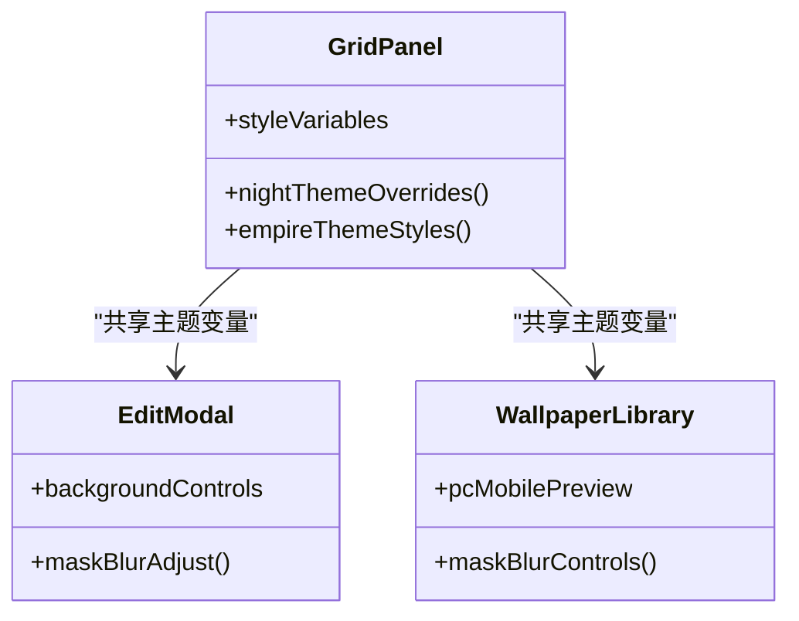
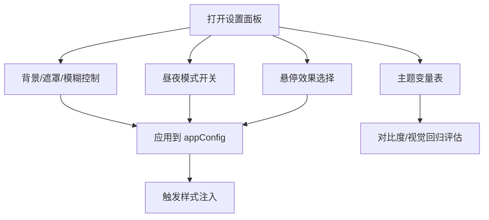
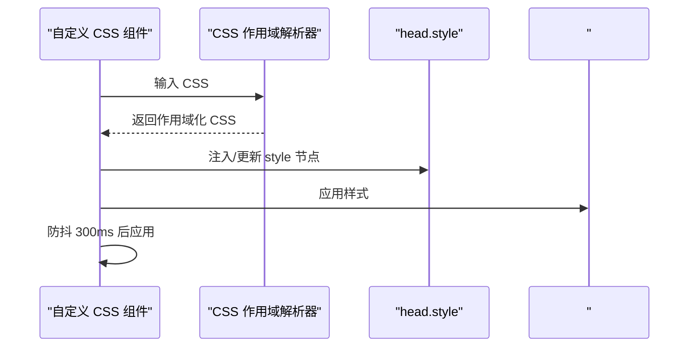
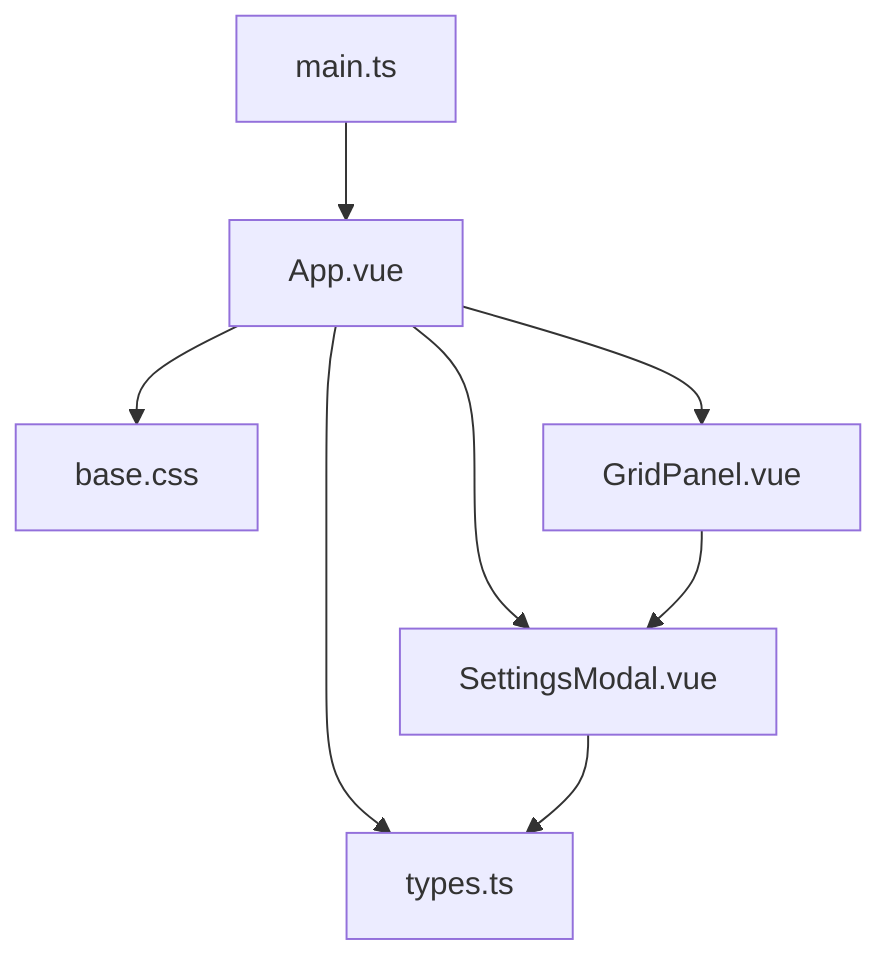

# 主题系统

<cite>
**本文档引用的文件**
- [main.ts](file://frontend/src/main.ts)
- [App.vue](file://frontend/src/App.vue)
- [base.css](file://frontend/src/assets/base.css)
- [GridPanel.vue](file://frontend/src/components/GridPanel.vue)
- [SettingsModal.vue](file://frontend/src/components/SettingsModal.vue)
- [CustomCssWidget.vue](file://frontend/src/components/CustomCssWidget.vue)
- [types.ts](file://frontend/src/types.ts)
- [EditModal.vue](file://frontend/src/components/EditModal.vue)
- [WallpaperLibrary.vue](file://frontend/src/components/WallpaperLibrary.vue)
- [GroupSettingsModal.vue](file://frontend/src/components/GroupSettingsModal.vue)
</cite>

## 目录
1. [简介](#简介)
2. [项目结构](#项目结构)
3. [核心组件](#核心组件)
4. [架构概览](#架构概览)
5. [详细组件分析](#详细组件分析)
6. [依赖关系分析](#依赖关系分析)
7. [性能考量](#性能考量)
8. [故障排除指南](#故障排除指南)
9. [结论](#结论)
10. [附录](#附录)

## 简介
本文件系统性阐述 OFlatNas 的主题系统，涵盖内置主题（深色/浅色/特殊主题）的特性与适用场景、自定义主题的创建流程（CSS 变量、颜色体系与组件样式覆盖）、主题切换机制（动态样式注入与持久化存储）、最佳实践（色彩搭配、可访问性与跨浏览器兼容性）、扩展与插件开发思路，以及性能优化与用户体验提升建议。目标是帮助开发者与高级用户快速理解并高效使用与扩展主题能力。

## 项目结构
主题系统围绕前端核心入口、全局样式基线、应用级主题注入与组件级主题覆盖展开：
- 应用入口负责初始化状态与全局行为
- 全局基础样式提供语义化 CSS 变量与媒体查询适配
- 应用组件通过响应式配置驱动主题注入与切换
- 设置面板提供主题相关参数的可视化控制
- 组件级样式覆盖通过 CSS 作用域与动态样式注入实现

**图表来源**
- [main.ts:1-37](file://frontend/src/main.ts#L1-L37)
- [App.vue:1-666](file://frontend/src/App.vue#L1-L666)
- [base.css:1-116](file://frontend/src/assets/base.css#L1-L116)
- [GridPanel.vue:2790-2815](file://frontend/src/components/GridPanel.vue#L2790-L2815)
- [SettingsModal.vue:1-200](file://frontend/src/components/SettingsModal.vue#L1-L200)
- [CustomCssWidget.vue:1-444](file://frontend/src/components/CustomCssWidget.vue#L1-L444)
- [types.ts:86-189](file://frontend/src/types.ts#L86-L189)

**章节来源**
- [main.ts:1-37](file://frontend/src/main.ts#L1-L37)
- [App.vue:1-666](file://frontend/src/App.vue#L1-L666)
- [base.css:1-116](file://frontend/src/assets/base.css#L1-L116)
- [GridPanel.vue:2790-2815](file://frontend/src/components/GridPanel.vue#L2790-L2815)
- [SettingsModal.vue:1-200](file://frontend/src/components/SettingsModal.vue#L1-L200)
- [CustomCssWidget.vue:1-444](file://frontend/src/components/CustomCssWidget.vue#L1-L444)
- [types.ts:86-189](file://frontend/src/types.ts#L86-L189)

## 核心组件
- 应用入口与初始化：负责全局类名注入与状态初始化，为主题系统提供运行时上下文。
- 全局基础样式：定义语义化 CSS 变量与暗色/亮色媒体查询，作为主题切换的基础。
- 应用级主题注入：通过监听应用配置中的自定义 CSS 字段，动态构建并注入样式块。
- 组件级主题覆盖：网格面板与特定组件提供主题类名与样式覆盖，实现“夜间/特殊”主题效果。
- 设置面板：提供背景、遮罩、模糊、昼夜模式、鼠标悬停效果等主题相关参数的可视化控制。
- 自定义 CSS 组件：提供组件级 CSS 作用域隔离与动态注入，便于局部主题定制。

**章节来源**
- [main.ts:1-37](file://frontend/src/main.ts#L1-L37)
- [App.vue:63-105](file://frontend/src/App.vue#L63-L105)
- [base.css:24-51](file://frontend/src/assets/base.css#L24-L51)
- [GridPanel.vue:4380-4405](file://frontend/src/components/GridPanel.vue#L4380-L4405)
- [SettingsModal.vue:1987-2313](file://frontend/src/components/SettingsModal.vue#L1987-L2313)
- [CustomCssWidget.vue:30-105](file://frontend/src/components/CustomCssWidget.vue#L30-L105)

## 架构概览
主题系统由“全局样式基线 + 应用级注入 + 组件级覆盖 + 用户配置面板”构成，形成从底层变量到顶层样式的完整链路。

**图表来源**
- [SettingsModal.vue:1987-2313](file://frontend/src/components/SettingsModal.vue#L1987-L2313)
- [App.vue:63-105](file://frontend/src/App.vue#L63-L105)
- [types.ts:86-189](file://frontend/src/types.ts#L86-L189)
- [GridPanel.vue:2790-2815](file://frontend/src/components/GridPanel.vue#L2790-L2815)

## 详细组件分析

### 全局基础样式与媒体查询
- 语义化 CSS 变量：定义背景、文本、边框等语义变量，便于主题切换时统一替换。
- 暗色/亮色适配：通过媒体查询在系统偏好变化时自动切换主题变量。
- 全局过渡动画：为颜色与背景切换提供平滑过渡体验。

**图表来源**
- [base.css:24-51](file://frontend/src/assets/base.css#L24-L51)

**章节来源**
- [base.css:1-116](file://frontend/src/assets/base.css#L1-L116)

### 应用级主题注入与动态样式
- 自定义 CSS 标签解析：支持 @mobile/@desktop/@dark/@light 等标签块，按环境注入对应媒体查询。
- 实时注入：监听 appConfig.customCss，构建最终 CSS 并注入到 head 中的独立 style 元素。
- 与 Pinia 状态联动：通过响应式监听实现即时生效与持久化。

**图表来源**
- [App.vue:63-105](file://frontend/src/App.vue#L63-L105)
- [types.ts:180-181](file://frontend/src/types.ts#L180-L181)

**章节来源**
- [App.vue:63-105](file://frontend/src/App.vue#L63-L105)
- [types.ts:86-189](file://frontend/src/types.ts#L86-L189)

### 组件级主题覆盖与夜间/特殊主题
- 夜间/特殊主题类名：网格面板提供 .night-settings/.empire-theme 等类名，配合 :deep 选择器覆盖第三方组件样式。
- 组件内样式覆盖：针对悬停、边框、文字颜色等进行针对性调整，避免浅色文字与浅色背景冲突。
- 主题变量映射：通过 CSS 变量控制分组标题、卡片背景、边框等关键元素的颜色。

**图表来源**
- [GridPanel.vue:2790-2815](file://frontend/src/components/GridPanel.vue#L2790-L2815)
- [GridPanel.vue:4380-4405](file://frontend/src/components/GridPanel.vue#L4380-L4405)
- [EditModal.vue:1462-1499](file://frontend/src/components/EditModal.vue#L1462-L1499)
- [WallpaperLibrary.vue:766-1112](file://frontend/src/components/WallpaperLibrary.vue#L766-L1112)

**章节来源**
- [GridPanel.vue:2790-2815](file://frontend/src/components/GridPanel.vue#L2790-L2815)
- [GridPanel.vue:4380-4405](file://frontend/src/components/GridPanel.vue#L4380-L4405)
- [EditModal.vue:1462-1499](file://frontend/src/components/EditModal.vue#L1462-L1499)
- [WallpaperLibrary.vue:766-1112](file://frontend/src/components/WallpaperLibrary.vue#L766-L1112)

### 设置面板与主题参数控制
- 背景与遮罩：支持上传背景图、调节模糊半径与遮罩浓度，提供 PC/移动端差异化控制。
- 昼夜模式：基于当前时间与用户设置，启用/禁用昼夜模式与遮罩强度。
- 鼠标悬停效果：提供 scale/lift/glow/none 等选项，影响卡片交互体验。
- 主题变量展示：以表格形式展示当前主题变量及其对比度与视觉回归状态。

**图表来源**
- [SettingsModal.vue:1987-2313](file://frontend/src/components/SettingsModal.vue#L1987-L2313)
- [SettingsModal.vue:4053-4102](file://frontend/src/components/SettingsModal.vue#L4053-L4102)

**章节来源**
- [SettingsModal.vue:1987-2313](file://frontend/src/components/SettingsModal.vue#L1987-L2313)
- [SettingsModal.vue:4053-4102](file://frontend/src/components/SettingsModal.vue#L4053-L4102)

### 自定义 CSS 组件与作用域隔离
- CSS 作用域：对组件内部 CSS 进行作用域隔离，确保样式不会泄漏到全局。
- 实时预览：编辑 CSS 时进行防抖处理，300ms 后应用到组件容器。
- JS 执行上下文：为组件 JS 提供受限上下文（el/query/queryAll/onCleanup/on/emit），便于交互逻辑编写。

**图表来源**
- [CustomCssWidget.vue:30-105](file://frontend/src/components/CustomCssWidget.vue#L30-L105)

**章节来源**
- [CustomCssWidget.vue:1-444](file://frontend/src/components/CustomCssWidget.vue#L1-L444)

## 依赖关系分析
- 入口依赖：应用入口依赖 Pinia 状态与全局初始化，为主题系统提供运行时上下文。
- 样式依赖：全局样式依赖媒体查询与 CSS 变量，作为主题切换的底层支撑。
- 组件依赖：设置面板依赖状态存储与类型定义；网格面板依赖设置面板提供的主题变量。
- 注入依赖：应用根组件依赖设置面板的配置变更，动态构建并注入样式。

**图表来源**
- [main.ts:1-37](file://frontend/src/main.ts#L1-L37)
- [App.vue:1-666](file://frontend/src/App.vue#L1-L666)
- [types.ts:86-189](file://frontend/src/types.ts#L86-L189)
- [base.css:1-116](file://frontend/src/assets/base.css#L1-L116)
- [SettingsModal.vue:1-200](file://frontend/src/components/SettingsModal.vue#L1-L200)
- [GridPanel.vue:2790-2815](file://frontend/src/components/GridPanel.vue#L2790-L2815)

**章节来源**
- [main.ts:1-37](file://frontend/src/main.ts#L1-L37)
- [App.vue:1-666](file://frontend/src/App.vue#L1-L666)
- [types.ts:86-189](file://frontend/src/types.ts#L86-L189)
- [base.css:1-116](file://frontend/src/assets/base.css#L1-L116)
- [SettingsModal.vue:1-200](file://frontend/src/components/SettingsModal.vue#L1-L200)
- [GridPanel.vue:2790-2815](file://frontend/src/components/GridPanel.vue#L2790-L2815)

## 性能考量
- 样式注入节流：应用根组件对自定义 CSS 的注入采用一次性构建与统一注入策略，避免频繁 DOM 操作。
- 防抖预览：组件级 CSS 编辑采用 300ms 防抖，平衡实时性与性能。
- 媒体查询优化：通过 @mobile/@desktop/@dark/@light 标签块按环境注入，减少不必要的样式计算。
- 资源版本控制：通过资源版本号实现缓存失效与资源更新，避免主题资源缓存导致的视觉不一致。

[本节为通用指导，无需具体文件引用]

## 故障排除指南
- 样式未生效：检查 appConfig.customCss 是否存在有效标签块；确认注入的 style 节点是否存在且内容正确。
- 夜间模式异常：确认系统偏好或用户设置是否启用了昼夜模式；检查网格面板的主题类名是否正确附加。
- 背景/遮罩/模糊无效：核对设置面板中的参数是否被持久化到 appConfig；检查组件级控制项（编辑弹窗/壁纸库/分组设置）是否同步更新。
- 组件级样式冲突：使用组件级 CSS 作用域隔离；必要时通过 :deep 选择器进行局部覆盖。

**章节来源**
- [App.vue:63-105](file://frontend/src/App.vue#L63-L105)
- [GridPanel.vue:4380-4405](file://frontend/src/components/GridPanel.vue#L4380-L4405)
- [EditModal.vue:1462-1499](file://frontend/src/components/EditModal.vue#L1462-L1499)
- [WallpaperLibrary.vue:766-1112](file://frontend/src/components/WallpaperLibrary.vue#L766-L1112)
- [GroupSettingsModal.vue:462-491](file://frontend/src/components/GroupSettingsModal.vue#L462-L491)

## 结论
OFlatNas 的主题系统以“语义化 CSS 变量 + 媒体查询 + 动态样式注入 + 组件级覆盖”为核心，结合设置面板的可视化控制与组件级 CSS 作用域隔离，实现了灵活、可扩展且高性能的主题体验。通过合理运用内置主题与自定义 CSS，用户可以轻松打造符合个人偏好的界面风格，并在保持良好可访问性与跨浏览器兼容性的前提下，获得流畅的视觉与交互体验。

## 附录
- 最佳实践清单
  - 色彩搭配：遵循对比度标准，确保文本与背景的可读性；为高亮元素提供足够的视觉层次。
  - 可访问性：优先使用语义化变量与系统偏好检测；为键盘导航与屏幕阅读器提供友好支持。
  - 跨浏览器兼容：尽量使用稳定 CSS 特性；对实验性特性提供降级方案。
  - 性能优化：减少不必要的样式重排与重绘；利用媒体查询与防抖策略降低渲染压力。
  - 扩展与插件：通过自定义 CSS 与组件级作用域隔离实现主题扩展；在市场组件中提供 CSS/JS 组合包，便于分享与复用。

[本节为通用指导，无需具体文件引用]