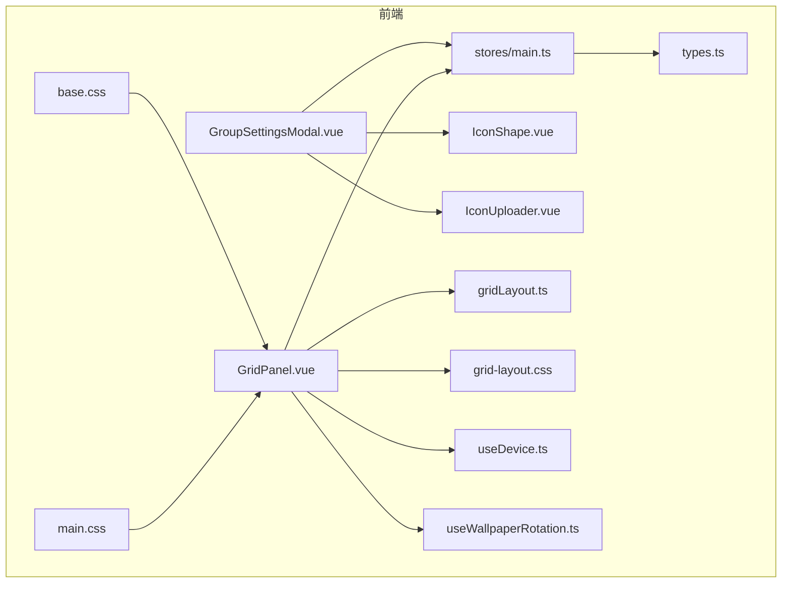
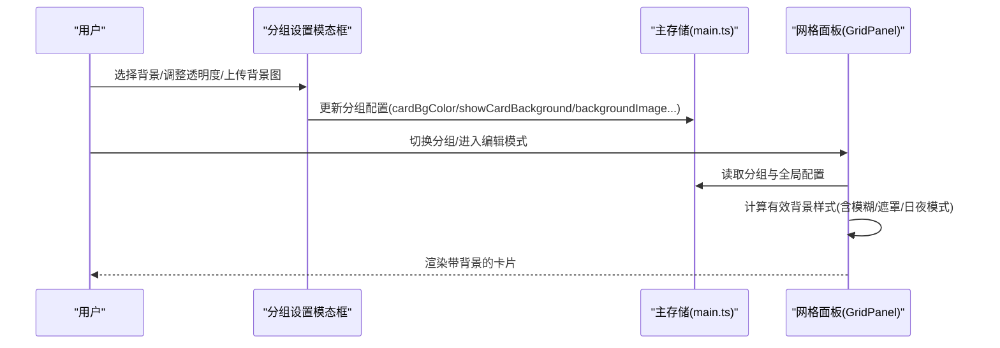
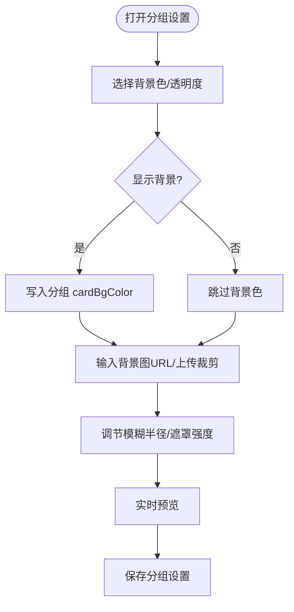
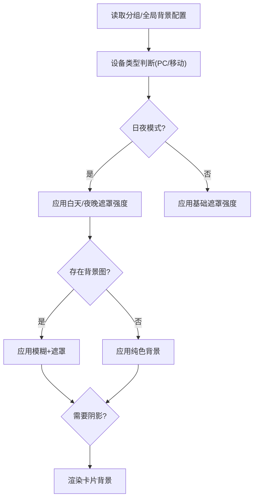
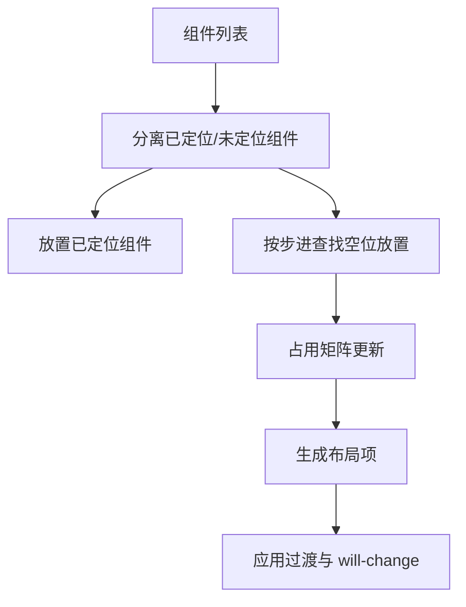
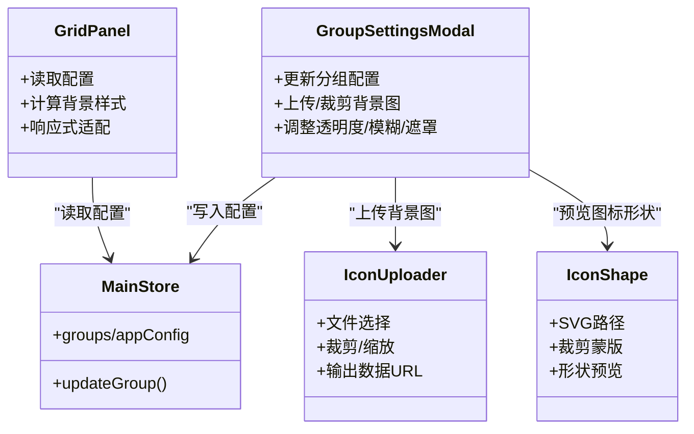

# 分组卡片背景

<cite>
**本文引用的文件**
- [frontend/src/components/GroupSettingsModal.vue](file://frontend/src/components/GroupSettingsModal.vue)
- [frontend/src/components/GridPanel.vue](file://frontend/src/components/GridPanel.vue)
- [frontend/src/utils/gridLayout.ts](file://frontend/src/utils/gridLayout.ts)
- [frontend/src/assets/grid-layout.css](file://frontend/src/assets/grid-layout.css)
- [frontend/src/components/IconShape.vue](file://frontend/src/components/IconShape.vue)
- [frontend/src/components/IconUploader.vue](file://frontend/src/components/IconUploader.vue)
- [frontend/src/composables/useDevice.ts](file://frontend/src/composables/useDevice.ts)
- [frontend/src/composables/useWallpaperRotation.ts](file://frontend/src/composables/useWallpaperRotation.ts)
- [frontend/src/assets/base.css](file://frontend/src/assets/base.css)
- [frontend/src/assets/main.css](file://frontend/src/assets/main.css)
- [frontend/src/stores/main.ts](file://frontend/src/stores/main.ts)
- [frontend/src/types.ts](file://frontend/src/types.ts)
</cite>

## 目录
1. [简介](#简介)
2. [项目结构](#项目结构)
3. [核心组件](#核心组件)
4. [架构总览](#架构总览)
5. [详细组件分析](#详细组件分析)
6. [依赖关系分析](#依赖关系分析)
7. [性能考量](#性能考量)
8. [故障排查指南](#故障排查指南)
9. [结论](#结论)
10. [附录](#附录)

## 简介
本文件聚焦 OFlatNas 的“分组卡片背景”定制能力，系统性阐述以下内容：
- 分组设置模态框中背景颜色、透明度与渐变的配置方式
- 网格布局中卡片背景的定制选项（间距、圆角、阴影等）
- 响应式背景适配机制（PC/移动端、日夜模式、设备类型）
- 背景设计示例（纯色、渐变、图案）
- 性能优化技巧（CSS 动画、GPU 加速）
- 设计原则与用户体验最佳实践

## 项目结构
围绕“分组卡片背景”的关键文件与职责如下：
- GroupSettingsModal.vue：分组设置入口，提供背景颜色、透明度、背景图、模糊与遮罩等配置
- GridPanel.vue：网格布局渲染与背景应用，负责将分组与全局配置映射到卡片样式
- gridLayout.ts 与 grid-layout.css：网格布局算法与动画过渡样式
- IconShape.vue 与 IconUploader.vue：图标形状与背景图上传/裁剪
- useDevice.ts 与 useWallpaperRotation.ts：设备类型识别与壁纸轮播
- base.css 与 main.css：基础主题变量与滚动条玻璃化样式
- stores/main.ts 与 types.ts：全局状态与数据模型（含背景相关字段）

图表来源
- [frontend/src/components/GroupSettingsModal.vue](file://frontend/src/components/GroupSettingsModal.vue)
- [frontend/src/components/GridPanel.vue](file://frontend/src/components/GridPanel.vue)
- [frontend/src/utils/gridLayout.ts](file://frontend/src/utils/gridLayout.ts)
- [frontend/src/assets/grid-layout.css](file://frontend/src/assets/grid-layout.css)
- [frontend/src/components/IconShape.vue](file://frontend/src/components/IconShape.vue)
- [frontend/src/components/IconUploader.vue](file://frontend/src/components/IconUploader.vue)
- [frontend/src/composables/useDevice.ts](file://frontend/src/composables/useDevice.ts)
- [frontend/src/composables/useWallpaperRotation.ts](file://frontend/src/composables/useWallpaperRotation.ts)
- [frontend/src/assets/base.css](file://frontend/src/assets/base.css)
- [frontend/src/assets/main.css](file://frontend/src/assets/main.css)
- [frontend/src/stores/main.ts](file://frontend/src/stores/main.ts)
- [frontend/src/types.ts](file://frontend/src/types.ts)

章节来源
- [frontend/src/components/GroupSettingsModal.vue](file://frontend/src/components/GroupSettingsModal.vue)
- [frontend/src/components/GridPanel.vue](file://frontend/src/components/GridPanel.vue)
- [frontend/src/utils/gridLayout.ts](file://frontend/src/utils/gridLayout.ts)
- [frontend/src/assets/grid-layout.css](file://frontend/src/assets/grid-layout.css)
- [frontend/src/components/IconShape.vue](file://frontend/src/components/IconShape.vue)
- [frontend/src/components/IconUploader.vue](file://frontend/src/components/IconUploader.vue)
- [frontend/src/composables/useDevice.ts](file://frontend/src/composables/useDevice.ts)
- [frontend/src/composables/useWallpaperRotation.ts](file://frontend/src/composables/useWallpaperRotation.ts)
- [frontend/src/assets/base.css](file://frontend/src/assets/base.css)
- [frontend/src/assets/main.css](file://frontend/src/assets/main.css)
- [frontend/src/stores/main.ts](file://frontend/src/stores/main.ts)
- [frontend/src/types.ts](file://frontend/src/types.ts)

## 核心组件
- 分组设置模态框（GroupSettingsModal）
  - 提供背景颜色（HEX/RGBA）、透明度滑块、显示开关
  - 支持背景图 URL 输入、上传裁剪、模糊半径与遮罩强度调节
  - 图标形状选择与预览
- 网格面板（GridPanel）
  - 将分组与全局配置映射为卡片背景样式
  - 响应式背景适配（PC/移动、日夜模式）
  - 背景图叠加模糊与遮罩，提升可读性
- 图标形状（IconShape）
  - 多种几何形状裁剪，支持纯色/类名/内联样式
- 背景图上传（IconUploader）
  - 文件选择、裁剪（216×216）、缩放、确认回调

章节来源
- [frontend/src/components/GroupSettingsModal.vue](file://frontend/src/components/GroupSettingsModal.vue)
- [frontend/src/components/GridPanel.vue](file://frontend/src/components/GridPanel.vue)
- [frontend/src/components/IconShape.vue](file://frontend/src/components/IconShape.vue)
- [frontend/src/components/IconUploader.vue](file://frontend/src/components/IconUploader.vue)

## 架构总览
分组卡片背景的配置流与渲染流如下：

图表来源
- [frontend/src/components/GroupSettingsModal.vue](file://frontend/src/components/GroupSettingsModal.vue)
- [frontend/src/components/GridPanel.vue](file://frontend/src/components/GridPanel.vue)
- [frontend/src/stores/main.ts](file://frontend/src/stores/main.ts)

## 详细组件分析

### 组件一：分组设置模态框（背景配置）
- 背景颜色与透明度
  - 通过颜色输入与透明度滑块联动，内部转换为 RGBA 并写入分组配置
  - 显示开关控制是否应用卡片背景
- 背景图与遮罩
  - 支持 URL 输入与上传裁剪（216×216 PNG）
  - 提供模糊半径与遮罩强度滑块，实时预览叠加效果
- 图标形状
  - 多种几何形状（圆/方/叶/菱/多边形等），即时预览

图表来源
- [frontend/src/components/GroupSettingsModal.vue](file://frontend/src/components/GroupSettingsModal.vue)
- [frontend/src/components/IconUploader.vue](file://frontend/src/components/IconUploader.vue)
- [frontend/src/components/IconShape.vue](file://frontend/src/components/IconShape.vue)

章节来源
- [frontend/src/components/GroupSettingsModal.vue](file://frontend/src/components/GroupSettingsModal.vue)
- [frontend/src/components/IconUploader.vue](file://frontend/src/components/IconUploader.vue)
- [frontend/src/components/IconShape.vue](file://frontend/src/components/IconShape.vue)

### 组件二：网格面板（背景渲染与响应式适配）
- 背景样式计算
  - 优先使用分组配置，否则回退到全局配置
  - 结合日夜模式与设备类型，动态调整遮罩强度
- 背景图叠加
  - 支持分组级背景图与卡片级背景图
  - 应用模糊与遮罩，必要时添加阴影增强层次感
- 响应式适配
  - 通过设备检测（桌面/平板/手机）与窗口尺寸，调整布局与背景策略
  - 移动端与 PC 端分别加载不同背景资源，提升性能

图表来源
- [frontend/src/components/GridPanel.vue](file://frontend/src/components/GridPanel.vue)
- [frontend/src/composables/useDevice.ts](file://frontend/src/composables/useDevice.ts)
- [frontend/src/composables/useWallpaperRotation.ts](file://frontend/src/composables/useWallpaperRotation.ts)

章节来源
- [frontend/src/components/GridPanel.vue](file://frontend/src/components/GridPanel.vue)
- [frontend/src/composables/useDevice.ts](file://frontend/src/composables/useDevice.ts)
- [frontend/src/composables/useWallpaperRotation.ts](file://frontend/src/composables/useWallpaperRotation.ts)

### 组件三：网格布局算法与动画
- 布局算法
  - 采用网格矩阵与步进策略，保证组件不重叠、紧凑排列
  - 支持列数动态变化，自动回退到可用位置
- 动画与过渡
  - 布局项拖拽/调整尺寸时的过渡属性与 will-change 提升性能
  - 通过 CSS 变量与类名切换，实现平滑动画

图表来源
- [frontend/src/utils/gridLayout.ts](file://frontend/src/utils/gridLayout.ts)
- [frontend/src/assets/grid-layout.css](file://frontend/src/assets/grid-layout.css)

章节来源
- [frontend/src/utils/gridLayout.ts](file://frontend/src/utils/gridLayout.ts)
- [frontend/src/assets/grid-layout.css](file://frontend/src/assets/grid-layout.css)

### 组件四：图标形状与背景图上传
- 图标形状
  - 基于 SVG 路径与裁剪蒙版，支持多种几何形状
  - 支持背景色类名解析与内联样式
- 背景图上传
  - 文件选择、预览、裁剪（固定比例/尺寸）、缩放调节
  - 输出高质量 PNG 数据 URL，便于直接应用

章节来源
- [frontend/src/components/IconShape.vue](file://frontend/src/components/IconShape.vue)
- [frontend/src/components/IconUploader.vue](file://frontend/src/components/IconUploader.vue)

## 依赖关系分析
- 组件耦合
  - GroupSettingsModal 与 GridPanel 通过主存储共享配置
  - GridPanel 依赖设备检测与壁纸轮播组合式，影响背景资源加载
- 数据模型
  - 分组与全局配置均包含背景相关字段（颜色、显示、图、模糊、遮罩等）
  - 类型定义集中于 types.ts，确保配置一致性

图表来源
- [frontend/src/components/GroupSettingsModal.vue](file://frontend/src/components/GroupSettingsModal.vue)
- [frontend/src/components/GridPanel.vue](file://frontend/src/components/GridPanel.vue)
- [frontend/src/components/IconUploader.vue](file://frontend/src/components/IconUploader.vue)
- [frontend/src/components/IconShape.vue](file://frontend/src/components/IconShape.vue)
- [frontend/src/stores/main.ts](file://frontend/src/stores/main.ts)

章节来源
- [frontend/src/stores/main.ts](file://frontend/src/stores/main.ts)
- [frontend/src/types.ts](file://frontend/src/types.ts)

## 性能考量
- CSS 动画与 GPU 加速
  - 使用 will-change 与 transform 优化布局项移动/缩放动画
  - 合理使用混合模式与滤镜，避免过度重绘
- 资源加载
  - 背景图懒加载与完成状态标记，避免闪烁
  - 移动端与 PC 端分别加载，减少不必要的带宽消耗
- 响应式与设备感知
  - 通过设备检测与窗口尺寸，动态调整布局密度与背景策略
  - 日夜模式下统一遮罩强度，兼顾可读性与性能

章节来源
- [frontend/src/assets/grid-layout.css](file://frontend/src/assets/grid-layout.css)
- [frontend/src/components/GridPanel.vue](file://frontend/src/components/GridPanel.vue)
- [frontend/src/composables/useDevice.ts](file://frontend/src/composables/useDevice.ts)
- [frontend/src/composables/useWallpaperRotation.ts](file://frontend/src/composables/useWallpaperRotation.ts)

## 故障排查指南
- 背景图不生效
  - 检查分组配置中的背景图 URL 是否正确
  - 确认上传裁剪流程已完成并返回数据 URL
- 透明度/模糊/遮罩异常
  - 确认分组配置与全局配置优先级顺序
  - 在日夜模式下核对遮罩强度差异
- 卡片背景与文本对比度低
  - 调整遮罩强度或背景色透明度
  - 必要时为文字添加投影或反色处理
- 移动端背景卡顿
  - 减小背景图尺寸与模糊半径
  - 使用设备区分的背景资源

章节来源
- [frontend/src/components/GroupSettingsModal.vue](file://frontend/src/components/GroupSettingsModal.vue)
- [frontend/src/components/GridPanel.vue](file://frontend/src/components/GridPanel.vue)
- [frontend/src/components/IconUploader.vue](file://frontend/src/components/IconUploader.vue)

## 结论
通过分组设置模态框与网格面板的协同，OFlatNas 实现了灵活而强大的“分组卡片背景”定制能力。结合响应式适配与性能优化策略，既能满足多样化的视觉需求，又能保障在多设备与场景下的流畅体验。

## 附录

### 背景设计示例（步骤说明）
- 纯色背景
  - 在分组设置中开启“显示背景”，选择颜色并调节透明度
- 渐变背景
  - 使用背景图上传功能，准备渐变图像并应用
- 图案背景
  - 上传图案背景图，配合模糊与遮罩，确保文字清晰可读
- 图标形状
  - 在图标形状选择器中预览并应用不同几何形状

章节来源
- [frontend/src/components/GroupSettingsModal.vue](file://frontend/src/components/GroupSettingsModal.vue)
- [frontend/src/components/IconUploader.vue](file://frontend/src/components/IconUploader.vue)
- [frontend/src/components/IconShape.vue](file://frontend/src/components/IconShape.vue)