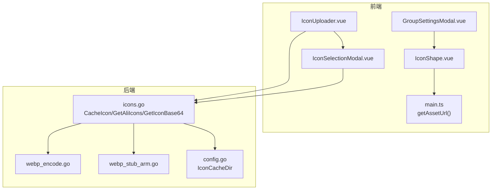
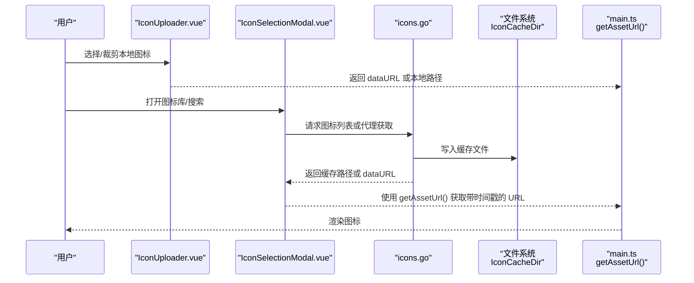
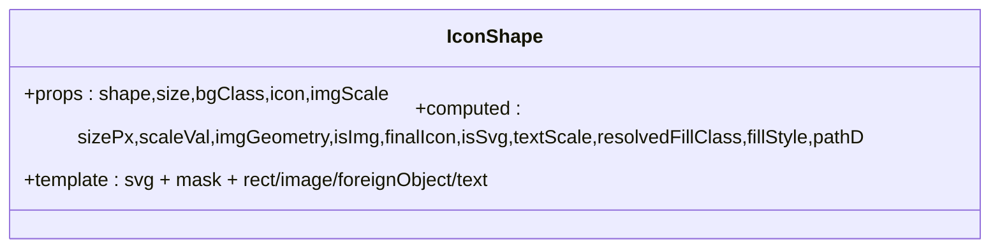
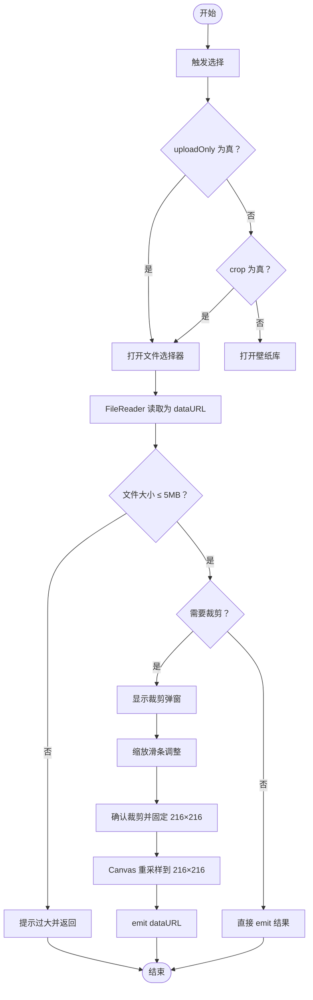
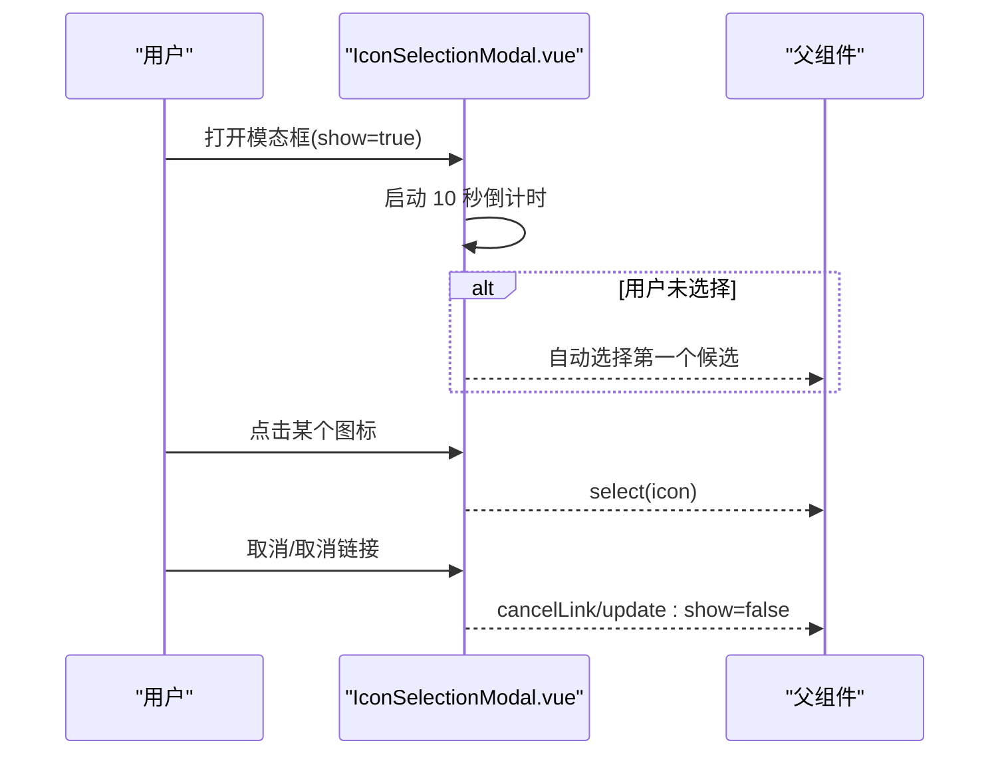
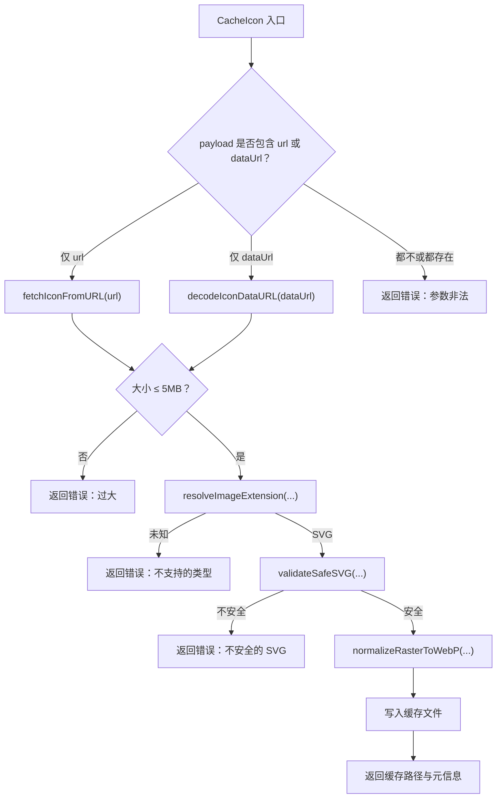
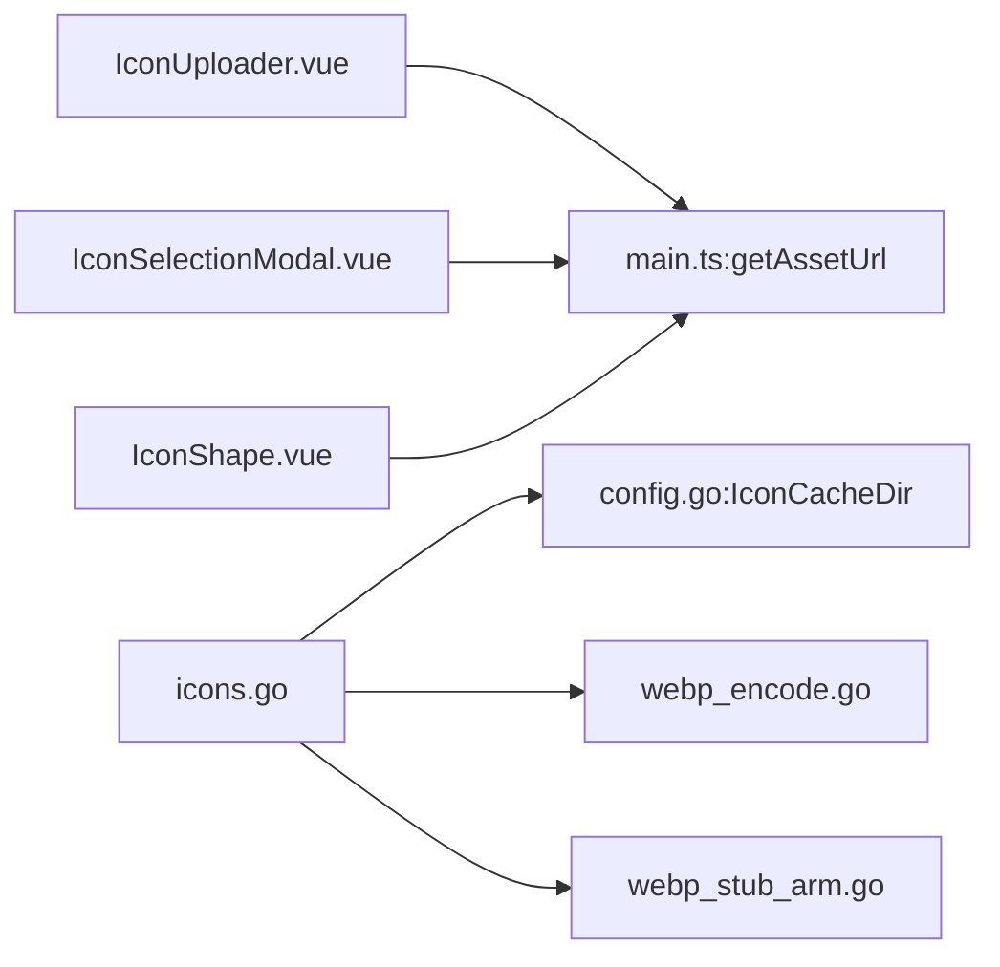

# 图标管理

<cite>
**本文引用的文件列表**
- [IconShape.vue](file://frontend/src/components/IconShape.vue)
- [IconUploader.vue](file://frontend/src/components/IconUploader.vue)
- [IconSelectionModal.vue](file://frontend/src/components/IconSelectionModal.vue)
- [icons.go](file://backend/handlers/icons.go)
- [webp_encode.go](file://backend/handlers/webp_encode.go)
- [webp_stub_arm.go](file://backend/handlers/webp_stub_arm.go)
- [config.go](file://backend/config/config.go)
- [main.ts](file://frontend/src/stores/main.ts)
- [GroupSettingsModal.vue](file://frontend/src/components/GroupSettingsModal.vue)
</cite>

## 目录
1. [简介](#简介)
2. [项目结构与职责划分](#项目结构与职责划分)
3. [核心组件](#核心组件)
4. [架构总览](#架构总览)
5. [详细组件分析](#详细组件分析)
6. [依赖关系分析](#依赖关系分析)
7. [性能与缓存策略](#性能与缓存策略)
8. [最佳实践与规范](#最佳实践与规范)
9. [故障排查指南](#故障排查指南)
10. [结论](#结论)

## 简介
本文件面向 OFlatNas 的图标管理能力，围绕以下目标展开：
- 深入讲解图标形状定制功能，包括 IconShape 组件的使用方法与自定义选项
- 详解图标上传流程，包括支持的文件格式、大小限制与前端裁剪体验
- 解释图标选择模态框的使用方法，包括图标库浏览与搜索功能
- 提供图标管理的最佳实践，涵盖命名规范、尺寸标准与视觉一致性
- 介绍图标缓存机制与性能优化策略（含 WebP 转换）
- 提供常见问题的解决方案，如图标加载失败、格式不兼容等

## 项目结构与职责划分
- 前端组件
  - IconShape：渲染任意图标（图片、SVG、文本），支持多种形状裁剪与背景填充
  - IconUploader：本地上传、裁剪、预览与选择，支持从壁纸库选择
  - IconSelectionModal：图标库浏览、自动选择计时器、分页加载与名称解析
- 后端处理器
  - icons.go：远程图标缓存、数据 URL 缓存、SVG 安全校验、WebP 转换、跨域代理
  - webp_encode.go/webp_stub_arm.go：基于平台的 WebP 转换逻辑
  - config.go：图标缓存目录初始化与路径管理
- 应用状态与配置
  - main.ts：资源版本缓存控制、getAssetUrl 带时间戳参数的 URL 构造
  - GroupSettingsModal.vue：在界面中设置组级别的图标形状

图表来源
- [IconShape.vue:1-171](file://frontend/src/components/IconShape.vue#L1-L171)
- [IconUploader.vue:1-209](file://frontend/src/components/IconUploader.vue#L1-L209)
- [IconSelectionModal.vue:1-195](file://frontend/src/components/IconSelectionModal.vue#L1-L195)
- [icons.go:1-533](file://backend/handlers/icons.go#L1-L533)
- [webp_encode.go:1-45](file://backend/handlers/webp_encode.go#L1-L45)
- [webp_stub_arm.go:1-8](file://backend/handlers/webp_stub_arm.go#L1-L8)
- [config.go:1-257](file://backend/config/config.go#L1-L257)
- [main.ts:561-577](file://frontend/src/stores/main.ts#L561-L577)
- [GroupSettingsModal.vue:508-537](file://frontend/src/components/GroupSettingsModal.vue#L508-L537)

章节来源
- [IconShape.vue:1-171](file://frontend/src/components/IconShape.vue#L1-L171)
- [IconUploader.vue:1-209](file://frontend/src/components/IconUploader.vue#L1-L209)
- [IconSelectionModal.vue:1-195](file://frontend/src/components/IconSelectionModal.vue#L1-L195)
- [icons.go:1-533](file://backend/handlers/icons.go#L1-L533)
- [webp_encode.go:1-45](file://backend/handlers/webp_encode.go#L1-L45)
- [webp_stub_arm.go:1-8](file://backend/handlers/webp_stub_arm.go#L1-L8)
- [config.go:1-257](file://backend/config/config.go#L1-L257)
- [main.ts:561-577](file://frontend/src/stores/main.ts#L561-L577)
- [GroupSettingsModal.vue:508-537](file://frontend/src/components/GroupSettingsModal.vue#L508-L537)

## 核心组件
- IconShape：负责根据传入的形状、尺寸、背景色与图标内容，渲染出最终的图标容器与内容（图片、SVG 或文本）。支持多种内置形状路径，具备背景填充与图片缩放控制。
- IconUploader：提供本地文件选择、读取、裁剪（可选）、预览与结果回传；支持从壁纸库选择；内置 5MB 文件大小限制与裁剪尺寸固定为 216×216。
- IconSelectionModal：提供图标库浏览、自动选择倒计时、分页加载、名称解析与“取消链接”等交互；支持本地图标与网络图标两类来源。

章节来源
- [IconShape.vue:10-94](file://frontend/src/components/IconShape.vue#L10-L94)
- [IconUploader.vue:8-104](file://frontend/src/components/IconUploader.vue#L8-L104)
- [IconSelectionModal.vue:5-93](file://frontend/src/components/IconSelectionModal.vue#L5-L93)

## 架构总览
图标管理从前端到后端的关键流程如下：
- 前端通过 IconUploader 选择或裁剪图标，得到 dataURL 或本地路径
- 若需要网络图标，IconSelectionModal 可调用后端接口获取图标列表或代理获取远程图标
- 后端 icons.go 提供 CacheIcon（缓存远程或 dataURL 图标）、GetAliIcons（阿里图标库代理）、GetIconBase64（将远程 URL 转为 dataURL）
- 后端对图标进行安全校验（SVG）、格式识别与 WebP 转换（按配置），并将结果写入图标缓存目录
- 前端通过 main.ts 的 getAssetUrl 为静态资源附加时间戳参数，避免缓存导致的更新不生效

图表来源
- [IconUploader.vue:33-104](file://frontend/src/components/IconUploader.vue#L33-L104)
- [IconSelectionModal.vue:19-54](file://frontend/src/components/IconSelectionModal.vue#L19-L54)
- [icons.go:108-228](file://backend/handlers/icons.go#L108-L228)
- [config.go:77](file://backend/config/config.go#L77)
- [main.ts:561-577](file://frontend/src/stores/main.ts#L561-L577)

## 详细组件分析

### IconShape 组件
- 功能要点
  - 形状：支持 circle、rounded（圆角矩形近似）、square、diamond、hexagon、octagon、pentagon、leaf 等内置路径；默认兜底为圆角矩形
  - 尺寸：通过 size 属性控制容器宽高；内部图片几何由 imgScale 控制缩放
  - 背景：支持颜色值或 Tailwind 风格类名（bg- 前缀会被转换为 fill-），透明背景
  - 内容：优先判断是否为图片（dataURL、blob、HTTP、包含斜杠或点的路径且非 SVG 文本），否则作为 SVG 字符串渲染，否则作为文本显示
  - 裁剪：通过 SVG mask 实现，shape 为 none 时不启用裁剪
- 关键属性
  - shape：字符串，形状类型
  - size：数字，像素尺寸
  - bgClass：字符串或颜色值，背景填充
  - icon：字符串，图标内容（URL、dataURL、blob、SVG 文本或纯文本）
  - imgScale：百分比，图片缩放比例
- 性能与可用性
  - 生成唯一 mask ID，避免多实例冲突
  - 对于 SVG 文本，使用 foreignObject + 缩放，确保在不同尺寸下保持一致观感

图表来源
- [IconShape.vue:10-94](file://frontend/src/components/IconShape.vue#L10-L94)

章节来源
- [IconShape.vue:1-171](file://frontend/src/components/IconShape.vue#L1-L171)

### 图标上传与裁剪流程（IconUploader）
- 交互行为
  - 触发选择：根据 uploadOnly/crop 与来源决定打开文件选择器或壁纸库
  - 读取文件：FileReader 读取为 dataURL，限制最大 5MB
  - 裁剪：可选开启，使用 vue-cropper 固定输出 216×216，支持缩放滑条
  - 结果：emit 更新父组件绑定值（dataURL 或本地路径）
- 与壁纸库联动
  - 可通过 WallpaperLibrary 组件选择已有壁纸并回传 URL

图表来源
- [IconUploader.vue:33-104](file://frontend/src/components/IconUploader.vue#L33-L104)

章节来源
- [IconUploader.vue:1-209](file://frontend/src/components/IconUploader.vue#L1-L209)

### 图标选择模态框（IconSelectionModal）
- 功能要点
  - 自动选择计时器：打开后 10 秒内若无手动选择，自动选择第一个候选项
  - 分页加载：每页加载固定数量，支持“加载更多”
  - 名称解析：从 URL/路径中提取图标名称（去除扩展名与编码）
  - 来源切换：本地图标与网络图标两类，网络图标支持“取消链接”
  - 预设推荐：本地图标模式下展示一组推荐图标
- 事件与状态
  - 通过 show/candidates/title/source 控制显示与数据
  - select/cancelLink/update:show 事件与父组件通信

图表来源
- [IconSelectionModal.vue:19-54](file://frontend/src/components/IconSelectionModal.vue#L19-L54)
- [IconSelectionModal.vue:174-190](file://frontend/src/components/IconSelectionModal.vue#L174-L190)

章节来源
- [IconSelectionModal.vue:1-195](file://frontend/src/components/IconSelectionModal.vue#L1-L195)

### 后端图标缓存与处理（icons.go）
- 缓存入口
  - CacheIcon：接收 url 或 dataUrl，下载/解码后进行大小与类型检查、SVG 安全校验、可选 WebP 转换，写入图标缓存目录，返回缓存路径
- 代理与工具
  - GetAliIcons：代理阿里图标库，带内存缓存（24 小时）
  - GetIconBase64：将远程 URL 转为 dataURL，限制最大 5MB
- 安全与格式
  - SVG 安全校验：禁止 script、javascript:、onload/onerror 等危险标记
  - 格式识别：基于 Content-Type、文件头与 MIME 映射，支持 PNG/JPG/GIF/SVG/ICO/WebP
- 平台差异
  - WebP 转换：在非 ARM 平台使用 webp 包进行高质量压缩；ARM 平台回退为不转换

图表来源
- [icons.go:108-228](file://backend/handlers/icons.go#L108-L228)
- [icons.go:336-393](file://backend/handlers/icons.go#L336-L393)
- [icons.go:395-439](file://backend/handlers/icons.go#L395-L439)
- [icons.go:441-460](file://backend/handlers/icons.go#L441-L460)
- [icons.go:462-532](file://backend/handlers/icons.go#L462-L532)
- [webp_encode.go:13-45](file://backend/handlers/webp_encode.go#L13-L45)
- [webp_stub_arm.go:5-8](file://backend/handlers/webp_stub_arm.go#L5-L8)

章节来源
- [icons.go:1-533](file://backend/handlers/icons.go#L1-L533)
- [webp_encode.go:1-45](file://backend/handlers/webp_encode.go#L1-L45)
- [webp_stub_arm.go:1-8](file://backend/handlers/webp_stub_arm.go#L1-L8)

### 前端资源缓存与 URL 处理（main.ts）
- getAssetUrl：为资源 URL 追加时间戳参数，避免浏览器缓存导致的更新不生效；对 dataURL/blob 直接透传
- resourceVersion：全局资源版本号，用于统一刷新

章节来源
- [main.ts:561-577](file://frontend/src/stores/main.ts#L561-L577)

### 组级别图标形状配置（GroupSettingsModal.vue）
- 在设置面板中提供下拉选择图标形状，并实时预览
- 支持 none/hidden/rounded/square/circle/leaf/diamond/pentagon/hexagon/octagon 等选项
- 与 IconShape 组件配合，实现全局或分组的图标风格统一

章节来源
- [GroupSettingsModal.vue:508-537](file://frontend/src/components/GroupSettingsModal.vue#L508-L537)

## 依赖关系分析
- 组件耦合
  - IconUploader 依赖 WallpaperLibrary 与 main.store.getAssetUrl
  - IconSelectionModal 依赖 main.store.getAssetUrl 与后端 icons 接口
  - IconShape 依赖 main.store.getAssetUrl 与 props 输入
- 后端依赖
  - icons.go 依赖 config.IconCacheDir、webp_encode.go/webp_stub_arm.go、mime、image 包
- 环境变量与配置
  - ICON_CACHE_FORCE_WEBP：是否强制 WebP 转换
  - ICON_CACHE_WEBP_QUALITY：WebP 质量（1-100）

图表来源
- [IconUploader.vue:24](file://frontend/src/components/IconUploader.vue#L24)
- [IconSelectionModal.vue:12](file://frontend/src/components/IconSelectionModal.vue#L12)
- [IconShape.vue:8](file://frontend/src/components/IconShape.vue#L8)
- [icons.go:90-92](file://backend/handlers/icons.go#L90-L92)
- [config.go:77](file://backend/config/config.go#L77)
- [webp_encode.go:10](file://backend/handlers/webp_encode.go#L10)
- [webp_stub_arm.go:5](file://backend/handlers/webp_stub_arm.go#L5)

章节来源
- [icons.go:90-92](file://backend/handlers/icons.go#L90-L92)
- [config.go:77](file://backend/config/config.go#L77)
- [webp_encode.go:1-45](file://backend/handlers/webp_encode.go#L1-L45)
- [webp_stub_arm.go:1-8](file://backend/handlers/webp_stub_arm.go#L1-L8)

## 性能与缓存策略
- 前端缓存
  - getAssetUrl 通过时间戳参数避免缓存，适合同名覆盖场景
  - 资源版本号统一刷新，减少视觉闪烁
- 后端缓存
  - 图标缓存目录：config.IconCacheDir
  - WebP 转换：在非 ARM 平台进行高质量压缩，减小体积
  - 阿里图标库代理缓存：24 小时
- 传输与安全
  - 5MB 限制：避免内存与网络压力
  - SVG 安全校验：过滤潜在 XSS 标签
  - 数据 URL 与远程 URL 的双通道支持，便于灵活集成

章节来源
- [main.ts:561-577](file://frontend/src/stores/main.ts#L561-L577)
- [icons.go:42-47](file://backend/handlers/icons.go#L42-L47)
- [icons.go:90-92](file://backend/handlers/icons.go#L90-L92)
- [icons.go:231-277](file://backend/handlers/icons.go#L231-L277)
- [icons.go:159-166](file://backend/handlers/icons.go#L159-L166)
- [icons.go:441-460](file://backend/handlers/icons.go#L441-L460)

## 最佳实践与规范
- 命名规范
  - 图标文件建议使用语义化名称（如服务名），避免特殊字符与空格
  - 本地图标放置于 public/icons 目录，便于直接引用
- 尺寸标准
  - 上传前建议统一裁剪为 216×216，保证在不同容器中的清晰度
  - IconShape 的 imgScale 可微调，但建议保持在合理范围（如 80%-120%）
- 视觉一致性
  - 使用统一的图标形状（如 rounded），提升整体观感
  - 背景色建议采用与主题一致的浅色系，避免与背景冲突
- 安全与兼容
  - 优先使用 SVG 或 WebP，避免过大的 PNG/JPEG
  - 确保 SVG 中不含脚本与动态行为
- 性能优化
  - 合理使用缓存与时间戳刷新策略
  - 在移动端尽量使用更小尺寸与更优格式

[本节为通用指导，无需特定文件引用]

## 故障排查指南
- 图标加载失败
  - 检查 URL 是否可达，确认后端代理是否正常
  - 确认文件大小未超过 5MB 限制
  - 使用 getAssetUrl 附加时间戳参数，确认缓存已刷新
- 格式不兼容
  - 确认 Content-Type 正确或文件扩展名有效
  - SVG 需通过安全校验，移除 script/onload 等危险标签
- WebP 转换异常
  - 非 ARM 平台应启用 WebP 转换；ARM 平台为预期回退
  - 检查 ICON_CACHE_WEBP_QUALITY 配置范围（1-100）
- 图标裁剪问题
  - 确认裁剪区域固定为 216×216，缩放滑条不会改变输出尺寸
  - Canvas 重采样使用高质量算法，确保清晰度

章节来源
- [icons.go:159-166](file://backend/handlers/icons.go#L159-L166)
- [icons.go:178-188](file://backend/handlers/icons.go#L178-L188)
- [icons.go:90-92](file://backend/handlers/icons.go#L90-L92)
- [IconUploader.vue:82-104](file://frontend/src/components/IconUploader.vue#L82-L104)
- [main.ts:561-577](file://frontend/src/stores/main.ts#L561-L577)

## 结论
OFlatNas 的图标管理以 IconShape 为核心渲染组件，结合 IconUploader 与 IconSelectionModal 提供了完整的上传、裁剪、浏览与选择体验；后端通过 icons.go 提供安全、高效的图标缓存与代理能力，并辅以 WebP 转换与阿里图标库代理，兼顾性能与易用性。遵循本文的最佳实践与排障指南，可显著提升图标的视觉一致性与系统稳定性。