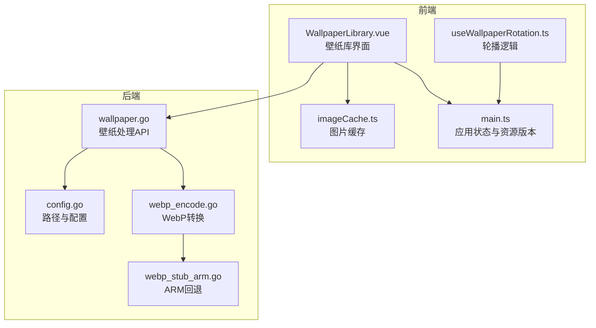
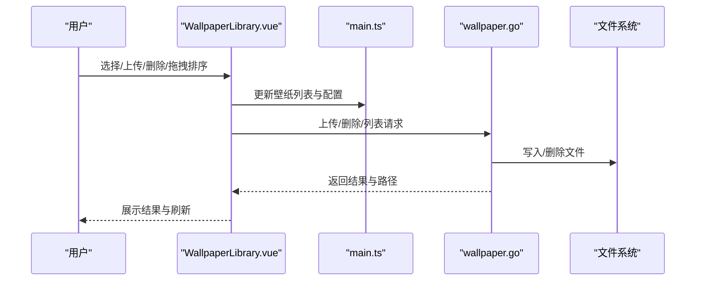
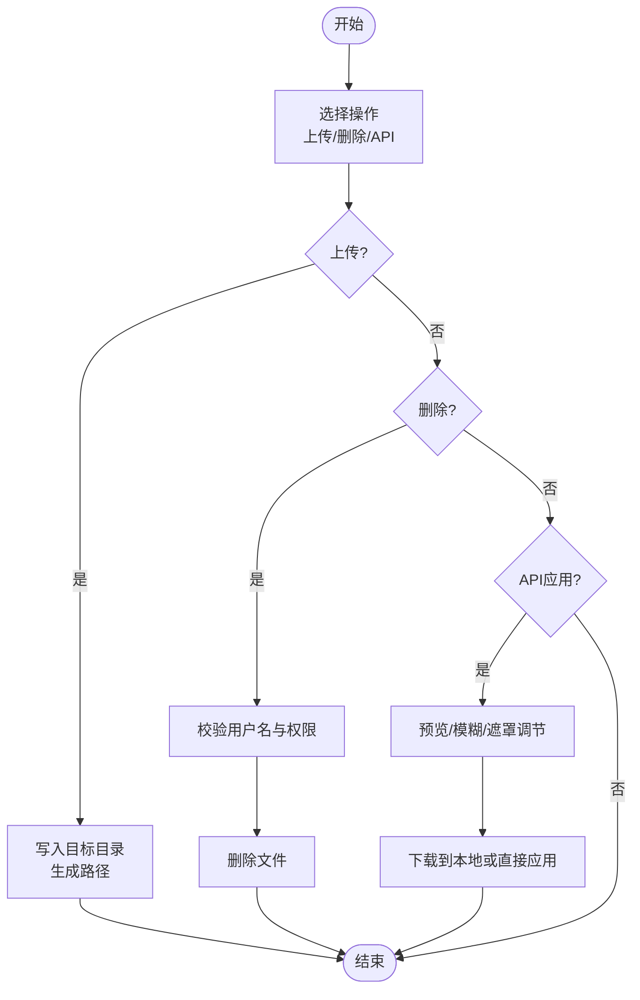
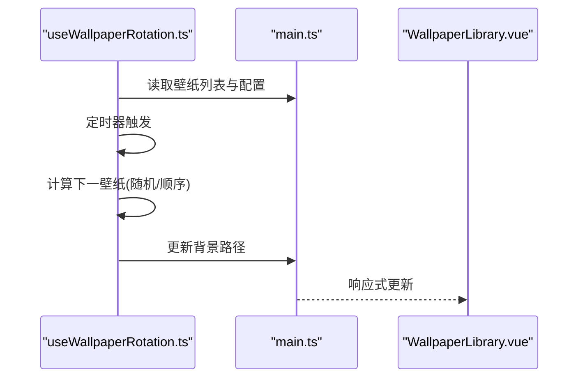
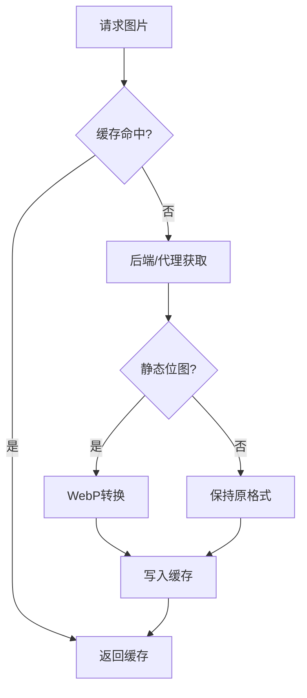
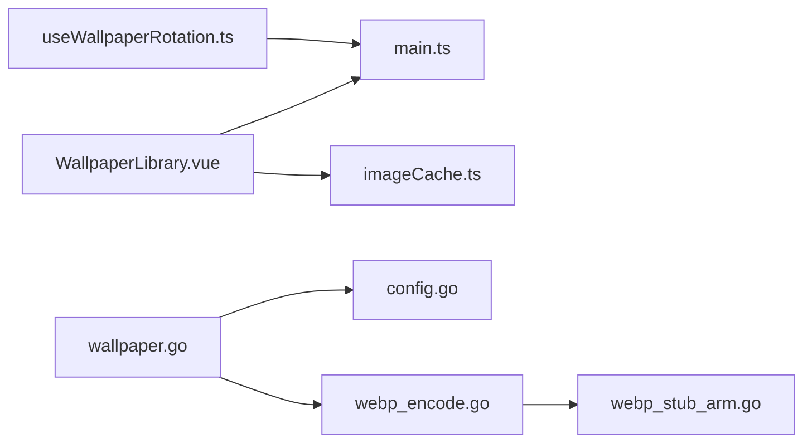

# 壁纸定制

<cite>
**本文档引用的文件**
- [backend/handlers/wallpaper.go](file://backend/handlers/wallpaper.go)
- [frontend/src/components/WallpaperLibrary.vue](file://frontend/src/components/WallpaperLibrary.vue)
- [frontend/src/composables/useWallpaperRotation.ts](file://frontend/src/composables/useWallpaperRotation.ts)
- [frontend/src/utils/imageCache.ts](file://frontend/src/utils/imageCache.ts)
- [backend/handlers/webp_encode.go](file://backend/handlers/webp_encode.go)
- [backend/handlers/webp_stub_arm.go](file://backend/handlers/webp_stub_arm.go)
- [backend/config/config.go](file://backend/config/config.go)
- [frontend/src/stores/main.ts](file://frontend/src/stores/main.ts)
- [frontend/src/types.ts](file://frontend/src/types.ts)
- [backend/config/default.json](file://backend/config/default.json)
</cite>

## 目录
1. [简介](#简介)
2. [项目结构](#项目结构)
3. [核心组件](#核心组件)
4. [架构总览](#架构总览)
5. [详细组件分析](#详细组件分析)
6. [依赖关系分析](#依赖关系分析)
7. [性能考虑](#性能考虑)
8. [故障排除指南](#故障排除指南)
9. [结论](#结论)

## 简介
本文件面向 OFlatNas 的壁纸定制功能，系统性阐述壁纸库管理、轮播配置、适配模式、质量优化与旋转逻辑，并提供性能与存储优化建议。内容基于仓库中的后端处理器、前端组件与工具模块进行深入分析。

## 项目结构
- 后端负责壁纸上传、列表查询、删除、远程解析与 WebP 质量转换。
- 前端提供壁纸库界面、拖拽排序、上传、删除、API 预览与应用、轮播控制与模糊/遮罩调节。
- 存储目录按设备区分：PC 壁纸与 APP（移动端）壁纸分别存放于独立目录。

**图表来源**
- [frontend/src/components/WallpaperLibrary.vue](file://frontend/src/components/WallpaperLibrary.vue)
- [frontend/src/composables/useWallpaperRotation.ts](file://frontend/src/composables/useWallpaperRotation.ts)
- [frontend/src/utils/imageCache.ts](file://frontend/src/utils/imageCache.ts)
- [backend/handlers/wallpaper.go](file://backend/handlers/wallpaper.go)
- [backend/config/config.go](file://backend/config/config.go)
- [backend/handlers/webp_encode.go](file://backend/handlers/webp_encode.go)
- [backend/handlers/webp_stub_arm.go](file://backend/handlers/webp_stub_arm.go)

**章节来源**
- [backend/handlers/wallpaper.go](file://backend/handlers/wallpaper.go)
- [frontend/src/components/WallpaperLibrary.vue](file://frontend/src/components/WallpaperLibrary.vue)
- [frontend/src/composables/useWallpaperRotation.ts](file://frontend/src/composables/useWallpaperRotation.ts)
- [frontend/src/utils/imageCache.ts](file://frontend/src/utils/imageCache.ts)
- [backend/config/config.go](file://backend/config/config.go)

## 核心组件
- 壁纸库界面：支持 PC/移动端壁纸库浏览、拖拽排序、上传、删除、API 预览与应用。
- 轮播控制：支持随机/顺序播放模式、轮播间隔、锁定当前壁纸。
- 图片缓存：IndexedDB 缓存与本地元数据，自动清理过期条目。
- WebP 转换：静态位图自动转 WebP，ARM 平台回退。
- 存储配置：PC 与 APP 壁纸目录分离，支持用户级命名规则与权限校验。

**章节来源**
- [frontend/src/components/WallpaperLibrary.vue](file://frontend/src/components/WallpaperLibrary.vue)
- [frontend/src/composables/useWallpaperRotation.ts](file://frontend/src/composables/useWallpaperRotation.ts)
- [frontend/src/utils/imageCache.ts](file://frontend/src/utils/imageCache.ts)
- [backend/handlers/wallpaper.go](file://backend/handlers/wallpaper.go)
- [backend/config/config.go](file://backend/config/config.go)

## 架构总览
壁纸定制由“前端界面 + 后端处理 + 存储目录”三层构成。前端通过 API 与后端交互，后端负责安全校验、文件写入与格式优化，前端负责展示与轮播调度。

**图表来源**
- [frontend/src/components/WallpaperLibrary.vue](file://frontend/src/components/WallpaperLibrary.vue)
- [frontend/src/stores/main.ts](file://frontend/src/stores/main.ts)
- [backend/handlers/wallpaper.go](file://backend/handlers/wallpaper.go)

## 详细组件分析

### 壁纸库管理
- 列表与排序
  - 前端维护壁纸列表与用户自定义顺序，支持 PC/移动端两套列表。
  - 默认项始终排在首位，便于识别当前壁纸。
- 上传与删除
  - 支持多文件上传，自动拼接目标目录与路径前缀。
  - 删除时进行用户名匹配校验，防止越权删除。
- API 管理
  - 支持第三方随机壁纸 API，自动解析 JSON 提取图片链接。
  - 提供 PC/移动端预览与模糊/遮罩实时调节。
  - 应用时可直接保存为壁纸或下载至本地库。

**图表来源**
- [frontend/src/components/WallpaperLibrary.vue](file://frontend/src/components/WallpaperLibrary.vue)
- [backend/handlers/wallpaper.go](file://backend/handlers/wallpaper.go)

**章节来源**
- [frontend/src/components/WallpaperLibrary.vue](file://frontend/src/components/WallpaperLibrary.vue)
- [backend/handlers/wallpaper.go](file://backend/handlers/wallpaper.go)

### 轮播功能
- 模式与间隔
  - 支持随机与顺序两种模式，轮播间隔以分钟为单位可配置。
  - 锁定当前壁纸后停止自动切换。
- 轮询逻辑
  - 基于定时器周期性切换，读取当前壁纸名称并计算下一壁纸。
  - 支持移动端与 PC 端独立配置。

**图表来源**
- [frontend/src/composables/useWallpaperRotation.ts](file://frontend/src/composables/useWallpaperRotation.ts)
- [frontend/src/stores/main.ts](file://frontend/src/stores/main.ts)
- [frontend/src/components/WallpaperLibrary.vue](file://frontend/src/components/WallpaperLibrary.vue)

**章节来源**
- [frontend/src/composables/useWallpaperRotation.ts](file://frontend/src/composables/useWallpaperRotation.ts)
- [frontend/src/components/WallpaperLibrary.vue](file://frontend/src/components/WallpaperLibrary.vue)
- [frontend/src/stores/main.ts](file://frontend/src/stores/main.ts)

### 适配模式与显示效果
- 适配模式
  - 前端通过 CSS 对象属性控制图片缩放与裁剪，适配不同设备与比例。
- 效果参数
  - 模糊半径与遮罩浓度分别针对 PC/移动端独立调节，提升视觉层次与可读性。

**章节来源**
- [frontend/src/components/WallpaperLibrary.vue](file://frontend/src/components/WallpaperLibrary.vue)

### 质量优化与缓存策略
- WebP 转换
  - 静态位图（PNG/JPG/JPEG）自动转换为 WebP，质量范围 1–100。
  - ARM 平台回退为原格式，避免不兼容。
- 图片缓存
  - IndexedDB 存储图片二进制与元数据，最多保留 40 条，最长 24 小时。
  - 过期与容量清理策略确保空间与性能平衡。

**图表来源**
- [frontend/src/utils/imageCache.ts](file://frontend/src/utils/imageCache.ts)
- [backend/handlers/webp_encode.go](file://backend/handlers/webp_encode.go)
- [backend/handlers/webp_stub_arm.go](file://backend/handlers/webp_stub_arm.go)

**章节来源**
- [frontend/src/utils/imageCache.ts](file://frontend/src/utils/imageCache.ts)
- [backend/handlers/webp_encode.go](file://backend/handlers/webp_encode.go)
- [backend/handlers/webp_stub_arm.go](file://backend/handlers/webp_stub_arm.go)

### 存储与权限
- 目录结构
  - PC 壁纸与 APP 壁纸分别位于独立目录，避免混淆。
- 权限与安全
  - 删除接口进行用户名匹配校验，非管理员需确保文件名包含其用户名。
  - 上传接口支持多文件批量写入，错误时返回具体原因。

**章节来源**
- [backend/config/config.go](file://backend/config/config.go)
- [backend/handlers/wallpaper.go](file://backend/handlers/wallpaper.go)

## 依赖关系分析
- 前端依赖
  - WallpaperLibrary.vue 依赖 main.ts 的应用状态与资源版本，依赖 imageCache.ts 进行缓存。
  - useWallpaperRotation.ts 依赖 main.ts 的壁纸列表与配置。
- 后端依赖
  - wallpaper.go 依赖 config.go 的目录配置，依赖 webp_encode.go 进行格式优化。
  - webp_encode.go 在非 ARM 平台启用 WebP 转换，ARM 平台回退。

**图表来源**
- [frontend/src/components/WallpaperLibrary.vue](file://frontend/src/components/WallpaperLibrary.vue)
- [frontend/src/composables/useWallpaperRotation.ts](file://frontend/src/composables/useWallpaperRotation.ts)
- [frontend/src/utils/imageCache.ts](file://frontend/src/utils/imageCache.ts)
- [frontend/src/stores/main.ts](file://frontend/src/stores/main.ts)
- [backend/handlers/wallpaper.go](file://backend/handlers/wallpaper.go)
- [backend/config/config.go](file://backend/config/config.go)
- [backend/handlers/webp_encode.go](file://backend/handlers/webp_encode.go)
- [backend/handlers/webp_stub_arm.go](file://backend/handlers/webp_stub_arm.go)

**章节来源**
- [frontend/src/components/WallpaperLibrary.vue](file://frontend/src/components/WallpaperLibrary.vue)
- [frontend/src/composables/useWallpaperRotation.ts](file://frontend/src/composables/useWallpaperRotation.ts)
- [frontend/src/utils/imageCache.ts](file://frontend/src/utils/imageCache.ts)
- [frontend/src/stores/main.ts](file://frontend/src/stores/main.ts)
- [backend/handlers/wallpaper.go](file://backend/handlers/wallpaper.go)
- [backend/config/config.go](file://backend/config/config.go)
- [backend/handlers/webp_encode.go](file://backend/handlers/webp_encode.go)
- [backend/handlers/webp_stub_arm.go](file://backend/handlers/webp_stub_arm.go)

## 性能考虑
- 图片缓存
  - 使用 IndexedDB 与本地元数据，避免重复请求；设置最大条数与过期时间，防止无限增长。
- 轮播调度
  - 使用定时器切换壁纸，间隔最小为 1 分钟；顺序模式需解析当前壁纸名称，注意 URL 编码差异。
- WebP 转换
  - 静态位图自动转换，质量区间 1–100；ARM 平台回退，避免运行时异常。
- 资源版本
  - 通过资源版本参数强制刷新，避免浏览器缓存导致的视觉不一致。

**章节来源**
- [frontend/src/utils/imageCache.ts](file://frontend/src/utils/imageCache.ts)
- [frontend/src/composables/useWallpaperRotation.ts](file://frontend/src/composables/useWallpaperRotation.ts)
- [backend/handlers/webp_encode.go](file://backend/handlers/webp_encode.go)
- [frontend/src/stores/main.ts](file://frontend/src/stores/main.ts)

## 故障排除指南
- 上传失败
  - 检查文件大小与后端写入权限；查看返回的错误信息定位问题。
- 删除失败
  - 确认当前壁纸是否被删除；若为默认壁纸则不可删除；检查用户名匹配。
- 轮播无效
  - 确认轮播开关与间隔设置；顺序模式需确保壁纸列表非空且名称匹配。
- API 预览失败
  - 检查 URL 是否可直连；尝试刷新预览（追加时间戳）；必要时使用代理解析。
- WebP 转换异常
  - 非静态位图不会转换；ARM 平台会回退为原格式；检查图片类型与质量参数。

**章节来源**
- [frontend/src/components/WallpaperLibrary.vue](file://frontend/src/components/WallpaperLibrary.vue)
- [backend/handlers/wallpaper.go](file://backend/handlers/wallpaper.go)
- [backend/handlers/webp_encode.go](file://backend/handlers/webp_encode.go)
- [backend/handlers/webp_stub_arm.go](file://backend/handlers/webp_stub_arm.go)

## 结论
OFaltNas 的壁纸定制功能通过前后端协作实现了完整的壁纸库管理、灵活的轮播控制、高质量的图片优化与良好的性能表现。建议在实际部署中结合设备分辨率与网络状况调整轮播间隔与模糊/遮罩参数，并定期清理缓存与过期壁纸，以获得最佳体验。