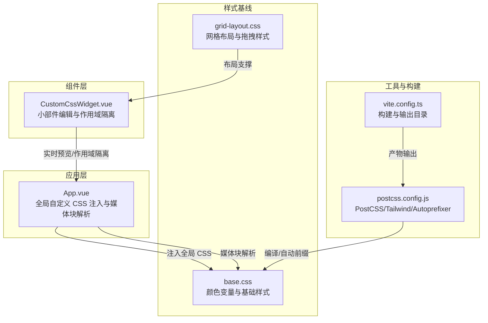
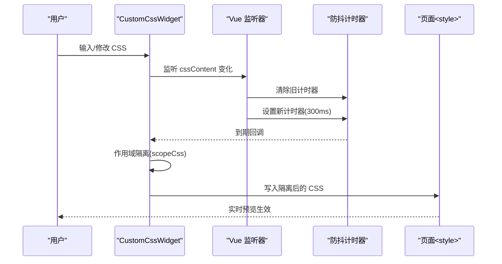
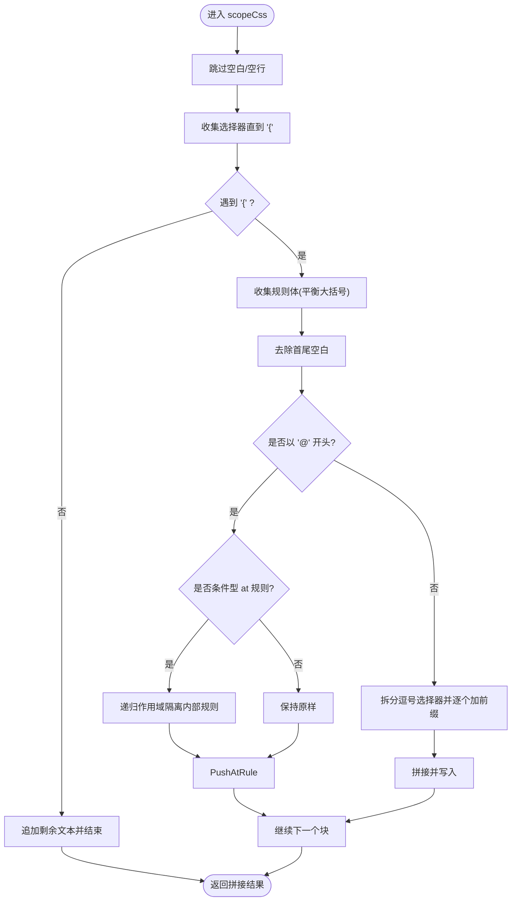
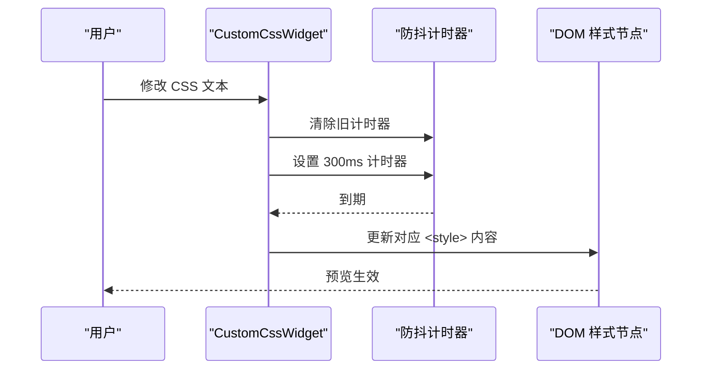
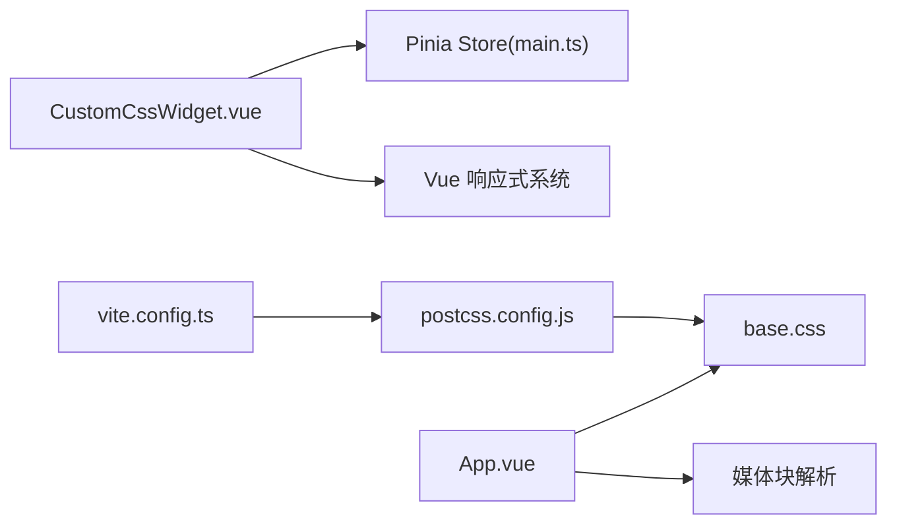

# 自定义 CSS 样式

<cite>
**本文引用的文件**
- [CustomCssWidget.vue](file://frontend/src/components/CustomCssWidget.vue)
- [App.vue](file://frontend/src/App.vue)
- [main.ts](file://frontend/src/stores/main.ts)
- [grid-layout.css](file://frontend/src/assets/grid-layout.css)
- [base.css](file://frontend/src/assets/base.css)
- [postcss.config.js](file://frontend/postcss.config.js)
- [vite.config.ts](file://frontend/vite.config.ts)
- [types.ts](file://frontend/src/types.ts)
- [ClockWeatherWidget.vue](file://frontend/src/components/ClockWeatherWidget.vue)
</cite>

## 目录
1. [简介](#简介)
2. [项目结构](#项目结构)
3. [核心组件](#核心组件)
4. [架构总览](#架构总览)
5. [详细组件分析](#详细组件分析)
6. [依赖关系分析](#依赖关系分析)
7. [性能考量](#性能考量)
8. [故障排查指南](#故障排查指南)
9. [结论](#结论)
10. [附录](#附录)

## 简介
本文件系统性阐述 OFlatNas 的“自定义 CSS 样式”能力，重点覆盖以下方面：
- CSS 作用域隔离机制：自动前缀添加、选择器解析与嵌套规则处理
- CSS 预览功能：防抖机制与实时更新策略
- 高级 CSS 规则支持：@media、@keyframes、@supports 等
- 实战示例与最佳实践：响应式设计、动画效果、现代布局
- 常见问题与性能优化建议

## 项目结构
与自定义 CSS 样式直接相关的前端模块主要集中在以下位置：
- 组件层：自定义 CSS 小部件负责编辑、作用域隔离与预览
- 应用层：全局自定义 CSS 注入与媒体查询扩展
- 工具与构建：PostCSS、Tailwind、Autoprefixer 与 Vite 配置
- 样式基线：基础变量与网格布局样式

图表来源
- [CustomCssWidget.vue:1-444](file://frontend/src/components/CustomCssWidget.vue#L1-L444)
- [App.vue:63-105](file://frontend/src/App.vue#L63-L105)
- [postcss.config.js:1-6](file://frontend/postcss.config.js#L1-L6)
- [vite.config.ts:1-57](file://frontend/vite.config.ts#L1-L57)
- [base.css:1-116](file://frontend/src/assets/base.css#L1-L116)
- [grid-layout.css:1-109](file://frontend/src/assets/grid-layout.css#L1-L109)

章节来源
- [CustomCssWidget.vue:1-444](file://frontend/src/components/CustomCssWidget.vue#L1-L444)
- [App.vue:63-105](file://frontend/src/App.vue#L63-L105)
- [postcss.config.js:1-6](file://frontend/postcss.config.js#L1-L6)
- [vite.config.ts:1-57](file://frontend/vite.config.ts#L1-L57)
- [base.css:1-116](file://frontend/src/assets/base.css#L1-L116)
- [grid-layout.css:1-109](file://frontend/src/assets/grid-layout.css#L1-L109)

## 核心组件
- 自定义 CSS 小部件（CustomCssWidget）
  - 负责编辑 HTML/CSS/JS，实时预览 CSS 变更，按小部件 ID 进行 CSS 作用域隔离，并在保存后应用
  - 支持导入/导出 JSON，内置 AI 助手提示词
- 全局自定义 CSS（App.vue）
  - 解析带标记的媒体块（mobile/desktop/dark/light），并注入到页面头部
  - 提供全局 CSS 的即时生效能力

章节来源
- [CustomCssWidget.vue:1-444](file://frontend/src/components/CustomCssWidget.vue#L1-L444)
- [App.vue:63-105](file://frontend/src/App.vue#L63-L105)

## 架构总览
自定义 CSS 的工作流分为两条主线：
- 小部件级：用户在编辑器中输入 CSS，通过作用域隔离函数生成带前缀的选择器，300ms 防抖后写入独立的 <style> 标签
- 应用级：用户在全局设置中输入自定义 CSS，解析媒体块标记后注入到页面头部

图表来源
- [CustomCssWidget.vue:99-105](file://frontend/src/components/CustomCssWidget.vue#L99-L105)
- [CustomCssWidget.vue:89-97](file://frontend/src/components/CustomCssWidget.vue#L89-L97)

## 详细组件分析

### CSS 作用域隔离机制
- 自动前缀添加
  - 小部件容器以唯一 ID 作为作用域前缀，所有选择器自动加上该前缀，避免样式泄漏
- 选择器解析
  - 使用“块级解析器”逐段提取选择器与大括号内的规则体，支持多选择器逗号分隔
- 嵌套规则处理
  - 对 @media/@supports/@layer/@container 等条件型 at 规则进行递归处理，确保内部规则同样被作用域隔离
  - 对 @keyframes/@font-face/@charset/@import 等保持原样，不做前缀处理
- :root 映射
  - 将 :root 映射为当前小部件容器，便于在组件内使用根级上下文

图表来源
- [CustomCssWidget.vue:30-84](file://frontend/src/components/CustomCssWidget.vue#L30-L84)

章节来源
- [CustomCssWidget.vue:24-84](file://frontend/src/components/CustomCssWidget.vue#L24-L84)

### CSS 预览与实时更新策略
- 防抖机制
  - 在编辑状态监听 CSS 文本变化，每次变更先清除旧计时器，再设置 300ms 新计时器，避免频繁重排与闪烁
- 应用时机
  - 预览仅在编辑态启用；保存后立即应用到最终 DOM
- 样式注入
  - 每个小部件维护独立的 <style> 标签，ID 与小部件 ID 关联，便于更新与移除

图表来源
- [CustomCssWidget.vue:99-105](file://frontend/src/components/CustomCssWidget.vue#L99-L105)
- [CustomCssWidget.vue:89-97](file://frontend/src/components/CustomCssWidget.vue#L89-L97)

章节来源
- [CustomCssWidget.vue:99-105](file://frontend/src/components/CustomCssWidget.vue#L99-L105)
- [CustomCssWidget.vue:89-97](file://frontend/src/components/CustomCssWidget.vue#L89-L97)

### 高级 CSS 规则支持
- @media
  - 条件型 @media 规则在作用域隔离时会被递归处理，确保内部选择器同样被加上前缀
  - 全局自定义 CSS 支持通过特殊注释标记将内容包裹为 @media 块，实现移动端/桌面端/深色/浅色等场景
- @keyframes
  - 保持原样，不参与作用域前缀，确保动画名称可用
- @supports/@layer/@container
  - 条件型 at 规则同样递归处理，内部规则按作用域隔离

章节来源
- [CustomCssWidget.vue:28-84](file://frontend/src/components/CustomCssWidget.vue#L28-L84)
- [App.vue:67-93](file://frontend/src/App.vue#L67-L93)

### 全局自定义 CSS 注入
- 媒体块解析
  - 识别形如 /* @mobile */ ... /* @end */ 的注释块，将其转换为 @media 块
  - 支持 mobile/desktop/dark/light 四类标记
- 注入策略
  - 首次加载与后续变更均通过单个 <style id="custom-css"> 注入，避免重复创建节点

章节来源
- [App.vue:63-105](file://frontend/src/App.vue#L63-L105)

### 小部件级 JS 上下文（与 CSS 协作）
- 小部件 JS 在保存后执行，提供 ctx.query/ctx.el 等接口，便于在组件内读取/修改 DOM
- 与 CSS 协作时，可通过 ctx.query 选取组件内的元素并配合作用域隔离的前缀进行样式控制

章节来源
- [CustomCssWidget.vue:107-176](file://frontend/src/components/CustomCssWidget.vue#L107-L176)

## 依赖关系分析
- 组件耦合
  - CustomCssWidget 依赖 Pinia store 以判断登录态与持久化数据
  - 与 Vue 响应式系统深度集成，通过 watch 实现防抖更新
- 外部依赖
  - PostCSS + Tailwind + Autoprefixer：统一处理现代 CSS 语法与浏览器兼容
  - Vite：开发与生产构建，输出至 server/public 或 dist

图表来源
- [CustomCssWidget.vue:10-12](file://frontend/src/components/CustomCssWidget.vue#L10-L12)
- [main.ts:1-800](file://frontend/src/stores/main.ts#L1-L800)
- [App.vue:63-105](file://frontend/src/App.vue#L63-L105)
- [postcss.config.js:1-6](file://frontend/postcss.config.js#L1-L6)
- [vite.config.ts:1-57](file://frontend/vite.config.ts#L1-L57)

章节来源
- [CustomCssWidget.vue:10-12](file://frontend/src/components/CustomCssWidget.vue#L10-L12)
- [main.ts:1-800](file://frontend/src/stores/main.ts#L1-L800)
- [App.vue:63-105](file://frontend/src/App.vue#L63-L105)
- [postcss.config.js:1-6](file://frontend/postcss.config.js#L1-L6)
- [vite.config.ts:1-57](file://frontend/vite.config.ts#L1-L57)

## 性能考量
- 防抖更新
  - 300ms 防抖有效降低频繁重排与重绘，提升交互流畅度
- 作用域隔离复杂度
  - 块级解析器线性扫描，对一般规模 CSS 表现良好；建议避免极端冗长的单文件
- 样式注入策略
  - 每个小部件独立 <style>，便于增量更新；注意不要创建过多小部件以避免 head 中节点过多
- 全局 CSS 注入
  - 仅在变更时更新，避免不必要的重排

[本节为通用指导，无需特定文件引用]

## 故障排查指南
- 预览无变化
  - 确认处于编辑态；检查是否超过 300ms 防抖间隔
  - 查看控制台是否有错误（如作用域隔离解析异常）
- 样式未生效
  - 检查选择器是否被正确加前缀；确认 :root 是否映射到当前容器
  - 确认 @keyframes/@font-face 等是否被保持原样
- 媒体查询无效
  - 全局 CSS 中使用媒体块注释标记时，确认注释格式正确且未被其他规则覆盖
- 动画不生效
  - 确认 @keyframes 名称未被作用域前缀影响；必要时在组件外层定义关键帧

章节来源
- [CustomCssWidget.vue:99-105](file://frontend/src/components/CustomCssWidget.vue#L99-L105)
- [CustomCssWidget.vue:28-84](file://frontend/src/components/CustomCssWidget.vue#L28-L84)
- [App.vue:67-93](file://frontend/src/App.vue#L67-L93)

## 结论
OFaltNas 的自定义 CSS 能力通过“小部件级作用域隔离 + 全局媒体块解析”的双轨设计，既保证了组件间样式互不干扰，又提供了灵活的响应式与主题适配能力。结合防抖预览与模块化 JS 上下文，开发者可以高效地构建高质量、可维护的自定义组件。

[本节为总结，无需特定文件引用]

## 附录

### 常用示例与最佳实践
- 响应式设计
  - 使用全局媒体块注释标记实现移动端/桌面端差异化样式
  - 在小部件内使用 @media 包裹条件规则，确保内部选择器被作用域隔离
- 动画效果
  - 在组件内定义 @keyframes 并配合动画类；注意动画名称不要被前缀影响
  - 参考现有组件中的动画定义思路
- 现代布局
  - 结合 CSS Grid/Flexbox 与组件容器前缀，实现复杂布局
  - 使用 CSS 变量与基础样式库，保持风格一致

章节来源
- [App.vue:79-93](file://frontend/src/App.vue#L79-L93)
- [ClockWeatherWidget.vue:685-776](file://frontend/src/components/ClockWeatherWidget.vue#L685-L776)
- [base.css:24-51](file://frontend/src/assets/base.css#L24-L51)

### 技术细节速查
- 作用域前缀来源
  - 小部件容器 ID：#widget-{id}
- 媒体块标记
  - mobile/desktop/dark/light
- 选择器映射
  - :root → 当前小部件容器
  - 其他选择器 → 自动加前缀

章节来源
- [CustomCssWidget.vue:86-87](file://frontend/src/components/CustomCssWidget.vue#L86-L87)
- [App.vue:79-93](file://frontend/src/App.vue#L79-L93)
- [CustomCssWidget.vue:74-76](file://frontend/src/components/CustomCssWidget.vue#L74-L76)