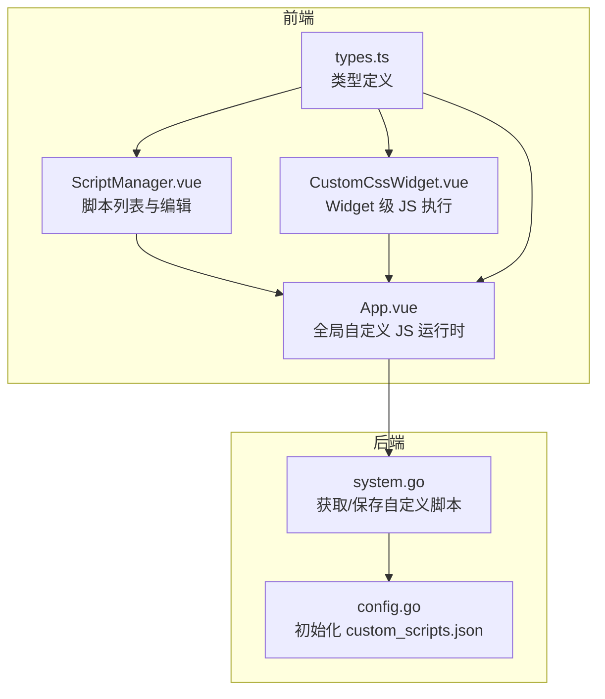
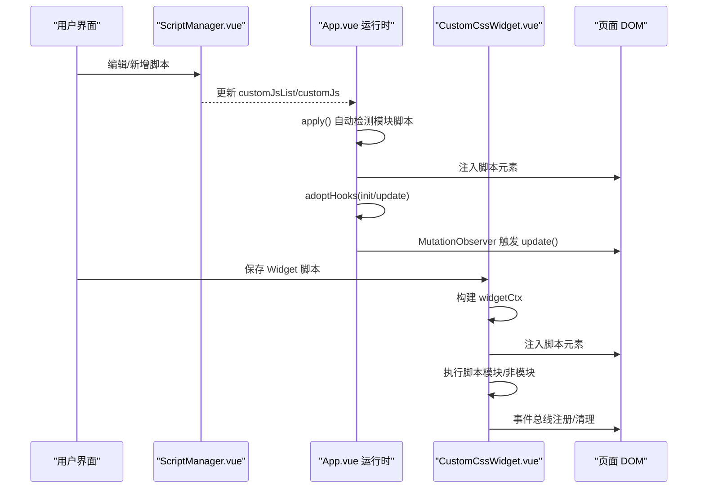
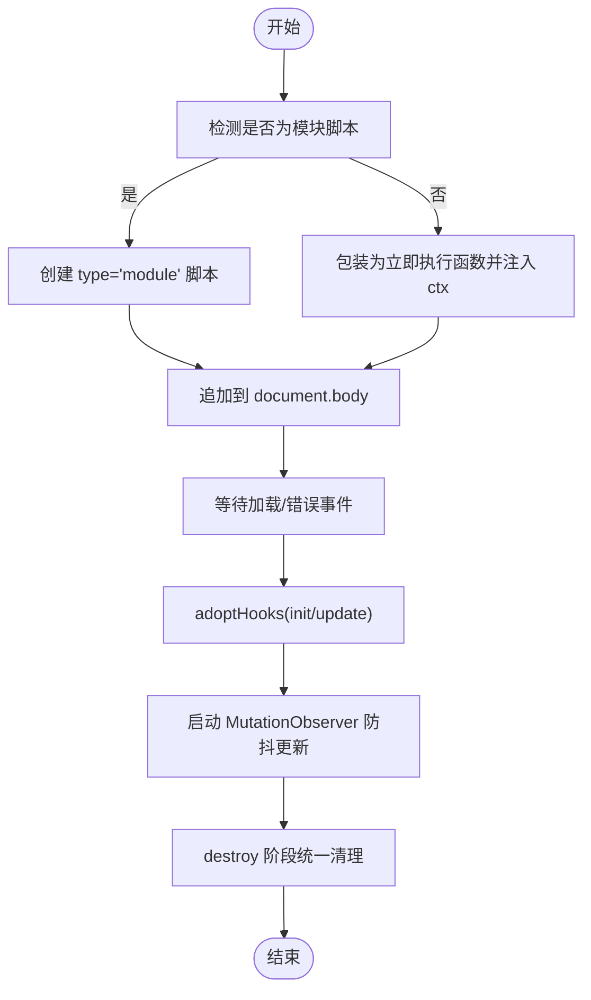
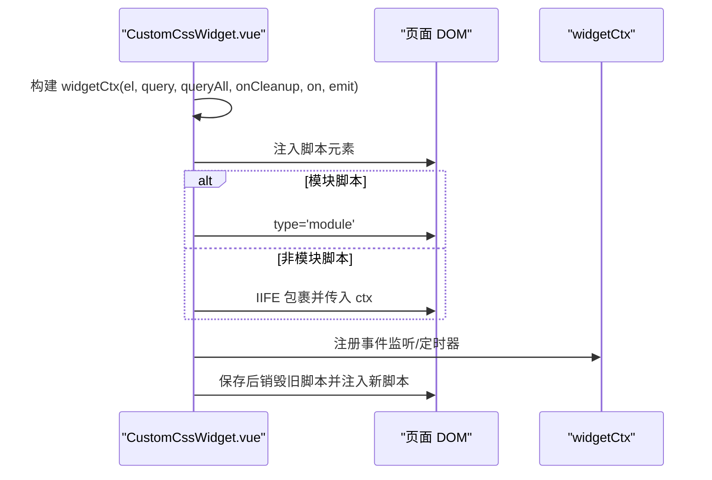
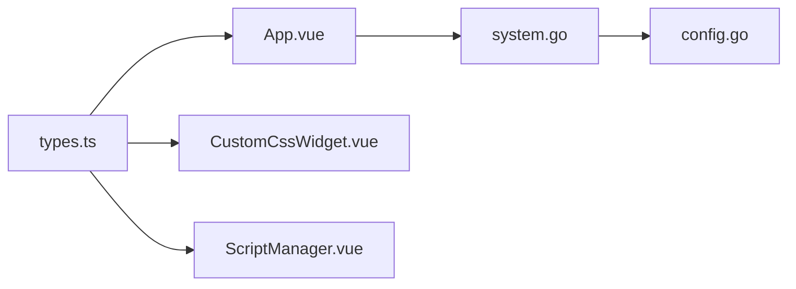

# 自定义 JavaScript 脚本

<cite>
**本文引用的文件列表**
- [App.vue](file://frontend/src/App.vue)
- [CustomCssWidget.vue](file://frontend/src/components/CustomCssWidget.vue)
- [ScriptManager.vue](file://frontend/src/components/ScriptManager.vue)
- [types.ts](file://frontend/src/types.ts)
- [system.go](file://backend/handlers/system.go)
- [config.go](file://backend/config/config.go)
- [CustomCssWidget-D-ix6zof.js](file://server/public/assets/CustomCssWidget-D-ix6zof.js)
</cite>

## 目录
1. [简介](#简介)
2. [项目结构](#项目结构)
3. [核心组件](#核心组件)
4. [架构总览](#架构总览)
5. [详细组件分析](#详细组件分析)
6. [依赖关系分析](#依赖关系分析)
7. [性能考量](#性能考量)
8. [故障排查指南](#故障排查指南)
9. [结论](#结论)
10. [附录](#附录)

## 简介
本文件系统性阐述 OFlatNas 中“自定义 JavaScript 脚本”能力的设计与实现，重点覆盖：
- Widget 上下文环境的构建与使用（ctx.el、ctx.query、ctx.queryAll 等）
- 事件总线机制（ctx.on 与 ctx.emit 的使用）
- 模块化脚本与非模块脚本的差异及自动检测机制
- 脚本生命周期管理与内存泄漏防护
- 错误处理、调试技巧与性能优化建议
- 实战示例与最佳实践指引

## 项目结构
自定义脚本功能由前端运行时与后端数据持久化共同组成：
- 前端运行时负责脚本注入、上下文构建、事件总线、生命周期钩子与 DOM 观察
- 组件层提供 Widget 级别的脚本执行环境
- 后端提供脚本数据的存储与获取接口

图表来源
- [App.vue:138-367](file://frontend/src/App.vue#L138-L367)
- [CustomCssWidget.vue:130-176](file://frontend/src/components/CustomCssWidget.vue#L130-L176)
- [ScriptManager.vue:1-322](file://frontend/src/components/ScriptManager.vue#L1-322)
- [types.ts:64-70](file://frontend/src/types.ts#L64-L70)
- [system.go:205-272](file://backend/handlers/system.go#L205-L272)
- [config.go:241-247](file://backend/config/config.go#L241-L247)

章节来源
- [App.vue:138-367](file://frontend/src/App.vue#L138-L367)
- [CustomCssWidget.vue:130-176](file://frontend/src/components/CustomCssWidget.vue#L130-L176)
- [ScriptManager.vue:1-322](file://frontend/src/components/ScriptManager.vue#L1-322)
- [types.ts:64-70](file://frontend/src/types.ts#L64-L70)
- [system.go:205-272](file://backend/handlers/system.go#L205-L272)
- [config.go:241-247](file://backend/config/config.go#L241-L247)

## 核心组件
- 全局自定义 JS 运行时（App.vue）
  - 构建只读上下文 ctx，暴露 store、DOM 查询、跨域代理 fetch、事件总线与清理钩子
  - 通过 MutationObserver 触发 update 钩子，实现响应式更新
  - 支持模块化与非模块化脚本的自动识别与加载
- Widget 级 JS 执行（CustomCssWidget.vue）
  - 为单个 Widget 构建独立上下文（ctx.el、ctx.query、ctx.queryAll、事件总线、清理钩子）
  - 保存后按需注入并执行脚本，支持 @module 标记的模块脚本
- 脚本管理界面（ScriptManager.vue）
  - 提供脚本列表、拖拽排序、启用/禁用、代理开关、文件拖入导入等功能
- 类型定义（types.ts）
  - CustomScript 接口描述脚本字段；AppConfig 中包含 customJsList/customJs 字段

章节来源
- [App.vue:107-133](file://frontend/src/App.vue#L107-L133)
- [App.vue:176-203](file://frontend/src/App.vue#L176-L203)
- [CustomCssWidget.vue:110-176](file://frontend/src/components/CustomCssWidget.vue#L110-L176)
- [ScriptManager.vue:1-118](file://frontend/src/components/ScriptManager.vue#L1-L118)
- [types.ts:64-70](file://frontend/src/types.ts#L64-L70)

## 架构总览
自定义脚本的执行流程分为“全局脚本”和“Widget 脚本”两条路径，二者共享事件总线与清理机制。

图表来源
- [App.vue:270-367](file://frontend/src/App.vue#L270-L367)
- [CustomCssWidget.vue:130-176](file://frontend/src/components/CustomCssWidget.vue#L130-L176)
- [ScriptManager.vue:36-77](file://frontend/src/components/ScriptManager.vue#L36-L77)

## 详细组件分析

### 全局自定义 JS 运行时（App.vue）
- 上下文 ctx 关键能力
  - store：只读数据视图，避免脚本直接修改应用状态
  - root/query/queryAll：基于根节点的查询
  - widgetEl：按 id 获取 Widget 容器
  - fetch：跨域自动走代理（/proxy?url=），减少 CORS 限制
  - onCleanup：注册清理回调，统一在销毁阶段执行
  - on/emit：基于 window.CustomEvent 的事件总线，命名空间为 flatnas:*，便于解耦
- 生命周期钩子
  - init：脚本首次加载后触发
  - update：DOM 变更后触发（带防抖）
  - destroy：脚本卸载前触发，用于清理定时器、监听器等
- 自动检测与加载
  - 通过注释标记、import/export 关键字判断是否为模块脚本
  - 模块脚本通过 type="module" 加载，并在 load/error 事件后尝试 adoptHooks
  - 非模块脚本包裹为立即执行函数，注入 ctx 参数
- 清理与防抖
  - 使用 cleanupFns 数组统一收集清理逻辑
  - MutationObserver + 防抖（UPDATE_DEBOUNCE_MS）降低 update 频率

图表来源
- [App.vue:270-367](file://frontend/src/App.vue#L270-L367)
- [App.vue:176-203](file://frontend/src/App.vue#L176-L203)

章节来源
- [App.vue:107-133](file://frontend/src/App.vue#L107-L133)
- [App.vue:176-203](file://frontend/src/App.vue#L176-L203)
- [App.vue:270-367](file://frontend/src/App.vue#L270-L367)

### Widget 级 JS 执行（CustomCssWidget.vue）
- 上下文 ctx（widgetCtx）
  - el：Widget 容器 DOM
  - query/queryAll：仅在该容器内查询
  - onCleanup：注册清理回调
  - on/emit：事件总线（命名空间 flatnas:*）
- 自动检测与注入
  - 通过注释标记、import/export 关键字判断模块脚本
  - 模块脚本直接注入；非模块脚本通过 IIFE 注入 ctx
- 生命周期
  - mounted：应用样式与脚本
  - unmounted：清理脚本与样式
  - 保存：先销毁旧脚本，再注入新脚本

图表来源
- [CustomCssWidget.vue:130-176](file://frontend/src/components/CustomCssWidget.vue#L130-L176)

章节来源
- [CustomCssWidget.vue:110-176](file://frontend/src/components/CustomCssWidget.vue#L110-L176)
- [CustomCssWidget.vue:262-271](file://frontend/src/components/CustomCssWidget.vue#L262-L271)

### 脚本管理界面（ScriptManager.vue）
- 功能要点
  - 列表展示、拖拽排序、启用/禁用、代理开关
  - 文件拖入导入，批量新增
  - 删除确认（三秒倒计时）
- 与运行时交互
  - 通过 update:modelValue 与 change 事件通知父级更新
  - 与 App.vue 的 customJsList 对接，实现脚本持久化与应用

章节来源
- [ScriptManager.vue:1-118](file://frontend/src/components/ScriptManager.vue#L1-L118)

### 类型定义（types.ts）
- CustomScript
  - id、name、content、enable、useProxy
- AppConfig
  - customJsList/customJs/customJsDisclaimerAgreed 等字段
- MarketplaceItem
  - 支持从外部安装包含 JS 的组件

章节来源
- [types.ts:64-70](file://frontend/src/types.ts#L64-L70)
- [types.ts:86-189](file://frontend/src/types.ts#L86-L189)
- [types.ts:191-200](file://frontend/src/types.ts#L191-L200)

## 依赖关系分析
- 前端依赖
  - App.vue 依赖 types.ts 中的 CustomScript/AppConfig 类型
  - CustomCssWidget.vue 依赖 App.vue 的全局上下文与运行时
  - ScriptManager.vue 依赖 App.vue 的脚本列表与更新机制
- 后端依赖
  - system.go 提供获取/保存自定义脚本的接口
  - config.go 初始化 custom_scripts.json 文件

图表来源
- [types.ts:64-70](file://frontend/src/types.ts#L64-L70)
- [App.vue:138-367](file://frontend/src/App.vue#L138-L367)
- [CustomCssWidget.vue:130-176](file://frontend/src/components/CustomCssWidget.vue#L130-L176)
- [ScriptManager.vue:1-322](file://frontend/src/components/ScriptManager.vue#L1-322)
- [system.go:205-272](file://backend/handlers/system.go#L205-L272)
- [config.go:241-247](file://backend/config/config.go#L241-L247)

章节来源
- [system.go:205-272](file://backend/handlers/system.go#L205-L272)
- [config.go:241-247](file://backend/config/config.go#L241-L247)

## 性能考量
- 防抖更新
  - MutationObserver 触发 update 钩子前进行防抖，降低频繁重绘与计算开销
- 清理策略
  - onCleanup 注册的清理函数在 destroy 阶段统一执行，避免内存泄漏
- 跨域代理
  - fetch 自动代理跨域请求，减少 CORS 失败导致的额外重试
- 模块脚本加载时机
  - 模块脚本通过 load/error 事件统计加载完成，确保 adoptHooks 的时机准确

章节来源
- [App.vue:136](file://frontend/src/App.vue#L136)
- [App.vue:189-203](file://frontend/src/App.vue#L189-L203)
- [App.vue:162-174](file://frontend/src/App.vue#L162-L174)
- [App.vue:292-308](file://frontend/src/App.vue#L292-L308)

## 故障排查指南
- 脚本未执行
  - 检查是否被禁用（enable=false）
  - 模块脚本需满足自动检测条件（注释标记/导入/导出）
  - 非模块脚本需在脚本内部使用 ctx 参数
- 事件总线无效
  - 确认事件名使用 flatnas:* 命名空间
  - 确认 on/emit 的注册与注销时机（onCleanup 会自动移除监听）
- 跨域请求失败
  - 若启用 useProxy，检查代理接口可用性
  - 否则确保目标域名允许跨域或使用代理
- 内存泄漏
  - 使用 onCleanup 注册清理逻辑（定时器、监听器、订阅）
  - 避免闭包持有全局对象引用
- 调试技巧
  - 查看控制台错误日志（全局脚本与 Widget 脚本均有错误捕获）
  - 使用浏览器开发者工具断点定位问题
  - 逐步注释脚本片段定位异常代码

章节来源
- [App.vue:348](file://frontend/src/App.vue#L348)
- [CustomCssWidget.vue:174](file://frontend/src/components/CustomCssWidget.vue#L174)
- [App.vue:192-202](file://frontend/src/App.vue#L192-L202)

## 结论
OFlatNas 的自定义脚本系统通过“全局运行时 + Widget 级上下文”的双层设计，在保证安全性的同时提供了强大的扩展能力。其事件总线、生命周期钩子与清理机制有效降低了内存泄漏风险；自动检测与跨域代理提升了开发体验与兼容性。建议在实际使用中遵循“最小权限原则”，充分利用 onCleanup 与命名空间事件，确保脚本稳定与可维护。

## 附录

### API 一览（全局上下文 ctx）
- store：只读应用数据视图
- root：根容器元素
- query(selector)：根容器内查询单元素
- queryAll(selector)：根容器内查询多元素
- widgetEl(id)：按 id 获取 Widget 容器
- fetch(input, init)：跨域自动代理
- onCleanup(fn)：注册清理回调
- on(type, handler)：注册事件监听，返回取消函数
- emit(type, detail)：触发事件

章节来源
- [App.vue:113-133](file://frontend/src/App.vue#L113-L133)
- [App.vue:176-203](file://frontend/src/App.vue#L176-L203)

### API 一览（Widget 上下文 ctx）
- el：Widget 容器 DOM
- query(selector)：容器内查询单元素
- queryAll(selector)：容器内查询多元素
- onCleanup(fn)：注册清理回调
- on(type, handler)：注册事件监听
- emit(type, detail)：触发事件

章节来源
- [CustomCssWidget.vue:110-114](file://frontend/src/components/CustomCssWidget.vue#L110-L114)
- [CustomCssWidget.vue:139-153](file://frontend/src/components/CustomCssWidget.vue#L139-L153)

### 模块化脚本与非模块脚本
- 自动检测规则
  - 注释标记：以特定注释开头
  - 导入/导出：存在 import 或 export 关键字
- 执行差异
  - 模块脚本：type="module"，通过 FlatNasCustomRegister 自注册
  - 非模块脚本：IIFE 包裹并注入 ctx 参数

章节来源
- [App.vue:312-315](file://frontend/src/App.vue#L312-L315)
- [App.vue:323-351](file://frontend/src/App.vue#L323-L351)
- [CustomCssWidget.vue:157-160](file://frontend/src/components/CustomCssWidget.vue#L157-L160)
- [CustomCssWidget.vue:165-172](file://frontend/src/components/CustomCssWidget.vue#L165-L172)

### 示例与最佳实践
- DOM 操作
  - 使用 ctx.query/ctx.queryAll 或 widgetCtx.query/queryAll 进行受限查询
- 事件监听
  - 使用 ctx.on/emit 或 widgetCtx.on/emit 发布订阅
  - 记得在 onCleanup 中注销监听
- 定时器管理
  - 使用 onCleanup 注册清理逻辑，避免重复定时器累积
- 跨域请求
  - 优先启用 useProxy，或在脚本内使用 ctx.fetch
- 调试与错误处理
  - 全局与 Widget 脚本均包含错误捕获与日志输出
  - 保存后生效的 Widget 脚本需在保存后再观察效果

章节来源
- [App.vue:348](file://frontend/src/App.vue#L348)
- [CustomCssWidget.vue:174](file://frontend/src/components/CustomCssWidget.vue#L174)
- [CustomCssWidget.vue:406-420](file://frontend/src/components/CustomCssWidget.vue#L406-L420)

### 数据持久化与接口
- 获取自定义脚本
  - GET /api/custom-scripts
- 保存自定义脚本
  - POST /api/custom-scripts
- 初始化文件
  - 启动时确保 custom_scripts.json 存在

章节来源
- [system.go:205-272](file://backend/handlers/system.go#L205-L272)
- [config.go:241-247](file://backend/config/config.go#L241-L247)

### 产物示例参考
- 前端打包产物中包含示例脚本注释与提示词，可作为编写脚本的参考

章节来源
- [CustomCssWidget-D-ix6zof.js:21-30](file://server/public/assets/CustomCssWidget-D-ix6zof.js#L21-L30)