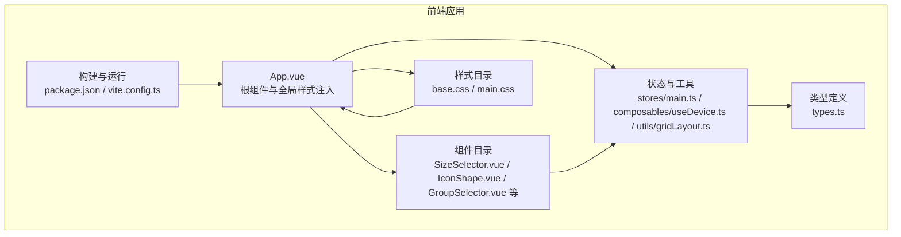
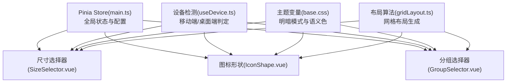
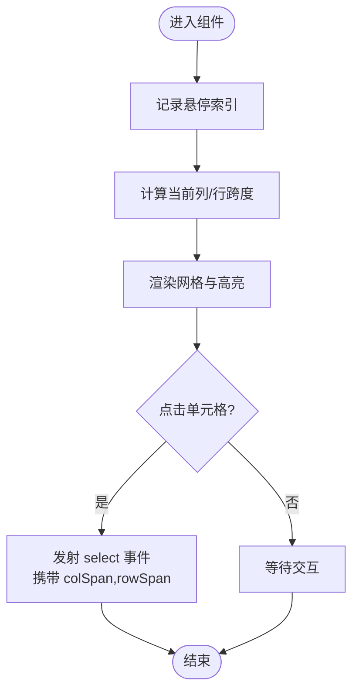
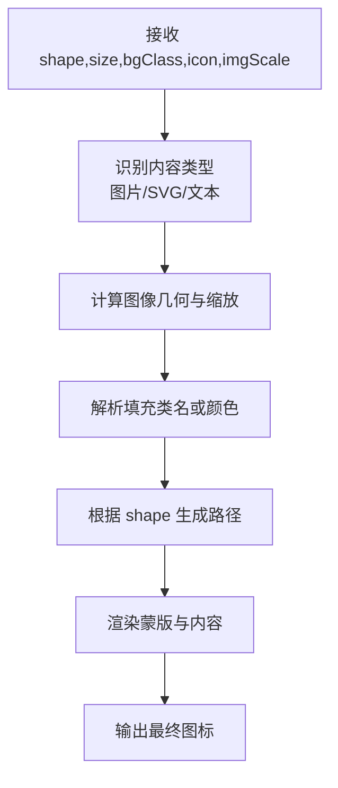
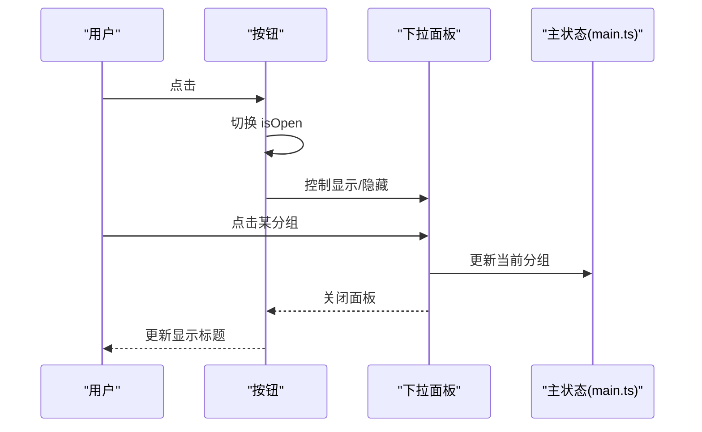
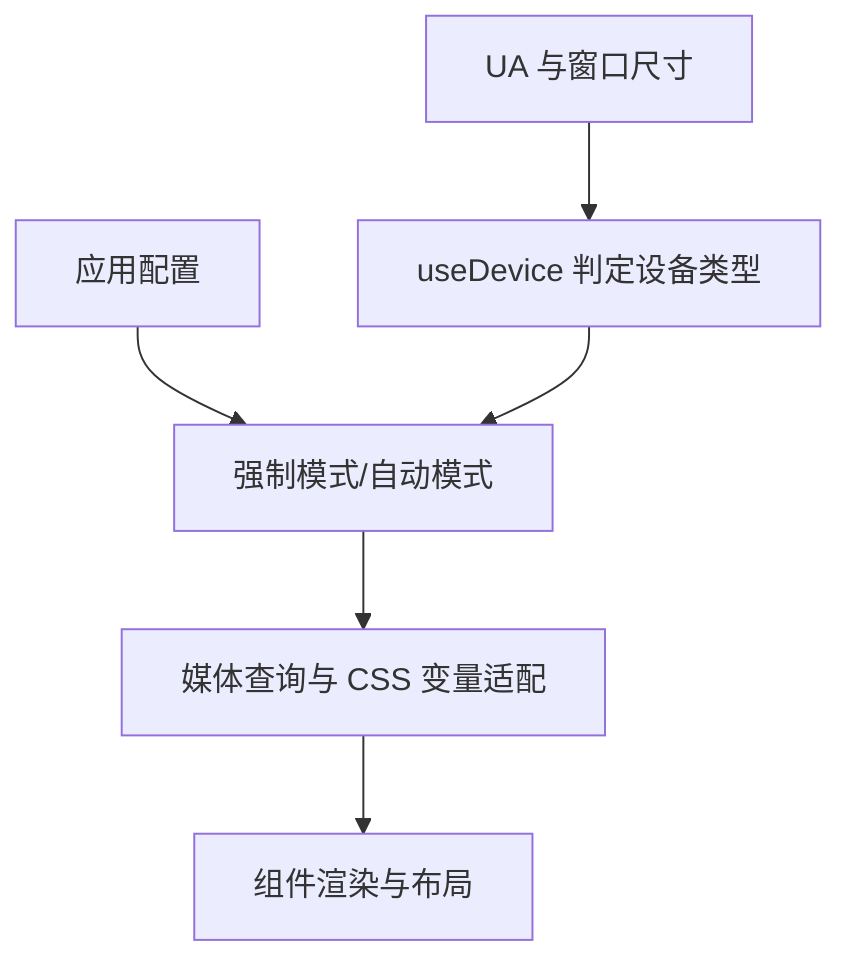
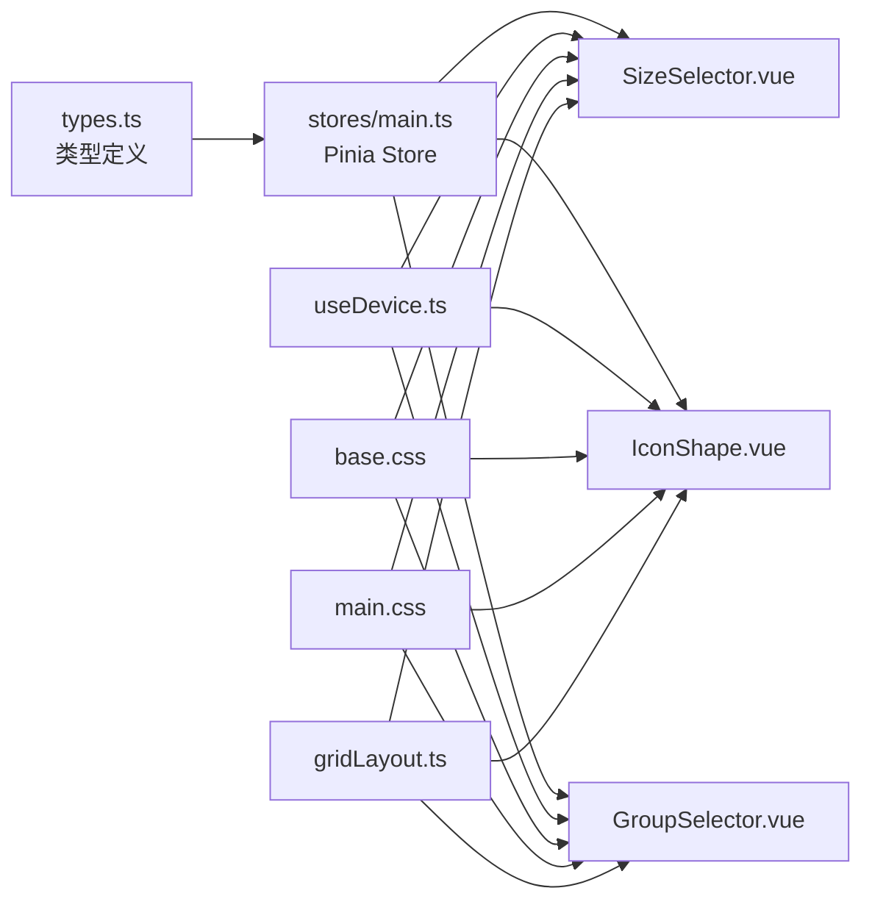

# UI 组件库

<cite>
**本文引用的文件**
- [frontend/src/components/SizeSelector.vue](file://frontend/src/components/SizeSelector.vue)
- [frontend/src/components/IconShape.vue](file://frontend/src/components/IconShape.vue)
- [frontend/src/components/GroupSelector.vue](file://frontend/src/components/GroupSelector.vue)
- [frontend/src/assets/base.css](file://frontend/src/assets/base.css)
- [frontend/src/assets/main.css](file://frontend/src/assets/main.css)
- [frontend/src/App.vue](file://frontend/src/App.vue)
- [frontend/src/composables/useDevice.ts](file://frontend/src/composables/useDevice.ts)
- [frontend/src/utils/gridLayout.ts](file://frontend/src/utils/gridLayout.ts)
- [frontend/src/stores/main.ts](file://frontend/src/stores/main.ts)
- [frontend/src/types.ts](file://frontend/src/types.ts)
- [frontend/package.json](file://frontend/package.json)
- [frontend/vite.config.ts](file://frontend/vite.config.ts)
- [frontend/src/components/__tests__/GroupSelector.spec.ts](file://frontend/src/components/__tests__/GroupSelector.spec.ts)
- [frontend/src/components/__tests__/GridPanel_ContextMenu.spec.ts](file://frontend/src/components/__tests__/GridPanel_ContextMenu.spec.ts)
- [frontend/src/components/ClockWeatherWidget.vue](file://frontend/src/components/ClockWeatherWidget.vue)
- [frontend/src/components/EditModal.vue](file://frontend/src/components/EditModal.vue)
- [frontend/src/components/SettingsModal.vue](file://frontend/src/components/SettingsModal.vue)
</cite>

## 目录
1. [简介](#简介)
2. [项目结构](#项目结构)
3. [核心组件](#核心组件)
4. [架构总览](#架构总览)
5. [组件详解](#组件详解)
6. [依赖关系分析](#依赖关系分析)
7. [性能考量](#性能考量)
8. [故障排查指南](#故障排查指南)
9. [结论](#结论)
10. [附录](#附录)

## 简介
本指南面向 OFlatNas UI 组件库，聚焦于通用交互组件的设计理念、样式系统与主题体系、响应式策略、动画与过渡、可访问性与键盘导航、样式定制与覆盖、组件测试与版本管理规范。文档以尺寸选择器、图标形状、分组选择器等通用组件为切入点，结合布局算法、状态存储与主题变量，帮助开发者快速理解并高效扩展组件库。

## 项目结构
前端采用 Vue 3 + Vite 架构，组件位于 frontend/src/components，样式位于 frontend/src/assets，全局状态通过 Pinia 管理，工具函数与布局算法位于 utils 与 composables 目录，测试使用 Vitest 与 @vue/test-utils。

图表来源
- [frontend/src/App.vue:1-666](file://frontend/src/App.vue#L1-L666)
- [frontend/src/components/SizeSelector.vue:1-99](file://frontend/src/components/SizeSelector.vue#L1-L99)
- [frontend/src/components/IconShape.vue:1-171](file://frontend/src/components/IconShape.vue#L1-L171)
- [frontend/src/components/GroupSelector.vue:1-124](file://frontend/src/components/GroupSelector.vue#L1-L124)
- [frontend/src/assets/base.css:1-116](file://frontend/src/assets/base.css#L1-L116)
- [frontend/src/assets/main.css:1-132](file://frontend/src/assets/main.css#L1-L132)
- [frontend/src/stores/main.ts:1-800](file://frontend/src/stores/main.ts#L1-L800)
- [frontend/src/composables/useDevice.ts:1-71](file://frontend/src/composables/useDevice.ts#L1-L71)
- [frontend/src/utils/gridLayout.ts:1-113](file://frontend/src/utils/gridLayout.ts#L1-L113)
- [frontend/src/types.ts:1-298](file://frontend/src/types.ts#L1-L298)
- [frontend/package.json:1-77](file://frontend/package.json#L1-L77)
- [frontend/vite.config.ts:1-57](file://frontend/vite.config.ts#L1-L57)

章节来源
- [frontend/src/App.vue:1-666](file://frontend/src/App.vue#L1-L666)
- [frontend/package.json:1-77](file://frontend/package.json#L1-L77)
- [frontend/vite.config.ts:1-57](file://frontend/vite.config.ts#L1-L57)

## 核心组件
- 尺寸选择器：提供网格尺寸预览与选择，支持悬停高亮与点击确认，发射选中尺寸事件。
- 图标形状：统一渲染多种矢量形状的图标蒙版，支持图片、SVG 与文本三种内容形态，动态计算缩放与填充。
- 分组选择器：下拉分组选择，支持点击外部关闭、禁用态、动画过渡与滚动条定制。

章节来源
- [frontend/src/components/SizeSelector.vue:1-99](file://frontend/src/components/SizeSelector.vue#L1-L99)
- [frontend/src/components/IconShape.vue:1-171](file://frontend/src/components/IconShape.vue#L1-L171)
- [frontend/src/components/GroupSelector.vue:1-124](file://frontend/src/components/GroupSelector.vue#L1-L124)

## 架构总览
组件库围绕“状态驱动 + 主题变量 + 响应式策略”展开：
- 状态驱动：Pinia store 提供全局配置、用户态、分组与小部件布局等数据，组件通过计算属性与事件与 store 交互。
- 主题变量：CSS 自定义属性定义语义化颜色与过渡，配合 prefers-color-scheme 实现明暗主题。
- 响应式策略：基于窗口尺寸与 UA 的设备检测，结合媒体查询与 CSS 变量实现多端适配。

图表来源
- [frontend/src/stores/main.ts:1-800](file://frontend/src/stores/main.ts#L1-L800)
- [frontend/src/composables/useDevice.ts:1-71](file://frontend/src/composables/useDevice.ts#L1-L71)
- [frontend/src/assets/base.css:1-116](file://frontend/src/assets/base.css#L1-L116)
- [frontend/src/utils/gridLayout.ts:1-113](file://frontend/src/utils/gridLayout.ts#L1-L113)
- [frontend/src/components/SizeSelector.vue:1-99](file://frontend/src/components/SizeSelector.vue#L1-L99)
- [frontend/src/components/IconShape.vue:1-171](file://frontend/src/components/IconShape.vue#L1-L171)
- [frontend/src/components/GroupSelector.vue:1-124](file://frontend/src/components/GroupSelector.vue#L1-L124)

## 组件详解

### 尺寸选择器
- 设计理念
  - 通过网格预览直观展示尺寸组合，悬停高亮当前预设，点击确认发射事件，保证交互明确与低耦合。
- 核心逻辑
  - 计算单元格行列映射，根据悬停索引或传入值决定当前列/行跨度，按阈值高亮已选区域。
  - 发射事件携带 colSpan 与 rowSpan，便于上层布局系统消费。
- 动画与过渡
  - 弹出层使用淡入动画，提升出现体验。
- 可访问性
  - 建议为网格容器添加 role 与 aria-* 属性，确保键盘可达与读屏友好。

图表来源
- [frontend/src/components/SizeSelector.vue:29-81](file://frontend/src/components/SizeSelector.vue#L29-L81)

章节来源
- [frontend/src/components/SizeSelector.vue:1-99](file://frontend/src/components/SizeSelector.vue#L1-L99)

### 图标形状
- 设计理念
  - 通过蒙版与裁剪实现统一图标外观，支持图片、SVG 与文本三类内容，自动识别与适配。
- 核心逻辑
  - 依据 shape 参数生成对应 path，使用唯一 ID 避免多实例冲突；根据传入尺寸与缩放比例计算图像几何；解析背景色类名或直接使用颜色值作为填充。
  - 自动判断内容类型：HTTP/本地路径/数据 URI/Blob 识别为图片；以 <svg 开头识别为内联 SVG；否则作为文本渲染。
- 动画与过渡
  - 背景矩形过渡动画平滑色彩变化。
- 可访问性
  - 文本图标建议提供替代文本或标题信息，SVG 内容需具备可读的语义标签。

图表来源
- [frontend/src/components/IconShape.vue:1-171](file://frontend/src/components/IconShape.vue#L1-L171)

章节来源
- [frontend/src/components/IconShape.vue:1-171](file://frontend/src/components/IconShape.vue#L1-L171)

### 分组选择器
- 设计理念
  - 下拉面板承载分组列表，支持点击外部关闭、禁用态与动画过渡，保持简洁与一致的交互反馈。
- 核心逻辑
  - 通过 store.groups 获取分组集合，根据 modelValue 显示当前分组标题；点击切换展开/收起；选择后发射 update:modelValue 并关闭面板。
  - 使用 onClickOutside 监听外部点击，自动收起面板。
- 动画与过渡
  - 使用 Vue Transition 定义进入/离开动画，配合 transform 与透明度实现缩放与位移过渡。
- 可访问性
  - 建议为下拉容器设置 role="listbox"，选项设置 role="option"，并维护键盘焦点顺序与方向键导航。

图表来源
- [frontend/src/components/GroupSelector.vue:1-124](file://frontend/src/components/GroupSelector.vue#L1-L124)
- [frontend/src/stores/main.ts:156-160](file://frontend/src/stores/main.ts#L156-L160)

章节来源
- [frontend/src/components/GroupSelector.vue:1-124](file://frontend/src/components/GroupSelector.vue#L1-L124)
- [frontend/src/stores/main.ts:156-160](file://frontend/src/stores/main.ts#L156-L160)

### 样式系统与主题
- 主题变量
  - 在 base.css 中定义语义化 CSS 变量，如 --color-background、--color-text，并在明暗模式下切换。
- 组件主题覆盖
  - 通过 night-settings 类与 :deep 选择器对 Modal 等组件进行夜间模式样式覆盖，统一玻璃拟态与模糊效果。
- 表单与面板主题
  - main.css 定义 RSS 表单面板的明/暗两套变量，配合 hover/focus 状态实现一致的主题风格。

章节来源
- [frontend/src/assets/base.css:1-116](file://frontend/src/assets/base.css#L1-L116)
- [frontend/src/assets/main.css:1-132](file://frontend/src/assets/main.css#L1-L132)
- [frontend/src/components/EditModal.vue:1542-1587](file://frontend/src/components/EditModal.vue#L1542-L1587)
- [frontend/src/components/SettingsModal.vue:4918-4955](file://frontend/src/components/SettingsModal.vue#L4918-L4955)

### 响应式设计与设备检测
- 设备检测
  - useDevice.ts 基于窗口尺寸与 UA 判定移动/平板/桌面，支持强制模式与浏览器特征识别。
- 响应式策略
  - App.vue 监听窗口尺寸与配置，自动启用扩展模式；main.css 中针对特定分辨率使用 zoom 缩放；组件内部使用媒体查询与 CSS 变量适配。
- 网格布局
  - gridLayout.ts 提供网格布局生成算法，支持半格粒度与占位矩阵，保障不同列数下的稳定布局。

图表来源
- [frontend/src/composables/useDevice.ts:1-71](file://frontend/src/composables/useDevice.ts#L1-L71)
- [frontend/src/App.vue:29-49](file://frontend/src/App.vue#L29-L49)
- [frontend/src/assets/main.css:127-132](file://frontend/src/assets/main.css#L127-L132)
- [frontend/src/utils/gridLayout.ts:11-113](file://frontend/src/utils/gridLayout.ts#L11-L113)

章节来源
- [frontend/src/composables/useDevice.ts:1-71](file://frontend/src/composables/useDevice.ts#L1-L71)
- [frontend/src/App.vue:29-49](file://frontend/src/App.vue#L29-L49)
- [frontend/src/utils/gridLayout.ts:11-113](file://frontend/src/utils/gridLayout.ts#L11-L113)

### 动画与过渡
- 组件动画
  - ClockWeatherWidget.vue 定义多种天气动画（飘雪、下雨、闪烁、薄雾流动等），通过 keyframes 与类名控制循环与节奏。
- 全局过渡
  - App.vue 定义 fade 与 slide-down 等过渡类，用于全局模态与回到顶部按钮等场景。
- 组件过渡
  - GroupSelector.vue 使用 Vue Transition 定义进入/离开动画，提升交互流畅度。

章节来源
- [frontend/src/components/ClockWeatherWidget.vue:679-776](file://frontend/src/components/ClockWeatherWidget.vue#L679-L776)
- [frontend/src/App.vue:642-666](file://frontend/src/App.vue#L642-L666)
- [frontend/src/components/GroupSelector.vue:64-105](file://frontend/src/components/GroupSelector.vue#L64-L105)

### 可访问性与键盘导航
- 角色与属性
  - 在需要的容器与元素上设置 role 与 aria-* 属性，确保读屏可感知。
- 键盘导航
  - 下拉组件建议支持 Tab/Shift+Tab 切换、方向键遍历、Enter/Space 选择。
- 焦点管理
  - 打开/关闭面板时主动管理焦点，避免焦点丢失。

（本节为通用指导，无需具体文件引用）

### 样式定制与覆盖最佳实践
- 使用 CSS 变量
  - 优先通过语义变量（如 --color-text、--color-background）进行主题定制，避免硬编码颜色。
- 组件作用域
  - 在组件 scoped 样式中定义局部变量与类名，必要时使用 ::v-deep 或 :deep 选择器穿透。
- 夜间模式
  - 通过 night-settings 类与 glass 系列样式实现统一的夜间视觉与模糊背景。
- 表单与面板
  - 借助 main.css 中的 RSS 表单变量体系，为表单控件提供一致的明/暗主题。

章节来源
- [frontend/src/assets/base.css:1-116](file://frontend/src/assets/base.css#L1-L116)
- [frontend/src/assets/main.css:1-132](file://frontend/src/assets/main.css#L1-L132)
- [frontend/src/components/EditModal.vue:1542-1587](file://frontend/src/components/EditModal.vue#L1542-L1587)
- [frontend/src/components/SettingsModal.vue:4918-4955](file://frontend/src/components/SettingsModal.vue#L4918-L4955)

### 组件测试与验证
- 单元测试
  - GroupSelector.spec.ts 验证初始渲染、打开/关闭行为与事件发射。
  - GridPanel_ContextMenu.spec.ts 验证右键菜单与删除确认流程。
- 测试建议
  - 为每个交互组件编写快照与行为测试，覆盖点击、键盘操作、外部点击关闭等场景。
  - 对依赖 store 的组件使用 @pinia/testing 创建测试态 store。

章节来源
- [frontend/src/components/__tests__/GroupSelector.spec.ts:1-80](file://frontend/src/components/__tests__/GroupSelector.spec.ts#L1-L80)
- [frontend/src/components/__tests__/GridPanel_ContextMenu.spec.ts:1-147](file://frontend/src/components/__tests__/GridPanel_ContextMenu.spec.ts#L1-L147)

### 版本管理与构建
- 版本与脚本
  - package.json 定义版本、构建脚本与测试命令，使用 Vite 与 Vue DevTools 插件。
- 构建配置
  - vite.config.ts 配置别名、插件、服务端口与输出目录，区分 Windows/Debian/Vercel/Docker 环境。
- 发布与打包
  - 构建产物输出至 dist 或 server/public，按平台自动选择 public 目录。

章节来源
- [frontend/package.json:1-77](file://frontend/package.json#L1-L77)
- [frontend/vite.config.ts:1-57](file://frontend/vite.config.ts#L1-L57)

## 依赖关系分析

图表来源
- [frontend/src/types.ts:1-298](file://frontend/src/types.ts#L1-L298)
- [frontend/src/stores/main.ts:1-800](file://frontend/src/stores/main.ts#L1-L800)
- [frontend/src/composables/useDevice.ts:1-71](file://frontend/src/composables/useDevice.ts#L1-L71)
- [frontend/src/assets/base.css:1-116](file://frontend/src/assets/base.css#L1-L116)
- [frontend/src/assets/main.css:1-132](file://frontend/src/assets/main.css#L1-L132)
- [frontend/src/utils/gridLayout.ts:1-113](file://frontend/src/utils/gridLayout.ts#L1-L113)
- [frontend/src/components/SizeSelector.vue:1-99](file://frontend/src/components/SizeSelector.vue#L1-L99)
- [frontend/src/components/IconShape.vue:1-171](file://frontend/src/components/IconShape.vue#L1-L171)
- [frontend/src/components/GroupSelector.vue:1-124](file://frontend/src/components/GroupSelector.vue#L1-L124)

章节来源
- [frontend/src/types.ts:1-298](file://frontend/src/types.ts#L1-L298)
- [frontend/src/stores/main.ts:1-800](file://frontend/src/stores/main.ts#L1-L800)
- [frontend/src/utils/gridLayout.ts:1-113](file://frontend/src/utils/gridLayout.ts#L1-L113)

## 性能考量
- 渲染优化
  - 使用计算属性缓存复杂派生值，避免重复计算。
  - 在 IconShape.vue 中对路径与几何计算进行一次性计算并复用。
- 事件与监听
  - GroupSelector.vue 使用 onClickOutside 减少全局事件绑定数量。
- 布局算法
  - gridLayout.ts 采用占位矩阵与半格粒度，避免无限循环与重排抖动。
- 动画与过渡
  - 优先使用 transform 与 opacity，减少重排；合理设置动画时长与缓动曲线。

（本节为通用指导，无需具体文件引用）

## 故障排查指南
- 样式未生效
  - 检查 night-settings 类是否正确挂载；确认 :deep 选择器穿透层级；核对 CSS 变量命名与作用域。
- 夜间模式异常
  - 确认 prefers-color-scheme 与手动切换逻辑；检查 glass 系列样式与 backdrop-filter 支持。
- 下拉面板无法关闭
  - 核对 onClickOutside 的容器引用与事件冒泡；确保点击目标不在面板内。
- 尺寸选择器不响应
  - 检查悬停索引计算与 emit 事件；确认父组件正确监听 select 事件并更新布局。
- 布局错乱
  - 检查 gridLayout.ts 的列数与半格缩放；确认组件 colSpan/rowSpan 与实际尺寸匹配。

章节来源
- [frontend/src/components/EditModal.vue:1542-1587](file://frontend/src/components/EditModal.vue#L1542-L1587)
- [frontend/src/components/SettingsModal.vue:4918-4955](file://frontend/src/components/SettingsModal.vue#L4918-L4955)
- [frontend/src/components/GroupSelector.vue:17-19](file://frontend/src/components/GroupSelector.vue#L17-L19)
- [frontend/src/components/SizeSelector.vue:72-75](file://frontend/src/components/SizeSelector.vue#L72-L75)
- [frontend/src/utils/gridLayout.ts:11-113](file://frontend/src/utils/gridLayout.ts#L11-L113)

## 结论
OFlatNas UI 组件库以清晰的状态驱动、统一的主题变量与响应式策略为基础，辅以动画与过渡增强交互体验。尺寸选择器、图标形状与分组选择器等通用组件在设计上强调直观与可扩展，结合完善的测试与构建流程，能够支撑复杂场景下的快速迭代与稳定交付。

## 附录
- 类型与状态
  - types.ts 定义了导航分组、应用配置、小部件布局等核心类型，为组件与 store 的契约提供保障。
- 全局样式注入
  - App.vue 监听自定义 CSS/JS 配置，动态注入样式与脚本，支持条件化媒体查询与夜间模式。

章节来源
- [frontend/src/types.ts:1-298](file://frontend/src/types.ts#L1-L298)
- [frontend/src/App.vue:63-105](file://frontend/src/App.vue#L63-L105)