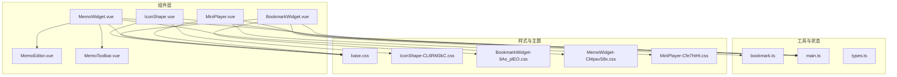
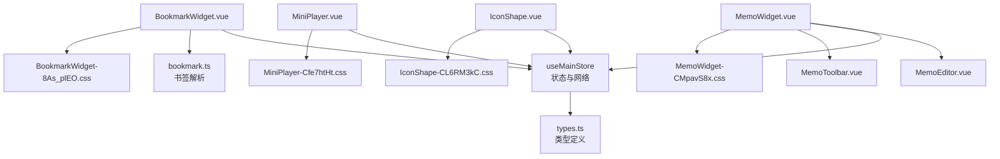
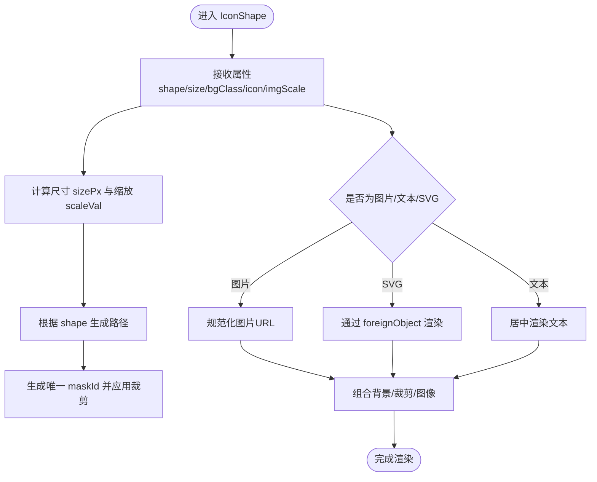
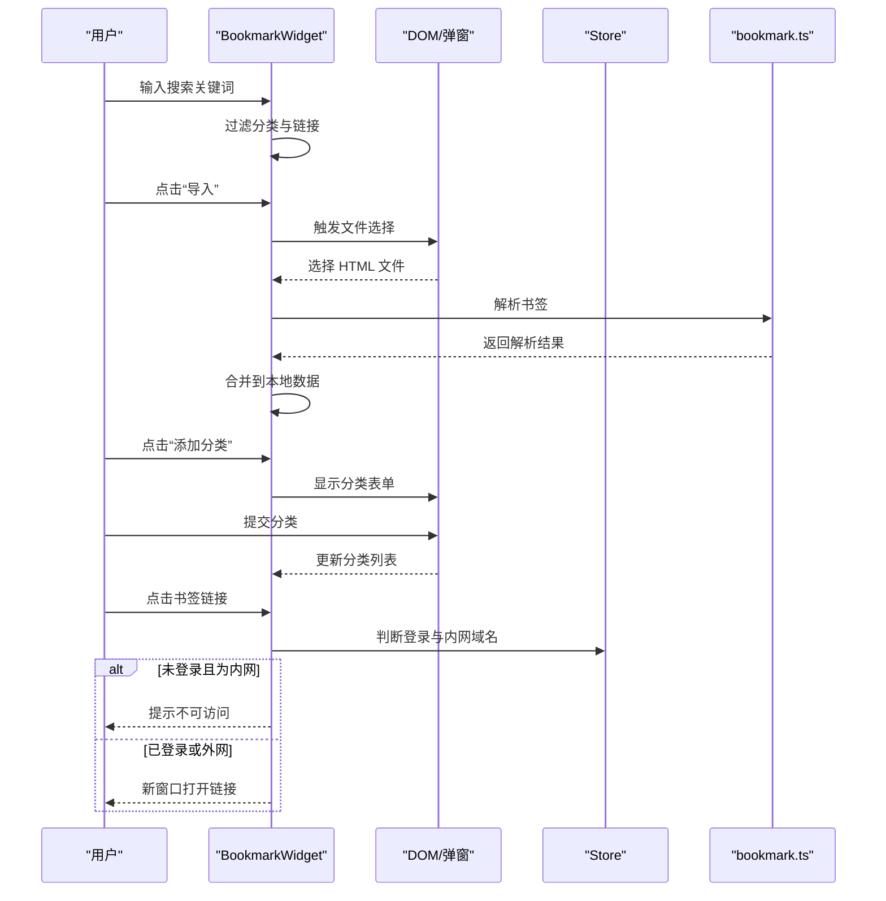
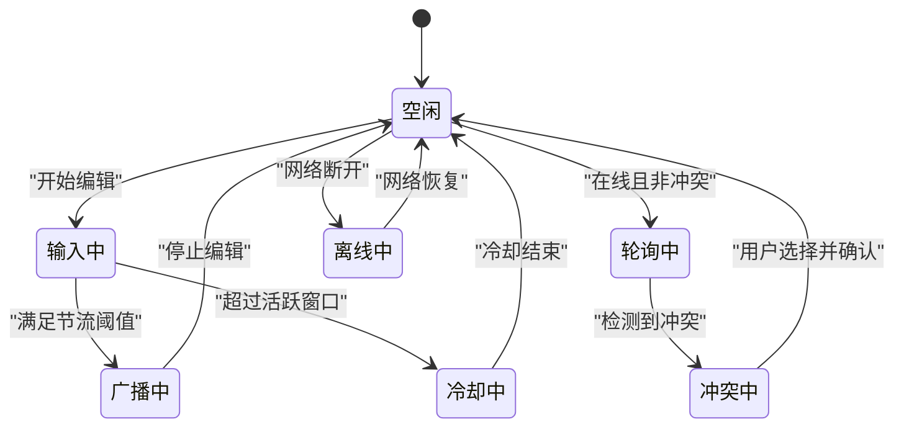
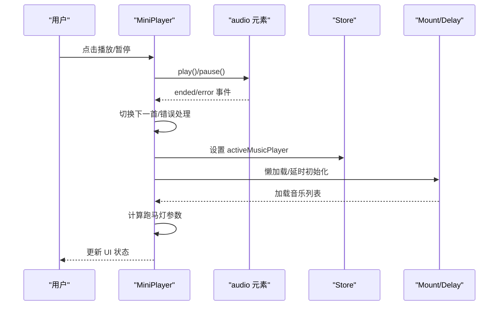
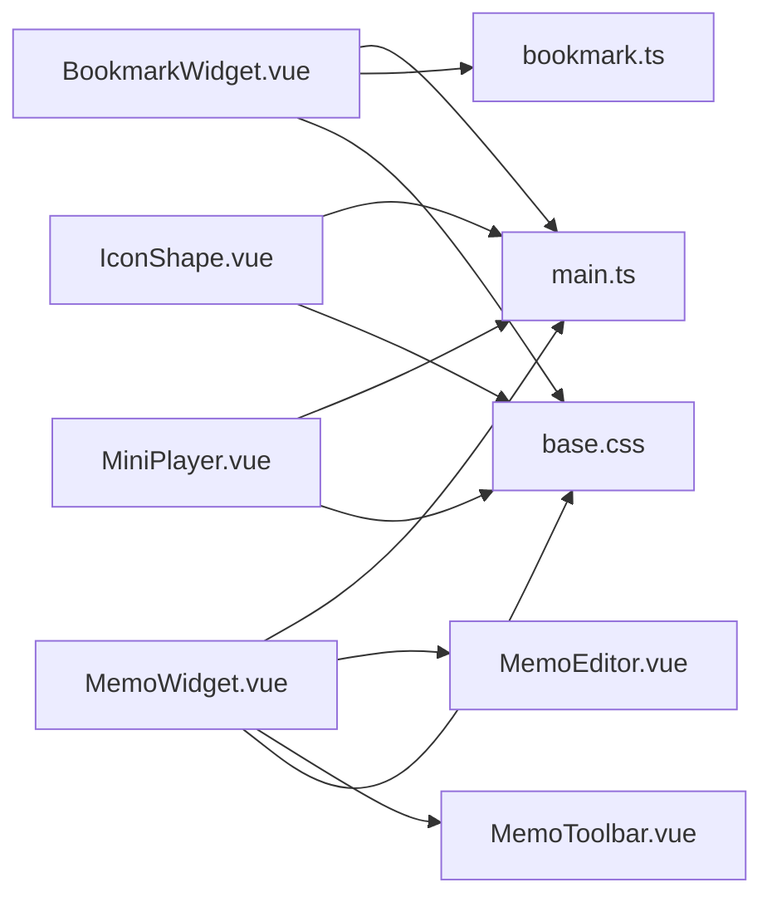

# 展示组件

<cite>
**本文引用的文件**
- [IconShape.vue](file://frontend/src/components/IconShape.vue)
- [BookmarkWidget.vue](file://frontend/src/components/BookmarkWidget.vue)
- [MemoWidget.vue](file://frontend/src/components/MemoWidget.vue)
- [MiniPlayer.vue](file://frontend/src/components/MiniPlayer.vue)
- [MemoEditor.vue](file://frontend/src/components/Memo/MemoEditor.vue)
- [MemoToolbar.vue](file://frontend/src/components/Memo/MemoToolbar.vue)
- [bookmark.ts](file://frontend/src/utils/bookmark.ts)
- [main.ts](file://frontend/src/stores/main.ts)
- [base.css](file://frontend/src/assets/base.css)
- [types.ts](file://frontend/src/types.ts)
- [IconShape-CL6RM3kC.css](file://debian/server/public/assets/IconShape-CL6RM3kC.css)
- [BookmarkWidget-8As_plEO.css](file://debian/server/public/assets/BookmarkWidget-8As_plEO.css)
- [MemoWidget-CMpavS8x.css](file://debian/server/public/assets/MemoWidget-CMpavS8x.css)
- [MiniPlayer-Cfe7htHt.css](file://debian/server/public/assets/MiniPlayer-Cfe7htHt.css)
</cite>

## 目录
1. [简介](#简介)
2. [项目结构](#项目结构)
3. [核心组件](#核心组件)
4. [架构总览](#架构总览)
5. [详细组件分析](#详细组件分析)
6. [依赖关系分析](#依赖关系分析)
7. [性能与优化](#性能与优化)
8. [故障排查指南](#故障排查指南)
9. [结论](#结论)
10. [附录](#附录)

## 简介
本章节面向 OFlatNas 的展示型组件，系统性梳理图标形状组件、书签组件、备忘录组件与迷你播放器的实现细节。内容涵盖数据绑定、状态管理、视觉呈现、动画与过渡、交互反馈、可定制外观与主题支持，以及性能优化、懒加载与缓存策略。目标是帮助开发者与使用者在理解组件设计思想的同时，能够高效地进行二次开发与维护。

## 项目结构
展示组件主要位于前端源码的 components 目录，配合工具函数、状态存储与样式资源协同工作。整体组织遵循按功能分层与按组件拆分的原则，便于复用与扩展。

图示来源
- [IconShape.vue:1-171](file://frontend/src/components/IconShape.vue#L1-L171)
- [BookmarkWidget.vue:1-574](file://frontend/src/components/BookmarkWidget.vue#L1-L574)
- [MemoWidget.vue:1-800](file://frontend/src/components/MemoWidget.vue#L1-L800)
- [MiniPlayer.vue:1-400](file://frontend/src/components/MiniPlayer.vue#L1-L400)
- [MemoEditor.vue:1-113](file://frontend/src/components/Memo/MemoEditor.vue#L1-L113)
- [MemoToolbar.vue:1-98](file://frontend/src/components/Memo/MemoToolbar.vue#L1-L98)
- [bookmark.ts:1-109](file://frontend/src/utils/bookmark.ts#L1-L109)
- [main.ts:1-200](file://frontend/src/stores/main.ts#L1-L200)
- [base.css:1-116](file://frontend/src/assets/base.css#L1-L116)
- [IconShape-CL6RM3kC.css:1-2](file://debian/server/public/assets/IconShape-CL6RM3kC.css#L1-L2)
- [BookmarkWidget-8As_plEO.css:1-2](file://debian/server/public/assets/BookmarkWidget-8As_plEO.css#L1-L2)
- [MemoWidget-CMpavS8x.css:1-2](file://debian/server/public/assets/MemoWidget-CMpavS8x.css#L1-L2)
- [MiniPlayer-Cfe7htHt.css:1-2](file://debian/server/public/assets/MiniPlayer-Cfe7htHt.css#L1-L2)

章节来源
- [IconShape.vue:1-171](file://frontend/src/components/IconShape.vue#L1-L171)
- [BookmarkWidget.vue:1-574](file://frontend/src/components/BookmarkWidget.vue#L1-L574)
- [MemoWidget.vue:1-800](file://frontend/src/components/MemoWidget.vue#L1-L800)
- [MiniPlayer.vue:1-400](file://frontend/src/components/MiniPlayer.vue#L1-L400)
- [MemoEditor.vue:1-113](file://frontend/src/components/Memo/MemoEditor.vue#L1-L113)
- [MemoToolbar.vue:1-98](file://frontend/src/components/Memo/MemoToolbar.vue#L1-L98)
- [bookmark.ts:1-109](file://frontend/src/utils/bookmark.ts#L1-L109)
- [main.ts:1-200](file://frontend/src/stores/main.ts#L1-L200)
- [base.css:1-116](file://frontend/src/assets/base.css#L1-L116)

## 核心组件
- 图标形状组件：基于 SVG 裁剪与几何路径，支持多种形状、背景填充与图标/文本渲染，具备尺寸与缩放适配能力。
- 书签组件：提供分类管理、搜索过滤、导入导出、弹窗编辑、安全拦截与滚动隔离等能力，具备本地备份与持久化。
- 备忘录组件：富文本/纯文本双模式，内置版本快照与 IndexedDB 存储，结合轮询与 Socket 同步，处理冲突与离线场景。
- 迷你播放器：音频播放控制、播放历史、标题跑马灯、自动播放手势与音量控制，支持懒加载与错误恢复。

章节来源
- [IconShape.vue:1-171](file://frontend/src/components/IconShape.vue#L1-L171)
- [BookmarkWidget.vue:1-574](file://frontend/src/components/BookmarkWidget.vue#L1-L574)
- [MemoWidget.vue:1-800](file://frontend/src/components/MemoWidget.vue#L1-L800)
- [MiniPlayer.vue:1-400](file://frontend/src/components/MiniPlayer.vue#L1-L400)

## 架构总览
展示组件通过 Pinia Store 统一管理应用状态（如登录态、网络模式、活动播放器），并通过工具函数与类型定义确保数据一致性与可扩展性。样式采用 CSS 变量与原子化类名，配合 scoped 样式与构建产物中的样式文件实现主题与定制化。

图示来源
- [main.ts:1-200](file://frontend/src/stores/main.ts#L1-L200)
- [types.ts:1-200](file://frontend/src/types.ts#L1-L200)
- [bookmark.ts:1-109](file://frontend/src/utils/bookmark.ts#L1-L109)
- [IconShape.vue:1-171](file://frontend/src/components/IconShape.vue#L1-L171)
- [BookmarkWidget.vue:1-574](file://frontend/src/components/BookmarkWidget.vue#L1-L574)
- [MemoWidget.vue:1-800](file://frontend/src/components/MemoWidget.vue#L1-L800)
- [MiniPlayer.vue:1-400](file://frontend/src/components/MiniPlayer.vue#L1-L400)
- [MemoEditor.vue:1-113](file://frontend/src/components/Memo/MemoEditor.vue#L1-L113)
- [MemoToolbar.vue:1-98](file://frontend/src/components/Memo/MemoToolbar.vue#L1-L98)
- [IconShape-CL6RM3kC.css:1-2](file://debian/server/public/assets/IconShape-CL6RM3kC.css#L1-L2)
- [BookmarkWidget-8As_plEO.css:1-2](file://debian/server/public/assets/BookmarkWidget-8As_plEO.css#L1-L2)
- [MemoWidget-CMpavS8x.css:1-2](file://debian/server/public/assets/MemoWidget-CMpavS8x.css#L1-L2)
- [MiniPlayer-Cfe7htHt.css:1-2](file://debian/server/public/assets/MiniPlayer-Cfe7htHt.css#L1-L2)

## 详细组件分析

### 图标形状组件（IconShape）
- 数据绑定与属性
  - 接收形状、尺寸、背景类名、图标内容与缩放参数，计算最终尺寸与缩放比例。
  - 通过唯一 ID 避免多实例间的 SVG 裁剪冲突。
- 渲染策略
  - 支持图片、SVG 字符串与文本三种形态；根据输入自动判断渲染路径。
  - 使用 SVG 裁剪与路径绘制实现多种形状（圆形、圆角方形、方形、菱形、六边形、八边形、五边形、叶形等）。
- 视觉与主题
  - 背景色支持 Tailwind 风格类名或原生颜色值；自动转换类名以适配 fill。
  - 尺寸与文本缩放按比例动态计算，保证不同尺寸下的可读性。
- 动画与交互
  - 背景层使用过渡动画，提升切换质感。
- 性能与适配
  - 通过计算属性缓存几何与判定结果，减少重复计算。
  - 图片与 SVG 的条件渲染避免不必要的 DOM 结构。

图示来源
- [IconShape.vue:1-171](file://frontend/src/components/IconShape.vue#L1-L171)

章节来源
- [IconShape.vue:1-171](file://frontend/src/components/IconShape.vue#L1-L171)
- [IconShape-CL6RM3kC.css:1-2](file://debian/server/public/assets/IconShape-CL6RM3kC.css#L1-L2)

### 书签组件（BookmarkWidget）
- 数据绑定与状态
  - 通过 widget.data 绑定书签数据，支持本地备份与挂载时回填。
  - 搜索查询实时过滤分类与链接，保持层级结构。
- 编辑与导入
  - 弹窗表单支持自动抓取标题与图标；支持拖拽上传浏览器书签 HTML 并解析。
  - 分类增删、链接增删改查，编辑态与新增态分离。
- 安全与交互
  - 未登录状态下拦截内网域名访问；登录后在新窗口打开。
  - 滚动隔离避免穿透事件影响容器外滚动。
- 视觉与主题
  - 半透明背景与模糊边框营造沉浸感；悬停态显示操作按钮。
  - 动画淡入与键值动画增强交互反馈。
- 性能与缓存
  - 本地备份使用持久化存储，减少首次加载压力。
  - 解析书签时预处理 HTML 结构，兼容多种格式。

图示来源
- [BookmarkWidget.vue:1-574](file://frontend/src/components/BookmarkWidget.vue#L1-L574)
- [bookmark.ts:1-109](file://frontend/src/utils/bookmark.ts#L1-L109)
- [main.ts:1-200](file://frontend/src/stores/main.ts#L1-L200)

章节来源
- [BookmarkWidget.vue:1-574](file://frontend/src/components/BookmarkWidget.vue#L1-L574)
- [bookmark.ts:1-109](file://frontend/src/utils/bookmark.ts#L1-L109)
- [BookmarkWidget-8As_plEO.css:1-2](file://debian/server/public/assets/BookmarkWidget-8As_plEO.css#L1-L2)

### 备忘录组件（MemoWidget）
- 数据绑定与状态
  - 双模式：富文本（基于 contenteditable）与纯文本；本地状态与服务器状态双向同步。
  - 版本管理：IndexedDB 快照与历史版本列表，支持预览与回滚。
- 同步与冲突
  - 在线/离线/输入中/冷却/广播/冲突等多状态机驱动；根据网络与活动状态调整轮询与广播节律。
  - 冲突检测基于时间戳与内容签名，提供本地/远程选择与冷却提示。
- 交互与反馈
  - 保存成功提示、版本菜单、命令工具栏；编辑器内支持标题、列表、代码块、引用等基础排版。
- 性能与可靠性
  - 节流广播、指数退避重试、超时控制与幂等请求头，保障弱网与后台场景的稳定性。
  - 页面可见性与用户活跃度感知，动态调整轮询周期。

图示来源
- [MemoWidget.vue:1-800](file://frontend/src/components/MemoWidget.vue#L1-L800)
- [MemoEditor.vue:1-113](file://frontend/src/components/Memo/MemoEditor.vue#L1-L113)
- [MemoToolbar.vue:1-98](file://frontend/src/components/Memo/MemoToolbar.vue#L1-L98)
- [main.ts:1-200](file://frontend/src/stores/main.ts#L1-L200)

章节来源
- [MemoWidget.vue:1-800](file://frontend/src/components/MemoWidget.vue#L1-L800)
- [MemoEditor.vue:1-113](file://frontend/src/components/Memo/MemoEditor.vue#L1-L113)
- [MemoToolbar.vue:1-98](file://frontend/src/components/Memo/MemoToolbar.vue#L1-L98)
- [MemoWidget-CMpavS8x.css:1-2](file://debian/server/public/assets/MemoWidget-CMpavS8x.css#L1-L2)

### 迷你播放器（MiniPlayer）
- 数据绑定与状态
  - 当前曲目、播放历史、音量与播放状态；与全局播放器状态联动。
- 播放控制
  - 切歌（上一首/下一首）、播放/暂停、错误处理与自动播放手势。
  - 标题溢出时启用跑马灯动画，自适应长度与播放状态。
- 性能与体验
  - 懒加载与挂载延时，避免父组件重渲染导致的请求中断。
  - 自动播放失败时附加一次性手势监听，提升可用性。
- 主题与样式
  - 文字阴影与关键帧动画，保证在浅色背景下清晰可读。

图示来源
- [MiniPlayer.vue:1-400](file://frontend/src/components/MiniPlayer.vue#L1-L400)
- [main.ts:1-200](file://frontend/src/stores/main.ts#L1-L200)
- [MiniPlayer-Cfe7htHt.css:1-2](file://debian/server/public/assets/MiniPlayer-Cfe7htHt.css#L1-L2)

章节来源
- [MiniPlayer.vue:1-400](file://frontend/src/components/MiniPlayer.vue#L1-L400)
- [MiniPlayer-Cfe7htHt.css:1-2](file://debian/server/public/assets/MiniPlayer-Cfe7htHt.css#L1-L2)

## 依赖关系分析
- 组件间耦合
  - IconShape 与 Store：仅使用资源 URL 规范化；低耦合。
  - BookmarkWidget 与 Store：登录态与安全拦截；与工具模块解耦。
  - MemoWidget 与 Store：Socket 连接、全局播放器状态；与编辑器子组件高内聚。
  - MiniPlayer 与 Store：全局播放器状态；与 Store 方法解耦。
- 外部依赖
  - 类型定义来自 types.ts；工具函数来自 bookmark.ts；样式来自 base.css 与构建产物。
- 循环依赖
  - 未发现明显循环依赖；组件通过 Store 与工具函数间接通信。

图示来源
- [IconShape.vue:1-171](file://frontend/src/components/IconShape.vue#L1-L171)
- [BookmarkWidget.vue:1-574](file://frontend/src/components/BookmarkWidget.vue#L1-L574)
- [MemoWidget.vue:1-800](file://frontend/src/components/MemoWidget.vue#L1-L800)
- [MiniPlayer.vue:1-400](file://frontend/src/components/MiniPlayer.vue#L1-L400)
- [MemoEditor.vue:1-113](file://frontend/src/components/Memo/MemoEditor.vue#L1-L113)
- [MemoToolbar.vue:1-98](file://frontend/src/components/Memo/MemoToolbar.vue#L1-L98)
- [bookmark.ts:1-109](file://frontend/src/utils/bookmark.ts#L1-L109)
- [main.ts:1-200](file://frontend/src/stores/main.ts#L1-L200)
- [base.css:1-116](file://frontend/src/assets/base.css#L1-L116)

章节来源
- [IconShape.vue:1-171](file://frontend/src/components/IconShape.vue#L1-L171)
- [BookmarkWidget.vue:1-574](file://frontend/src/components/BookmarkWidget.vue#L1-L574)
- [MemoWidget.vue:1-800](file://frontend/src/components/MemoWidget.vue#L1-L800)
- [MiniPlayer.vue:1-400](file://frontend/src/components/MiniPlayer.vue#L1-L400)
- [MemoEditor.vue:1-113](file://frontend/src/components/Memo/MemoEditor.vue#L1-L113)
- [MemoToolbar.vue:1-98](file://frontend/src/components/Memo/MemoToolbar.vue#L1-L98)
- [bookmark.ts:1-109](file://frontend/src/utils/bookmark.ts#L1-L109)
- [main.ts:1-200](file://frontend/src/stores/main.ts#L1-L200)
- [base.css:1-116](file://frontend/src/assets/base.css#L1-L116)

## 性能与优化
- 懒加载与延迟初始化
  - MiniPlayer 在挂载后延迟加载音乐列表，避免父组件重渲染导致的请求中断。
- 计算属性缓存
  - IconShape 中的尺寸、缩放、几何与类型判定均通过计算属性缓存，减少重复计算。
- 节流与退避
  - MemoWidget 对广播与轮询采用节流与指数退避策略，降低网络压力与失败概率。
- 滚动隔离与事件短路
  - BookmarkWidget 对内部滚动进行边界检测，避免事件冒泡影响外部容器。
- 错误恢复与降级
  - MiniPlayer 在自动播放失败时附加一次性手势监听，提升可用性；图标加载失败时回退至占位。
- 样式与主题
  - 使用 CSS 变量与原子化类名，结合 scoped 样式与构建产物，减少样式冲突与重绘。

章节来源
- [MiniPlayer.vue:254-276](file://frontend/src/components/MiniPlayer.vue#L254-L276)
- [IconShape.vue:18-70](file://frontend/src/components/IconShape.vue#L18-L70)
- [MemoWidget.vue:578-622](file://frontend/src/components/MemoWidget.vue#L578-L622)
- [BookmarkWidget.vue:302-314](file://frontend/src/components/BookmarkWidget.vue#L302-L314)

## 故障排查指南
- 书签导入失败
  - 检查文件格式与内容结构；确认解析器对 HTML 的兼容性；查看控制台错误信息。
- 登录态与内网访问
  - 未登录状态下访问内网资源会被拦截；登录后方可正常打开。
- 备忘录冲突
  - 出现冲突提示时，选择“保留本地”或“使用远程”，并等待冷却期结束。
- 音频播放失败
  - 检查浏览器自动播放策略；若失败，尝试手势触发；查看错误日志定位具体原因。
- 图标显示异常
  - 确认图标 URL 是否有效；检查背景类名与颜色值格式；验证 SVG 字符串是否合法。

章节来源
- [bookmark.ts:1-109](file://frontend/src/utils/bookmark.ts#L1-L109)
- [BookmarkWidget.vue:285-300](file://frontend/src/components/BookmarkWidget.vue#L285-L300)
- [MemoWidget.vue:464-491](file://frontend/src/components/MemoWidget.vue#L464-L491)
- [MiniPlayer.vue:144-182](file://frontend/src/components/MiniPlayer.vue#L144-L182)
- [IconShape.vue:28-53](file://frontend/src/components/IconShape.vue#L28-L53)

## 结论
展示组件围绕“可定制、可扩展、可维护”的目标设计，通过清晰的状态机、稳健的同步策略与良好的性能优化，在复杂场景下仍能提供流畅的用户体验。建议在二次开发中遵循现有模式，保持组件职责单一、状态可控、样式可覆盖，并充分利用 Store 与工具函数实现跨组件协作。

## 附录
- 可定制外观与主题
  - 通过 CSS 变量与 Tailwind 类名实现主题适配；组件内部提供背景类名与颜色值映射。
- 动画与过渡
  - 组件广泛使用过渡与关键帧动画，提升交互反馈与视觉连贯性。
- 数据模型参考
  - 类型定义集中于 types.ts，便于统一约束与扩展。

章节来源
- [base.css:1-116](file://frontend/src/assets/base.css#L1-L116)
- [types.ts:1-200](file://frontend/src/types.ts#L1-L200)