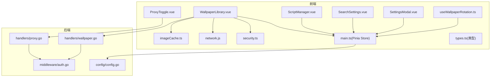
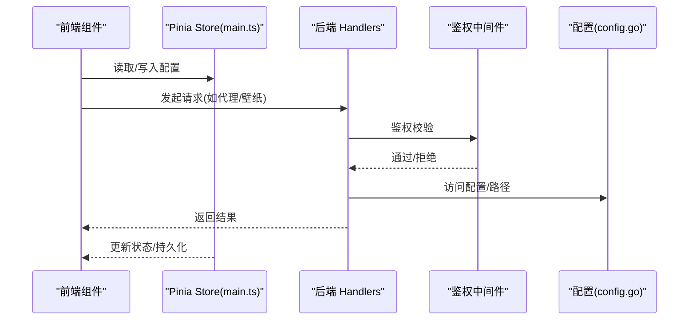
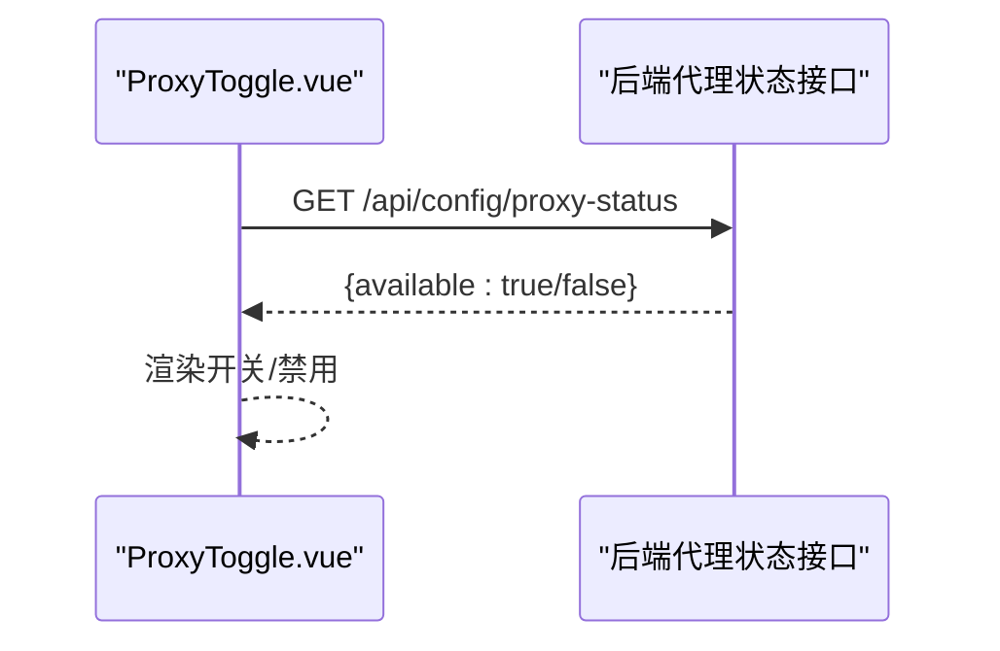
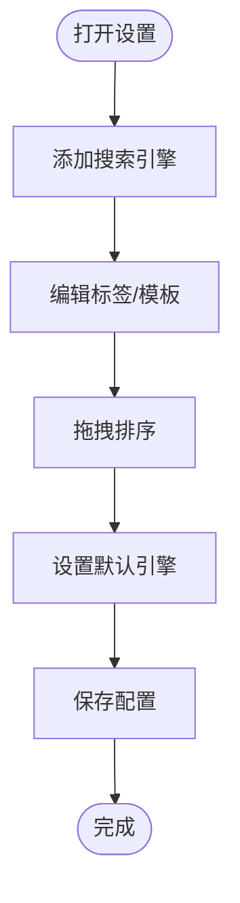
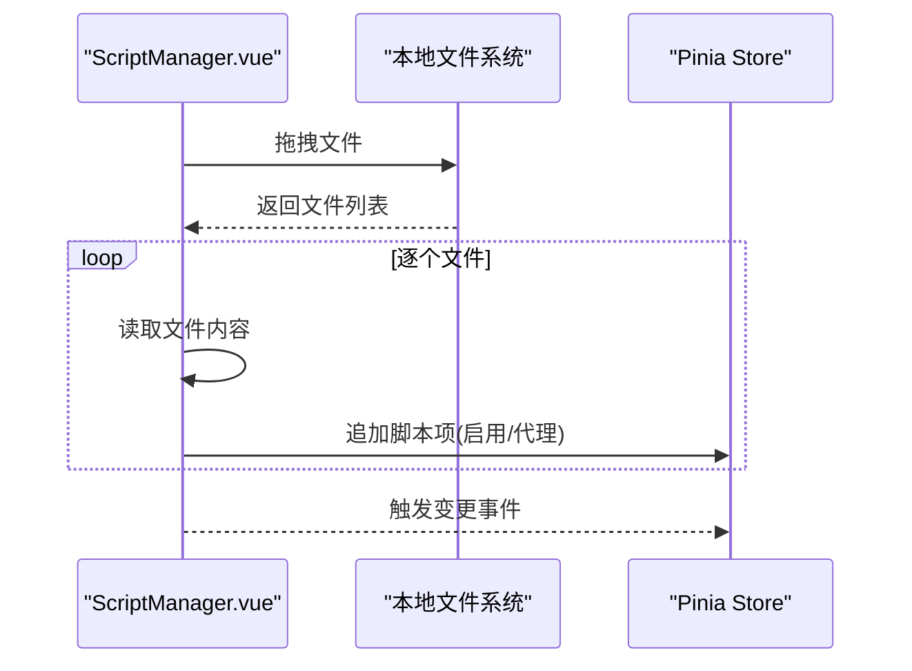
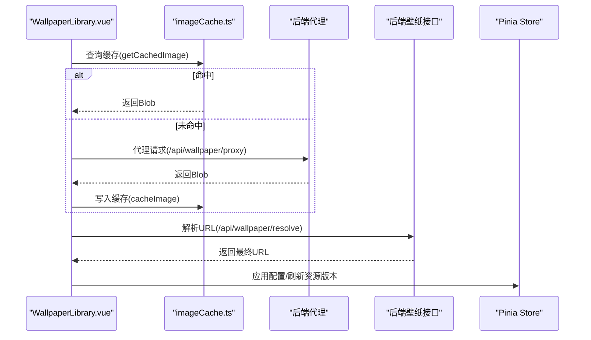
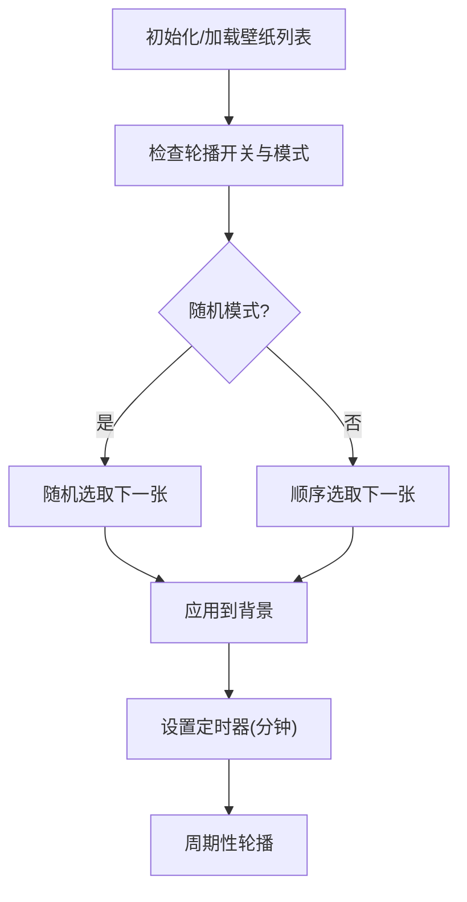
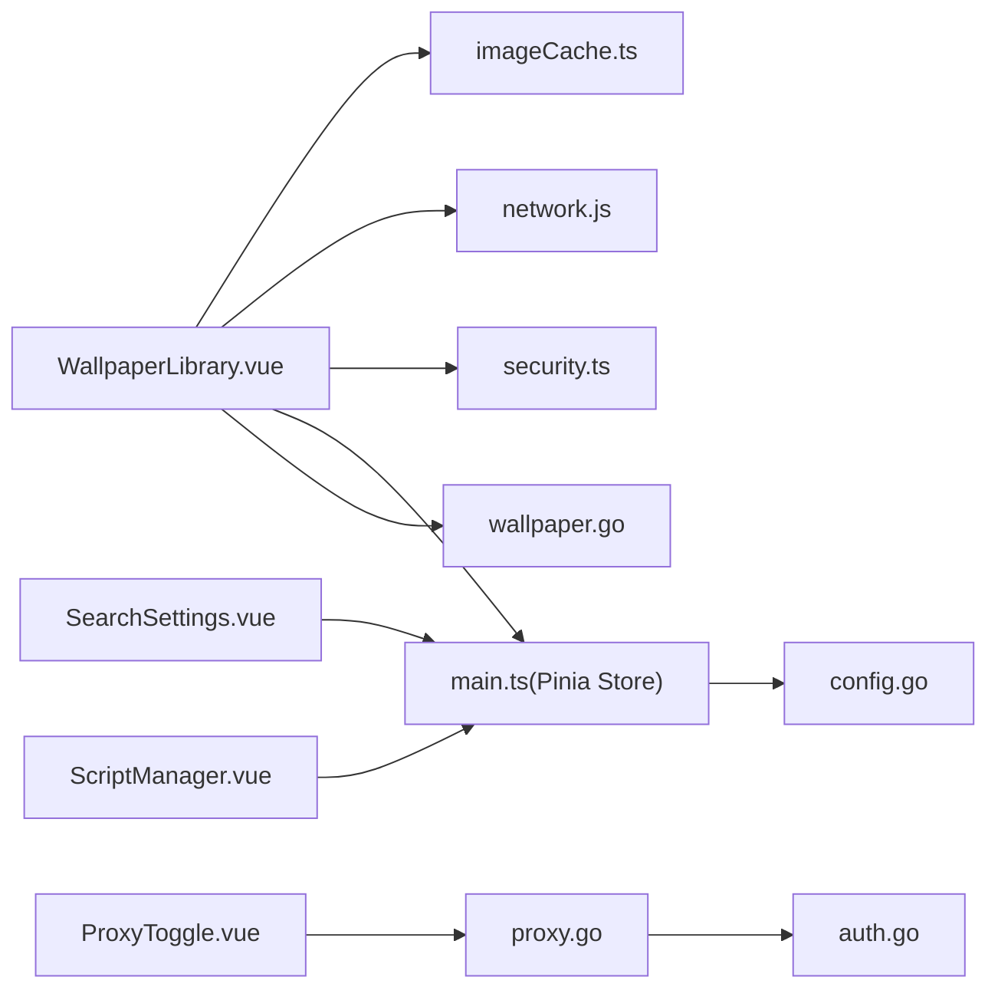

# 工具组件

<cite>
**本文引用的文件**
- [ProxyToggle.vue](file://frontend/src/components/ProxyToggle.vue)
- [SearchSettings.vue](file://frontend/src/components/SearchSettings.vue)
- [ScriptManager.vue](file://frontend/src/components/ScriptManager.vue)
- [WallpaperLibrary.vue](file://frontend/src/components/WallpaperLibrary.vue)
- [SettingsModal.vue](file://frontend/src/components/SettingsModal.vue)
- [useWallpaperRotation.ts](file://frontend/src/composables/useWallpaperRotation.ts)
- [imageCache.ts](file://frontend/src/utils/imageCache.ts)
- [network.js](file://frontend/src/utils/network.js)
- [security.ts](file://frontend/src/utils/security.ts)
- [main.ts](file://frontend/src/stores/main.ts)
- [types.ts](file://frontend/src/types.ts)
- [proxy.go](file://backend/handlers/proxy.go)
- [wallpaper.go](file://backend/handlers/wallpaper.go)
- [auth.go](file://backend/middleware/auth.go)
- [config.go](file://backend/config/config.go)
</cite>

## 目录
1. [简介](#简介)
2. [项目结构](#项目结构)
3. [核心组件](#核心组件)
4. [架构总览](#架构总览)
5. [组件详解](#组件详解)
6. [依赖关系分析](#依赖关系分析)
7. [性能考量](#性能考量)
8. [故障排查指南](#故障排查指南)
9. [结论](#结论)
10. [附录](#附录)

## 简介
本文件面向 OFlatNas 的工具组件，围绕以下功能模块进行系统化说明：
- 代理切换器：根据后端代理状态动态显示开关，支持通过代理访问受限资源。
- 搜索设置：管理搜索引擎列表（增删改、拖拽排序、默认引擎选择、记忆上次选择）。
- 脚本管理器：管理自定义 CSS/JS 脚本（增删改、拖拽排序、启用/禁用、代理开关、文件拖拽导入）。
- 壁纸库：管理 PC/手机壁纸库（上传、删除、排序、轮播、预览、API 图片源接入、缓存与对象 URL 生命周期管理）。

文档将从架构、数据流、状态管理、配置持久化、实时更新、集成方式、API 接口、扩展点、性能优化、缓存策略、错误处理、可配置性与主题适配、国际化支持等方面展开。

## 项目结构
前端工具组件主要位于 frontend/src/components 下，配合 Pinia Store、类型定义、工具函数与后端 Handlers 实现完整能力闭环。后端提供代理转发、壁纸解析与上传、鉴权等接口。

图示来源
- [ProxyToggle.vue](file://frontend/src/components/ProxyToggle.vue)
- [SearchSettings.vue](file://frontend/src/components/SearchSettings.vue)
- [ScriptManager.vue](file://frontend/src/components/ScriptManager.vue)
- [WallpaperLibrary.vue](file://frontend/src/components/WallpaperLibrary.vue)
- [SettingsModal.vue](file://frontend/src/components/SettingsModal.vue)
- [useWallpaperRotation.ts](file://frontend/src/composables/useWallpaperRotation.ts)
- [imageCache.ts](file://frontend/src/utils/imageCache.ts)
- [network.js](file://frontend/src/utils/network.js)
- [security.ts](file://frontend/src/utils/security.ts)
- [main.ts](file://frontend/src/stores/main.ts)
- [types.ts](file://frontend/src/types.ts)
- [proxy.go](file://backend/handlers/proxy.go)
- [wallpaper.go](file://backend/handlers/wallpaper.go)
- [auth.go](file://backend/middleware/auth.go)
- [config.go](file://backend/config/config.go)

章节来源
- [ProxyToggle.vue](file://frontend/src/components/ProxyToggle.vue)
- [SearchSettings.vue](file://frontend/src/components/SearchSettings.vue)
- [ScriptManager.vue](file://frontend/src/components/ScriptManager.vue)
- [WallpaperLibrary.vue](file://frontend/src/components/WallpaperLibrary.vue)
- [SettingsModal.vue](file://frontend/src/components/SettingsModal.vue)
- [useWallpaperRotation.ts](file://frontend/src/composables/useWallpaperRotation.ts)
- [imageCache.ts](file://frontend/src/utils/imageCache.ts)
- [network.js](file://frontend/src/utils/network.js)
- [security.ts](file://frontend/src/utils/security.ts)
- [main.ts](file://frontend/src/stores/main.ts)
- [types.ts](file://frontend/src/types.ts)
- [proxy.go](file://backend/handlers/proxy.go)
- [wallpaper.go](file://backend/handlers/wallpaper.go)
- [auth.go](file://backend/middleware/auth.go)
- [config.go](file://backend/config/config.go)

## 核心组件
- 代理切换器：基于后端代理状态接口动态渲染，支持通过代理访问受限资源。
- 搜索设置：集中管理搜索引擎列表，支持拖拽排序、默认引擎选择、URL 模板编辑。
- 脚本管理器：支持自定义 CSS/JS 脚本的增删改、启用/禁用、代理开关、文件拖拽导入与本地编辑。
- 壁纸库：提供壁纸上传、删除、排序、轮播、预览、API 图片源接入与缓存策略。

章节来源
- [ProxyToggle.vue](file://frontend/src/components/ProxyToggle.vue)
- [SearchSettings.vue](file://frontend/src/components/SearchSettings.vue)
- [ScriptManager.vue](file://frontend/src/components/ScriptManager.vue)
- [WallpaperLibrary.vue](file://frontend/src/components/WallpaperLibrary.vue)

## 架构总览
整体采用前后端分离架构：
- 前端通过 Pinia Store 维护应用配置与状态，调用后端 API 完成代理转发、壁纸解析与上传、鉴权等操作。
- 后端 Handlers 提供代理转发、壁纸解析与上传、鉴权中间件等能力，配置由 config 初始化并确保目录与默认文件存在。

图示来源
- [main.ts](file://frontend/src/stores/main.ts)
- [proxy.go](file://backend/handlers/proxy.go)
- [wallpaper.go](file://backend/handlers/wallpaper.go)
- [auth.go](file://backend/middleware/auth.go)
- [config.go](file://backend/config/config.go)

## 组件详解

### 代理切换器（ProxyToggle）
- 功能特性
  - 根据后端代理状态接口判断是否显示开关。
  - 支持通过代理访问受限资源，提升跨地域/网络限制场景下的可用性。
- 配置选项
  - 通过后端代理状态接口动态显示/隐藏。
- 使用场景
  - 在网络受限环境下，快速切换代理以访问外部资源。
- 状态管理与实时更新
  - 组件挂载时拉取代理状态，后续通过后端接口变化实现动态更新。
- 错误处理
  - 请求失败时降级为不可用状态，避免阻塞界面。
- 集成方式与 API
  - 前端组件直接调用后端代理状态接口，后端返回可用性布尔值。

图示来源
- [ProxyToggle.vue](file://frontend/src/components/ProxyToggle.vue)
- [proxy.go](file://backend/handlers/proxy.go)

章节来源
- [ProxyToggle.vue](file://frontend/src/components/ProxyToggle.vue)
- [proxy.go](file://backend/handlers/proxy.go)

### 搜索设置（SearchSettings）
- 功能特性
  - 新增/删除搜索引擎，拖拽调整优先级。
  - 设置默认搜索引擎，支持“记住上次选择”。
  - 编辑搜索引擎标签与 URL 模板。
- 配置选项
  - 搜索引擎数组、默认引擎键、是否记住上次选择。
- 使用场景
  - 个性化搜索入口，统一管理多搜索引擎。
- 状态管理与实时更新
  - 通过 Pinia Store 的 appConfig 维护，变更时触发保存。
- 集成方式与 API
  - 与主配置存储联动，无需额外后端接口。

图示来源
- [SearchSettings.vue](file://frontend/src/components/SearchSettings.vue)
- [main.ts](file://frontend/src/stores/main.ts)
- [types.ts](file://frontend/src/types.ts)

章节来源
- [SearchSettings.vue](file://frontend/src/components/SearchSettings.vue)
- [main.ts](file://frontend/src/stores/main.ts)
- [types.ts](file://frontend/src/types.ts)

### 脚本管理器（ScriptManager）
- 功能特性
  - 支持自定义 CSS/JS 脚本的增删改、启用/禁用、代理开关。
  - 文件拖拽导入，自动读取文本内容并生成脚本项。
  - 拖拽排序与本地编辑，支持批量操作与确认删除。
- 配置选项
  - 脚本列表、启用状态、代理开关、脚本内容。
- 使用场景
  - 为页面注入自定义样式或行为，按需启用/禁用。
- 状态管理与实时更新
  - 通过 Pinia Store 的 appConfig.customCssList/customJsList 维护，变更时触发保存。
- 集成方式与 API
  - 与主配置存储联动，无需额外后端接口。
- 性能优化与缓存策略
  - 本地编辑与拖拽排序，避免频繁网络请求。
- 错误处理
  - 文件读取失败时记录错误并提示，不影响其他文件导入。

图示来源
- [ScriptManager.vue](file://frontend/src/components/ScriptManager.vue)
- [main.ts](file://frontend/src/stores/main.ts)
- [types.ts](file://frontend/src/types.ts)

章节来源
- [ScriptManager.vue](file://frontend/src/components/ScriptManager.vue)
- [main.ts](file://frontend/src/stores/main.ts)
- [types.ts](file://frontend/src/types.ts)

### 壁纸库（WallpaperLibrary）
- 功能特性
  - 分页展示 PC/手机壁纸库，支持上传、删除、排序、轮播。
  - 预览与缓存：IndexedDB 缓存 + 本地存储元信息，支持代理预取与直连回退。
  - API 接口：支持预设与自定义 API，自动解析与应用。
  - 对象 URL 生命周期管理：预览完成后主动释放，避免内存泄漏。
- 配置选项
  - 轮播开关、间隔、播放模式、模糊/遮罩参数、API 端点与图片基础路径。
- 使用场景
  - 管理与轮播壁纸，接入第三方图片源，提升视觉体验。
- 状态管理与实时更新
  - 通过 Pinia Store 的 wallpaperListPc/wallpaperListMobile 维护列表，变更时刷新资源版本号。
- 集成方式与 API
  - 列表：/api/backgrounds、/api/mobile_backgrounds
  - 上传：/api/backgrounds/upload、/api/mobile_backgrounds/upload
  - 删除：/api/backgrounds/:name、/api/mobile_backgrounds/:name
  - 解析：/api/wallpaper/resolve
  - 代理：/api/wallpaper/proxy
- 性能优化与缓存策略
  - IndexedDB 缓存图片，定期裁剪过期条目，控制最大数量。
  - 资源版本号用于缓存失效与同名覆盖场景。
- 错误处理
  - 上传/删除失败提示；预览失败回退至直连；默认图标兜底。
- 主题适配与国际化
  - 组件内使用语义化文案，支持多语言环境（仓库未提供语言包文件）。
- 可配置性
  - 支持自定义 API 端点、图片基础路径、轮播参数与模糊/遮罩参数。

图示来源
- [WallpaperLibrary.vue](file://frontend/src/components/WallpaperLibrary.vue)
- [imageCache.ts](file://frontend/src/utils/imageCache.ts)
- [proxy.go](file://backend/handlers/proxy.go)
- [wallpaper.go](file://backend/handlers/wallpaper.go)
- [main.ts](file://frontend/src/stores/main.ts)

章节来源
- [WallpaperLibrary.vue](file://frontend/src/components/WallpaperLibrary.vue)
- [imageCache.ts](file://frontend/src/utils/imageCache.ts)
- [proxy.go](file://backend/handlers/proxy.go)
- [wallpaper.go](file://backend/handlers/wallpaper.go)
- [main.ts](file://frontend/src/stores/main.ts)
- [types.ts](file://frontend/src/types.ts)

### 壁纸轮播（useWallpaperRotation）
- 功能特性
  - 支持 PC/手机端壁纸轮播，随机或顺序模式。
  - 基于定时器按分钟周期切换，支持停止并锁定。
- 配置选项
  - 轮播开关、间隔、播放模式、图片基础路径。
- 使用场景
  - 自动更换壁纸，营造动态桌面效果。
- 状态管理与实时更新
  - 通过 Pinia Store 的 appConfig.pcRotation/mobileRotation 等字段维护，变更时更新定时器。

图示来源
- [useWallpaperRotation.ts](file://frontend/src/composables/useWallpaperRotation.ts)
- [main.ts](file://frontend/src/stores/main.ts)

章节来源
- [useWallpaperRotation.ts](file://frontend/src/composables/useWallpaperRotation.ts)
- [main.ts](file://frontend/src/stores/main.ts)

## 依赖关系分析
- 组件间耦合
  - WallpaperLibrary 与 Pinia Store 强耦合，负责壁纸列表与配置的读写。
  - ProxyToggle 与后端代理状态接口耦合，用于动态显示开关。
  - SearchSettings 与 Pinia Store 的 appConfig 深度耦合，用于搜索引擎配置。
  - ScriptManager 与 Pinia Store 的自定义脚本列表耦合。
- 外部依赖
  - 后端 Handlers 提供代理转发、壁纸解析与上传、鉴权。
  - IndexedDB 与本地存储用于缓存与元信息管理。
  - 网络规则与安全工具用于目标分类与 URL 处理。

图示来源
- [WallpaperLibrary.vue](file://frontend/src/components/WallpaperLibrary.vue)
- [imageCache.ts](file://frontend/src/utils/imageCache.ts)
- [network.js](file://frontend/src/utils/network.js)
- [security.ts](file://frontend/src/utils/security.ts)
- [main.ts](file://frontend/src/stores/main.ts)
- [ProxyToggle.vue](file://frontend/src/components/ProxyToggle.vue)
- [proxy.go](file://backend/handlers/proxy.go)
- [SearchSettings.vue](file://frontend/src/components/SearchSettings.vue)
- [ScriptManager.vue](file://frontend/src/components/ScriptManager.vue)
- [wallpaper.go](file://backend/handlers/wallpaper.go)
- [auth.go](file://backend/middleware/auth.go)
- [config.go](file://backend/config/config.go)

章节来源
- [WallpaperLibrary.vue](file://frontend/src/components/WallpaperLibrary.vue)
- [ProxyToggle.vue](file://frontend/src/components/ProxyToggle.vue)
- [SearchSettings.vue](file://frontend/src/components/SearchSettings.vue)
- [ScriptManager.vue](file://frontend/src/components/ScriptManager.vue)
- [main.ts](file://frontend/src/stores/main.ts)
- [proxy.go](file://backend/handlers/proxy.go)
- [wallpaper.go](file://backend/handlers/wallpaper.go)
- [auth.go](file://backend/middleware/auth.go)
- [config.go](file://backend/config/config.go)

## 性能考量
- 缓存策略
  - IndexedDB 缓存图片，控制最大条目与过期时间，避免重复下载。
  - 本地存储元信息用于快速判断缓存有效性。
- 资源版本号
  - 通过资源版本号对静态资源进行缓存失效，避免同名覆盖导致的缓存污染。
- 网络与代理
  - 代理转发用于跨域与受限资源访问，失败时回退直连并携带时间戳参数绕过缓存。
- 轮播与定时器
  - 轮播定时器随配置变化动态更新，避免不必要的轮询。
- UI 交互
  - 拖拽排序与本地编辑减少网络往返，提升响应速度。

章节来源
- [imageCache.ts](file://frontend/src/utils/imageCache.ts)
- [main.ts](file://frontend/src/stores/main.ts)
- [useWallpaperRotation.ts](file://frontend/src/composables/useWallpaperRotation.ts)
- [WallpaperLibrary.vue](file://frontend/src/components/WallpaperLibrary.vue)

## 故障排查指南
- 代理不可用
  - 检查后端代理状态接口返回，确认代理配置与白名单。
  - 若代理不可用，组件将降级为不可用状态。
- 壁纸上传/删除失败
  - 检查后端接口返回与鉴权头，确认权限与路径。
  - 上传大文件时注意内存占用，必要时分批处理。
- 预览失败
  - 优先尝试代理预取，失败后回退直连并附加时间戳参数。
  - 缓存异常时清理 IndexedDB 与本地元信息。
- 轮播异常
  - 检查轮播开关、间隔与播放模式配置，确认定时器是否正确更新。
- 鉴权问题
  - 确认 Bearer Token 是否正确传递，后端中间件是否校验通过。

章节来源
- [proxy.go](file://backend/handlers/proxy.go)
- [wallpaper.go](file://backend/handlers/wallpaper.go)
- [auth.go](file://backend/middleware/auth.go)
- [imageCache.ts](file://frontend/src/utils/imageCache.ts)
- [useWallpaperRotation.ts](file://frontend/src/composables/useWallpaperRotation.ts)

## 结论
OFlatNas 的工具组件围绕代理、搜索、脚本与壁纸四大方向构建，具备良好的可配置性、可扩展性与用户体验。通过 Pinia Store 实现状态与配置的集中管理，结合后端 Handlers 提供的代理转发、壁纸解析与上传能力，形成完整的工具链路。组件在性能与稳定性方面采取了缓存、回退与资源版本号等策略，满足多场景需求。

## 附录
- 集成与扩展
  - 代理切换器：可扩展更多代理协议与白名单规则。
  - 搜索设置：可扩展更多搜索引擎模板与快捷键。
  - 脚本管理器：可扩展脚本模板与权限控制。
  - 壁纸库：可扩展更多 API 预设与轮播策略。
- 国际化支持
  - 组件内文案为中文，未发现语言包文件；如需国际化，建议引入 i18n 并在各组件中替换硬编码文案。