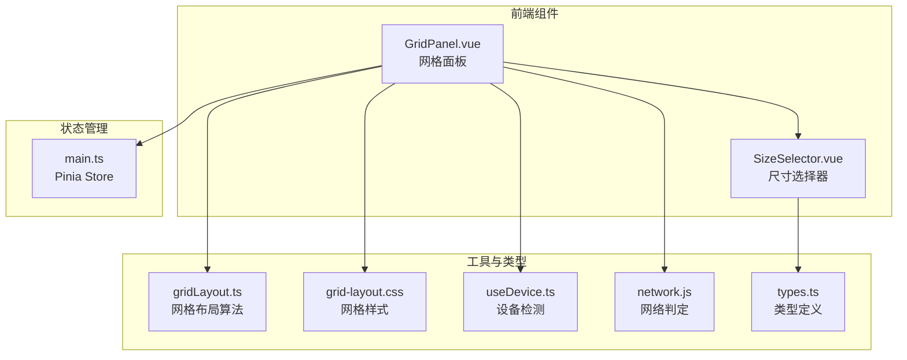
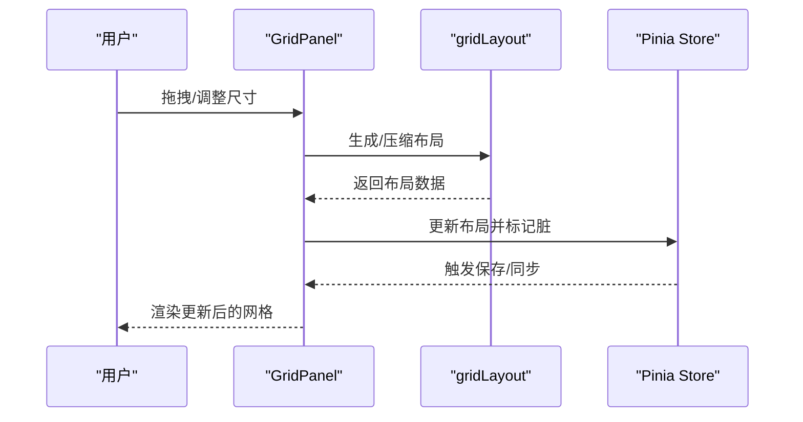
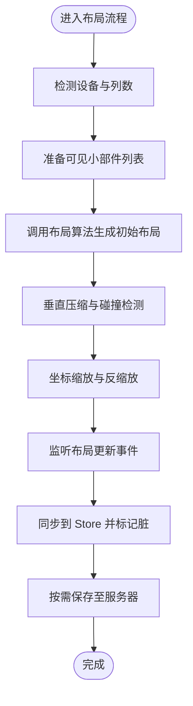
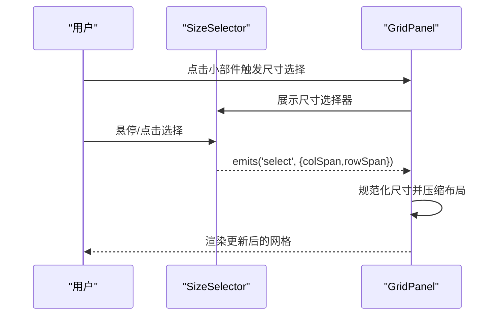
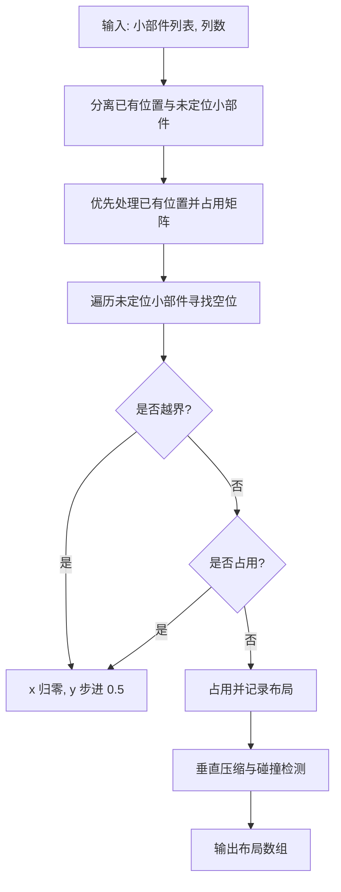
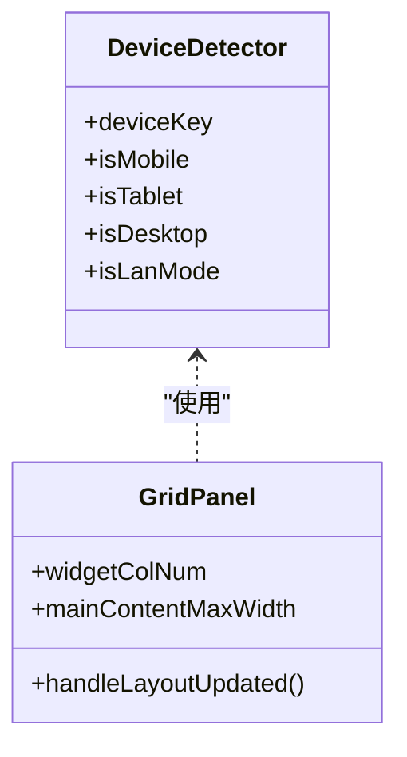
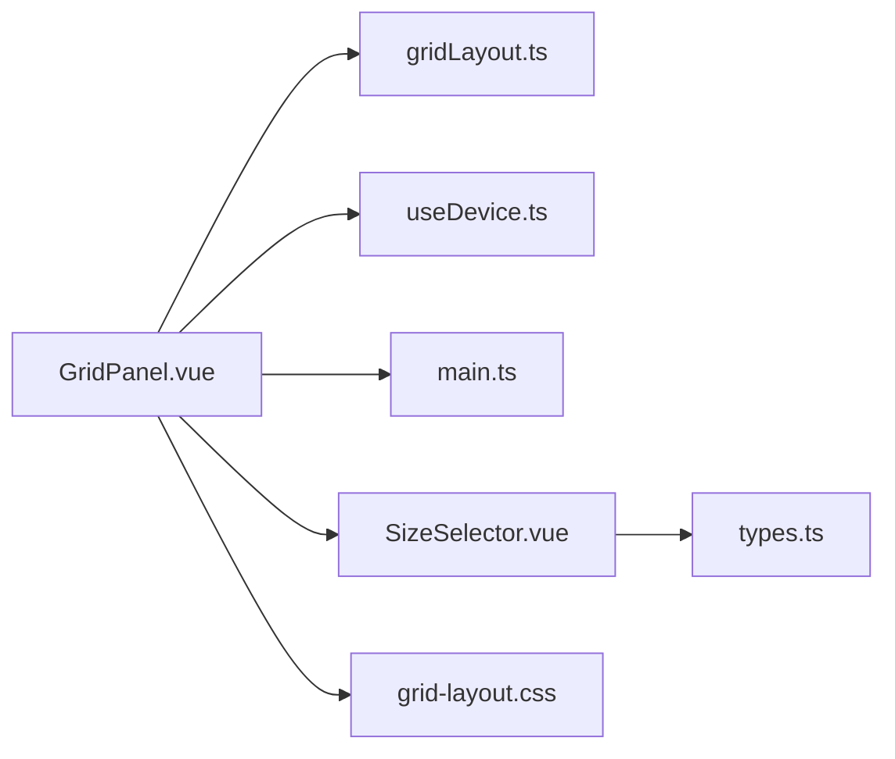

# 布局组件

<cite>
**本文档引用的文件**
- [GridPanel.vue](file://frontend/src/components/GridPanel.vue)
- [SizeSelector.vue](file://frontend/src/components/SizeSelector.vue)
- [gridLayout.ts](file://frontend/src/utils/gridLayout.ts)
- [grid-layout.css](file://frontend/src/assets/grid-layout.css)
- [useDevice.ts](file://frontend/src/composables/useDevice.ts)
- [network.js](file://frontend/src/utils/network.js)
- [main.ts](file://frontend/src/stores/main.ts)
- [types.ts](file://frontend/src/types.ts)
</cite>

## 目录
1. [简介](#简介)
2. [项目结构](#项目结构)
3. [核心组件](#核心组件)
4. [架构总览](#架构总览)
5. [详细组件分析](#详细组件分析)
6. [依赖关系分析](#依赖关系分析)
7. [性能考量](#性能考量)
8. [故障排查指南](#故障排查指南)
9. [结论](#结论)
10. [附录](#附录)

## 简介
本文件面向 OFlatNas 的布局系统，重点围绕网格面板与尺寸选择器两大布局相关组件进行深入解析。内容涵盖网格布局算法、拖拽重排机制、响应式适配策略、尺寸选择器交互逻辑、预设尺寸管理与动态调整、配置项与约束边界、性能优化与内存管理、以及可定制性与多设备兼容性。

## 项目结构
- 布局核心位于前端组件目录，网格面板负责整体布局渲染与交互，尺寸选择器提供可视化尺寸调整入口。
- 布局算法与数据结构位于工具模块，样式与交互状态由组件与样式表共同控制。
- 设备检测、网络判定与应用配置通过组合式函数与 Pinia Store 提供。

**图表来源**
- [GridPanel.vue:1-120](file://frontend/src/components/GridPanel.vue#L1-120)
- [SizeSelector.vue:1-99](file://frontend/src/components/SizeSelector.vue#L1-99)
- [gridLayout.ts:1-113](file://frontend/src/utils/gridLayout.ts#L1-113)
- [grid-layout.css:1-109](file://frontend/src/assets/grid-layout.css#L1-109)
- [useDevice.ts:1-72](file://frontend/src/composables/useDevice.ts#L1-72)
- [network.js:1-176](file://frontend/src/utils/network.js#L1-176)
- [main.ts:1-800](file://frontend/src/stores/main.ts#L1-800)
- [types.ts:1-298](file://frontend/src/types.ts#L1-298)

**章节来源**
- [GridPanel.vue:1-120](file://frontend/src/components/GridPanel.vue#L1-L120)
- [SizeSelector.vue:1-99](file://frontend/src/components/SizeSelector.vue#L1-L99)
- [gridLayout.ts:1-113](file://frontend/src/utils/gridLayout.ts#L1-L113)
- [grid-layout.css:1-109](file://frontend/src/assets/grid-layout.css#L1-L109)
- [useDevice.ts:1-72](file://frontend/src/composables/useDevice.ts#L1-L72)
- [network.js:1-176](file://frontend/src/utils/network.js#L1-L176)
- [main.ts:1-800](file://frontend/src/stores/main.ts#L1-L800)
- [types.ts:1-298](file://frontend/src/types.ts#L1-L298)

## 核心组件
- 网格面板（GridPanel）
  - 负责根据设备类型与列数生成网格布局，处理拖拽、缩放、尺寸选择、响应式切换与设备模式。
  - 通过 Pinia Store 管理布局数据与脏标记，支持编辑模式下的实时保存与冲突处理。
- 尺寸选择器（SizeSelector）
  - 提供可视化网格尺寸选择面板，支持悬停预览与点击确认，输出标准化的列/行跨度。
- 布局算法（gridLayout）
  - 实现基于 0.5 单位粒度的网格布局生成，支持已有位置保留、碰撞检测与垂直压缩。
- 响应式与设备检测（useDevice）
  - 基于窗口尺寸与 UA 识别设备类型，支持手动强制模式与横竖屏判断。
- 网络与适配（network）
  - 提供内网/外网/延迟判定逻辑，支撑卡片跳转与渲染策略。
- 状态与配置（main.ts, types.ts）
  - 定义应用配置、小部件布局数据结构与持久化策略，提供保存、冲突解决与资源版本管理。

**章节来源**
- [GridPanel.vue:800-1599](file://frontend/src/components/GridPanel.vue#L800-L1599)
- [SizeSelector.vue:1-99](file://frontend/src/components/SizeSelector.vue#L1-L99)
- [gridLayout.ts:11-113](file://frontend/src/utils/gridLayout.ts#L11-L113)
- [useDevice.ts:16-44](file://frontend/src/composables/useDevice.ts#L16-L44)
- [network.js:164-176](file://frontend/src/utils/network.js#L164-L176)
- [main.ts:579-799](file://frontend/src/stores/main.ts#L579-L799)
- [types.ts:202-224](file://frontend/src/types.ts#L202-L224)

## 架构总览
网格系统采用“组件驱动 + 算法工具 + 状态管理”的分层设计：
- 组件层：GridPanel 负责布局渲染、交互事件与子组件调度；SizeSelector 提供尺寸选择 UI。
- 工具层：gridLayout 提供布局生成与压缩算法；useDevice 提供设备检测；network 提供网络判定。
- 状态层：main.ts 的 Pinia Store 统一管理布局数据、应用配置与持久化。

**图表来源**
- [GridPanel.vue:800-956](file://frontend/src/components/GridPanel.vue#L800-L956)
- [gridLayout.ts:11-113](file://frontend/src/utils/gridLayout.ts#L11-L113)
- [main.ts:2428-2517](file://frontend/src/stores/main.ts#L2428-L2517)

## 详细组件分析

### 网格面板（GridPanel）
- 布局生成与压缩
  - 依据设备类型与列数计算网格列数与行高，使用 0.5 单位粒度进行布局生成与垂直压缩，确保紧凑排列与边界安全。
  - 对已有位置的小部件进行优先保留，避免重排导致的视觉跳变。
- 拖拽与重排
  - 在编辑模式下启用拖拽，使用缩放坐标系统（乘以 2）与反缩放逻辑，保证布局精度与一致性。
  - 通过 setter 监听布局更新，自动同步到 Store，并在桌面模式下同步顶层属性。
- 尺寸选择器集成
  - 通过点击小部件触发尺寸选择器，限制最大尺寸并进行规范化，随后手动触发压缩与同步。
- 响应式与设备模式
  - 基于 useDevice 的设备键与列数计算，结合窗口尺寸变化触发重新布局与组件强制卸载/挂载，修复窄屏切换回宽屏时的错乱问题。
- 编辑模式与保存
  - 编辑模式下暂停轮询与外部更新，避免服务端推送导致的布局回弹；保存时进行签名比对，仅在变更时写入。

**图表来源**
- [GridPanel.vue:806-894](file://frontend/src/components/GridPanel.vue#L806-L894)
- [GridPanel.vue:896-956](file://frontend/src/components/GridPanel.vue#L896-L956)
- [gridLayout.ts:11-113](file://frontend/src/utils/gridLayout.ts#L11-L113)

**章节来源**
- [GridPanel.vue:806-956](file://frontend/src/components/GridPanel.vue#L806-L956)
- [GridPanel.vue:958-1042](file://frontend/src/components/GridPanel.vue#L958-L1042)
- [GridPanel.vue:1056-1152](file://frontend/src/components/GridPanel.vue#L1056-L1152)
- [GridPanel.vue:1600-2399](file://frontend/src/components/GridPanel.vue#L1600-L2399)
- [GridPanel.vue:2400-3199](file://frontend/src/components/GridPanel.vue#L2400-L3199)

### 尺寸选择器（SizeSelector）
- 交互逻辑
  - 提供 8x8 网格的可视化尺寸预览，悬停时高亮显示目标尺寸，点击确认后发出选择事件。
  - 支持当前尺寸显示与格式化展示（整数或一位小数）。
- 预设尺寸管理
  - 尺寸以 0.5 为步进，最多 4 列与 4 行，超出部分进行规范化处理。
- 动态调整
  - 接收当前列/行跨度作为输入，输出标准化的 colSpan/rowSpan，配合网格面板的压缩与同步逻辑实现即时生效。

**图表来源**
- [SizeSelector.vue:1-99](file://frontend/src/components/SizeSelector.vue#L1-L99)
- [GridPanel.vue:1096-1117](file://frontend/src/components/GridPanel.vue#L1096-L1117)

**章节来源**
- [SizeSelector.vue:1-99](file://frontend/src/components/SizeSelector.vue#L1-L99)
- [GridPanel.vue:1096-1117](file://frontend/src/components/GridPanel.vue#L1096-L1117)

### 布局算法（gridLayout）
- 数据结构
  - GridLayoutItem 扩展 WidgetConfig，包含唯一标识与 x/y/w/h 坐标。
- 算法要点
  - 使用 0.5 单位粒度与缩放因子 2，保证半格精度；矩阵占用标记避免碰撞。
  - 先处理已有位置的小部件，再为未定位小部件寻找空位；在列数不足时进行安全检查与降级。
  - 垂直压缩阶段通过步进检查与候选位置推进，确保尽可能紧凑排列。
- 复杂度
  - 时间复杂度近似 O(N·C·R)，其中 N 为小部件数量，C/R 为列/行搜索范围；空间复杂度 O(C·R) 用于占用矩阵。

**图表来源**
- [gridLayout.ts:11-113](file://frontend/src/utils/gridLayout.ts#L11-L113)

**章节来源**
- [gridLayout.ts:3-9](file://frontend/src/utils/gridLayout.ts#L3-L9)
- [gridLayout.ts:11-113](file://frontend/src/utils/gridLayout.ts#L11-L113)

### 响应式与设备适配
- 设备检测
  - 基于窗口尺寸与 UA 识别移动/平板/桌面；支持手动强制模式与横竖屏判断。
- 列数与最大宽度
  - 桌面端列数可扩展，默认列数与最大列数受配置约束；主内容最大宽度随列数与窗口宽度动态计算。
- 窗口尺寸变化
  - 监听窗口尺寸变化，触发网格重排与组件强制卸载/挂载，修复布局错乱问题。

**图表来源**
- [useDevice.ts:16-44](file://frontend/src/composables/useDevice.ts#L16-L44)
- [GridPanel.vue:696-729](file://frontend/src/components/GridPanel.vue#L696-L729)

**章节来源**
- [useDevice.ts:1-72](file://frontend/src/composables/useDevice.ts#L1-L72)
- [GridPanel.vue:696-729](file://frontend/src/components/GridPanel.vue#L696-L729)
- [GridPanel.vue:806-894](file://frontend/src/components/GridPanel.vue#L806-L894)

### 网络与跳转适配
- 网络判定
  - 支持自动/内网/外网/延迟四种模式，结合域名规则与延迟阈值动态切换。
- 跳转策略
  - 登录状态下优先使用内网链接，否则回退到外网链接；支持 Luck STUN 端口替换与卡片点击拦截。

**章节来源**
- [network.js:164-176](file://frontend/src/utils/network.js#L164-L176)
- [GridPanel.vue:1488-1543](file://frontend/src/components/GridPanel.vue#L1488-L1543)

## 依赖关系分析
- 组件耦合
  - GridPanel 依赖 gridLayout 算法、设备检测与 Store；SizeSelector 依赖 GridPanel 的尺寸选择回调。
- 外部依赖
  - 使用 VueDraggable、grid-layout-plus 等第三方库实现拖拽与网格渲染。
- 状态一致性
  - 通过 Store 的脏标记与签名比对，避免重复保存与竞态冲突。

**图表来源**
- [GridPanel.vue:1-120](file://frontend/src/components/GridPanel.vue#L1-L120)
- [SizeSelector.vue:1-99](file://frontend/src/components/SizeSelector.vue#L1-L99)
- [gridLayout.ts:1-113](file://frontend/src/utils/gridLayout.ts#L1-L113)
- [useDevice.ts:1-72](file://frontend/src/composables/useDevice.ts#L1-L72)
- [main.ts:1-800](file://frontend/src/stores/main.ts#L1-L800)
- [types.ts:1-298](file://frontend/src/types.ts#L1-L298)

**章节来源**
- [GridPanel.vue:1-120](file://frontend/src/components/GridPanel.vue#L1-L120)
- [SizeSelector.vue:1-99](file://frontend/src/components/SizeSelector.vue#L1-L99)
- [gridLayout.ts:1-113](file://frontend/src/utils/gridLayout.ts#L1-L113)
- [useDevice.ts:1-72](file://frontend/src/composables/useDevice.ts#L1-L72)
- [main.ts:1-800](file://frontend/src/stores/main.ts#L1-L800)
- [types.ts:1-298](file://frontend/src/types.ts#L1-L298)

## 性能考量
- 布局算法
  - 采用 0.5 单位粒度与矩阵占用标记，时间复杂度可控；垂直压缩阶段通过步进搜索减少无效尝试。
- 渲染策略
  - 使用 CSS Transform 与 will-change 提升动画性能；网格容器过渡与平滑尺寸动画减少重排。
- 内存管理
  - 编辑模式下避免不必要的组件重挂载；尺寸选择器与天气效果按需初始化/销毁，及时释放资源。
- 保存与同步
  - 脏标记与签名比对避免重复保存；编辑模式暂停轮询，降低网络与渲染压力。

**章节来源**
- [grid-layout.css:45-58](file://frontend/src/assets/grid-layout.css#L45-L58)
- [GridPanel.vue:318-377](file://frontend/src/components/GridPanel.vue#L318-L377)
- [GridPanel.vue:1446-1482](file://frontend/src/components/GridPanel.vue#L1446-L1482)

## 故障排查指南
- 布局错乱或重排异常
  - 检查设备列数变化与强制卸载/挂载逻辑；确认窗口尺寸变化监听是否生效。
- 拖拽冲突或保存失败
  - 确认编辑模式状态与布局更新事件是否正确同步；查看签名比对与脏标记逻辑。
- 尺寸选择无效
  - 检查尺寸规范化与最大尺寸限制；确认压缩与同步流程是否执行。
- 网络跳转异常
  - 核对网络模式配置与域名规则；验证延迟判定与 Luck STUN 端口替换逻辑。

**章节来源**
- [GridPanel.vue:806-894](file://frontend/src/components/GridPanel.vue#L806-L894)
- [GridPanel.vue:896-956](file://frontend/src/components/GridPanel.vue#L896-L956)
- [GridPanel.vue:1096-1117](file://frontend/src/components/GridPanel.vue#L1096-L1117)
- [network.js:164-176](file://frontend/src/utils/network.js#L164-L176)

## 结论
OFlatNas 的布局系统通过清晰的分层设计与高效的算法实现，提供了稳定、可定制且高性能的网格布局体验。网格面板与尺寸选择器协同工作，结合设备检测与网络适配，实现了跨设备的一致性与易用性。通过脏标记、签名比对与保存节流等机制，系统在保证数据一致性的同时有效降低了性能开销。

## 附录
- 配置选项与约束
  - 列数与行数约束：0.5–16（桌面扩展可达 8–16）。
  - 最大宽度：随列数与窗口宽度动态计算，桌面端不超过窗口的 89%。
  - 设备模式：支持自动、桌面、平板、移动与强制模式。
- 边界处理
  - 尺寸规范化与最大值限制；布局生成时的安全检查与降级策略。
- 主题与多设备兼容
  - 通过 CSS 变量与条件样式支持主题切换；移动端与桌面端差异化渲染策略。

**章节来源**
- [GridPanel.vue:696-729](file://frontend/src/components/GridPanel.vue#L696-L729)
- [GridPanel.vue:1096-1117](file://frontend/src/components/GridPanel.vue#L1096-L1117)
- [main.ts:2227-2240](file://frontend/src/stores/main.ts#L2227-L2240)
- [types.ts:86-189](file://frontend/src/types.ts#L86-L189)