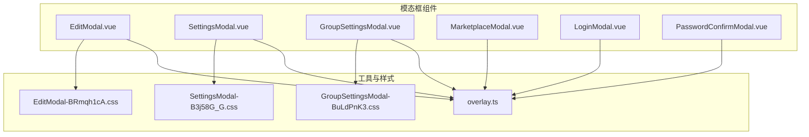
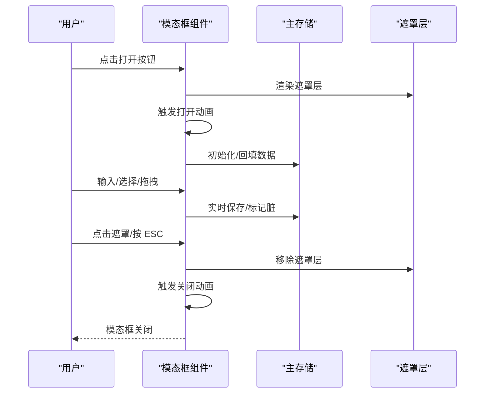
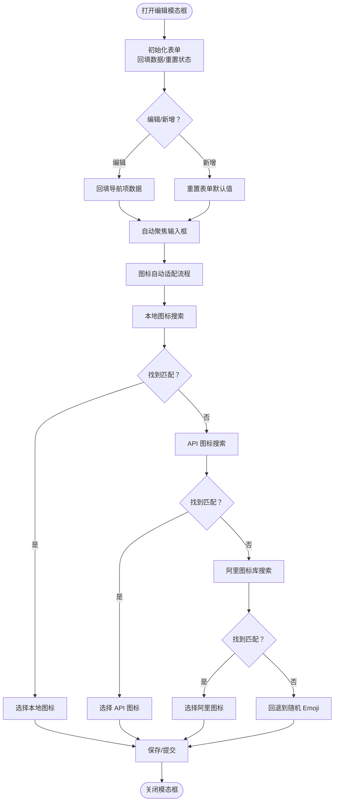
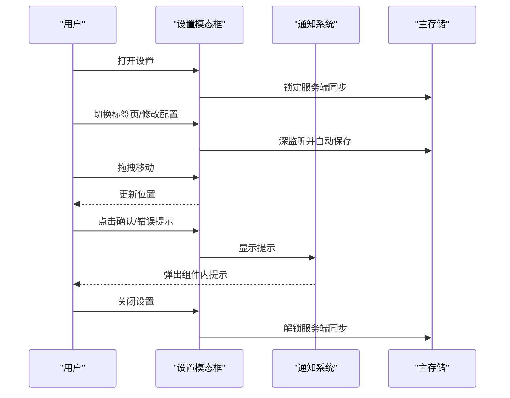
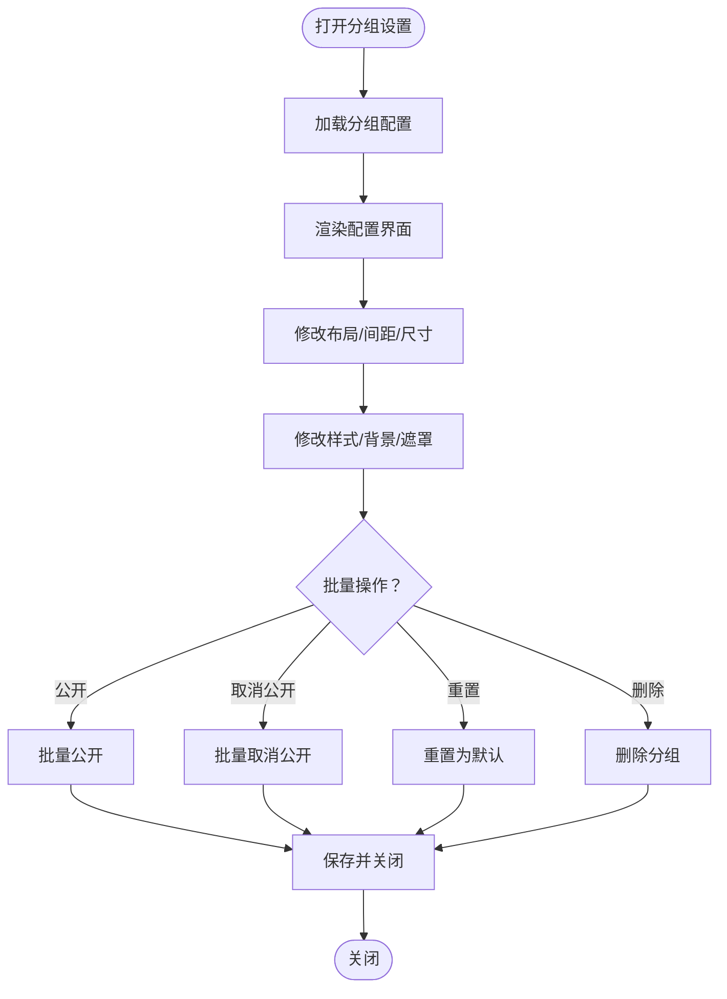
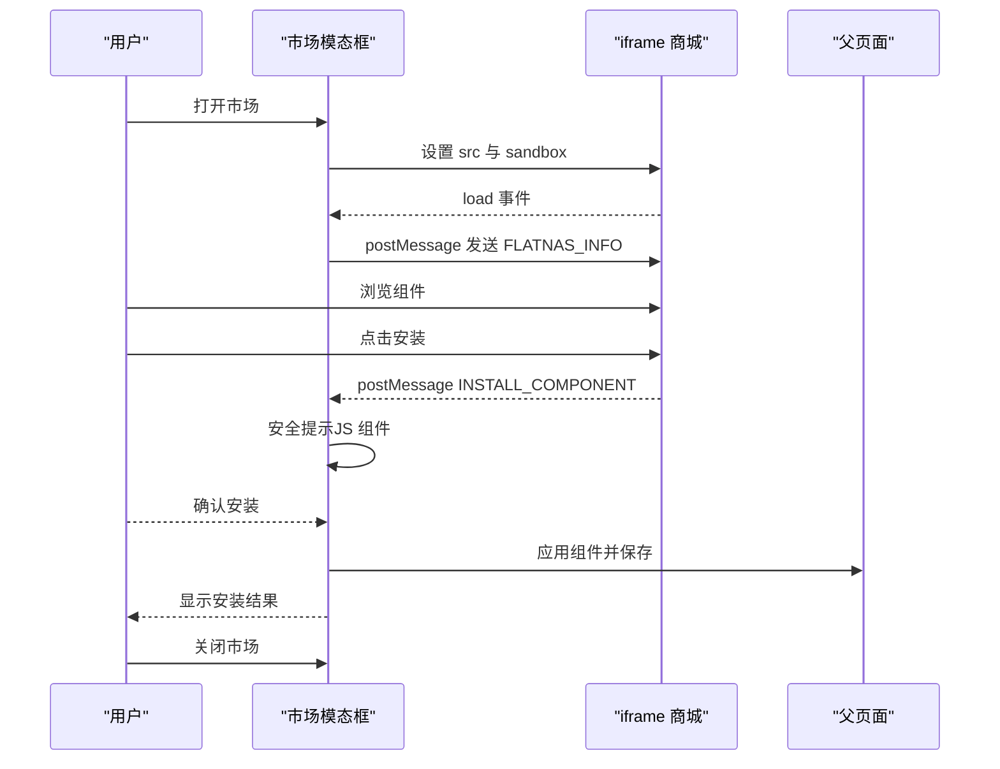
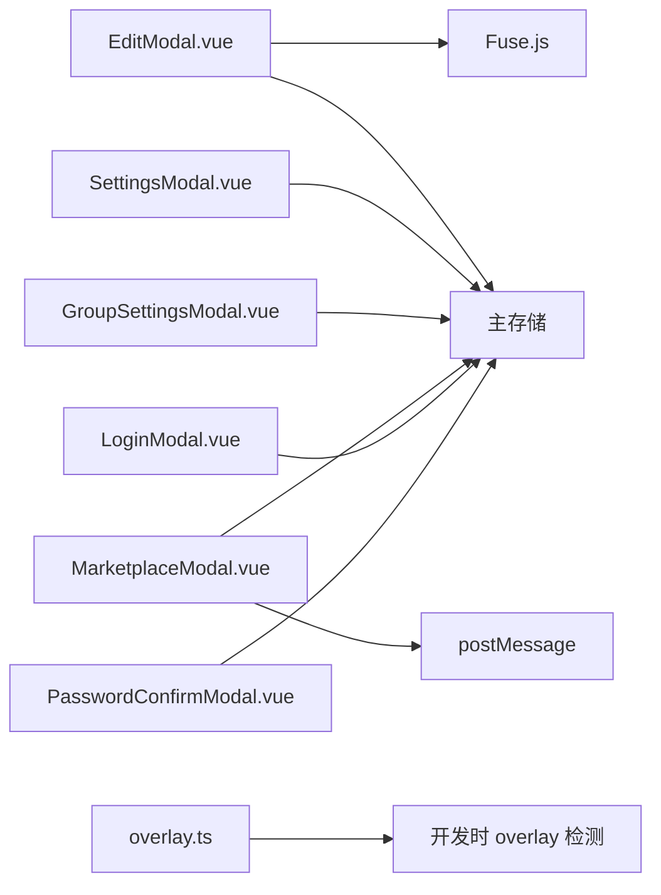

# 模态对话框

<cite>
**本文档引用的文件**
- [EditModal.vue](file://frontend/src/components/EditModal.vue)
- [SettingsModal.vue](file://frontend/src/components/SettingsModal.vue)
- [GroupSettingsModal.vue](file://frontend/src/components/GroupSettingsModal.vue)
- [MarketplaceModal.vue](file://frontend/src/components/MarketplaceModal.vue)
- [LoginModal.vue](file://frontend/src/components/LoginModal.vue)
- [PasswordConfirmModal.vue](file://frontend/src/components/PasswordConfirmModal.vue)
- [overlay.ts](file://frontend/src/utils/overlay.ts)
- [EditModal-BRmqh1cA.css](file://debian/server/public/assets/EditModal-BRmqh1cA.css)
- [SettingsModal-B3j58G_G.css](file://debian/server/public/assets/SettingsModal-B3j58G_G.css)
- [GroupSettingsModal-BuLdPnK3.css](file://debian/server/public/assets/GroupSettingsModal-BuLdPnK3.css)
</cite>

## 目录
1. [简介](#简介)
2. [项目结构](#项目结构)
3. [核心组件](#核心组件)
4. [架构总览](#架构总览)
5. [详细组件分析](#详细组件分析)
6. [依赖关系分析](#依赖关系分析)
7. [性能考虑](#性能考虑)
8. [故障排除指南](#故障排除指南)
9. [结论](#结论)

## 简介
本文件系统化梳理 OFlatNas 前端中的模态对话框组件，涵盖编辑模态框、设置模态框、分组设置模态框、市场模态框、登录模态框与密码确认模态框。文档重点阐述以下方面：
- 打开/关闭逻辑与遮罩层处理
- 焦点管理与键盘事件
- 层级管理与 ESC 关闭机制
- 动画与过渡效果
- 响应式设计与移动端适配
- 可访问性与屏幕阅读器支持
- 与 Store 的集成与数据持久化

## 项目结构
模态框组件位于前端组件目录，采用独立的 Vue 单文件组件组织，每个模态框负责特定业务场景：
- 编辑模态框：用于新增/编辑导航项，包含图标选择、备份地址、描述等复杂表单
- 设置模态框：系统级设置入口，支持拖拽、多标签页、大量配置项
- 分组设置模态框：针对分组的样式与布局定制
- 市场模态框：组件商城，基于 iframe 嵌入第三方页面并通过 postMessage 通信
- 登录模态框：用户认证入口
- 密码确认模态框：敏感操作二次确认

**图表来源**
- [EditModal.vue](file://frontend/src/components/EditModal.vue)
- [SettingsModal.vue](file://frontend/src/components/SettingsModal.vue)
- [GroupSettingsModal.vue](file://frontend/src/components/GroupSettingsModal.vue)
- [MarketplaceModal.vue](file://frontend/src/components/MarketplaceModal.vue)
- [LoginModal.vue](file://frontend/src/components/LoginModal.vue)
- [PasswordConfirmModal.vue](file://frontend/src/components/PasswordConfirmModal.vue)
- [overlay.ts](file://frontend/src/utils/overlay.ts)
- [EditModal-BRmqh1cA.css](file://debian/server/public/assets/EditModal-BRmqh1cA.css)
- [SettingsModal-B3j58G_G.css](file://debian/server/public/assets/SettingsModal-B3j58G_G.css)
- [GroupSettingsModal-BuLdPnK3.css](file://debian/server/public/assets/GroupSettingsModal-BuLdPnK3.css)

**章节来源**
- [EditModal.vue](file://frontend/src/components/EditModal.vue)
- [SettingsModal.vue](file://frontend/src/components/SettingsModal.vue)
- [GroupSettingsModal.vue](file://frontend/src/components/GroupSettingsModal.vue)
- [MarketplaceModal.vue](file://frontend/src/components/MarketplaceModal.vue)
- [LoginModal.vue](file://frontend/src/components/LoginModal.vue)
- [PasswordConfirmModal.vue](file://frontend/src/components/PasswordConfirmModal.vue)
- [overlay.ts](file://frontend/src/utils/overlay.ts)

## 核心组件
本节概述各模态框的核心职责与关键特性。

- 编辑模态框（EditModal）
  - 支持新增/编辑导航项，包含图标选择（Emoji/图片）、备份地址、描述、颜色与背景等
  - 内置图标搜索与自动适配逻辑，支持本地图标、Simple Icons、阿里图标库
  - 表单联动与自动高度调整，支持多行描述合并展示
  - 与主存储交互，保存数据并触发全局保存

- 设置模态框（SettingsModal）
  - 系统级设置入口，支持拖拽移动、多标签页导航、网络规则、壁纸、音乐、天气等配置
  - 内置通知系统替代原生 confirm/alert
  - 与 Store 的自动保存机制集成，实时持久化配置

- 分组设置模态框（GroupSettingsModal）
  - 针对分组的样式与布局定制，包括卡片布局、间距、尺寸、图标形状、背景图与遮罩等
  - 支持批量公开/取消公开、重置为全局默认等操作

- 市场模态框（MarketplaceModal）
  - 组件商城，通过 iframe 嵌入外部站点，支持 HTTPS 升级与混合内容处理
  - 基于 postMessage 与外部站点握手，安装组件时进行安全提示与确认

- 登录模态框（LoginModal）
  - 用户认证入口，支持单用户/多用户模式
  - 自动聚焦与键盘事件处理，提交后关闭模态框

- 密码确认模态框（PasswordConfirmModal）
  - 敏感操作二次确认，输入密码后调用回调并关闭

**章节来源**
- [EditModal.vue](file://frontend/src/components/EditModal.vue)
- [SettingsModal.vue](file://frontend/src/components/SettingsModal.vue)
- [GroupSettingsModal.vue](file://frontend/src/components/GroupSettingsModal.vue)
- [MarketplaceModal.vue](file://frontend/src/components/MarketplaceModal.vue)
- [LoginModal.vue](file://frontend/src/components/LoginModal.vue)
- [PasswordConfirmModal.vue](file://frontend/src/components/PasswordConfirmModal.vue)

## 架构总览
模态框组件遵循统一的“显示/隐藏 + 遮罩层 + 动画过渡”的交互模式，通过 v-if 控制渲染，点击遮罩层或按 ESC 关闭。部分模态框引入拖拽、通知系统与 postMessage 通信。

**图表来源**
- [EditModal.vue](file://frontend/src/components/EditModal.vue)
- [SettingsModal.vue](file://frontend/src/components/SettingsModal.vue)
- [GroupSettingsModal.vue](file://frontend/src/components/GroupSettingsModal.vue)
- [MarketplaceModal.vue](file://frontend/src/components/MarketplaceModal.vue)
- [LoginModal.vue](file://frontend/src/components/LoginModal.vue)
- [PasswordConfirmModal.vue](file://frontend/src/components/PasswordConfirmModal.vue)

## 详细组件分析

### 编辑模态框（EditModal）
- 打开/关闭逻辑
  - 通过 props.show 控制显示，监听该值变化以初始化表单或重置状态
  - 关闭时通过 emit("update:show", false) 通知父组件
- 遮罩层与焦点管理
  - 遮罩层使用 fixed 布局与 z-index 管理层级，点击遮罩层区域触发关闭
  - 打开时自动聚焦相关输入框，提升键盘可达性
- 表单与图标系统
  - 支持 Emoji 与图片两种图标模式，内置随机选择与自动适配逻辑
  - 图标搜索支持三阶段：本地 → API（Simple Icons）→ 阿里图标库，失败时回退到随机 Emoji
  - 描述字段支持三行合并展示，自动调整文本域高度
- 保存与验证
  - 通过 onSave 回调传递保存 payload，内部使用 store.saveData() 持久化
  - URL 格式校验与错误处理

**图表来源**
- [EditModal.vue](file://frontend/src/components/EditModal.vue)

**章节来源**
- [EditModal.vue](file://frontend/src/components/EditModal.vue)

### 设置模态框（SettingsModal）
- 打开/关闭与拖拽
  - 通过 props.show 控制显示，支持拖拽移动（mousedown/mousemove/mouseup）
  - 拖拽区域限定在导航栏区域，避免误触交互元素
- 通知系统
  - 替代原生 confirm/alert，使用组件内 notice 状态管理提示类型（确认/成功/错误）
- 多标签页与配置项
  - 支持多个配置标签页，包含网络规则、壁纸、音乐、天气等
  - 与 Store 的自动保存机制集成，深监听配置变更并持久化
- 安全与兼容
  - 市场链接 HTTPS 升级与混合内容提示，避免浏览器拦截

**图表来源**
- [SettingsModal.vue](file://frontend/src/components/SettingsModal.vue)

**章节来源**
- [SettingsModal.vue](file://frontend/src/components/SettingsModal.vue)

### 分组设置模态框（GroupSettingsModal）
- 分组专属配置
  - 卡片布局（垂直/水平）、网格间距、卡片尺寸、图标尺寸
  - 卡片背景色、透明度、背景图与遮罩浓度
  - 图标形状选择与预览
- 批量操作
  - 批量公开/取消公开、重置为全局默认、删除分组

**图表来源**
- [GroupSettingsModal.vue](file://frontend/src/components/GroupSettingsModal.vue)

**章节来源**
- [GroupSettingsModal.vue](file://frontend/src/components/GroupSettingsModal.vue)

### 市场模态框（MarketplaceModal）
- 嵌入式商城
  - 通过 iframe 嵌入外部组件商城，支持 HTTPS 升级与混合内容提示
  - 使用 postMessage 与外部站点握手，传递版本信息与 API 基础路径
- 安全提示与安装流程
  - 对包含自定义 JS 的组件进行安全提示，用户确认后方可安装
  - 安装成功/失败通过组件内通知展示

**图表来源**
- [MarketplaceModal.vue](file://frontend/src/components/MarketplaceModal.vue)

**章节来源**
- [MarketplaceModal.vue](file://frontend/src/components/MarketplaceModal.vue)

### 登录模态框（LoginModal）
- 认证流程
  - 支持单用户/多用户模式，自动聚焦用户名或密码输入框
  - 提交后调用 store.login/register，成功则关闭模态框
- 键盘事件
  - 支持 Enter 键快速提交

**章节来源**
- [LoginModal.vue](file://frontend/src/components/LoginModal.vue)

### 密码确认模态框（PasswordConfirmModal）
- 二次确认
  - 输入密码后调用回调 onSuccess，成功后关闭
- 错误处理
  - 密码错误时显示错误信息并重新聚焦

**章节来源**
- [PasswordConfirmModal.vue](file://frontend/src/components/PasswordConfirmModal.vue)

## 依赖关系分析
- 组件间耦合
  - 各模态框相对独立，通过 props.show 控制显示，emit 事件与父组件通信
  - SettingsModal 与 Store 耦合较深，承担大量配置持久化逻辑
- 外部依赖
  - EditModal 依赖 Fuse.js 进行本地搜索与 API 搜索
  - MarketplaceModal 依赖 postMessage 与外部站点通信
  - overlay.ts 提供开发时 Vite overlay 的可见性检测与等待

**图表来源**
- [EditModal.vue](file://frontend/src/components/EditModal.vue)
- [SettingsModal.vue](file://frontend/src/components/SettingsModal.vue)
- [GroupSettingsModal.vue](file://frontend/src/components/GroupSettingsModal.vue)
- [MarketplaceModal.vue](file://frontend/src/components/MarketplaceModal.vue)
- [LoginModal.vue](file://frontend/src/components/LoginModal.vue)
- [PasswordConfirmModal.vue](file://frontend/src/components/PasswordConfirmModal.vue)
- [overlay.ts](file://frontend/src/utils/overlay.ts)

**章节来源**
- [EditModal.vue](file://frontend/src/components/EditModal.vue)
- [SettingsModal.vue](file://frontend/src/components/SettingsModal.vue)
- [GroupSettingsModal.vue](file://frontend/src/components/GroupSettingsModal.vue)
- [MarketplaceModal.vue](file://frontend/src/components/MarketplaceModal.vue)
- [LoginModal.vue](file://frontend/src/components/LoginModal.vue)
- [PasswordConfirmModal.vue](file://frontend/src/components/PasswordConfirmModal.vue)
- [overlay.ts](file://frontend/src/utils/overlay.ts)

## 性能考虑
- 渲染与动画
  - 使用 v-if 控制模态框渲染，避免不必要的 DOM 开销
  - CSS 动画采用 transform/opacity，尽量减少重排重绘
- 搜索与网络请求
  - EditModal 的图标搜索使用 Fuse.js 本地索引，减少网络依赖
  - MarketplaceModal 在 HTTPS 环境下尝试升级 iframe 协议，避免混合内容导致的白屏
- 存储与同步
  - SettingsModal 通过深监听自动保存，避免频繁手动保存带来的交互成本

[本节为通用指导，无需具体文件分析]

## 故障排除指南
- 模态框无法关闭
  - 检查 props.show 是否正确传递，确认遮罩层点击事件与 ESC 键绑定
  - 确认组件未被其他元素阻止事件冒泡
- 图标搜索失败
  - 确认网络连通性，检查本地图标接口与 API 代理是否正常
  - 查看控制台错误与告警信息，必要时回退到随机 Emoji
- 市场模态框空白
  - 检查 iframe 协议与混合内容策略，尝试在新窗口打开
  - 确认 postMessage 通信是否成功，外部站点是否返回 INSTALL_COMPONENT
- 开发时 overlay 干扰
  - 使用 overlay.ts 提供的工具方法检测 overlay 出现与消失，避免长时间阻塞

**章节来源**
- [overlay.ts](file://frontend/src/utils/overlay.ts)

## 结论
OFlatNas 的模态框组件在功能完整性、交互体验与可维护性方面表现良好。编辑与设置模态框承担了复杂的业务逻辑，分组设置与市场模态框提供了精细化的定制能力。通过统一的遮罩层、动画与键盘事件处理，以及与 Store 的深度集成，整体用户体验流畅稳定。建议后续持续优化网络请求失败回退策略与移动端交互细节，进一步提升可访问性与性能表现。