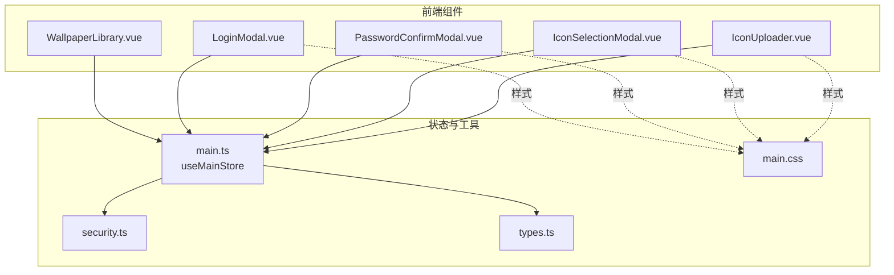
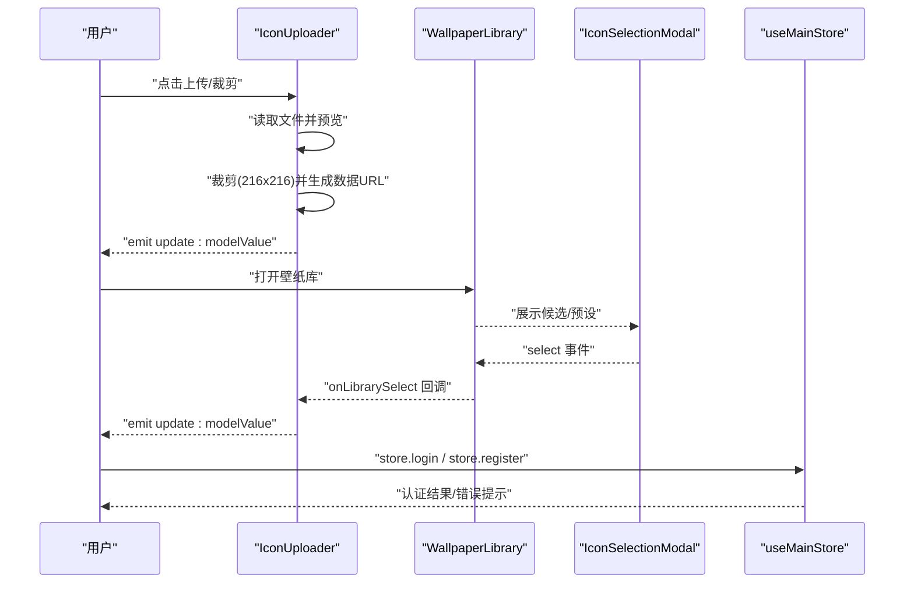
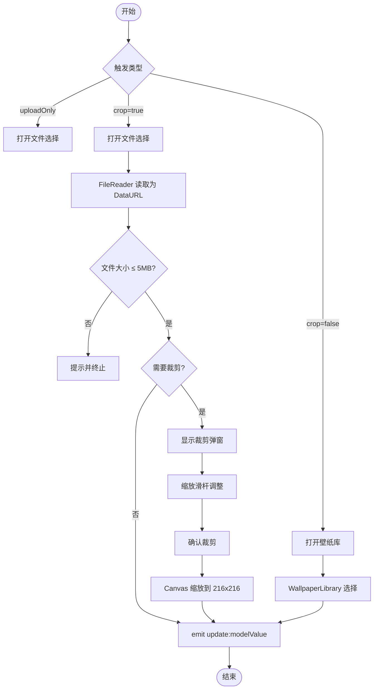
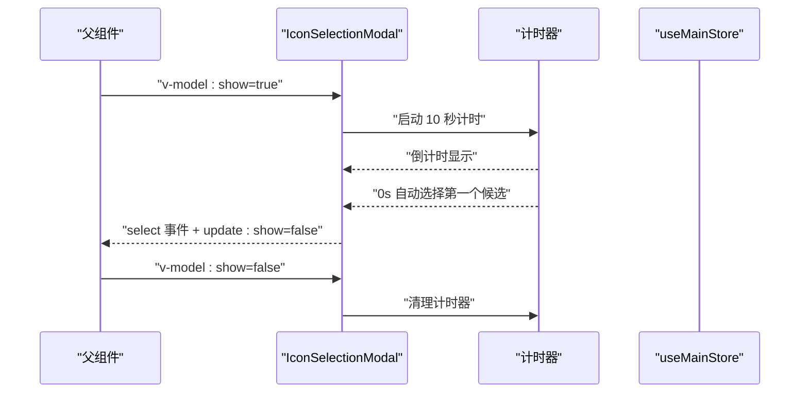
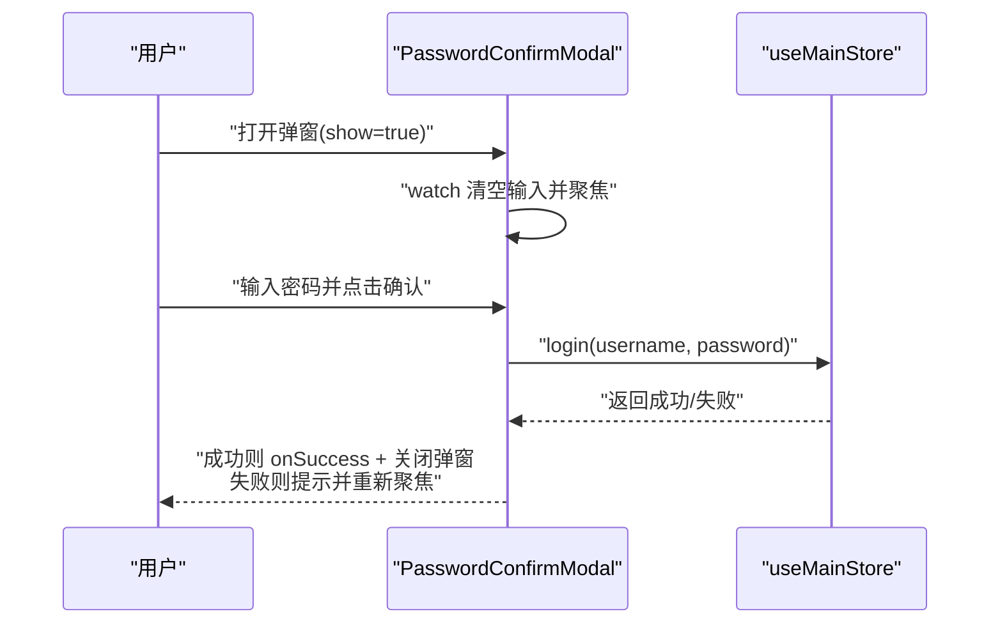
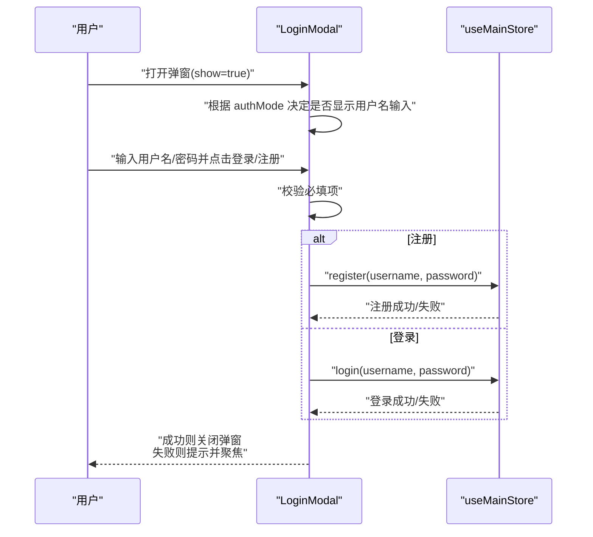
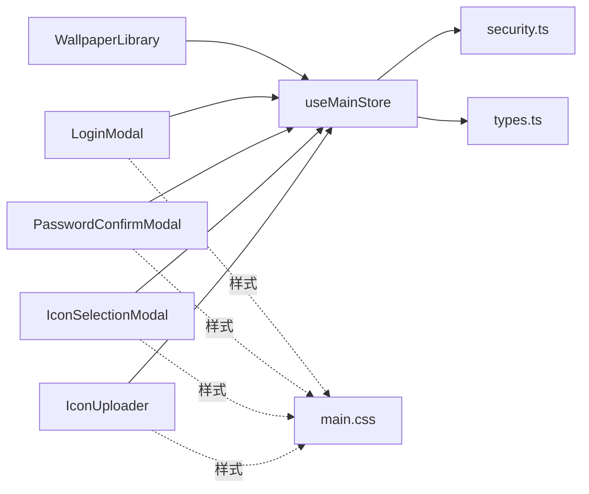

# 表单组件

<cite>
**本文引用的文件**
- [IconUploader.vue](file://frontend/src/components/IconUploader.vue)
- [IconSelectionModal.vue](file://frontend/src/components/IconSelectionModal.vue)
- [PasswordConfirmModal.vue](file://frontend/src/components/PasswordConfirmModal.vue)
- [LoginModal.vue](file://frontend/src/components/LoginModal.vue)
- [WallpaperLibrary.vue](file://frontend/src/components/WallpaperLibrary.vue)
- [main.ts](file://frontend/src/stores/main.ts)
- [security.ts](file://frontend/src/utils/security.ts)
- [main.css](file://frontend/src/assets/main.css)
- [types.ts](file://frontend/src/types.ts)
- [App.vue](file://frontend/src/App.vue)
</cite>

## 目录
1. [简介](#简介)
2. [项目结构](#项目结构)
3. [核心组件](#核心组件)
4. [架构总览](#架构总览)
5. [组件详解](#组件详解)
6. [依赖关系分析](#依赖关系分析)
7. [性能考量](#性能考量)
8. [故障排查指南](#故障排查指南)
9. [结论](#结论)
10. [附录](#附录)

## 简介
本文件面向 OFlatNas 的表单组件，重点覆盖以下功能模块：
- 图标上传器：支持本地文件选择、图片裁剪（216×216）、预览叠加层与样式透传、库内选择联动。
- 图标选择器：提供本地与网络图标候选集，支持自动选择计时器、分页加载与预设推荐。
- 密码确认弹窗：在关键操作前进行二次密码校验，调用主存储的登录接口进行认证。
- 登录模态框：支持单用户与多用户两种认证模式，动态聚焦与输入校验，注册/登录切换。

文档将从架构、数据流、处理逻辑、错误处理、可访问性与可定制性等方面进行系统化说明，并给出可视化图示与最佳实践建议。

## 项目结构
- 组件集中于 frontend/src/components，围绕“表单与交互”主题的组件包括：IconUploader、IconSelectionModal、PasswordConfirmModal、LoginModal、WallpaperLibrary。
- 主状态管理位于 frontend/src/stores/main.ts，提供认证、系统配置、资源版本控制与网络心跳等能力。
- 工具函数 frontend/src/utils/security.ts 提供内部域名白名单与安全 URL 处理。
- 样式 frontend/src/assets/main.css 提供通用滚动条与表单面板变量样式。
- 类型定义 frontend/src/types.ts 描述系统配置、应用配置与壁纸配置等数据模型。

图表来源
- [IconUploader.vue:1-209](file://frontend/src/components/IconUploader.vue#L1-L209)
- [IconSelectionModal.vue:1-195](file://frontend/src/components/IconSelectionModal.vue#L1-L195)
- [PasswordConfirmModal.vue:1-94](file://frontend/src/components/PasswordConfirmModal.vue#L1-L94)
- [LoginModal.vue:1-143](file://frontend/src/components/LoginModal.vue#L1-L143)
- [WallpaperLibrary.vue:1-1276](file://frontend/src/components/WallpaperLibrary.vue#L1-L1276)
- [main.ts:1-2517](file://frontend/src/stores/main.ts#L1-L2517)
- [security.ts:1-52](file://frontend/src/utils/security.ts#L1-L52)
- [main.css:1-132](file://frontend/src/assets/main.css#L1-L132)
- [types.ts:1-298](file://frontend/src/types.ts#L1-L298)

章节来源
- [IconUploader.vue:1-209](file://frontend/src/components/IconUploader.vue#L1-L209)
- [IconSelectionModal.vue:1-195](file://frontend/src/components/IconSelectionModal.vue#L1-L195)
- [PasswordConfirmModal.vue:1-94](file://frontend/src/components/PasswordConfirmModal.vue#L1-L94)
- [LoginModal.vue:1-143](file://frontend/src/components/LoginModal.vue#L1-L143)
- [WallpaperLibrary.vue:1-1276](file://frontend/src/components/WallpaperLibrary.vue#L1-L1276)
- [main.ts:1-2517](file://frontend/src/stores/main.ts#L1-L2517)
- [security.ts:1-52](file://frontend/src/utils/security.ts#L1-L52)
- [main.css:1-132](file://frontend/src/assets/main.css#L1-L132)
- [types.ts:1-298](file://frontend/src/types.ts#L1-L298)

## 核心组件
- 图标上传器（IconUploader）
  - 功能：本地文件选择、可选裁剪（固定比例 1:1，输出 216×216）、预览叠加层与样式透传、库内选择联动。
  - 关键点：触发策略根据属性决定上传或打开壁纸库；裁剪后可二次缩放；通过 emit 更新父组件绑定值。
- 图标选择器（IconSelectionModal）
  - 功能：展示本地/网络图标候选，自动计时器自动选择首个候选，分页加载与预设推荐。
  - 关键点：基于 candidates 列表渲染网格；支持取消链接（网络源）；自动聚焦与定时关闭。
- 密码确认弹窗（PasswordConfirmModal）
  - 功能：二次密码校验，调用 store.login 进行认证，成功后回调 onSuccess 并关闭弹窗。
  - 关键点：watch 监听 show，打开时清空输入并聚焦；错误时提示并重新聚焦。
- 登录模态框（LoginModal）
  - 功能：单/多用户模式切换、用户名/密码输入、注册/登录切换、提交校验与错误提示。
  - 关键点：根据系统配置动态显示用户名输入；提交前校验必填项；统一错误提示。

章节来源
- [IconUploader.vue:1-209](file://frontend/src/components/IconUploader.vue#L1-L209)
- [IconSelectionModal.vue:1-195](file://frontend/src/components/IconSelectionModal.vue#L1-L195)
- [PasswordConfirmModal.vue:1-94](file://frontend/src/components/PasswordConfirmModal.vue#L1-L94)
- [LoginModal.vue:1-143](file://frontend/src/components/LoginModal.vue#L1-L143)

## 架构总览
- 组件间关系
  - IconUploader 与 WallpaperLibrary 通过 v-model:show 与 select 事件联动，实现“上传/库内选择”的统一入口。
  - IconSelectionModal 作为图标候选展示与选择的独立弹窗，可由上层组件触发。
  - PasswordConfirmModal 与 LoginModal 通过 store.login/store.register 与后端交互，实现认证与注册。
- 数据流
  - 用户输入 → 组件校验/处理 → store 方法调用 → 状态更新/持久化 → UI 反馈。
- 错误处理
  - 组件内对输入尺寸、格式、必填项进行即时校验；store 层捕获异常并回退状态；统一 alert 提示。

图表来源
- [IconUploader.vue:1-209](file://frontend/src/components/IconUploader.vue#L1-L209)
- [WallpaperLibrary.vue:1-1276](file://frontend/src/components/WallpaperLibrary.vue#L1-L1276)
- [IconSelectionModal.vue:1-195](file://frontend/src/components/IconSelectionModal.vue#L1-L195)
- [main.ts:1-2517](file://frontend/src/stores/main.ts#L1-L2517)

## 组件详解

### 图标上传器（IconUploader）
- 设计要点
  - 支持 props.modelValue 双向绑定，支持裁剪开关、预览样式与遮罩样式透传。
  - 触发策略：uploadOnly=true 时仅上传；crop=false 时直接打开壁纸库；否则弹出文件选择并进入裁剪。
  - 裁剪流程：使用第三方 cropper 组件，固定 216×216 输出；支持缩放滑杆微调；最终生成 PNG 数据 URL。
  - 库内选择：WallpaperLibrary 通过 select 事件回传所选图标路径，组件 emit 更新父级绑定。
- 输入处理与验证
  - 文件大小限制（5MB），超出则提示并终止。
  - 读取为 DataURL 用于预览与裁剪；裁剪后可二次缩放到 216×216。
- 错误处理
  - 裁剪失败或 Canvas 绘制失败时回退到原始裁剪数据。
- 可访问性与可用性
  - 鼠标悬停高亮、点击区域明确；裁剪弹窗包含关闭按钮与确认按钮。
- 样式定制
  - previewStyle/overlayStyle 透传给预览容器，便于叠加滤镜、遮罩等效果。

图表来源
- [IconUploader.vue:1-209](file://frontend/src/components/IconUploader.vue#L1-L209)

章节来源
- [IconUploader.vue:1-209](file://frontend/src/components/IconUploader.vue#L1-L209)

### 图标选择器（IconSelectionModal）
- 设计要点
  - 显示本地/网络图标候选，支持自动计时器（默认 10 秒）自动选择首个候选。
  - 分页加载（每页 100 个），支持“加载更多”。
  - 预设推荐图标（本地源），名称解析与截断显示。
  - 支持取消链接（网络源）与关闭弹窗。
- 输入处理与验证
  - watch 监听 show，打开时启动计时器；关闭时清理计时器。
  - 通过 candidates 列表计算可见数量，支持响应式增长。
- 错误处理
  - 计时器到期自动选择首个候选；卸载时确保清理计时器。
- 可访问性与可用性
  - Teleport 到 body，避免层级问题；标题栏包含来源标识与倒计时提示。
- 样式定制
  - 基于 main.css 的通用样式类，网格布局适配移动端。

图表来源
- [IconSelectionModal.vue:1-195](file://frontend/src/components/IconSelectionModal.vue#L1-L195)
- [main.ts:1-2517](file://frontend/src/stores/main.ts#L1-L2517)

章节来源
- [IconSelectionModal.vue:1-195](file://frontend/src/components/IconSelectionModal.vue#L1-L195)

### 密码确认弹窗（PasswordConfirmModal）
- 设计要点
  - 在关键操作前弹出，要求输入管理员密码进行二次确认。
  - watch 监听 show，打开时清空输入并聚焦；提交时调用 store.login(username, password)。
  - 成功后执行 onSuccess 并关闭弹窗；失败时显示错误消息并重新聚焦。
- 输入处理与验证
  - 即时聚焦与回车提交；输入为空时阻止提交。
- 错误处理
  - 捕获异常并设置错误消息；清空输入并重新聚焦。
- 可访问性与可用性
  - 模态框内包含关闭按钮与确认/取消按钮；输入框支持回车提交。

图表来源
- [PasswordConfirmModal.vue:1-94](file://frontend/src/components/PasswordConfirmModal.vue#L1-L94)
- [main.ts:1-2517](file://frontend/src/stores/main.ts#L1-L2517)

章节来源
- [PasswordConfirmModal.vue:1-94](file://frontend/src/components/PasswordConfirmModal.vue#L1-L94)

### 登录模态框（LoginModal）
- 设计要点
  - 根据系统配置（authMode）决定显示用户名输入；单用户模式下用户名可为空（由后端默认）。
  - 支持注册/登录切换；提交前进行必填校验；调用 store.register 或 store.login。
  - 错误时统一 alert 提示并清空密码；保持焦点在输入框。
- 输入处理与验证
  - 多用户模式下用户名必填；密码必填；回车提交。
- 错误处理
  - 捕获异常并提示；清空密码并聚焦。
- 可访问性与可用性
  - 动态标题区分注册/登录；按钮语义明确；支持键盘回车提交。

图表来源
- [LoginModal.vue:1-143](file://frontend/src/components/LoginModal.vue#L1-L143)
- [main.ts:1-2517](file://frontend/src/stores/main.ts#L1-L2517)

章节来源
- [LoginModal.vue:1-143](file://frontend/src/components/LoginModal.vue#L1-L143)

### 文件上传与壁纸库联动（补充）
- 设计要点
  - WallpaperLibrary 支持壁纸列表获取、上传、删除、轮播控制与 API 预览/应用。
  - 上传前检查文件大小（>10MB 提示二次确认）；上传后刷新资源版本号以更新缓存。
  - 支持自定义 API 预览与应用，失败时回退到默认壁纸。
- 输入处理与验证
  - 上传文件集合校验；删除默认壁纸时提示不可删除。
- 错误处理
  - 上传/删除失败时提示；预览失败回退到直连或默认图标。
- 可访问性与可用性
  - 选项卡切换（PC/手机/API）清晰；轮播控制与锁定按钮语义明确。

章节来源
- [WallpaperLibrary.vue:1-1276](file://frontend/src/components/WallpaperLibrary.vue#L1-L1276)

## 依赖关系分析
- 组件与状态管理
  - IconUploader、IconSelectionModal、PasswordConfirmModal、LoginModal 均依赖 useMainStore 获取系统配置、认证状态与资源 URL。
  - main.ts 提供 getAssetUrl 用于资源缓存失效与 URL 参数注入。
- 组件间耦合
  - IconUploader 与 WallpaperLibrary 通过事件与 v-model:show 实现松耦合联动。
  - IconSelectionModal 作为独立弹窗，可由上层组件自由触发。
- 外部依赖
  - 图片裁剪依赖 vue-cropper；拖拽排序依赖 vue-draggable-plus；对象 URL 管理依赖 runtime 工具。
- 安全与网络
  - security.ts 提供内部域名白名单与 URL 处理；store 中网络心跳与降级策略保障稳定性。

图表来源
- [IconUploader.vue:1-209](file://frontend/src/components/IconUploader.vue#L1-L209)
- [IconSelectionModal.vue:1-195](file://frontend/src/components/IconSelectionModal.vue#L1-L195)
- [PasswordConfirmModal.vue:1-94](file://frontend/src/components/PasswordConfirmModal.vue#L1-L94)
- [LoginModal.vue:1-143](file://frontend/src/components/LoginModal.vue#L1-L143)
- [WallpaperLibrary.vue:1-1276](file://frontend/src/components/WallpaperLibrary.vue#L1-L1276)
- [main.ts:1-2517](file://frontend/src/stores/main.ts#L1-L2517)
- [security.ts:1-52](file://frontend/src/utils/security.ts#L1-L52)
- [main.css:1-132](file://frontend/src/assets/main.css#L1-L132)
- [types.ts:1-298](file://frontend/src/types.ts#L1-L298)

章节来源
- [main.ts:1-2517](file://frontend/src/stores/main.ts#L1-L2517)
- [security.ts:1-52](file://frontend/src/utils/security.ts#L1-L52)
- [types.ts:1-298](file://frontend/src/types.ts#L1-L298)

## 性能考量
- 图片处理
  - 裁剪与缩放使用 Canvas，建议在移动端谨慎启用高分辨率缩放；可考虑按需启用高质量缩放以平衡画质与性能。
- 列表渲染
  - IconSelectionModal 采用分页加载（每页 100），避免一次性渲染大量 DOM；建议结合虚拟滚动进一步优化长列表。
- 网络与缓存
  - WallpaperLibrary 预览采用缓存与代理策略，失败回退直连；上传后刷新资源版本号，避免缓存穿透。
- 状态锁与并发
  - store 中存在 serverSyncLockCount 与 isServerSyncLocked，避免并发写入；表单组件应配合使用，减少重复提交。

## 故障排查指南
- 图标上传失败
  - 检查文件大小是否超过限制；确认裁剪弹窗是否正常打开；查看控制台是否有跨域或权限错误。
- 图标选择无响应
  - 确认 candidates 是否为空；检查计时器是否被清理；确认 Teleport 目标是否存在。
- 密码确认弹窗无法关闭
  - 检查 onSuccess 是否被正确调用；确认 store.login 返回值；查看 watch 监听是否生效。
- 登录失败
  - 多用户模式下检查用户名是否为空；确认 store.register/store.login 的返回状态；查看 alert 提示的具体错误信息。
- 壁纸上传/删除异常
  - 检查上传端点与鉴权头；确认文件大小与类型；查看刷新资源版本号是否生效。

章节来源
- [IconUploader.vue:1-209](file://frontend/src/components/IconUploader.vue#L1-L209)
- [IconSelectionModal.vue:1-195](file://frontend/src/components/IconSelectionModal.vue#L1-L195)
- [PasswordConfirmModal.vue:1-94](file://frontend/src/components/PasswordConfirmModal.vue#L1-L94)
- [LoginModal.vue:1-143](file://frontend/src/components/LoginModal.vue#L1-L143)
- [WallpaperLibrary.vue:1-1276](file://frontend/src/components/WallpaperLibrary.vue#L1-L1276)

## 结论
本套表单组件围绕“输入校验—状态管理—UI 反馈—错误处理”形成闭环，具备良好的可扩展性与可维护性。通过 useMainStore 的统一状态与资源管理，组件间实现了低耦合的联动；借助分页加载、缓存与代理策略，提升了大列表与网络场景下的体验。建议在后续迭代中引入更细粒度的表单验证规则与无障碍增强（如 ARIA 标签与键盘导航），以进一步提升可用性与可访问性。

## 附录
- 可访问性与键盘导航
  - 建议为所有可聚焦元素添加 tabindex；为弹窗添加 role="dialog" 与 aria-modal；为关键按钮提供 aria-label；支持 Tab/Shift+Tab 在弹窗内循环聚焦。
- 自动完成与安全
  - 对密码输入使用 type="password"；避免自动填充敏感字段；必要时禁用浏览器自动补全。
- 样式定制与主题
  - 借助 main.css 的 CSS 变量体系，为表单面板提供一致的主题色与交互反馈；在夜间模式下保持对比度与可读性。
- 组件间联动与状态管理
  - 通过 v-model:show 与自定义事件实现松耦合；在关键操作前使用 PasswordConfirmModal 进行二次确认；在多用户模式下严格校验用户名必填。