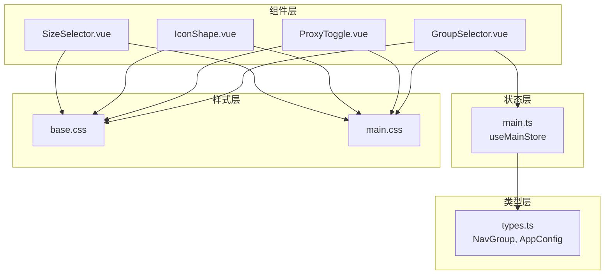
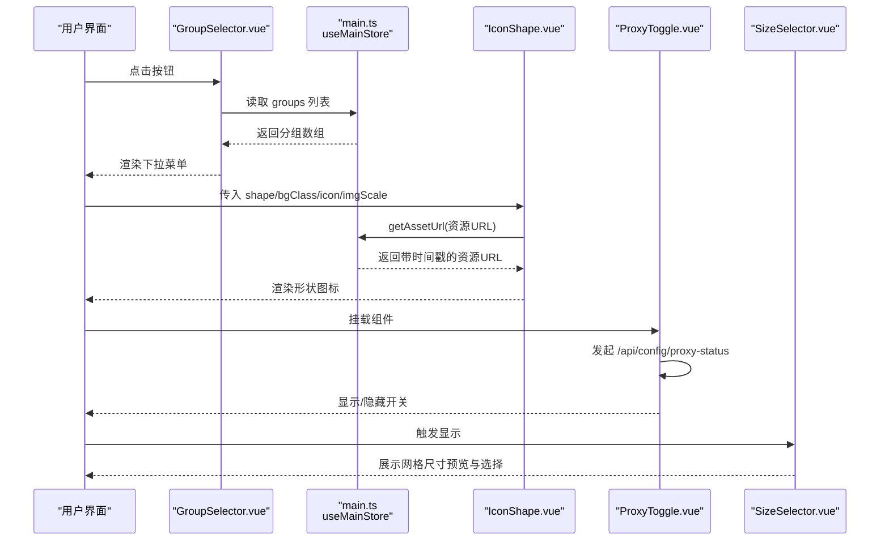
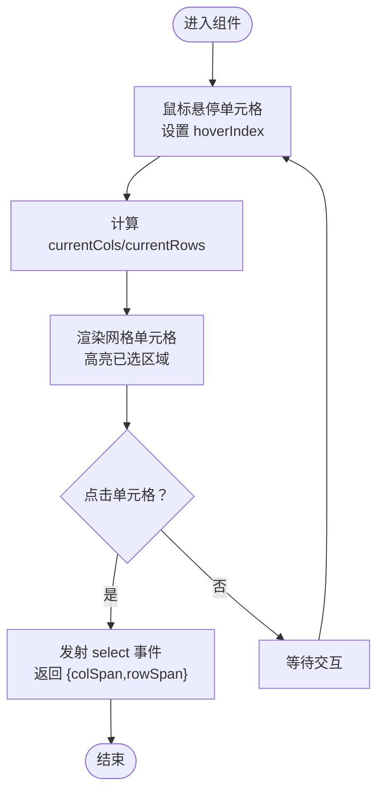
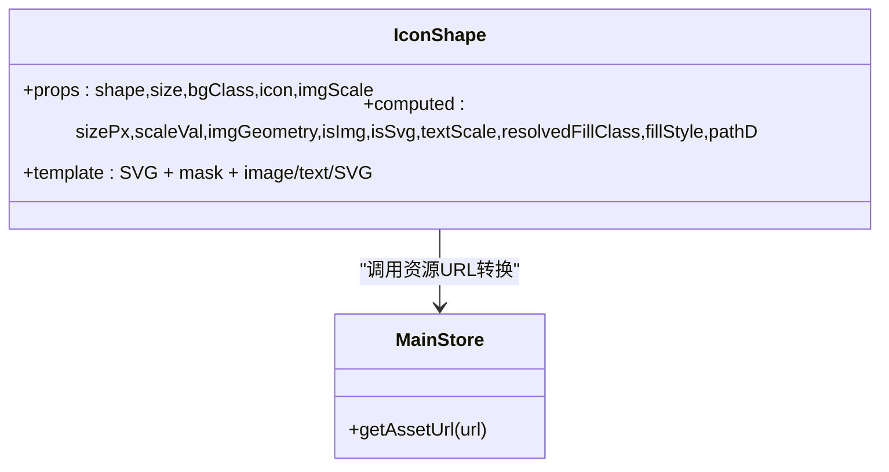
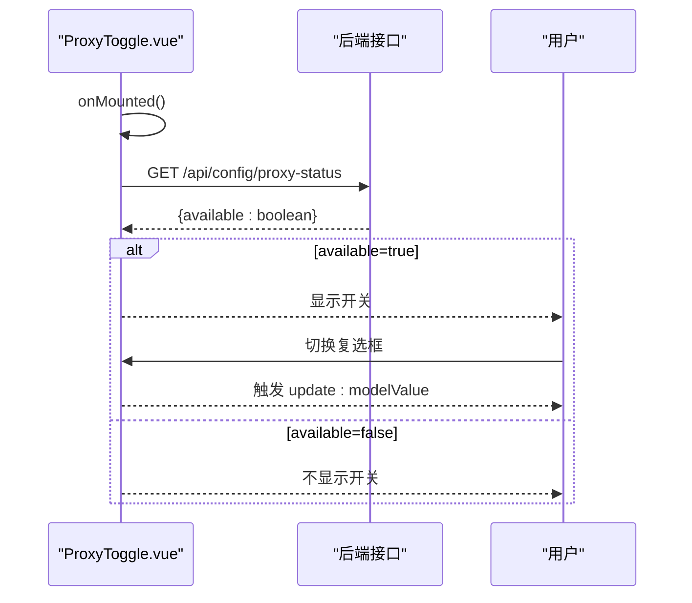
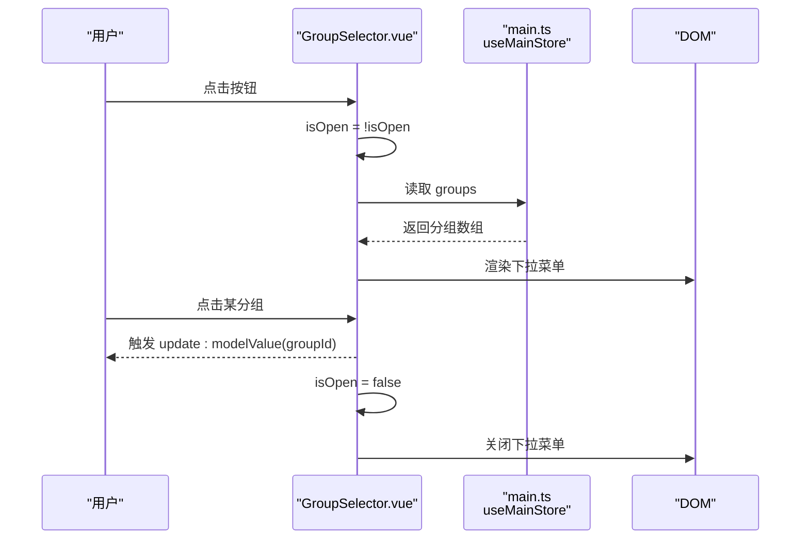
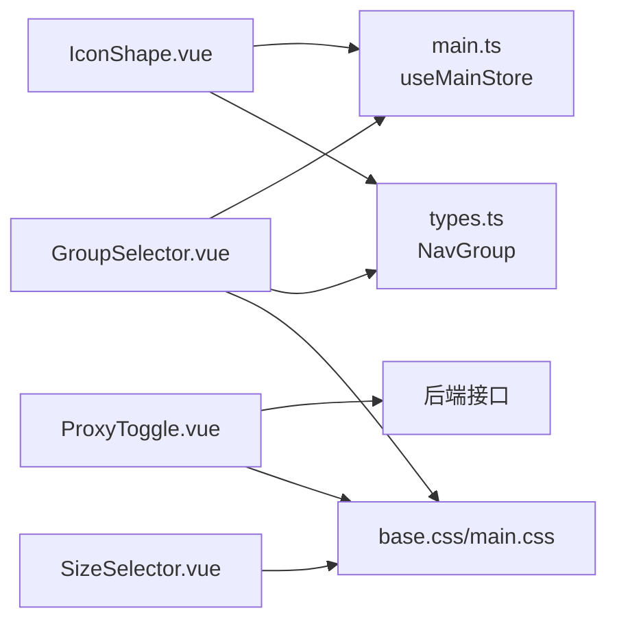

# UI 控件组件

<cite>
**本文引用的文件**
- [SizeSelector.vue](file://frontend/src/components/SizeSelector.vue)
- [IconShape.vue](file://frontend/src/components/IconShape.vue)
- [ProxyToggle.vue](file://frontend/src/components/ProxyToggle.vue)
- [GroupSelector.vue](file://frontend/src/components/GroupSelector.vue)
- [main.ts](file://frontend/src/stores/main.ts)
- [types.ts](file://frontend/src/types.ts)
- [GroupSelector.spec.ts](file://frontend/src/components/__tests__/GroupSelector.spec.ts)
- [base.css](file://frontend/src/assets/base.css)
- [main.css](file://frontend/src/assets/main.css)
</cite>

## 目录
1. [简介](#简介)
2. [项目结构](#项目结构)
3. [核心组件](#核心组件)
4. [架构总览](#架构总览)
5. [详细组件分析](#详细组件分析)
6. [依赖关系分析](#依赖关系分析)
7. [性能考量](#性能考量)
8. [故障排查指南](#故障排查指南)
9. [结论](#结论)
10. [附录](#附录)

## 简介
本指南聚焦 OFlatNas 前端 UI 控件组件的实用开发与最佳实践，涵盖尺寸选择器、图标形状组件、代理开关与分组选择器。文档从交互设计、状态管理、视觉反馈、可定制性、主题适配、无障碍访问、性能优化、事件处理与数据绑定等维度进行系统化说明，并提供可视化图示帮助理解组件间的协作关系。

## 项目结构
这些 UI 控件位于前端源码的组件目录中，配合 Pinia 状态管理与类型定义共同工作：
- 组件层：尺寸选择器、图标形状、代理开关、分组选择器
- 状态层：主存储（main store），提供分组列表、系统配置、资源版本等
- 类型层：导航分组、应用配置等接口定义
- 样式层：基础样式与滚动条样式，支撑组件视觉一致性

图表来源
- [SizeSelector.vue:1-99](file://frontend/src/components/SizeSelector.vue#L1-L99)
- [IconShape.vue:1-171](file://frontend/src/components/IconShape.vue#L1-L171)
- [ProxyToggle.vue:1-42](file://frontend/src/components/ProxyToggle.vue#L1-L42)
- [GroupSelector.vue:1-124](file://frontend/src/components/GroupSelector.vue#L1-L124)
- [main.ts:156-160](file://frontend/src/stores/main.ts#L156-L160)
- [types.ts:26-62](file://frontend/src/types.ts#L26-L62)
- [base.css:1-116](file://frontend/src/assets/base.css#L1-L116)
- [main.css:1-132](file://frontend/src/assets/main.css#L1-L132)

章节来源
- [SizeSelector.vue:1-99](file://frontend/src/components/SizeSelector.vue#L1-L99)
- [IconShape.vue:1-171](file://frontend/src/components/IconShape.vue#L1-L171)
- [ProxyToggle.vue:1-42](file://frontend/src/components/ProxyToggle.vue#L1-L42)
- [GroupSelector.vue:1-124](file://frontend/src/components/GroupSelector.vue#L1-L124)
- [main.ts:156-160](file://frontend/src/stores/main.ts#L156-L160)
- [types.ts:26-62](file://frontend/src/types.ts#L26-L62)
- [base.css:1-116](file://frontend/src/assets/base.css#L1-L116)
- [main.css:1-132](file://frontend/src/assets/main.css#L1-L132)

## 核心组件
本节概述四个核心 UI 控件的功能定位与职责边界：
- 尺寸选择器：提供网格尺寸预览与选择，支持悬停高亮与点击确认
- 图标形状：根据传入形状与背景类名渲染圆角、方形、菱形、六边形、八边形、五角形、叶子等矢量遮罩下的图标
- 代理开关：基于后端代理可用性动态显示，使用原生复选框语义与无障碍属性
- 分组选择器：下拉分组选择，支持点击外部关闭、键盘导航与视觉状态反馈

章节来源
- [SizeSelector.vue:1-99](file://frontend/src/components/SizeSelector.vue#L1-L99)
- [IconShape.vue:1-171](file://frontend/src/components/IconShape.vue#L1-L171)
- [ProxyToggle.vue:1-42](file://frontend/src/components/ProxyToggle.vue#L1-L42)
- [GroupSelector.vue:1-124](file://frontend/src/components/GroupSelector.vue#L1-L124)

## 架构总览
四个控件在应用中的协作关系如下：
- 分组选择器依赖主存储中的分组列表，通过 Pinia 计算属性与响应式更新
- 图标形状组件依赖主存储的资源版本机制，确保图片缓存失效与重新加载
- 代理开关在挂载时异步检查后端代理状态，决定是否展示
- 尺寸选择器作为独立交互面板，不依赖外部状态，但通过事件向外暴露选择结果

图表来源
- [GroupSelector.vue:1-124](file://frontend/src/components/GroupSelector.vue#L1-L124)
- [main.ts:156-160](file://frontend/src/stores/main.ts#L156-L160)
- [IconShape.vue:1-171](file://frontend/src/components/IconShape.vue#L1-L171)
- [ProxyToggle.vue:1-42](file://frontend/src/components/ProxyToggle.vue#L1-L42)
- [SizeSelector.vue:1-99](file://frontend/src/components/SizeSelector.vue#L1-L99)

## 详细组件分析

### 尺寸选择器（SizeSelector）
- 交互设计
  - 鼠标悬停高亮当前网格单元，实时显示列/行尺寸
  - 点击确认选择，触发自定义事件返回 colSpan 与 rowSpan
  - 阻止事件冒泡，避免影响父容器拖拽或点击
- 状态管理
  - hoverIndex 用于悬停态计算目标尺寸
  - currentCols/currentRows 基于 hoverIndex 或 props 推导当前尺寸
- 视觉反馈
  - 动画入场、网格单元边框与背景色区分已选区域
  - 文本格式化保留整数或一位小数
- 性能与可定制性
  - 固定 8×8 网格，通过数学映射计算行列比例，避免复杂循环
  - 支持自定义动画类名，便于主题扩展

图表来源
- [SizeSelector.vue:1-99](file://frontend/src/components/SizeSelector.vue#L1-L99)

章节来源
- [SizeSelector.vue:1-99](file://frontend/src/components/SizeSelector.vue#L1-L99)

### 图标形状组件（IconShape）
- 数据模型与渲染策略
  - 支持三种内容形态：图片、SVG 字符串、文本
  - 图片路径自动转换为带资源版本的时间戳 URL，避免缓存问题
  - 形状通过 SVG 路径遮罩实现，支持 circle、rounded、square、diamond、hexagon、octagon、pentagon、leaf 等
- 可定制性与主题适配
  - 支持传入背景类名（如 bg-gray-100），内部自动转换为 fill-* 类
  - 支持直接传入颜色值（十六进制/rgb/hsl），内联样式填充
  - 文本缩放随 size 自适应，保证在不同尺寸下可读性
- 无障碍与兼容性
  - 使用外层容器包裹，避免裁剪导致的边缘白边
  - foreignObject 中的 SVG 缩放通过 transform 实现，保持布局稳定

图表来源
- [IconShape.vue:1-171](file://frontend/src/components/IconShape.vue#L1-L171)
- [main.ts:571-577](file://frontend/src/stores/main.ts#L571-L577)

章节来源
- [IconShape.vue:1-171](file://frontend/src/components/IconShape.vue#L1-L171)
- [main.ts:571-577](file://frontend/src/stores/main.ts#L571-L577)

### 代理开关（ProxyToggle）
- 交互设计
  - 原生 checkbox 复用语义与键盘可达性
  - 使用 peer 伪类实现自定义开关样式，保持可访问性
- 状态管理
  - 挂载时异步检查 /api/config/proxy-status，仅在可用时显示
  - 通过 v-model 双向绑定 modelValue，事件名 update:modelValue
- 错误处理
  - 请求失败时记录警告并默认不可用
- 无障碍
  - sr-only 隐藏原生控件，仅通过样式呈现
  - 标签与输入元素语义明确，支持屏幕阅读器

图表来源
- [ProxyToggle.vue:1-42](file://frontend/src/components/ProxyToggle.vue#L1-L42)

章节来源
- [ProxyToggle.vue:1-42](file://frontend/src/components/ProxyToggle.vue#L1-L42)

### 分组选择器（GroupSelector）
- 交互设计
  - 点击按钮展开/收起下拉菜单，支持点击外部自动关闭
  - 下拉项滚动条自定义，支持键盘导航与高亮选中项
  - 选中后立即收起并触发 v-model 更新
- 状态管理
  - 使用 Pinia store.groups 提供分组列表
  - computed currentGroup 根据 modelValue 查找当前标题
- 视觉反馈
  - 打开态按钮添加边框与背景，旋转箭头指示状态
  - 选中项以蓝色强调并显示对勾图标
- 测试验证
  - 单元测试覆盖初始渲染、打开下拉、选择分组与关闭行为

图表来源
- [GroupSelector.vue:1-124](file://frontend/src/components/GroupSelector.vue#L1-L124)
- [main.ts:156-160](file://frontend/src/stores/main.ts#L156-L160)

章节来源
- [GroupSelector.vue:1-124](file://frontend/src/components/GroupSelector.vue#L1-L124)
- [GroupSelector.spec.ts:1-80](file://frontend/src/components/__tests__/GroupSelector.spec.ts#L1-L80)
- [main.ts:156-160](file://frontend/src/stores/main.ts#L156-L160)

## 依赖关系分析
- 组件耦合
  - GroupSelector 与 main store 强耦合（读取 groups），其他组件弱耦合
  - IconShape 与 main store 中的资源版本机制强耦合（getAssetUrl）
  - 其余组件为纯 UI 组件，无外部状态依赖
- 外部依赖
  - ProxyToggle 依赖后端接口 /api/config/proxy-status
  - GroupSelector 依赖 @vueuse/core 的 onClickOutside
- 类型契约
  - NavGroup 定义了分组的字段与可选配置，为 GroupSelector 提供数据结构保障

图表来源
- [GroupSelector.vue:1-124](file://frontend/src/components/GroupSelector.vue#L1-L124)
- [IconShape.vue:1-171](file://frontend/src/components/IconShape.vue#L1-L171)
- [ProxyToggle.vue:1-42](file://frontend/src/components/ProxyToggle.vue#L1-L42)
- [main.ts:156-160](file://frontend/src/stores/main.ts#L156-L160)
- [types.ts:26-62](file://frontend/src/types.ts#L26-L62)
- [base.css:1-116](file://frontend/src/assets/base.css#L1-L116)
- [main.css:1-132](file://frontend/src/assets/main.css#L1-L132)

章节来源
- [GroupSelector.vue:1-124](file://frontend/src/components/GroupSelector.vue#L1-L124)
- [IconShape.vue:1-171](file://frontend/src/components/IconShape.vue#L1-L171)
- [ProxyToggle.vue:1-42](file://frontend/src/components/ProxyToggle.vue#L1-L42)
- [main.ts:156-160](file://frontend/src/stores/main.ts#L156-L160)
- [types.ts:26-62](file://frontend/src/types.ts#L26-L62)
- [base.css:1-116](file://frontend/src/assets/base.css#L1-L116)
- [main.css:1-132](file://frontend/src/assets/main.css#L1-L132)

## 性能考量
- 资源缓存与失效
  - IconShape 通过主存储的 getAssetUrl 为资源 URL 追加时间戳参数，避免浏览器缓存导致的图片不更新
- 网络请求与降级
  - ProxyToggle 在挂载时发起一次请求检查代理可用性，失败时静默降级为不可用，避免阻塞 UI
- 渲染优化
  - SizeSelector 使用固定网格与简单映射，避免复杂计算与重复渲染
  - GroupSelector 下拉列表使用虚拟滚动与自定义滚动条，提升长列表体验
- 动画与过渡
  - 合理使用 CSS 动画与过渡，避免在高频交互中造成掉帧

章节来源
- [IconShape.vue:1-171](file://frontend/src/components/IconShape.vue#L1-L171)
- [main.ts:571-577](file://frontend/src/stores/main.ts#L571-L577)
- [ProxyToggle.vue:1-42](file://frontend/src/components/ProxyToggle.vue#L1-L42)
- [GroupSelector.vue:1-124](file://frontend/src/components/GroupSelector.vue#L1-L124)

## 故障排查指南
- 代理开关不显示
  - 检查 /api/config/proxy-status 是否可访问，确认后端返回 available 字段
  - 若请求失败，组件会默认不可用并输出警告日志
- 图标不显示或显示异常
  - 确认传入的 icon 是否为有效 URL 或 SVG 字符串
  - 若为图片，确保 getAssetUrl 返回的 URL 正确且资源存在
- 分组选择器无法收起
  - 确认 onClickOutside 是否正确绑定到容器 ref
  - 检查是否有其他事件阻止了点击外部的行为
- 尺寸选择器数值格式异常
  - 检查 hoverIndex 与 props.currentCol/Row 的传递逻辑
  - 确保 formatSize 对小数点的处理符合预期

章节来源
- [ProxyToggle.vue:1-42](file://frontend/src/components/ProxyToggle.vue#L1-L42)
- [IconShape.vue:1-171](file://frontend/src/components/IconShape.vue#L1-L171)
- [GroupSelector.vue:1-124](file://frontend/src/components/GroupSelector.vue#L1-L124)
- [SizeSelector.vue:1-99](file://frontend/src/components/SizeSelector.vue#L1-L99)

## 结论
四个 UI 控件在 OFlatNas 中承担了布局、图标渲染、代理控制与分组选择的关键职责。它们通过 Pinia 状态管理与类型系统实现松耦合、高可维护性，并在性能与可访问性方面做了合理权衡。遵循本文的最佳实践，可在不破坏现有架构的前提下扩展新控件或增强既有功能。

## 附录
- 主题与样式建议
  - 使用 base.css 中的 CSS 变量与暗色模式媒体查询，确保组件在深浅主题下一致
  - 自定义滚动条样式可参考 main.css 中的 glass 模板，保持全局一致性
- 可访问性清单
  - 代理开关使用原生复选框语义，确保键盘与屏幕阅读器支持
  - 分组选择器提供可见的焦点状态与键盘导航
  - 图标形状组件对文本与 SVG 的缩放应保证对比度与可读性

章节来源
- [base.css:1-116](file://frontend/src/assets/base.css#L1-L116)
- [main.css:1-132](file://frontend/src/assets/main.css#L1-L132)