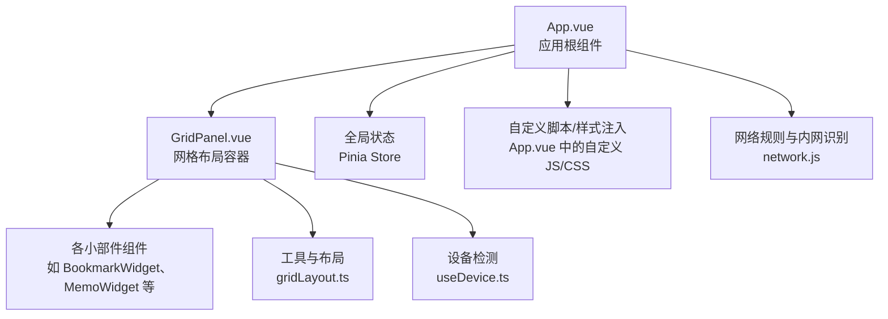
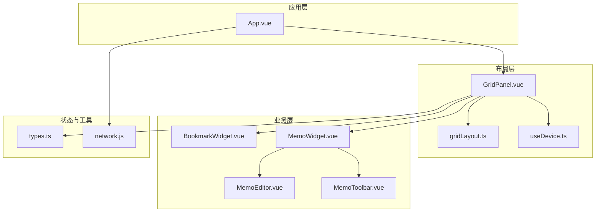
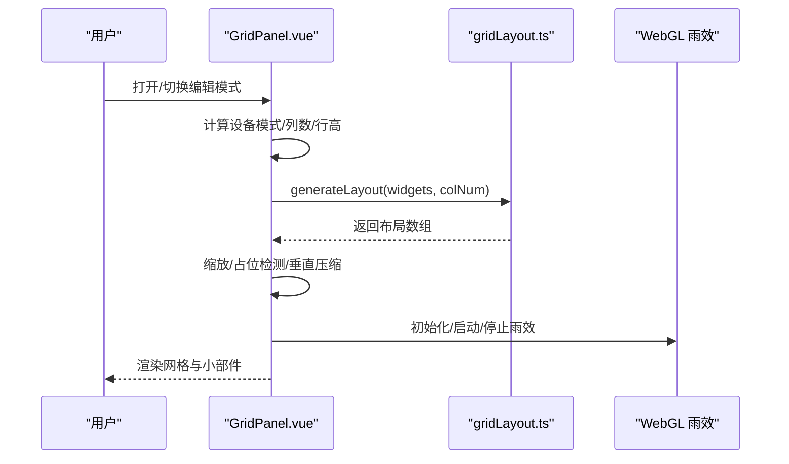
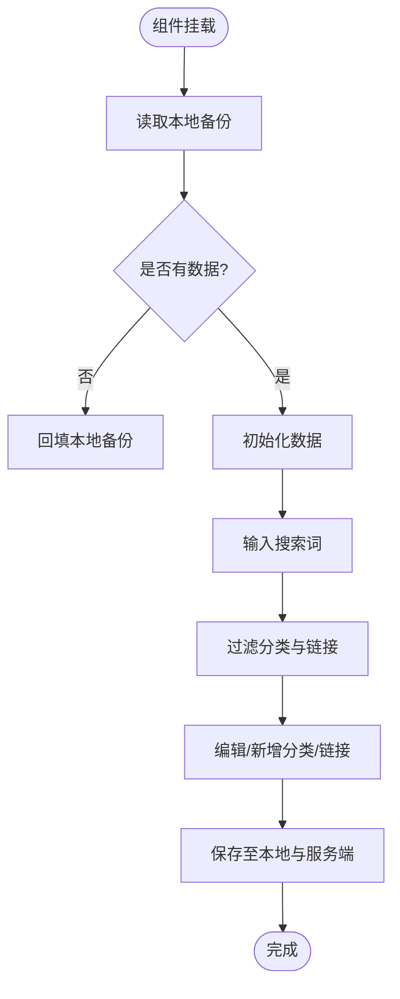
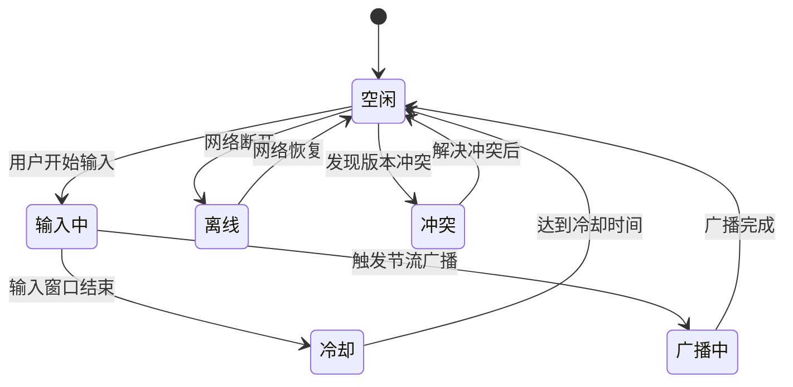
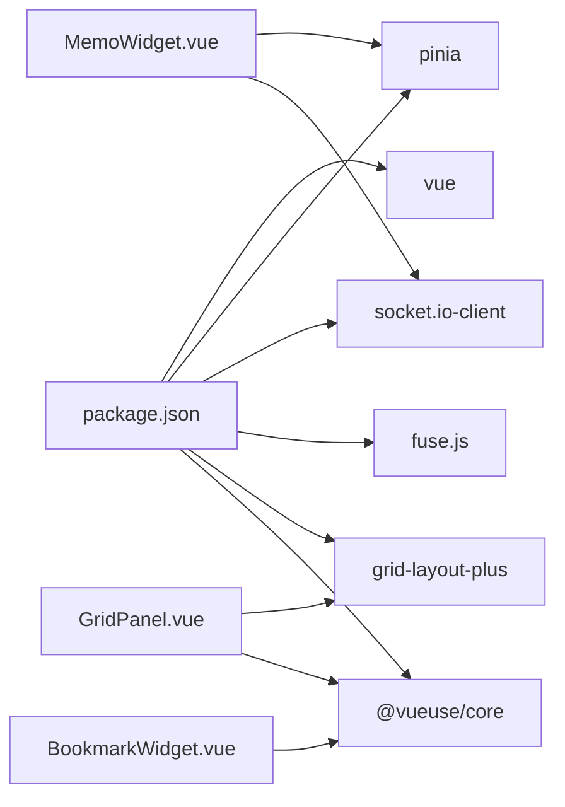

# Vue 组件开发

<cite>
**本文引用的文件**
- [GridPanel.vue](file://frontend/src/components/GridPanel.vue)
- [BookmarkWidget.vue](file://frontend/src/components/BookmarkWidget.vue)
- [MemoWidget.vue](file://frontend/src/components/MemoWidget.vue)
- [MemoEditor.vue](file://frontend/src/components/Memo/MemoEditor.vue)
- [MemoToolbar.vue](file://frontend/src/components/Memo/MemoToolbar.vue)
- [gridLayout.ts](file://frontend/src/utils/gridLayout.ts)
- [types.ts](file://frontend/src/types.ts)
- [main.ts](file://frontend/src/main.ts)
- [App.vue](file://frontend/src/App.vue)
- [useDevice.ts](file://frontend/src/composables/useDevice.ts)
- [EditModal.vue](file://frontend/src/components/EditModal.vue)
- [trayDrag.ts](file://frontend/src/utils/trayDrag.ts)
- [network.js](file://frontend/src/utils/network.js)
- [GridPanel_ContextMenu.spec.ts](file://frontend/src/components/__tests__/GridPanel_ContextMenu.spec.ts)
- [package.json](file://frontend/package.json)
</cite>

## 目录
1. [简介](#简介)
2. [项目结构](#项目结构)
3. [核心组件](#核心组件)
4. [架构总览](#架构总览)
5. [详细组件分析](#详细组件分析)
6. [依赖关系分析](#依赖关系分析)
7. [性能考量](#性能考量)
8. [故障排查指南](#故障排查指南)
9. [结论](#结论)
10. [附录](#附录)

## 简介
本指南面向 OFlatNas 的 Vue 3 组件开发者，系统讲解 Composition API 的使用、组件生命周期与响应式数据绑定、网格布局 GridPanel 的实现原理与拖拽重排机制、小部件组件（如 BookmarkWidget、MemoWidget）的开发规范与接口设计，并提供 Props 定义、事件处理、插槽使用、组件间通信、父子与兄弟协作模式、可复用性设计、性能优化与调试方法，以及自定义组件开发与组件库扩展的最佳实践。

## 项目结构
前端采用 Vite + Vue 3 + Pinia 架构，组件集中在 frontend/src/components，类型定义位于 frontend/src/types，状态管理位于 frontend/src/stores，工具函数分布在 utils 与 composables 目录，入口在 frontend/src/main.ts。

图示来源
- [App.vue:1-666](file://frontend/src/App.vue#L1-L666)
- [GridPanel.vue:1-800](file://frontend/src/components/GridPanel.vue#L1-L800)
- [gridLayout.ts:1-113](file://frontend/src/utils/gridLayout.ts#L1-L113)
- [useDevice.ts:1-72](file://frontend/src/composables/useDevice.ts#L1-L72)
- [network.js:1-176](file://frontend/src/utils/network.js#L1-L176)

章节来源
- [main.ts:1-37](file://frontend/src/main.ts#L1-L37)
- [package.json:1-77](file://frontend/package.json#L1-L77)

## 核心组件
- GridPanel：负责网格布局、拖拽重排、可见性控制、背景与天气效果、编辑模式与分页模式等。
- BookmarkWidget：书签管理与导入导出、搜索过滤、分类与链接编辑。
- MemoWidget：富文本/纯文本备忘录，带冲突检测、版本快照、IndexedDB 存储、WebSocket 广播与 HTTP 轮询同步。
- MemoEditor/MemoToolbar：备忘录编辑器与工具栏，基于 contenteditable 实现。
- 工具与类型：gridLayout.ts 提供网格布局生成算法；types.ts 定义 WidgetConfig、NavItem 等核心类型。
- 设备检测：useDevice.ts 基于窗口尺寸与 UA 判定设备类型。
- 网络规则：network.js 提供内网/外网/覆盖网络识别与配置构建。

章节来源
- [GridPanel.vue:1-800](file://frontend/src/components/GridPanel.vue#L1-L800)
- [BookmarkWidget.vue:1-574](file://frontend/src/components/BookmarkWidget.vue#L1-L574)
- [MemoWidget.vue:1-800](file://frontend/src/components/MemoWidget.vue#L1-L800)
- [MemoEditor.vue:1-113](file://frontend/src/components/Memo/MemoEditor.vue#L1-L113)
- [MemoToolbar.vue:1-98](file://frontend/src/components/Memo/MemoToolbar.vue#L1-L98)
- [gridLayout.ts:1-113](file://frontend/src/utils/gridLayout.ts#L1-L113)
- [types.ts:1-298](file://frontend/src/types.ts#L1-L298)
- [useDevice.ts:1-72](file://frontend/src/composables/useDevice.ts#L1-L72)
- [network.js:1-176](file://frontend/src/utils/network.js#L1-L176)

## 架构总览
整体采用“根组件 App.vue -> 网格容器 GridPanel -> 小部件”的层次化结构，状态通过 Pinia Store 管理，网络与设备能力通过工具函数与组合式函数注入，布局算法与可见性策略在 GridPanel 中集中实现。

图示来源
- [App.vue:1-666](file://frontend/src/App.vue#L1-L666)
- [GridPanel.vue:1-800](file://frontend/src/components/GridPanel.vue#L1-L800)
- [gridLayout.ts:1-113](file://frontend/src/utils/gridLayout.ts#L1-L113)
- [useDevice.ts:1-72](file://frontend/src/composables/useDevice.ts#L1-L72)
- [BookmarkWidget.vue:1-574](file://frontend/src/components/BookmarkWidget.vue#L1-L574)
- [MemoWidget.vue:1-800](file://frontend/src/components/MemoWidget.vue#L1-L800)
- [MemoEditor.vue:1-113](file://frontend/src/components/Memo/MemoEditor.vue#L1-L113)
- [MemoToolbar.vue:1-98](file://frontend/src/components/Memo/MemoToolbar.vue#L1-L98)
- [types.ts:1-298](file://frontend/src/types.ts#L1-L298)
- [network.js:1-176](file://frontend/src/utils/network.js#L1-L176)

## 详细组件分析

### GridPanel 组件：网格布局、拖拽重排与布局算法
- 响应式与生命周期
  - 使用 ref/computed/watch/nextTick 管理布局数据与缩放、行列高、设备模式、可见性等。
  - onMounted/onUnmounted 管理计时器、画布渲染器与窗口尺寸监听。
- 拖拽重排与布局
  - 通过 vue-draggable-plus 与 grid-layout-plus 实现拖拽与网格约束。
  - 使用 generateLayout 生成初始布局，支持按列数缩放与占位检测。
  - 提供编辑模式切换与布局签名校验，避免并发覆盖。
- 可见性与分页
  - checkVisible 控制公开/私有、移动端隐藏、登录态显示。
  - webGroupPagination 与 activePaginationGroupId 支持分组分页。
- 背景与天气特效
  - 动态背景、白天/夜间遮罩、雾/雨天气特效与 WebGL 渲染器。
- 网络与搜索
  - 通过 network.js 识别内网/外网/覆盖网络，支持延迟阈值模式。
  - 搜索引擎配置与会话记忆，支持默认引擎切换与持久化。

图示来源
- [GridPanel.vue:1-800](file://frontend/src/components/GridPanel.vue#L1-L800)
- [gridLayout.ts:1-113](file://frontend/src/utils/gridLayout.ts#L1-L113)

章节来源
- [GridPanel.vue:1-800](file://frontend/src/components/GridPanel.vue#L1-L800)
- [gridLayout.ts:1-113](file://frontend/src/utils/gridLayout.ts#L1-L113)
- [useDevice.ts:1-72](file://frontend/src/composables/useDevice.ts#L1-L72)
- [network.js:1-176](file://frontend/src/utils/network.js#L1-L176)

### BookmarkWidget 组件：书签管理与导入导出
- Props 与数据流
  - 接收 WidgetConfig，内部维护搜索查询、分类与链接编辑状态。
- 搜索与过滤
  - 支持标题/URL 双关键字模糊匹配，动态过滤分类与子项。
- 本地备份与导入
  - 使用 useStorage 在本地持久化备份；支持从浏览器导出 HTML 导入。
- 编辑与安全
  - 支持自动抓取站点标题与图标；未登录时拦截内网资源访问。
- 滚动隔离
  - 对嵌套滚动容器进行滚轮事件隔离，避免穿透。

图示来源
- [BookmarkWidget.vue:1-574](file://frontend/src/components/BookmarkWidget.vue#L1-L574)

章节来源
- [BookmarkWidget.vue:1-574](file://frontend/src/components/BookmarkWidget.vue#L1-L574)
- [types.ts:202-280](file://frontend/src/types.ts#L202-L280)

### MemoWidget 组件：备忘录同步与冲突处理
- 状态与配置
  - 使用 CONFIG 常量统一管理节流、广播、重试、冲突冷却等参数。
  - syncState、isEditing、isSaving、conflictState 等状态机驱动同步流程。
- 同步策略
  - preferSocketSync 优先 WebSocket 广播；否则使用 HTTP 轮询。
  - saveToServer 支持幂等请求头与重试；解析服务端返回内容并应用远程 payload。
- 冲突检测
  - 通过 buildConflictSignature 与 cooldown 机制提示用户选择本地/远端。
- 版本管理
  - useMemoPersistence 提供 IndexedDB 存储与版本快照；支持历史版本查看与恢复。
- 编辑器与工具栏
  - MemoEditor 基于 contenteditable；MemoToolbar 提供常用格式命令。

图示来源
- [MemoWidget.vue:1-800](file://frontend/src/components/MemoWidget.vue#L1-L800)
- [MemoEditor.vue:1-113](file://frontend/src/components/Memo/MemoEditor.vue#L1-L113)
- [MemoToolbar.vue:1-98](file://frontend/src/components/Memo/MemoToolbar.vue#L1-L98)

章节来源
- [MemoWidget.vue:1-800](file://frontend/src/components/MemoWidget.vue#L1-L800)
- [MemoEditor.vue:1-113](file://frontend/src/components/Memo/MemoEditor.vue#L1-L113)
- [MemoToolbar.vue:1-98](file://frontend/src/components/Memo/MemoToolbar.vue#L1-L98)

### MemoEditor 与 MemoToolbar：编辑器与工具栏
- MemoEditor
  - 使用 defineModel 绑定 content；watch 同步外部变更；execCommand 调用 document.execCommand。
- MemoToolbar
  - 定义常用命令（粗体、斜体、标题、列表、代码块、引用）并通过 emit 暴露 command 事件。

章节来源
- [MemoEditor.vue:1-113](file://frontend/src/components/Memo/MemoEditor.vue#L1-L113)
- [MemoToolbar.vue:1-98](file://frontend/src/components/Memo/MemoToolbar.vue#L1-L98)

### 组件间通信与协作
- 父子通信
  - GridPanel 通过动态异步组件加载各小部件，传递 widget 作为 Props。
  - 小部件内部通过 store 与全局状态交互（如 isLogged、appConfig）。
- 兄弟协作
  - 通过 Pinia Store 的 widgets/groups/appConfig 等共享状态，实现跨组件数据一致性。
  - EditModal 作为通用编辑弹窗，接收 onSave 回调，实现与 GridPanel 的解耦协作。
- 插槽与事件
  - 组件通过 defineEmits 暴露事件，父组件通过 v-model 或事件监听实现双向通信。
  - 模态框 Teleport 到 body，避免层级与样式干扰。

章节来源
- [GridPanel.vue:1-800](file://frontend/src/components/GridPanel.vue#L1-L800)
- [EditModal.vue:1-800](file://frontend/src/components/EditModal.vue#L1-L800)
- [App.vue:1-666](file://frontend/src/App.vue#L1-L666)

### 组件 Props、事件与插槽最佳实践
- Props
  - 明确类型：使用 TypeScript 接口（如 WidgetConfig、NavItem）约束输入。
  - 可选与必填：区分 enable/isPublic/hideOnMobile 等布尔开关与数值型配置。
- 事件
  - 使用 defineEmits 声明事件，避免隐式事件导致的维护困难。
- 插槽
  - 仅在需要扩展渲染结构时使用，保持默认插槽最小化，避免过度耦合。

章节来源
- [types.ts:202-280](file://frontend/src/types.ts#L202-L280)
- [MemoEditor.vue:1-113](file://frontend/src/components/Memo/MemoEditor.vue#L1-L113)
- [EditModal.vue:1-800](file://frontend/src/components/EditModal.vue#L1-L800)

### 可复用性设计与扩展
- 组合式函数
  - useDevice 抽象设备判定逻辑，便于在多个组件复用。
- 工具模块
  - gridLayout.ts 提供可复用的布局算法；network.js 提供网络分类工具。
- 动态组件
  - GridPanel 使用 defineAsyncComponent 按需加载，提升首屏性能与稳定性。

章节来源
- [useDevice.ts:1-72](file://frontend/src/composables/useDevice.ts#L1-L72)
- [gridLayout.ts:1-113](file://frontend/src/utils/gridLayout.ts#L1-L113)
- [GridPanel.vue:1-800](file://frontend/src/components/GridPanel.vue#L1-L800)

## 依赖关系分析
- 组件依赖
  - GridPanel 依赖 vue-draggable-plus、grid-layout-plus、@vueuse/core、DOMPurify 等。
  - MemoWidget 依赖 useMemoPersistence、IndexedDB、WebSocket 与 HTTP 轮询。
  - BookmarkWidget 依赖 useStorage、安全工具与书签解析。
- 类型与状态
  - types.ts 定义 WidgetConfig/NavItem 等核心类型；main.ts 初始化 Pinia Store。
- 工具链
  - package.json 指定 Vue 3、Pinia、Socket.IO、Fuse.js、grid-layout-plus 等依赖。

图示来源
- [package.json:1-77](file://frontend/package.json#L1-L77)
- [GridPanel.vue:1-800](file://frontend/src/components/GridPanel.vue#L1-L800)
- [MemoWidget.vue:1-800](file://frontend/src/components/MemoWidget.vue#L1-L800)
- [BookmarkWidget.vue:1-574](file://frontend/src/components/BookmarkWidget.vue#L1-L574)

章节来源
- [package.json:1-77](file://frontend/package.json#L1-L77)

## 性能考量
- 拖拽与布局
  - 使用 scaleGridValue/unscaleGridValue 与步进算法（step=0.5）减少布局抖动。
  - 垂直压缩 compactVertical 逐行扫描，避免重叠与空洞。
- 渲染与特效
  - 雨效 WebGL 渲染器按需启动/停止，resize 时重设视口。
  - 背景图片预加载标记 isPcBgLoaded/isMobileBgLoaded，避免闪烁。
- 网络与同步
  - MemoWidget 的广播节流与退避重试，降低网络压力。
  - 离线/冲突状态机避免无效请求。
- 资源与懒加载
  - defineAsyncComponent 动态导入组件，chunk 失败自动刷新页面。
  - useStorage 本地持久化减少网络往返。

章节来源
- [GridPanel.vue:1-800](file://frontend/src/components/GridPanel.vue#L1-L800)
- [MemoWidget.vue:1-800](file://frontend/src/components/MemoWidget.vue#L1-L800)
- [gridLayout.ts:1-113](file://frontend/src/utils/gridLayout.ts#L1-L113)

## 故障排查指南
- 组件加载失败
  - defineAsyncComponent onError 监听动态导入错误，触发页面刷新。
- 保存失败
  - App.vue 包装 fetch 捕获 /api/save 失败，提示用户并记录状态。
- 版本冲突
  - GridPanel 与 MemoWidget 均提供冲突提示与解决选项。
- 测试验证
  - GridPanel_ContextMenu.spec.ts 使用 vitest + @vue/test-utils 验证右键菜单与删除流程。

章节来源
- [GridPanel.vue:1-800](file://frontend/src/components/GridPanel.vue#L1-L800)
- [App.vue:1-666](file://frontend/src/App.vue#L1-L666)
- [GridPanel_ContextMenu.spec.ts:1-147](file://frontend/src/components/__tests__/GridPanel_ContextMenu.spec.ts#L1-L147)

## 结论
OFlatNas 的组件体系以 GridPanel 为核心，结合 Composition API、Pinia 状态管理与工具函数，实现了灵活的网格布局、强大的小部件生态与稳健的同步机制。通过明确的 Props/事件/插槽约定、状态机与性能优化策略，开发者可以高效扩展新的小部件与交互模式。

## 附录
- 自定义组件开发步骤
  - 定义 Props 类型（参考 WidgetConfig/NavItem）。
  - 使用 defineProps/defineEmits 暴露接口，必要时使用 defineModel。
  - 在 GridPanel 中注册异步组件并加入 gridWidgetTypes。
  - 如需编辑/设置，提供对应 Modal 组件并与 GridPanel 通过事件解耦。
- 组件库扩展
  - 将通用逻辑抽象为组合式函数（如 useDevice）。
  - 将算法与工具抽离为独立模块（如 gridLayout.ts、network.js）。
  - 通过 Pinia Store 暴露共享状态，避免重复计算与副作用。