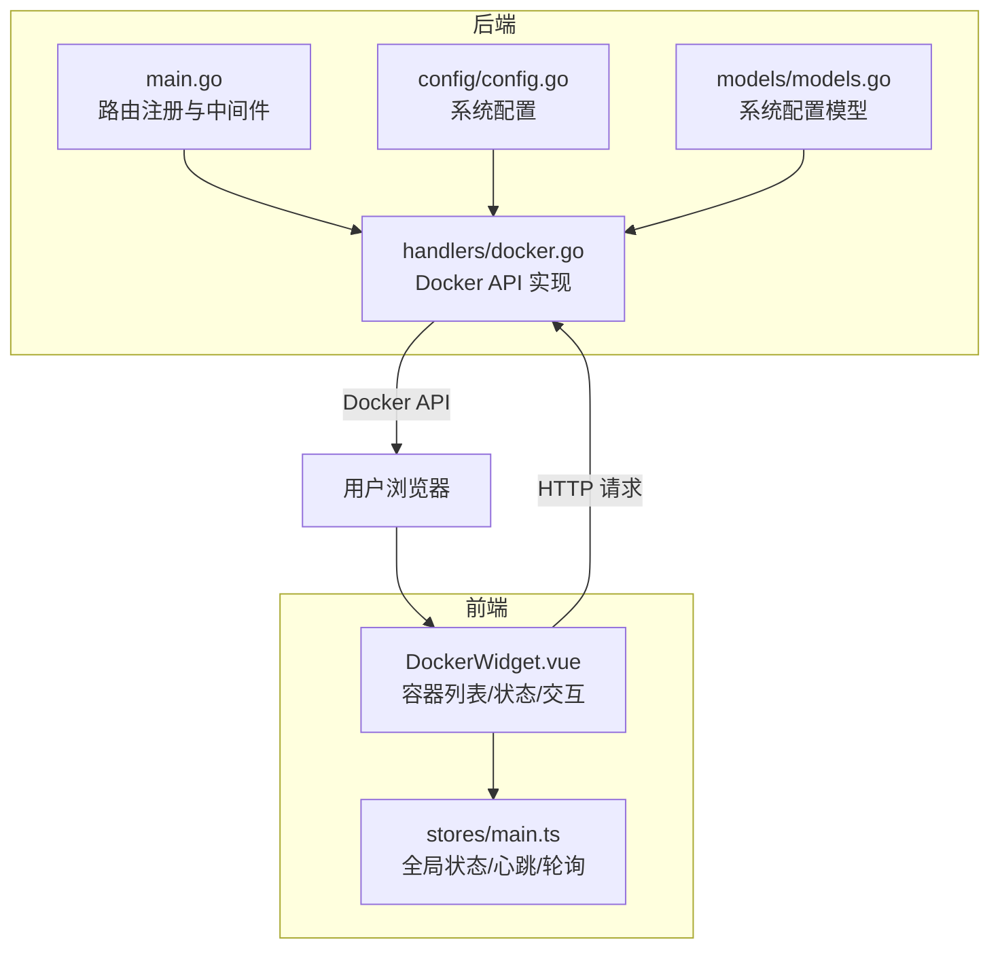
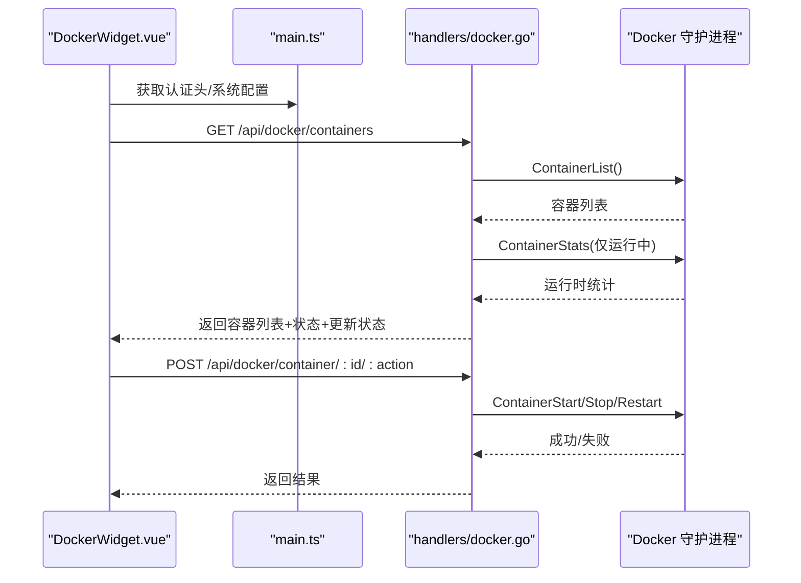
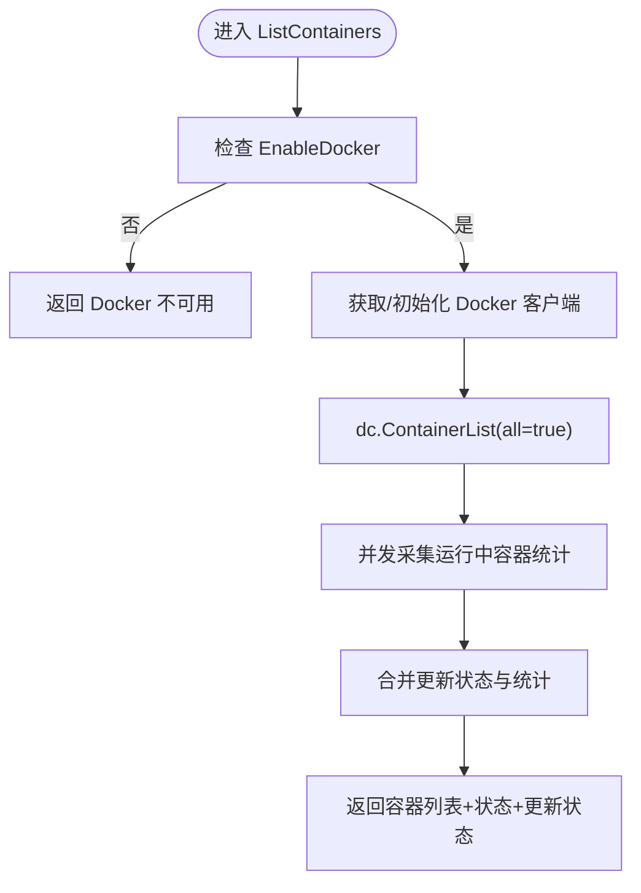
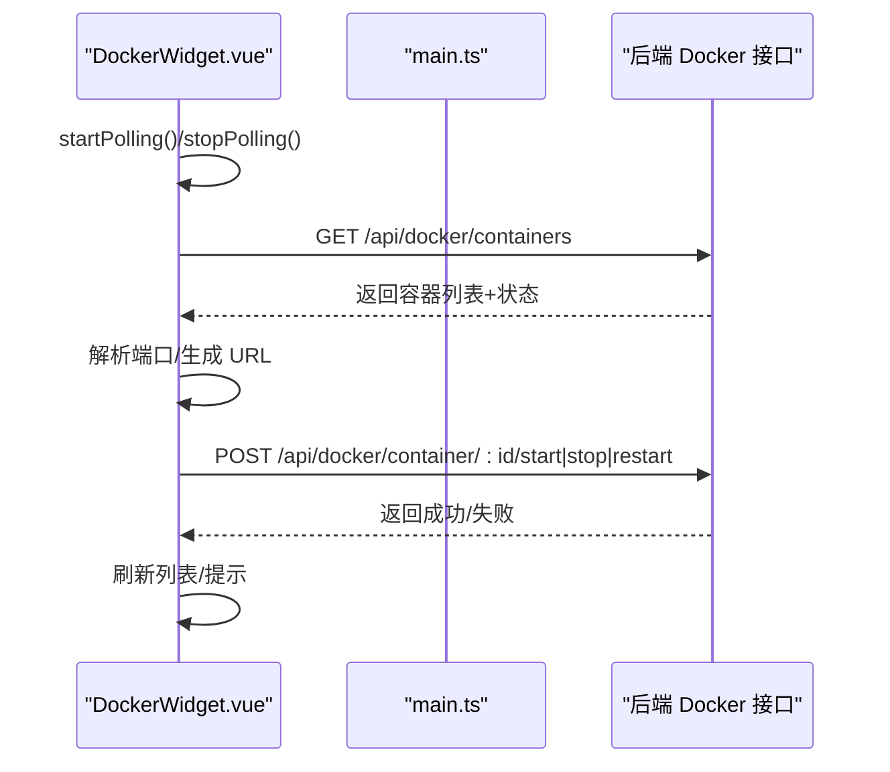
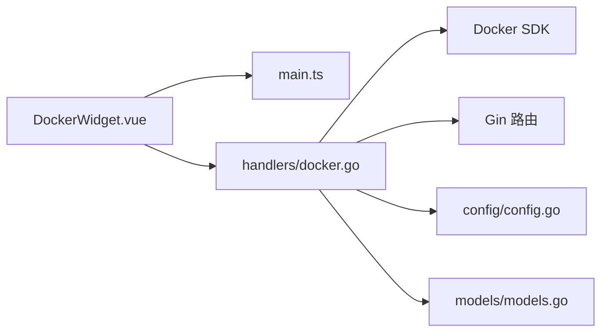

# Docker 管理组件

<cite>
**本文档引用的文件**
- [backend/handlers/docker.go](file://backend/handlers/docker.go)
- [backend/main.go](file://backend/main.go)
- [frontend/src/components/DockerWidget.vue](file://frontend/src/components/DockerWidget.vue)
- [backend/config/config.go](file://backend/config/config.go)
- [backend/models/models.go](file://backend/models/models.go)
- [frontend/src/stores/main.ts](file://frontend/src/stores/main.ts)
- [README.md](file://README.md)
</cite>

## 目录
1. [简介](#简介)
2. [项目结构](#项目结构)
3. [核心组件](#核心组件)
4. [架构总览](#架构总览)
5. [详细组件分析](#详细组件分析)
6. [依赖关系分析](#依赖关系分析)
7. [性能考量](#性能考量)
8. [故障排查指南](#故障排查指南)
9. [结论](#结论)
10. [附录](#附录)

## 简介
本文件面向 Docker 管理组件的开发与维护者，系统性阐述容器状态监控、启动停止控制、日志查看与导出、Docker API 集成方式、容器信息获取与展示机制、动态更新策略、状态指示器与操作按钮交互设计、安全与权限控制、错误处理策略，以及容器网络配置、卷挂载与环境变量管理的实现细节。文档同时提供架构图与流程图，帮助读者快速把握系统全貌与关键路径。

## 项目结构
- 后端采用 Go 语言与 Gin 框架，提供 REST API 与静态资源服务，Docker 管理相关接口集中在 handlers/docker.go。
- 前端基于 Vue 3，Docker 管理组件位于 frontend/src/components/DockerWidget.vue，负责轮询、渲染、交互与部分网络端口解析。
- 配置与模型位于 backend/config/config.go 与 backend/models/models.go，系统配置包含 EnableDocker、DockerHost 等关键项。
- 后端主程序 backend/main.go 注册 Docker 相关路由与中间件，包括认证中间件、CORS、Gzip 压缩等。

图表来源
- [backend/main.go:165-254](file://backend/main.go#L165-L254)
- [backend/handlers/docker.go:354-421](file://backend/handlers/docker.go#L354-L421)
- [frontend/src/components/DockerWidget.vue:279-386](file://frontend/src/components/DockerWidget.vue#L279-L386)
- [backend/config/config.go:102-151](file://backend/config/config.go#L102-L151)
- [backend/models/models.go:81-85](file://backend/models/models.go#L81-L85)

章节来源
- [backend/main.go:165-254](file://backend/main.go#L165-L254)
- [backend/handlers/docker.go:354-421](file://backend/handlers/docker.go#L354-L421)
- [frontend/src/components/DockerWidget.vue:279-386](file://frontend/src/components/DockerWidget.vue#L279-L386)
- [backend/config/config.go:102-151](file://backend/config/config.go#L102-L151)
- [backend/models/models.go:81-85](file://backend/models/models.go#L81-L85)

## 核心组件
- Docker 后端处理器：负责初始化 Docker 客户端、列举容器、采集运行时统计、执行容器动作（启动/停止/重启）、镜像更新检查、导出调试日志等。
- Docker 前端组件：负责轮询容器列表、渲染状态与指标、解析网络端口、触发容器动作、展示更新状态、错误提示与重试策略。
- 系统配置与模型：系统配置包含 EnableDocker 与 DockerHost，影响 Docker 功能的启用与连接地址解析。
- 全局状态与心跳：前端 store 统一管理认证、心跳、轮询节奏与资源版本，保障在复杂网络环境下的稳定体验。

章节来源
- [backend/handlers/docker.go:42-66](file://backend/handlers/docker.go#L42-L66)
- [frontend/src/components/DockerWidget.vue:279-386](file://frontend/src/components/DockerWidget.vue#L279-L386)
- [backend/config/config.go:102-151](file://backend/config/config.go#L102-L151)
- [backend/models/models.go:81-85](file://backend/models/models.go#L81-L85)
- [frontend/src/stores/main.ts:437-467](file://frontend/src/stores/main.ts#L437-L467)

## 架构总览
Docker 管理组件采用前后端分离架构：
- 前端通过 HTTP 轮询后端接口获取容器列表与状态，同时在可见性变化时调整轮询节奏。
- 后端通过 Docker SDK 连接 Docker 守护进程，支持 unix:///var/run/docker.sock 与 npipe://（Windows）等连接方式。
- 权限控制通过后端中间件与用户名校验实现，仅允许管理员执行容器动作与更新检查。
- 前端提供错误格式化与重试窗口，避免在 Docker 不可用时过度轮询。

图表来源
- [frontend/src/components/DockerWidget.vue:279-386](file://frontend/src/components/DockerWidget.vue#L279-L386)
- [backend/handlers/docker.go:354-421](file://backend/handlers/docker.go#L354-L421)
- [backend/handlers/docker.go:438-483](file://backend/handlers/docker.go#L438-L483)

章节来源
- [frontend/src/components/DockerWidget.vue:279-386](file://frontend/src/components/DockerWidget.vue#L279-L386)
- [backend/handlers/docker.go:354-421](file://backend/handlers/docker.go#L354-L421)
- [backend/handlers/docker.go:438-483](file://backend/handlers/docker.go#L438-L483)

## 详细组件分析

### 后端 Docker 处理器（handlers/docker.go）
- Docker 客户端初始化与连接解析
  - 支持从系统配置与环境变量 DOCKER_HOST 解析连接地址，兼容 Windows npipe 与 Linux unix socket。
  - 若连接不兼容或为空，则回退到默认地址。
- 列举容器与状态采集
  - 列表接口返回容器列表，并附带更新状态与运行时统计（CPU/内存/网络/块IO）。
  - 仅对运行中的容器并发采集统计，使用信号量限制并发，避免对 Docker 守护进程造成压力。
- 容器动作与权限控制
  - 仅允许管理员执行 start/stop/restart，其他用户返回 403。
- 镜像更新检查
  - 仅对运行中容器拉取镜像并比对镜像 ID，记录更新计数与失败列表。
  - 支持并发拉取与失败收集，避免阻塞主流程。
- 调试与日志导出
  - 提供调试快照（连接状态、Ping 结果、初始化错误等）与日志导出接口，便于问题定位。

图表来源
- [backend/handlers/docker.go:354-421](file://backend/handlers/docker.go#L354-L421)
- [backend/handlers/docker.go:292-352](file://backend/handlers/docker.go#L292-L352)

章节来源
- [backend/handlers/docker.go:42-66](file://backend/handlers/docker.go#L42-L66)
- [backend/handlers/docker.go:354-421](file://backend/handlers/docker.go#L354-L421)
- [backend/handlers/docker.go:292-352](file://backend/handlers/docker.go#L292-L352)
- [backend/handlers/docker.go:438-483](file://backend/handlers/docker.go#L438-L483)
- [backend/handlers/docker.go:664-759](file://backend/handlers/docker.go#L664-L759)
- [backend/handlers/docker.go:572-606](file://backend/handlers/docker.go#L572-L606)

### 前端 Docker 组件（DockerWidget.vue）
- 轮询与动态更新
  - 首次加载与可见性变化时启动轮询，错误时进入宽容期（3 分钟）与降频（30 秒）策略，避免无效请求。
  - 轮询间隔在 12–17 秒之间随机抖动，模拟真实数据频率。
- 容器列表与状态展示
  - 展示容器名称、镜像、状态、端口、CPU/内存/网络/块 IO 等指标。
  - 支持“健康度”统计（unhealthy 数量）。
- 网络端口解析与链接生成
  - 优先从 Ports 映射中提取公开端口；若无映射且网络模式为 host，则通过 inspect 获取暴露端口。
  - 支持 LAN 与公网 URL 生成，结合用户配置与首选端口优先级。
- 操作按钮与交互
  - 支持 start/stop/restart，调用后端接口并刷新列表。
  - 支持触发镜像更新检查（需管理员权限与开关开启）。
- 错误处理与提示
  - 对 Docker 不可用、Socket 连接失败、Windows 权限等问题进行友好提示。
  - 保留历史数据，避免在网络波动时清空界面。

图表来源
- [frontend/src/components/DockerWidget.vue:279-386](file://frontend/src/components/DockerWidget.vue#L279-L386)
- [frontend/src/components/DockerWidget.vue:435-450](file://frontend/src/components/DockerWidget.vue#L435-L450)
- [frontend/src/components/DockerWidget.vue:557-641](file://frontend/src/components/DockerWidget.vue#L557-L641)

章节来源
- [frontend/src/components/DockerWidget.vue:279-386](file://frontend/src/components/DockerWidget.vue#L279-L386)
- [frontend/src/components/DockerWidget.vue:435-450](file://frontend/src/components/DockerWidget.vue#L435-L450)
- [frontend/src/components/DockerWidget.vue:557-641](file://frontend/src/components/DockerWidget.vue#L557-L641)

### 系统配置与模型（config/config.go、models/models.go）
- 系统配置
  - EnableDocker：控制 Docker 功能是否启用。
  - DockerHost：可选的 Docker 守护进程连接地址，支持多种协议与规范化处理。
- 模型
  - SystemConfig 包含上述字段，用于后端读取与判断。

章节来源
- [backend/config/config.go:102-151](file://backend/config/config.go#L102-L151)
- [backend/models/models.go:81-85](file://backend/models/models.go#L81-L85)

### 全局状态与心跳（stores/main.ts）
- 心跳与网络模式
  - 基于 Socket.IO 的心跳检测，支持自动/LAN/WAN/Latency 模式，动态调整心跳间隔与超时。
- 轮询脉冲
  - 统一的仪表盘脉冲定时器，协调 Docker/Music 等组件的轮询，减少分散请求。
- 版本检查与 Docker 更新提示
  - 定期检查 Docker 更新可用性并在 UI 中提示。

章节来源
- [frontend/src/stores/main.ts:437-467](file://frontend/src/stores/main.ts#L437-L467)
- [frontend/src/stores/main.ts:474-507](file://frontend/src/stores/main.ts#L474-L507)
- [frontend/src/stores/main.ts:524-559](file://frontend/src/stores/main.ts#L524-L559)

## 依赖关系分析
- 后端依赖
  - Docker SDK：用于连接与操作 Docker 守护进程。
  - Gin：提供路由与中间件。
  - 配置模块：读取系统配置，决定 Docker 功能与连接地址。
- 前端依赖
  - Vue 3：组件化渲染与状态管理。
  - Pinia：全局状态 store。
  - Socket.IO 客户端：心跳与网络模式检测。
  - 网络工具：URL 解析与网络类型判定（用于端口与链接生成）。

图表来源
- [frontend/src/components/DockerWidget.vue:279-386](file://frontend/src/components/DockerWidget.vue#L279-L386)
- [backend/handlers/docker.go:354-421](file://backend/handlers/docker.go#L354-L421)
- [backend/config/config.go:102-151](file://backend/config/config.go#L102-L151)
- [backend/models/models.go:81-85](file://backend/models/models.go#L81-L85)

章节来源
- [frontend/src/components/DockerWidget.vue:279-386](file://frontend/src/components/DockerWidget.vue#L279-L386)
- [backend/handlers/docker.go:354-421](file://backend/handlers/docker.go#L354-L421)
- [backend/config/config.go:102-151](file://backend/config/config.go#L102-L151)
- [backend/models/models.go:81-85](file://backend/models/models.go#L81-L85)

## 性能考量
- 并发与节流
  - 后端对运行中容器并发采集统计，使用信号量限制并发，避免阻塞。
  - 前端轮询间隔随机抖动，错误时进入宽容期与降频，减少无效请求。
- 缓存与 TTL
  - 后端对容器统计设置 TTL，避免频繁重复采集。
  - 前端对容器 inspect 结果设置 TTL，减少重复请求。
- 压缩与中间件
  - 后端启用 Gzip 压缩，减少传输体积，提升内网穿透/慢速网络体验。
- 资源版本与缓存
  - 前端资源版本号用于缓存失效，避免静态资源缓存导致的白屏问题。

章节来源
- [backend/handlers/docker.go:292-352](file://backend/handlers/docker.go#L292-L352)
- [frontend/src/components/DockerWidget.vue:512-524](file://frontend/src/components/DockerWidget.vue#L512-L524)
- [backend/main.go:42-46](file://backend/main.go#L42-L46)
- [frontend/src/stores/main.ts:561-577](file://frontend/src/stores/main.ts#L561-L577)

## 故障排查指南
- Docker 不可用
  - 现象：后端返回“Docker not available”，前端显示错误并进入宽容期。
  - 排查：检查系统配置 EnableDocker 与 DockerHost，确认 /var/run/docker.sock 或 npipe:// 连接可用。
- Socket 连接失败
  - 现象：前端提示无法连接 Docker Socket。
  - 排查：确认宿主机 Docker 已启动，容器中已挂载 /var/run/docker.sock。
- Windows 权限问题
  - 现象：提示需要管理员权限访问 Docker 引擎。
  - 排查：以管理员身份运行容器或调整权限。
- 网络波动
  - 现象：轮询失败但不立即清空数据。
  - 处理：前端保留历史数据，等待网络恢复后自动重试。
- 权限不足
  - 现象：执行容器动作返回 403。
  - 处理：确保当前用户为管理员。

章节来源
- [frontend/src/components/DockerWidget.vue:169-189](file://frontend/src/components/DockerWidget.vue#L169-L189)
- [backend/handlers/docker.go:438-483](file://backend/handlers/docker.go#L438-L483)

## 结论
Docker 管理组件通过前后端协同实现了容器状态监控、启动停止控制、镜像更新检查与日志导出的完整闭环。后端以 Docker SDK 为核心，结合并发采集与缓存策略，确保性能与稳定性；前端以轮询与心跳为基础，提供动态更新、端口解析与友好的交互体验。权限控制与错误处理策略进一步提升了系统的安全性与可用性。建议在生产环境中配合合适的网络与权限配置，以获得最佳体验。

## 附录
- 部署与配置要点
  - Docker 部署时需挂载 /var/run/docker.sock，并在系统配置中设置 dockerHost。
  - 管理员权限用于执行容器动作与更新检查。
- 功能参考
  - 容器列表与状态：/api/docker/containers
  - 容器动作：/api/docker/container/:id/start|stop|restart
  - 镜像更新检查：/api/docker/check-updates
  - 调试与日志导出：/api/docker/debug、/api/docker/export-logs

章节来源
- [README.md:161-195](file://README.md#L161-L195)
- [backend/main.go:215-221](file://backend/main.go#L215-L221)