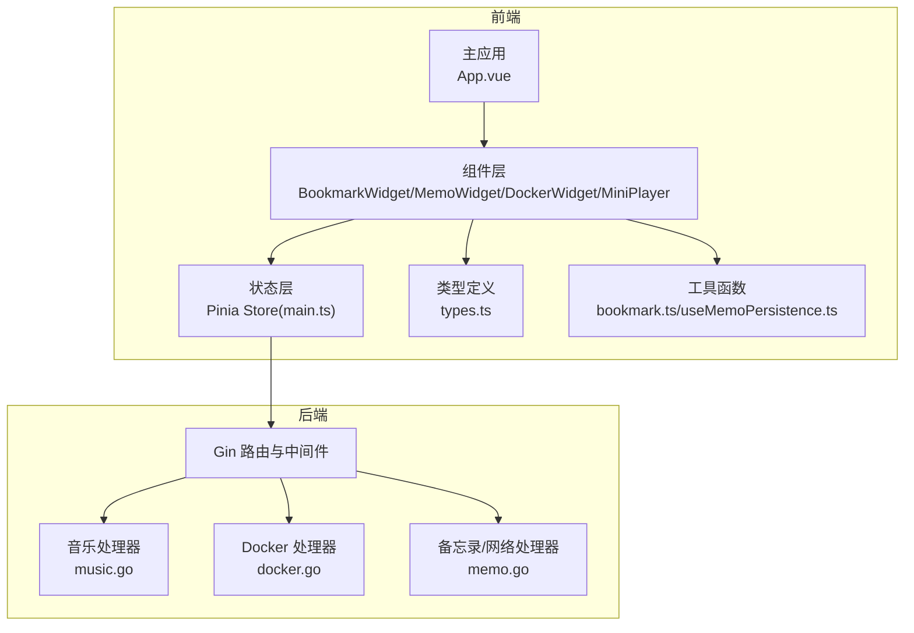
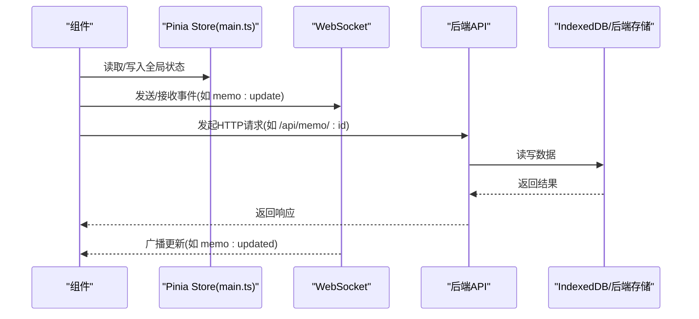
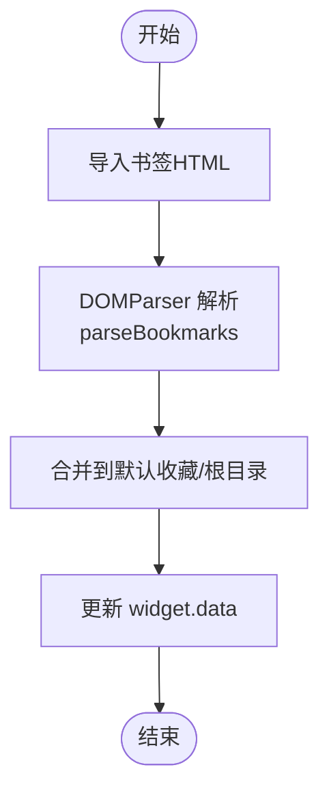
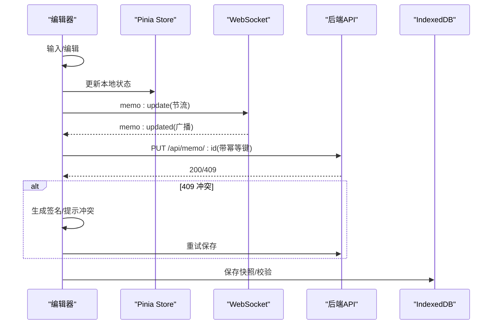
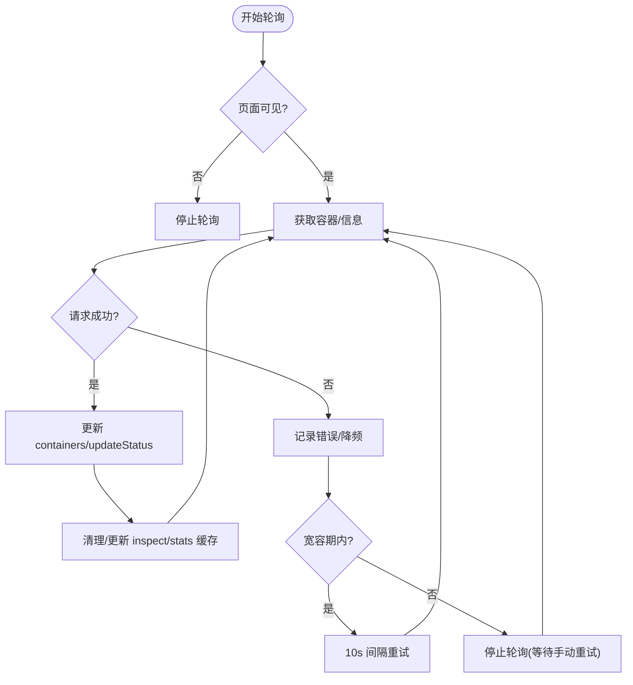
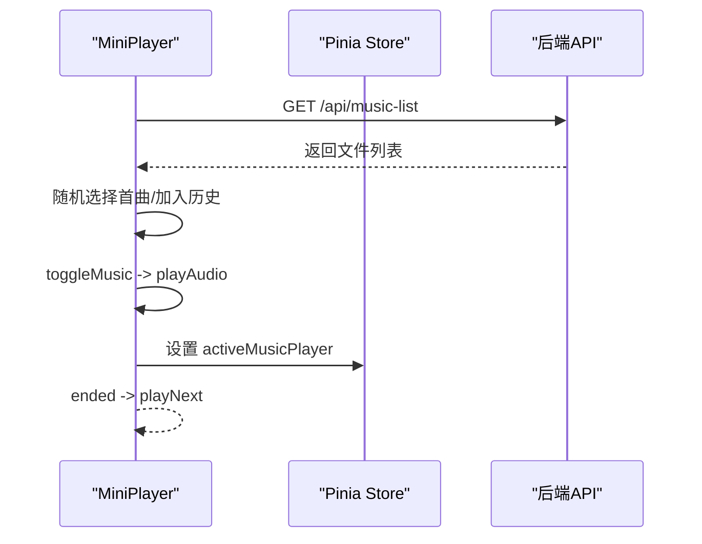
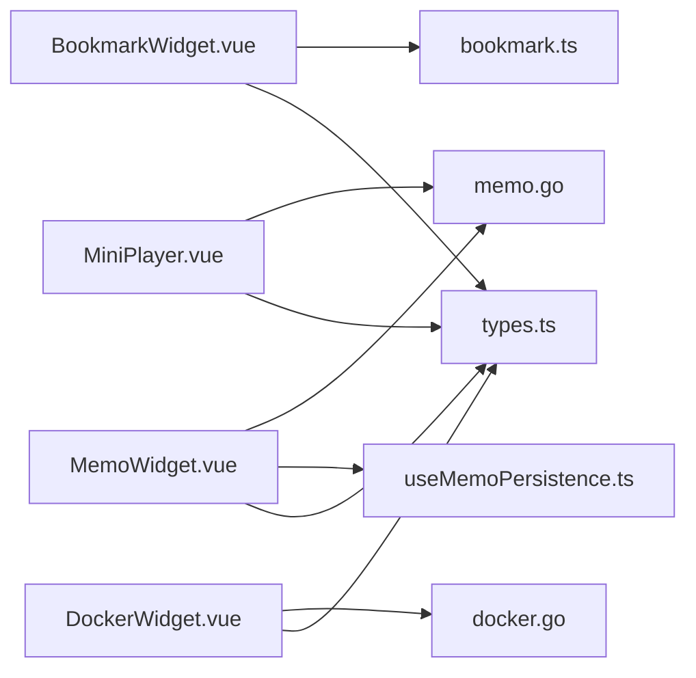

# 业务组件

<cite>
**本文引用的文件**
- [BookmarkWidget.vue](file://frontend/src/components/BookmarkWidget.vue)
- [MemoWidget.vue](file://frontend/src/components/MemoWidget.vue)
- [DockerWidget.vue](file://frontend/src/components/DockerWidget.vue)
- [MiniPlayer.vue](file://frontend/src/components/MiniPlayer.vue)
- [bookmark.ts](file://frontend/src/utils/bookmark.ts)
- [types.ts](file://frontend/src/types.ts)
- [main.ts](file://frontend/src/stores/main.ts)
- [useMemoPersistence.ts](file://frontend/src/components/Memo/useMemoPersistence.ts)
- [music.go](file://backend/handlers/music.go)
- [docker.go](file://backend/handlers/docker.go)
- [memo.go](file://backend/handlers/memo.go)
</cite>

## 目录
1. [简介](#简介)
2. [项目结构](#项目结构)
3. [核心组件](#核心组件)
4. [架构总览](#架构总览)
5. [详细组件分析](#详细组件分析)
6. [依赖分析](#依赖分析)
7. [性能考虑](#性能考虑)
8. [故障排查指南](#故障排查指南)
9. [结论](#结论)
10. [附录](#附录)

## 简介
本指南面向 OFlatNas 的业务组件开发，聚焦以下四类组件：
- 书签组件：提供书签浏览、搜索、导入导出、分类管理与安全访问控制。
- 备忘录组件：提供富文本/纯文本双模式、本地持久化、冲突检测与多端同步。
- 音乐播放器组件：提供迷你播放器与完整音乐面板，支持播放控制、可视化与跨组件状态同步。
- Docker 管理组件：提供容器列表、状态监控、动作控制、镜像更新检查与错误处理。

文档将系统阐述各组件的 Props 设计、事件与状态管理、组件间通信、数据流与错误处理策略，并给出可复用性、性能与用户体验优化建议。

## 项目结构
前端采用 Vue 3 + TypeScript + Pinia 架构，组件位于 frontend/src/components，类型定义在 frontend/src/types.ts，全局状态在 frontend/src/stores/main.ts。后端使用 Go + Gin 提供 REST API，业务处理器位于 backend/handlers。

图表来源
- [main.ts:1-800](file://frontend/src/stores/main.ts#L1-800)
- [types.ts:1-298](file://frontend/src/types.ts#L1-298)

章节来源
- [main.ts:1-800](file://frontend/src/stores/main.ts#L1-800)
- [types.ts:1-298](file://frontend/src/types.ts#L1-298)

## 核心组件
- 书签组件：负责书签的增删改查、导入导出、搜索过滤、图标与元数据抓取、安全访问拦截。
- 备忘录组件：负责富文本/纯文本切换、本地 IndexedDB 持久化、版本快照、冲突检测与多端同步。
- 音乐播放器组件：负责播放控制、播放队列、可视化模式切换、与全局播放状态同步。
- Docker 管理组件：负责容器列表、状态统计、动作控制、镜像更新检查、错误降级与轮询策略。

章节来源
- [BookmarkWidget.vue:1-574](file://frontend/src/components/BookmarkWidget.vue#L1-574)
- [MemoWidget.vue:1-800](file://frontend/src/components/MemoWidget.vue#L1-800)
- [DockerWidget.vue:1-800](file://frontend/src/components/DockerWidget.vue#L1-800)
- [MiniPlayer.vue:1-400](file://frontend/src/components/MiniPlayer.vue#L1-400)

## 架构总览
组件通过 Pinia Store 与后端 API 交互，组件间通过全局状态与事件进行解耦协作。WebSocket 与轮询结合用于实时同步与兜底。

图表来源
- [main.ts:30-120](file://frontend/src/stores/main.ts#L30-120)
- [memo.go:25-55](file://backend/handlers/memo.go#L25-55)

章节来源
- [main.ts:30-120](file://frontend/src/stores/main.ts#L30-120)
- [memo.go:25-55](file://backend/handlers/memo.go#L25-55)

## 详细组件分析

### 书签组件（BookmarkWidget）
- Props 设计
  - widget: WidgetConfig，承载组件配置与数据（含 data 字段存放书签树）。
- 关键状态
  - searchQuery：搜索关键词，驱动 filteredData 计算属性。
  - activeCategoryId/activeCategory：当前编辑/新增的分类上下文。
  - editingLinkId/newTitle/newUrl/newIcon：新增/编辑表单字段。
  - isFetching：自动抓取标题与图标时的加载态。
  - localBackup：基于 useStorage 的本地备份，保障首次加载兜底。
- 事件与行为
  - 导入浏览器书签 HTML：parseBookmarks 解析并合并到默认收藏分类。
  - 新增/编辑书签：Teleport 弹窗收集输入，自动抓取 favicon。
  - 删除分类/链接：确认对话框保护。
  - 打开链接：未登录时对内网域名进行安全拦截，非内网走安全代理。
  - 滚动隔离：阻止嵌套滚动穿透。
- 数据流
  - 本地变更通过 props.widget.data 直接修改，配合本地备份与持久化策略。
- 错误处理
  - 导入解析失败提示；自动抓取失败静默处理；打开链接失败记录日志。
- 性能与体验
  - 搜索过滤在内存中进行，复杂度 O(N)；滚动隔离避免滚动穿透。
  - Teleport 减少 DOM 层级，提升弹窗渲染稳定性。

图表来源
- [bookmark.ts:3-109](file://frontend/src/utils/bookmark.ts#L3-109)
- [BookmarkWidget.vue:79-135](file://frontend/src/components/BookmarkWidget.vue#L79-135)

章节来源
- [BookmarkWidget.vue:1-574](file://frontend/src/components/BookmarkWidget.vue#L1-574)
- [bookmark.ts:1-109](file://frontend/src/utils/bookmark.ts#L1-109)
- [types.ts:202-280](file://frontend/src/types.ts#L202-280)

### 备忘录组件（MemoWidget）
- Props 设计
  - widget: WidgetConfig，承载组件配置与数据。
- 状态与配置
  - CONFIG：保存/同步/广播/冲突等阈值与节流参数。
  - 同步状态：online/offline/inputting/cooldown/broadcasting/conflict。
  - 编辑状态：mode(rich/simple)、localData、isEditing、isSaving、pendingSave。
  - 版本管理：historyVersions、selectedVersionId、版本菜单。
  - 冲突检测：buildConflictSignature、lastConflictSignature、conflictCooldownUntil。
- 本地持久化
  - useMemoPersistence：IndexedDB 存储、版本快照、校验和、迁移与错误上报。
- 同步策略
  - WebSocket 优先：socket.io 发送 memo:update，后端广播 memo:updated。
  - HTTP 轮询兜底：无 WebSocket 或离线时，定时轮询 /api/memo/:id。
  - 广播节流：BROADCAST_THROTTLE 控制发送频率，失败重试有限次。
- 冲突解决
  - 409 冲突时展示冲突提示，支持选择“保留本地/使用远程”，并重试保存。
- 事件与生命周期
  - 输入活动检测、页面可见性、网络状态变化联动更新同步模式。
  - 保存与轮询的超时与重试策略，避免阻塞 UI。
- 错误处理
  - 传输错误识别（Abort/Network），区分可重试与不可重试。
  - 服务端返回非 JSON 时提示异常页面。
- 性能与体验
  - 智能轮询：活跃/静默/后台不同周期，失败时指数退避。
  - 版本快照与 IndexedDB 校验，保障数据一致性与可恢复性。

图表来源
- [MemoWidget.vue:125-462](file://frontend/src/components/MemoWidget.vue#L125-462)
- [useMemoPersistence.ts:68-219](file://frontend/src/components/Memo/useMemoPersistence.ts#L68-219)
- [memo.go:25-55](file://backend/handlers/memo.go#L25-55)

章节来源
- [MemoWidget.vue:1-800](file://frontend/src/components/MemoWidget.vue#L1-800)
- [useMemoPersistence.ts:1-219](file://frontend/src/components/Memo/useMemoPersistence.ts#L1-219)
- [memo.go:1-226](file://backend/handlers/memo.go#L1-226)

### Docker 管理组件（DockerWidget）
- Props 设计
  - widget: WidgetConfig（含 data.useMock/autoUpdate/disabledContainers/publicHosts 等）。
  - compact: 是否紧凑布局。
- 状态与模型
  - DockerContainer/DockerStats/InspectLite 类型定义。
  - 容器列表 containers、DockerInfo、错误信息 error、健康计数 unhealthyCount。
  - Mock 模式：内置 MOCK_CONTAINERS，模拟运行状态与统计数据。
- 轮询与错误降级
  - 动态轮询间隔：正常 12-17s 随机，错误时 30s 或启动宽容期 10s。
  - 启动宽容期 RETRY_WINDOW 内容忍错误，超时后停止轮询。
  - 仅在页面可见时轮询，隐藏时停止，避免资源浪费。
- 端口与 URL 推断
  - getPreferredPort：优先私有端口列表，回退到 inspect 缓存或 Host 模式。
  - getContainerLanUrl/getContainerPublicUrl：根据 LAN/公网映射生成访问地址。
- 动作与更新检查
  - 容器动作：start/stop/restart，鉴权限制为 admin。
  - 触发镜像更新检查：POST /api/docker/check-updates，异步更新状态。
- 缓存与批处理
  - inspect 缓存：inspectCache + TTL，批量分片请求，避免拥堵。
  - 统计缓存：statsCache，按容器 TTL 清理。
- 错误处理
  - formatDockerError：将常见错误映射为用户可读提示。
  - 网络不稳定时保留旧数据，避免 UI 闪烁。
- 性能与体验
  - 页面可见性感知、动态频率、批处理与缓存，降低请求压力。
  - Toast 提示与错误状态分离，提升可观测性。

图表来源
- [DockerWidget.vue:279-494](file://frontend/src/components/DockerWidget.vue#L279-494)
- [docker.go:354-421](file://backend/handlers/docker.go#L354-421)

章节来源
- [DockerWidget.vue:1-800](file://frontend/src/components/DockerWidget.vue#L1-800)
- [docker.go:1-789](file://backend/handlers/docker.go#L1-789)

### 音乐播放器组件（MiniPlayer）
- Props 设计
  - 无显式 Props，通过全局 Store 与外部交互。
- 状态与模型
  - isPlaying、musicList、currentSongName、history/historyIndex、音量 musicVolume。
  - marqueeEnabled/marqueeDuration/marqueeTo：标题跑马灯。
- 行为与事件
  - 获取音乐列表：/api/music-list，初始化随机播放。
  - 切歌：playNext/playPrev，支持历史回溯与随机下一首。
  - 播放控制：toggleMusic，处理播放中断与错误。
  - 自动播放：attachGestureAutoplay，满足浏览器策略。
  - URL 处理：getMusicUrl 支持嵌套路径编码。
- 全局同步
  - 监听 store.activeMusicPlayer，确保同一时刻只有一个播放器处于激活状态。
- 错误处理
  - 播放错误捕获与状态回退，避免 UI 卡死。
- 性能与体验
  - scheduleSwitch 防抖切歌，避免频繁 DOM 操作。
  - 跑马灯按溢出动态计算，提升长标题可读性。

图表来源
- [MiniPlayer.vue:46-182](file://frontend/src/components/MiniPlayer.vue#L46-182)
- [main.ts:164-196](file://frontend/src/stores/main.ts#L164-196)

章节来源
- [MiniPlayer.vue:1-400](file://frontend/src/components/MiniPlayer.vue#L1-400)
- [main.ts:164-196](file://frontend/src/stores/main.ts#L164-196)

## 依赖分析
- 组件与 Store
  - 所有组件通过 useMainStore 访问全局状态、认证令牌、资源版本与网络心跳。
  - Store 维护 socket 连接、网络模式、心跳检测与仪表盘脉冲。
- 组件与后端
  - 备忘录：memo.go 提供 socket 事件与 HTTP 接口；MemoWidget 通过 fetch 与 socket 双通道同步。
  - Docker：docker.go 提供容器列表、动作、信息、更新检查与 inspect。
  - 音乐：music.go 提供上传接口；MiniPlayer 通过 /api/music-list 获取列表。
- 类型与工具
  - types.ts 定义 WidgetConfig、BookmarkItem/Category、Docker 类型等。
  - bookmark.ts 提供书签 HTML 解析；useMemoPersistence.ts 提供 IndexedDB 持久化。

图表来源
- [types.ts:202-280](file://frontend/src/types.ts#L202-280)
- [bookmark.ts:1-109](file://frontend/src/utils/bookmark.ts#L1-109)
- [useMemoPersistence.ts:1-219](file://frontend/src/components/Memo/useMemoPersistence.ts#L1-219)
- [memo.go:1-226](file://backend/handlers/memo.go#L1-226)
- [docker.go:1-789](file://backend/handlers/docker.go#L1-789)
- [music.go:1-56](file://backend/handlers/music.go#L1-56)

章节来源
- [types.ts:1-298](file://frontend/src/types.ts#L1-298)
- [bookmark.ts:1-109](file://frontend/src/utils/bookmark.ts#L1-109)
- [useMemoPersistence.ts:1-219](file://frontend/src/components/Memo/useMemoPersistence.ts#L1-219)
- [memo.go:1-226](file://backend/handlers/memo.go#L1-226)
- [docker.go:1-789](file://backend/handlers/docker.go#L1-789)
- [music.go:1-56](file://backend/handlers/music.go#L1-56)

## 性能考虑
- 轮询与节流
  - DockerWidget：动态轮询间隔与错误退避，页面隐藏时停止轮询。
  - MemoWidget：广播节流与指数退避重试，避免频繁请求。
- 缓存与批处理
  - DockerWidget：inspect/stats 缓存与批处理，降低并发压力。
  - MemoWidget：IndexedDB 校验与版本快照，减少重复 IO。
- 渲染与交互
  - BookmarkWidget：搜索过滤在内存进行，避免频繁网络请求。
  - MiniPlayer：跑马灯按需计算，避免不必要的样式重排。
- 资源版本
  - Store.getAssetUrl 为静态资源注入时间戳，避免缓存问题。

章节来源
- [DockerWidget.vue:452-494](file://frontend/src/components/DockerWidget.vue#L452-494)
- [MemoWidget.vue:578-622](file://frontend/src/components/MemoWidget.vue#L578-622)
- [main.ts:561-577](file://frontend/src/stores/main.ts#L561-577)

## 故障排查指南
- 书签导入失败
  - 检查 HTML 文件格式；确认 parseBookmarks 解析流程；查看控制台错误。
- 书签访问受限
  - 未登录状态下访问内网域名会拦截；确认 isInternalDomain 与 processSecurityUrl。
- 备忘录冲突
  - 409 冲突时选择“保留本地/使用远程”；检查 buildConflictSignature 与 cooldown。
  - 服务端返回非 JSON 时提示异常页面；检查后端响应格式。
- Docker 无法连接
  - formatDockerError 映射常见错误；检查 DOCKER_HOST、权限与 socket 路径。
  - 启动宽容期内错误会被暂时忽略；超过窗口后停止轮询。
- 音乐播放失败
  - 浏览器策略限制自动播放；使用 attachGestureAutoplay；捕获播放错误并回退。
  - URL 编码问题导致 404；确认 getMusicUrl 对嵌套路径的处理。

章节来源
- [BookmarkWidget.vue:164-184](file://frontend/src/components/BookmarkWidget.vue#L164-184)
- [MemoWidget.vue:346-425](file://frontend/src/components/MemoWidget.vue#L346-425)
- [DockerWidget.vue:169-189](file://frontend/src/components/DockerWidget.vue#L169-189)
- [MiniPlayer.vue:222-252](file://frontend/src/components/MiniPlayer.vue#L222-252)

## 结论
上述组件围绕“可复用、可扩展、可观测、可维护”的目标设计，通过 Pinia Store 统一状态、WebSocket 与 HTTP 双通道同步、完善的错误处理与性能优化策略，实现了稳定高效的业务能力。建议在后续迭代中持续完善类型约束、错误上报与监控埋点，进一步提升可测试性与可维护性。

## 附录
- 组件间通信
  - 全局状态：store.activeMusicPlayer 用于播放器互斥；store.socket 用于实时同步。
  - 事件：memo:update/memo:updated；docker 容器动作事件。
- 数据流设计
  - 本地优先：IndexedDB/LocalStorage；远端兜底：HTTP 轮询；实时优先：WebSocket。
- 可复用性设计
  - 类型集中定义于 types.ts；工具函数模块化；组件 Props 简洁明确。
- 用户体验优化
  - 滚动隔离、跑马灯、Toast 提示、自动播放手势、页面可见性感知。