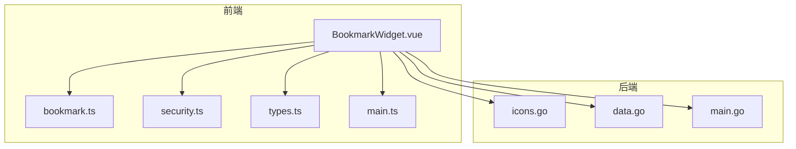
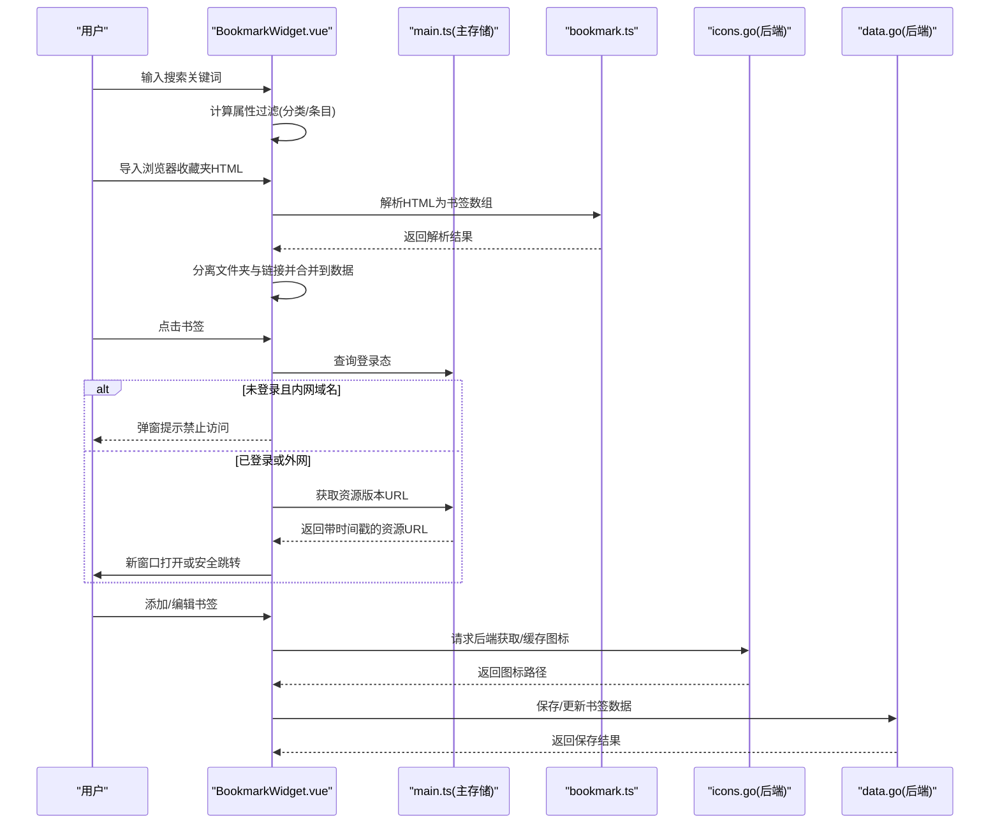
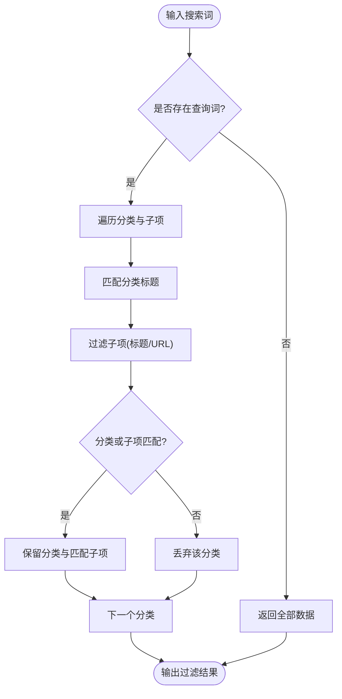
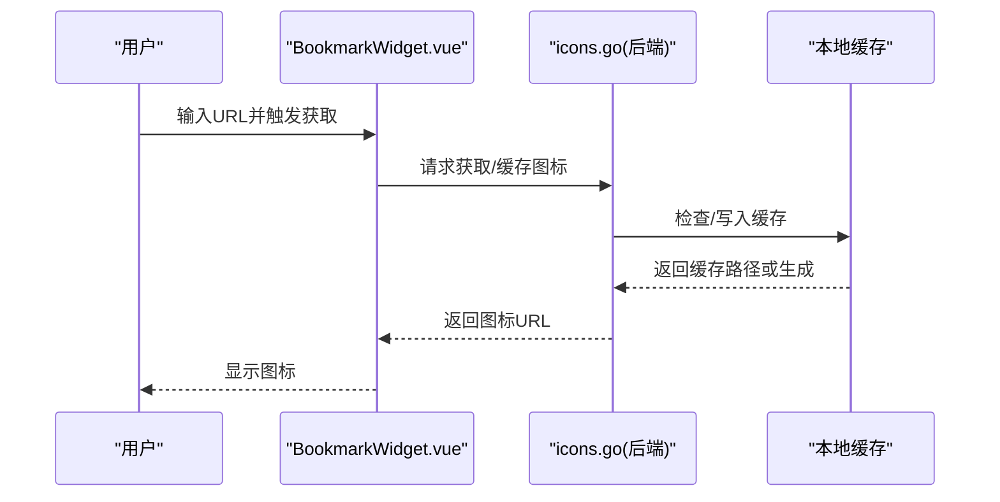
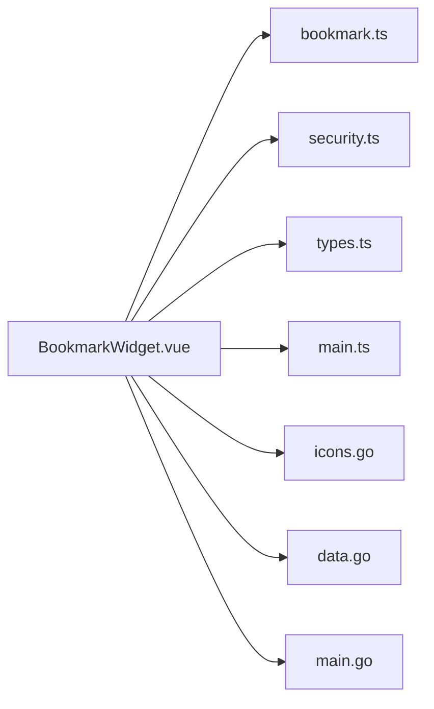

# 书签组件

<cite>
**本文档引用的文件**
- [BookmarkWidget.vue](file://frontend/src/components/BookmarkWidget.vue)
- [bookmark.ts](file://frontend/src/utils/bookmark.ts)
- [security.ts](file://frontend/src/utils/security.ts)
- [types.ts](file://frontend/src/types.ts)
- [main.ts](file://frontend/src/stores/main.ts)
- [icons.go](file://backend/handlers/icons.go)
- [data.go](file://backend/handlers/data.go)
- [main.go](file://backend/main.go)
</cite>

## 目录
1. [简介](#简介)
2. [项目结构](#项目结构)
3. [核心组件](#核心组件)
4. [架构总览](#架构总览)
5. [详细组件分析](#详细组件分析)
6. [依赖关系分析](#依赖关系分析)
7. [性能考量](#性能考量)
8. [故障排查指南](#故障排查指南)
9. [结论](#结论)
10. [附录](#附录)

## 简介
本文件为“书签组件”的完整开发文档，面向前端与后端工程师，系统阐述组件的功能实现、状态管理、响应式数据绑定、用户交互处理、导入导出流程、自动获取网站标题与图标、安全访问控制以及与主存储的集成方式。文档同时提供可视化图示、最佳实践与排障建议，帮助快速理解与扩展该组件。

## 项目结构
书签组件位于前端组件目录，配合工具模块、类型定义与主存储，形成完整的书签管理闭环；后端提供图标缓存、基础图标获取与跨域代理能力，保障图标加载与安全访问。

图表来源
- [BookmarkWidget.vue:1-574](file://frontend/src/components/BookmarkWidget.vue#L1-L574)
- [bookmark.ts:1-109](file://frontend/src/utils/bookmark.ts#L1-L109)
- [security.ts:1-52](file://frontend/src/utils/security.ts#L1-L52)
- [types.ts:265-280](file://frontend/src/types.ts#L265-L280)
- [main.ts:571-577](file://frontend/src/stores/main.ts#L571-L577)
- [icons.go:1-533](file://backend/handlers/icons.go#L1-L533)
- [data.go:1-1007](file://backend/handlers/data.go#L1-L1007)
- [main.go:165-267](file://backend/main.go#L165-L267)

章节来源
- [BookmarkWidget.vue:1-574](file://frontend/src/components/BookmarkWidget.vue#L1-L574)
- [bookmark.ts:1-109](file://frontend/src/utils/bookmark.ts#L1-L109)
- [security.ts:1-52](file://frontend/src/utils/security.ts#L1-L52)
- [types.ts:265-280](file://frontend/src/types.ts#L265-L280)
- [main.ts:571-577](file://frontend/src/stores/main.ts#L571-L577)
- [icons.go:1-533](file://backend/handlers/icons.go#L1-L533)
- [data.go:1-1007](file://backend/handlers/data.go#L1-L1007)
- [main.go:165-267](file://backend/main.go#L165-L267)

## 核心组件
- 组件职责
  - 提供书签的增删改查、分类管理、搜索过滤。
  - 支持浏览器收藏夹 HTML 导入，自动分离文件夹与链接。
  - 自动获取网站标题与图标，支持回退策略与本地缓存。
  - 安全访问控制：未登录用户禁止访问内网资源，统一处理外链跳转。
  - 本地备份与恢复：基于浏览器本地存储，保障数据持久化。
  - 响应式交互：悬浮菜单、滚动隔离、键盘回车确认等。

- 关键实现要点
  - 响应式搜索过滤：基于计算属性与深度匹配，支持分类与条目双层过滤。
  - 本地备份：使用持久化存储在首次挂载时恢复数据。
  - 图标获取：优先使用后端接口，失败时回退至第三方服务。
  - 安全跳转：未登录拦截内网域名，登录后新开窗口；否则走安全处理逻辑。

章节来源
- [BookmarkWidget.vue:13-39](file://frontend/src/components/BookmarkWidget.vue#L13-L39)
- [BookmarkWidget.vue:42-59](file://frontend/src/components/BookmarkWidget.vue#L42-L59)
- [BookmarkWidget.vue:164-184](file://frontend/src/components/BookmarkWidget.vue#L164-L184)
- [BookmarkWidget.vue:285-300](file://frontend/src/components/BookmarkWidget.vue#L285-L300)

## 架构总览
书签组件通过 Vue 组合式 API 实现状态与交互，利用 Pinia 主存储进行认证态与资源版本控制，借助后端接口完成图标缓存与安全跳转。

图表来源
- [BookmarkWidget.vue:74-135](file://frontend/src/components/BookmarkWidget.vue#L74-L135)
- [BookmarkWidget.vue:164-184](file://frontend/src/components/BookmarkWidget.vue#L164-L184)
- [BookmarkWidget.vue:285-300](file://frontend/src/components/BookmarkWidget.vue#L285-L300)
- [bookmark.ts:3-108](file://frontend/src/utils/bookmark.ts#L3-L108)
- [icons.go:279-334](file://backend/handlers/icons.go#L279-L334)
- [data.go:638-744](file://backend/handlers/data.go#L638-L744)

## 详细组件分析

### 数据模型与类型
- 书签项与分类
  - 书签项：包含唯一标识、标题、URL、图标、类型与置顶标记。
  - 分类：包含唯一标识、标题、折叠状态与子节点列表（可嵌套）。
- 组件数据结构
  - 组件通过 WidgetConfig 的 data 字段承载书签树，支持多级分类与条目混合。

章节来源
- [types.ts:265-280](file://frontend/src/types.ts#L265-L280)

### 搜索与过滤机制
- 过滤逻辑
  - 若无搜索词，返回全部数据。
  - 否则对分类标题与子项标题/URL进行大小写无关匹配，保留匹配的分类与子项。
- 性能特征
  - 基于数组映射与过滤，复杂度 O(n)；对大型书签集建议分页或虚拟滚动。

图表来源
- [BookmarkWidget.vue:15-39](file://frontend/src/components/BookmarkWidget.vue#L15-L39)

章节来源
- [BookmarkWidget.vue:15-39](file://frontend/src/components/BookmarkWidget.vue#L15-L39)

### 分类管理与增删改
- 添加分类
  - 切换到新增模式，聚焦输入框，回车确认。
- 添加/编辑书签
  - 弹出表单，支持自动获取标题与图标；提交时确保 URL 以 https 开头。
- 删除
  - 支持删除分类或单个条目，二次确认。

章节来源
- [BookmarkWidget.vue:137-162](file://frontend/src/components/BookmarkWidget.vue#L137-L162)
- [BookmarkWidget.vue:186-263](file://frontend/src/components/BookmarkWidget.vue#L186-L263)
- [BookmarkWidget.vue:265-283](file://frontend/src/components/BookmarkWidget.vue#L265-L283)

### 导入与导出
- 导入
  - 选择浏览器收藏夹 HTML 文件，解析为书签数组。
  - 将文件夹直接加入根目录；独立链接加入“默认收藏”分类。
- 导出
  - 当前组件未提供导出功能，建议通过后端配置导出接口或在主存储中统一导出。

章节来源
- [BookmarkWidget.vue:74-135](file://frontend/src/components/BookmarkWidget.vue#L74-L135)
- [bookmark.ts:3-108](file://frontend/src/utils/bookmark.ts#L3-L108)

### 自动获取标题与图标
- 流程
  - 用户输入 URL 并触发获取或失焦时自动获取。
  - 调用后端接口获取站点元信息与图标，失败时回退至第三方服务。
- 后端接口
  - 提供图标获取与缓存能力，支持 Base64 返回与本地缓存路径。

图表来源
- [BookmarkWidget.vue:164-184](file://frontend/src/components/BookmarkWidget.vue#L164-L184)
- [icons.go:108-228](file://backend/handlers/icons.go#L108-L228)
- [icons.go:279-334](file://backend/handlers/icons.go#L279-L334)

章节来源
- [BookmarkWidget.vue:164-184](file://frontend/src/components/BookmarkWidget.vue#L164-L184)
- [icons.go:108-228](file://backend/handlers/icons.go#L108-L228)
- [icons.go:279-334](file://backend/handlers/icons.go#L279-L334)

### 安全访问控制
- 未登录用户访问内网资源
  - 拦截并提示禁止访问。
- 外链跳转
  - 统一强制 HTTPS，编码 URL，避免 XSS 风险。
- 登录态判断
  - 通过主存储中的 isLogged 状态决定行为。

章节来源
- [BookmarkWidget.vue:285-300](file://frontend/src/components/BookmarkWidget.vue#L285-L300)
- [security.ts:10-51](file://frontend/src/utils/security.ts#L10-L51)
- [main.ts:167](file://frontend/src/stores/main.ts#L167)

### 状态管理与响应式绑定
- 组件内部状态
  - 搜索词、活动分类、弹窗位置、编辑状态、新增/编辑表单字段、加载状态等。
- 本地备份
  - 使用持久化存储在挂载时恢复数据，避免空数据影响体验。
- 资源版本控制
  - 主存储提供资源版本号，为图标等资源添加时间戳参数，避免缓存问题。

章节来源
- [BookmarkWidget.vue:13-72](file://frontend/src/components/BookmarkWidget.vue#L13-L72)
- [BookmarkWidget.vue:42-59](file://frontend/src/components/BookmarkWidget.vue#L42-L59)
- [main.ts:571-577](file://frontend/src/stores/main.ts#L571-L577)

### 与主存储的集成
- 认证态与资源版本
  - 通过主存储判断登录态与资源版本，用于安全跳转与资源缓存。
- 数据保存
  - 书签数据变更后，由主流程统一保存至后端（非本组件直接调用）。

章节来源
- [BookmarkWidget.vue:285-300](file://frontend/src/components/BookmarkWidget.vue#L285-L300)
- [data.go:638-744](file://backend/handlers/data.go#L638-L744)

## 依赖关系分析
- 前端依赖
  - 组件依赖工具模块进行解析与安全处理，依赖类型定义保证数据结构一致性，依赖主存储提供认证态与资源版本。
- 后端依赖
  - 书签组件通过后端接口完成图标获取与缓存，路由在主程序中集中注册。

图表来源
- [BookmarkWidget.vue:1-11](file://frontend/src/components/BookmarkWidget.vue#L1-L11)
- [bookmark.ts:1](file://frontend/src/utils/bookmark.ts#L1)
- [security.ts:1](file://frontend/src/utils/security.ts#L1)
- [types.ts:1-10](file://frontend/src/types.ts#L1-L10)
- [main.ts:1-6](file://frontend/src/stores/main.ts#L1-L6)
- [icons.go:1-27](file://backend/handlers/icons.go#L1-L27)
- [data.go:1-18](file://backend/handlers/data.go#L1-L18)
- [main.go:165-267](file://backend/main.go#L165-L267)

章节来源
- [BookmarkWidget.vue:1-11](file://frontend/src/components/BookmarkWidget.vue#L1-L11)
- [bookmark.ts:1](file://frontend/src/utils/bookmark.ts#L1)
- [security.ts:1](file://frontend/src/utils/security.ts#L1)
- [types.ts:1-10](file://frontend/src/types.ts#L1-L10)
- [main.ts:1-6](file://frontend/src/stores/main.ts#L1-L6)
- [icons.go:1-27](file://backend/handlers/icons.go#L1-L27)
- [data.go:1-18](file://backend/handlers/data.go#L1-L18)
- [main.go:165-267](file://backend/main.go#L165-L267)

## 性能考量
- 搜索过滤
  - 对于大量书签，建议采用虚拟滚动与分页，避免一次性渲染造成卡顿。
- 图标加载
  - 后端缓存与本地缓存结合，减少重复请求；对失败回退策略设置合理超时。
- 资源版本
  - 使用主存储的资源版本参数，避免缓存导致的图标不更新问题。

## 故障排查指南
- 导入失败
  - 检查文件格式是否为标准浏览器收藏夹 HTML；解析器会移除可能破坏结构的段落标签。
- 图标无法显示
  - 确认后端接口可用；检查网络代理与跨域设置；验证缓存目录权限。
- 安全跳转异常
  - 未登录访问内网资源会被拦截；外链跳转会强制 HTTPS 并进行 URL 编码。
- 数据丢失
  - 组件具备本地备份机制；若仍丢失，检查浏览器本地存储与网络状态。

章节来源
- [bookmark.ts:3-108](file://frontend/src/utils/bookmark.ts#L3-L108)
- [icons.go:108-228](file://backend/handlers/icons.go#L108-L228)
- [BookmarkWidget.vue:42-59](file://frontend/src/components/BookmarkWidget.vue#L42-L59)
- [security.ts:41-51](file://frontend/src/utils/security.ts#L41-L51)

## 结论
书签组件通过清晰的数据模型、完善的导入解析、安全的访问控制与可靠的图标缓存机制，实现了易用、稳定与可扩展的书签管理体验。建议在生产环境中结合虚拟滚动、分页与缓存策略进一步优化性能，并完善导出与批量操作能力。

## 附录
- 最佳实践
  - 使用主存储统一处理认证态与资源版本，避免重复请求。
  - 在导入流程中对异常文件进行友好提示与错误日志记录。
  - 对图标获取设置超时与重试策略，提升用户体验。
  - 对搜索过滤进行节流，避免高频输入导致的性能问题。
- 扩展建议
  - 增加书签导出功能，支持标准格式与自定义模板。
  - 支持拖拽排序与批量编辑，提升管理效率。
  - 增加书签分类的层级限制与命名规范校验。