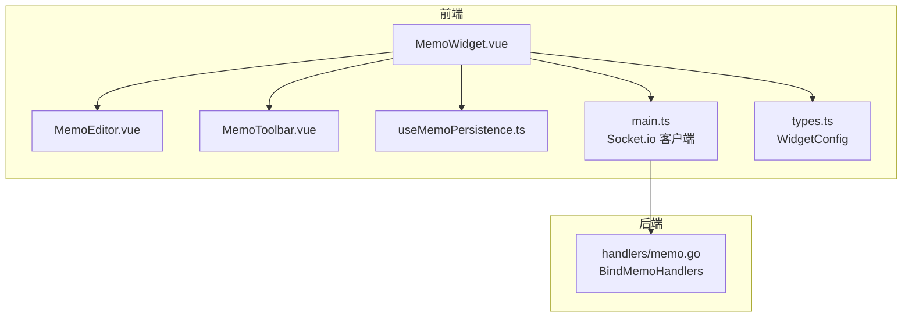
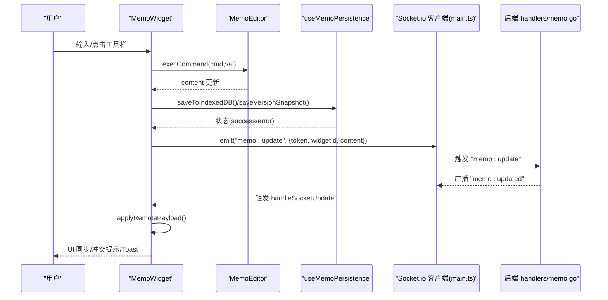
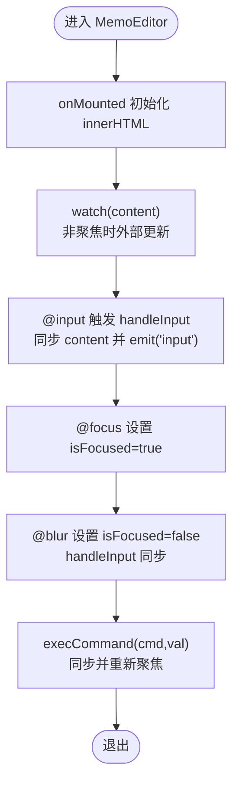
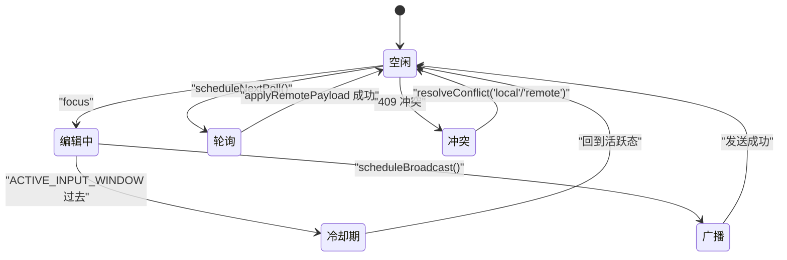
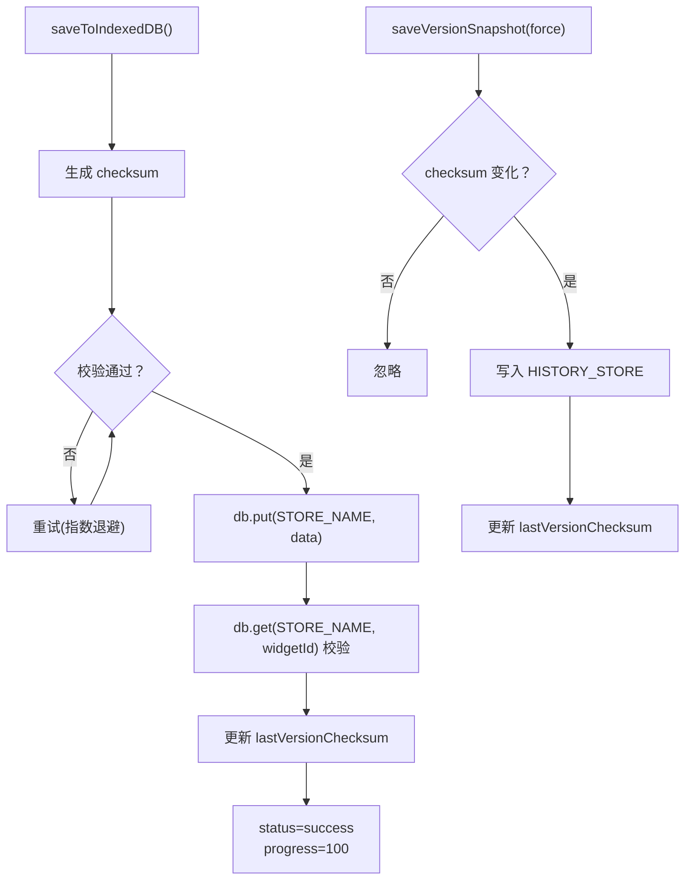
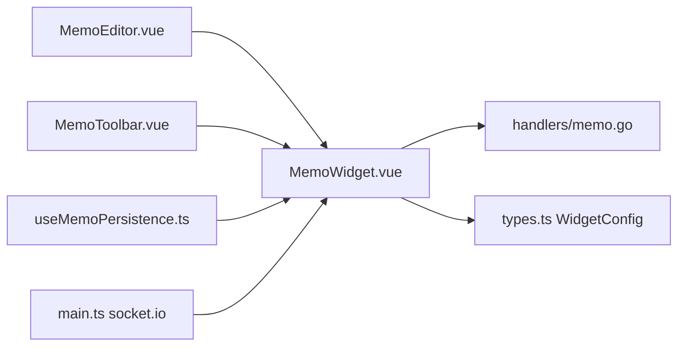

# 备忘录组件

<cite>
**本文引用的文件**
- [MemoEditor.vue](file://frontend/src/components/Memo/MemoEditor.vue)
- [MemoToolbar.vue](file://frontend/src/components/Memo/MemoToolbar.vue)
- [useMemoPersistence.ts](file://frontend/src/components/Memo/useMemoPersistence.ts)
- [MemoWidget.vue](file://frontend/src/components/MemoWidget.vue)
- [memo.go](file://backend/handlers/memo.go)
- [README.md](file://frontend/src/components/Memo/README.md)
- [MemoWidget.spec.ts](file://frontend/src/components/MemoWidget.spec.ts)
- [main.ts](file://frontend/src/stores/main.ts)
- [types.ts](file://frontend/src/types.ts)
</cite>

## 目录
1. [简介](#简介)
2. [项目结构](#项目结构)
3. [核心组件](#核心组件)
4. [架构总览](#架构总览)
5. [详细组件分析](#详细组件分析)
6. [依赖关系分析](#依赖关系分析)
7. [性能考虑](#性能考虑)
8. [故障排查指南](#故障排查指南)
9. [结论](#结论)
10. [附录](#附录)

## 简介
本指南面向需要在前端应用中实现“备忘录组件”的开发者，系统讲解该组件的创建、编辑、保存与删除流程，富文本编辑器集成、Markdown 支持与实时预览机制，以及持久化存储、版本控制与冲突解决策略。同时提供生命周期管理、状态同步、性能优化与用户体验优化方案，帮助你快速上手并高质量交付。

## 项目结构
备忘录组件由前端 Vue 组件与后端 Socket.IO 事件处理构成，核心文件如下：
- 前端组件层：MemoEditor（富文本编辑器）、MemoToolbar（工具栏）、MemoWidget（业务容器）
- 前端持久化层：useMemoPersistence（IndexedDB + 版本快照 + 校验）
- 后端事件层：memo.go（Socket.IO 事件绑定与广播）

图表来源
- [MemoWidget.vue:1-1301](file://frontend/src/components/MemoWidget.vue#L1-L1301)
- [MemoEditor.vue:1-113](file://frontend/src/components/Memo/MemoEditor.vue#L1-L113)
- [MemoToolbar.vue:1-98](file://frontend/src/components/Memo/MemoToolbar.vue#L1-L98)
- [useMemoPersistence.ts:1-219](file://frontend/src/components/Memo/useMemoPersistence.ts#L1-L219)
- [main.ts:1-800](file://frontend/src/stores/main.ts#L1-L800)
- [types.ts:202-224](file://frontend/src/types.ts#L202-L224)
- [memo.go:25-39](file://backend/handlers/memo.go#L25-L39)

章节来源
- [MemoWidget.vue:1-1301](file://frontend/src/components/MemoWidget.vue#L1-L1301)
- [MemoEditor.vue:1-113](file://frontend/src/components/Memo/MemoEditor.vue#L1-L113)
- [MemoToolbar.vue:1-98](file://frontend/src/components/Memo/MemoToolbar.vue#L1-L98)
- [useMemoPersistence.ts:1-219](file://frontend/src/components/Memo/useMemoPersistence.ts#L1-L219)
- [main.ts:1-800](file://frontend/src/stores/main.ts#L1-L800)
- [types.ts:202-224](file://frontend/src/types.ts#L202-L224)
- [memo.go:25-39](file://backend/handlers/memo.go#L25-L39)

## 核心组件
- MemoEditor：基于 contenteditable 的富文本编辑器，负责输入、焦点、光标同步与命令执行。
- MemoToolbar：富文本格式化工具栏，提供加粗、斜体、标题、列表、代码块、引用等常用命令。
- MemoWidget：业务容器，负责模式切换（简单/富文本）、本地与服务器同步、冲突检测与解决、轮询与广播、版本管理、持久化触发与状态反馈。
- useMemoPersistence：封装 IndexedDB 存储、校验与版本快照，提供保存、加载、版本查询与删除能力。
- 后端 memo.go：监听 Socket.IO 事件“memo:update”，验证令牌后广播“memo:updated”。

章节来源
- [MemoEditor.vue:1-113](file://frontend/src/components/Memo/MemoEditor.vue#L1-L113)
- [MemoToolbar.vue:1-98](file://frontend/src/components/Memo/MemoToolbar.vue#L1-L98)
- [MemoWidget.vue:1-1301](file://frontend/src/components/MemoWidget.vue#L1-L1301)
- [useMemoPersistence.ts:1-219](file://frontend/src/components/Memo/useMemoPersistence.ts#L1-L219)
- [memo.go:25-39](file://backend/handlers/memo.go#L25-L39)

## 架构总览
备忘录组件采用“前端双轨制”：本地 IndexedDB 持久化 + 服务器同步。编辑器支持简单文本与富文本两种模式，富文本模式下通过 MemoToolbar 触发 document.execCommand，再由 MemoEditor 将变更同步到本地状态。MemoWidget 负责：
- 在线/离线/静默/活跃态下的同步策略
- 广播（WebSocket）与轮询（HTTP）双通道兜底
- 冲突检测与解决（409 冲突）
- 版本快照与历史版本管理
- 三重反馈（按钮动画、Toast、进度条）

图表来源
- [MemoWidget.vue:110-137](file://frontend/src/components/MemoWidget.vue#L110-L137)
- [MemoEditor.vue:44-50](file://frontend/src/components/Memo/MemoEditor.vue#L44-L50)
- [useMemoPersistence.ts:76-121](file://frontend/src/components/Memo/useMemoPersistence.ts#L76-L121)
- [main.ts:32-36](file://frontend/src/stores/main.ts#L32-L36)
- [memo.go:25-39](file://backend/handlers/memo.go#L25-L39)

## 详细组件分析

### MemoEditor 富文本编辑器
- 能力
  - contenteditable 容器，支持占位符、空态样式、滚动与焦点管理
  - 输入/聚焦/失焦事件驱动，确保与父组件双向同步
  - 执行 document.execCommand 并自动聚焦，保持光标稳定
- 关键点
  - 外部值变化时仅在非聚焦状态下更新 innerHTML，避免光标跳动
  - blur 时强制一次同步，保证最终一致性
- 样式
  - 内置 h1/h2、ul、pre、blockquote 等标签样式，适配富文本渲染

图表来源
- [MemoEditor.vue:19-50](file://frontend/src/components/Memo/MemoEditor.vue#L19-L50)

章节来源
- [MemoEditor.vue:1-113](file://frontend/src/components/Memo/MemoEditor.vue#L1-L113)

### MemoToolbar 工具栏
- 能力
  - 提供常用格式化命令（加粗、斜体、标题、列表、代码块、引用）
  - 分隔符与图标/文字混合显示
  - 通过 emit('command', cmd, val) 将命令传递给父组件
- 交互
  - 按钮具备可访问性属性（aria-label/title）
  - 支持键盘导航与点击

章节来源
- [MemoToolbar.vue:1-98](file://frontend/src/components/Memo/MemoToolbar.vue#L1-L98)

### MemoWidget 业务容器
- 模式与切换
  - simple/rich 双模式，切换时自动保存并触发服务器同步
- 编辑与输入
  - focus/blur 管理编辑态与自动保存窗口
  - input 活动触发广播与轮询调度
- 同步策略
  - WebSocket 优先（socket.io），失败时回退 HTTP 轮询
  - 广播节流与指数退避重试
- 冲突解决
  - 409 冲突时解析远端 payload，比较内容与模式
  - 提供本地覆盖或使用云端版本的选择
- 版本管理
  - 保存时生成版本快照，支持历史版本浏览、删除与恢复
- 三重反馈
  - 按钮动画（成功脉冲）、Toast 提示、进度条

图表来源
- [MemoWidget.vue:624-673](file://frontend/src/components/MemoWidget.vue#L624-L673)
- [MemoWidget.vue:308-462](file://frontend/src/components/MemoWidget.vue#L308-L462)
- [MemoWidget.vue:464-491](file://frontend/src/components/MemoWidget.vue#L464-L491)

章节来源
- [MemoWidget.vue:1-1301](file://frontend/src/components/MemoWidget.vue#L1-L1301)

### useMemoPersistence 持久化与版本控制
- 数据模型
  - MemoData：id、content、mode、updatedAt、checksum
  - MemoVersion：版本快照，含 widgetId、content、mode、updatedAt、checksum
- IndexedDB 设计
  - 主存储：memos（按 widgetId 键）
  - 历史存储：memo_versions（索引 by-widget）
- 校验与迁移
  - 写入前后校验 checksum，失败自动重试最多 3 次
  - 首次加载若无 IndexedDB 数据，尝试从旧 LocalStorage 兼容导入
- 版本快照
  - saveVersionSnapshot 仅在内容变化时写入
  - loadVersions 返回按 updatedAt 降序的历史版本

图表来源
- [useMemoPersistence.ts:76-121](file://frontend/src/components/Memo/useMemoPersistence.ts#L76-L121)
- [useMemoPersistence.ts:166-187](file://frontend/src/components/Memo/useMemoPersistence.ts#L166-L187)

章节来源
- [useMemoPersistence.ts:1-219](file://frontend/src/components/Memo/useMemoPersistence.ts#L1-L219)

### 后端 Socket.IO 事件处理
- 事件绑定
  - “memo:update”：接收 token/widgetId/content，校验 JWT 后广播“memo:updated”
- 用途
  - 前端通过 socket.emit("memo:update", payload) 实现跨设备/多标签页实时同步

章节来源
- [memo.go:25-39](file://backend/handlers/memo.go#L25-L39)
- [memo.go:98-121](file://backend/handlers/memo.go#L98-L121)
- [memo.go:204-225](file://backend/handlers/memo.go#L204-L225)

## 依赖关系分析
- 组件依赖
  - MemoWidget 依赖 MemoEditor、MemoToolbar、useMemoPersistence、main.ts（socket）、types.ts（WidgetConfig）
- 外部依赖
  - IndexedDB（idb 库）：持久化与校验
  - Socket.io 客户端：实时广播
  - 后端 handlers/memo.go：事件处理与广播
- 数据契约
  - 前端向后端 PUT /api/memo/:id，携带 content、server_ts、mode、client_request_id、X-Idempotency-Key
  - 后端返回 data.data（含 content、server_ts、mode）或 409 冲突

图表来源
- [MemoWidget.vue:1-1301](file://frontend/src/components/MemoWidget.vue#L1-L1301)
- [MemoEditor.vue:1-113](file://frontend/src/components/Memo/MemoEditor.vue#L1-L113)
- [MemoToolbar.vue:1-98](file://frontend/src/components/Memo/MemoToolbar.vue#L1-L98)
- [useMemoPersistence.ts:1-219](file://frontend/src/components/Memo/useMemoPersistence.ts#L1-L219)
- [main.ts:1-800](file://frontend/src/stores/main.ts#L1-L800)
- [types.ts:202-224](file://frontend/src/types.ts#L202-L224)
- [memo.go:25-39](file://backend/handlers/memo.go#L25-L39)

章节来源
- [MemoWidget.vue:1-1301](file://frontend/src/components/MemoWidget.vue#L1-L1301)
- [main.ts:1-800](file://frontend/src/stores/main.ts#L1-L800)
- [types.ts:202-224](file://frontend/src/types.ts#L202-L224)
- [memo.go:25-39](file://backend/handlers/memo.go#L25-L39)

## 性能考虑
- 编辑体验
  - 非聚焦时才允许外部更新 innerHTML，避免光标跳动
  - 广播节流与指数退避，降低网络压力
- 存储与校验
  - IndexedDB 替代 LocalStorage，容量更大，写入失败自动重试
  - checksum 校验保障数据一致性
- 轮询与广播
  - WebSocket 优先，失败回退 HTTP 轮询，带退避策略
  - 页面不可见时降低轮询频率，可见后根据活跃度动态调整
- UI 反馈
  - 三重反馈（按钮动画、Toast、进度条）提升感知质量

章节来源
- [MemoEditor.vue:19-50](file://frontend/src/components/Memo/MemoEditor.vue#L19-L50)
- [MemoWidget.vue:518-576](file://frontend/src/components/MemoWidget.vue#L518-L576)
- [MemoWidget.vue:581-622](file://frontend/src/components/MemoWidget.vue#L581-L622)
- [useMemoPersistence.ts:76-121](file://frontend/src/components/Memo/useMemoPersistence.ts#L76-L121)

## 故障排查指南
- 保存失败
  - 检查 status 与 progress，观察是否触发错误状态与 Sentry 上报
  - 确认 IndexedDB 是否写入成功，校验 checksum 是否一致
- 冲突解决
  - 409 冲突时，对比远端 content/mode/server_ts，选择本地覆盖或使用云端
  - 若签名相同且处于冷却期内，等待冷却后再重试
- 网络异常
  - WebSocket 不稳定时回退 HTTP 轮询，检查轮询间隔与退避策略
  - 离线场景下，本地 IndexedDB 仍可工作，上线后自动重试
- 版本历史
  - 无法加载历史时，检查 HISTORY_STORE 索引与对象存储是否存在
  - 删除版本后，确认 selectedVersionId 是否回退到“新建”

章节来源
- [useMemoPersistence.ts:112-121](file://frontend/src/components/Memo/useMemoPersistence.ts#L112-L121)
- [MemoWidget.vue:346-425](file://frontend/src/components/MemoWidget.vue#L346-L425)
- [MemoWidget.vue:518-576](file://frontend/src/components/MemoWidget.vue#L518-L576)

## 结论
备忘录组件通过“富文本编辑器 + 工具栏 + 双轨同步 + 版本快照 + 冲突解决”的完整闭环，实现了高可用、强一致与良好用户体验的备忘录功能。前端以 IndexedDB 与 Socket.IO 为核心，后端以事件广播为纽带，形成稳定的分布式协作基础。建议在实际项目中结合业务场景进一步扩展 Markdown 支持与更丰富的预览能力。

## 附录

### 创建、编辑、保存与删除流程
- 创建
  - 切换到富文本模式，点击“保存”按钮触发本地与服务器保存
  - 保存成功后生成版本快照，历史版本列表更新
- 编辑
  - 简单模式：直接输入文本
  - 富文本模式：使用 MemoToolbar 格式化，MemoEditor 同步变更
- 保存
  - 触发 useMemoPersistence.saveToIndexedDB 与 saveVersionSnapshot
  - 同步到服务器，处理 409 冲突
- 删除
  - 在版本菜单中选择历史版本并删除，或新建空白备忘

章节来源
- [MemoWidget.vue:125-137](file://frontend/src/components/MemoWidget.vue#L125-L137)
- [MemoWidget.vue:780-813](file://frontend/src/components/MemoWidget.vue#L780-L813)
- [useMemoPersistence.ts:166-187](file://frontend/src/components/Memo/useMemoPersistence.ts#L166-L187)

### Markdown 支持与实时预览
- 当前实现
  - 富文本模式下通过 document.execCommand 与内联样式渲染标题、列表、代码块、引用等
  - 未内置 Markdown 解析器与实时预览
- 建议
  - 可引入 Markdown 解析库（如 marked 或 remark）与预览面板
  - 保持与现有富文本编辑器的互斥切换，避免双重渲染

章节来源
- [MemoEditor.vue:76-112](file://frontend/src/components/Memo/MemoEditor.vue#L76-L112)
- [MemoWidget.vue:139-142](file://frontend/src/components/MemoWidget.vue#L139-L142)

### 生命周期管理与状态同步
- 生命周期
  - onMounted：初始化同步模式、绑定事件、启动轮询
  - onUnmounted：清理定时器、取消监听、触发 beforeunload 保存
- 状态同步
  - WebSocket 连接状态变化时，立即切换同步策略
  - 页面可见性变化影响轮询节奏与保存时机

章节来源
- [MemoWidget.vue:944-984](file://frontend/src/components/MemoWidget.vue#L944-L984)
- [MemoWidget.vue:675-681](file://frontend/src/components/MemoWidget.vue#L675-L681)

### 用户体验优化
- 三重反馈
  - 按钮动画（成功脉冲）、Toast 提示、进度条
- 键盘与无障碍
  - 支持键盘导航（版本菜单上下键、回车选择、Esc 关闭）
  - 按钮具备 aria-label/title，满足可访问性要求
- 模式切换
  - 一键切换简单/富文本模式，自动保存并同步

章节来源
- [MemoWidget.vue:1078-1100](file://frontend/src/components/MemoWidget.vue#L1078-L1100)
- [MemoWidget.vue:815-846](file://frontend/src/components/MemoWidget.vue#L815-L846)
- [MemoToolbar.vue:70-97](file://frontend/src/components/Memo/MemoToolbar.vue#L70-L97)

### 开发与测试
- 单元测试要点
  - 渲染与交互（模式切换、保存按钮）
  - 持久化流程（IndexedDB 写入、校验、重试）
  - 异常与重试（网络错误、离线场景）
- 测试参考
  - MemoWidget.spec.ts 展示了富文本模式保存、离线重试与隧道延迟场景的断言

章节来源
- [MemoWidget.spec.ts:1-195](file://frontend/src/components/MemoWidget.spec.ts#L1-L195)
- [README.md:47-57](file://frontend/src/components/Memo/README.md#L47-L57)