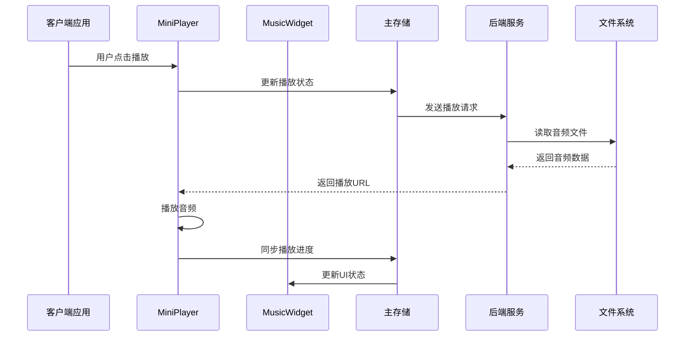
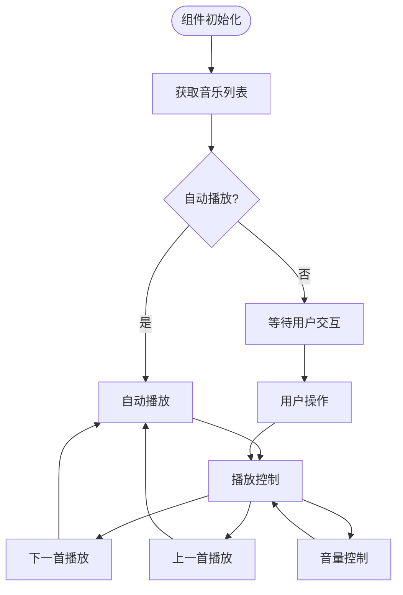
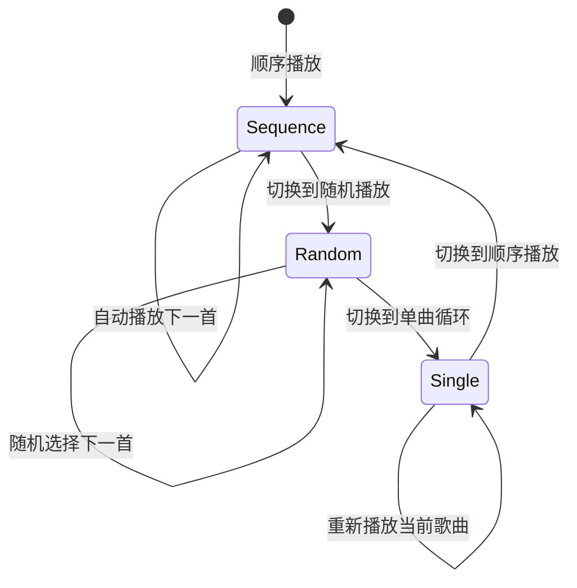
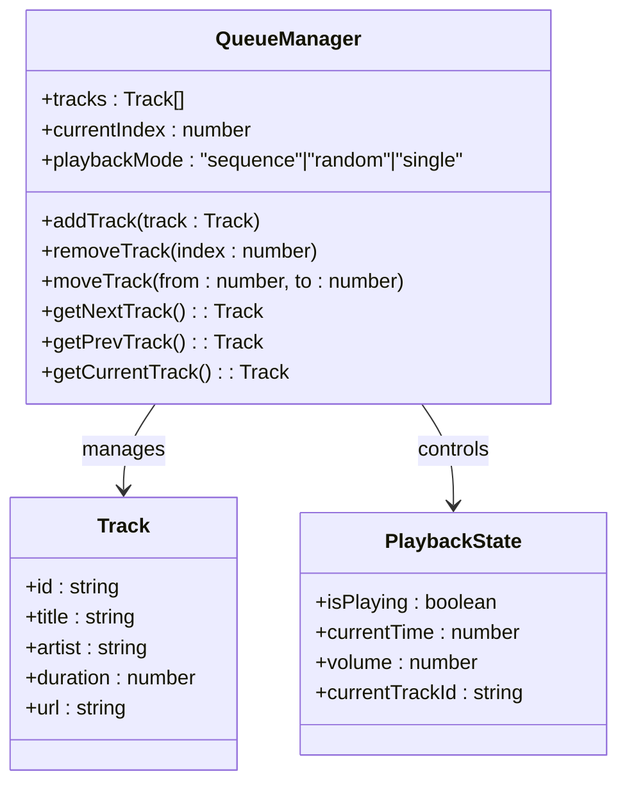
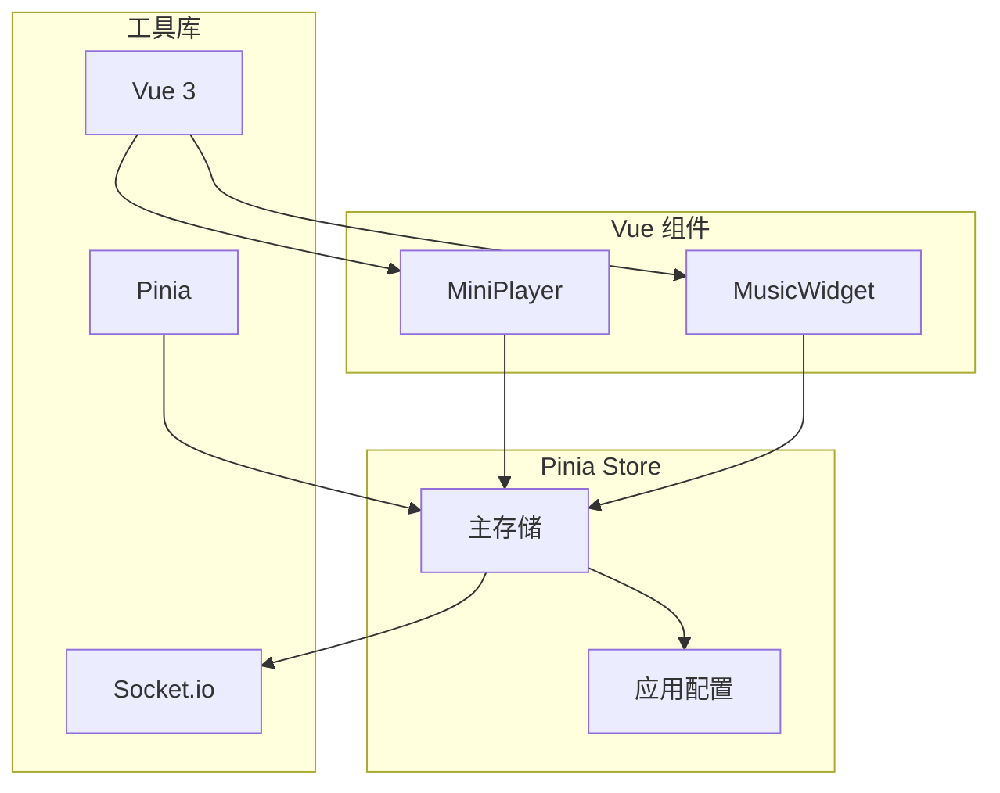
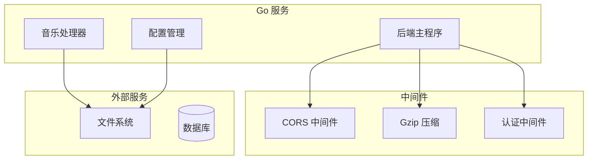
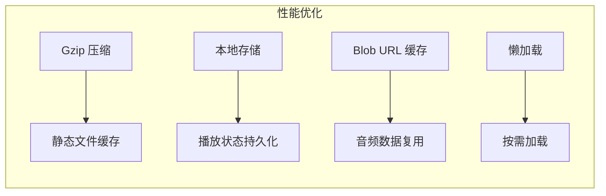

# 音乐播放组件

<cite>
**本文档引用的文件**
- [backend/main.go](file://backend/main.go)
- [backend/handlers/music.go](file://backend/handlers/music.go)
- [backend/config/config.go](file://backend/config/config.go)
- [frontend/src/components/MiniPlayer.vue](file://frontend/src/components/MiniPlayer.vue)
- [frontend/src/components/MusicWidget.vue](file://frontend/src/components/MusicWidget.vue)
- [frontend/src/stores/main.ts](file://frontend/src/stores/main.ts)
</cite>

## 目录
1. [简介](#简介)
2. [项目结构](#项目结构)
3. [核心组件](#核心组件)
4. [架构概览](#架构概览)
5. [详细组件分析](#详细组件分析)
6. [依赖关系分析](#依赖关系分析)
7. [性能考虑](#性能考虑)
8. [故障排除指南](#故障排除指南)
9. [结论](#结论)

## 简介

音乐播放组件是 FlatNas 应用程序中的核心功能模块，提供了完整的音乐播放体验。该组件支持多种音频格式、播放列表管理、歌词显示和多种播放模式。

主要功能特性：
- 音频文件播放、暂停、上一首/下一首切换
- 音量控制和播放进度管理
- 播放列表管理、随机播放和单曲循环模式
- 音乐文件上传、存储和播放队列管理
- 播放进度条实现、歌词显示和播放状态同步
- 多种可视化效果（频谱分析、抽象动画、黑胶唱片）

## 项目结构

音乐播放组件采用前后端分离的架构设计：

```mermaid
graph TB
subgraph "前端层"
MP[MiniPlayer 组件]
MW[MusicWidget 组件]
MS[主存储(store)]
end
subgraph "后端层"
BM[后端主程序]
HM[音乐处理器]
CFG[配置管理]
end
subgraph "存储层"
FS[文件系统]
MD[音乐目录]
end
MP --> MS
MW --> MS
MS --> BM
BM --> HM
HM --> CFG
CFG --> FS
FS --> MD
```

**图表来源**
- [backend/main.go:25-267](file://backend/main.go#L25-L267)
- [frontend/src/components/MiniPlayer.vue:1-400](file://frontend/src/components/MiniPlayer.vue#L1-L400)
- [frontend/src/components/MusicWidget.vue:1-800](file://frontend/src/components/MusicWidget.vue#L1-L800)

**章节来源**
- [backend/main.go:165-254](file://backend/main.go#L165-L254)
- [backend/config/config.go:35-86](file://backend/config/config.go#L35-L86)

## 核心组件

### 后端音乐处理

后端提供了完整的音乐处理能力，包括文件上传、静态文件服务和API路由管理。

**章节来源**
- [backend/handlers/music.go:13-56](file://backend/handlers/music.go#L13-L56)
- [backend/main.go:197-236](file://backend/main.go#L197-L236)

### 前端播放器组件

前端实现了两个主要的播放器组件：MiniPlayer 和 MusicWidget，提供不同的用户体验。

**章节来源**
- [frontend/src/components/MiniPlayer.vue:1-400](file://frontend/src/components/MiniPlayer.vue#L1-L400)
- [frontend/src/components/MusicWidget.vue:1-800](file://frontend/src/components/MusicWidget.vue#L1-L800)

## 架构概览

音乐播放系统的整体架构采用客户端-服务器模型：



**图表来源**
- [frontend/src/components/MiniPlayer.vue:151-182](file://frontend/src/components/MiniPlayer.vue#L151-L182)
- [frontend/src/components/MusicWidget.vue:1283-1321](file://frontend/src/components/MusicWidget.vue#L1283-L1321)

## 详细组件分析

### MiniPlayer 组件

MiniPlayer 是一个轻量级的播放器组件，适合在仪表板中显示基本的播放控制。

#### 核心功能实现



**图表来源**
- [frontend/src/components/MiniPlayer.vue:80-132](file://frontend/src/components/MiniPlayer.vue#L80-L132)
- [frontend/src/components/MiniPlayer.vue:151-182](file://frontend/src/components/MiniPlayer.vue#L151-L182)

#### 播放控制逻辑

MiniPlayer 实现了完整的播放控制功能：

**章节来源**
- [frontend/src/components/MiniPlayer.vue:80-132](file://frontend/src/components/MiniPlayer.vue#L80-L132)
- [frontend/src/components/MiniPlayer.vue:151-182](file://frontend/src/components/MiniPlayer.vue#L151-L182)

### MusicWidget 组件

MusicWidget 提供了完整的音乐播放体验，包含播放列表管理、歌词显示和多种可视化效果。

#### 播放模式管理



**图表来源**
- [frontend/src/components/MusicWidget.vue:1323-1334](file://frontend/src/components/MusicWidget.vue#L1323-L1334)
- [frontend/src/components/MusicWidget.vue:1336-1371](file://frontend/src/components/MusicWidget.vue#L1336-L1371)

#### 歌词显示系统

MusicWidget 内置了强大的歌词显示功能：

**章节来源**
- [frontend/src/components/MusicWidget.vue:1087-1148](file://frontend/src/components/MusicWidget.vue#L1087-L1148)
- [frontend/src/components/MusicWidget.vue:2480-2522](file://frontend/src/components/MusicWidget.vue#L2480-L2522)

### 播放队列管理系统



**图表来源**
- [frontend/src/components/MusicWidget.vue:66-101](file://frontend/src/components/MusicWidget.vue#L66-L101)
- [frontend/src/components/MusicWidget.vue:1386-1468](file://frontend/src/components/MusicWidget.vue#L1386-L1468)

**章节来源**
- [frontend/src/components/MusicWidget.vue:1386-1468](file://frontend/src/components/MusicWidget.vue#L1386-L1468)

## 依赖关系分析

### 前端依赖关系



**图表来源**
- [frontend/src/stores/main.ts:30-50](file://frontend/src/stores/main.ts#L30-L50)
- [frontend/src/components/MiniPlayer.vue:1-10](file://frontend/src/components/MiniPlayer.vue#L1-L10)

### 后端依赖关系



**图表来源**
- [backend/main.go:34-47](file://backend/main.go#L34-L47)
- [backend/main.go:165-254](file://backend/main.go#L165-L254)

**章节来源**
- [backend/main.go:34-47](file://backend/main.go#L34-L47)
- [backend/config/config.go:93-100](file://backend/config/config.go#L93-L100)

## 性能考虑

### 缓存策略

系统采用了多层次的缓存策略来优化性能：

1. **静态文件缓存**：通过 Gzip 压缩和合理的缓存头减少带宽使用
2. **播放状态缓存**：本地存储播放状态，支持断点续播
3. **音频流缓存**：使用 Blob URL 缓存音频数据，避免重复下载

### 性能优化技术



**章节来源**
- [backend/main.go:42-46](file://backend/main.go#L42-L46)
- [frontend/src/components/MusicWidget.vue:1387-1422](file://frontend/src/components/MusicWidget.vue#L1387-L1422)

## 故障排除指南

### 常见问题及解决方案

#### 音频播放失败

**症状**：点击播放按钮无响应或报错

**可能原因**：
1. 浏览器自动播放策略限制
2. 音频格式不支持
3. 网络连接问题

**解决方法**：
1. 确保用户有明确的交互行为后再触发播放
2. 检查音频文件格式是否在支持列表中
3. 验证网络连接和文件路径

#### 播放列表为空

**症状**：音乐列表显示为空

**可能原因**：
1. 音乐文件未正确上传
2. 文件路径配置错误
3. 权限问题

**解决方法**：
1. 检查音乐文件上传状态
2. 验证配置文件中的音乐目录设置
3. 确认文件权限和访问权限

**章节来源**
- [frontend/src/components/MiniPlayer.vue:144-148](file://frontend/src/components/MiniPlayer.vue#L144-L148)
- [frontend/src/components/MusicWidget.vue:1504-1520](file://frontend/src/components/MusicWidget.vue#L1504-L1520)

## 结论

音乐播放组件提供了完整而高效的音乐播放解决方案。通过精心设计的前后端架构、丰富的功能特性和完善的性能优化策略，该组件能够满足各种音乐播放需求。

主要优势：
- **多格式支持**：支持 MP3、FLAC、WAV、M4A、OGG 等主流音频格式
- **灵活的播放模式**：顺序播放、随机播放、单曲循环
- **丰富的用户体验**：歌词显示、多种可视化效果、播放列表管理
- **高性能设计**：多层次缓存策略、优化的音频流处理
- **易于扩展**：模块化的架构设计便于功能扩展和维护

该组件为 FlatNas 应用程序提供了坚实的音乐播放基础，为用户创造了优质的音乐体验。