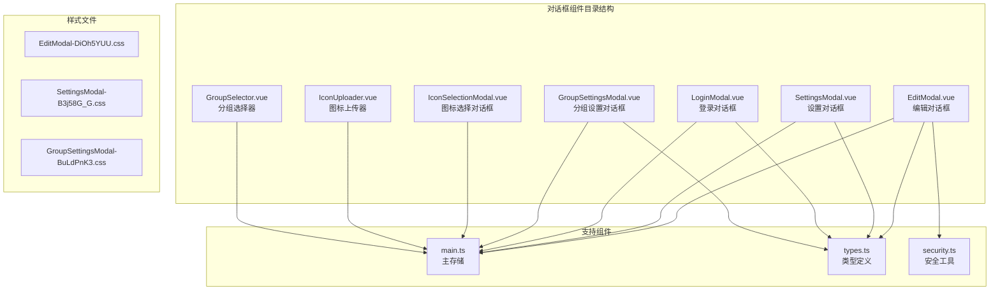
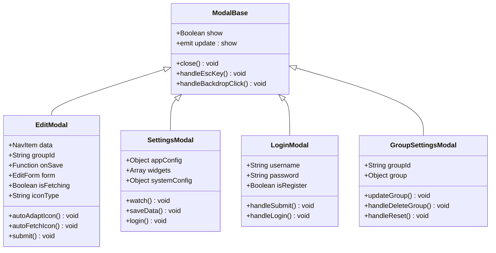
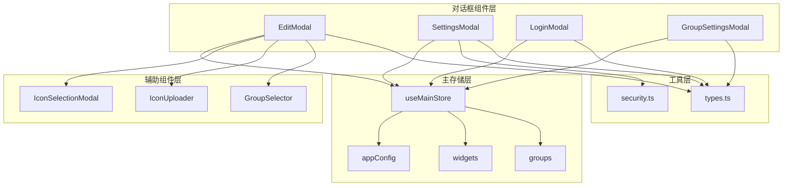
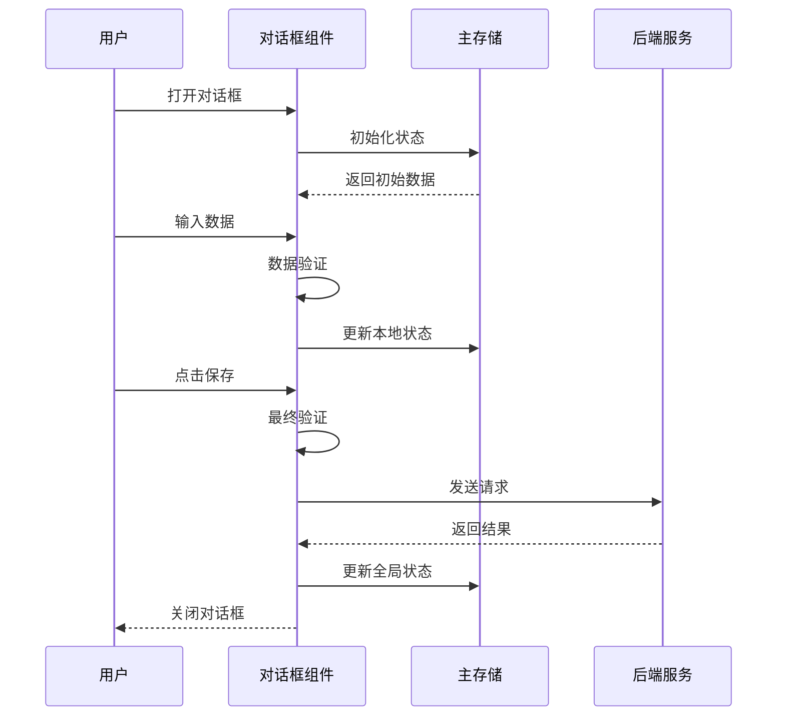
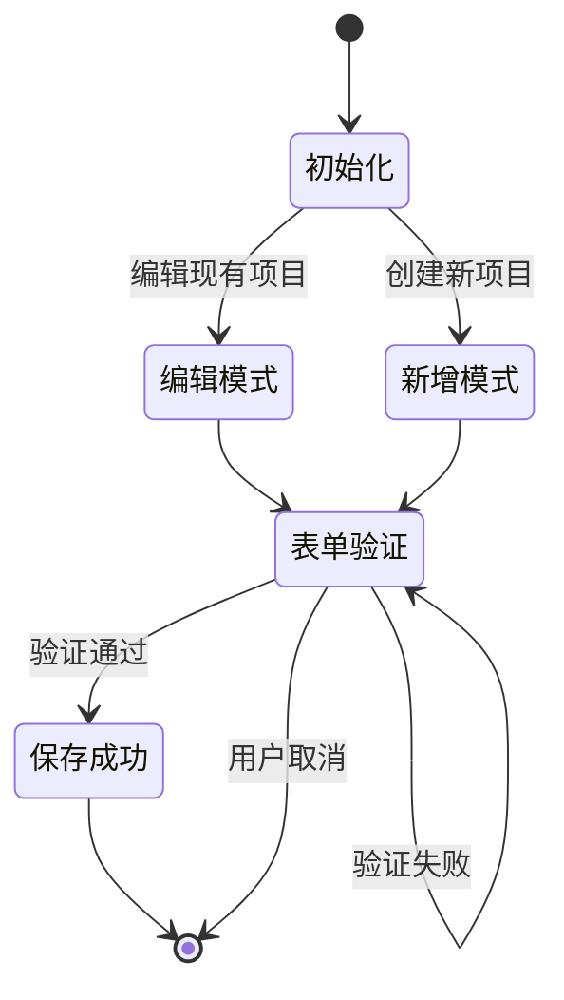
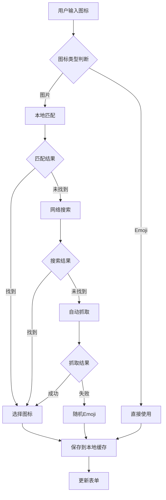
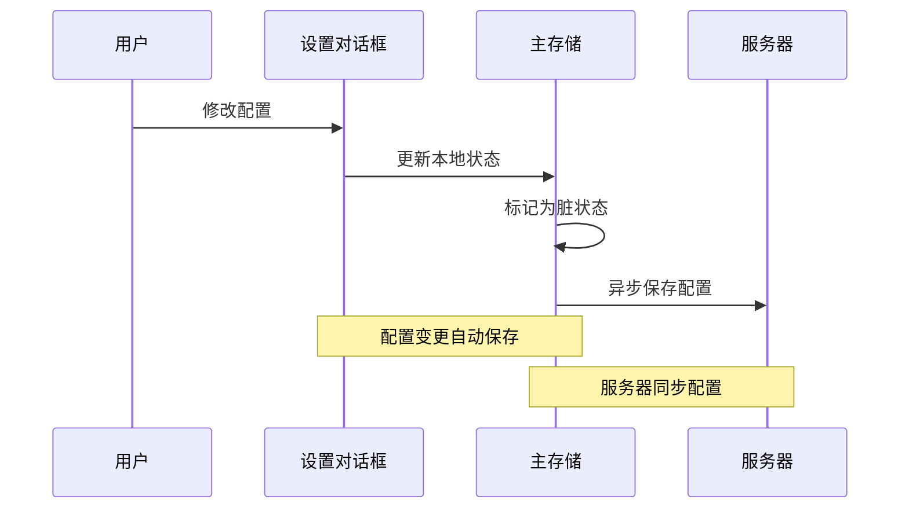
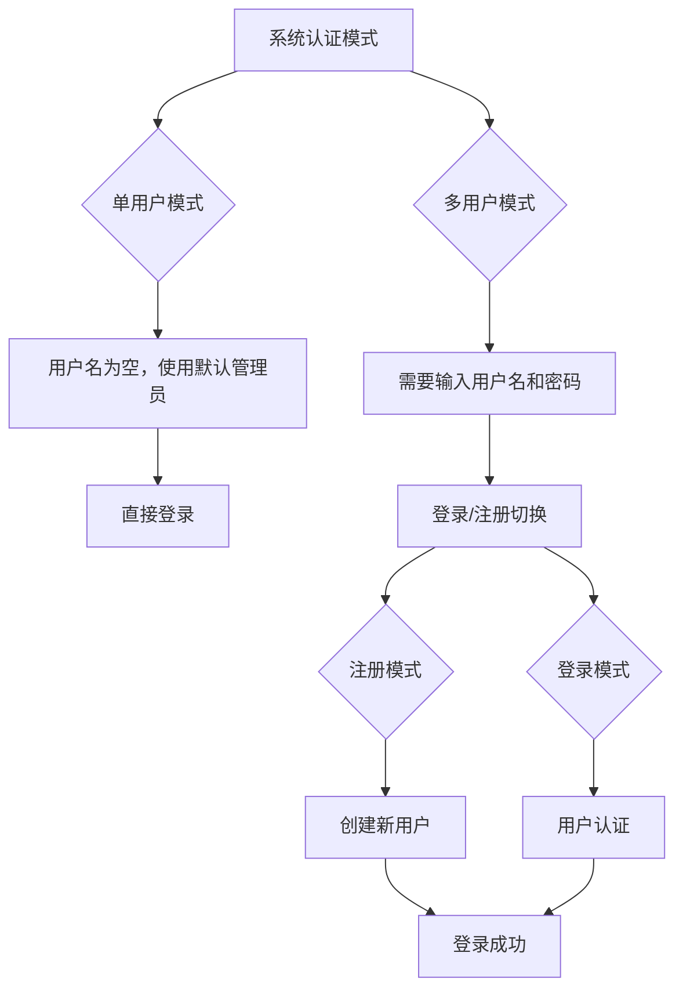
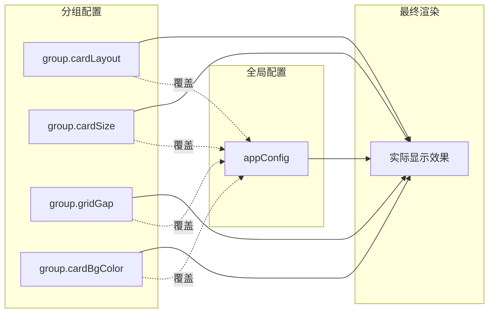
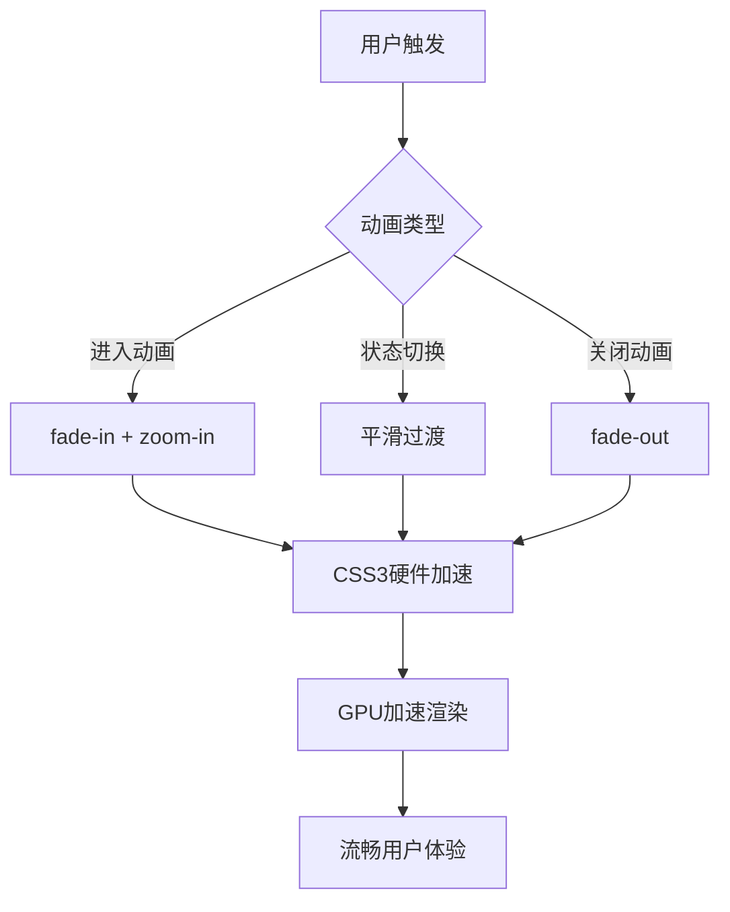

# 对话框组件

<cite>
**本文档引用的文件**
- [EditModal.vue](file://frontend/src/components/EditModal.vue)
- [SettingsModal.vue](file://frontend/src/components/SettingsModal.vue)
- [LoginModal.vue](file://frontend/src/components/LoginModal.vue)
- [GroupSettingsModal.vue](file://frontend/src/components/GroupSettingsModal.vue)
- [IconSelectionModal.vue](file://frontend/src/components/IconSelectionModal.vue)
- [IconUploader.vue](file://frontend/src/components/IconUploader.vue)
- [GroupSelector.vue](file://frontend/src/components/GroupSelector.vue)
- [main.ts](file://frontend/src/stores/main.ts)
- [types.ts](file://frontend/src/types.ts)
- [security.ts](file://frontend/src/utils/security.ts)
- [EditModal-DiOh5YUU.css](file://server/public/assets/EditModal-DiOh5YUU.css)
- [SettingsModal-B3j58G_G.css](file://server/public/assets/SettingsModal-B3j58G_G.css)
- [GroupSettingsModal-BuLdPnK3.css](file://server/public/assets/GroupSettingsModal-BuLdPnK3.css)
</cite>

## 目录
1. [简介](#简介)
2. [项目结构](#项目结构)
3. [核心组件](#核心组件)
4. [架构概览](#架构概览)
5. [详细组件分析](#详细组件分析)
6. [依赖关系分析](#依赖关系分析)
7. [性能考虑](#性能考虑)
8. [故障排除指南](#故障排除指南)
9. [结论](#结论)

## 简介

OFlatNas 对话框组件是整个前端应用的重要交互模块，提供了丰富的模态对话框功能，包括编辑对话框、设置对话框、登录对话框和分组设置对话框。这些组件采用现代化的 Vue 3 Composition API 构建，实现了完整的状态管理、动画效果和键盘交互功能。

本文档深入解析了各种模态对话框的实现原理，包括状态管理机制、动画效果设计、键盘交互处理、生命周期管理和数据验证流程。同时涵盖了可访问性设计、响应式适配和用户体验优化方案。

## 项目结构

OFlatNas 对话框组件位于前端项目的 `src/components` 目录下，采用按功能模块组织的结构：



**图表来源**
- [EditModal.vue:1-50](file://frontend/src/components/EditModal.vue#L1-L50)
- [SettingsModal.vue:1-50](file://frontend/src/components/SettingsModal.vue#L1-L50)
- [main.ts:1-50](file://frontend/src/stores/main.ts#L1-L50)

**章节来源**
- [EditModal.vue:1-1588](file://frontend/src/components/EditModal.vue#L1-L1588)
- [SettingsModal.vue:1-4976](file://frontend/src/components/SettingsModal.vue#L1-L4976)
- [main.ts:1-2517](file://frontend/src/stores/main.ts#L1-L2517)

## 核心组件

### 组件架构设计

OFlatNas 对话框组件采用了统一的设计模式，确保了组件间的一致性和可维护性：



**图表来源**
- [EditModal.vue:11-17](file://frontend/src/components/EditModal.vue#L11-L17)
- [SettingsModal.vue:18-19](file://frontend/src/components/SettingsModal.vue#L18-L19)
- [LoginModal.vue:5-6](file://frontend/src/components/LoginModal.vue#L5-L6)
- [GroupSettingsModal.vue:8-11](file://frontend/src/components/GroupSettingsModal.vue#L8-L11)

### 状态管理模式

所有对话框组件都遵循统一的状态管理模式：

1. **外部控制**: 通过 `show` 属性控制对话框显示/隐藏
2. **事件通信**: 使用 `update:show` 事件向父组件传递状态变化
3. **内部状态**: 组件内部维护独立的状态管理逻辑
4. **生命周期**: 通过 `watch` 监听状态变化，自动初始化和清理

**章节来源**
- [EditModal.vue:662-734](file://frontend/src/components/EditModal.vue#L662-L734)
- [SettingsModal.vue:23-31](file://frontend/src/components/SettingsModal.vue#L23-L31)
- [LoginModal.vue:16-36](file://frontend/src/components/LoginModal.vue#L16-L36)
- [GroupSettingsModal.vue:20-26](file://frontend/src/components/GroupSettingsModal.vue#L20-L26)

## 架构概览

### 组件间依赖关系



**图表来源**
- [main.ts:30-160](file://frontend/src/stores/main.ts#L30-L160)
- [EditModal.vue:1-21](file://frontend/src/components/EditModal.vue#L1-L21)
- [SettingsModal.vue:1-20](file://frontend/src/components/SettingsModal.vue#L1-L20)

### 数据流架构



**图表来源**
- [EditModal.vue:916-950](file://frontend/src/components/EditModal.vue#L916-L950)
- [SettingsModal.vue:792-800](file://frontend/src/components/SettingsModal.vue#L792-L800)

## 详细组件分析

### 编辑对话框 (EditModal)

编辑对话框是最复杂的对话框组件，提供了完整的导航项编辑功能。

#### 核心功能特性

1. **智能图标适配**: 支持本地匹配、网络搜索和自动抓取三种图标获取方式
2. **多格式支持**: 同时支持图片图标和 Emoji 图标
3. **备份链接管理**: 支持配置外网和内网备用链接
4. **实时预览**: 提供图标和背景的实时预览功能

#### 状态管理机制



**图表来源**
- [EditModal.vue:662-734](file://frontend/src/components/EditModal.vue#L662-L734)
- [EditModal.vue:916-950](file://frontend/src/components/EditModal.vue#L916-L950)

#### 图标处理流程



**图表来源**
- [EditModal.vue:368-504](file://frontend/src/components/EditModal.vue#L368-L504)
- [EditModal.vue:506-579](file://frontend/src/components/EditModal.vue#L506-L579)
- [EditModal.vue:611-660](file://frontend/src/components/EditModal.vue#L611-L660)

#### 数据验证机制

编辑对话框实现了多层次的数据验证：

1. **必填字段验证**: 标题和链接至少需要填写一个
2. **URL 格式验证**: 使用 RFC 3986 标准验证链接格式
3. **唯一性验证**: 备用链接名称的唯一性检查
4. **格式验证**: 输入内容的格式和长度限制

**章节来源**
- [EditModal.vue:758-763](file://frontend/src/components/EditModal.vue#L758-L763)
- [EditModal.vue:1084-1090](file://frontend/src/components/EditModal.vue#L1084-L1090)
- [EditModal.vue:1186-1192](file://frontend/src/components/EditModal.vue#L1186-L1192)

### 设置对话框 (SettingsModal)

设置对话框提供了系统配置和个性化设置功能。

#### 功能模块划分

1. **样式配置**: 卡片样式、颜色主题、背景设置
2. **网络配置**: 网络规则、代理设置、延迟阈值
3. **组件管理**: 小部件配置、市场插件管理
4. **系统设置**: 天气配置、音乐设置、Docker 配置

#### 实时配置同步



**图表来源**
- [SettingsModal.vue:23-31](file://frontend/src/components/SettingsModal.vue#L23-L31)
- [SettingsModal.vue:112-146](file://frontend/src/components/SettingsModal.vue#L112-L146)

#### 网络配置管理

设置对话框实现了智能的网络配置管理：

1. **延迟阈值配置**: 支持 20-30000ms 的自定义延迟阈值
2. **网络模式切换**: 支持自动、LAN、WAN、延迟模式
3. **规则合并**: 自动将传统配置迁移到新的网络规则系统
4. **预设规则**: 提供 Tailscale、ZeroTier、Cloudflare Tunnel 等预设规则

**章节来源**
- [SettingsModal.vue:40-110](file://frontend/src/components/SettingsModal.vue#L40-L110)
- [SettingsModal.vue:112-146](file://frontend/src/components/SettingsModal.vue#L112-L146)
- [SettingsModal.vue:152-180](file://frontend/src/components/SettingsModal.vue#L152-L180)

### 登录对话框 (LoginModal)

登录对话框提供了灵活的认证机制，支持单用户和多用户模式。

#### 认证模式支持



**图表来源**
- [LoginModal.vue:8-9](file://frontend/src/components/LoginModal.vue#L8-L9)
- [LoginModal.vue:40-69](file://frontend/src/components/LoginModal.vue#L40-L69)

#### 安全特性

登录对话框实现了多重安全保护：

1. **输入验证**: 确保用户名和密码的有效性
2. **错误处理**: 提供友好的错误提示信息
3. **会话管理**: 自动处理登录状态和令牌管理
4. **UI 保护**: 防止重复提交和恶意攻击

**章节来源**
- [LoginModal.vue:40-69](file://frontend/src/components/LoginModal.vue#L40-L69)
- [main.ts:164-167](file://frontend/src/stores/main.ts#L164-L167)

### 分组设置对话框 (GroupSettingsModal)

分组设置对话框专门用于管理导航分组的配置。

#### 分组配置功能

1. **基础配置**: 分组标题、颜色、公开状态
2. **布局配置**: 卡片布局、间距、尺寸设置
3. **样式配置**: 背景、颜色、图标形状
4. **批量操作**: 批量发布、重置配置、删除分组

#### 配置继承机制



**图表来源**
- [GroupSettingsModal.vue:22-26](file://frontend/src/components/GroupSettingsModal.vue#L22-L26)
- [GroupSettingsModal.vue:86-132](file://frontend/src/components/GroupSettingsModal.vue#L86-L132)

**章节来源**
- [GroupSettingsModal.vue:28-83](file://frontend/src/components/GroupSettingsModal.vue#L28-L83)
- [GroupSettingsModal.vue:85-132](file://frontend/src/components/GroupSettingsModal.vue#L85-L132)

## 依赖关系分析

### 组件依赖图

```mermaid
graph TB
subgraph "核心依赖"
A[Vue 3]
B[Pinia]
C[Socket.IO]
D[Fuse.js]
end
subgraph "第三方库"
E[VueCropper]
F[@vueuse/core]
G[pako]
end
subgraph "对话框组件"
H[EditModal]
I[SettingsModal]
J[LoginModal]
K[GroupSettingsModal]
end
subgraph "辅助组件"
L[IconSelectionModal]
M[IconUploader]
N[GroupSelector]
end
A --> H
A --> I
A --> J
A --> K
B --> H
B --> I
B --> J
B --> K
C --> I
D --> H
E --> M
F --> H
F --> I
F --> J
F --> K
F --> L
F --> N
```

**图表来源**
- [EditModal.vue:1-8](file://frontend/src/components/EditModal.vue#L1-L8)
- [SettingsModal.vue:1-16](file://frontend/src/components/SettingsModal.vue#L1-L16)
- [main.ts:1-6](file://frontend/src/stores/main.ts#L1-L6)

### 类型系统设计

OFlatNas 采用了严格的 TypeScript 类型系统来确保代码质量：

```mermaid
erDiagram
NAV_ITEM {
string id PK
string title
string url
string lanUrl
array backupUrls
array backupLanUrls
string icon
string description1
string description2
string description3
string color
string titleColor
boolean isPublic
string backgroundImage
number backgroundBlur
number backgroundMask
number iconSize
}
NAV_GROUP {
string id PK
string title
string icon
array items FK
boolean isPublic
string titleColor
string cardLayout
string iconShape
string cardBgColor
string cardTitleColor
number cardSize
number gridGap
number iconSize
boolean showCardBackground
boolean autoHideTitle
}
APP_CONFIG {
string background
string mobileBackground
string solidBackgroundColor
boolean daylightModeEnabled
number daylightMask
string cardLayout
number cardSize
number gridGap
string cardBgColor
string cardTitleColor
string iconShape
array searchEngines
string defaultSearchEngine
number latencyThresholdMs
string weatherSource
string amapKey
string qweatherProjectId
string qweatherKeyId
string qweatherPrivateKey
}
NAV_ITEM }o|--|| NAV_GROUP : belongs_to
NAV_GROUP }o|--|| APP_CONFIG : inherits_from
```

**图表来源**
- [types.ts:1-62](file://frontend/src/types.ts#L1-L62)
- [types.ts:86-189](file://frontend/src/types.ts#L86-L189)

**章节来源**
- [types.ts:1-298](file://frontend/src/types.ts#L1-L298)
- [main.ts:6-28](file://frontend/src/stores/main.ts#L6-L28)

## 性能考虑

### 优化策略

1. **懒加载**: 图标选择器和上传器采用懒加载机制
2. **虚拟滚动**: 大列表使用虚拟滚动提升性能
3. **防抖处理**: 输入验证和网络请求使用防抖优化
4. **内存管理**: 及时清理定时器和事件监听器

### 动画性能

对话框组件使用了精心设计的动画效果：



**图表来源**
- [EditModal-DiOh5YUU.css:1-2](file://server/public/assets/EditModal-DiOh5YUU.css#L1-L2)
- [SettingsModal-B3j58G_G.css:1-2](file://server/public/assets/SettingsModal-B3j58G_G.css#L1-L2)

## 故障排除指南

### 常见问题及解决方案

#### 图标加载失败

**问题**: 图标无法正常显示或加载失败

**解决方案**:
1. 检查网络连接和防火墙设置
2. 使用本地缓存功能重新保存图标
3. 验证图标 URL 的有效性
4. 尝试使用不同的图标源

#### 配置同步问题

**问题**: 设置更改后未生效或丢失

**解决方案**:
1. 检查服务器连接状态
2. 确认权限验证通过
3. 查看浏览器控制台错误信息
4. 重启应用尝试恢复

#### 表单验证错误

**问题**: 表单提交时出现验证错误

**解决方案**:
1. 检查必填字段是否完整填写
2. 验证 URL 格式是否正确
3. 确认备用链接名称唯一性
4. 查看具体的错误提示信息

**章节来源**
- [EditModal.vue:832-849](file://frontend/src/components/EditModal.vue#L832-L849)
- [EditModal.vue:916-950](file://frontend/src/components/EditModal.vue#L916-L950)
- [security.ts:1-52](file://frontend/src/utils/security.ts#L1-L52)

## 结论

OFlatNas 对话框组件展现了现代前端开发的最佳实践，通过精心设计的架构和完善的实现，提供了优秀的用户体验和强大的功能性。

### 主要优势

1. **模块化设计**: 组件职责清晰，易于维护和扩展
2. **状态管理**: 统一的状态管理模式确保数据一致性
3. **用户体验**: 流畅的动画效果和直观的操作界面
4. **安全性**: 多层次的安全防护和数据验证
5. **性能优化**: 采用多种优化策略确保运行效率

### 技术亮点

- **响应式设计**: 完美适配各种设备和屏幕尺寸
- **可访问性**: 符合 WCAG 标准的无障碍设计
- **国际化支持**: 内置多语言支持框架
- **调试友好**: 完善的日志记录和错误处理机制

这些对话框组件不仅满足了当前的功能需求，更为未来的功能扩展奠定了坚实的基础。通过持续的优化和完善，OFlatNas 对话框组件将继续为用户提供卓越的使用体验。