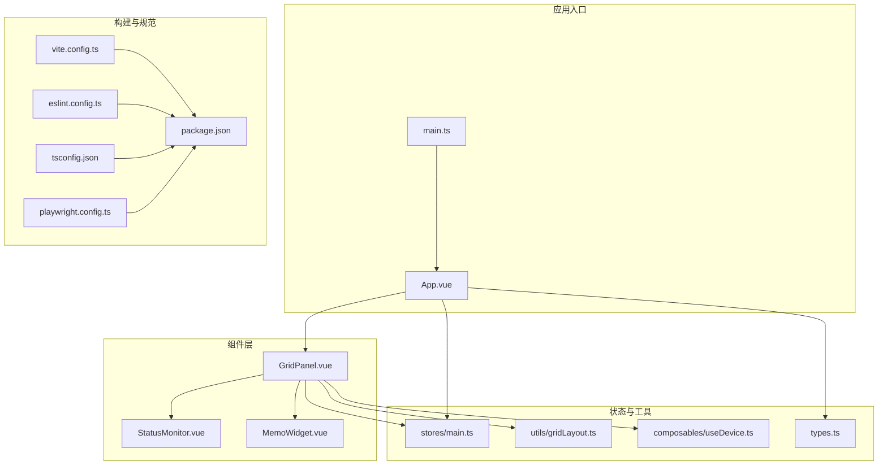
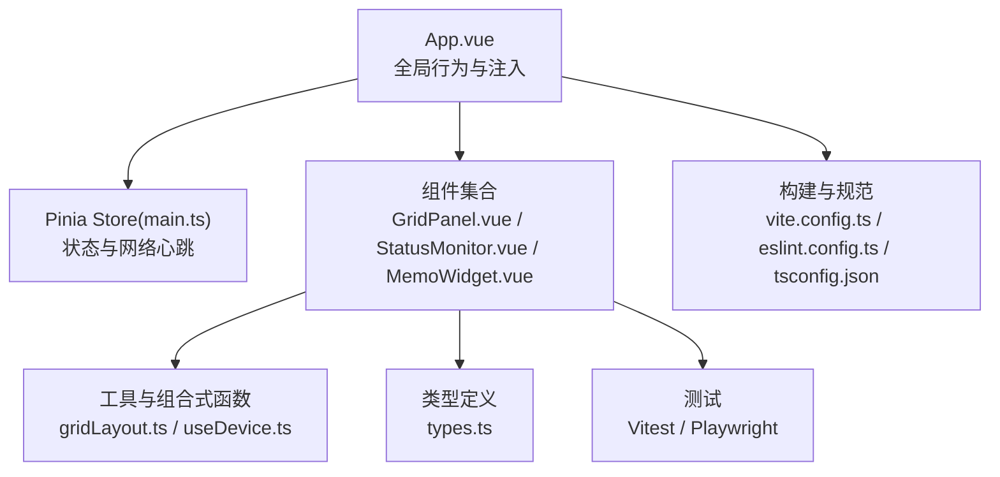
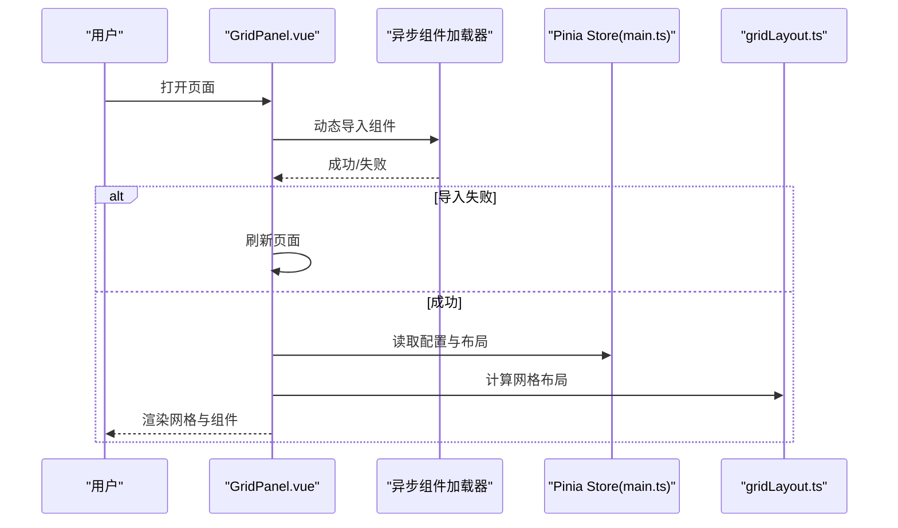
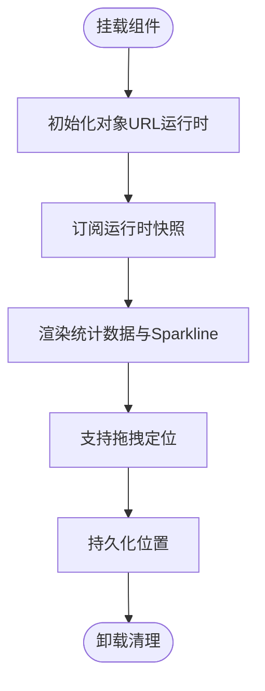
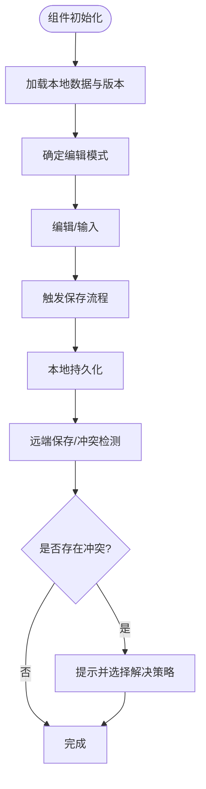
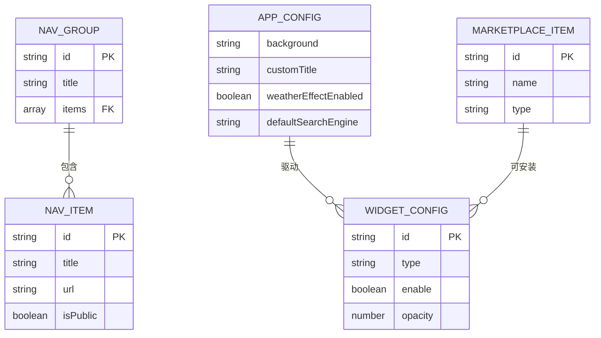
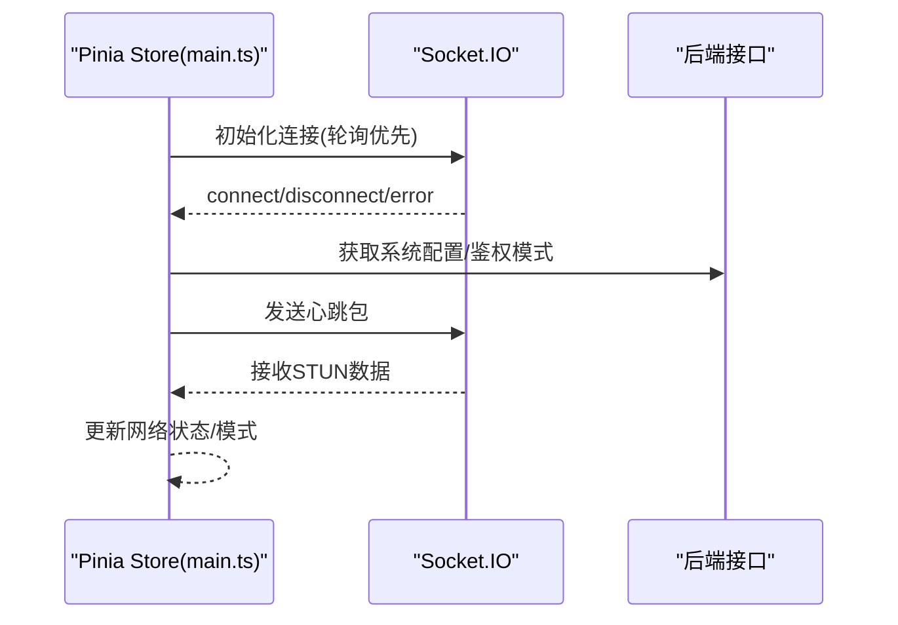
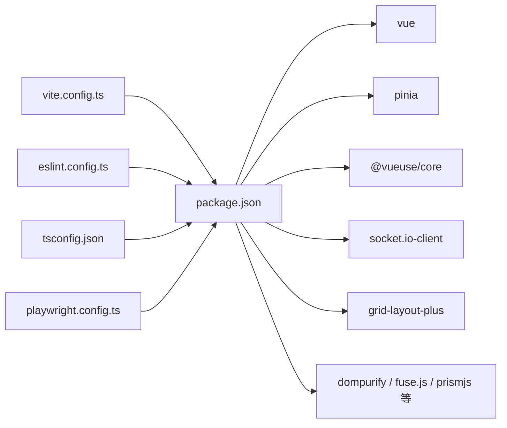

# 组件开发规范

<cite>
**本文引用的文件**
- [frontend/package.json](file://frontend/package.json)
- [frontend/vite.config.ts](file://frontend/vite.config.ts)
- [frontend/tsconfig.json](file://frontend/tsconfig.json)
- [frontend/eslint.config.ts](file://frontend/eslint.config.ts)
- [frontend/src/main.ts](file://frontend/src/main.ts)
- [frontend/src/App.vue](file://frontend/src/App.vue)
- [frontend/src/components/GridPanel.vue](file://frontend/src/components/GridPanel.vue)
- [frontend/src/components/StatusMonitor.vue](file://frontend/src/components/StatusMonitor.vue)
- [frontend/src/components/MemoWidget.vue](file://frontend/src/components/MemoWidget.vue)
- [frontend/src/types.ts](file://frontend/src/types.ts)
- [frontend/src/stores/main.ts](file://frontend/src/stores/main.ts)
- [frontend/src/utils/gridLayout.ts](file://frontend/src/utils/gridLayout.ts)
- [frontend/src/composables/useDevice.ts](file://frontend/src/composables/useDevice.ts)
- [frontend/playwright.config.ts](file://frontend/playwright.config.ts)
</cite>

## 目录
1. [引言](#引言)
2. [项目结构](#项目结构)
3. [核心组件](#核心组件)
4. [架构总览](#架构总览)
5. [详细组件分析](#详细组件分析)
6. [依赖关系分析](#依赖关系分析)
7. [性能考量](#性能考量)
8. [故障排查指南](#故障排查指南)
9. [结论](#结论)
10. [附录](#附录)

## 引言
本规范面向 OFlatNas 前端组件开发，聚焦 Vue 3 + TypeScript 的最佳实践，涵盖 Composition API 使用、类型系统、组件结构、命名与文件组织、测试策略、性能监控与调试技巧，并提供组件库扩展、插件与第三方集成方法。目标是帮助团队在复杂交互与多设备适配场景下，保持一致的开发体验与质量标准。

## 项目结构
前端采用模块化分层组织：
- 应用入口与根组件：main.ts、App.vue
- 组件层：按功能域划分，如 Memo、GridPanel、状态监控等
- 工具与组合式函数：composables、utils
- 状态管理：Pinia store（main.ts）
- 类型定义：统一在 types.ts
- 构建与开发：Vite 配置、ESLint 规则、TypeScript 配置
- 测试：单元测试（Vitest）、端到端测试（Playwright）

**图表来源**
- [frontend/src/main.ts:1-37](file://frontend/src/main.ts#L1-L37)
- [frontend/src/App.vue:1-666](file://frontend/src/App.vue#L1-L666)
- [frontend/src/components/GridPanel.vue:1-800](file://frontend/src/components/GridPanel.vue#L1-L800)
- [frontend/src/components/StatusMonitor.vue:1-177](file://frontend/src/components/StatusMonitor.vue#L1-L177)
- [frontend/src/components/MemoWidget.vue:1-800](file://frontend/src/components/MemoWidget.vue#L1-L800)
- [frontend/src/stores/main.ts:1-800](file://frontend/src/stores/main.ts#L1-L800)
- [frontend/src/utils/gridLayout.ts:1-113](file://frontend/src/utils/gridLayout.ts#L1-L113)
- [frontend/src/composables/useDevice.ts:1-72](file://frontend/src/composables/useDevice.ts#L1-L72)
- [frontend/src/types.ts:1-298](file://frontend/src/types.ts#L1-L298)
- [frontend/vite.config.ts:1-57](file://frontend/vite.config.ts#L1-L57)
- [frontend/eslint.config.ts:1-32](file://frontend/eslint.config.ts#L1-L32)
- [frontend/tsconfig.json:1-12](file://frontend/tsconfig.json#L1-L12)
- [frontend/playwright.config.ts:1-23](file://frontend/playwright.config.ts#L1-L23)

**章节来源**
- [frontend/src/main.ts:1-37](file://frontend/src/main.ts#L1-L37)
- [frontend/src/App.vue:1-666](file://frontend/src/App.vue#L1-L666)
- [frontend/vite.config.ts:1-57](file://frontend/vite.config.ts#L1-L57)
- [frontend/eslint.config.ts:1-32](file://frontend/eslint.config.ts#L1-L32)
- [frontend/tsconfig.json:1-12](file://frontend/tsconfig.json#L1-L12)
- [frontend/playwright.config.ts:1-23](file://frontend/playwright.config.ts#L1-L23)

## 核心组件
- 根组件与应用初始化：负责注入 Pinia、初始化主 store、错误捕获与全局行为（如自定义 CSS 注入、滚动回到顶部、版本冲突提示等）
- 网格面板 GridPanel：负责组件布局、异步组件加载、天气特效渲染、背景图预加载、搜索栏引擎配置、拖拽与分页模式等
- 状态监控 StatusMonitor：悬浮窗展示对象 URL 与内存使用统计，支持拖拽定位与实时采样
- 备忘录 MemoWidget：实现富文本/纯文本双模式、本地 IndexedDB 持久化、版本快照、冲突检测与解决、WebSocket 广播与 HTTP 轮询回退、离线/在线状态与活动窗口感知

这些组件共同构成可扩展的仪表盘框架，支持多设备、多主题、多网络模式下的稳定运行。

**章节来源**
- [frontend/src/App.vue:1-666](file://frontend/src/App.vue#L1-L666)
- [frontend/src/components/GridPanel.vue:1-800](file://frontend/src/components/GridPanel.vue#L1-L800)
- [frontend/src/components/StatusMonitor.vue:1-177](file://frontend/src/components/StatusMonitor.vue#L1-L177)
- [frontend/src/components/MemoWidget.vue:1-800](file://frontend/src/components/MemoWidget.vue#L1-L800)

## 架构总览
整体采用“根组件驱动 + 组合式函数 + Pinia 状态 + 工具函数”的分层架构。根组件负责全局行为与自定义脚本注入；网格面板承载布局与特效；各业务组件通过 store 获取数据与状态；工具函数提供设备检测、布局计算等能力；类型系统贯穿始终，确保接口一致性与可维护性。

**图表来源**
- [frontend/src/App.vue:1-666](file://frontend/src/App.vue#L1-L666)
- [frontend/src/stores/main.ts:1-800](file://frontend/src/stores/main.ts#L1-L800)
- [frontend/src/components/GridPanel.vue:1-800](file://frontend/src/components/GridPanel.vue#L1-L800)
- [frontend/src/components/StatusMonitor.vue:1-177](file://frontend/src/components/StatusMonitor.vue#L1-L177)
- [frontend/src/components/MemoWidget.vue:1-800](file://frontend/src/components/MemoWidget.vue#L1-L800)
- [frontend/src/utils/gridLayout.ts:1-113](file://frontend/src/utils/gridLayout.ts#L1-L113)
- [frontend/src/composables/useDevice.ts:1-72](file://frontend/src/composables/useDevice.ts#L1-L72)
- [frontend/src/types.ts:1-298](file://frontend/src/types.ts#L1-L298)
- [frontend/vite.config.ts:1-57](file://frontend/vite.config.ts#L1-L57)
- [frontend/eslint.config.ts:1-32](file://frontend/eslint.config.ts#L1-L32)
- [frontend/tsconfig.json:1-12](file://frontend/tsconfig.json#L1-L12)

## 详细组件分析

### 组件一：GridPanel（网格面板）
职责与特性
- 异步组件加载与错误恢复：动态导入失败时自动刷新页面，避免长期不可用
- 布局与响应式：基于列数与设备类型生成网格布局，支持桌面/平板/移动端不同列宽与行高
- 天气特效：根据天气状态启用 Canvas 雨景渲染，按需创建/销毁 WebGL 渲染器
- 背景图预加载：PC/移动背景图分别预加载，提升首屏体验
- 搜索引擎配置：支持多引擎与会话级切换，记忆上次选择
- 侧边栏与分组：根据可见性与设备模式控制显示，支持分页模式

**图表来源**
- [frontend/src/components/GridPanel.vue:25-52](file://frontend/src/components/GridPanel.vue#L25-L52)
- [frontend/src/stores/main.ts:1-800](file://frontend/src/stores/main.ts#L1-L800)
- [frontend/src/utils/gridLayout.ts:1-113](file://frontend/src/utils/gridLayout.ts#L1-L113)

**章节来源**
- [frontend/src/components/GridPanel.vue:1-800](file://frontend/src/components/GridPanel.vue#L1-L800)
- [frontend/src/utils/gridLayout.ts:1-113](file://frontend/src/utils/gridLayout.ts#L1-L113)

### 组件二：StatusMonitor（状态监控）
职责与特性
- 实时采集对象 URL 与内存使用样本，以 Sparkline 展示趋势
- 支持拖拽定位与边界约束，持久化位置信息
- 与对象 URL 运行时生命周期绑定，挂载时订阅，卸载时清理

**图表来源**
- [frontend/src/components/StatusMonitor.vue:1-177](file://frontend/src/components/StatusMonitor.vue#L1-L177)

**章节来源**
- [frontend/src/components/StatusMonitor.vue:1-177](file://frontend/src/components/StatusMonitor.vue#L1-L177)

### 组件三：MemoWidget（备忘录）
职责与特性
- 双模式编辑：富文本与纯文本，自动切换与持久化
- 本地与远端同步：IndexedDB 快照、版本管理、冲突检测与解决
- 网络与广播：WebSocket 广播 + HTTP 轮询回退，弱网与后台优化
- 用户活动与可见性：根据输入活跃度与页面可见性调整轮询节奏

**图表来源**
- [frontend/src/components/MemoWidget.vue:1-800](file://frontend/src/components/MemoWidget.vue#L1-L800)

**章节来源**
- [frontend/src/components/MemoWidget.vue:1-800](file://frontend/src/components/MemoWidget.vue#L1-L800)

### 类型系统与数据模型
- 统一类型定义：导航项、分组、应用配置、市场组件、小部件配置、RSS、书签、待办等
- 小部件数据：支持跨设备布局、透明度、文字颜色等通用属性
- 自定义脚本：支持 JS/CSS/组件三种类型，以及代理开关

**图表来源**
- [frontend/src/types.ts:1-298](file://frontend/src/types.ts#L1-L298)

**章节来源**
- [frontend/src/types.ts:1-298](file://frontend/src/types.ts#L1-L298)

### 状态管理与网络心跳
- Socket 初始化与事件：连接、断开、错误、STUN 数据
- 系统配置与鉴权模式：支持单用户/多用户模式，断线重连与模式切换处理
- 网络心跳：定时发送心跳包，白名单模式下降低频率，结合可见性与脉冲调度减少请求

**图表来源**
- [frontend/src/stores/main.ts:1-800](file://frontend/src/stores/main.ts#L1-L800)

**章节来源**
- [frontend/src/stores/main.ts:1-800](file://frontend/src/stores/main.ts#L1-L800)

## 依赖关系分析
- 构建与开发：Vite 提供开发服务器与打包，插件支持 Vue 与 DevTools；ESLint 与 Prettier 统一代码风格；TypeScript 分层配置
- 运行时依赖：Vue 3、Pinia、VueUse、Socket.IO、网格布局库、对象 URL 运行时等
- 测试：Vitest 单测、Playwright E2E，支持多浏览器项目

**图表来源**
- [frontend/package.json:1-77](file://frontend/package.json#L1-L77)
- [frontend/vite.config.ts:1-57](file://frontend/vite.config.ts#L1-L57)
- [frontend/eslint.config.ts:1-32](file://frontend/eslint.config.ts#L1-L32)
- [frontend/tsconfig.json:1-12](file://frontend/tsconfig.json#L1-L12)
- [frontend/playwright.config.ts:1-23](file://frontend/playwright.config.ts#L1-L23)

**章节来源**
- [frontend/package.json:1-77](file://frontend/package.json#L1-L77)
- [frontend/vite.config.ts:1-57](file://frontend/vite.config.ts#L1-L57)
- [frontend/eslint.config.ts:1-32](file://frontend/eslint.config.ts#L1-L32)
- [frontend/tsconfig.json:1-12](file://frontend/tsconfig.json#L1-L12)
- [frontend/playwright.config.ts:1-23](file://frontend/playwright.config.ts#L1-L23)

## 性能考量
- 布局与渲染
  - 网格布局采用缩放与步进算法，避免重叠与无限循环，按设备列数动态调整
  - Canvas 雨景仅在需要时初始化，尺寸变化时重算视口，离开时停止动画
- 网络与同步
  - WebSocket 广播 + HTTP 轮询回退，弱网与后台退避策略，减少不必要的请求
  - 心跳与脉冲调度，结合可见性事件，降低后台消耗
- 资源与缓存
  - 背景图预加载与缓存破坏参数，避免缓存导致的闪烁
  - 对象 URL 运行时采样与 Sparkline 展示，便于监控内存泄漏
- 开发与构建
  - Vite 按需加载与异步组件错误恢复，减少首屏阻塞
  - ESLint 与 TypeScript 严格规则，提前发现潜在问题

**章节来源**
- [frontend/src/utils/gridLayout.ts:1-113](file://frontend/src/utils/gridLayout.ts#L1-L113)
- [frontend/src/components/GridPanel.vue:1-800](file://frontend/src/components/GridPanel.vue#L1-L800)
- [frontend/src/stores/main.ts:1-800](file://frontend/src/stores/main.ts#L1-L800)
- [frontend/src/components/StatusMonitor.vue:1-177](file://frontend/src/components/StatusMonitor.vue#L1-L177)

## 故障排查指南
- 异步组件加载失败
  - 现象：动态导入报错导致界面空白
  - 处理：组件内部捕获错误并刷新页面，避免长时间不可用
  - 参考路径：[frontend/src/components/GridPanel.vue:25-52](file://frontend/src/components/GridPanel.vue#L25-L52)
- 自定义脚本注入
  - 现象：跨域请求受限或脚本执行异常
  - 处理：内置 fetch 代理与错误捕获，模块脚本与非模块脚本分别处理
  - 参考路径：[frontend/src/App.vue:270-364](file://frontend/src/App.vue#L270-L364)
- 版本冲突与保存失败
  - 现象：多人编辑或网络异常导致保存失败
  - 处理：冲突提示、冷却时间、重试机制与本地快照
  - 参考路径：[frontend/src/components/MemoWidget.vue:346-425](file://frontend/src/components/MemoWidget.vue#L346-L425)
- 网络模式切换
  - 现象：鉴权模式变更导致页面状态不一致
  - 处理：连接恢复后二次确认，必要时重置或重新初始化
  - 参考路径：[frontend/src/stores/main.ts:58-91](file://frontend/src/stores/main.ts#L58-L91)
- 内存与对象 URL
  - 现象：内存增长或对象 URL 未释放
  - 处理：状态监控组件展示统计，运行时生命周期管理
  - 参考路径：[frontend/src/components/StatusMonitor.vue:1-177](file://frontend/src/components/StatusMonitor.vue#L1-L177)

**章节来源**
- [frontend/src/components/GridPanel.vue:25-52](file://frontend/src/components/GridPanel.vue#L25-L52)
- [frontend/src/App.vue:270-364](file://frontend/src/App.vue#L270-L364)
- [frontend/src/components/MemoWidget.vue:346-425](file://frontend/src/components/MemoWidget.vue#L346-L425)
- [frontend/src/stores/main.ts:58-91](file://frontend/src/stores/main.ts#L58-L91)
- [frontend/src/components/StatusMonitor.vue:1-177](file://frontend/src/components/StatusMonitor.vue#L1-L177)

## 结论
本规范总结了 OFlatNas 组件开发的核心实践：以 Composition API 与 TypeScript 为基础，结合 Pinia 状态管理与工具函数，构建可扩展、高性能、易维护的前端组件体系。通过严格的类型约束、完善的测试策略与性能监控手段，确保在多设备、多网络环境下的一致用户体验。

## 附录

### A. 命名约定与文件组织
- 组件命名：采用帕斯卡命名法，如 GridPanel.vue、StatusMonitor.vue、MemoWidget.vue
- 文件组织：按功能域分目录，公共工具与组合式函数独立存放
- 类型定义：集中于 types.ts，避免分散耦合

**章节来源**
- [frontend/src/components/GridPanel.vue:1-800](file://frontend/src/components/GridPanel.vue#L1-L800)
- [frontend/src/components/StatusMonitor.vue:1-177](file://frontend/src/components/StatusMonitor.vue#L1-L177)
- [frontend/src/components/MemoWidget.vue:1-800](file://frontend/src/components/MemoWidget.vue#L1-L800)
- [frontend/src/types.ts:1-298](file://frontend/src/types.ts#L1-L298)

### B. 组件测试策略
- 单元测试：Vitest，覆盖组合式函数与工具函数
- 端到端测试：Playwright，多浏览器项目配置
- 测试命令与脚本：参考 package.json 中 test 与 test:e2e

**章节来源**
- [frontend/package.json:19-20](file://frontend/package.json#L19-L20)
- [frontend/playwright.config.ts:1-23](file://frontend/playwright.config.ts#L1-L23)

### C. 插件与第三方集成
- Vite 插件：Vue 与 DevTools，按开发/生产环境启用
- 第三方库：Socket.IO、VueUse、网格布局、对象 URL 运行时等
- 集成注意：遵循依赖版本与构建配置，避免 unresolved import

**章节来源**
- [frontend/vite.config.ts:1-57](file://frontend/vite.config.ts#L1-L57)
- [frontend/package.json:22-47](file://frontend/package.json#L22-L47)