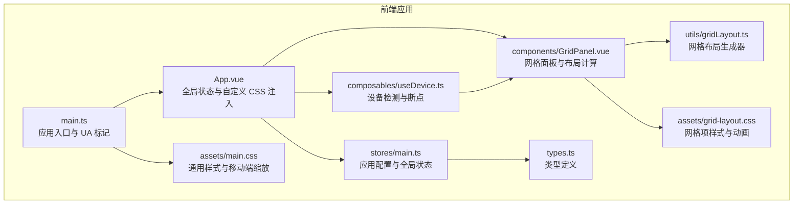
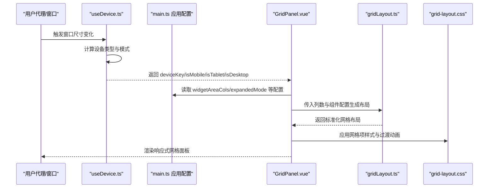
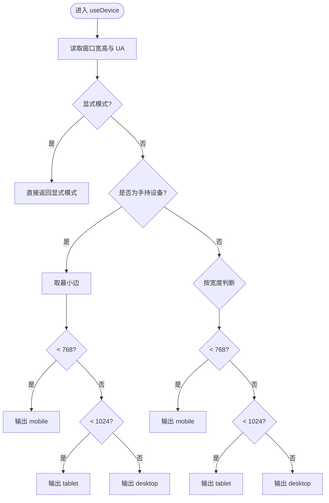
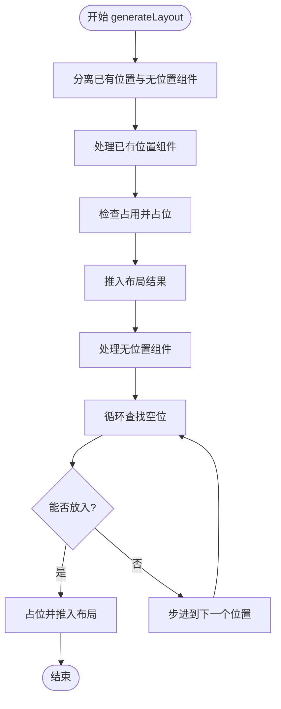
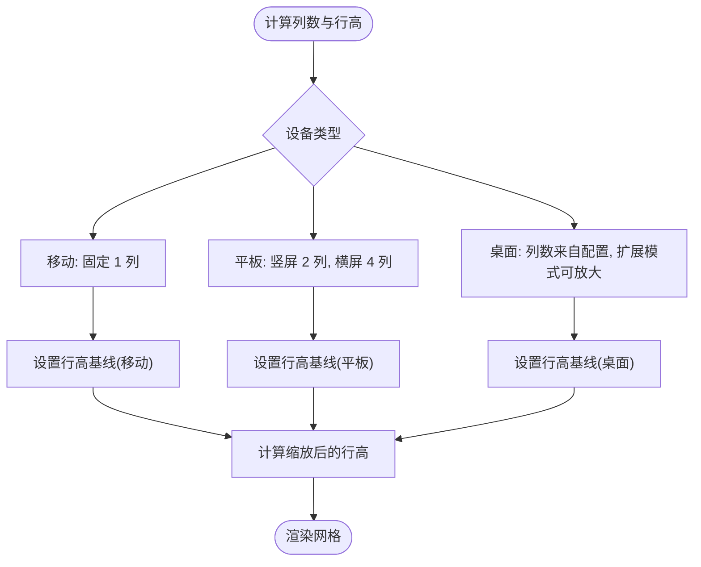
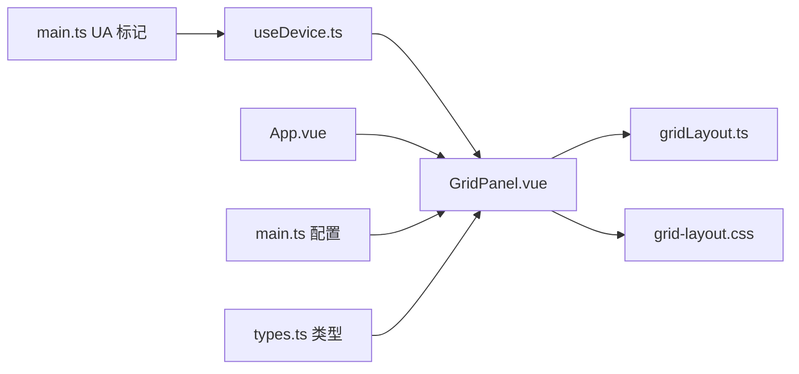

# 响应式适配策略

<cite>
**本文引用的文件**
- [frontend/src/composables/useDevice.ts](file://frontend/src/composables/useDevice.ts)
- [frontend/src/components/GridPanel.vue](file://frontend/src/components/GridPanel.vue)
- [frontend/src/utils/gridLayout.ts](file://frontend/src/utils/gridLayout.ts)
- [frontend/src/assets/grid-layout.css](file://frontend/src/assets/grid-layout.css)
- [frontend/src/App.vue](file://frontend/src/App.vue)
- [frontend/src/assets/main.css](file://frontend/src/assets/main.css)
- [frontend/src/stores/main.ts](file://frontend/src/stores/main.ts)
- [frontend/src/types.ts](file://frontend/src/types.ts)
- [frontend/src/main.ts](file://frontend/src/main.ts)
</cite>

## 目录
1. [简介](#简介)
2. [项目结构](#项目结构)
3. [核心组件](#核心组件)
4. [架构总览](#架构总览)
5. [详细组件分析](#详细组件分析)
6. [依赖关系分析](#依赖关系分析)
7. [性能考量](#性能考量)
8. [故障排查指南](#故障排查指南)
9. [结论](#结论)
10. [附录](#附录)

## 简介
本文件系统化阐述 OFlatNas 的响应式适配策略，涵盖设备检测机制、屏幕尺寸监听与断点管理、不同设备模式下的布局行为差异、网格列数动态调整与行高自适应算法、网格缩放比例与间距调整、组件可见性控制，以及设备模式切换、窗口大小变化与横竖屏适配的具体实现。同时提供测试方法、性能优化建议与兼容性处理要点。

## 项目结构
- 前端采用 Vue 3 + Pinia 架构，响应式能力通过组合式函数与计算属性驱动。
- 设备检测与断点管理集中在设备组合式函数中，全局应用状态通过主存储管理。
- 网格布局由专用工具生成并配合 CSS Grid/Layout Plus 实现拖拽与缩放。
- 自定义样式支持按设备与主题条件注入，确保跨设备一致性体验。

**图表来源**
- [frontend/src/main.ts:1-37](file://frontend/src/main.ts#L1-L37)
- [frontend/src/App.vue:1-120](file://frontend/src/App.vue#L1-L120)
- [frontend/src/stores/main.ts:1-200](file://frontend/src/stores/main.ts#L1-L200)
- [frontend/src/composables/useDevice.ts:1-72](file://frontend/src/composables/useDevice.ts#L1-L72)
- [frontend/src/components/GridPanel.vue:1-200](file://frontend/src/components/GridPanel.vue#L1-L200)
- [frontend/src/utils/gridLayout.ts:1-113](file://frontend/src/utils/gridLayout.ts#L1-L113)
- [frontend/src/assets/grid-layout.css:1-109](file://frontend/src/assets/grid-layout.css#L1-L109)
- [frontend/src/assets/main.css:1-132](file://frontend/src/assets/main.css#L1-L132)
- [frontend/src/types.ts:86-189](file://frontend/src/types.ts#L86-L189)

**章节来源**
- [frontend/src/main.ts:1-37](file://frontend/src/main.ts#L1-L37)
- [frontend/src/App.vue:1-120](file://frontend/src/App.vue#L1-L120)
- [frontend/src/stores/main.ts:1-200](file://frontend/src/stores/main.ts#L1-L200)
- [frontend/src/composables/useDevice.ts:1-72](file://frontend/src/composables/useDevice.ts#L1-L72)
- [frontend/src/components/GridPanel.vue:1-200](file://frontend/src/components/GridPanel.vue#L1-L200)
- [frontend/src/utils/gridLayout.ts:1-113](file://frontend/src/utils/gridLayout.ts#L1-L113)
- [frontend/src/assets/grid-layout.css:1-109](file://frontend/src/assets/grid-layout.css#L1-L109)
- [frontend/src/assets/main.css:1-132](file://frontend/src/assets/main.css#L1-L132)
- [frontend/src/types.ts:86-189](file://frontend/src/types.ts#L86-L189)

## 核心组件
- 设备检测与断点管理：基于窗口尺寸与用户代理识别设备类型，支持强制模式与自动模式。
- 网格布局生成与缩放：统一网格坐标系，按设备类型动态计算列数、行高与间距，并进行缩放换算。
- 自定义 CSS 注入：按设备与主题条件注入样式块，实现细粒度的响应式控制。
- 超宽屏扩展：根据窗口/屏幕纵横比自动启用扩展模式，提升桌面大屏体验。

**章节来源**
- [frontend/src/composables/useDevice.ts:1-72](file://frontend/src/composables/useDevice.ts#L1-L72)
- [frontend/src/components/GridPanel.vue:688-749](file://frontend/src/components/GridPanel.vue#L688-L749)
- [frontend/src/utils/gridLayout.ts:1-113](file://frontend/src/utils/gridLayout.ts#L1-L113)
- [frontend/src/App.vue:28-49](file://frontend/src/App.vue#L28-L49)
- [frontend/src/App.vue:76-105](file://frontend/src/App.vue#L76-L105)

## 架构总览
响应式适配围绕“设备检测 → 布局计算 → 样式应用”的链路展开。设备检测提供断点与模式，布局计算决定网格列数、行高与间距，样式层负责视觉表现与动画过渡。

**图表来源**
- [frontend/src/composables/useDevice.ts:1-72](file://frontend/src/composables/useDevice.ts#L1-L72)
- [frontend/src/stores/main.ts:173-174](file://frontend/src/stores/main.ts#L173-L174)
- [frontend/src/components/GridPanel.vue:688-749](file://frontend/src/components/GridPanel.vue#L688-L749)
- [frontend/src/utils/gridLayout.ts:1-113](file://frontend/src/utils/gridLayout.ts#L1-L113)
- [frontend/src/assets/grid-layout.css:1-109](file://frontend/src/assets/grid-layout.css#L1-L109)

## 详细组件分析

### 设备检测与断点管理
- 用户代理识别：针对 HarmonyOS、华为浏览器、Android、iOS、Alook 等进行识别，作为“手持设备”判定依据。
- 尺寸断点：手持设备以最小边为基准，桌面以宽度为基准，分别划分移动、平板、桌面三档。
- 模式控制：支持自动模式与显式模式（desktop/tablet/mobile），显式模式优先于自动模式。
- 结果输出：导出设备键值与布尔型判断，供布局与样式使用。

**图表来源**
- [frontend/src/composables/useDevice.ts:16-44](file://frontend/src/composables/useDevice.ts#L16-L44)

**章节来源**
- [frontend/src/composables/useDevice.ts:1-72](file://frontend/src/composables/useDevice.ts#L1-L72)

### 网格布局生成与缩放
- 统一坐标系：网格坐标以“半单元”为步进，内部以两倍精度存储，便于精确布局与缩放换算。
- 占位矩阵：二维布尔矩阵记录占用区域，避免重叠与越界。
- 优先策略：先保留已有位置的组件，再为无位置或重叠组件寻找空位。
- 缩放与间距：桌面默认列数受配置约束，移动/平板按设备类型与横竖屏决定列数；行高随设备类型设定，网格间距按设备类型设置；最终通过缩放因子统一换算到渲染坐标。

**图表来源**
- [frontend/src/utils/gridLayout.ts:11-113](file://frontend/src/utils/gridLayout.ts#L11-L113)

**章节来源**
- [frontend/src/utils/gridLayout.ts:1-113](file://frontend/src/utils/gridLayout.ts#L1-L113)
- [frontend/src/components/GridPanel.vue:688-749](file://frontend/src/components/GridPanel.vue#L688-L749)

### 列数动态调整与行高自适应
- 移动端固定为单列，确保信息密度与可读性。
- 平板端根据横竖屏切换列数：竖屏为两列，横屏为四列，兼顾内容展示与交互效率。
- 桌面端列数由配置决定，支持扩展模式（超宽屏）时增加列数上限，最大不超过十六列。
- 行高自适应：移动/平板/桌面分别设定行高基线，结合网格间距与缩放因子计算有效行高。

**图表来源**
- [frontend/src/components/GridPanel.vue:688-749](file://frontend/src/components/GridPanel.vue#L688-L749)

**章节来源**
- [frontend/src/components/GridPanel.vue:688-749](file://frontend/src/components/GridPanel.vue#L688-L749)

### 网格缩放比例、间距调整与组件可见性控制
- 缩放比例：网格坐标以两倍精度存储，渲染前统一缩放，保证布局精度与性能平衡。
- 间距调整：移动设备使用较小间距，桌面设备使用较大间距，提升视觉层次。
- 组件可见性：部分组件支持按设备隐藏（如移动端隐藏），通过配置字段控制显示。

**章节来源**
- [frontend/src/components/GridPanel.vue:724-730](file://frontend/src/components/GridPanel.vue#L724-L730)
- [frontend/src/types.ts:202-224](file://frontend/src/types.ts#L202-L224)

### 自定义 CSS 注入与主题适配
- 条件注入：支持在自定义 CSS 中使用特定标记（如 mobile/desktop/dark/light）包裹规则，运行时自动转换为媒体查询注入。
- 主题适配：结合系统深浅色偏好，动态应用对应主题样式块，确保夜间模式体验一致。

**章节来源**
- [frontend/src/App.vue:76-105](file://frontend/src/App.vue#L76-L105)

### 超宽屏扩展与桌面布局
- 超宽屏检测：根据窗口纵横比或屏幕纵横比判断是否启用扩展模式，阈值约为 2.3。
- 桌面最大宽度：桌面布局在配置列数基础上，结合窗口宽度限制最大内容宽度，避免过宽影响阅读。

**章节来源**
- [frontend/src/App.vue:28-49](file://frontend/src/App.vue#L28-L49)
- [frontend/src/components/GridPanel.vue:696-713](file://frontend/src/components/GridPanel.vue#L696-L713)

## 依赖关系分析
- 设备检测依赖窗口尺寸与用户代理，输出设备键值与布尔判断。
- 网格面板依赖设备键值、应用配置与布局生成器，输出标准化网格布局。
- 样式层依赖网格布局输出，提供动画与过渡效果。
- 应用入口对 UA 进行分类标记，辅助样式与行为差异化。

**图表来源**
- [frontend/src/main.ts:9-20](file://frontend/src/main.ts#L9-L20)
- [frontend/src/composables/useDevice.ts:1-72](file://frontend/src/composables/useDevice.ts#L1-L72)
- [frontend/src/components/GridPanel.vue:1-200](file://frontend/src/components/GridPanel.vue#L1-L200)
- [frontend/src/utils/gridLayout.ts:1-113](file://frontend/src/utils/gridLayout.ts#L1-L113)
- [frontend/src/assets/grid-layout.css:1-109](file://frontend/src/assets/grid-layout.css#L1-L109)
- [frontend/src/App.vue:1-120](file://frontend/src/App.vue#L1-L120)
- [frontend/src/stores/main.ts:173-174](file://frontend/src/stores/main.ts#L173-L174)
- [frontend/src/types.ts:86-189](file://frontend/src/types.ts#L86-L189)

**章节来源**
- [frontend/src/main.ts:9-20](file://frontend/src/main.ts#L9-L20)
- [frontend/src/composables/useDevice.ts:1-72](file://frontend/src/composables/useDevice.ts#L1-L72)
- [frontend/src/components/GridPanel.vue:1-200](file://frontend/src/components/GridPanel.vue#L1-L200)
- [frontend/src/utils/gridLayout.ts:1-113](file://frontend/src/utils/gridLayout.ts#L1-L113)
- [frontend/src/assets/grid-layout.css:1-109](file://frontend/src/assets/grid-layout.css#L1-L109)
- [frontend/src/App.vue:1-120](file://frontend/src/App.vue#L1-L120)
- [frontend/src/stores/main.ts:173-174](file://frontend/src/stores/main.ts#L173-L174)
- [frontend/src/types.ts:86-189](file://frontend/src/types.ts#L86-L189)

## 性能考量
- 布局计算复杂度：网格生成采用占位矩阵与步进搜索，时间复杂度与组件数量及布局密度相关；通过优先保留已有位置的策略减少重排概率。
- 缩放与换算：统一两倍精度与缩放因子，避免频繁浮点运算误差，提高渲染稳定性。
- 动画与过渡：网格项使用 CSS 过渡与变换，尽量利用 GPU 加速，减少重绘与回流。
- 超宽屏优化：桌面最大宽度与列数限制，避免极端宽屏导致的布局膨胀与渲染压力。
- 自定义 CSS：按需注入媒体查询块，避免全局样式爆炸。

[本节为通用性能指导，无需具体文件引用]

## 故障排查指南
- 设备模式不生效：检查应用配置中的设备模式设置，确认是否被强制为非自动模式。
- 布局错乱或重叠：检查组件原始布局坐标与列数是否匹配，必要时清理无效布局数据。
- 移动端显示异常：确认组件是否声明移动端隐藏，或自定义 CSS 是否覆盖了关键样式。
- 超宽屏未启用：检查配置开关与纵横比阈值，确保窗口/屏幕尺寸满足条件。
- 自定义 CSS 不生效：核对自定义 CSS 标记语法与注入时机，确保在应用初始化后执行。

**章节来源**
- [frontend/src/App.vue:28-49](file://frontend/src/App.vue#L28-L49)
- [frontend/src/App.vue:76-105](file://frontend/src/App.vue#L76-L105)
- [frontend/src/types.ts:202-224](file://frontend/src/types.ts#L202-L224)

## 结论
OFlatNas 的响应式适配以“设备检测 + 布局生成 + 样式注入”为核心路径，通过统一的网格坐标系与缩放机制，实现了移动、平板、桌面三类设备的差异化布局与一致的交互体验。配合超宽屏扩展与主题适配，系统在多场景下均具备良好的可用性与可维护性。

## 附录

### 响应式测试方法
- 设备模式切换：在应用配置中手动切换设备模式，观察网格列数与行高的变化。
- 窗口尺寸变化：逐步改变浏览器窗口尺寸，验证断点切换与布局重排。
- 横竖屏适配：在平板设备上旋转屏幕，确认列数与行高的动态调整。
- 超宽屏验证：使用超宽屏分辨率或模拟器，验证扩展模式与最大宽度限制。
- 自定义 CSS：编写带标记的样式块，注入后验证媒体查询生效。

[本节为通用测试方法，无需具体文件引用]