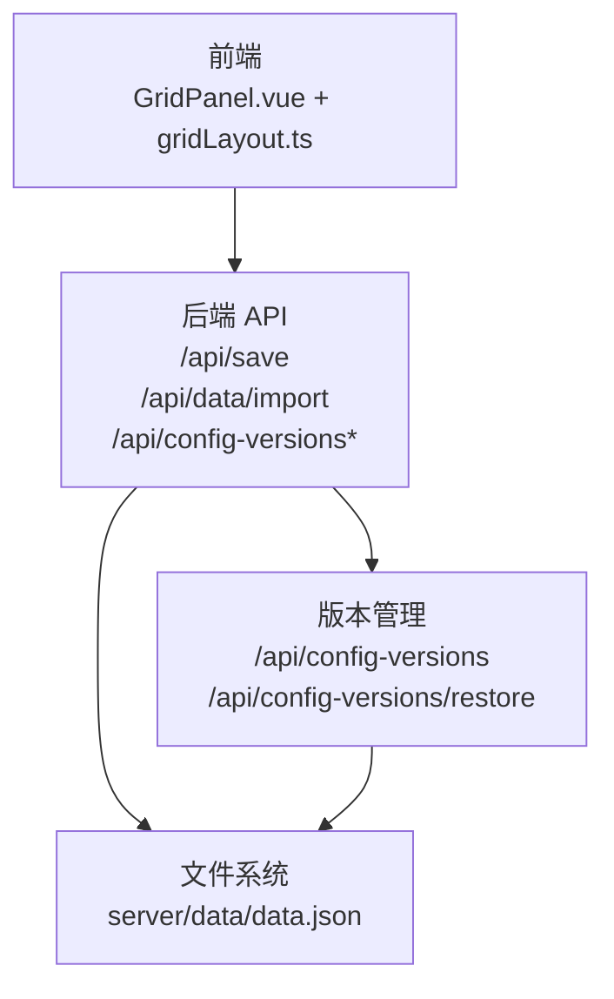
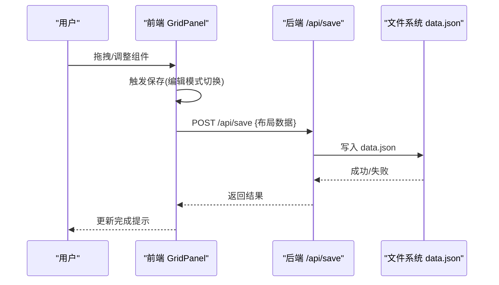
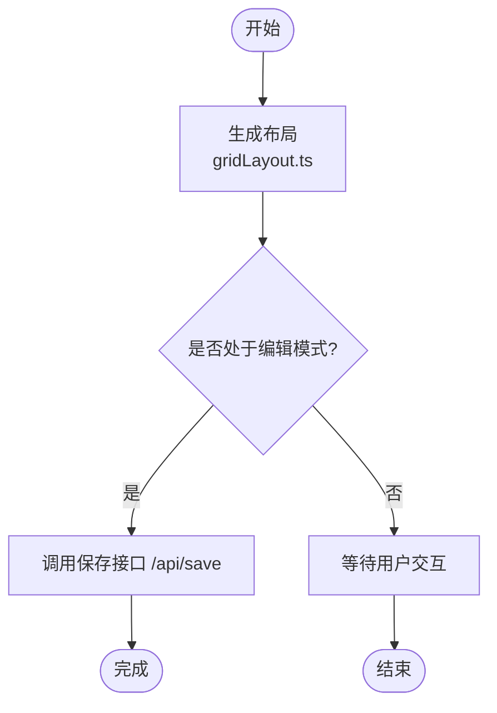
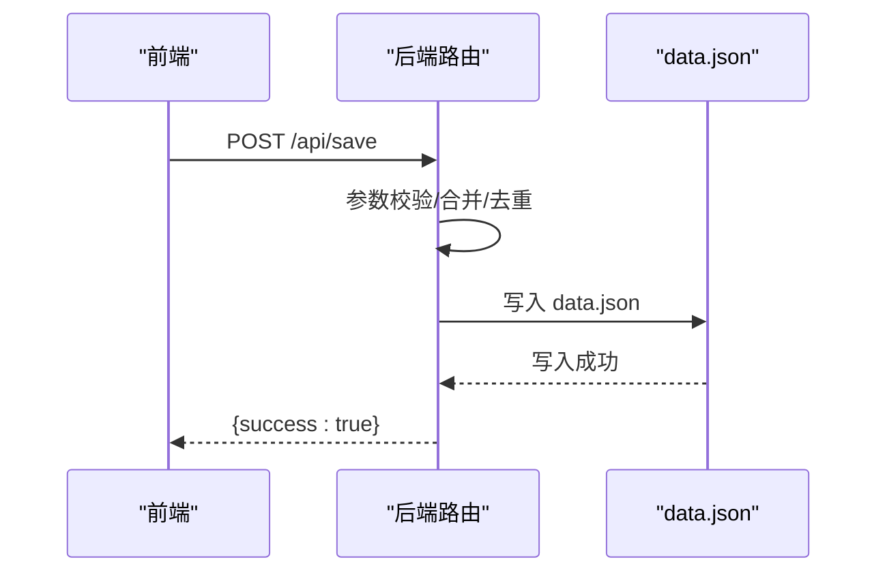
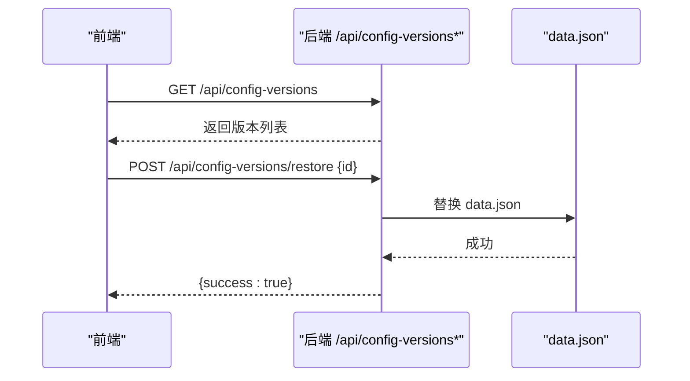
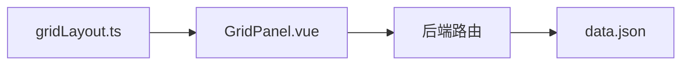

# 布局持久化与恢复

<cite>
**本文档引用的文件**
- [main.go](file://backend/main.go)
- [data.json](file://server/data/data.json)
- [gridLayout.ts](file://frontend/src/utils/gridLayout.ts)
- [GridPanel.vue](file://frontend/src/components/GridPanel.vue)
</cite>

## 目录
1. [简介](#简介)
2. [项目结构](#项目结构)
3. [核心组件](#核心组件)
4. [架构总览](#架构总览)
5. [详细组件分析](#详细组件分析)
6. [依赖关系分析](#依赖关系分析)
7. [性能考量](#性能考量)
8. [故障排查指南](#故障排查指南)
9. [结论](#结论)
10. [附录](#附录)

## 简介
本文件聚焦 OFlatNas 的“布局持久化与恢复”机制，系统性阐述前端布局序列化、后端存储策略、加载与恢复流程、版本控制与回滚、数据校验与兼容性处理、错误恢复策略，以及备份、导入导出与批量操作支持。目标是帮助开发者与运维人员理解并安全地维护用户界面布局数据。

## 项目结构
- 前端负责布局生成、拖拽与尺寸变更、本地存储与保存触发。
- 后端提供保存接口、版本管理接口、导入导出接口，并将布局数据持久化到服务器文件系统。
- 数据模型以 JSON 文件形式存储，包含应用配置与分组布局信息。

图表来源
- [main.go:165-254](file://backend/main.go#L165-L254)
- [data.json:1-104](file://server/data/data.json#L1-L104)

章节来源
- [main.go:165-254](file://backend/main.go#L165-L254)
- [data.json:1-104](file://server/data/data.json#L1-L104)

## 核心组件
- 前端布局生成器：根据组件配置与网格参数生成标准化布局项，确保尺寸与位置按网格缩放。
- 前端布局面板：负责拖拽、调整尺寸、切换编辑模式、触发保存。
- 后端保存接口：接收布局数据，执行校验与落盘。
- 版本管理接口：提供配置版本列表、保存当前配置为版本、按版本恢复。
- 导入导出接口：支持整包导入导出，便于备份与迁移。

章节来源
- [gridLayout.ts:11-112](file://frontend/src/utils/gridLayout.ts#L11-L112)
- [GridPanel.vue:387-400](file://frontend/src/components/GridPanel.vue#L387-L400)
- [main.go:208-252](file://backend/main.go#L208-L252)

## 架构总览
前端通过 API 将布局数据提交至后端，后端写入 data.json 并可选记录版本。恢复时从 data.json 读取并重建布局，同时支持版本回滚与导入导出。

图表来源
- [GridPanel.vue:387-400](file://frontend/src/components/GridPanel.vue#L387-L400)
- [main.go:208-208](file://backend/main.go#L208-L208)

## 详细组件分析

### 前端布局生成与保存流程
- 布局生成：根据列数与组件尺寸计算网格坐标，优先保留已有位置，再填充未定位组件，避免重叠。
- 编辑模式：进入编辑时标记“布局编辑进行中”，退出时调用保存接口并清理标志，防止并发覆盖。
- 保存时机：编辑模式切换时保存，或由业务逻辑触发保存。

图表来源
- [gridLayout.ts:11-112](file://frontend/src/utils/gridLayout.ts#L11-L112)
- [GridPanel.vue:387-400](file://frontend/src/components/GridPanel.vue#L387-L400)

章节来源
- [gridLayout.ts:11-112](file://frontend/src/utils/gridLayout.ts#L11-L112)
- [GridPanel.vue:387-400](file://frontend/src/components/GridPanel.vue#L387-L400)

### 后端保存与存储策略
- 接口定义：/api/save 提交布局数据，/api/data/import 支持导入，/api/config-versions 系列接口管理版本。
- 存储介质：data.json 作为主数据文件，包含 appConfig 与 groups 等布局相关字段。
- 数据校验：保存前应进行类型校验、范围校验与冲突检测（建议在后端实现）。

图表来源
- [main.go:208-208](file://backend/main.go#L208-L208)
- [data.json:1-104](file://server/data/data.json#L1-L104)

章节来源
- [main.go:208-208](file://backend/main.go#L208-L208)
- [data.json:1-104](file://server/data/data.json#L1-L104)

### 版本控制与回滚机制
- 版本列表：获取历史版本，便于对比与选择。
- 保存版本：将当前配置保存为新版本，便于快速回滚。
- 回滚操作：选择指定版本，后端替换 data.json 并重启相关服务或刷新前端。

图表来源
- [main.go:248-252](file://backend/main.go#L248-L252)

章节来源
- [main.go:248-252](file://backend/main.go#L248-L252)

### 恢复过程的数据校验与兼容性
- 校验策略：
  - 类型与必填字段校验（如 x/y/w/h、id、colSpan/rowSpan 映射）。
  - 范围校验（位置与尺寸不超过网格边界）。
  - 冲突检测（重叠区域、越界）。
- 兼容性处理：
  - 新增字段采用默认值回退。
  - 旧版布局字段映射到新版字段（如 colSpan/rowSpan -> w/h）。
  - 设备模式变化时的布局适配（移动端/桌面端列数差异）。

章节来源
- [gridLayout.ts:11-112](file://frontend/src/utils/gridLayout.ts#L11-L112)
- [GridPanel.vue:714-754](file://frontend/src/components/GridPanel.vue#L714-L754)

### 错误恢复策略
- 动态模块加载失败：前端具备重载机制，避免因 chunk 加载失败导致白屏。
- 保存失败：前端显示错误并允许重试；后端返回错误码与原因。
- 恢复失败：回滚到上一个可用版本，或使用最近一次备份。

章节来源
- [GridPanel.vue:24-52](file://frontend/src/components/GridPanel.vue#L24-L52)

### 备份、导入与导出
- 导出：读取 data.json，打包为可下载文件，包含布局与配置。
- 导入：上传备份文件，后端解析并写入 data.json，必要时触发版本保存。
- 批量操作：支持一次性导入多个用户的布局配置，或对多组布局进行统一调整。

章节来源
- [main.go:211-211](file://backend/main.go#L211-L211)

### 布局状态同步与并发控制
- 状态同步：编辑模式下设置“布局编辑进行中”，退出时保存并清除，避免外部并发修改覆盖。
- 并发控制：保存接口需加锁或采用乐观锁策略，确保多用户/多标签页不会互相覆盖。
- 数据一致性：保存成功后，前端刷新布局；若失败，回滚到本地缓存的上一次有效布局。

章节来源
- [GridPanel.vue:387-400](file://frontend/src/components/GridPanel.vue#L387-L400)

## 依赖关系分析
- 前端依赖：
  - gridLayout.ts：布局生成算法。
  - GridPanel.vue：拖拽、尺寸调整、保存触发、编辑模式切换。
- 后端依赖：
  - Gin 路由：/api/save、/api/data/import、/api/config-versions*。
  - 文件系统：data.json 作为主存储。

图表来源
- [gridLayout.ts:11-112](file://frontend/src/utils/gridLayout.ts#L11-L112)
- [GridPanel.vue:20-20](file://frontend/src/components/GridPanel.vue#L20-L20)
- [main.go:165-254](file://backend/main.go#L165-L254)
- [data.json:1-104](file://server/data/data.json#L1-L104)

章节来源
- [gridLayout.ts:11-112](file://frontend/src/utils/gridLayout.ts#L11-L112)
- [GridPanel.vue:20-20](file://frontend/src/components/GridPanel.vue#L20-L20)
- [main.go:165-254](file://backend/main.go#L165-L254)
- [data.json:1-104](file://server/data/data.json#L1-L104)

## 性能考量
- 布局生成复杂度：网格填充算法时间复杂度与组件数量及网格密度相关，建议在大屏设备上限制初始渲染组件数。
- 序列化体积：布局数据包含大量坐标与尺寸，建议启用压缩或分块传输。
- I/O 开销：频繁保存可能导致磁盘压力，建议引入节流/防抖与增量保存策略。

## 故障排查指南
- 保存失败：
  - 检查后端日志与返回状态码。
  - 校验 data.json 权限与磁盘空间。
- 恢复失败：
  - 使用版本回滚到上一个稳定版本。
  - 若无版本可用，使用最近备份文件替换 data.json。
- 布局错乱：
  - 检查设备模式与列数配置是否匹配。
  - 清理浏览器缓存并重载页面。

章节来源
- [GridPanel.vue:24-52](file://frontend/src/components/GridPanel.vue#L24-L52)
- [main.go:248-252](file://backend/main.go#L248-L252)

## 结论
OFlatNas 的布局持久化与恢复机制以 data.json 为核心，结合前端布局生成与后端保存/版本管理接口，实现了可靠的布局序列化、存储与恢复能力。通过版本控制与回滚、数据校验与兼容性处理、错误恢复策略，以及备份导入导出支持，系统在可用性与安全性方面具备良好表现。建议进一步完善后端校验与并发控制，持续优化性能与用户体验。

## 附录
- 关键接口路径参考：
  - 保存布局：/api/save
  - 导入数据：/api/data/import
  - 配置版本列表：/api/config-versions
  - 保存版本：/api/config-versions
  - 恢复版本：/api/config-versions/restore
- 数据文件位置：server/data/data.json

章节来源
- [main.go:208-252](file://backend/main.go#L208-L252)
- [data.json:1-104](file://server/data/data.json#L1-L104)