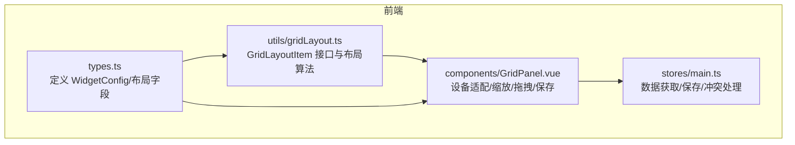
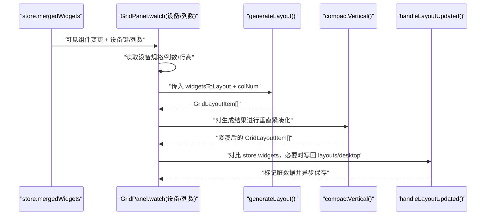
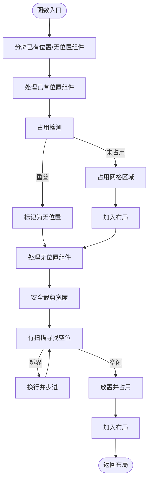
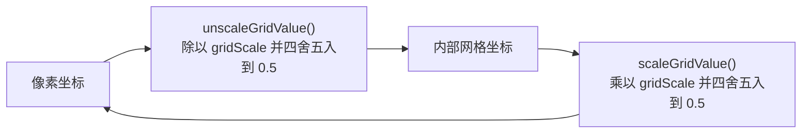
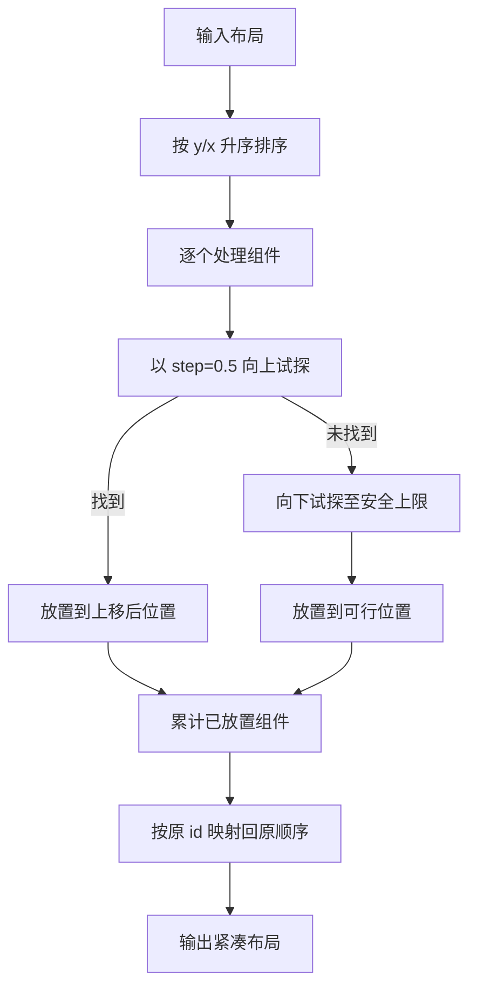
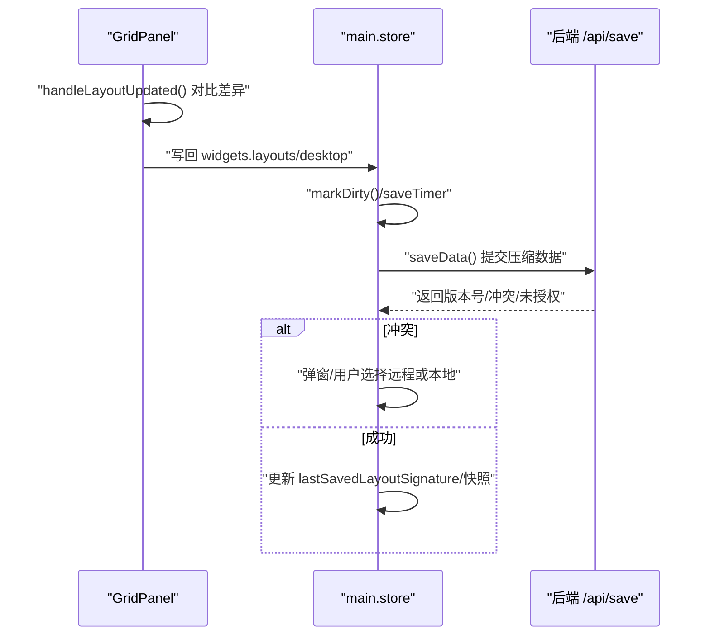
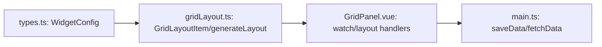

# 布局算法与数据结构

<cite>
**本文引用的文件**
- [gridLayout.ts](file://frontend/src/utils/gridLayout.ts)
- [GridPanel.vue](file://frontend/src/components/GridPanel.vue)
- [types.ts](file://frontend/src/types.ts)
- [main.ts](file://frontend/src/stores/main.ts)
</cite>

## 目录
1. [简介](#简介)
2. [项目结构](#项目结构)
3. [核心组件](#核心组件)
4. [架构总览](#架构总览)
5. [详细组件分析](#详细组件分析)
6. [依赖关系分析](#依赖关系分析)
7. [性能考量](#性能考量)
8. [故障排查指南](#故障排查指南)
9. [结论](#结论)
10. [附录](#附录)

## 简介
本文件面向 OFlatNas 的网格布局系统，围绕以下目标展开：  
- 解释 GridLayoutItem 接口定义与布局数据结构设计  
- 深入剖析网格计算算法（generateLayout）与紧凑化算法（compactVertical）  
- 说明布局缩放机制（scaleGridValue/unscaleGridValue）与碰撞检测逻辑  
- 解释设备适配策略（列数计算、行高调整）  
- 提供布局保存/恢复机制、数据校验规则与性能优化建议  
- 以可视化图示呈现关键流程，并给出可定位到源码的路径指引

## 项目结构
本布局系统主要由三部分组成：
- 布局算法与数据结构：位于前端 utils，负责将 WidgetConfig 转换为 GridLayoutItem 并进行网格放置与紧凑化
- 视图与交互：位于 GridPanel 组件，负责设备适配、缩放、拖拽、尺寸调整、保存/恢复等
- 数据模型：位于 types，定义 WidgetConfig 与相关布局字段
- 存储与持久化：位于 main store，负责数据的获取、冲突检测、保存与回滚

图表来源
- [gridLayout.ts:1-113](file://frontend/src/utils/gridLayout.ts#L1-L113)
- [GridPanel.vue:1-120](file://frontend/src/components/GridPanel.vue#L1-L120)
- [types.ts:202-224](file://frontend/src/types.ts#L202-L224)
- [main.ts:1329-1519](file://frontend/src/stores/main.ts#L1329-L1519)

章节来源
- [gridLayout.ts:1-113](file://frontend/src/utils/gridLayout.ts#L1-L113)
- [GridPanel.vue:1-120](file://frontend/src/components/GridPanel.vue#L1-L120)
- [types.ts:202-224](file://frontend/src/types.ts#L202-L224)
- [main.ts:1329-1519](file://frontend/src/stores/main.ts#L1329-L1519)

## 核心组件
- GridLayoutItem 接口：在 gridLayout.ts 中定义，扩展自 WidgetConfig，增加 i、x、y、w、h 字段，作为网格布局的最小单元
- generateLayout 算法：根据列数 colNum，对传入的 WidgetConfig 列表进行网格放置，支持已有位置保留与自动布局
- 缩放机制：在 GridPanel 中提供 scaleGridValue/unscaleGridValue，将像素坐标转换为内部网格单位（0.5 粒度）
- 紧凑化算法 compactVertical：按垂直方向压缩，消除空隙并避免碰撞
- 设备适配：根据设备类型与屏幕尺寸动态计算列数与行高，并在列数变化时强制重建网格组件以规避错乱
- 保存/恢复：通过 store 的 fetchData/saveData 实现布局的云端同步、冲突检测与回滚

章节来源
- [gridLayout.ts:3-9](file://frontend/src/utils/gridLayout.ts#L3-L9)
- [gridLayout.ts:11-112](file://frontend/src/utils/gridLayout.ts#L11-L112)
- [GridPanel.vue:714-804](file://frontend/src/components/GridPanel.vue#L714-L804)
- [GridPanel.vue:806-894](file://frontend/src/components/GridPanel.vue#L806-L894)
- [GridPanel.vue:896-956](file://frontend/src/components/GridPanel.vue#L896-L956)
- [main.ts:1329-1519](file://frontend/src/stores/main.ts#L1329-L1519)
- [main.ts:1670-1859](file://frontend/src/stores/main.ts#L1670-L1859)

## 架构总览
下面的序列图展示了从“可见组件列表”到“最终布局”的完整流程，包括设备适配、布局生成、紧凑化与保存。

图表来源
- [GridPanel.vue:806-894](file://frontend/src/components/GridPanel.vue#L806-L894)
- [GridPanel.vue:896-956](file://frontend/src/components/GridPanel.vue#L896-L956)
- [gridLayout.ts:11-112](file://frontend/src/utils/gridLayout.ts#L11-L112)

## 详细组件分析

### GridLayoutItem 接口与数据结构
- 接口定义：在 gridLayout.ts 中，GridLayoutItem 扩展 WidgetConfig，新增 i（唯一标识）、x/y（左上角坐标）、w/h（宽高，单位为网格格子）
- 数据来源：WidgetConfig 来自 types.ts，支持 layouts.desktop/tablet/mobile 三种设备下的独立布局，以及 colSpan/rowSpan 等兼容字段
- 结构特点：布局数据以“网格坐标系”表示，便于紧凑化与碰撞检测；同时保留原始像素级尺寸以便渲染

章节来源
- [gridLayout.ts:3-9](file://frontend/src/utils/gridLayout.ts#L3-L9)
- [types.ts:202-224](file://frontend/src/types.ts#L202-L224)

### 网格计算算法：generateLayout
- 输入：WidgetConfig 数组、列数 colNum
- 关键步骤：
  - 将组件分为“已有位置”和“无位置/失效位置”两类，优先保留已有位置，避免抢占导致重叠
  - 对“已有位置”组件先进行占用检测，若重叠则降级为“无位置”
  - 使用布尔矩阵记录占用区域，碰撞检测基于缩放后的网格坐标（0.5 粒度）
  - 对“无位置”组件，按行扫描放置，遇到可用区域即占用并写入布局
  - 宽度过大时进行安全裁剪，防止无限循环
- 输出：GridLayoutItem[]，按阅读顺序（行优先）排列

图表来源
- [gridLayout.ts:11-112](file://frontend/src/utils/gridLayout.ts#L11-L112)

章节来源
- [gridLayout.ts:11-112](file://frontend/src/utils/gridLayout.ts#L11-L112)

### 碰撞检测与占用管理
- 碰撞检测：基于网格坐标的矩形相交判断，支持 0.5 粒度的精细检测
- 占用管理：使用二维布尔矩阵记录占用，按缩放后的网格索引写入
- 安全性：在放置前二次检查占用，避免重叠；对宽度超过列数的组件进行裁剪

章节来源
- [gridLayout.ts:19-44](file://frontend/src/utils/gridLayout.ts#L19-L44)
- [gridLayout.ts:89-91](file://frontend/src/utils/gridLayout.ts#L89-L91)

### 缩放机制：scaleGridValue / unscaleGridValue
- 缩放因子：gridScale=2，内部网格单位为 0.5
- scaleGridValue：将内部网格单位转换为像素级单位（四舍五入到 0.5）
- unscaleGridValue：将像素级单位转换为内部网格单位（四舍五入到 0.5）
- 作用：在渲染层与布局层之间进行精确转换，保证拖拽与紧凑化的一致性

图表来源
- [GridPanel.vue:724-730](file://frontend/src/components/GridPanel.vue#L724-L730)
- [GridPanel.vue:740-753](file://frontend/src/components/GridPanel.vue#L740-L753)

章节来源
- [GridPanel.vue:724-753](file://frontend/src/components/GridPanel.vue#L724-L753)

### 紧凑化算法：compactVertical
- 目标：消除垂直空隙，尽可能将组件向上移动，同时避免与其他组件碰撞
- 策略：
  - 先按 y/x 升序排序
  - 对每个组件尝试以步进 step=1/gridScale 向上移动，找到第一个可放置位置
  - 若无法上移，则向下试探，直到找到可行位置或安全上限
- 输出：紧凑后的 GridLayoutItem[]，与原布局一一对应，按原 id 映射回

图表来源
- [GridPanel.vue:756-804](file://frontend/src/components/GridPanel.vue#L756-L804)

章节来源
- [GridPanel.vue:756-804](file://frontend/src/components/GridPanel.vue#L756-L804)

### 设备适配与列数/行高策略
- 列数计算：根据设备类型与配置，桌面端支持扩展模式与最大列数限制，移动端/平板端按设备特性设定
- 行高策略：不同设备采用固定行高，结合边距与缩放因子计算“缩放后行高”
- 动态适配：监听窗口尺寸与设备键变化，重新计算列数并触发布局重算
- 强制重建：当列数变化时，通过控制 key 的方式强制重建网格组件，避免布局错乱

章节来源
- [GridPanel.vue:679-728](file://frontend/src/components/GridPanel.vue#L679-L728)
- [GridPanel.vue:806-894](file://frontend/src/components/GridPanel.vue#L806-L894)

### 布局保存与恢复机制
- 保存时机：拖拽或尺寸调整后，对比 store.widgets 中的 layouts/desktop 与当前布局，若有差异则写回并标记脏数据
- 云端同步：通过 store.saveData 异步提交，支持压缩、重试、冲突检测与自动回滚
- 恢复策略：fetchData 获取云端最新数据，若本地有未保存布局则提示覆盖；支持“撤销布局”功能，基于快照回滚到上次保存的布局

图表来源
- [GridPanel.vue:896-956](file://frontend/src/components/GridPanel.vue#L896-L956)
- [main.ts:1670-1859](file://frontend/src/stores/main.ts#L1670-L1859)
- [main.ts:1329-1519](file://frontend/src/stores/main.ts#L1329-L1519)

章节来源
- [GridPanel.vue:896-956](file://frontend/src/components/GridPanel.vue#L896-L956)
- [main.ts:1670-1859](file://frontend/src/stores/main.ts#L1670-L1859)
- [main.ts:1329-1519](file://frontend/src/stores/main.ts#L1329-L1519)

### 数据验证与边界条件
- 宽度裁剪：当组件宽度超过列数时，强制裁剪到列数以内，防止无限循环
- 位置有效性：移动/拖拽后，若与现有布局不一致则写回；桌面端同时更新顶层 x/y/w/h
- 设备降级：移动端无布局时重置位置，强制按阅读顺序自动布局
- 尺寸规范化：尺寸调整时按 0.5 步进规范化，避免小数漂移

章节来源
- [gridLayout.ts:89-91](file://frontend/src/utils/gridLayout.ts#L89-L91)
- [GridPanel.vue:840-878](file://frontend/src/components/GridPanel.vue#L840-L878)
- [GridPanel.vue:1096-1117](file://frontend/src/components/GridPanel.vue#L1096-L1117)

## 依赖关系分析
- gridLayout.ts 依赖 WidgetConfig 类型定义，输出 GridLayoutItem
- GridPanel.vue 依赖 gridLayout.ts 的算法，并与 main store 协作完成保存/恢复
- main store 负责数据获取、冲突检测、保存与回滚，保障布局一致性

图表来源
- [types.ts:202-224](file://frontend/src/types.ts#L202-L224)
- [gridLayout.ts:3-9](file://frontend/src/utils/gridLayout.ts#L3-L9)
- [GridPanel.vue:806-894](file://frontend/src/components/GridPanel.vue#L806-L894)
- [main.ts:1329-1519](file://frontend/src/stores/main.ts#L1329-L1519)

章节来源
- [types.ts:202-224](file://frontend/src/types.ts#L202-L224)
- [gridLayout.ts:3-9](file://frontend/src/utils/gridLayout.ts#L3-L9)
- [GridPanel.vue:806-894](file://frontend/src/components/GridPanel.vue#L806-L894)
- [main.ts:1329-1519](file://frontend/src/stores/main.ts#L1329-L1519)

## 性能考量
- 网格矩阵占用检测：时间复杂度近似 O(k·w·h)，其中 k 为组件数量，w/h 为组件网格尺寸；可通过预分配稀疏矩阵或按行扫描优化
- 紧凑化：对每个组件进行步进试探，整体复杂度 O(n·m/step)，其中 n 为组件数，m 为最大纵坐标范围；可考虑按层批处理减少重复检查
- 拖拽与保存：通过“程序化更新标记”避免保存循环；使用节流/去抖与“脏数据标记”减少不必要的写入
- 设备切换：列数变化时强制重建网格组件，避免布局错乱；在高频切换场景下可考虑缓存中间态以降低重算成本

## 故障排查指南
- 布局错乱或重叠
  - 检查是否在编辑模式下触发了外部更新（watch 中有“编辑模式跳过外部更新”的逻辑）
  - 确认列数变化时是否强制重建网格组件
- 拖拽后未保存
  - 确认 handleLayoutUpdated 是否被调用，以及对比逻辑是否命中差异
  - 检查 store.saveTimer 与 isSaving 状态，避免并发保存
- 云端冲突
  - 查看冲突弹窗与 resolveConflict 流程，确认选择“远程/本地”
  - 必要时使用“撤销布局”回滚到上次保存快照
- 移动端布局异常
  - 确认移动端无布局时是否重置位置并强制按阅读顺序布局
  - 检查移动端特殊组件（如 clockweather、calendar 等）是否强制占满列宽

章节来源
- [GridPanel.vue:806-894](file://frontend/src/components/GridPanel.vue#L806-L894)
- [GridPanel.vue:896-956](file://frontend/src/components/GridPanel.vue#L896-L956)
- [main.ts:1670-1859](file://frontend/src/stores/main.ts#L1670-L1859)
- [main.ts:2384-2426](file://frontend/src/stores/main.ts#L2384-L2426)

## 结论
OFlatNas 的布局系统以“网格坐标系 + 缩放机制 + 紧凑化算法”为核心，结合设备适配与云端保存/恢复，实现了跨设备、可拖拽、可紧凑的网格布局体验。通过严格的碰撞检测、安全裁剪与增量保存策略，系统在复杂场景下仍能保持稳定与一致。建议在大规模组件场景下进一步优化网格矩阵与紧凑化过程，以获得更好的性能表现。

## 附录
- 关键实现路径参考
  - GridLayoutItem 接口与布局算法：[gridLayout.ts:3-112](file://frontend/src/utils/gridLayout.ts#L3-L112)
  - 设备适配与列数/行高：[GridPanel.vue:679-728](file://frontend/src/components/GridPanel.vue#L679-L728)
  - 缩放机制与 setter 逻辑：[GridPanel.vue:724-753](file://frontend/src/components/GridPanel.vue#L724-L753)
  - 紧凑化算法：[GridPanel.vue:756-804](file://frontend/src/components/GridPanel.vue#L756-L804)
  - 布局保存与恢复：[GridPanel.vue:896-956](file://frontend/src/components/GridPanel.vue#L896-L956), [main.ts:1670-1859](file://frontend/src/stores/main.ts#L1670-L1859), [main.ts:1329-1519](file://frontend/src/stores/main.ts#L1329-L1519)