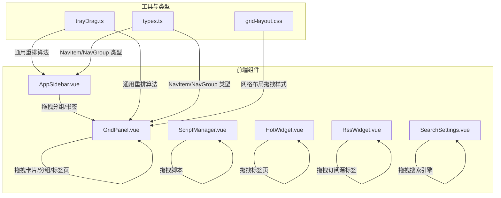
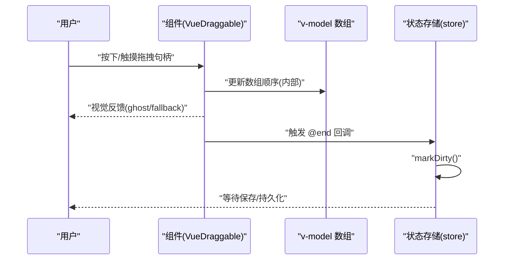
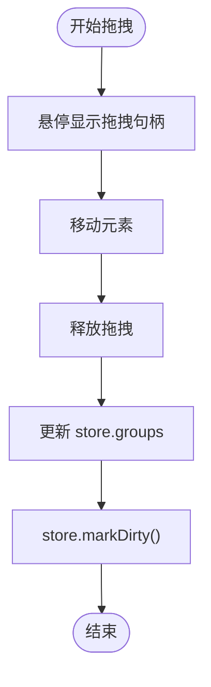
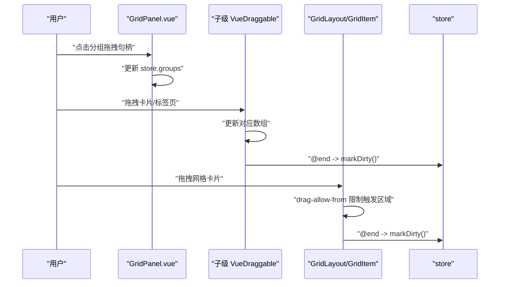
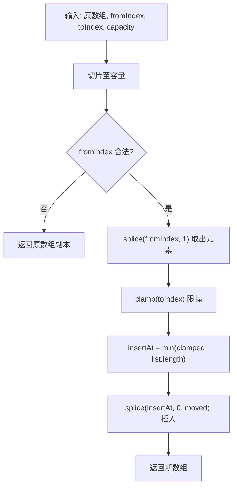
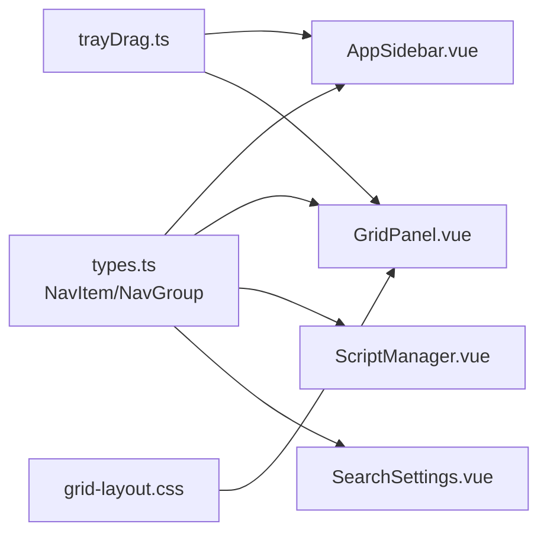

# 拖拽重排机制

<cite>
**本文引用的文件**
- [AppSidebar.vue](file://frontend/src/components/AppSidebar.vue)
- [GridPanel.vue](file://frontend/src/components/GridPanel.vue)
- [ScriptManager.vue](file://frontend/src/components/ScriptManager.vue)
- [HotWidget.vue](file://frontend/src/components/HotWidget.vue)
- [RssWidget.vue](file://frontend/src/components/RssWidget.vue)
- [SearchSettings.vue](file://frontend/src/components/SearchSettings.vue)
- [trayDrag.ts](file://frontend/src/utils/trayDrag.ts)
- [trayDrag.spec.ts](file://frontend/src/utils/trayDrag.spec.ts)
- [tray-drag.e2e.ts](file://frontend/e2e/tray-drag.e2e.ts)
- [types.ts](file://frontend/src/types.ts)
- [grid-layout.css](file://frontend/src/assets/grid-layout.css)
</cite>

## 目录
1. [简介](#简介)
2. [项目结构](#项目结构)
3. [核心组件](#核心组件)
4. [架构总览](#架构总览)
5. [详细组件分析](#详细组件分析)
6. [依赖关系分析](#依赖关系分析)
7. [性能考量](#性能考量)
8. [故障排查指南](#故障排查指南)
9. [结论](#结论)
10. [附录](#附录)

## 简介
本文件系统性梳理 OFlatNas 的拖拽重排机制，围绕 VueDraggable 集成与使用展开，覆盖拖拽事件处理、位置更新逻辑、状态管理、边界限制、反馈机制、冲突解决、预览效果、完成回调、性能优化、移动端适配与无障碍支持，并提供配置项、事件监听器与调试方法的具体实现路径。

## 项目结构
OFlatNas 在多个界面组件中使用 VueDraggable 实现拖拽重排：
- 应用侧边栏（分组与书签）：支持拖拽分组与文件夹内条目重排
- 仪表板网格面板（GridPanel）：支持分组、卡片、标签页等多场景拖拽
- 脚本管理（ScriptManager）：脚本列表拖拽排序
- 热榜标签页（HotWidget）：标签页拖拽排序
- RSS 标签页（RssWidget）：订阅源标签拖拽排序
- 搜索引擎设置（SearchSettings）：搜索引擎优先级拖拽调整
- 工具函数：通用的“托盘卡片”重排算法

**图表来源**
- [AppSidebar.vue:1011-1105](file://frontend/src/components/AppSidebar.vue#L1011-L1105)
- [GridPanel.vue:3026-3050](file://frontend/src/components/GridPanel.vue#L3026-L3050)
- [ScriptManager.vue:150-157](file://frontend/src/components/ScriptManager.vue#L150-L157)
- [HotWidget.vue:181-205](file://frontend/src/components/HotWidget.vue#L181-L205)
- [RssWidget.vue:231-262](file://frontend/src/components/RssWidget.vue#L231-L262)
- [SearchSettings.vue:37-44](file://frontend/src/components/SearchSettings.vue#L37-L44)
- [trayDrag.ts:1-20](file://frontend/src/utils/trayDrag.ts#L1-L20)
- [types.ts:1-62](file://frontend/src/types.ts#L1-L62)
- [grid-layout.css:1-56](file://frontend/src/assets/grid-layout.css#L1-L56)

**章节来源**
- [AppSidebar.vue:1011-1105](file://frontend/src/components/AppSidebar.vue#L1011-L1105)
- [GridPanel.vue:3026-3050](file://frontend/src/components/GridPanel.vue#L3026-L3050)
- [ScriptManager.vue:150-157](file://frontend/src/components/ScriptManager.vue#L150-L157)
- [HotWidget.vue:181-205](file://frontend/src/components/HotWidget.vue#L181-L205)
- [RssWidget.vue:231-262](file://frontend/src/components/RssWidget.vue#L231-L262)
- [SearchSettings.vue:37-44](file://frontend/src/components/SearchSettings.vue#L37-L44)
- [trayDrag.ts:1-20](file://frontend/src/utils/trayDrag.ts#L1-L20)
- [types.ts:1-62](file://frontend/src/types.ts#L1-L62)
- [grid-layout.css:1-56](file://frontend/src/assets/grid-layout.css#L1-L56)

## 核心组件
- VueDraggable 集成点：上述组件均通过 v-model 绑定可变数组，配合 handle、animation、ghost-class、fallback-class 等属性实现拖拽体验
- 状态管理：拖拽结束时调用 store.markDirty() 标记变更，便于后续持久化
- 边界控制：通过 disabled、sort、group、drag-allow-from、drag-ignore-from 等参数限制拖拽范围与目标
- 反馈机制：ghost-class/fallback-class 提供视觉反馈；动画时长与过渡类增强交互感知
- 冲突解决：不同区域使用 group 区分拖拽域；通过 drag-allow-from/drag-ignore-from 精准控制触发区域
- 移动端适配：在部分组件中针对手持设备限制拖拽触发区域，避免误触；同时使用 fallback-on-body 等参数提升兼容性
- 无障碍支持：提供标题与可访问性提示（如“拖动排序”），但未见专门的 ARIA 属性扩展

**章节来源**
- [AppSidebar.vue:1011-1105](file://frontend/src/components/AppSidebar.vue#L1011-L1105)
- [GridPanel.vue:3026-3050](file://frontend/src/components/GridPanel.vue#L3026-L3050)
- [ScriptManager.vue:150-157](file://frontend/src/components/ScriptManager.vue#L150-L157)
- [HotWidget.vue:181-205](file://frontend/src/components/HotWidget.vue#L181-L205)
- [RssWidget.vue:231-262](file://frontend/src/components/RssWidget.vue#L231-L262)
- [SearchSettings.vue:37-44](file://frontend/src/components/SearchSettings.vue#L37-L44)

## 架构总览
拖拽重排的整体流程如下：
- 用户在拖拽句柄或允许区域触发拖拽
- VueDraggable 基于 v-model 更新底层数组顺序
- 触发 @end 回调，标记脏状态（store.markDirty）
- 若需要，执行业务特定的更新逻辑（如更新分组项、保存配置）

**图表来源**
- [AppSidebar.vue](file://frontend/src/components/AppSidebar.vue#L1396)
- [GridPanel.vue](file://frontend/src/components/GridPanel.vue#L3324)
- [ScriptManager.vue](file://frontend/src/components/ScriptManager.vue#L152)
- [HotWidget.vue](file://frontend/src/components/HotWidget.vue#L185)
- [RssWidget.vue](file://frontend/src/components/RssWidget.vue#L237)
- [SearchSettings.vue](file://frontend/src/components/SearchSettings.vue#L44)

## 详细组件分析

### AppSidebar 拖拽（分组与书签）
- 分组拖拽：v-model 绑定 store.groups，handle 指向 .drag-handle，支持 ghost-class 与动画
- 文件夹内条目拖拽：对当前文件夹 children 使用相同模式，结束时调用 store.markDirty()
- 移动端折叠模式：禁用拖拽（disabled），折叠状态下显示提示气泡
- 边界与冲突：通过 group="bookmarks" 限定拖拽域；hover 显示拖拽句柄，避免误触

**图表来源**
- [AppSidebar.vue:1011-1105](file://frontend/src/components/AppSidebar.vue#L1011-L1105)
- [AppSidebar.vue:1243-1358](file://frontend/src/components/AppSidebar.vue#L1243-L1358)
- [AppSidebar.vue:1386-1455](file://frontend/src/components/AppSidebar.vue#L1386-L1455)

**章节来源**
- [AppSidebar.vue:1011-1105](file://frontend/src/components/AppSidebar.vue#L1011-L1105)
- [AppSidebar.vue:1243-1358](file://frontend/src/components/AppSidebar.vue#L1243-L1358)
- [AppSidebar.vue:1386-1455](file://frontend/src/components/AppSidebar.vue#L1386-L1455)

### GridPanel 拖拽（分组、卡片、标签页）
- 分组拖拽：v-model 绑定 store.groups，handle 指向 .group-handle，支持动画与禁用条件
- 卡片拖拽：子级 VueDraggable 绑定 group.items，@end 标记脏状态
- 标签页拖拽：在 HotWidget 与 RssWidget 中分别对 tabs/localFeeds 进行拖拽排序
- 网格布局拖拽：结合 GridLayout/GridItem 的拖拽参数，限制拖拽触发区域（drag-allow-from），避免链接点击误触发
- 边界与冲突：通过 group、sort、disabled、drag-allow-from、drag-ignore-from 控制行为

**图表来源**
- [GridPanel.vue:3026-3050](file://frontend/src/components/GridPanel.vue#L3026-L3050)
- [GridPanel.vue:3316-3327](file://frontend/src/components/GridPanel.vue#L3316-L3327)
- [GridPanel.vue:3437-3453](file://frontend/src/components/GridPanel.vue#L3437-L3453)
- [GridPanel.vue:3837-3839](file://frontend/src/components/GridPanel.vue#L3837-L3839)
- [HotWidget.vue:181-205](file://frontend/src/components/HotWidget.vue#L181-L205)
- [RssWidget.vue:231-262](file://frontend/src/components/RssWidget.vue#L231-L262)

**章节来源**
- [GridPanel.vue:3026-3050](file://frontend/src/components/GridPanel.vue#L3026-L3050)
- [GridPanel.vue:3316-3327](file://frontend/src/components/GridPanel.vue#L3316-L3327)
- [GridPanel.vue:3437-3453](file://frontend/src/components/GridPanel.vue#L3437-L3453)
- [GridPanel.vue:3837-3839](file://frontend/src/components/GridPanel.vue#L3837-L3839)
- [HotWidget.vue:181-205](file://frontend/src/components/HotWidget.vue#L181-L205)
- [RssWidget.vue:231-262](file://frontend/src/components/RssWidget.vue#L231-L262)

### ScriptManager 拖拽（脚本列表）
- 使用 Draggable（别名 VueDraggable）对 list 进行拖拽排序
- 通过 handle=".drag-handle" 限制拖拽触发区域
- 动画时长与 @end 回调用于更新列表与标记脏状态

**章节来源**
- [ScriptManager.vue:150-157](file://frontend/src/components/ScriptManager.vue#L150-L157)
- [ScriptManager.vue:168-184](file://frontend/src/components/ScriptManager.vue#L168-L184)
- [ScriptManager.vue](file://frontend/src/components/ScriptManager.vue#L152)

### SearchSettings 拖拽（搜索引擎优先级）
- 对 store.appConfig.searchEngines 进行拖拽排序
- 通过 handle=".drag-handle"、ghost-class="opacity-50"、fallback-class="drag-fallback" 提供反馈
- 支持默认搜索引擎选择与删除操作

**章节来源**
- [SearchSettings.vue:37-44](file://frontend/src/components/SearchSettings.vue#L37-L44)
- [SearchSettings.vue:53-70](file://frontend/src/components/SearchSettings.vue#L53-L70)
- [SearchSettings.vue:42-44](file://frontend/src/components/SearchSettings.vue#L42-L44)

### 托盘卡片重排工具（trayDrag）
- 通用重排算法：对传入数组进行切片、裁剪与插入，保证索引安全与容量上限
- 输入输出：原数组、起始索引、目标索引、容量；返回新数组，不修改原数组
- 测试覆盖：包含越界、超出长度、保持原序等边界用例

**图表来源**
- [trayDrag.ts:1-20](file://frontend/src/utils/trayDrag.ts#L1-L20)

**章节来源**
- [trayDrag.ts:1-20](file://frontend/src/utils/trayDrag.ts#L1-L20)
- [trayDrag.spec.ts:1-32](file://frontend/src/utils/trayDrag.spec.ts#L1-L32)

## 依赖关系分析
- 组件间耦合：各组件独立使用 VueDraggable，彼此无直接耦合；通过 store 共享状态
- 外部依赖：VueDraggable-plus（已引入），无循环依赖
- 数据模型：NavItem/NavGroup 类型贯穿多个组件，确保拖拽对象结构一致

**图表来源**
- [types.ts:1-62](file://frontend/src/types.ts#L1-L62)
- [AppSidebar.vue:1011-1105](file://frontend/src/components/AppSidebar.vue#L1011-L1105)
- [GridPanel.vue:3026-3050](file://frontend/src/components/GridPanel.vue#L3026-L3050)
- [ScriptManager.vue:150-157](file://frontend/src/components/ScriptManager.vue#L150-L157)
- [SearchSettings.vue:37-44](file://frontend/src/components/SearchSettings.vue#L37-L44)
- [trayDrag.ts:1-20](file://frontend/src/utils/trayDrag.ts#L1-L20)
- [grid-layout.css:1-56](file://frontend/src/assets/grid-layout.css#L1-L56)

**章节来源**
- [types.ts:1-62](file://frontend/src/types.ts#L1-L62)
- [trayDrag.ts:1-20](file://frontend/src/utils/trayDrag.ts#L1-L20)
- [grid-layout.css:1-56](file://frontend/src/assets/grid-layout.css#L1-L56)

## 性能考量
- 渲染优化：GridPanel 在编辑模式且无搜索时直接返回 store.groups 引用，使 VueDraggable 直接操作真实数组，减少中间层开销
- 动画与过渡：合理设置 animation 时长，避免过长导致卡顿；使用 will-change 与缓动函数优化网格尺寸变化
- 触发区域限制：通过 drag-allow-from/drag-ignore-from 减少误触发，降低不必要的 DOM 重排
- 跨域与回退：在复杂场景使用 forceFallback 与 fallback-on-body 提升兼容性，但需注意额外的 DOM 操作成本

**章节来源**
- [GridPanel.vue:958-981](file://frontend/src/components/GridPanel.vue#L958-L981)
- [GridPanel.vue:3080-3088](file://frontend/src/components/GridPanel.vue#L3080-L3088)
- [grid-layout.css:45-56](file://frontend/src/assets/grid-layout.css#L45-L56)

## 故障排查指南
- 拖拽无效
  - 检查是否设置了 disabled 或 sort=false
  - 确认 handle 是否正确指向拖拽句柄
  - 核对 group 名称是否匹配
- 误触点击
  - 使用 drag-allow-from/drag-ignore-from 精确控制触发区域
  - 在移动端限制拖拽句柄可见性
- 状态未持久化
  - 确认 @end 回调是否调用 store.markDirty()
  - 检查保存流程是否被阻塞
- 自动测试验证
  - e2e 测试覆盖了托盘拖拽对分组数据无影响以及位置更新逻辑

**章节来源**
- [GridPanel.vue:3080-3088](file://frontend/src/components/GridPanel.vue#L3080-L3088)
- [GridPanel.vue](file://frontend/src/components/GridPanel.vue#L3324)
- [tray-drag.e2e.ts:81-115](file://frontend/e2e/tray-drag.e2e.ts#L81-L115)

## 结论
OFlatNas 的拖拽重排机制通过 VueDraggable 在多个界面中统一实现，结合状态标记、边界控制与反馈样式，提供了稳定且直观的用户体验。通过工具函数与测试用例保障了通用重排逻辑的正确性。建议在复杂场景继续优化动画与触发区域策略，以进一步提升性能与可用性。

## 附录

### 拖拽配置选项速览
- 常用属性
  - v-model：绑定可变数组
  - handle：指定拖拽句柄选择器
  - animation：拖拽动画时长
  - ghost-class：拖拽占位样式类
  - fallback-class：回退样式类
  - group：拖拽域名称
  - disabled/sort：启用/排序开关
  - forceFallback/fallback-on-body：回退策略
  - drag-allow-from/drag-ignore-from：触发区域控制
- 事件回调
  - @end：拖拽结束，通常用于标记脏状态

**章节来源**
- [AppSidebar.vue:1011-1105](file://frontend/src/components/AppSidebar.vue#L1011-L1105)
- [GridPanel.vue:3026-3050](file://frontend/src/components/GridPanel.vue#L3026-L3050)
- [ScriptManager.vue:150-157](file://frontend/src/components/ScriptManager.vue#L150-L157)
- [SearchSettings.vue:37-44](file://frontend/src/components/SearchSettings.vue#L37-L44)