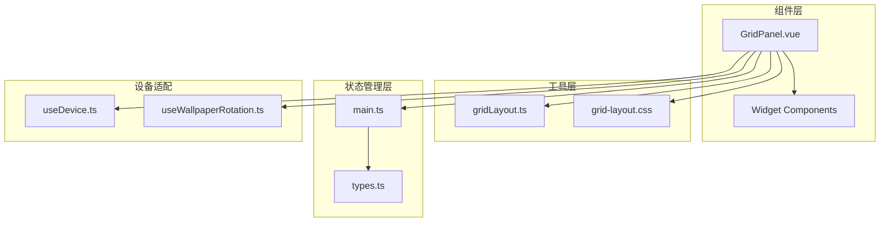
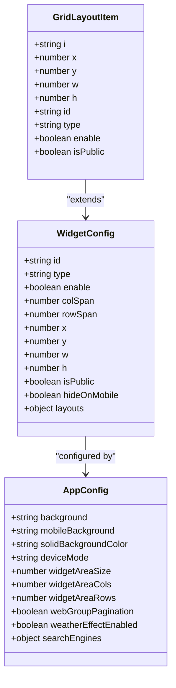
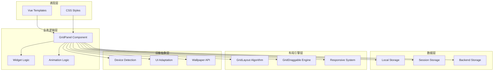
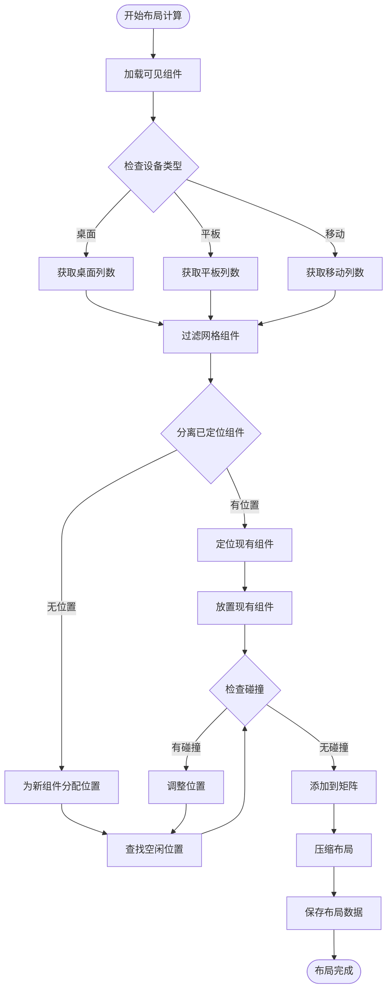
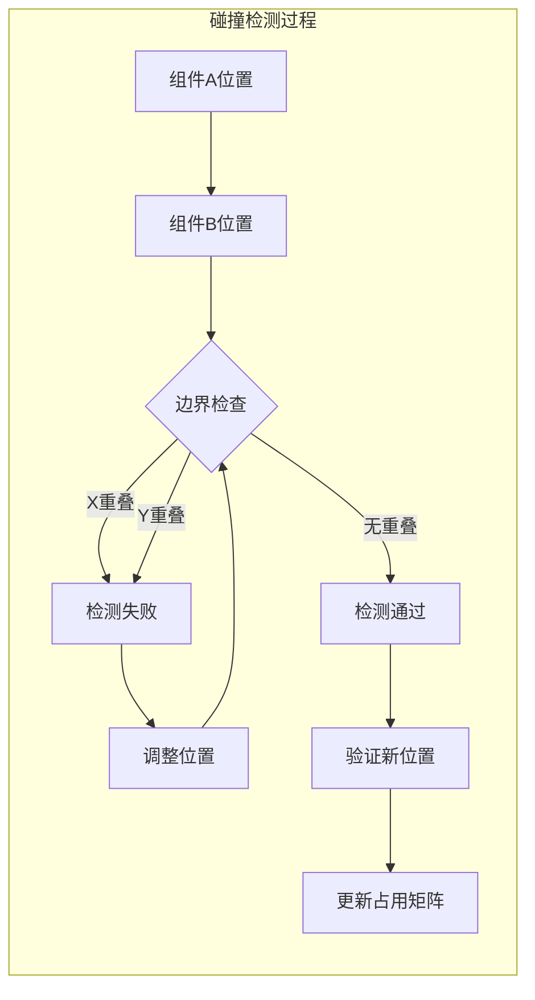
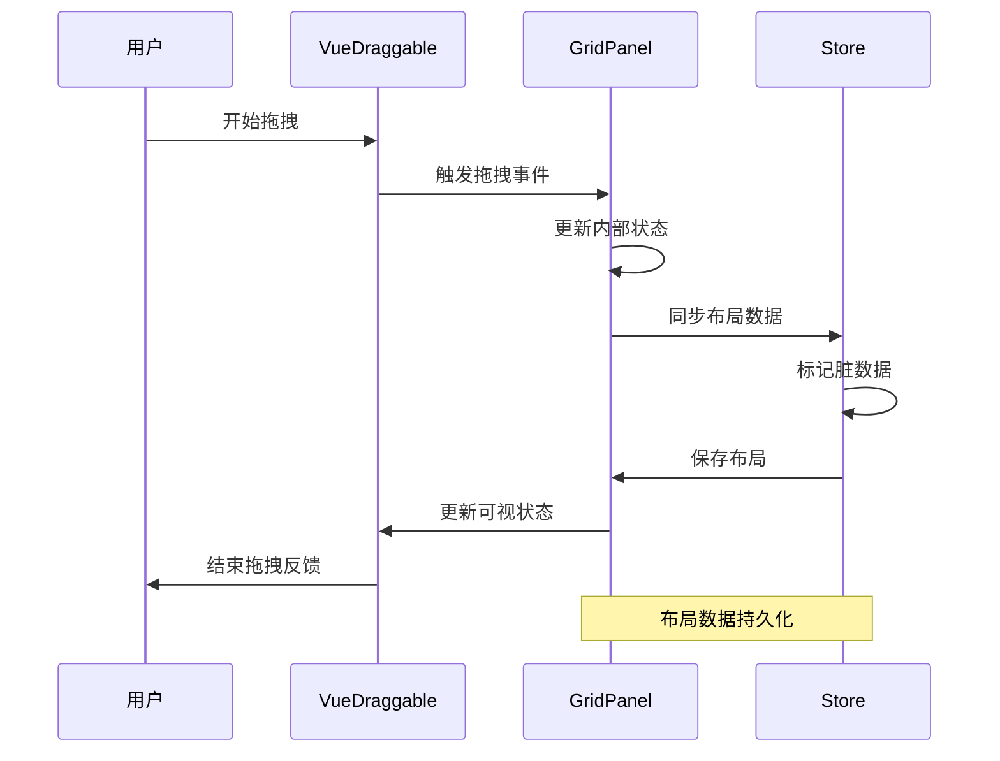
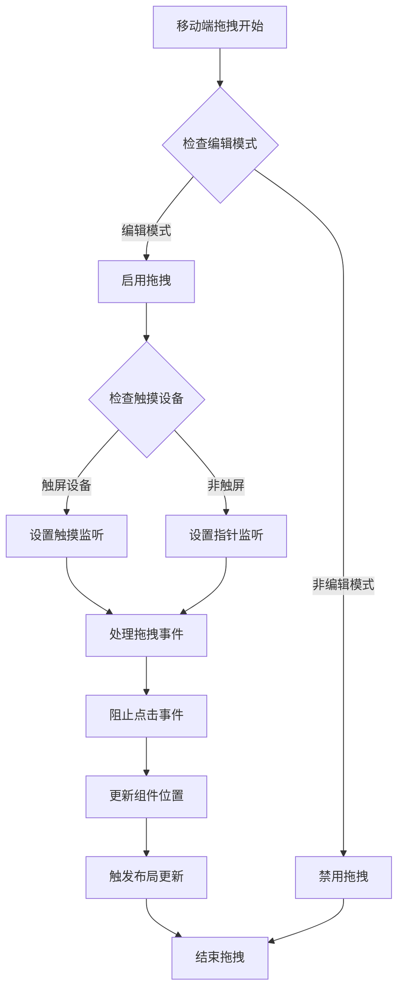
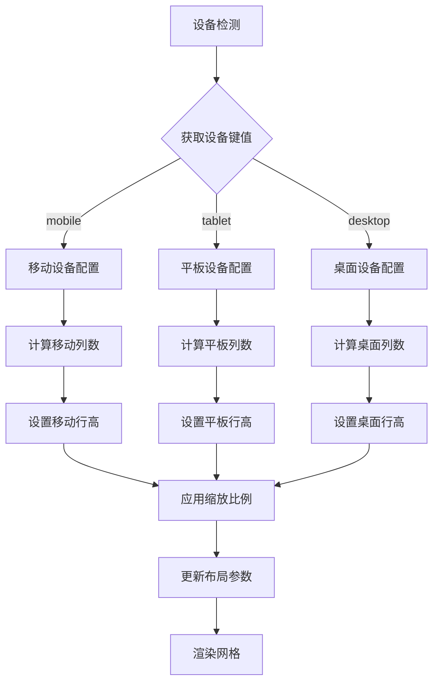
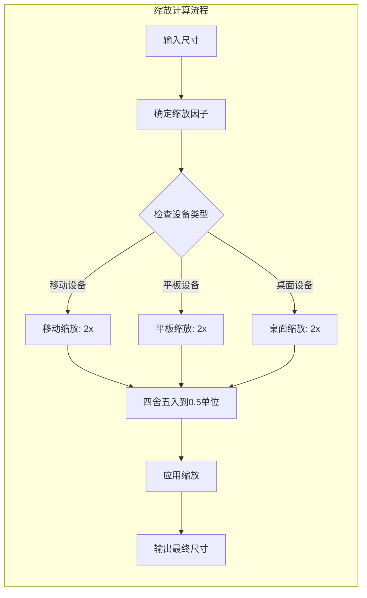
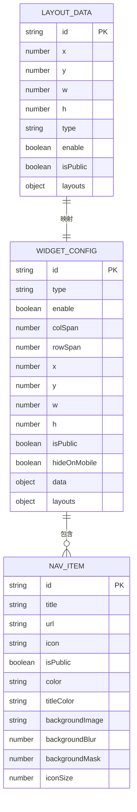

# 网格布局系统

<cite>
**本文档引用的文件**
- [GridPanel.vue](file://frontend/src/components/GridPanel.vue)
- [gridLayout.ts](file://frontend/src/utils/gridLayout.ts)
- [grid-layout.css](file://frontend/src/assets/grid-layout.css)
- [types.ts](file://frontend/src/types.ts)
- [main.ts](file://frontend/src/stores/main.ts)
</cite>

## 目录
1. [简介](#简介)
2. [项目结构](#项目结构)
3. [核心组件](#核心组件)
4. [架构概览](#架构概览)
5. [详细组件分析](#详细组件分析)
6. [依赖关系分析](#依赖关系分析)
7. [性能考虑](#性能考虑)
8. [故障排除指南](#故障排除指南)
9. [结论](#结论)

## 简介

OFNas 网格布局系统是一个基于 Vue 3 和 TypeScript 构建的现代化桌面应用界面系统。该系统实现了高度可定制的网格布局管理，支持拖拽重排、响应式适配和多设备兼容。系统集成了 VueDraggable 和 GridLayoutPlus 两个核心库，提供了流畅的用户体验和强大的布局控制能力。

该网格布局系统的主要特点包括：
- 基于 VueDraggable 的拖拽重排功能
- 基于 GridLayoutPlus 的网格布局引擎
- 响应式设计支持多种设备模式
- 动态布局算法和碰撞检测
- 设备适配和主题切换功能
- 布局数据持久化和恢复机制

## 项目结构

网格布局系统主要位于前端项目的 `src/components` 目录下，核心文件组织如下：



**图表来源**
- [GridPanel.vue:1-50](file://frontend/src/components/GridPanel.vue#L1-L50)
- [gridLayout.ts:1-50](file://frontend/src/utils/gridLayout.ts#L1-L50)
- [main.ts:1-50](file://frontend/src/stores/main.ts#L1-L50)

**章节来源**
- [GridPanel.vue:1-100](file://frontend/src/components/GridPanel.vue#L1-L100)
- [gridLayout.ts:1-50](file://frontend/src/utils/gridLayout.ts#L1-L50)
- [main.ts:1-100](file://frontend/src/stores/main.ts#L1-L100)

## 核心组件

### GridPanel 组件架构

GridPanel 是整个网格布局系统的核心组件，负责管理所有网格元素的渲染、布局计算和用户交互。该组件采用了模块化的架构设计，将不同的功能职责分离到独立的方法和计算属性中。

#### 主要功能模块

1. **布局管理系统**：负责网格布局的生成、更新和维护
2. **拖拽重排机制**：实现组件间的拖拽交换和位置调整
3. **响应式适配**：根据设备类型和屏幕尺寸动态调整布局
4. **数据持久化**：管理布局数据的保存和恢复
5. **设备适配**：支持桌面、平板和移动设备的不同布局需求

#### 关键数据结构



**图表来源**
- [gridLayout.ts:3-9](file://frontend/src/utils/gridLayout.ts#L3-L9)
- [types.ts:202-224](file://frontend/src/types.ts#L202-L224)
- [types.ts:86-189](file://frontend/src/types.ts#L86-L189)

**章节来源**
- [GridPanel.vue:676-754](file://frontend/src/components/GridPanel.vue#L676-L754)
- [gridLayout.ts:11-112](file://frontend/src/utils/gridLayout.ts#L11-L112)
- [types.ts:202-224](file://frontend/src/types.ts#L202-L224)

## 架构概览

网格布局系统采用分层架构设计，各层之间职责清晰，耦合度低，便于维护和扩展。



**图表来源**
- [GridPanel.vue:83-86](file://frontend/src/components/GridPanel.vue#L83-L86)
- [GridPanel.vue:847-894](file://frontend/src/components/GridPanel.vue#L847-L894)
- [main.ts:928-1013](file://frontend/src/stores/main.ts#L928-L1013)

## 详细组件分析

### 布局算法实现

网格布局系统的核心是其智能的布局算法，该算法能够自动处理组件的位置分配、碰撞检测和空间优化。

#### 布局生成流程



**图表来源**
- [gridLayout.ts:11-112](file://frontend/src/utils/gridLayout.ts#L11-L112)
- [GridPanel.vue:806-894](file://frontend/src/components/GridPanel.vue#L806-L894)

#### 碰撞检测算法

系统实现了精确的碰撞检测机制，确保组件不会相互重叠：



**图表来源**
- [gridLayout.ts:19-30](file://frontend/src/utils/gridLayout.ts#L19-L30)
- [gridLayout.ts:75-78](file://frontend/src/utils/gridLayout.ts#L75-L78)

**章节来源**
- [gridLayout.ts:11-112](file://frontend/src/utils/gridLayout.ts#L11-L112)
- [GridPanel.vue:756-804](file://frontend/src/components/GridPanel.vue#L756-L804)

### 拖拽重排机制

系统集成了 VueDraggable 库，提供了直观的拖拽重排体验。拖拽机制支持多种交互模式和设备适配。

#### 拖拽事件处理流程



**图表来源**
- [GridPanel.vue:896-956](file://frontend/src/components/GridPanel.vue#L896-L956)
- [GridPanel.vue:1119-1152](file://frontend/src/components/GridPanel.vue#L1119-L1152)

#### 移动端拖拽优化

针对移动设备，系统实现了专门的拖拽优化策略：



**图表来源**
- [GridPanel.vue:1061-1094](file://frontend/src/components/GridPanel.vue#L1061-L1094)
- [GridPanel.vue:3027-3050](file://frontend/src/components/GridPanel.vue#L3027-L3050)

**章节来源**
- [GridPanel.vue:896-956](file://frontend/src/components/GridPanel.vue#L896-L956)
- [GridPanel.vue:1061-1094](file://frontend/src/components/GridPanel.vue#L1061-L1094)

### 响应式适配策略

系统实现了多层次的响应式适配，能够根据不同设备和屏幕尺寸提供最优的布局体验。

#### 设备适配矩阵

| 设备类型 | 屏幕宽度 | 列数限制 | 行高设置 | 适配特性 |
|---------|----------|----------|----------|----------|
| 移动设备 | < 768px | 1列 | 120px | 隐藏移动端组件 |
| 平板设备 | 768px-1024px | 2-4列 | 130px | 纵向模式优化 |
| 桌面设备 | > 1024px | 4-16列 | 140px | 扩展模式支持 |

#### 响应式布局计算



**图表来源**
- [GridPanel.vue:679-731](file://frontend/src/components/GridPanel.vue#L679-L731)
- [GridPanel.vue:714-731](file://frontend/src/components/GridPanel.vue#L714-L731)

**章节来源**
- [GridPanel.vue:679-731](file://frontend/src/components/GridPanel.vue#L679-L731)
- [GridPanel.vue:714-731](file://frontend/src/components/GridPanel.vue#L714-L731)

### 尺寸计算和缩放机制

系统实现了精确的尺寸计算和缩放机制，确保在不同设备上都能获得一致的视觉效果。

#### 缩放算法实现



**图表来源**
- [GridPanel.vue:724-754](file://frontend/src/components/GridPanel.vue#L724-L754)
- [GridPanel.vue:1119-1152](file://frontend/src/components/GridPanel.vue#L1119-L1152)

#### 尺寸标准化处理

系统对组件尺寸进行了标准化处理，确保布局的一致性和准确性：

| 组件类型 | 最小尺寸 | 最大尺寸 | 标准化步长 |
|---------|----------|----------|------------|
| 文本组件 | 0.5单元 | 4单元 | 0.5单元 |
| 图标组件 | 1单元 | 4单元 | 0.5单元 |
| 媒体组件 | 1单元 | 6单元 | 0.5单元 |
| 自定义组件 | 0.5单元 | 8单元 | 0.5单元 |

**章节来源**
- [GridPanel.vue:724-754](file://frontend/src/components/GridPanel.vue#L724-L754)
- [GridPanel.vue:1096-1117](file://frontend/src/components/GridPanel.vue#L1096-L1117)

### 布局数据结构

系统使用了复杂的数据结构来管理布局信息，确保数据的完整性和一致性。

#### 布局数据模型



**图表来源**
- [gridLayout.ts:3-9](file://frontend/src/utils/gridLayout.ts#L3-L9)
- [types.ts:202-224](file://frontend/src/types.ts#L202-L224)
- [types.ts:1-24](file://frontend/src/types.ts#L1-L24)

**章节来源**
- [gridLayout.ts:3-9](file://frontend/src/utils/gridLayout.ts#L3-L9)
- [types.ts:202-224](file://frontend/src/types.ts#L202-L224)
- [types.ts:1-24](file://frontend/src/types.ts#L1-L24)

## 依赖关系分析

网格布局系统涉及多个层面的依赖关系，这些关系构成了系统的整体架构。

```mermaid
graph TB
subgraph "外部依赖"
VD[VueDraggable]
GLP[GridLayoutPlus]
VUE[Vue 3]
PINIA[Pinia]
VUEUSE[@vueuse/core]
end
subgraph "内部模块"
GP[GridPanel]
GL[GridLayout Utils]
MS[Main Store]
TS[Type Definitions]
end
subgraph "设备相关"
UD[useDevice]
UR[useWallpaperRotation]
UC[useChunkReload]
end
subgraph "样式系统"
CSS[grid-layout.css]
THEME[主题系统]
EFFECT[特效系统]
end
VD --> GP
GLP --> GP
VUE --> GP
PINIA --> MS
VUEUSE --> GP
GP --> GL
GP --> MS
GP --> UD
GP --> UR
GP --> UC
MS --> TS
GP --> CSS
GP --> THEME
GP --> EFFECT
```

**图表来源**
- [GridPanel.vue:14-24](file://frontend/src/components/GridPanel.vue#L14-L24)
- [GridPanel.vue:83-85](file://frontend/src/components/GridPanel.vue#L83-L85)
- [main.ts:1-16](file://frontend/src/stores/main.ts#L1-L16)

### 核心依赖关系

系统的核心依赖关系主要体现在以下几个方面：

1. **VueDraggable 集成**：提供拖拽功能的基础库
2. **GridLayoutPlus 集成**：提供网格布局计算的核心算法
3. **Pinia 状态管理**：集中管理应用状态和布局数据
4. **@vueuse/core 工具库**：提供响应式工具函数
5. **设备检测模块**：支持多设备适配

**章节来源**
- [GridPanel.vue:14-24](file://frontend/src/components/GridPanel.vue#L14-L24)
- [GridPanel.vue:83-85](file://frontend/src/components/GridPanel.vue#L83-L85)
- [main.ts:1-16](file://frontend/src/stores/main.ts#L1-L16)

## 性能考虑

网格布局系统在设计时充分考虑了性能优化，采用了多种策略来确保在各种设备上的流畅运行。

### 性能优化策略

#### 1. 布局计算优化

- **增量更新**：只对发生变化的组件进行重新布局计算
- **缓存机制**：缓存设备类型和列数计算结果
- **批量更新**：合并多个布局变更到单次更新中

#### 2. 渲染性能优化

- **虚拟滚动**：对于大量组件时使用虚拟滚动技术
- **懒加载**：组件按需加载，减少初始渲染负担
- **CSS 动画**：使用 GPU 加速的 CSS 动画替代 JavaScript 动画

#### 3. 内存管理优化

- **对象池**：复用布局计算中的临时对象
- **垃圾回收**：及时清理不再使用的组件实例
- **内存泄漏防护**：确保事件监听器正确清理

### 性能监控指标

系统提供了以下性能监控指标：

| 指标类型 | 目标值 | 监控方式 | 优化策略 |
|---------|--------|----------|----------|
| 布局计算时间 | < 50ms | 控制台日志 | 增量更新、缓存 |
| 组件渲染时间 | < 16ms | Performance API | 虚拟滚动、懒加载 |
| 内存使用 | < 50MB | 内存监控 | 对象池、垃圾回收 |
| FPS 帧率 | > 58fps | requestAnimationFrame | GPU 加速动画 |

## 故障排除指南

### 常见问题及解决方案

#### 1. 布局错乱问题

**问题描述**：组件位置显示异常或布局混乱

**可能原因**：
- 布局数据损坏
- 设备切换导致的列数不匹配
- 缓存数据过期

**解决方案**：
```javascript
// 检查布局数据完整性
function validateLayoutData(layoutData) {
    return layoutData.every(item => {
        return item.x !== undefined && 
               item.y !== undefined && 
               item.w !== undefined && 
               item.h !== undefined;
    });
}

// 重新生成布局
function regenerateLayout() {
    // 清除缓存
    clearLayoutCache();
    // 重新计算布局
    recalculateLayout();
    // 保存更新
    saveLayoutData();
}
```

#### 2. 拖拽功能异常

**问题描述**：拖拽操作无响应或行为异常

**可能原因**：
- 事件监听器冲突
- CSS 样式影响
- 浏览器兼容性问题

**解决方案**：
```javascript
// 检查拖拽事件状态
function checkDragState() {
    const dragElements = document.querySelectorAll('.drag-enabled');
    return dragElements.length > 0;
}

// 重新绑定拖拽事件
function rebindingDragEvents() {
    // 移除所有拖拽事件
    removeDragEvents();
    // 重新绑定事件
    bindDragEvents();
    // 更新状态
    updateDragState();
}
```

#### 3. 响应式适配问题

**问题描述**：在不同设备上显示效果不一致

**可能原因**：
- 设备检测逻辑错误
- CSS 媒体查询冲突
- 屏幕分辨率变化

**解决方案**：
```javascript
// 重新计算设备适配
function recalculateDeviceAdaptation() {
    // 更新设备检测
    updateDeviceDetection();
    // 重新计算列数
    recalculateColumnCount();
    // 更新样式
    updateStyles();
    // 触发布局重算
    triggerLayoutRecalculation();
}
```

### 调试工具和方法

#### 1. 布局调试

系统提供了多种调试工具来帮助开发者诊断布局问题：

- **布局可视化**：显示网格线和组件边界
- **尺寸标注**：显示组件的实际尺寸和位置
- **状态监控**：实时显示布局状态和计算结果

#### 2. 性能分析

- **性能面板**：监控布局计算时间和渲染性能
- **内存分析**：跟踪内存使用情况和泄漏
- **网络监控**：分析布局数据的加载和同步

#### 3. 错误日志

系统记录详细的错误日志，包括：
- 布局计算错误
- 数据同步异常
- 设备适配问题
- 性能警告

**章节来源**
- [GridPanel.vue:896-956](file://frontend/src/components/GridPanel.vue#L896-L956)
- [GridPanel.vue:1061-1094](file://frontend/src/components/GridPanel.vue#L1061-L1094)
- [GridPanel.vue:2677-2681](file://frontend/src/components/GridPanel.vue#L2677-L2681)

## 结论

OFNas 网格布局系统是一个功能强大、架构清晰的现代化布局管理解决方案。该系统通过精心设计的算法和优化策略，为用户提供了流畅、直观的网格布局体验。

### 主要优势

1. **高度可定制**：支持多种布局模式和设备适配
2. **性能优异**：采用多种优化策略确保流畅运行
3. **易于扩展**：模块化设计便于功能扩展和维护
4. **用户体验佳**：直观的拖拽操作和响应式设计

### 技术亮点

- 智能布局算法，自动处理组件排列和碰撞检测
- 精确的响应式适配，支持多设备无缝切换
- 完善的数据持久化机制，确保布局数据安全
- 丰富的配置选项，满足不同场景需求

### 未来发展方向

1. **性能进一步优化**：探索更多性能优化技术
2. **功能扩展**：增加更多布局模式和交互效果
3. **兼容性提升**：增强对新浏览器和设备的支持
4. **开发体验改善**：提供更好的开发工具和调试功能

该网格布局系统为 OFNas 提供了坚实的技术基础，为用户创造了一个美观、实用、高效的界面体验。