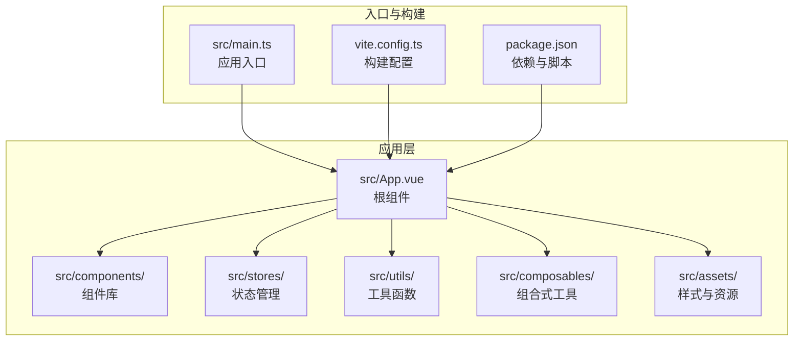
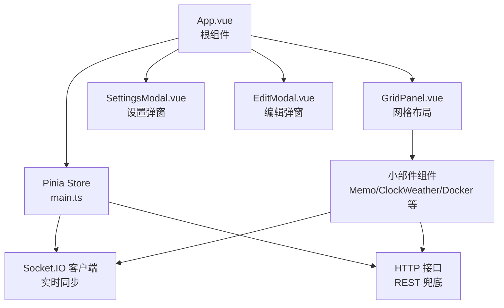
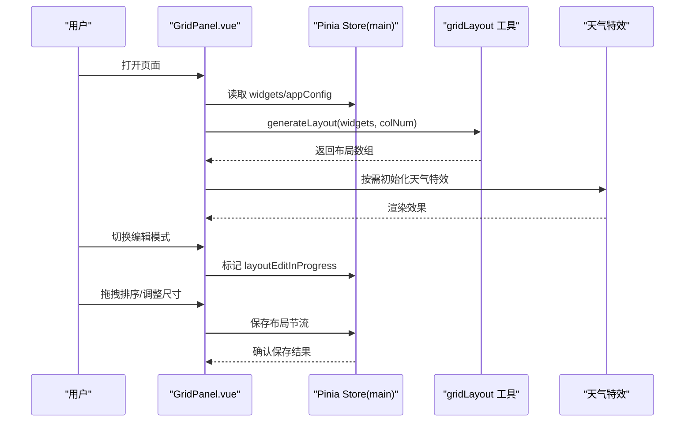
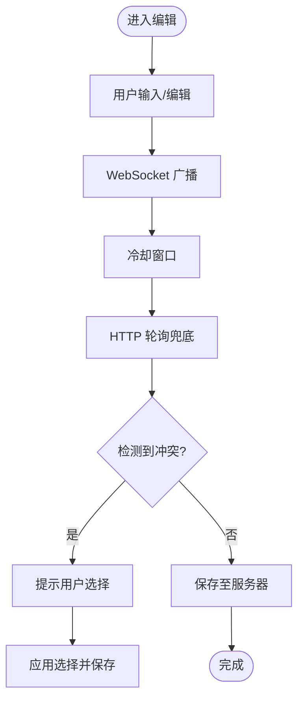
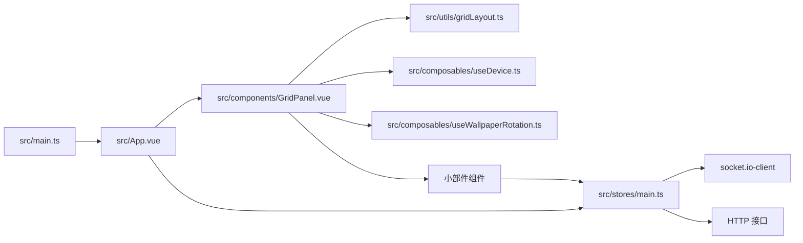

# 前端开发

<cite>
**本文引用的文件**
- [frontend/package.json](file://frontend/package.json)
- [frontend/vite.config.ts](file://frontend/vite.config.ts)
- [frontend/src/main.ts](file://frontend/src/main.ts)
- [frontend/src/App.vue](file://frontend/src/App.vue)
- [frontend/src/stores/main.ts](file://frontend/src/stores/main.ts)
- [frontend/src/components/GridPanel.vue](file://frontend/src/components/GridPanel.vue)
- [frontend/src/types.ts](file://frontend/src/types.ts)
- [frontend/src/utils/gridLayout.ts](file://frontend/src/utils/gridLayout.ts)
- [frontend/src/composables/useDevice.ts](file://frontend/src/composables/useDevice.ts)
- [frontend/src/stores/counter.ts](file://frontend/src/stores/counter.ts)
- [frontend/src/assets/main.css](file://frontend/src/assets/main.css)
- [frontend/src/components/MemoWidget.vue](file://frontend/src/components/MemoWidget.vue)
- [frontend/src/components/EditModal.vue](file://frontend/src/components/EditModal.vue)
- [frontend/src/components/SettingsModal.vue](file://frontend/src/components/SettingsModal.vue)
- [frontend/src/utils/network.js](file://frontend/src/utils/network.js)
- [frontend/src/composables/useWallpaperRotation.ts](file://frontend/src/composables/useWallpaperRotation.ts)
- [frontend/tsconfig.app.json](file://frontend/tsconfig.app.json)
- [frontend/env.d.ts](file://frontend/env.d.ts)
</cite>

## 目录
1. [简介](#简介)
2. [项目结构](#项目结构)
3. [核心组件](#核心组件)
4. [架构总览](#架构总览)
5. [组件详解](#组件详解)
6. [依赖关系分析](#依赖关系分析)
7. [性能考量](#性能考量)
8. [故障排查指南](#故障排查指南)
9. [结论](#结论)
10. [附录](#附录)

## 简介
本指南面向 OFlatNas 前端开发，聚焦于 Vue 3 Composition API 的使用、组件系统架构、状态管理模式与实时数据同步机制。文档围绕以下目标展开：
- 深入讲解 GridPanel 网格布局组件的设计与实现原理
- 解释各类小部件组件（如 MemoWidget、ClockWeatherWidget、DockerWidget 等）的职责边界与交互流程
- 详述 Pinia 状态管理在应用中的组织方式与最佳实践
- 总结组件间通信机制、响应式数据绑定与事件流
- 提供自定义组件开发规范、插件系统扩展思路与主题定制方法
- 讲解 WebSocket 与 Socket.IO 的集成与实时同步策略
- 给出调试技巧、性能优化建议与浏览器兼容性处理方案

## 项目结构
前端工程位于 frontend 目录，采用 Vite + Vue 3 + TypeScript 技术栈，结合 TailwindCSS 实现样式体系，并通过 Pinia 管理全局状态。

图示来源
- [frontend/src/main.ts:1-37](file://frontend/src/main.ts#L1-L37)
- [frontend/vite.config.ts:1-57](file://frontend/vite.config.ts#L1-L57)
- [frontend/package.json:1-77](file://frontend/package.json#L1-L77)

章节来源
- [frontend/src/main.ts:1-37](file://frontend/src/main.ts#L1-L37)
- [frontend/vite.config.ts:1-57](file://frontend/vite.config.ts#L1-L57)
- [frontend/package.json:1-77](file://frontend/package.json#L1-L77)

## 核心组件
- 根组件 App.vue：负责全局状态初始化、自定义脚本注入、版本与配置变更监听、全局错误捕获与遮罩处理、回到顶部按钮、状态监控挂载等。
- GridPanel.vue：网格布局容器，负责根据设备类型与列数生成布局、渲染小部件、处理拖拽排序、天气特效、壁纸轮播、搜索引擎与背景图预加载等。
- MemoWidget.vue：富文本/纯文本备忘录组件，内置冲突检测、版本回滚、IndexedDB 本地持久化、WebSocket 广播与 HTTP 轮询兜底的混合同步策略。
- SettingsModal.vue / EditModal.vue：设置与编辑弹窗，统一管理应用配置、网络规则、壁纸库、脚本管理、RSS/搜索设置等。
- useDevice.ts / useWallpaperRotation.ts：组合式工具，分别用于设备检测与壁纸轮播定时任务。
- main.ts：应用启动、Pinia 初始化、全局错误捕获与遮罩处理、应用初始化调用。

章节来源
- [frontend/src/App.vue:1-666](file://frontend/src/App.vue#L1-L666)
- [frontend/src/components/GridPanel.vue:1-800](file://frontend/src/components/GridPanel.vue#L1-L800)
- [frontend/src/components/MemoWidget.vue:1-800](file://frontend/src/components/MemoWidget.vue#L1-L800)
- [frontend/src/components/SettingsModal.vue:1-200](file://frontend/src/components/SettingsModal.vue#L1-L200)
- [frontend/src/components/EditModal.vue:1-200](file://frontend/src/components/EditModal.vue#L1-L200)
- [frontend/src/composables/useDevice.ts:1-72](file://frontend/src/composables/useDevice.ts#L1-L72)
- [frontend/src/composables/useWallpaperRotation.ts:1-116](file://frontend/src/composables/useWallpaperRotation.ts#L1-L116)
- [frontend/src/main.ts:1-37](file://frontend/src/main.ts#L1-L37)

## 架构总览
应用采用“根组件 + 网格布局 + 小部件”的分层架构，状态集中在 Pinia Store 中，通过 Socket.IO 实现实时同步，HTTP 作为兜底通道。组件间通过 props、events 与 Pinia store 协作。

图示来源
- [frontend/src/App.vue:1-666](file://frontend/src/App.vue#L1-L666)
- [frontend/src/stores/main.ts:1-800](file://frontend/src/stores/main.ts#L1-L800)
- [frontend/src/components/GridPanel.vue:1-800](file://frontend/src/components/GridPanel.vue#L1-L800)

## 组件详解

### GridPanel 网格布局组件
GridPanel 是整个仪表盘的核心容器，负责：
- 动态异步加载小部件组件，避免首屏阻塞
- 基于设备类型与列数生成布局，支持桌面/平板/移动端差异化
- 天气特效（雨/雾）、壁纸轮播、背景图预加载
- 编辑模式下的拖拽排序与布局保存
- 搜索引擎配置与默认引擎记忆
- 网络模式判断（LAN/WAN/Latency）与延迟阈值

图示来源
- [frontend/src/components/GridPanel.vue:1-800](file://frontend/src/components/GridPanel.vue#L1-L800)
- [frontend/src/utils/gridLayout.ts:1-113](file://frontend/src/utils/gridLayout.ts#L1-L113)
- [frontend/src/stores/main.ts:1-800](file://frontend/src/stores/main.ts#L1-L800)

章节来源
- [frontend/src/components/GridPanel.vue:1-800](file://frontend/src/components/GridPanel.vue#L1-L800)
- [frontend/src/utils/gridLayout.ts:1-113](file://frontend/src/utils/gridLayout.ts#L1-L113)

### MemoWidget 备忘录组件
MemoWidget 实现了“富文本/纯文本”双模式的混合编辑体验，具备：
- IndexedDB 本地持久化与版本快照
- 在线/离线状态感知与广播/轮询双通道同步
- 冲突检测与用户选择（保留本地/采用远端）
- WebSocket 广播与 HTTP 轮询兜底策略
- 输入冷却、广播节流与重试退避

图示来源
- [frontend/src/components/MemoWidget.vue:1-800](file://frontend/src/components/MemoWidget.vue#L1-L800)
- [frontend/src/stores/main.ts:1-800](file://frontend/src/stores/main.ts#L1-L800)

章节来源
- [frontend/src/components/MemoWidget.vue:1-800](file://frontend/src/components/MemoWidget.vue#L1-L800)

### SettingsModal 与 EditModal
- SettingsModal：集中管理应用配置、网络规则、壁纸库、脚本管理、RSS/搜索设置等。对配置变更进行深度监听并在弹窗打开时自动保存。
- EditModal：用于编辑导航项（书签/卡片）的表单，支持图标选择、备份 URL、颜色与透明度等配置。

章节来源
- [frontend/src/components/SettingsModal.vue:1-200](file://frontend/src/components/SettingsModal.vue#L1-L200)
- [frontend/src/components/EditModal.vue:1-200](file://frontend/src/components/EditModal.vue#L1-L200)

### 设备检测与壁纸轮播
- useDevice：基于窗口尺寸与 UA 判定设备类型，支持 HarmonyOS/Huawei/Alook 等特殊 UA 的样式适配。
- useWallpaperRotation：按随机/顺序模式定时轮换壁纸，支持 PC 与 Mobile 不同列表与间隔。

章节来源
- [frontend/src/composables/useDevice.ts:1-72](file://frontend/src/composables/useDevice.ts#L1-L72)
- [frontend/src/composables/useWallpaperRotation.ts:1-116](file://frontend/src/composables/useWallpaperRotation.ts#L1-L116)

### 网络规则与模式判定
- network.js：提供网络分类（LAN/OVERLAY/WAN）、规则解析与预设集合，支持基于域名/IP/前缀的匹配与阈值判定。

章节来源
- [frontend/src/utils/network.js:1-176](file://frontend/src/utils/network.js#L1-L176)

## 依赖关系分析

图示来源
- [frontend/src/main.ts:1-37](file://frontend/src/main.ts#L1-L37)
- [frontend/src/App.vue:1-666](file://frontend/src/App.vue#L1-L666)
- [frontend/src/components/GridPanel.vue:1-800](file://frontend/src/components/GridPanel.vue#L1-L800)
- [frontend/src/utils/gridLayout.ts:1-113](file://frontend/src/utils/gridLayout.ts#L1-L113)
- [frontend/src/composables/useDevice.ts:1-72](file://frontend/src/composables/useDevice.ts#L1-L72)
- [frontend/src/composables/useWallpaperRotation.ts:1-116](file://frontend/src/composables/useWallpaperRotation.ts#L1-L116)
- [frontend/src/stores/main.ts:1-800](file://frontend/src/stores/main.ts#L1-L800)

章节来源
- [frontend/src/main.ts:1-37](file://frontend/src/main.ts#L1-L37)
- [frontend/src/App.vue:1-666](file://frontend/src/App.vue#L1-L666)
- [frontend/src/stores/main.ts:1-800](file://frontend/src/stores/main.ts#L1-L800)

## 性能考量
- 模块懒加载与错误重试：GridPanel 对大量小部件采用 defineAsyncComponent 并在动态导入失败时触发页面刷新，避免白屏。
- 布局缩放与紧凑算法：GridPanel 使用 0.5 步进的缩放与垂直压缩算法，提升空间利用率并减少重叠。
- 节流与退避：MemoWidget 的广播节流与保存重试采用指数退避，降低网络压力。
- 资源缓存与版本戳：getAssetUrl 为资源 URL 注入时间戳，避免缓存导致的覆盖问题。
- 背景图预加载：PC/Mobile 背景图分别预加载，确保切换时无闪烁。
- 网络模式与心跳：根据延迟阈值动态切换 LAN/WAN/Latency 模式，降低不必要的请求。

章节来源
- [frontend/src/components/GridPanel.vue:1-800](file://frontend/src/components/GridPanel.vue#L1-L800)
- [frontend/src/stores/main.ts:1-800](file://frontend/src/stores/main.ts#L1-L800)
- [frontend/src/components/MemoWidget.vue:1-800](file://frontend/src/components/MemoWidget.vue#L1-L800)

## 故障排查指南
- 自定义脚本注入失败：检查 customJsDisclaimerAgreed 与脚本模块化标识，确认模块加载回调与错误处理。
- 保存失败提示：App.vue 对 /api/save 的响应进行拦截，根据状态码给出明确提示（如 413、网络异常）。
- 版本冲突与同步确认：App.vue 提供冲突解决与服务端同步确认弹窗，避免数据覆盖。
- WebSocket 断连与回退：main.ts 中 Socket.IO 以 polling 优先，断连时停止心跳并提示同步确认。
- 网络模式误判：通过 SettingsModal 的延迟阈值输入校验与应用，结合 network.js 的规则匹配进行修正。

章节来源
- [frontend/src/App.vue:1-666](file://frontend/src/App.vue#L1-L666)
- [frontend/src/stores/main.ts:1-800](file://frontend/src/stores/main.ts#L1-L800)
- [frontend/src/utils/network.js:1-176](file://frontend/src/utils/network.js#L1-L176)

## 结论
OFlatNas 前端以 Vue 3 + Composition API 为核心，结合 Pinia 实现清晰的状态管理，通过 GridPanel 统一承载各类小部件，并以 Socket.IO 与 HTTP 双通道实现高效稳定的实时同步。组件间通过 props、事件与 store 协作，配合工具函数与组合式工具，形成高内聚、低耦合的架构。遵循本文的开发规范与最佳实践，可快速扩展新的小部件与功能模块。

## 附录

### 开发规范与最佳实践
- 组件命名与职责：每个小部件独立封装，暴露最小化 props，内部状态尽量私有化并通过 store 共享。
- 响应式与组合式：优先使用 ref/computed/watch 与组合式工具（useDevice、useWallpaperRotation），避免重复逻辑。
- 网络与同步：优先使用 Socket.IO 广播，HTTP 作为兜底；对关键接口增加超时与重试策略。
- 样式与主题：使用 TailwindCSS 与 CSS 变量，支持深色/浅色与夜间模式；通过 App.vue 的自定义 CSS 注入实现主题扩展。
- 类型安全：在 types.ts 中集中定义接口，组件与 store 明确类型约束，避免运行期错误。

章节来源
- [frontend/src/types.ts:1-298](file://frontend/src/types.ts#L1-L298)
- [frontend/src/assets/main.css:1-132](file://frontend/src/assets/main.css#L1-L132)
- [frontend/src/stores/counter.ts:1-13](file://frontend/src/stores/counter.ts#L1-L13)

### TypeScript 与构建配置要点
- tsconfig.app.json：启用 ESNext 模块解析、DOM/DOM.Iterable 库、路径别名 @/*，并排除部分演示组件。
- env.d.ts：声明 Vite 环境类型，确保开发时类型提示完整。

章节来源
- [frontend/tsconfig.app.json:1-37](file://frontend/tsconfig.app.json#L1-L37)
- [frontend/env.d.ts:1-2](file://frontend/env.d.ts#L1-L2)