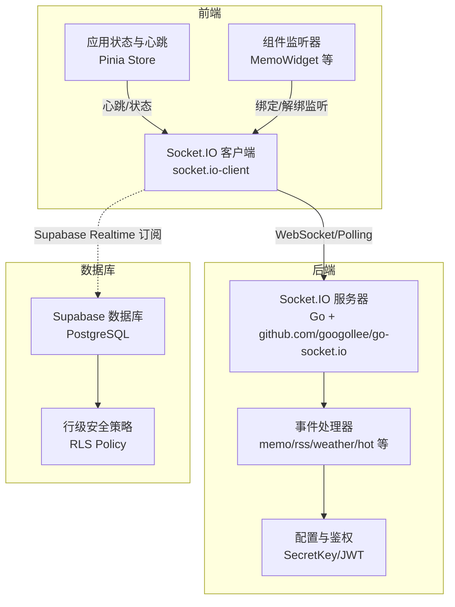
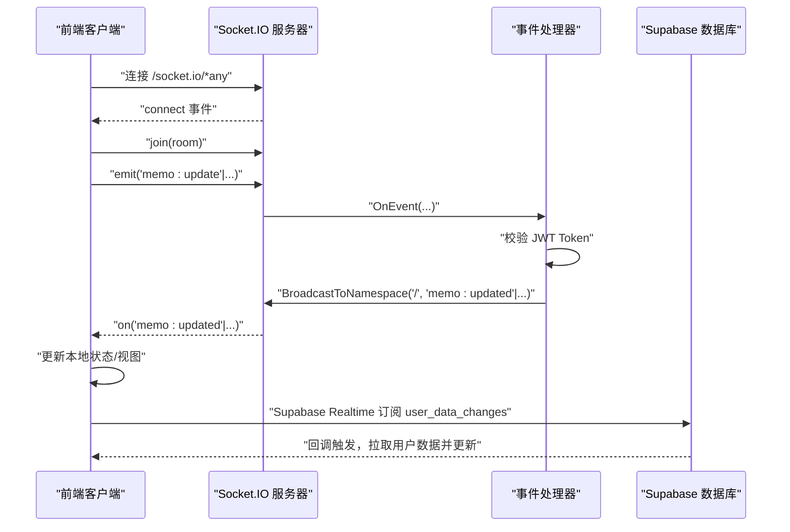
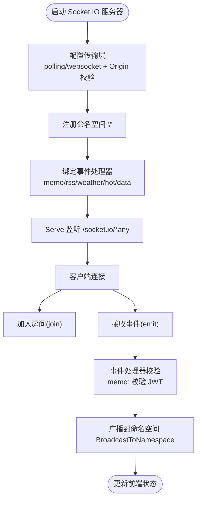
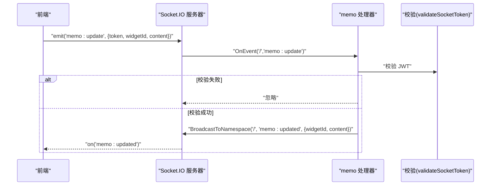
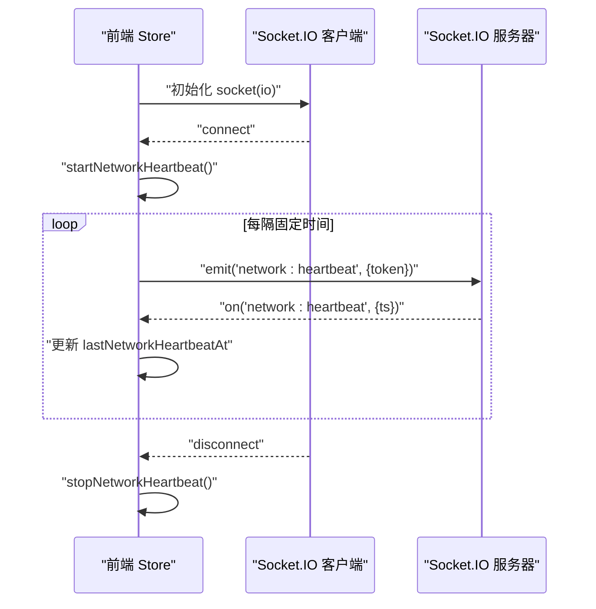
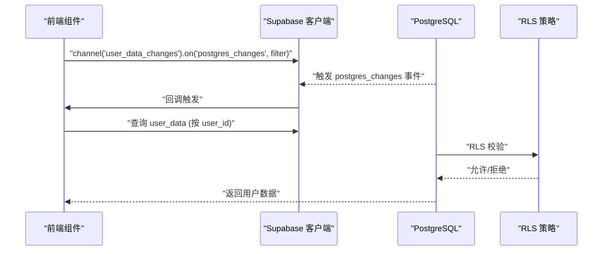
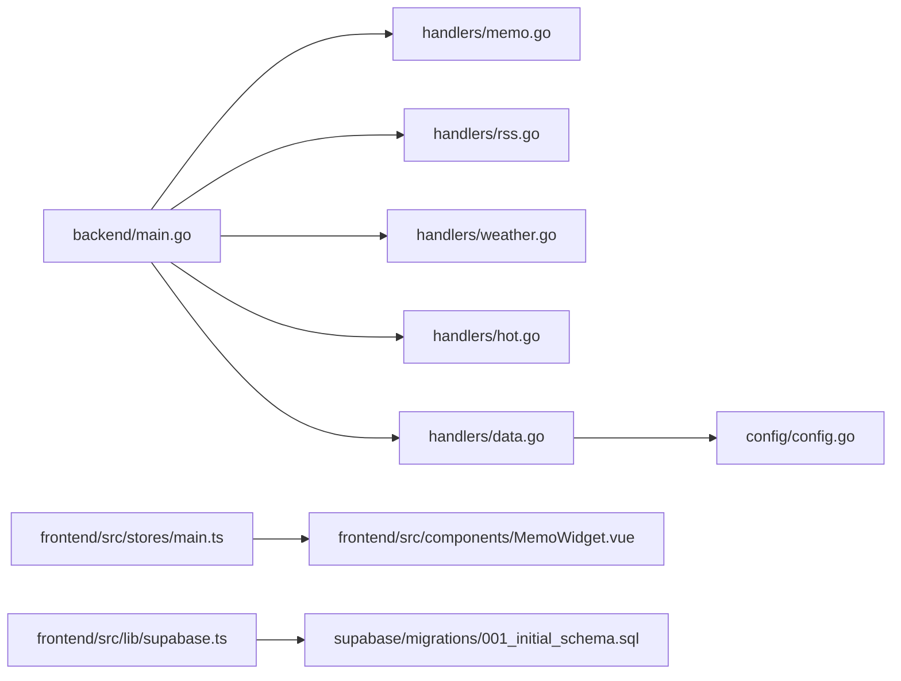

# WebSocket 集成

<cite>
**本文档引用的文件**
- [main.go](file://backend/main.go)
- [supabase.ts](file://frontend/src/lib/supabase.ts)
- [data.go](file://backend/handlers/data.go)
- [memo.go](file://backend/handlers/memo.go)
- [rss.go](file://backend/handlers/rss.go)
- [weather.go](file://backend/handlers/weather.go)
- [hot.go](file://backend/handlers/hot.go)
- [system.go](file://backend/handlers/system.go)
- [config.go](file://backend/config/config.go)
- [main.ts](file://frontend/src/stores/main.ts)
- [MemoWidget.vue](file://frontend/src/components/MemoWidget.vue)
- [001_initial_schema.sql](file://supabase/migrations/001_initial_schema.sql)
</cite>

## 目录
1. [简介](#简介)
2. [项目结构](#项目结构)
3. [核心组件](#核心组件)
4. [架构总览](#架构总览)
5. [详细组件分析](#详细组件分析)
6. [依赖关系分析](#依赖关系分析)
7. [性能考量](#性能考量)
8. [故障排查指南](#故障排查指南)
9. [结论](#结论)
10. [附录](#附录)

## 简介
本文件系统性阐述 OFlatNas 的 WebSocket 集成方案，涵盖连接建立流程、连接状态管理、断线重连机制、消息格式与事件类型、认证与安全、实时数据推送策略、性能监控与资源清理等。同时补充说明 Supabase Realtime 的 WebSocket 实现原理与数据库层的行级安全策略。

## 项目结构
- 后端使用 Go 的 Socket.IO 服务器，挂载在 /socket.io 路径，支持 polling 与 websocket 两种传输方式，并通过 CORS 与 Origin 校验保障跨域安全。
- 前端使用 socket.io-client，优先尝试 polling，具备自动重连与心跳检测能力。
- Supabase Realtime 作为独立的实时订阅通道，基于 PostgreSQL 的 postgres_changes 事件驱动，结合 RLS 策略实现按用户隔离的实时数据推送。

图示来源
- [main.go:79-115](file://backend/main.go#L79-L115)
- [main.ts:32-36](file://frontend/src/stores/main.ts#L32-L36)
- [supabase.ts:10-19](file://frontend/src/lib/supabase.ts#L10-L19)

章节来源
- [main.go:79-115](file://backend/main.go#L79-L115)
- [main.ts:32-36](file://frontend/src/stores/main.ts#L32-L36)
- [supabase.ts:10-19](file://frontend/src/lib/supabase.ts#L10-L19)

## 核心组件
- 后端 Socket.IO 服务器与传输层
  - 支持 polling 与 websocket 两种传输，Origin 校验由 EngineIO Transport 层完成。
  - 提供命名空间 "/"，事件包括 data-updated、memo:updated、todo:updated、weather:data、hot:data、rss:data 等。
- 事件处理器
  - memo: 更新事件经 JWT 校验后广播给所有连接。
  - rss/weather/hot 事件通过缓存与异步刷新机制，成功后广播最新数据。
- 前端 Socket 客户端与心跳
  - 自动重连、心跳定时器、断线停止心跳、连接后根据模式调整心跳间隔。
- Supabase Realtime
  - 基于 postgres_changes 的实时订阅，按用户过滤，回调拉取最新用户数据并触发 UI 更新。

章节来源
- [main.go:79-115](file://backend/main.go#L79-L115)
- [memo.go:25-39](file://backend/handlers/memo.go#L25-L39)
- [rss.go:82-135](file://backend/handlers/rss.go#L82-L135)
- [weather.go:114-146](file://backend/handlers/weather.go#L114-L146)
- [hot.go:31-79](file://backend/handlers/hot.go#L31-L79)
- [main.ts:58-100](file://frontend/src/stores/main.ts#L58-L100)
- [supabase.ts:211-255](file://frontend/src/lib/supabase.ts#L211-L255)

## 架构总览
WebSocket 在 OFlatNas 中承担两类职责：
- 应用内实时通信：后端 Socket.IO 广播“数据变更”和“第三方数据更新”，前端组件订阅对应事件以保持界面与服务端一致。
- Supabase Realtime：用户维度的实时数据订阅，基于 postgres_changes 事件，结合 RLS 策略确保数据隔离。

图示来源
- [main.go:100-111](file://backend/main.go#L100-L111)
- [memo.go:25-39](file://backend/handlers/memo.go#L25-L39)
- [supabase.ts:211-255](file://frontend/src/lib/supabase.ts#L211-L255)

## 详细组件分析

### 后端 Socket.IO 服务器与传输层
- 传输选择：polling 与 websocket，Origin 校验通过 EngineIO Transport 的 CheckOrigin 完成。
- 命名空间："/"，事件注册在 main.go 中完成。
- 连接生命周期：OnConnect、OnDisconnect、OnEvent 统一入口。
- 事件广播：事件处理器在验证通过后调用 BroadcastToNamespace 广播到所有连接。

图示来源
- [main.go:79-115](file://backend/main.go#L79-L115)
- [main.go:100-111](file://backend/main.go#L100-L111)

章节来源
- [main.go:79-115](file://backend/main.go#L79-L115)
- [main.go:100-111](file://backend/main.go#L100-L111)

### 事件处理器与消息格式
- memo:updated
  - 事件：memo:update（客户端发送），memo:updated（服务端广播）
  - 参数：token（JWT）、widgetId、content
  - 校验：parseMemoPayload → validateSocketToken（JWT HS256，用户名提取）
  - 广播：BroadcastToNamespace("/", "memo:updated", { widgetId, content })
- todo:updated
  - 类似 memo，事件名与参数结构一致
- network:mode / network:heartbeat
  - network:mode：校验 token + 模式合法性（auto/lan/wan/latency），广播 { mode, username }
  - network:heartbeat：校验 token，回显 { ts }
- rss/weather/hot
  - 事件：rss:fetch、weather:fetch、hot:fetch
  - 缓存命中：直接 Emit "rss/data" / "weather/data" / "hot/data"
  - 异步刷新：后台刷新并 BroadcastToNamespace 广播最新数据

图示来源
- [memo.go:25-39](file://backend/handlers/memo.go#L25-L39)
- [memo.go:204-225](file://backend/handlers/memo.go#L204-L225)

章节来源
- [memo.go:25-39](file://backend/handlers/memo.go#L25-L39)
- [memo.go:98-121](file://backend/handlers/memo.go#L98-L121)
- [memo.go:204-225](file://backend/handlers/memo.go#L204-L225)
- [rss.go:82-135](file://backend/handlers/rss.go#L82-L135)
- [weather.go:114-146](file://backend/handlers/weather.go#L114-L146)
- [hot.go:31-79](file://backend/handlers/hot.go#L31-L79)

### 前端连接与心跳
- 客户端初始化：socket.io-client，transports 包含 polling 与 websocket，reconnection 开启，reconnectionAttempts 限制。
- 连接状态：connect/disconnect/connect_error 事件，维护 isConnected 状态。
- 心跳机制：emitNetworkHeartbeat 定时发送 network:heartbeat，服务端回显 ts；定期检测 lastNetworkHeartbeatAt 是否超时，动态切换网络同步状态。
- 模式感知：根据 forceNetworkMode（auto/lan/wan/latency）调整心跳间隔与超时阈值。

图示来源
- [main.ts:32-36](file://frontend/src/stores/main.ts#L32-L36)
- [main.ts:58-100](file://frontend/src/stores/main.ts#L58-L100)
- [main.ts:444-467](file://frontend/src/stores/main.ts#L444-L467)

章节来源
- [main.ts:32-36](file://frontend/src/stores/main.ts#L32-L36)
- [main.ts:58-100](file://frontend/src/stores/main.ts#L58-L100)
- [main.ts:444-467](file://frontend/src/stores/main.ts#L444-L467)

### Supabase Realtime 实时订阅
- 客户端：通过 @supabase/supabase-js 创建客户端，启用自动刷新 token。
- 订阅：channel('user_data_changes').on('postgres_changes', { event:'*', schema:'public', table:'user_data', filter:`user_id=eq.${userId}` }, 回调)。
- 回调：每次触发时拉取用户全部 user_data 并回调上层，UI 组件订阅该回调以更新状态。
- 数据库层：启用 RLS，策略限制 users 与 user_data 的访问范围，确保用户只能看到自己的数据。

图示来源
- [supabase.ts:211-255](file://frontend/src/lib/supabase.ts#L211-L255)
- [001_initial_schema.sql:194-216](file://supabase/migrations/001_initial_schema.sql#L194-L216)

章节来源
- [supabase.ts:211-255](file://frontend/src/lib/supabase.ts#L211-L255)
- [001_initial_schema.sql:194-216](file://supabase/migrations/001_initial_schema.sql#L194-L216)

### 断线重连与连接超时
- 后端：EngineIO Transport 层负责连接与断开，事件处理器在连接建立后进行业务初始化。
- 前端：socket.io-client 自动重连，最大重连次数受 reconnectionAttempts 限制；心跳超时检测决定网络同步状态。
- 连接超时：前端根据 lastNetworkHeartbeatAt 与超时阈值判断网络同步是否活跃，必要时降级为轮询模式。

章节来源
- [main.go:79-115](file://backend/main.go#L79-L115)
- [main.ts:32-36](file://frontend/src/stores/main.ts#L32-L36)
- [main.ts:444-467](file://frontend/src/stores/main.ts#L444-L467)

### 安全配置、TLS 与认证
- TLS：后端未显式启用 TLS，建议在反向代理层（如 Nginx/Caddy）开启 HTTPS 并终止 TLS。
- Origin 校验：EngineIO Transport.CheckOrigin 对请求 Origin 进行白名单校验，防止跨站攻击。
- JWT 认证：memo/todo 等事件通过 validateSocketToken 校验 Bearer Token，使用 SecretKey 生成的 HS256 签名。
- Supabase 认证：前端启用自动刷新 token；数据库启用 RLS，策略限制用户访问范围。

章节来源
- [main.go:83-91](file://backend/main.go#L83-L91)
- [memo.go:204-225](file://backend/handlers/memo.go#L204-L225)
- [config.go:206-208](file://backend/config/config.go#L206-L208)
- [supabase.ts:14-18](file://frontend/src/lib/supabase.ts#L14-L18)
- [001_initial_schema.sql:194-216](file://supabase/migrations/001_initial_schema.sql#L194-L216)

### 实时数据推送策略
- 批量更新：保存数据接口（SaveData）完成后，广播 data-updated，携带 username 与 version，前端据此更新版本号。
- 增量同步：memo/todo 等小范围更新通过事件直接推送增量内容，避免全量拉取。
- 缓存与异步刷新：rss/weather/hot 采用缓存 + 异步刷新策略，首次命中缓存立即返回，后台刷新并广播最新数据。

章节来源
- [data.go:736-741](file://backend/handlers/data.go#L736-L741)
- [memo.go:34-37](file://backend/handlers/memo.go#L34-L37)
- [rss.go:82-135](file://backend/handlers/rss.go#L82-L135)
- [weather.go:114-146](file://backend/handlers/weather.go#L114-L146)
- [hot.go:31-79](file://backend/handlers/hot.go#L31-L79)

### 性能监控与资源清理
- 前端心跳：通过定时器与超时检测评估网络健康度，按模式调整心跳频率，降低带宽占用。
- 后端缓存：rss/weather/hot 使用共享缓存，命中即快速响应，后台异步刷新，减少重复请求。
- 连接清理：断线时停止心跳定时器，释放监听器；组件卸载时移除 Supabase 订阅。

章节来源
- [main.ts:444-467](file://frontend/src/stores/main.ts#L444-L467)
- [rss.go:161-182](file://backend/handlers/rss.go#L161-L182)
- [weather.go:367-380](file://backend/handlers/weather.go#L367-L380)
- [hot.go:107-121](file://backend/handlers/hot.go#L107-L121)
- [supabase.ts:246-254](file://frontend/src/lib/supabase.ts#L246-L254)

## 依赖关系分析
- 后端
  - main.go 依赖 socket.io 与 engineio，注册事件处理器并挂载到 /socket.io/*any。
  - 事件处理器依赖 config.GetSecretKeyString() 生成的密钥进行 JWT 校验。
- 前端
  - main.ts 依赖 socket.io-client，维护连接状态与心跳。
  - MemoWidget.vue 绑定/解绑 memo:updated 与 connect 事件监听。
- Supabase
  - supabase.ts 依赖 @supabase/supabase-js，订阅 user_data_changes 并按用户过滤。

图示来源
- [main.go:100-111](file://backend/main.go#L100-L111)
- [memo.go:25-39](file://backend/handlers/memo.go#L25-L39)
- [rss.go:82-135](file://backend/handlers/rss.go#L82-L135)
- [weather.go:114-146](file://backend/handlers/weather.go#L114-L146)
- [hot.go:31-79](file://backend/handlers/hot.go#L31-L79)
- [data.go:736-741](file://backend/handlers/data.go#L736-L741)
- [config.go:206-208](file://backend/config/config.go#L206-L208)
- [main.ts:32-36](file://frontend/src/stores/main.ts#L32-L36)
- [MemoWidget.vue:915-925](file://frontend/src/components/MemoWidget.vue#L915-L925)
- [supabase.ts:211-255](file://frontend/src/lib/supabase.ts#L211-L255)
- [001_initial_schema.sql:194-216](file://supabase/migrations/001_initial_schema.sql#L194-L216)

章节来源
- [main.go:100-111](file://backend/main.go#L100-L111)
- [config.go:206-208](file://backend/config/config.go#L206-L208)
- [main.ts:32-36](file://frontend/src/stores/main.ts#L32-L36)
- [MemoWidget.vue:915-925](file://frontend/src/components/MemoWidget.vue#L915-L925)
- [supabase.ts:211-255](file://frontend/src/lib/supabase.ts#L211-L255)
- [001_initial_schema.sql:194-216](file://supabase/migrations/001_initial_schema.sql#L194-L216)

## 性能考量
- 传输选择：在反代/防火墙环境下优先使用 polling，确保可用性；在稳定网络下使用 websocket 降低延迟。
- 心跳优化：根据网络模式（latency/auto/lan/wan）动态调整心跳间隔与超时阈值，减少不必要的请求。
- 缓存策略：rss/weather/hot 使用 TTL 缓存与后台刷新，命中即返回，显著降低外部 API 压力。
- 广播范围：仅在必要时广播，避免对所有连接发送冗余数据。

## 故障排查指南
- 连接失败
  - 检查 CORS 与 Origin 校验：确保请求头 Origin 在允许列表中。
  - 检查反向代理：确认 /socket.io/*any 路由转发正确。
- 心跳异常
  - 前端：确认 lastNetworkHeartbeatAt 是否持续更新；检查超时阈值设置。
  - 后端：确认 network:heartbeat 事件处理逻辑与回显。
- 认证失败
  - 确认 Bearer Token 格式与签名算法（HS256）一致；核对 SecretKey 是否一致。
- Supabase 订阅无效
  - 确认用户登录状态与用户 ID；检查 RLS 策略是否生效；确认过滤条件 user_id=eq.{userId}。

章节来源
- [main.go:83-91](file://backend/main.go#L83-L91)
- [main.ts:444-467](file://frontend/src/stores/main.ts#L444-L467)
- [memo.go:204-225](file://backend/handlers/memo.go#L204-L225)
- [supabase.ts:211-255](file://frontend/src/lib/supabase.ts#L211-L255)
- [001_initial_schema.sql:194-216](file://supabase/migrations/001_initial_schema.sql#L194-L216)

## 结论
OFlatNas 的 WebSocket 集成通过 Socket.IO 与 Supabase Realtime 双通道实现应用内实时通信与用户数据实时推送。后端提供严格的 Origin 校验与 JWT 认证，前端具备完善的重连与心跳机制。配合缓存与异步刷新策略，系统在复杂网络环境下仍能保持良好的实时性与稳定性。

## 附录
- 关键事件一览
  - 应用内：data-updated、memo:updated、todo:updated、weather:data、hot:data、rss:data、network:mode、network:heartbeat
  - Supabase：user_data_changes（postgres_changes）
- 建议
  - 在生产环境启用 HTTPS 与严格 CSP。
  - 对热点事件实施速率限制与连接数上限控制。
  - 定期清理不再使用的 Supabase 订阅与 Socket 监听器。