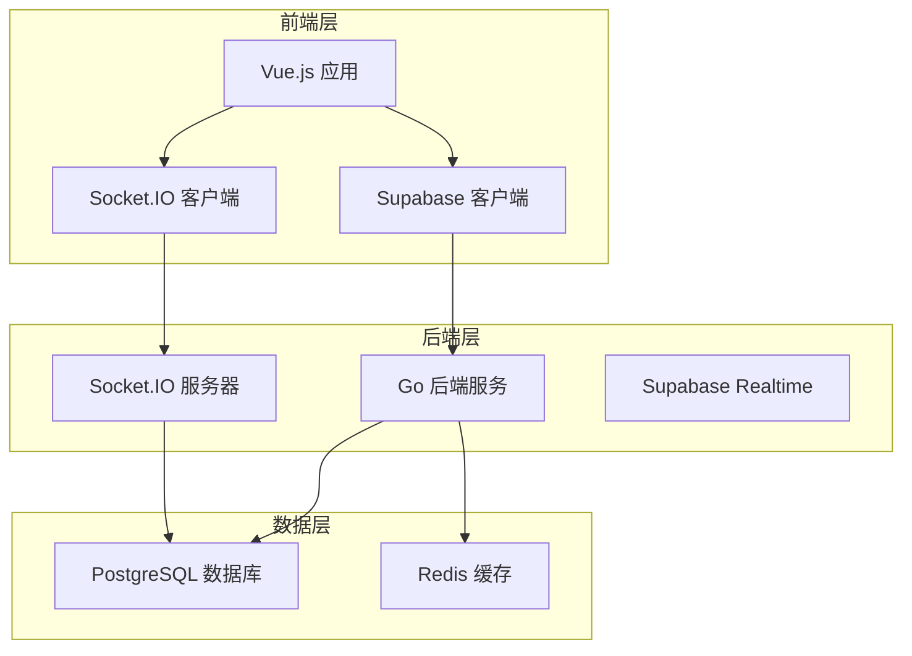
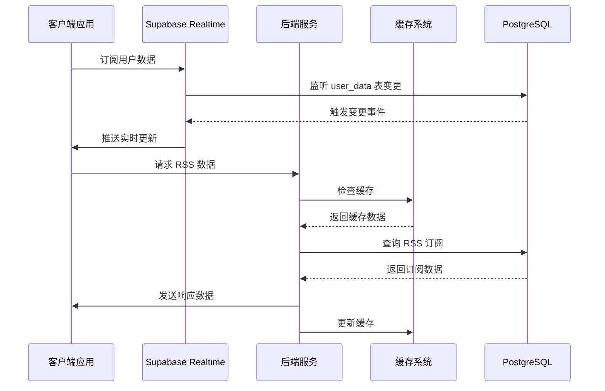
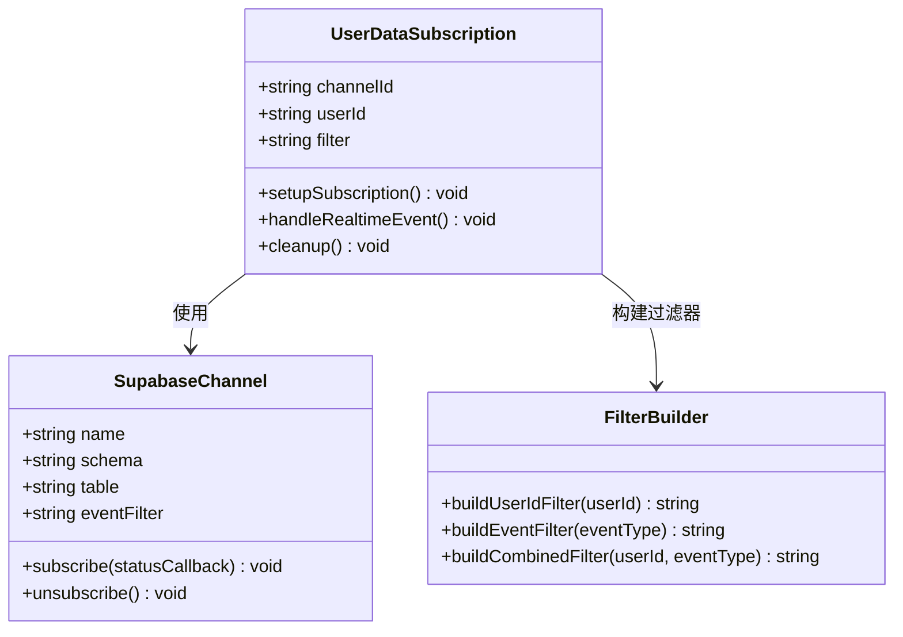
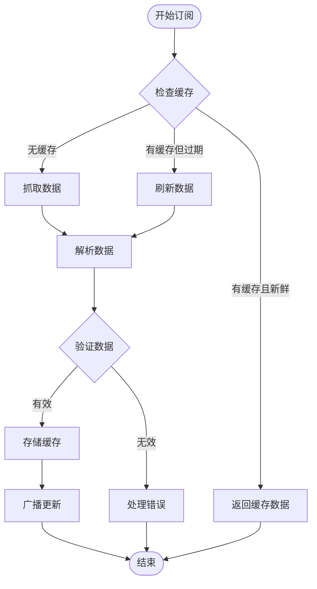
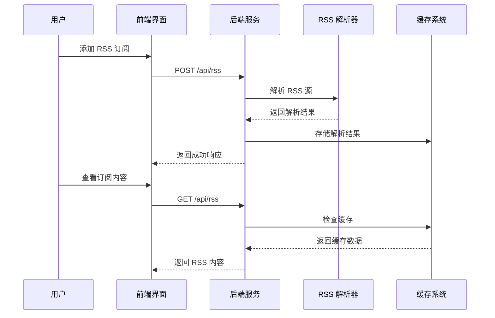
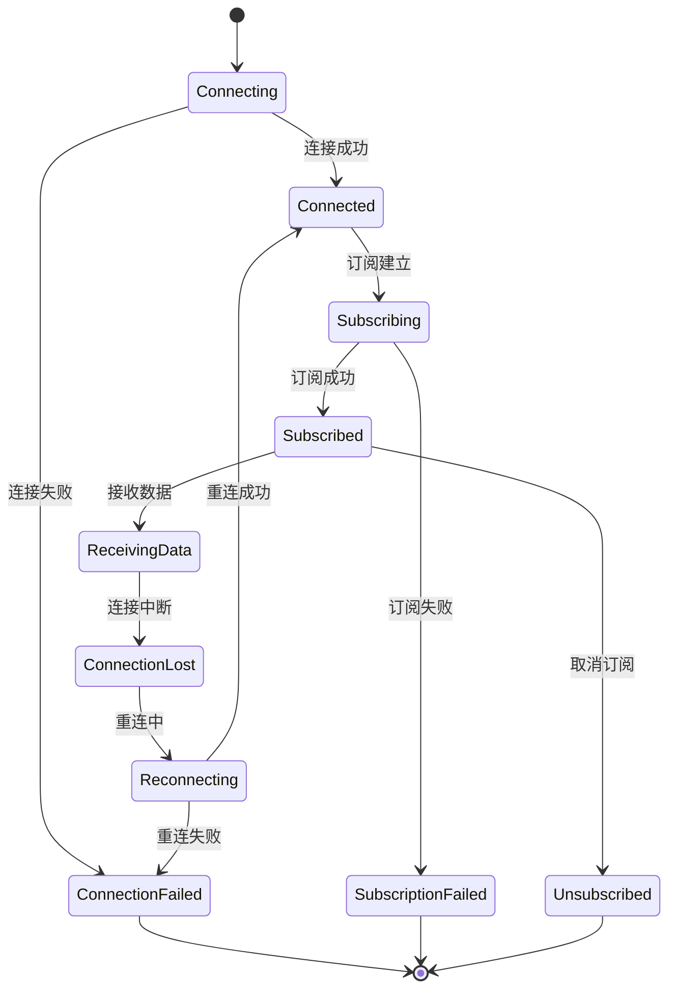
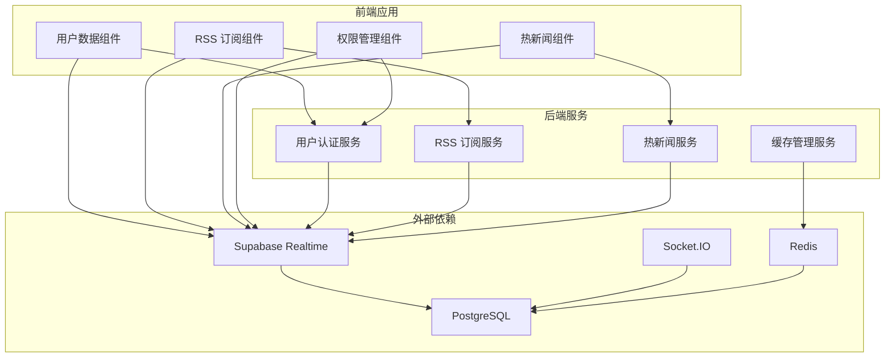

# 实时订阅管理

<cite>
**本文档引用的文件**
- [backend/main.go](file://backend/main.go)
- [frontend/src/lib/supabase.ts](file://frontend/src/lib/supabase.ts)
- [backend/handlers/rss.go](file://backend/handlers/rss.go)
- [backend/handlers/hot.go](file://backend/handlers/hot.go)
- [backend/handlers/widget_cache.go](file://backend/handlers/widget_cache.go)
- [supabase/migrations/001_initial_schema.sql](file://supabase/migrations/001_initial_schema.sql)
- [frontend/src/components/RssWidget.vue](file://frontend/src/components/RssWidget.vue)
- [frontend/src/components/RssSettings.vue](file://frontend/src/components/RssSettings.vue)
- [backend/middleware/auth.go](file://backend/middleware/auth.go)
</cite>

## 目录
1. [简介](#简介)
2. [项目结构](#项目结构)
3. [核心组件](#核心组件)
4. [架构概览](#架构概览)
5. [详细组件分析](#详细组件分析)
6. [依赖关系分析](#依赖关系分析)
7. [性能考虑](#性能考虑)
8. [故障排除指南](#故障排除指南)
9. [结论](#结论)

## 简介

OFaltNas 的实时订阅管理系统是一个基于 Supabase Realtime 和 Socket.IO 的全栈解决方案，用于实现实时数据更新和订阅管理。该系统支持多种数据类型的实时订阅，包括用户数据、热新闻和 RSS 订阅源。

系统采用分层架构设计，后端使用 Go 语言构建，前端使用 Vue.js 开发，通过 Supabase Realtime 提供实时数据同步能力。系统实现了完整的订阅生命周期管理、权限控制和数据隔离机制。

## 项目结构

项目采用前后端分离的架构，主要分为以下几个部分：

**图表来源**
- [backend/main.go:25-115](file://backend/main.go#L25-L115)
- [frontend/src/lib/supabase.ts:10-19](file://frontend/src/lib/supabase.ts#L10-L19)

**章节来源**
- [backend/main.go:1-267](file://backend/main.go#L1-267)
- [frontend/src/lib/supabase.ts:1-343](file://frontend/src/lib/supabase.ts#L1-L343)

## 核心组件

### Supabase Realtime 客户端

Supabase Realtime 是整个订阅系统的核心组件，提供了以下关键功能：

- **实时数据同步**: 基于 PostgreSQL 的变更通知机制
- **订阅管理**: 支持频道创建、事件监听和连接管理
- **权限控制**: 集成 Supabase Auth 的行级安全策略
- **过滤机制**: 支持基于 SQL 表达式的数据过滤

### Socket.IO 服务器

Socket.IO 服务器负责处理实时通信和广播消息：

- **事件驱动架构**: 基于事件的异步处理模型
- **广播机制**: 支持向多个客户端发送实时更新
- **连接管理**: 处理客户端连接、断开和重连逻辑
- **房间管理**: 支持按用户或订阅类型进行分组

### 缓存系统

统一的缓存系统确保数据的一致性和性能：

- **内存缓存**: 快速的数据访问和更新
- **持久化存储**: 防止重启丢失重要数据
- **TTL 管理**: 自动过期和清理机制
- **并发控制**: 线程安全的缓存操作

**章节来源**
- [frontend/src/lib/supabase.ts:211-255](file://frontend/src/lib/supabase.ts#L211-L255)
- [backend/handlers/widget_cache.go:26-44](file://backend/handlers/widget_cache.go#L26-L44)

## 架构概览

系统采用三层架构设计，每层都有明确的职责分工：

**图表来源**
- [frontend/src/lib/supabase.ts:211-255](file://frontend/src/lib/supabase.ts#L211-L255)
- [backend/handlers/rss.go:82-135](file://backend/handlers/rss.go#L82-L135)

## 详细组件分析

### 用户数据订阅组件

用户数据订阅是 Supabase Realtime 的典型应用场景，实现了精确的数据过滤和实时同步。

#### 订阅通道配置

**图表来源**
- [frontend/src/lib/supabase.ts:220-234](file://frontend/src/lib/supabase.ts#L220-L234)

#### 订阅生命周期管理

用户数据订阅的生命周期包括以下阶段：

1. **初始化阶段**: 获取当前用户信息，建立数据库连接
2. **订阅建立**: 创建 Supabase 频道，设置事件监听器
3. **数据同步**: 初始数据拉取和实时更新
4. **状态监控**: 连接状态检查和错误处理
5. **清理阶段**: 取消订阅和资源释放

#### 权限控制机制

系统通过 Supabase 的行级安全策略实现数据隔离：

- **用户数据访问**: 每个用户只能访问自己的数据
- **RSS 订阅权限**: 用户可以看到自己的订阅和公共订阅
- **管理员权限**: 管理员可以访问所有用户数据

**章节来源**
- [frontend/src/lib/supabase.ts:211-255](file://frontend/src/lib/supabase.ts#L211-L255)
- [supabase/migrations/001_initial_schema.sql:209-215](file://supabase/migrations/001_initial_schema.sql#L209-L215)

### 热新闻订阅组件

热新闻订阅系统实现了多源数据聚合和实时推送功能。

#### 数据源管理

**图表来源**
- [backend/handlers/hot.go:31-79](file://backend/handlers/hot.go#L31-L79)

#### 多源数据聚合

系统支持四种主要的数据源，每种都有特定的处理逻辑：

- **微博热搜**: 抓取微博 API 数据，解析热门话题
- **知乎热榜**: 解析知乎页面的初始数据
- **B站推荐**: 获取 B站热门视频数据
- **国内新闻**: 从 RSS 源获取新闻更新

#### 缓存策略

每个数据源都有独立的缓存策略：

- **微博热搜**: 3分钟缓存
- **知乎热榜**: 5分钟缓存  
- **B站推荐**: 4分钟缓存
- **国内新闻**: 8分钟缓存

**章节来源**
- [backend/handlers/hot.go:24-29](file://backend/handlers/hot.go#L24-L29)
- [backend/handlers/hot.go:81-105](file://backend/handlers/hot.go#L81-L105)

### RSS 订阅组件

RSS 订阅系统提供了灵活的内容聚合和个性化订阅功能。

#### 订阅管理流程

**图表来源**
- [frontend/src/components/RssWidget.vue:112-134](file://frontend/src/components/RssWidget.vue#L112-L134)
- [backend/handlers/rss.go:201-252](file://backend/handlers/rss.go#L201-L252)

#### 订阅过滤器配置

RSS 订阅支持多种过滤和配置选项：

- **公共/私有订阅**: 控制订阅的可见性
- **分类管理**: 对订阅进行逻辑分组
- **标签系统**: 为订阅添加自定义标签
- **内容过滤**: 基于关键词的内容筛选

#### 数据解析和标准化

系统支持多种 RSS/Atom 格式，并将其标准化为统一的数据结构：

- **标题提取**: 支持多种格式的标题解析
- **链接处理**: 统一处理相对和绝对链接
- **内容摘要**: 提取和清理内容摘要
- **发布时间**: 标准化时间格式

**章节来源**
- [frontend/src/components/RssSettings.vue:1-217](file://frontend/src/components/RssSettings.vue#L1-L217)
- [backend/handlers/rss.go:354-429](file://backend/handlers/rss.go#L354-L429)

### 订阅状态监控

系统实现了全面的订阅状态监控和错误处理机制。

#### 连接状态管理

#### 错误处理和重试策略

系统采用多层次的错误处理和重试机制：

- **网络错误**: 自动重试和指数退避
- **数据解析错误**: 回退到缓存数据
- **认证失败**: 清除会话并要求重新登录
- **超时处理**: 中断长时间运行的操作

**章节来源**
- [frontend/src/lib/supabase.ts:235-241](file://frontend/src/lib/supabase.ts#L235-L241)
- [backend/handlers/rss.go:116-126](file://backend/handlers/rss.go#L116-L126)

## 依赖关系分析

系统的依赖关系体现了清晰的分层架构：

**图表来源**
- [backend/main.go:79-111](file://backend/main.go#L79-L111)
- [frontend/src/lib/supabase.ts:10-19](file://frontend/src/lib/supabase.ts#L10-L19)

**章节来源**
- [backend/main.go:1-267](file://backend/main.go#L1-L267)
- [supabase/migrations/001_initial_schema.sql:194-215](file://supabase/migrations/001_initial_schema.sql#L194-L215)

## 性能考虑

### 缓存策略优化

系统采用了多层次的缓存策略来优化性能：

- **内存缓存**: 最近使用的数据驻留在内存中
- **持久化缓存**: 防止服务重启导致的数据丢失
- **智能过期**: 基于数据新鲜度的动态过期策略
- **并发控制**: 使用读写锁确保线程安全

### 并发处理机制

系统通过多种机制处理高并发场景：

- **连接池管理**: 限制同时建立的数据库连接数量
- **请求队列**: 处理高峰期的请求积压
- **异步处理**: 将耗时操作放到后台线程执行
- **负载均衡**: 在多个实例之间分配请求

### 内存管理最佳实践

- **及时释放**: 订阅取消时立即释放相关资源
- **对象复用**: 减少频繁的对象创建和销毁
- **垃圾回收**: 定期清理不再使用的缓存数据
- **监控告警**: 设置内存使用阈值告警

## 故障排除指南

### 常见问题诊断

#### 订阅无法建立

**症状**: 用户数据订阅无法接收实时更新

**排查步骤**:
1. 检查 Supabase 凭证配置是否正确
2. 验证用户认证状态
3. 确认行级安全策略配置
4. 检查网络连接和防火墙设置

**解决方案**:
- 重新配置 Supabase 凭证
- 清除浏览器缓存和会话
- 检查数据库连接状态
- 验证网络代理设置

#### 数据不同步

**症状**: 前后端数据显示不一致

**排查步骤**:
1. 检查缓存一致性
2. 验证实时事件处理
3. 确认数据过滤规则
4. 分析并发访问冲突

**解决方案**:
- 清理缓存并重新同步
- 检查事件监听器注册
- 调整过滤器配置
- 实施冲突解决机制

#### 性能问题

**症状**: 页面加载缓慢或响应超时

**排查步骤**:
1. 监控数据库查询性能
2. 检查缓存命中率
3. 分析网络延迟
4. 评估并发连接数

**解决方案**:
- 优化数据库索引
- 调整缓存策略
- 实施请求节流
- 升级硬件资源

**章节来源**
- [frontend/src/lib/supabase.ts:6-8](file://frontend/src/lib/supabase.ts#L6-L8)
- [backend/handlers/widget_cache.go:138-153](file://backend/handlers/widget_cache.go#L138-L153)

## 结论

OFaltNas 的实时订阅管理系统是一个功能完整、架构清晰的全栈解决方案。系统通过 Supabase Realtime 和 Socket.IO 实现了高效的数据同步，通过行级安全策略确保了数据隔离，通过智能缓存机制优化了性能表现。

系统的主要优势包括：

- **实时性强**: 基于事件驱动的实时更新机制
- **扩展性好**: 模块化的架构设计便于功能扩展
- **安全性高**: 完整的权限控制和数据隔离机制
- **性能优异**: 多层次缓存和并发处理优化
- **维护简便**: 清晰的代码结构和完善的错误处理

未来可以考虑的改进方向：
- 增加更多的订阅类型和数据源
- 实现更精细的权限控制粒度
- 优化移动端的实时体验
- 增强监控和日志记录功能