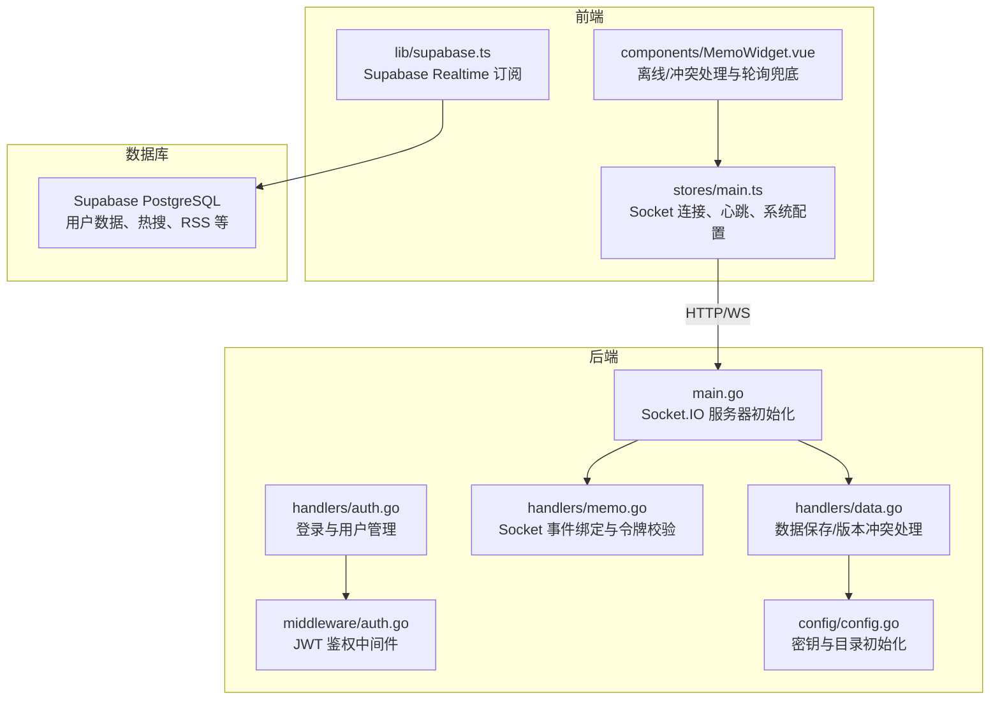
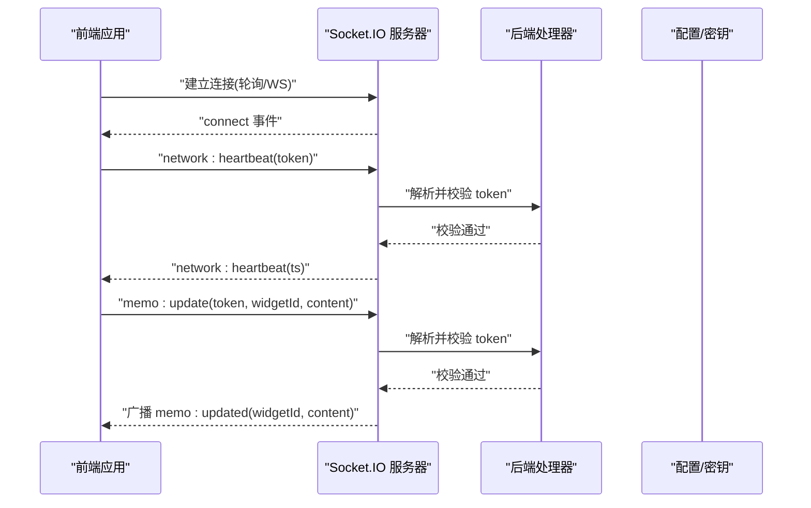
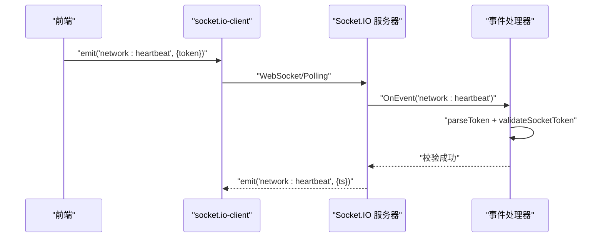
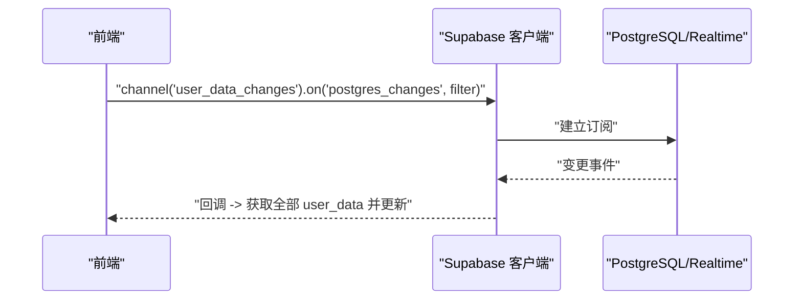
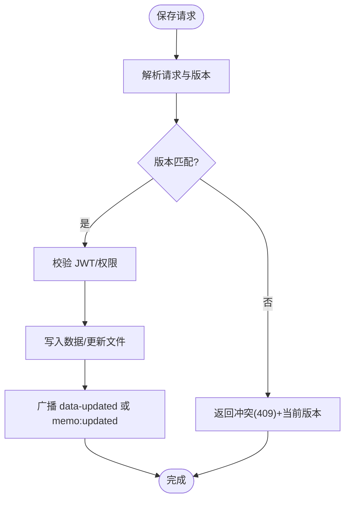
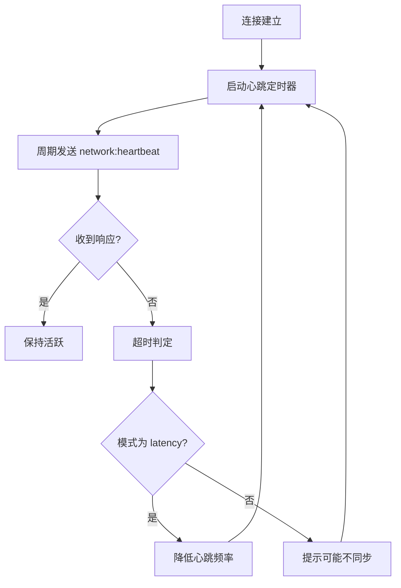
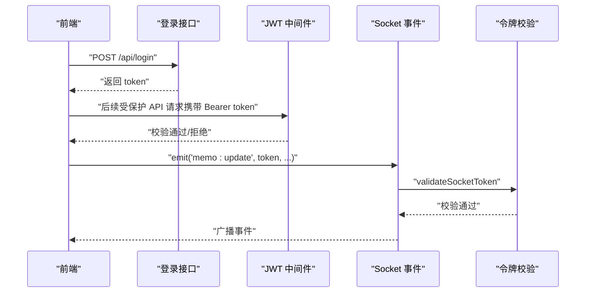
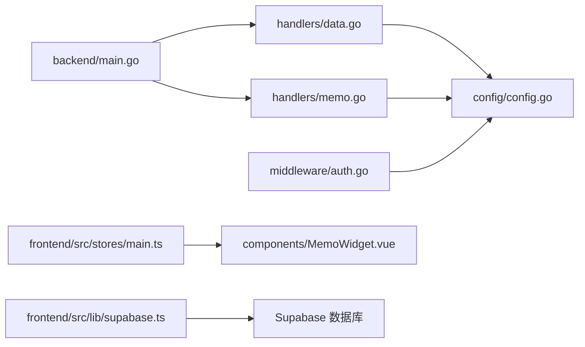

# 实时通信

<cite>
**本文引用的文件**
- [backend/main.go](file://backend/main.go)
- [backend/handlers/data.go](file://backend/handlers/data.go)
- [backend/handlers/memo.go](file://backend/handlers/memo.go)
- [backend/handlers/auth.go](file://backend/handlers/auth.go)
- [backend/middleware/auth.go](file://backend/middleware/auth.go)
- [backend/config/config.go](file://backend/config/config.go)
- [frontend/src/lib/supabase.ts](file://frontend/src/lib/supabase.ts)
- [frontend/src/stores/main.ts](file://frontend/src/stores/main.ts)
- [frontend/src/components/MemoWidget.vue](file://frontend/src/components/MemoWidget.vue)
- [supabase/migrations/001_initial_schema.sql](file://supabase/migrations/001_initial_schema.sql)
</cite>

## 目录
1. [简介](#简介)
2. [项目结构](#项目结构)
3. [核心组件](#核心组件)
4. [架构总览](#架构总览)
5. [详细组件分析](#详细组件分析)
6. [依赖分析](#依赖分析)
7. [性能考量](#性能考量)
8. [故障排查指南](#故障排查指南)
9. [结论](#结论)
10. [附录](#附录)

## 简介
本指南聚焦 OFlatNas 的实时通信能力，涵盖以下方面：
- Socket.IO 与 WebSocket 的集成与连接管理、事件处理与广播机制
- Supabase Realtime 的配置与订阅管理、数据同步策略
- 实时数据更新触发机制、缓存与冲突解决策略
- 网络状态检测、连接重试与错误恢复
- 安全性、身份验证与权限控制
- 离线数据处理、队列与一致性保障
- 性能优化、监控与故障排除

## 项目结构
- 后端基于 Go 语言，使用 Gin 作为 Web 框架，集成 Socket.IO 提供实时双向通信，并通过 JWT 进行鉴权。
- 前端使用 Vue + Pinia + socket.io-client，结合 HTTP 轮询作为兜底，实现多场景下的实时同步。
- Supabase 作为可选的实时数据库（用户数据、热搜等），通过 Realtime 订阅实现近实时的数据变更通知。

图表来源
- [backend/main.go:25-115](file://backend/main.go#L25-L115)
- [backend/handlers/data.go:638-744](file://backend/handlers/data.go#L638-L744)
- [backend/handlers/memo.go:25-96](file://backend/handlers/memo.go#L25-L96)
- [backend/middleware/auth.go:33-61](file://backend/middleware/auth.go#L33-L61)
- [backend/config/config.go:182-208](file://backend/config/config.go#L182-L208)
- [frontend/src/stores/main.ts:30-96](file://frontend/src/stores/main.ts#L30-L96)
- [frontend/src/lib/supabase.ts:211-255](file://frontend/src/lib/supabase.ts#L211-L255)
- [frontend/src/components/MemoWidget.vue:518-549](file://frontend/src/components/MemoWidget.vue#L518-L549)

章节来源
- [backend/main.go:25-115](file://backend/main.go#L25-L115)
- [frontend/src/stores/main.ts:30-96](file://frontend/src/stores/main.ts#L30-L96)

## 核心组件
- Socket.IO 服务器与路由
  - 在后端入口中初始化 Socket.IO 服务器，启用 Polling 与 WebSocket 两种传输方式，并设置跨域校验。
  - 注册连接、断开与自定义事件处理器，绑定热点、天气、RSS、备忘录、待办、网络模式与心跳等事件。
- 事件处理与广播
  - 通过事件“memo:update”、“todo:update”、“network:mode”、“network:heartbeat”进行广播或单播响应。
  - 所有事件均要求携带并校验 JWT 令牌，确保访问安全。
- 数据保存与冲突处理
  - 保存用户数据时维护版本号，若客户端版本落后则返回冲突，前端据此弹出冲突解决对话框或自动静默同步。
  - 备忘录保存支持幂等键与服务端时间戳，避免并发写入回滚。
- Supabase Realtime
  - 前端通过 Supabase SDK 订阅用户数据表的变更，按用户维度过滤，实现近实时同步。
  - 当订阅关闭或出错时，记录日志并准备重试。
- 前端 Socket 管理
  - 初始化 socket.io-client，启用轮询优先与指数退避重连。
  - 维护网络心跳定时器，根据模式动态调整心跳间隔与超时阈值。
  - 监听连接、断开、连接错误等事件，执行相应逻辑（如停止心跳、重新初始化）。

章节来源
- [backend/main.go:79-111](file://backend/main.go#L79-L111)
- [backend/handlers/memo.go:25-96](file://backend/handlers/memo.go#L25-L96)
- [backend/handlers/data.go:638-744](file://backend/handlers/data.go#L638-L744)
- [frontend/src/lib/supabase.ts:211-255](file://frontend/src/lib/supabase.ts#L211-L255)
- [frontend/src/stores/main.ts:30-96](file://frontend/src/stores/main.ts#L30-L96)

## 架构总览
整体架构由“HTTP/WebSocket + 轮询兜底 + Supabase Realtime”构成，满足不同网络环境下的实时需求。

图表来源
- [backend/main.go:94-111](file://backend/main.go#L94-L111)
- [backend/handlers/memo.go:25-96](file://backend/handlers/memo.go#L25-L96)
- [backend/config/config.go:182-208](file://backend/config/config.go#L182-L208)

## 详细组件分析

### Socket.IO 与 WebSocket 集成
- 传输层
  - 同时启用 Polling 与 WebSocket，提升在反代/防火墙环境下的可达性。
  - 跨域校验基于环境变量配置的允许来源列表。
- 事件模型
  - “join”房间：便于后续广播。
  - “network:mode”与“network:heartbeat”：用于网络模式切换与心跳检测。
  - “memo:update”与“todo:update”：内容更新事件，经 JWT 校验后广播。
- 广播与命名空间
  - 使用命名空间“/”，对所有连接广播事件，确保多标签页/多设备一致。

图表来源
- [backend/main.go:94-111](file://backend/main.go#L94-L111)
- [backend/handlers/memo.go:84-96](file://backend/handlers/memo.go#L84-L96)

章节来源
- [backend/main.go:79-111](file://backend/main.go#L79-L111)
- [backend/handlers/memo.go:25-96](file://backend/handlers/memo.go#L25-L96)

### Supabase Realtime 配置与使用
- 客户端初始化
  - 创建 Supabase 客户端实例，开启会话持久化与自动刷新。
- 订阅策略
  - 以用户维度订阅 user_data 表的变更，使用过滤条件仅接收当前用户的记录。
  - 订阅状态回调中记录 SUBSCRIBED/CLOSED/CHANNEL_ERROR，便于重连与降级处理。
- 数据同步
  - 订阅回调中拉取当前用户全部 user_data，驱动前端状态更新。

图表来源
- [frontend/src/lib/supabase.ts:211-255](file://frontend/src/lib/supabase.ts#L211-L255)

章节来源
- [frontend/src/lib/supabase.ts:211-255](file://frontend/src/lib/supabase.ts#L211-L255)
- [supabase/migrations/001_initial_schema.sql:194-216](file://supabase/migrations/001_initial_schema.sql#L194-L216)

### 数据保存与冲突解决
- 版本冲突
  - 保存用户数据时，若客户端版本落后于服务端，返回冲突并告知当前版本，前端弹出冲突对话框或在非结构性变更时自动静默同步。
- 幂等与去重
  - 备忘录保存支持 X-Idempotency-Key 与 client_request_id，服务端维护幂等缓存，避免重复写入。
- 服务端时间戳
  - 备忘录保存要求 server_ts 严格递增，防止回滚。

图表来源
- [backend/handlers/data.go:638-744](file://backend/handlers/data.go#L638-L744)
- [backend/handlers/data.go:535-636](file://backend/handlers/data.go#L535-L636)

章节来源
- [backend/handlers/data.go:638-744](file://backend/handlers/data.go#L638-L744)
- [backend/handlers/data.go:535-636](file://backend/handlers/data.go#L535-L636)

### 网络状态检测、心跳与重试
- 前端心跳
  - 连接建立后启动心跳定时器，默认每 10 秒一次，超时阈值 20 秒；在“latency”模式下降低频率。
  - 心跳超时判定后，进入“网络同步非活跃”状态，必要时提示是否同步。
- 重连与降级
  - socket.io-client 自动重连，最多尝试 10 次；连接错误事件记录日志。
- 轮询兜底
  - 在 WebSocket 不稳定或不可用时，备忘录组件通过 HTTP 轮询拉取最新内容，避免长时间不同步。

图表来源
- [frontend/src/stores/main.ts:444-467](file://frontend/src/stores/main.ts#L444-L467)
- [frontend/src/stores/main.ts:360-364](file://frontend/src/stores/main.ts#L360-L364)
- [frontend/src/components/MemoWidget.vue:518-549](file://frontend/src/components/MemoWidget.vue#L518-L549)

章节来源
- [frontend/src/stores/main.ts:444-467](file://frontend/src/stores/main.ts#L444-L467)
- [frontend/src/stores/main.ts:360-364](file://frontend/src/stores/main.ts#L360-L364)
- [frontend/src/components/MemoWidget.vue:518-549](file://frontend/src/components/MemoWidget.vue#L518-L549)

### 安全、鉴权与权限控制
- JWT 鉴权
  - 登录成功签发含用户名与过期时间的 HS256 JWT；中间件解析并校验签名，拒绝非法令牌。
  - Socket 事件处理前统一校验 token，确保只有合法用户可触发实时事件。
- 密钥管理
  - 后端启动时生成/读取密钥文件，作为 JWT 签名与验证的密钥。
- 数据访问控制
  - Supabase 启用 RLS，用户仅能访问自身数据；RSS 订阅支持公开与私有组合查询。

图表来源
- [backend/handlers/auth.go:18-114](file://backend/handlers/auth.go#L18-L114)
- [backend/middleware/auth.go:33-61](file://backend/middleware/auth.go#L33-L61)
- [backend/handlers/memo.go:204-225](file://backend/handlers/memo.go#L204-L225)
- [backend/config/config.go:182-208](file://backend/config/config.go#L182-L208)

章节来源
- [backend/handlers/auth.go:18-114](file://backend/handlers/auth.go#L18-L114)
- [backend/middleware/auth.go:33-61](file://backend/middleware/auth.go#L33-L61)
- [backend/handlers/memo.go:204-225](file://backend/handlers/memo.go#L204-L225)
- [backend/config/config.go:182-208](file://backend/config/config.go#L182-L208)

### 离线处理、队列与一致性
- 离线与兜底
  - 备忘录组件在编辑态或保存态时避免轮询，减少冲突；在 WebSocket 不可用时通过 HTTP 轮询拉取最新内容。
- 冲突检测与解决
  - 基于服务端时间戳与内容签名判断冲突；冲突冷却期内避免反复弹窗；支持“采用服务端/强制本端”两种解决方式。
- 一致性保障
  - 服务端严格校验 server_ts，防止回滚；HTTP 接口返回当前版本，前端据此决定是否自动同步或弹窗。

章节来源
- [frontend/src/components/MemoWidget.vue:350-549](file://frontend/src/components/MemoWidget.vue#L350-L549)
- [backend/handlers/data.go:535-636](file://backend/handlers/data.go#L535-L636)

## 依赖分析
- 后端
  - main.go 依赖 handlers、middleware、config，负责初始化 Socket.IO、注册路由与静态资源。
  - handlers/data.go 与 handlers/memo.go 依赖 config 的密钥与目录配置，实现数据持久化与事件广播。
  - middleware/auth.go 依赖 config 的密钥字符串，提供 JWT 校验。
- 前端
  - stores/main.ts 依赖 socket.io-client，负责连接、心跳与系统配置。
  - components/MemoWidget.vue 依赖 stores/main.ts 的状态与接口，实现冲突检测与轮询兜底。
  - lib/supabase.ts 依赖 @supabase/supabase-js，负责 Realtime 订阅。

图表来源
- [backend/main.go:25-115](file://backend/main.go#L25-L115)
- [backend/handlers/data.go:155-157](file://backend/handlers/data.go#L155-L157)
- [backend/handlers/memo.go:9-11](file://backend/handlers/memo.go#L9-L11)
- [backend/config/config.go:182-208](file://backend/config/config.go#L182-L208)
- [frontend/src/stores/main.ts:30-96](file://frontend/src/stores/main.ts#L30-L96)
- [frontend/src/components/MemoWidget.vue:518-549](file://frontend/src/components/MemoWidget.vue#L518-L549)
- [frontend/src/lib/supabase.ts:211-255](file://frontend/src/lib/supabase.ts#L211-L255)

章节来源
- [backend/main.go:25-115](file://backend/main.go#L25-L115)
- [frontend/src/stores/main.ts:30-96](file://frontend/src/stores/main.ts#L30-L96)

## 性能考量
- 传输优化
  - 后端启用 Gzip 压缩，减少传输体积；Socket.IO 同时支持 Polling 与 WebSocket，提升弱网环境可用性。
- 心跳与轮询
  - 根据网络模式动态调整心跳频率与超时阈值，降低不必要的请求；轮询间隔与超时可配置，避免频繁拉取。
- 缓存与幂等
  - GetData 接口基于文件修改时间缓存响应；备忘录保存使用幂等键与 TTL 缓存，避免重复写入。
- 监控与告警
  - 保存接口记录耗时，超过阈值输出慢请求告警日志，便于定位性能瓶颈。

章节来源
- [backend/main.go:42-46](file://backend/main.go#L42-L46)
- [backend/main.go:94-111](file://backend/main.go#L94-L111)
- [frontend/src/stores/main.ts:444-467](file://frontend/src/stores/main.ts#L444-L467)
- [backend/handlers/data.go:22-31](file://backend/handlers/data.go#L22-L31)
- [backend/handlers/data.go:72-112](file://backend/handlers/data.go#L72-L112)
- [backend/handlers/data.go:728-734](file://backend/handlers/data.go#L728-L734)

## 故障排查指南
- 连接问题
  - 若 WebSocket 不可用，确认反代/防火墙策略；前端会自动回退至 Polling；检查 CORS 允许来源配置。
- 心跳与同步
  - 心跳超时后，前端会提示是否同步；检查网络状态与后端日志；在“latency”模式下心跳频率降低属预期。
- 冲突与版本
  - 出现版本冲突时，优先采用服务端或强制本端；若为非结构性冲突（布局/分组/配置相同），前端可自动静默同步。
- 订阅异常
  - Supabase Realtime 订阅关闭或报错时，前端会记录警告并准备重试；检查 Supabase 凭证与网络连通性。
- 登录与权限
  - 401/403 错误通常表示令牌无效或权限不足；检查 Authorization 头与 JWT 是否过期。

章节来源
- [frontend/src/stores/main.ts:98-100](file://frontend/src/stores/main.ts#L98-L100)
- [frontend/src/stores/main.ts:1821-1868](file://frontend/src/stores/main.ts#L1821-L1868)
- [frontend/src/lib/supabase.ts:235-241](file://frontend/src/lib/supabase.ts#L235-L241)
- [backend/middleware/auth.go:33-61](file://backend/middleware/auth.go#L33-L61)

## 结论
OFlatNas 的实时通信体系通过 Socket.IO 与 Supabase Realtime 双通道互补，在不同网络环境下提供稳定、一致的用户体验。配合严格的 JWT 鉴权、版本冲突检测与轮询兜底策略，系统在复杂场景下仍能保持高可用与数据一致性。建议在生产环境中持续监控慢请求、心跳与订阅状态，结合日志与告警机制，进一步提升稳定性与可观测性。

## 附录
- Supabase RLS 策略要点
  - 用户仅能访问自身数据；RSS 支持公开与私有组合查询；启用 updated_at 触发器自动更新时间戳。
- 环境变量与配置
  - CORS 允许来源可通过环境变量配置；后端启动时生成/读取密钥文件，确保 JWT 签名一致性。

章节来源
- [supabase/migrations/001_initial_schema.sql:194-216](file://supabase/migrations/001_initial_schema.sql#L194-L216)
- [backend/config/config.go:35-86](file://backend/config/config.go#L35-L86)