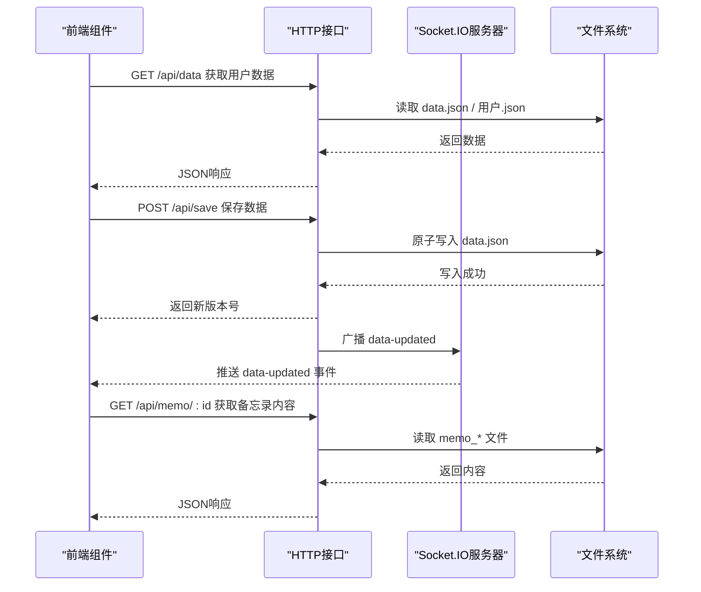
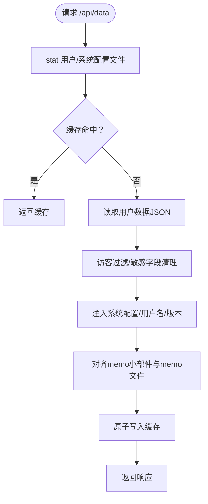
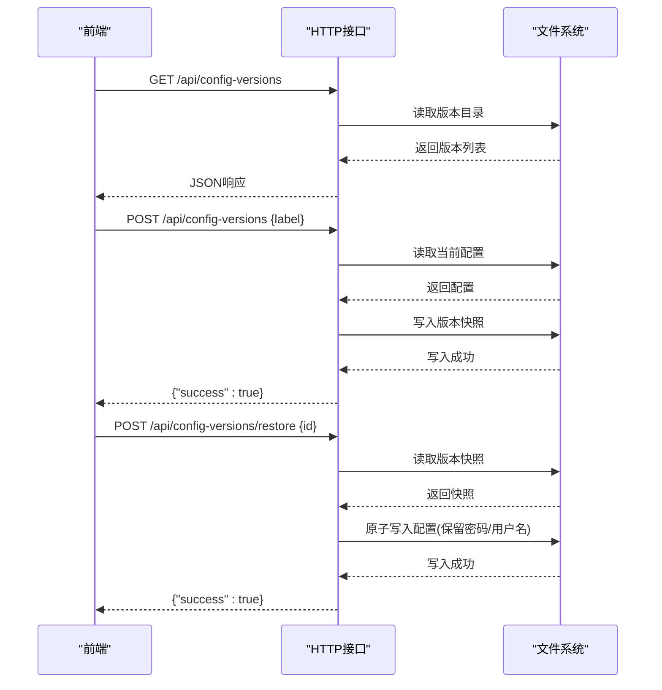
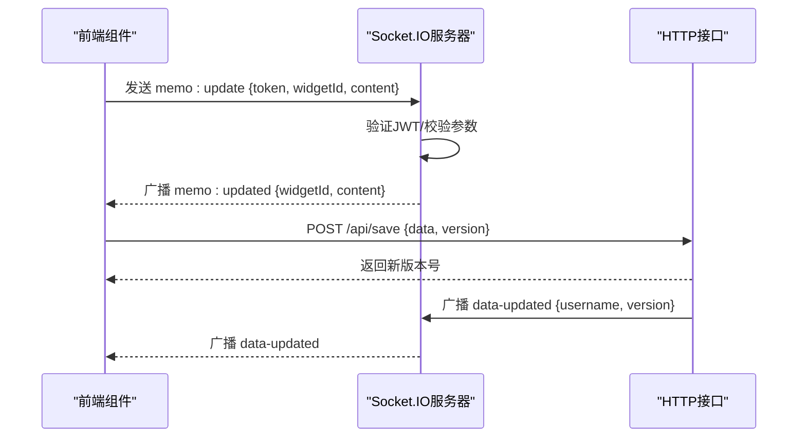
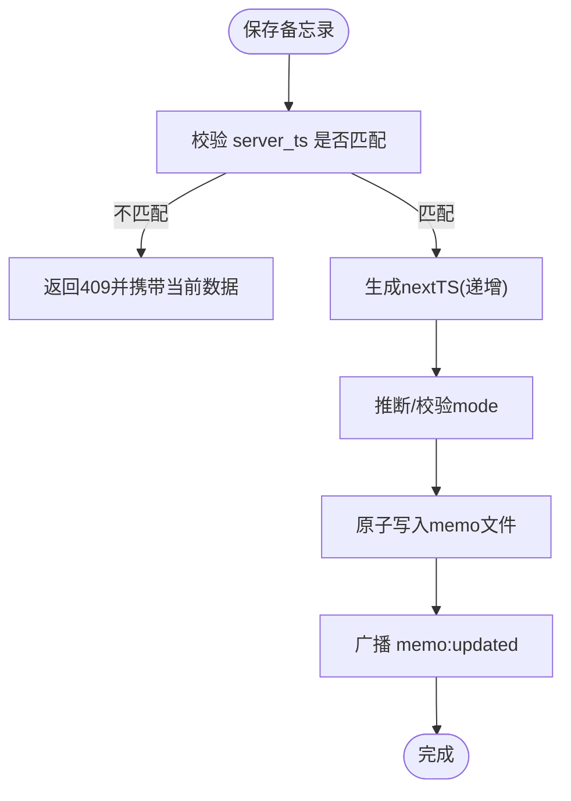
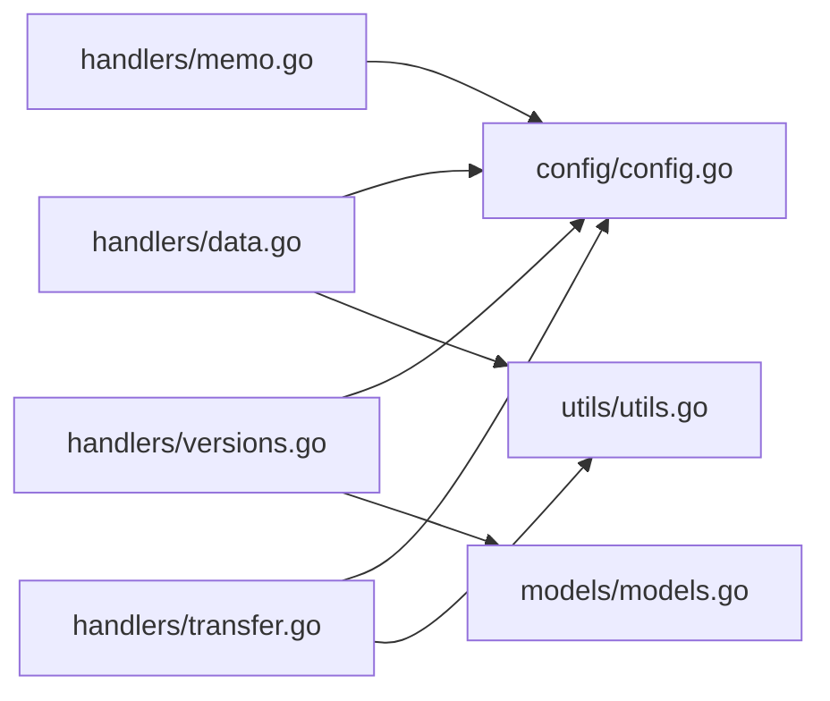

# 数据同步机制

<cite>
**本文档引用的文件**
- [backend/main.go](file://backend/main.go)
- [backend/handlers/data.go](file://backend/handlers/data.go)
- [backend/handlers/memo.go](file://backend/handlers/memo.go)
- [backend/handlers/system.go](file://backend/handlers/system.go)
- [backend/handlers/transfer.go](file://backend/handlers/transfer.go)
- [backend/handlers/versions.go](file://backend/handlers/versions.go)
- [backend/config/config.go](file://backend/config/config.go)
- [backend/models/models.go](file://backend/models/models.go)
- [backend/utils/utils.go](file://backend/utils/utils.go)
- [frontend/src/components/MemoWidget.vue](file://frontend/src/components/MemoWidget.vue)
- [frontend/src/stores/main.ts](file://frontend/src/stores/main.ts)
- [server/data/data.json](file://server/data/data.json)
</cite>

## 目录
1. [引言](#引言)
2. [项目结构](#项目结构)
3. [核心组件](#核心组件)
4. [架构总览](#架构总览)
5. [详细组件分析](#详细组件分析)
6. [依赖关系分析](#依赖关系分析)
7. [性能考虑](#性能考虑)
8. [故障排查指南](#故障排查指南)
9. [结论](#结论)
10. [附录](#附录)

## 引言
本文件系统性阐述 OFlatNas 的数据同步机制，重点覆盖以下方面：
- 实时数据同步的触发条件、策略与一致性保障
- 用户数据同步、配置数据同步、状态数据同步的实现方式
- 数据变更检测、增量更新与全量同步的区别及适用场景
- 冲突解决、版本控制与回滚机制
- 离线缓存、队列管理与批量处理策略
- 性能优化、并发控制与资源竞争处理
- 同步监控、日志记录与故障诊断方法

## 项目结构
OFlatNas 采用前后端分离架构：前端通过 HTTP 与 Socket.IO 进行双向通信；后端以 Gin 作为 Web 框架，结合 Socket.IO 提供实时事件推送，并通过文件系统持久化用户数据。

```mermaid
graph TB
subgraph "前端"
FE_MEMO["MemoWidget.vue<br/>实时编辑与冲突处理"]
FE_STORE["main.ts<br/>全局状态与冲突检测"]
end
subgraph "后端"
BE_MAIN["main.go<br/>路由与Socket.IO初始化"]
BE_DATA["handlers/data.go<br/>用户/配置/数据接口"]
BE_MEMO["handlers/memo.go<br/>Socket.IO事件处理"]
BE_SYS["handlers/system.go<br/>系统统计/网络/IP等"]
BE_TRANS["handlers/transfer.go<br/>文件传输/缩略图"]
BE_VER["handlers/versions.go<br/>配置版本管理"]
BE_CFG["config/config.go<br/>路径与默认配置"]
BE_MODELS["models/models.go<br/>数据模型"]
BE_UTILS["utils/utils.go<br/>原子写入与锁"]
end
FE_MEMO --> |"HTTP轮询/保存"| BE_DATA
FE_STORE --> |"HTTP保存/冲突检测"| BE_DATA
FE_MEMO --|"Socket.IO: memo:updated"| BE_MEMO
FE_MEMO --|"Socket.IO: memo:update"| BE_MEMO
BE_MAIN --> BE_MEMO
BE_MAIN --> BE_DATA
BE_DATA --> BE_UTILS
BE_TRANS --> BE_UTILS
BE_VER --> BE_CFG
BE_SYS --> BE_CFG
```

**图表来源**
- [backend/main.go:25-115](file://backend/main.go#L25-L115)
- [backend/handlers/data.go:159-744](file://backend/handlers/data.go#L159-L744)
- [backend/handlers/memo.go:25-39](file://backend/handlers/memo.go#L25-L39)
- [backend/config/config.go:35-86](file://backend/config/config.go#L35-L86)
- [backend/utils/utils.go:16-75](file://backend/utils/utils.go#L16-L75)

**章节来源**
- [backend/main.go:25-115](file://backend/main.go#L25-L115)
- [backend/config/config.go:35-86](file://backend/config/config.go#L35-L86)

## 核心组件
- Socket.IO 服务器：负责实时事件广播（如 memo 更新、数据更新通知）
- HTTP 接口：提供数据读取、保存、版本管理、文件传输等能力
- 文件系统持久层：以 JSON 文件形式存储用户数据、系统配置、版本快照、传输索引等
- 并发与原子写入：通过文件级互斥锁与临时文件写入确保一致性
- 前端同步策略：基于 Socket.IO 优先、HTTP 轮询兜底、冲突检测与冷却退避

**章节来源**
- [backend/handlers/data.go:159-744](file://backend/handlers/data.go#L159-L744)
- [backend/handlers/memo.go:25-39](file://backend/handlers/memo.go#L25-L39)
- [backend/utils/utils.go:16-75](file://backend/utils/utils.go#L16-L75)

## 架构总览
OFlatNas 的同步架构围绕“实时事件 + HTTP 接口 + 文件持久化”展开。Socket.IO 用于低延迟的实时协作，HTTP 接口用于稳定的数据读写与版本管理，文件系统作为最终一致性的存储介质。



**图表来源**
- [backend/handlers/data.go:159-744](file://backend/handlers/data.go#L159-L744)
- [backend/main.go:94-111](file://backend/main.go#L94-L111)

## 详细组件分析

### 用户数据同步（/api/data）
- 触发条件
  - 客户端首次进入或刷新页面时调用 GET /api/data
  - 保存成功后通过 Socket.IO 广播 data-updated 事件，客户端收到后可选择立即拉取最新数据
- 同步策略
  - 缓存：按用户与访客身份构建缓存键，比较文件修改时间，命中则直接返回缓存
  - 过滤：访客模式下过滤非公开条目并移除敏感字段
  - 注入：将系统配置注入响应，确保前端渲染所需参数
  - 备忘录对齐：在返回前对齐 memo 小部件与 memo 文件，避免回滚问题
- 一致性保障
  - 保存时对 data.json 做原子写入，写入成功后广播 data-updated
  - 客户端收到事件后可触发新一轮 GET /api/data 或使用缓存校验



**图表来源**
- [backend/handlers/data.go:159-322](file://backend/handlers/data.go#L159-L322)

**章节来源**
- [backend/handlers/data.go:159-322](file://backend/handlers/data.go#L159-L322)

### 配置数据同步（/api/system-config 与版本管理）
- 系统配置
  - GET /api/system-config 返回系统配置（认证模式、Docker 开关等）
  - GET /api/config-versions 列出历史版本
  - POST /api/config-versions 保存当前配置为版本
  - POST /api/config-versions/restore 恢复指定版本
  - DELETE /api/config-versions/:id 删除版本
- 版本控制与回滚
  - 保存版本时记录标签、创建时间与数据快照
  - 恢复版本时保留密码与用户名等关键字段，生成新版本号并原子写入



**图表来源**
- [backend/handlers/versions.go:33-184](file://backend/handlers/versions.go#L33-L184)

**章节来源**
- [backend/handlers/versions.go:33-184](file://backend/handlers/versions.go#L33-L184)

### 状态数据同步（Socket.IO 事件）
- 事件绑定
  - 绑定 join、memo:update、todo:update、network:* 等事件
  - 验证 JWT 令牌，确保事件来源可信
- 广播策略
  - 保存用户数据成功后广播 data-updated
  - 备忘录保存成功后广播 memo:updated
- 客户端行为
  - 客户端监听 data-updated 与 memo:updated，收到后更新本地状态或触发轮询兜底



**图表来源**
- [backend/handlers/memo.go:25-39](file://backend/handlers/memo.go#L25-L39)
- [backend/handlers/data.go:736-743](file://backend/handlers/data.go#L736-L743)

**章节来源**
- [backend/handlers/memo.go:25-39](file://backend/handlers/memo.go#L25-L39)
- [backend/handlers/data.go:736-743](file://backend/handlers/data.go#L736-L743)

### 备忘录实时同步（/api/memo/:id 与 Socket.IO）
- 数据结构
  - 备忘录内容包含 content、server_ts、mode（simple/rich）
  - 服务端根据内容判断模式，确保一致性
- 冲突检测与幂等
  - 保存时要求传入 server_ts，若与服务端不一致则返回 409
  - 支持 X-Idempotency-Key 幂等键，避免重复提交
- 前端策略
  - 优先使用 Socket.IO 推送；若不可用则 HTTP 轮询兜底
  - 输入活跃期禁用广播，冷却期恢复；网络断开时切换为离线模式
  - 冲突时弹窗提示，支持“保留本地/使用云端”两种策略



**图表来源**
- [backend/handlers/data.go:535-636](file://backend/handlers/data.go#L535-L636)

**章节来源**
- [backend/handlers/data.go:535-636](file://backend/handlers/data.go#L535-L636)
- [frontend/src/components/MemoWidget.vue:375-412](file://frontend/src/components/MemoWidget.vue#L375-L412)
- [frontend/src/components/MemoWidget.vue:518-573](file://frontend/src/components/MemoWidget.vue#L518-L573)

### 文件传输与缩略图（/api/transfer/*）
- 上传流程
  - 初始化：UploadInit 创建上传会话，返回 uploadId、分片大小与总数
  - 分片：UploadChunk 上传单个分片并记录已上传分片
  - 完成：UploadComplete 汇总分片、随机命名、写入上传目录、更新索引、生成缩略图
- 下载与权限
  - DownloadToken 颁发带过期时间的下载令牌
  - ServeFile/ServeThumb 校验令牌或用户身份后提供文件/缩略图
- 批量处理
  - 缩略图生成异步进行，避免阻塞主流程
  - 传输索引并发保护，防止竞态

**章节来源**
- [backend/handlers/transfer.go:331-580](file://backend/handlers/transfer.go#L331-L580)
- [backend/handlers/transfer.go:673-720](file://backend/handlers/transfer.go#L673-L720)

### 离线缓存、队列与批量处理
- 离线缓存
  - GET /api/data 响应结果按用户/访客身份与文件修改时间缓存，命中则直接返回
- 队列与退避
  - HTTP 轮询采用指数退避策略，降低失败时的请求压力
  - 输入活跃期禁播，冷却期恢复，避免抖动
- 批量处理
  - 传输模块对缩略图生成与索引更新进行批量处理，减少多次 IO

**章节来源**
- [backend/handlers/data.go:193-209](file://backend/handlers/data.go#L193-L209)
- [frontend/src/components/MemoWidget.vue:556-573](file://frontend/src/components/MemoWidget.vue#L556-L573)

### 冲突解决、版本控制与回滚
- 冲突检测
  - 备忘录：保存时比对 server_ts，不一致返回 409
  - 全局数据：保存时比对版本号，不一致返回 409
- 冲突解决
  - 前端冲突面板：支持“保留本地/使用云端”
  - 智能冲突：若仅布局/分组等配置变化，可静默同步
- 版本回滚
  - 保存/恢复配置版本，保留密码与用户名等关键字段
  - 删除版本快照

**章节来源**
- [backend/handlers/data.go:638-744](file://backend/handlers/data.go#L638-L744)
- [frontend/src/stores/main.ts:1823-1848](file://frontend/src/stores/main.ts#L1823-L1848)
- [backend/handlers/versions.go:126-184](file://backend/handlers/versions.go#L126-L184)

### 并发控制与资源竞争
- 文件锁
  - 通过 sync.Map 为每个文件维护互斥锁，确保同一文件的读写串行化
  - 原子写入：先写入临时文件再重命名，避免部分写入
- Socket.IO 并发
  - 事件处理中进行参数校验与令牌验证，避免非法事件
- 竞争条件规避
  - 保存数据时生成新版本号并原子写入
  - 传输会话更新使用文件锁，避免并发覆盖

**章节来源**
- [backend/utils/utils.go:16-75](file://backend/utils/utils.go#L16-L75)
- [backend/handlers/transfer.go:430-467](file://backend/handlers/transfer.go#L430-L467)

## 依赖关系分析
- 组件耦合
  - handlers/data.go 依赖 config/config.go 与 utils/utils.go
  - handlers/memo.go 依赖 config/config.go 与 Socket.IO
  - handlers/versions.go 依赖 config/config.go 与 models/models.go
  - handlers/transfer.go 依赖 config/config.go 与 utils/utils.go
- 外部依赖
  - Gin、Socket.IO、JWT、图像处理库（缩略图）



**图表来源**
- [backend/handlers/data.go:1-18](file://backend/handlers/data.go#L1-L18)
- [backend/handlers/memo.go:1-11](file://backend/handlers/memo.go#L1-L11)
- [backend/handlers/versions.go:1-17](file://backend/handlers/versions.go#L1-L17)
- [backend/handlers/transfer.go:1-30](file://backend/handlers/transfer.go#L1-L30)
- [backend/config/config.go:1-13](file://backend/config/config.go#L1-L13)
- [backend/utils/utils.go:1-7](file://backend/utils/utils.go#L1-L7)
- [backend/models/models.go:1-118](file://backend/models/models.go#L1-L118)

**章节来源**
- [backend/handlers/data.go:1-18](file://backend/handlers/data.go#L1-L18)
- [backend/handlers/versions.go:1-17](file://backend/handlers/versions.go#L1-L17)
- [backend/handlers/transfer.go:1-30](file://backend/handlers/transfer.go#L1-L30)

## 性能考虑
- 压缩与缓存
  - 启用 Gzip 压缩，减少网络传输
  - 静态资源设置强缓存策略，避免浏览器缓存旧 chunk 导致白屏
- I/O 优化
  - 原子写入与文件锁避免频繁竞争
  - 传输模块异步生成缩略图，避免阻塞主流程
- 轮询与退避
  - HTTP 轮询根据活跃度动态调整间隔，失败时指数退避
- 并发控制
  - 文件锁与 Socket.IO 事件串行化处理，避免竞态

**章节来源**
- [backend/main.go:42-46](file://backend/main.go#L42-L46)
- [backend/main.go:116-164](file://backend/main.go#L116-L164)
- [frontend/src/components/MemoWidget.vue:556-573](file://frontend/src/components/MemoWidget.vue#L556-L573)

## 故障排查指南
- 常见错误与定位
  - 409 冲突：检查 server_ts 或版本号是否与服务端一致
  - 401 未授权：确认 Socket.IO 令牌或登录状态
  - 404 文件/版本不存在：确认路径与 ID 正确
- 日志与监控
  - 后端对慢请求进行日志记录（保存数据超过 5 秒）
  - Socket.IO 事件处理中进行参数与令牌校验
- 诊断步骤
  - 检查 /api/data 缓存命中情况与 stat 结果
  - 查看 /api/config-versions 列表与恢复结果
  - 使用 /api/transfer/items 检查传输索引与缩略图生成状态

**章节来源**
- [backend/handlers/data.go:638-744](file://backend/handlers/data.go#L638-L744)
- [backend/handlers/versions.go:33-76](file://backend/handlers/versions.go#L33-L76)
- [backend/handlers/transfer.go:200-280](file://backend/handlers/transfer.go#L200-L280)

## 结论
OFlatNas 的数据同步机制以 Socket.IO 实时事件与 HTTP 接口互补为核心，结合文件系统持久化与严格的并发控制，实现了在弱网与多端场景下的稳定同步。通过版本管理、冲突检测与回滚机制，系统在保证一致性的同时提供了灵活的协作体验。前端采用轮询兜底与智能退避策略，进一步提升了鲁棒性与用户体验。

## 附录
- 默认数据示例：[server/data/data.json:1-104](file://server/data/data.json#L1-L104)
- 配置初始化：[backend/config/config.go:102-180](file://backend/config/config.go#L102-L180)
- 数据模型定义：[backend/models/models.go:1-118](file://backend/models/models.go#L1-L118)