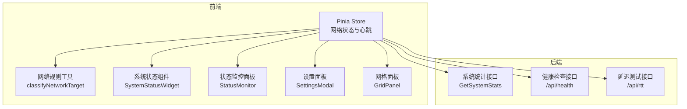
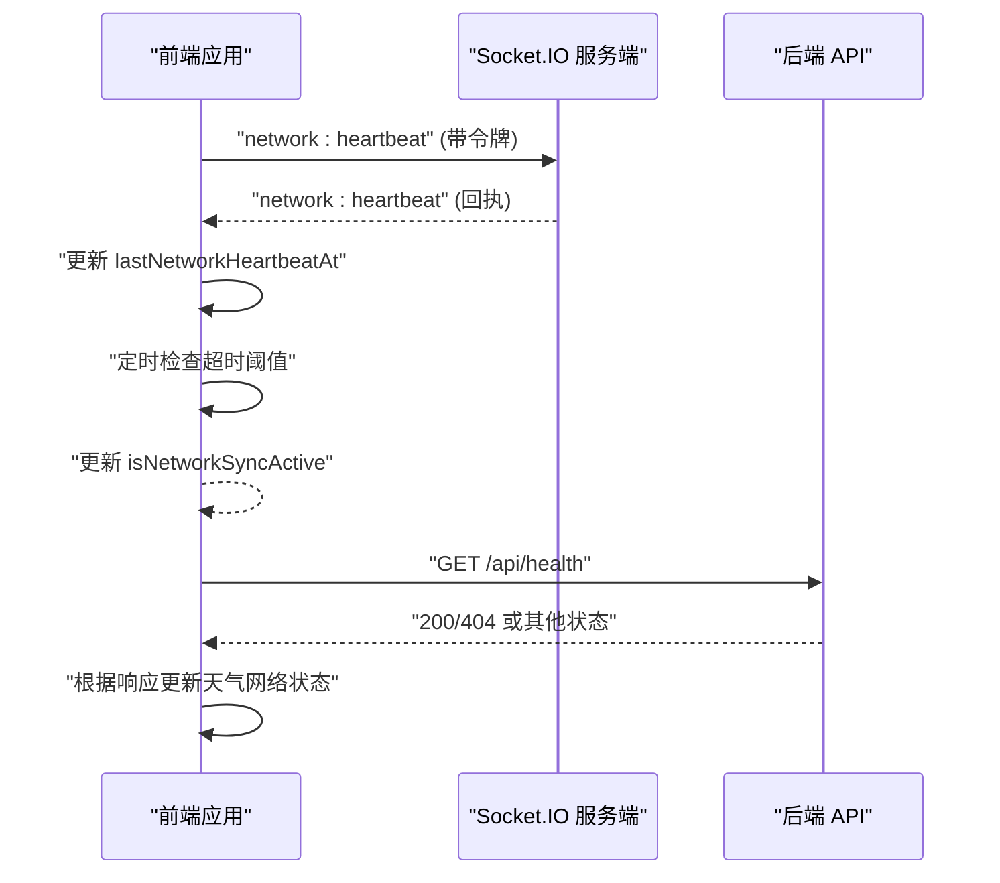
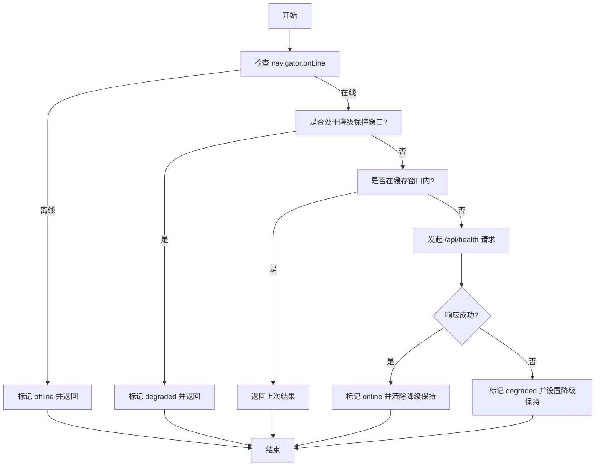
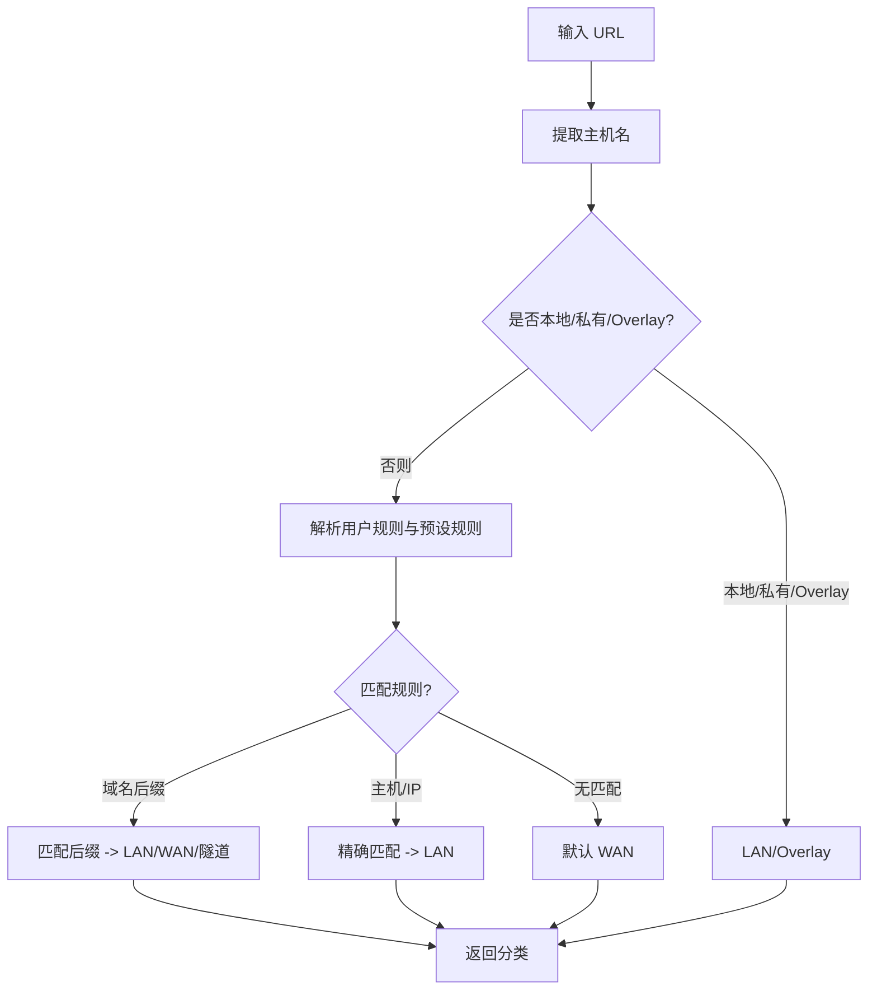
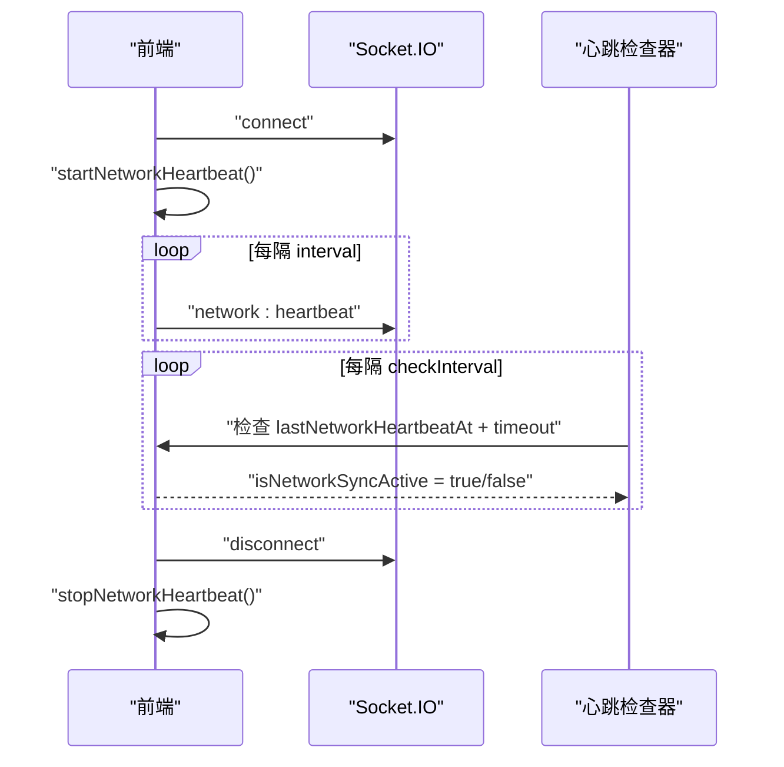
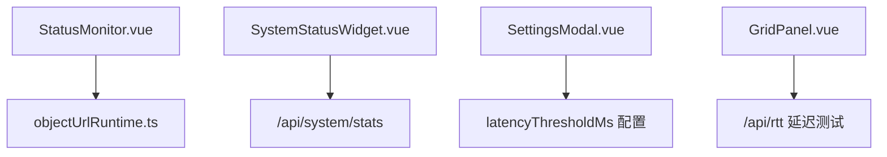
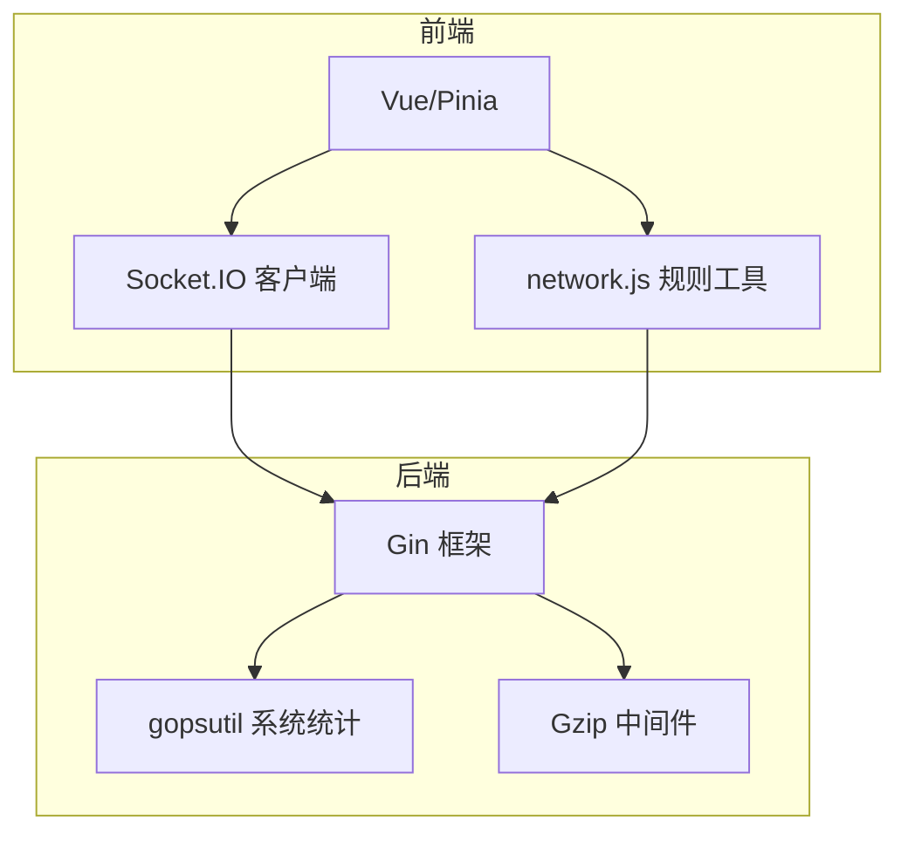

# 网络状态监控

<cite>
**本文档引用的文件**
- [frontend/src/utils/network.js](file://frontend/src/utils/network.js)
- [frontend/src/utils/network.d.ts](file://frontend/src/utils/network.d.ts)
- [frontend/src/stores/main.ts](file://frontend/src/stores/main.ts)
- [frontend/src/components/StatusMonitor.vue](file://frontend/src/components/StatusMonitor.vue)
- [frontend/src/components/SystemStatusWidget.vue](file://frontend/src/components/SystemStatusWidget.vue)
- [frontend/src/components/SettingsModal.vue](file://frontend/src/components/SettingsModal.vue)
- [frontend/src/components/GridPanel.vue](file://frontend/src/components/GridPanel.vue)
- [backend/handlers/system.go](file://backend/handlers/system.go)
- [backend/handlers/memo.go](file://backend/handlers/memo.go)
- [backend/main.go](file://backend/main.go)
- [frontend/src/utils/objectUrlRuntime.ts](file://frontend/src/utils/objectUrlRuntime.ts)
</cite>

## 目录
1. [简介](#简介)
2. [项目结构](#项目结构)
3. [核心组件](#核心组件)
4. [架构总览](#架构总览)
5. [详细组件分析](#详细组件分析)
6. [依赖分析](#依赖分析)
7. [性能考虑](#性能考虑)
8. [故障排除指南](#故障排除指南)
9. [结论](#结论)
10. [附录](#附录)

## 简介
本文件系统性梳理 OFlatNas 的网络状态监控能力，涵盖网络连接状态检测、在线/离线判断、网络质量评估、网络变化监听与事件传播、弱网适配与降级策略、异常检测与重试机制、设备网络感知与移动/蜂窝/WiFi 切换处理、性能开销与准确性保障、用户体验优化以及可视化与调试工具。目标是帮助开发者与运维人员全面理解并有效利用该功能。

## 项目结构
- 前端通过 Pinia Store 统一管理网络状态与心跳，结合 Socket.IO 事件进行状态回传与联动。
- 网络规则解析与分类位于前端工具模块，用于区分 LAN/WAN/Overlay 网络类型。
- 后端提供系统统计接口与健康检查接口，支撑前端网络质量评估与降级策略。
- 调试与可视化组件提供运行时指标展示与交互入口。

**图表来源**
- [frontend/src/stores/main.ts](file://frontend/src/stores/main.ts)
- [frontend/src/utils/network.js](file://frontend/src/utils/network.js)
- [frontend/src/components/SystemStatusWidget.vue](file://frontend/src/components/SystemStatusWidget.vue)
- [frontend/src/components/StatusMonitor.vue](file://frontend/src/components/StatusMonitor.vue)
- [frontend/src/components/SettingsModal.vue](file://frontend/src/components/SettingsModal.vue)
- [frontend/src/components/GridPanel.vue](file://frontend/src/components/GridPanel.vue)
- [backend/handlers/system.go](file://backend/handlers/system.go)

**章节来源**
- [frontend/src/stores/main.ts](file://frontend/src/stores/main.ts)
- [frontend/src/utils/network.js](file://frontend/src/utils/network.js)
- [backend/handlers/system.go](file://backend/handlers/system.go)

## 核心组件
- 网络状态检测与缓存：基于浏览器 navigator.onLine 与定时健康检查，结合缓存窗口与降级保持策略，实现在线/降级/离线三态判定。
- 心跳与同步控制：Socket.IO 心跳事件驱动前端网络同步状态，配合定时器与超时阈值判断网络可用性。
- 网络规则与目标分类：根据用户规则与预设规则对目标 URL 进行 LAN/WAN/Overlay 分类，指导网络模式选择。
- 系统统计与网络速率：后端聚合网络接口收发速率，前端可视化展示实时网络负载。
- 可视化与调试：状态监控面板与系统状态组件提供运行时指标与交互入口，便于诊断与优化。

**章节来源**
- [frontend/src/stores/main.ts](file://frontend/src/stores/main.ts)
- [frontend/src/utils/network.js](file://frontend/src/utils/network.js)
- [frontend/src/components/SystemStatusWidget.vue](file://frontend/src/components/SystemStatusWidget.vue)
- [frontend/src/components/StatusMonitor.vue](file://frontend/src/components/StatusMonitor.vue)

## 架构总览
前端通过 Socket.IO 与后端建立长连接，周期性发送网络心跳；后端接收心跳并记录时间戳，前端通过定时检查心跳时间差判断网络同步状态。同时，前端结合 navigator.onLine 与健康检查接口实现在线/降级/离线三态判定，并根据网络规则对目标进行分类以决定网络模式。

**图表来源**
- [frontend/src/stores/main.ts](file://frontend/src/stores/main.ts)
- [backend/handlers/memo.go](file://backend/handlers/memo.go)

**章节来源**
- [frontend/src/stores/main.ts](file://frontend/src/stores/main.ts)
- [backend/handlers/memo.go](file://backend/handlers/memo.go)

## 详细组件分析

### 网络状态检测与缓存
- 在线/离线/降级三态：优先使用 navigator.onLine；若在线则进行健康检查；健康检查失败进入降级保持窗口；缓存最近一次结果与检测时间，避免频繁探测。
- 降级保持：健康检查失败后进入固定保持窗口，期间始终返回降级，提升弱网体验。
- 缓存窗口：在短时间内重复查询直接返回缓存结果，降低请求频率。

**图表来源**
- [frontend/src/stores/main.ts](file://frontend/src/stores/main.ts)

**章节来源**
- [frontend/src/stores/main.ts](file://frontend/src/stores/main.ts)

### 网络规则与目标分类
- 支持规则类型：域名后缀(domain_suffix:)、主机(host:)、IPv4/IP前缀(ip:)。
- 预设规则：Tailscale、ZeroTier、Cloudflare Tunnel、Ngrok 等。
- 分类结果：LAN、Overlay、WAN；Overlay 用于识别特定隧道网络。
- 用户规则与内部域合并，形成最终规则集。

**图表来源**
- [frontend/src/utils/network.js](file://frontend/src/utils/network.js)
- [frontend/src/utils/network.d.ts](file://frontend/src/utils/network.d.ts)

**章节来源**
- [frontend/src/utils/network.js](file://frontend/src/utils/network.js)
- [frontend/src/utils/network.d.ts](file://frontend/src/utils/network.d.ts)

### 心跳与网络同步控制
- 心跳发送：连接建立后立即发送一次，随后按间隔周期发送。
- 心跳检查：定时检查 lastNetworkHeartbeatAt 是否在超时阈值内，决定 isNetworkSyncActive。
- 模式切换：白名单（latency）模式下降低心跳频率与检查间隔，减少请求压力。
- 断线处理：断开时停止心跳定时器并清空状态。

**图表来源**
- [frontend/src/stores/main.ts](file://frontend/src/stores/main.ts)

**章节来源**
- [frontend/src/stores/main.ts](file://frontend/src/stores/main.ts)

### 系统网络统计与可视化
- 后端聚合网络接口 IO 统计，计算每秒接收/发送速率，排序输出。
- 前端组件按接口过滤与展示，支持可见性感知的轮询控制，避免后台消耗。

**图表来源**
- [backend/handlers/system.go](file://backend/handlers/system.go)
- [frontend/src/components/SystemStatusWidget.vue](file://frontend/src/components/SystemStatusWidget.vue)

**章节来源**
- [backend/handlers/system.go](file://backend/handlers/system.go)
- [frontend/src/components/SystemStatusWidget.vue](file://frontend/src/components/SystemStatusWidget.vue)

### 可视化与调试工具
- 状态监控面板：展示对象 URL 管理、内存堆使用趋势等运行时指标，支持拖拽定位与透明度调整。
- 系统状态组件：按可见性控制轮询，展示 CPU、内存、磁盘与网络速率。
- 设置面板：提供延迟阈值配置入口，支持输入校验与应用反馈。
- 网格面板：提供延迟测试入口，采集往返时间样本并展示。

**图表来源**
- [frontend/src/components/StatusMonitor.vue](file://frontend/src/components/StatusMonitor.vue)
- [frontend/src/utils/objectUrlRuntime.ts](file://frontend/src/utils/objectUrlRuntime.ts)
- [frontend/src/components/SystemStatusWidget.vue](file://frontend/src/components/SystemStatusWidget.vue)
- [frontend/src/components/SettingsModal.vue](file://frontend/src/components/SettingsModal.vue)
- [frontend/src/components/GridPanel.vue](file://frontend/src/components/GridPanel.vue)

**章节来源**
- [frontend/src/components/StatusMonitor.vue](file://frontend/src/components/StatusMonitor.vue)
- [frontend/src/utils/objectUrlRuntime.ts](file://frontend/src/utils/objectUrlRuntime.ts)
- [frontend/src/components/SystemStatusWidget.vue](file://frontend/src/components/SystemStatusWidget.vue)
- [frontend/src/components/SettingsModal.vue](file://frontend/src/components/SettingsModal.vue)
- [frontend/src/components/GridPanel.vue](file://frontend/src/components/GridPanel.vue)

## 依赖分析
- 前端依赖
  - Socket.IO 客户端：建立长连接与事件通信。
  - Vue/Pinia：状态管理与响应式更新。
  - 自定义网络规则工具：目标分类与网络模式决策依据。
- 后端依赖
  - gopsutil：系统统计（CPU、内存、磁盘、网络）。
  - Gin：HTTP 服务与路由。
  - Gzip 中间件：压缩响应，降低传输体积。
  - CORS/Gzip 解压中间件：跨域与兼容性处理。

**图表来源**
- [frontend/src/stores/main.ts](file://frontend/src/stores/main.ts)
- [frontend/src/utils/network.js](file://frontend/src/utils/network.js)
- [backend/main.go](file://backend/main.go)
- [backend/handlers/system.go](file://backend/handlers/system.go)

**章节来源**
- [frontend/src/stores/main.ts](file://frontend/src/stores/main.ts)
- [frontend/src/utils/network.js](file://frontend/src/utils/network.js)
- [backend/main.go](file://backend/main.go)
- [backend/handlers/system.go](file://backend/handlers/system.go)

## 性能考虑
- 心跳频率与超时
  - 默认心跳间隔与超时：降低请求频率，避免频繁探测。
  - 白名单（latency）模式：进一步降低心跳频率与检查间隔，减少网络与 CPU 开销。
- 缓存与去抖
  - 天气网络状态缓存窗口与降级保持窗口，减少重复请求与抖动影响。
- 轮询与可见性
  - 系统状态组件按页面可见性控制轮询，隐藏时停止轮询，恢复可见时再启动。
- 压缩与传输
  - 后端启用 Gzip 压缩，显著降低传输体积，改善弱网体验。
- 资源清理
  - 对象 URL 运行时监控与定期清扫，避免内存泄漏与资源占用过高。

**章节来源**
- [frontend/src/stores/main.ts](file://frontend/src/stores/main.ts)
- [frontend/src/components/SystemStatusWidget.vue](file://frontend/src/components/SystemStatusWidget.vue)
- [backend/main.go](file://backend/main.go)
- [frontend/src/utils/objectUrlRuntime.ts](file://frontend/src/utils/objectUrlRuntime.ts)

## 故障排除指南
- 心跳丢失与同步中断
  - 现象：isNetworkSyncActive 变为 false，界面提示网络同步异常。
  - 排查：检查 Socket 连接状态、后端 /api/health 可达性、网络延迟与丢包率。
  - 处理：在网络恢复后自动恢复；必要时手动刷新页面重连。
- 在线/离线误判
  - 现象：navigator.onLine 与实际网络状态不一致。
  - 排查：确认浏览器网络状态、系统网络切换（WiFi/蜂窝）、代理/VPN 影响。
  - 处理：结合健康检查与降级保持策略，等待缓存窗口过期后自动修正。
- 延迟阈值不当
  - 现象：latency 模式下频繁切换或误判。
  - 排查：检查设置面板阈值配置、网络 RTT 实际情况。
  - 处理：调整阈值至合理范围（20–30000ms），观察效果。
- 系统统计不显示
  - 现象：SystemStatusWidget 无法获取系统信息。
  - 排查：确认 /api/system-stats 可达性、后端权限与跨域配置。
  - 处理：检查后端日志与 Nginx 代理配置，确保路径映射正确。
- 对象 URL 泄漏
  - 现象：内存使用持续增长、状态监控面板显示异常。
  - 排查：检查对象 URL 创建与撤销时机、运行时监控统计。
  - 处理：确保及时 revoke，关注空闲对象的清扫与阈值告警。

**章节来源**
- [frontend/src/stores/main.ts](file://frontend/src/stores/main.ts)
- [frontend/src/components/SettingsModal.vue](file://frontend/src/components/SettingsModal.vue)
- [frontend/src/components/SystemStatusWidget.vue](file://frontend/src/components/SystemStatusWidget.vue)
- [frontend/src/utils/objectUrlRuntime.ts](file://frontend/src/utils/objectUrlRuntime.ts)

## 结论
OFlatNas 的网络状态监控通过前端状态缓存与心跳机制、后端系统统计与健康检查接口、以及规则化的网络目标分类，实现了稳定可靠的在线/离线与质量评估能力。配合可视化与调试工具，能够在弱网环境下提供良好的用户体验，并为问题排查与性能优化提供有力支撑。建议在生产环境中根据网络环境合理配置心跳频率与延迟阈值，并结合系统统计与运行时监控持续优化。

## 附录
- 关键常量与阈值
  - 天气状态缓存窗口：约 10 秒
  - 降级保持窗口：约 15 秒
  - 默认心跳间隔：约 10 秒
  - 默认心跳超时：约 20 秒
  - 白名单（latency）模式心跳间隔/超时/检查间隔：更高阈值
- 延迟测试
  - 提供 /api/rtt 接口用于简单往返时间测试，支持多采样与可视化展示。

**章节来源**
- [frontend/src/stores/main.ts](file://frontend/src/stores/main.ts)
- [frontend/src/components/GridPanel.vue](file://frontend/src/components/GridPanel.vue)
- [backend/handlers/system.go](file://backend/handlers/system.go)