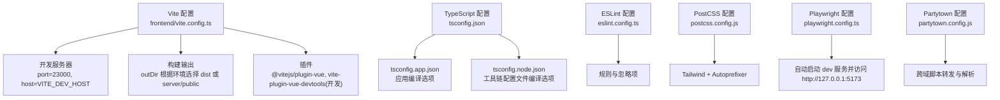
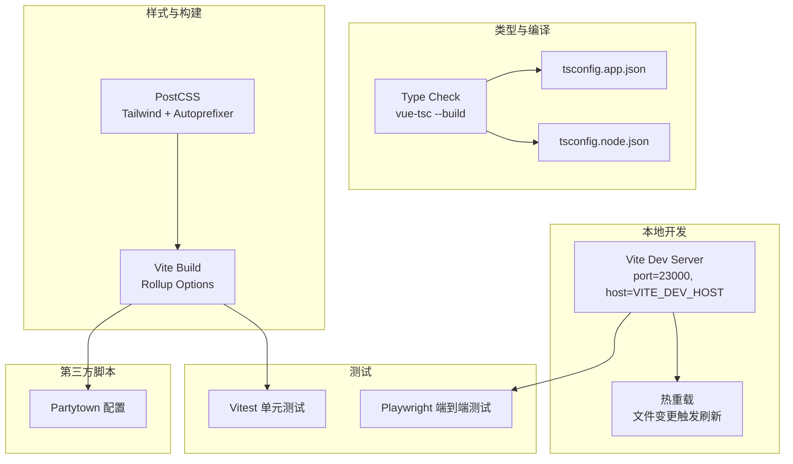
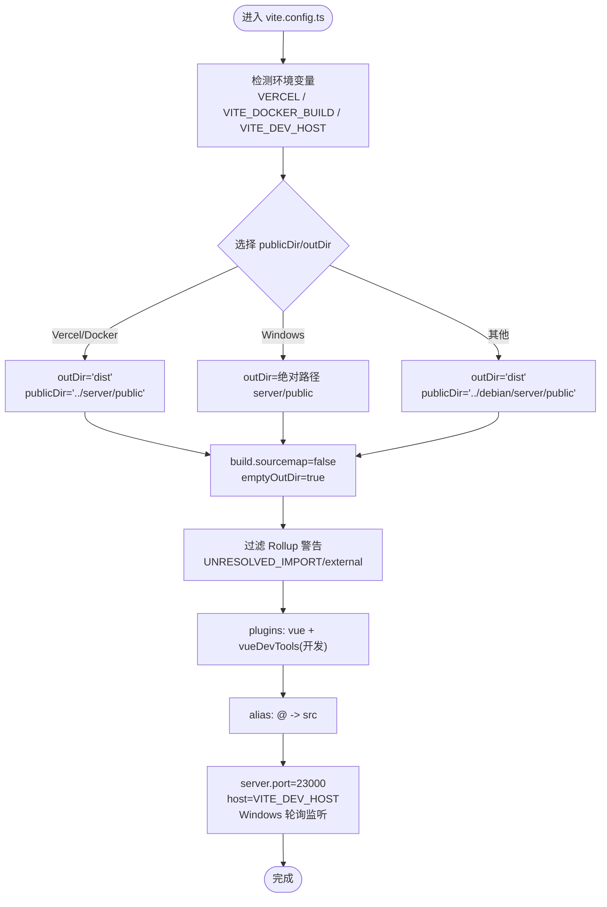
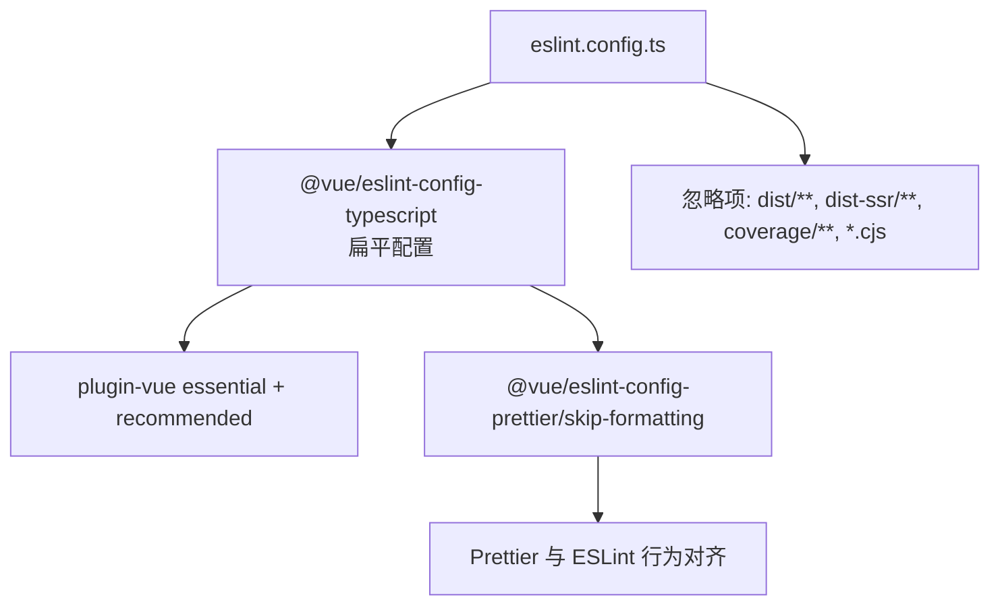
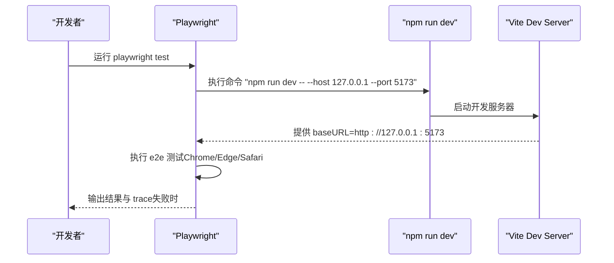
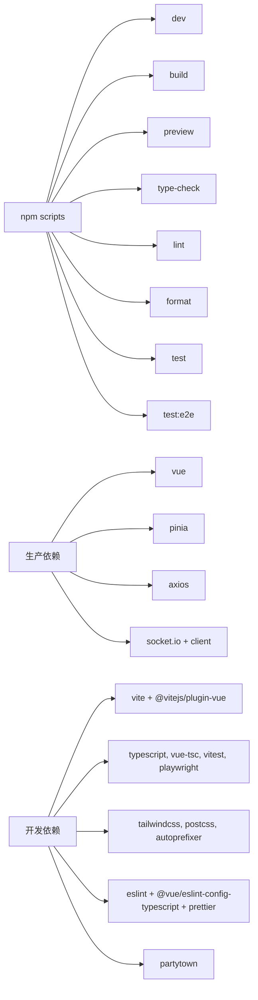

# 开发工具

<cite>
**本文引用的文件**
- [vite.config.ts](file://frontend/vite.config.ts)
- [package.json](file://frontend/package.json)
- [tsconfig.json](file://frontend/tsconfig.json)
- [tsconfig.app.json](file://frontend/tsconfig.app.json)
- [tsconfig.node.json](file://frontend/tsconfig.node.json)
- [eslint.config.ts](file://frontend/eslint.config.ts)
- [postcss.config.js](file://frontend/postcss.config.js)
- [playwright.config.ts](file://frontend/playwright.config.ts)
- [partytown.config.js](file://partytown.config.js)
- [start_frontend.ps1](file://frontend/start_frontend.ps1)
- [env.d.ts](file://frontend/env.d.ts)
- [src/env.d.ts](file://frontend/src/env.d.ts)
- [src/components/__tests__/CustomWidgets.spec.ts](file://frontend/src/components/__tests__/CustomWidgets.spec.ts)
- [src/utils/network.spec.ts](file://frontend/src/utils/network.spec.ts)
- [src/utils/trayDrag.spec.ts](file://frontend/src/utils/trayDrag.spec.ts)
</cite>

## 目录
1. [简介](#简介)
2. [项目结构](#项目结构)
3. [核心组件](#核心组件)
4. [架构总览](#架构总览)
5. [详细组件分析](#详细组件分析)
6. [依赖关系分析](#依赖关系分析)
7. [性能考量](#性能考量)
8. [故障排查指南](#故障排查指南)
9. [结论](#结论)
10. [附录](#附录)

## 简介
本指南面向 OFlatNas 前端开发团队与贡献者，系统性讲解开发工具链：Vite 构建与开发服务器、TypeScript 类型体系、ESLint 规范与 Prettier 格式化、PostCSS/Tailwind 集成、Playwright 端到端测试、Partytown 跨域脚本隔离、以及 Windows PowerShell 启动脚本与热重载配置。文档同时覆盖构建优化、代码分割与资源压缩策略，并提供开发效率与团队协作建议。

## 项目结构
前端工程位于 frontend 目录，采用多配置分层设计：
- Vite 配置：集中于 vite.config.ts，按平台与部署目标动态调整 publicDir/outDir、开发服务器与 Rollup 警告策略。
- TypeScript：通过 tsconfig.json 组织 app 与 node 两套配置，分别用于应用源码与工具链配置文件。
- 代码质量：ESLint 使用 @vue/eslint-config-typescript 的扁平配置；Prettier 通过 npm scripts 集成。
- 样式管线：PostCSS 加载 Tailwind 与 autoprefixer 插件。
- 测试：单元测试基于 Vitest；端到端测试基于 Playwright，内置 webServer 自动启动 dev 服务。
- 第三方脚本隔离：Partytown 配置在 partytown.config.js，支持广告/分析脚本跨域运行。



图表来源
- [vite.config.ts:1-57](file://frontend/vite.config.ts#L1-L57)
- [tsconfig.json:1-12](file://frontend/tsconfig.json#L1-L12)
- [tsconfig.app.json:1-37](file://frontend/tsconfig.app.json#L1-L37)
- [tsconfig.node.json:1-20](file://frontend/tsconfig.node.json#L1-L20)
- [eslint.config.ts:1-32](file://frontend/eslint.config.ts#L1-L32)
- [postcss.config.js:1-6](file://frontend/postcss.config.js#L1-L6)
- [playwright.config.ts:1-23](file://frontend/playwright.config.ts#L1-L23)
- [partytown.config.js:1-22](file://partytown.config.js#L1-L22)

章节来源
- [vite.config.ts:1-57](file://frontend/vite.config.ts#L1-L57)
- [package.json:1-77](file://frontend/package.json#L1-L77)
- [tsconfig.json:1-12](file://frontend/tsconfig.json#L1-L12)
- [tsconfig.app.json:1-37](file://frontend/tsconfig.app.json#L1-L37)
- [tsconfig.node.json:1-20](file://frontend/tsconfig.node.json#L1-L20)
- [eslint.config.ts:1-32](file://frontend/eslint.config.ts#L1-L32)
- [postcss.config.js:1-6](file://frontend/postcss.config.js#L1-L6)
- [playwright.config.ts:1-23](file://frontend/playwright.config.ts#L1-L23)
- [partytown.config.js:1-22](file://partytown.config.js#L1-L22)
- [start_frontend.ps1:1-2](file://frontend/start_frontend.ps1#L1-L2)

## 核心组件
- Vite 构建与开发服务器
  - 动态 publicDir/outDir：根据 VERCEL/VITE_DOCKER_BUILD 决定输出位置；Windows 默认指向 server/public。
  - 开发服务器：默认端口 23000，host 可由 VITE_DEV_HOST 控制；Windows 下启用文件轮询监听。
  - Rollup 警告处理：忽略 UNRESOLVED_IMPORT 与 external 相关警告，避免因依赖外部模块导致构建中断。
  - 插件：Vue 支持与开发期 Vue DevTools。
- TypeScript
  - 多配置组织：tsconfig.json 引入 app 与 node 两套配置，分别用于应用与工具链文件编译。
  - 应用配置：ESNext 目标、Bundler 解析、DOM/Iterable 库、路径别名 @/*。
  - 工具链配置：Node 类型、ESNext/Bundler 模块解析。
- 代码质量
  - ESLint：使用 @vue/eslint-config-typescript 的扁平配置，开启多词组件命名规则与 no-explicit-any。
  - Prettier：通过 npm scripts 运行格式化。
- PostCSS/Tailwind
  - PostCSS 配置加载 Tailwind 与 autoprefixer，确保样式自动前缀与原子化类生成。
- Playwright 端到端测试
  - 自动启动 dev 服务（端口 5173），访问 baseURL 并保留失败时的 trace。
  - 多浏览器项目：Chrome、Edge（Chromium Channel）、Safari。
- Partytown
  - 跨域脚本转发列表与 URL 解析规则，控制广告/分析脚本在隔离上下文中运行。

章节来源
- [vite.config.ts:7-56](file://frontend/vite.config.ts#L7-L56)
- [package.json:10-21](file://frontend/package.json#L10-L21)
- [tsconfig.app.json:12-37](file://frontend/tsconfig.app.json#L12-L37)
- [tsconfig.node.json:11-19](file://frontend/tsconfig.node.json#L11-L19)
- [eslint.config.ts:11-31](file://frontend/eslint.config.ts#L11-L31)
- [postcss.config.js:1-6](file://frontend/postcss.config.js#L1-L6)
- [playwright.config.ts:3-22](file://frontend/playwright.config.ts#L3-L22)
- [partytown.config.js:3-21](file://partytown.config.js#L3-L21)

## 架构总览
下图展示开发工具链在不同环境下的工作流：本地开发（Vite Dev）、类型检查（vue-tsc）、样式构建（PostCSS/Tailwind）、测试（Vitest/Playwright）与第三方脚本隔离（Partytown）。



图表来源
- [vite.config.ts:46-54](file://frontend/vite.config.ts#L46-L54)
- [tsconfig.app.json:1-37](file://frontend/tsconfig.app.json#L1-L37)
- [tsconfig.node.json:1-20](file://frontend/tsconfig.node.json#L1-L20)
- [postcss.config.js:1-6](file://frontend/postcss.config.js#L1-L6)
- [playwright.config.ts:12-16](file://frontend/playwright.config.ts#L12-L16)
- [partytown.config.js:3-21](file://partytown.config.js#L3-L21)

## 详细组件分析

### Vite 配置与优化
- 平台与部署适配
  - publicDir/outDir：在 Vercel/Docker 构建时输出至 dist；Windows 使用 server/public；其他平台使用 debian/server/public。
  - 环境变量：VERCEL、VITE_DOCKER_BUILD、VITE_DEV_HOST。
- 构建优化
  - 关闭 sourcemap 以减少产物体积与构建时间。
  - emptyOutDir 清理旧产物，避免残留。
  - Rollup 警告过滤：忽略 UNRESOLVED_IMPORT 与 external 相关警告，提升兼容性。
- 插件与别名
  - Vue 插件与开发期 Vue DevTools。
  - 路径别名 @ 指向 src。
- 开发服务器
  - 端口 23000，host 可控；Windows 启用文件轮询监听，降低 CPU 占用。
  - 忽略 data/server 目录，避免不必要的重载。



图表来源
- [vite.config.ts:7-56](file://frontend/vite.config.ts#L7-L56)

章节来源
- [vite.config.ts:7-56](file://frontend/vite.config.ts#L7-L56)

### TypeScript 配置与类型定义
- 多配置组织
  - tsconfig.json 作为入口，引用 tsconfig.app.json 与 tsconfig.node.json。
- 应用配置（tsconfig.app.json）
  - include/exclude 控制编译范围；路径别名 @/*。
  - ESNext 目标、Bundler 模块解析、DOM/Iterable 库、noEmit、skipLibCheck。
- 工具链配置（tsconfig.node.json）
  - 继承 @tsconfig/node24；包含 vite.config.*、vitest.config.*、playwright.config.*、eslint.config.*。
  - noEmit、ESNext/Bundler 模块解析、types=node。
- 类型声明
  - env.d.ts 引入 vite/client 类型。
  - src/env.d.ts 声明 .vue 模块与第三方库模块类型，确保 IDE 与类型检查正确识别。

```mermaid
classDiagram
class TsConfigRoot {
+"files" : []
+"references" : [{path : "./tsconfig.node.json"}, {path : "./tsconfig.app.json"}]
}
class TsApp {
+"include" : ["env.d.ts","src/**/*","src/**/*.vue"]
+"exclude" : [...]
+"compilerOptions" : {"target" : "ESNext","module" : "ESNext","moduleResolution" : "Bundler",...}
}
class TsNode {
+"include" : ["vite.config.*","vitest.config.*","playwright.config.*","eslint.config.*"]
+"compilerOptions" : {"noEmit" : true,"module" : "ESNext","moduleResolution" : "Bundler","types" : ["node"]}
}
TsConfigRoot --> TsApp : "引用"
TsConfigRoot --> TsNode : "引用"
```

图表来源
- [tsconfig.json:1-12](file://frontend/tsconfig.json#L1-L12)
- [tsconfig.app.json:1-37](file://frontend/tsconfig.app.json#L1-L37)
- [tsconfig.node.json:1-20](file://frontend/tsconfig.node.json#L1-L20)
- [env.d.ts:1-2](file://frontend/env.d.ts#L1-L2)
- [src/env.d.ts:1-18](file://frontend/src/env.d.ts#L1-L18)

章节来源
- [tsconfig.json:1-12](file://frontend/tsconfig.json#L1-L12)
- [tsconfig.app.json:1-37](file://frontend/tsconfig.app.json#L1-L37)
- [tsconfig.node.json:1-20](file://frontend/tsconfig.node.json#L1-L20)
- [env.d.ts:1-2](file://frontend/env.d.ts#L1-L2)
- [src/env.d.ts:1-18](file://frontend/src/env.d.ts#L1-L18)

### ESLint 与 Prettier 集成
- ESLint
  - 使用 @vue/eslint-config-typescript 的扁平配置，结合 plugin-vue 与 skip-formatting。
  - 规则示例：多词组件命名（含白名单）、禁止 any 显式类型。
  - 忽略项：dist、dist-ssr、coverage、*.cjs。
- Prettier
  - 通过 npm scripts 运行格式化，作用于 src/ 目录。



图表来源
- [eslint.config.ts:11-31](file://frontend/eslint.config.ts#L11-L31)

章节来源
- [eslint.config.ts:1-32](file://frontend/eslint.config.ts#L1-L32)
- [package.json:17-18](file://frontend/package.json#L17-L18)

### PostCSS 与 Tailwind 集成
- PostCSS 配置加载 Tailwind 与 autoprefixer，确保样式自动前缀与原子化类生成。
- 与 Vite 构建流程集成，参与最终产物生成。

章节来源
- [postcss.config.js:1-6](file://frontend/postcss.config.js#L1-L6)

### Playwright 端到端测试
- 测试目录与匹配：e2e 目录下 *.e2e.ts。
- 超时与断言：整体超时 30s，expect 超时 5s。
- 浏览器项目：Chrome、Edge（Chromium Channel）、Safari。
- WebServer：自动启动 dev（端口 5173），复用现有服务，trace 仅在失败时保留。



图表来源
- [playwright.config.ts:12-16](file://frontend/playwright.config.ts#L12-L16)

章节来源
- [playwright.config.ts:1-23](file://frontend/playwright.config.ts#L1-L23)

### Partytown 跨域脚本隔离
- 目标：将第三方脚本（如广告/分析）在隔离上下文中运行，提升安全性与稳定性。
- 配置要点：目标目录、转发列表、URL 解析规则、日志开关。

章节来源
- [partytown.config.js:1-22](file://partytown.config.js#L1-L22)

### Windows 开发环境启动脚本
- PowerShell 脚本：切换到 frontend 目录并执行 npm run dev，便于 Windows 用户一键启动。

章节来源
- [start_frontend.ps1:1-2](file://frontend/start_frontend.ps1#L1-L2)

### 单元测试与测试用例
- Vitest 单元测试
  - 自定义组件结构与 JS 安全执行校验：遍历 win/组件 目录，验证 JSON 结构与 JS 在 mock 上下文下的可执行性。
  - 网络规则测试：IP 前缀匹配、精确匹配与域名不匹配场景。
  - 拖拽排序测试：托盘卡片重排逻辑与不变量保护。

章节来源
- [src/components/__tests__/CustomWidgets.spec.ts:1-125](file://frontend/src/components/__tests__/CustomWidgets.spec.ts#L1-L125)
- [src/utils/network.spec.ts:1-25](file://frontend/src/utils/network.spec.ts#L1-L25)
- [src/utils/trayDrag.spec.ts:1-33](file://frontend/src/utils/trayDrag.spec.ts#L1-L33)

## 依赖关系分析
- 脚本与任务
  - dev/build/preview/type-check/lint/format/test/test:e2e/postbuild 等通过 npm scripts 统一管理。
- 依赖与开发依赖
  - 生产依赖：Vue 3、Pinia、Socket.IO、Axios、Fuse.js、Smooth Corners、UUID 等。
  - 开发依赖：Vite、@vitejs/plugin-vue、vite-plugin-vue-devtools、TypeScript、Vue TS/ESLint/Prettier 配置、Tailwind、PostCSS、Playwright、Vitest、Partytown 等。



图表来源
- [package.json:10-77](file://frontend/package.json#L10-L77)

章节来源
- [package.json:1-77](file://frontend/package.json#L1-L77)

## 性能考量
- 构建优化
  - 关闭 sourcemap：减少产物体积与构建时间。
  - emptyOutDir：避免历史产物污染。
  - Rollup 警告过滤：提升兼容性与稳定性。
- 代码分割与资源压缩
  - Vite/Rollup 默认进行代码分割与 Tree Shaking；可通过路由级懒加载与动态导入进一步优化。
- 开发体验
  - Windows 文件轮询监听：降低 CPU 占用，提升稳定性。
  - 忽略 data/server 目录：减少不必要的热重载。
- 样式与第三方脚本
  - Tailwind 原子化类减少冗余样式；Partytown 将第三方脚本隔离，避免阻塞主线程。

章节来源
- [vite.config.ts:27-54](file://frontend/vite.config.ts#L27-L54)
- [postcss.config.js:1-6](file://frontend/postcss.config.js#L1-L6)
- [partytown.config.js:3-21](file://partytown.config.js#L3-L21)

## 故障排查指南
- Vite 开发服务器无法访问或端口冲突
  - 检查 VITE_DEV_HOST 与 server.host 设置；确认端口 23000 未被占用。
- Windows 热重载不生效或 CPU 占用高
  - 确认已启用轮询监听；忽略 data/server 目录；必要时临时禁用大型文件监控。
- UNRESOLVED_IMPORT 或 external 相关警告
  - 构建阶段已过滤该类警告；若仍报错，检查依赖是否为 CommonJS external。
- ESLint 报错与 Prettier 冲突
  - 使用 @vue/eslint-config-prettier/skip-formatting 对齐行为；通过 npm run lint --fix 修复。
- Partytown 跨域脚本未生效
  - 检查转发列表与 URL 解析规则；确认目标目录与静态资源路径一致。
- Playwright 测试失败
  - 查看 trace 日志；确认 dev 服务已启动并可访问 baseURL；检查浏览器项目配置。

章节来源
- [vite.config.ts:46-54](file://frontend/vite.config.ts#L46-L54)
- [eslint.config.ts:11-31](file://frontend/eslint.config.ts#L11-L31)
- [partytown.config.js:3-21](file://partytown.config.js#L3-L21)
- [playwright.config.ts:8-16](file://frontend/playwright.config.ts#L8-L16)

## 结论
本指南梳理了 OFlatNas 前端开发工具链的关键配置与最佳实践：Vite 的平台化适配与开发服务器优化、TypeScript 的双配置体系、ESLint/Prettier 的一体化规范、PostCSS/Tailwind 的样式管线、Playwright 的端到端测试与 Partytown 的跨域脚本隔离。配合 Windows 启动脚本与热重载策略，可显著提升开发效率与产物质量。

## 附录
- 开发效率与 IDE 推荐
  - VSCode：安装 Vue、TypeScript、ESLint、Prettier 插件；启用保存时格式化与 ESLint 自动修复。
  - Vitest/Playwright：在 IDE 中直接运行单测与端到端测试，查看 trace 与覆盖率。
- 团队协作工具
  - Git Hooks：建议集成 lint-staged 与 husky，在提交前自动格式化与静态检查。
  - CI/CD：在 GitHub Actions 中复用 Playwright 与构建脚本，确保跨平台一致性。