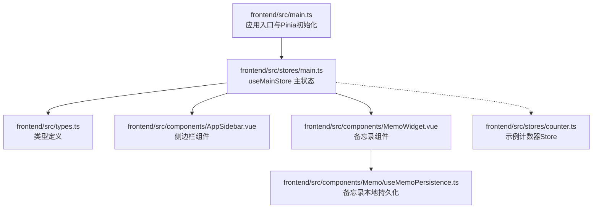
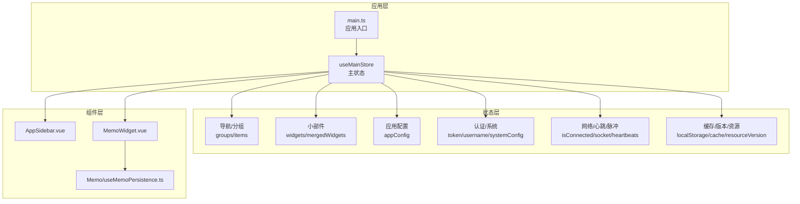
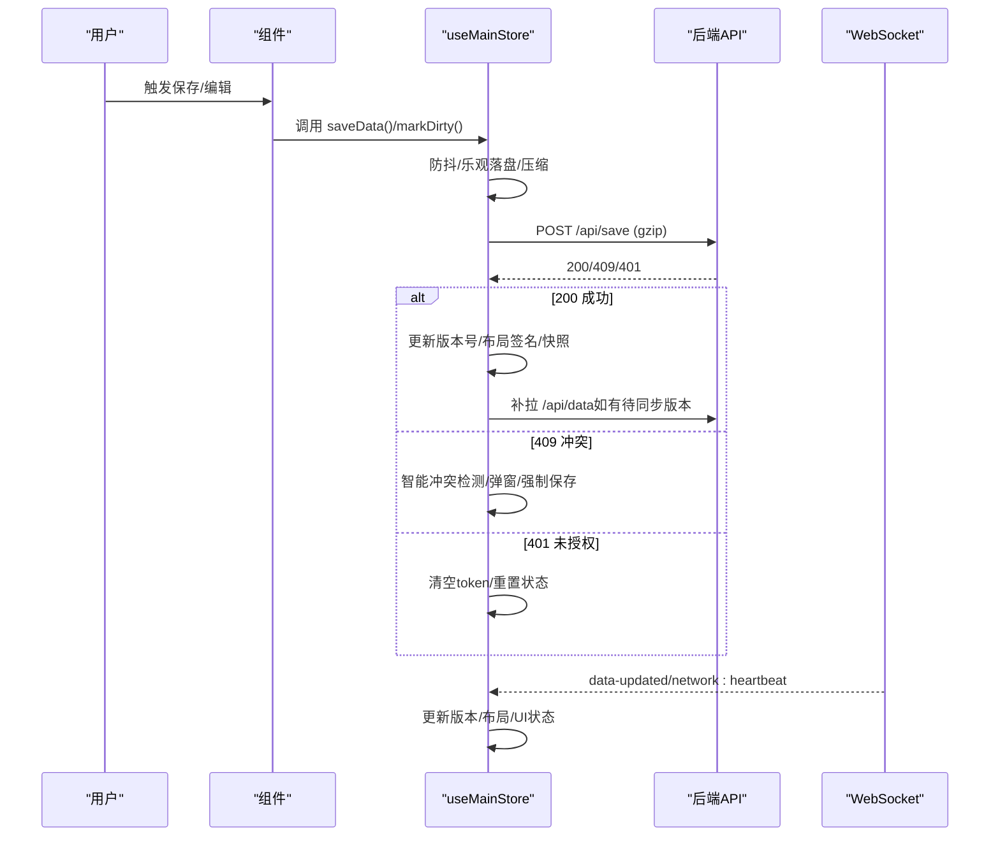
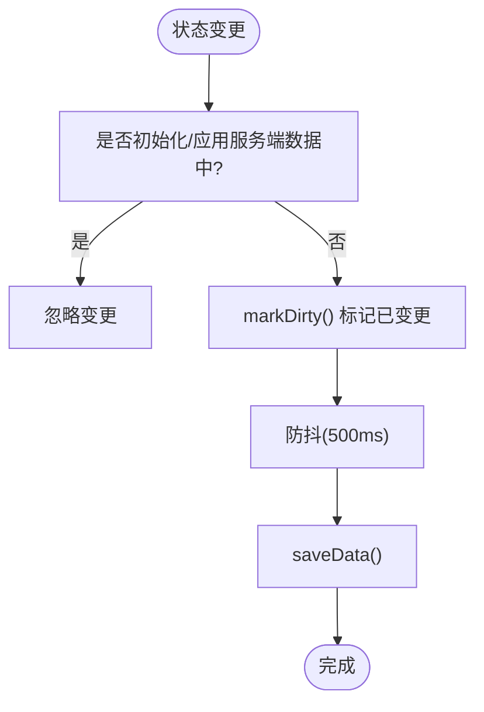
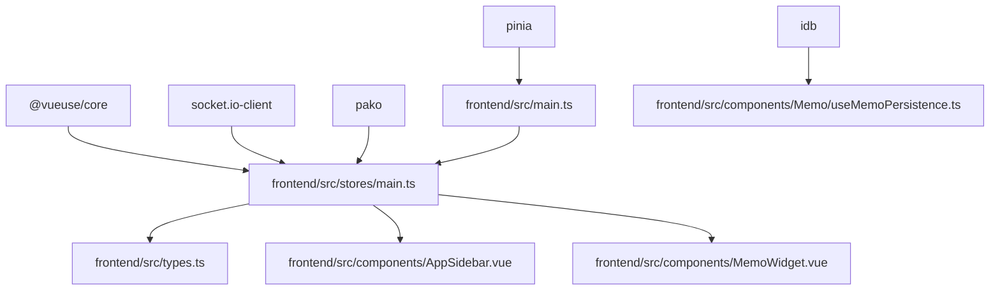

# 状态管理

<cite>
**本文引用的文件**
- [frontend/src/main.ts](file://frontend/src/main.ts)
- [frontend/src/stores/main.ts](file://frontend/src/stores/main.ts)
- [frontend/src/stores/counter.ts](file://frontend/src/stores/counter.ts)
- [frontend/src/types.ts](file://frontend/src/types.ts)
- [frontend/src/components/AppSidebar.vue](file://frontend/src/components/AppSidebar.vue)
- [frontend/src/components/MemoWidget.vue](file://frontend/src/components/MemoWidget.vue)
- [frontend/src/components/Memo/useMemoPersistence.ts](file://frontend/src/components/Memo/useMemoPersistence.ts)
- [frontend/package.json](file://frontend/package.json)
</cite>

## 目录
1. [简介](#简介)
2. [项目结构](#项目结构)
3. [核心组件](#核心组件)
4. [架构总览](#架构总览)
5. [详细组件分析](#详细组件分析)
6. [依赖关系分析](#依赖关系分析)
7. [性能考量](#性能考量)
8. [故障排查指南](#故障排查指南)
9. [结论](#结论)
10. [附录](#附录)

## 简介
本指南围绕 OFlatNas 前端的状态管理展开，重点讲解 Pinia 状态库的使用方式、Store 的定义与模块化组织、主状态 Store 的架构设计与数据结构、响应式更新机制（含计算属性与侦听器）、状态持久化策略（本地存储与 IndexedDB）、与后端 API 的状态同步与冲突处理、最佳实践与性能优化、调试技巧，以及状态模块的扩展方法与团队协作规范。

## 项目结构
- 前端入口在 main.ts 中初始化 Pinia 并挂载应用，随后立即调用主 Store 初始化流程，确保页面渲染前完成关键数据加载与缓存恢复。
- 主状态 Store 位于 stores/main.ts，集中管理仪表盘数据、用户认证、系统配置、小部件布局与 UI 状态、天气网络状态、壁纸列表、更新检查、资源版本与缓存等。
- 类型定义集中在 types.ts，统一约束导航项、分组、应用配置、小部件、RSS、幸运 STUN 数据等数据结构。
- 示例计数器 Store stores/counter.ts 展示了最小化的 Pinia Store 写法，便于理解模块化组织。
- 多个业务组件通过 useMainStore 访问状态，如 AppSidebar.vue、MemoWidget.vue 等。



**图表来源**
- [frontend/src/main.ts:1-37](file://frontend/src/main.ts#L1-L37)
- [frontend/src/stores/main.ts:30-2517](file://frontend/src/stores/main.ts#L30-L2517)
- [frontend/src/types.ts:1-298](file://frontend/src/types.ts#L1-L298)
- [frontend/src/stores/counter.ts:1-13](file://frontend/src/stores/counter.ts#L1-L13)
- [frontend/src/components/AppSidebar.vue:1-200](file://frontend/src/components/AppSidebar.vue#L1-L200)
- [frontend/src/components/MemoWidget.vue:1-200](file://frontend/src/components/MemoWidget.vue#L1-L200)
- [frontend/src/components/Memo/useMemoPersistence.ts:48-218](file://frontend/src/components/Memo/useMemoPersistence.ts#L48-L218)

**章节来源**
- [frontend/src/main.ts:1-37](file://frontend/src/main.ts#L1-L37)
- [frontend/src/stores/main.ts:30-2517](file://frontend/src/stores/main.ts#L30-L2517)
- [frontend/src/stores/counter.ts:1-13](file://frontend/src/stores/counter.ts#L1-L13)
- [frontend/src/types.ts:1-298](file://frontend/src/types.ts#L1-L298)

## 核心组件
- Pinia 与入口初始化
  - 在 main.ts 中创建并注册 Pinia，随后获取主 Store 并调用其 init() 完成初始化，确保关键数据在首屏前就绪。
- 主状态 Store（useMainStore）
  - 职责：统一管理导航分组与条目、小部件集合与布局、应用配置、用户认证与权限、系统配置、天气网络状态、壁纸列表、更新检查、资源版本与缓存、与后端的同步与冲突处理、全局拖拽状态、仪表盘脉冲定时器等。
  - 数据结构：大量 ref 与 computed 组合，配合 watch 侦听关键状态变化，实现响应式更新与副作用控制。
  - 模块化：将复杂功能拆分为多个子域函数（如网络心跳、仪表盘脉冲、布局签名、缓存读写、保存与冲突处理等），保持单文件内的高内聚与可维护性。
- 类型系统（types.ts）
  - 提供 NavItem、NavGroup、AppConfig、WidgetConfig、RssFeed、RssCategory、LuckyStunData 等强类型定义，贯穿 Store 与组件层，提升开发体验与运行时安全性。
- 示例 Store（counter.ts）
  - 展示最简 Pinia Store 写法：defineStore + 返回值对象，便于团队成员快速理解模块化组织方式。

**章节来源**
- [frontend/src/main.ts:22-30](file://frontend/src/main.ts#L22-L30)
- [frontend/src/stores/main.ts:30-2517](file://frontend/src/stores/main.ts#L30-L2517)
- [frontend/src/stores/counter.ts:1-13](file://frontend/src/stores/counter.ts#L1-L13)
- [frontend/src/types.ts:1-298](file://frontend/src/types.ts#L1-L298)

## 架构总览
整体采用“入口初始化 → 主 Store 管理 → 组件消费”的分层架构。主 Store 作为中枢，负责：
- 生命周期与初始化：加载缓存、拉取服务端快照、绑定 Socket 事件、启动网络心跳与仪表盘脉冲。
- 数据一致性：版本号校验、冲突检测与解决、布局签名比对、乐观落盘与压缩传输。
- 用户态与系统态：认证、系统配置、网络模式、天气状态、资源版本与缓存。
- 小部件生态：UI 状态与布局分离、布局签名、快照与撤销、市场插件应用。



**图表来源**
- [frontend/src/main.ts:22-30](file://frontend/src/main.ts#L22-L30)
- [frontend/src/stores/main.ts:30-2517](file://frontend/src/stores/main.ts#L30-L2517)
- [frontend/src/components/AppSidebar.vue:1-200](file://frontend/src/components/AppSidebar.vue#L1-L200)
- [frontend/src/components/MemoWidget.vue:1-200](file://frontend/src/components/MemoWidget.vue#L1-L200)
- [frontend/src/components/Memo/useMemoPersistence.ts:48-218](file://frontend/src/components/Memo/useMemoPersistence.ts#L48-L218)

## 详细组件分析

### 主状态 Store（useMainStore）架构与数据流
- 初始化与快照加载
  - loadServerSnapshot：从后端拉取完整数据快照，解析并注入 groups、widgets、appConfig、rss 等，随后写入缓存并标记“服务端快照就绪”，以避免重复写入。
  - loadFromCache：从 localStorage 恢复缓存，带用户名匹配与安全校验，确保不同用户间的数据隔离。
  - init：组合缓存与快照加载，处理重试与降级，绑定 Socket 事件与网络心跳，完成全局初始化。
- 网络与心跳
  - startNetworkHeartbeat / stopNetworkHeartbeat：周期性发送心跳，结合超时检测与白名单模式（latency）动态调整心跳间隔，保障弱网与反代环境下的可用性。
  - registerDashboardPulse / unregisterDashboardPulse：统一仪表盘定时任务，减少分散请求，降低资源消耗。
- 小部件与布局
  - normalizeIncomingWidgets：标准化服务端返回的小部件列表，补齐缺失组件（如 docker、file-transfer、rss、sidebar、system-status、status-monitor 等），保证默认布局一致性。
  - applyServerWidgets：将服务端布局映射到本地 widgets，保留编辑中的布局以防抖，再应用 UI 状态（collapsed/editing/dragging）。
  - buildServerLayoutMap / buildServerLayoutSignature：基于布局字段生成稳定签名，用于检测布局变更与冲突。
  - lastSavedLayoutSnapshot：保存上次成功保存的布局快照，支持撤销。
- 缓存与持久化
  - saveToCache / loadFromCache：将 groups、widgets、appConfig、rss 等序列化到 localStorage，带版本号与时间戳，支持跨设备/会话恢复。
  - resourceVersion：资源版本号，用于为静态资源添加时间戳参数，避免缓存导致的样式/脚本不更新。
- 保存与冲突处理
  - saveData：防抖保存，支持 gzip 压缩、指数退避重试、乐观落盘、版本号校验与 409 冲突处理；支持智能冲突检测（非结构性冲突静默同步）与强制保存。
  - resolveConflict：提供“采用远端/采用本地”两种策略，冲突解决期间拦截新保存请求，保证数据流单一。
- 认证与系统配置
  - login/register/logout：标准认证流程，配合 Socket 认证与系统模式变更事件，确保多端一致性。
  - fetchSystemConfig/updateSystemConfig：系统配置的获取与更新，支持鉴权头。
- 天气网络状态与资源
  - detectWeatherNetworkStatus：基于 /api/health 探测网络健康度，支持在线/降级/离线三态与缓存窗口。
  - fetchWallpaperLists：并行获取桌面/移动端壁纸列表，构建有序列表，失败时回退默认壁纸。
  - checkUpdate：检查远端版本与 Docker 更新状态，支持定时去重。
- 侦听与响应式更新
  - 对 appConfig、widgets、rssFeeds、rssCategories 等进行深度 watch，在非初始化与非应用服务端数据期间标记“已变更”，驱动保存流程。
  - 对 forceNetworkMode 变更进行热切换，重启心跳以适配新网络模式。



**图表来源**
- [frontend/src/stores/main.ts:1670-1995](file://frontend/src/stores/main.ts#L1670-L1995)
- [frontend/src/stores/main.ts:1544-1578](file://frontend/src/stores/main.ts#L1544-L1578)
- [frontend/src/stores/main.ts:1569-1572](file://frontend/src/stores/main.ts#L1569-L1572)

**章节来源**
- [frontend/src/stores/main.ts:1443-1590](file://frontend/src/stores/main.ts#L1443-L1590)
- [frontend/src/stores/main.ts:1394-1441](file://frontend/src/stores/main.ts#L1394-L1441)
- [frontend/src/stores/main.ts:1048-1129](file://frontend/src/stores/main.ts#L1048-L1129)
- [frontend/src/stores/main.ts:1670-1995](file://frontend/src/stores/main.ts#L1670-L1995)
- [frontend/src/stores/main.ts:2384-2397](file://frontend/src/stores/main.ts#L2384-L2397)

### 响应式更新机制：计算属性与侦听器
- 计算属性
  - mergedWidgets：将 UI 状态（collapsed/editing/dragging）应用到 widgets，形成最终渲染视图。
  - items：由 groups 扁平化得到的导航条目集合。
  - hasUpdate：基于 docker 更新与远端版本比较得出。
  - isServerSnapshotReady/isClientReady：基于快照与缓存加载状态的只读开关。
- 侦听器
  - 对 appConfig、widgets、rssFeeds、rssCategories 进行深度 watch，在非初始化与非应用服务端数据期间触发 markDirty，驱动保存。
  - 对 forceNetworkMode 变更进行热切换，重启心跳。
  - 对 widgets 进行深度 watch，计算布局签名，标记 layoutDirty，用于撤销与冲突检测。



**图表来源**
- [frontend/src/stores/main.ts:2214-2292](file://frontend/src/stores/main.ts#L2214-L2292)
- [frontend/src/stores/main.ts:1662-1668](file://frontend/src/stores/main.ts#L1662-L1668)

**章节来源**
- [frontend/src/stores/main.ts:913-926](file://frontend/src/stores/main.ts#L913-L926)
- [frontend/src/stores/main.ts:2214-2292](file://frontend/src/stores/main.ts#L2214-L2292)
- [frontend/src/stores/main.ts:1662-1668](file://frontend/src/stores/main.ts#L1662-L1668)

### 状态持久化策略与本地存储集成
- 本地缓存（localStorage）
  - CACHE_KEY：统一键名，存储 groups、widgets（剥离 UI 状态）、appConfig（剔除 forceNetworkMode）、rssFeeds、rssCategories、username、version、timestamp。
  - loadFromCache：安全校验（用户名匹配/游客模式）、迁移与兼容（壁纸轮换、搜索引擎、默认背景等）、恢复快照与脏状态。
  - saveToCache：乐观落盘，写入后立即生效，避免网络失败导致数据丢失。
- IndexedDB（备忘录专用）
  - useMemoPersistence：提供 IndexedDB 存取、版本快照、历史版本管理、校验与迁移（从 localStorage 兼容），确保备忘录内容在刷新/离线场景下不丢失。
- 资源版本与缓存破坏
  - resourceVersion：全局资源版本号，getAssetUrl 为其追加时间戳参数，避免缓存导致的样式/脚本不更新。

```mermaid
graph LR
A["localStorage<br/>CACHE_KEY"] --> B["loadFromCache<br/>安全校验/迁移"]
A --> C["saveToCache<br/>乐观落盘"]
D["IndexedDB<br/>MemoStore"] <- --> E["useMemoPersistence.ts<br/>存取/快照/校验"]
F["resourceVersion"] --> G["getAssetUrl<br/>资源URL追加?t="]
```

**图表来源**
- [frontend/src/stores/main.ts:1015-1129](file://frontend/src/stores/main.ts#L1015-L1129)
- [frontend/src/components/Memo/useMemoPersistence.ts:48-218](file://frontend/src/components/Memo/useMemoPersistence.ts#L48-L218)
- [frontend/src/stores/main.ts:562-577](file://frontend/src/stores/main.ts#L562-L577)

**章节来源**
- [frontend/src/stores/main.ts:1015-1129](file://frontend/src/stores/main.ts#L1015-L1129)
- [frontend/src/components/Memo/useMemoPersistence.ts:48-218](file://frontend/src/components/Memo/useMemoPersistence.ts#L48-L218)
- [frontend/src/stores/main.ts:562-577](file://frontend/src/stores/main.ts#L562-L577)

### 与后端 API 的状态同步、错误处理与加载状态
- 同步流程
  - loadServerSnapshot：拉取完整快照，注入状态，写缓存并标记就绪。
  - fetchAndProcessData：在收到 data-updated 或连接恢复后，按需拉取并应用服务端数据，处理布局保护与脏状态。
  - Socket 事件：memo:updated、todo:updated、data-updated、network:heartbeat 等，驱动实时更新与心跳恢复检测。
- 错误处理
  - 超时与重试：fetchWithTimeout、指数退避重试、AbortController 控制超时。
  - 409 冲突：智能检测（布局/分组/配置是否相同），相同则静默同步；否则弹窗选择策略。
  - 401 未授权：清空 token 并重置状态。
- 加载状态
  - isInitializing/isLoadingSnapshot/isSaving：分别表示初始化、快照加载、保存过程中的状态，用于 UI 占位与交互反馈。
  - hasServerSnapshot/isClientReady：用于判定是否可以进入交互态。

**章节来源**
- [frontend/src/stores/main.ts:1394-1441](file://frontend/src/stores/main.ts#L1394-L1441)
- [frontend/src/stores/main.ts:1330-1377](file://frontend/src/stores/main.ts#L1330-L1377)
- [frontend/src/stores/main.ts:1523-1585](file://frontend/src/stores/main.ts#L1523-L1585)
- [frontend/src/stores/main.ts:1670-1995](file://frontend/src/stores/main.ts#L1670-L1995)

### 最佳实践与团队协作规范
- Store 设计
  - 将复杂逻辑拆分为子域函数（心跳、脉冲、布局签名、缓存、保存、冲突），保持单文件高内聚。
  - 明确职责边界：UI 状态与布局状态分离，避免混杂。
- 响应式与副作用
  - 使用 computed 与 watch 精准控制响应范围，避免深度监听带来的性能问题。
  - 在保存前进行防抖与乐观落盘，提升用户体验与可靠性。
- 数据一致性
  - 版本号与布局签名双保险，冲突检测与智能合并策略减少用户干预。
  - 服务端快照就绪后，避免重复写入缓存，减少 IO。
- 安全与兼容
  - 缓存加载前进行用户名匹配与安全校验，防止跨用户污染。
  - 类型系统贯穿 Store 与组件，减少运行时错误。
- 团队协作
  - 统一命名与导出风格，遵循“返回值对象”模式，便于测试与文档生成。
  - 新增模块时，先在 types.ts 定义类型，再在 stores 中实现，最后在组件中消费。

**章节来源**
- [frontend/src/stores/main.ts:30-2517](file://frontend/src/stores/main.ts#L30-L2517)
- [frontend/src/stores/counter.ts:1-13](file://frontend/src/stores/counter.ts#L1-L13)
- [frontend/src/types.ts:1-298](file://frontend/src/types.ts#L1-L298)

## 依赖关系分析
- 外部依赖
  - Pinia：状态容器与 Store 定义。
  - @vueuse/core：useStorage 等工具，简化本地存储与响应式封装。
  - socket.io-client：实时通信与心跳。
  - pako：gzip 压缩，减小传输体积。
  - idb：IndexedDB 封装，用于备忘录持久化。
- 内部依赖
  - main.ts 依赖 useMainStore 与 App 组件。
  - useMainStore 依赖 types.ts 类型定义。
  - 组件（如 AppSidebar、MemoWidget）依赖 useMainStore 获取/更新状态。



**图表来源**
- [frontend/package.json:22-47](file://frontend/package.json#L22-L47)
- [frontend/src/main.ts:1-37](file://frontend/src/main.ts#L1-L37)
- [frontend/src/stores/main.ts:1-2517](file://frontend/src/stores/main.ts#L1-L2517)
- [frontend/src/components/Memo/useMemoPersistence.ts:48-218](file://frontend/src/components/Memo/useMemoPersistence.ts#L48-L218)

**章节来源**
- [frontend/package.json:22-47](file://frontend/package.json#L22-L47)
- [frontend/src/main.ts:1-37](file://frontend/src/main.ts#L1-L37)
- [frontend/src/stores/main.ts:1-2517](file://frontend/src/stores/main.ts#L1-L2517)

## 性能考量
- 请求聚合与节流
  - 仪表盘脉冲定时器统一调度，避免分散请求与并发风暴。
  - 保存防抖（500ms）与指数退避重试，兼顾成功率与网络压力。
- 压缩与缓存
  - 保存时 gzip 压缩，显著降低传输体积。
  - 乐观落盘与资源版本参数，减少不必要的网络往返。
- 响应式优化
  - 深度 watch 仅作用于关键状态，布局签名计算仅包含必要字段，避免全量 diff。
  - UI 状态与布局状态分离，减少不必要的渲染。

[本节为通用指导，无需特定文件引用]

## 故障排查指南
- 初始化失败
  - 现象：页面长时间处于加载态或空白。
  - 排查：检查 loadServerSnapshot 与重试逻辑，确认网络可达与后端接口返回；查看缓存加载是否成功。
  - 参考路径：[frontend/src/stores/main.ts:1443-1504](file://frontend/src/stores/main.ts#L1443-L1504)
- 冲突与版本不一致
  - 现象：409 冲突弹窗或布局抖动。
  - 排查：确认是否为结构性变更；使用 resolveConflict 选择策略；检查 lastSavedLayoutSignature 与 serverLayoutSignature 是否一致。
  - 参考路径：[frontend/src/stores/main.ts:1823-1950](file://frontend/src/stores/main.ts#L1823-L1950)
- 保存超时或失败
  - 现象：保存按钮长时间不可用或报错。
  - 排查：检查 AbortError 与超时重试；确认网络状况与后端限流；查看 isSaving 与 hasPendingSave 状态。
  - 参考路径：[frontend/src/stores/main.ts:1777-1789](file://frontend/src/stores/main.ts#L1777-L1789)
- 备忘录内容丢失
  - 现象：刷新后内容消失。
  - 排查：检查 IndexedDB 是否可用；确认 useMemoPersistence 的保存/加载流程；查看历史版本是否存在。
  - 参考路径：[frontend/src/components/Memo/useMemoPersistence.ts:48-218](file://frontend/src/components/Memo/useMemoPersistence.ts#L48-L218)
- 未授权或登出
  - 现象：401 未授权导致自动登出。
  - 排查：确认 token 是否存在；检查系统配置与认证模式变更事件。
  - 参考路径：[frontend/src/stores/main.ts:1952-1959](file://frontend/src/stores/main.ts#L1952-L1959)

**章节来源**
- [frontend/src/stores/main.ts:1443-1504](file://frontend/src/stores/main.ts#L1443-L1504)
- [frontend/src/stores/main.ts:1823-1950](file://frontend/src/stores/main.ts#L1823-L1950)
- [frontend/src/stores/main.ts:1777-1789](file://frontend/src/stores/main.ts#L1777-L1789)
- [frontend/src/components/Memo/useMemoPersistence.ts:48-218](file://frontend/src/components/Memo/useMemoPersistence.ts#L48-L218)
- [frontend/src/stores/main.ts:1952-1959](file://frontend/src/stores/main.ts#L1952-L1959)

## 结论
OFlatNas 的状态管理以 Pinia 为核心，通过主 Store（useMainStore）实现对导航、小部件、配置、认证、网络与缓存的统一治理。借助计算属性、watch 与 Socket 事件，系统实现了高效的响应式更新与实时同步；通过版本号、布局签名与智能冲突检测，保障了多端一致性与用户体验。配合本地缓存与 IndexedDB，系统在弱网与离线场景下仍具备良好的可用性。建议团队在新增模块时严格遵循类型驱动与模块化组织原则，持续优化性能与可维护性。

[本节为总结性内容，无需特定文件引用]

## 附录
- 示例 Store（counter.ts）展示最小化 Pinia 写法，适合入门与对比参考。
- 类型系统（types.ts）涵盖导航、分组、应用配置、小部件、RSS、LuckyStun 等核心数据模型，是状态与组件交互的契约基础。

**章节来源**
- [frontend/src/stores/counter.ts:1-13](file://frontend/src/stores/counter.ts#L1-L13)
- [frontend/src/types.ts:1-298](file://frontend/src/types.ts#L1-L298)