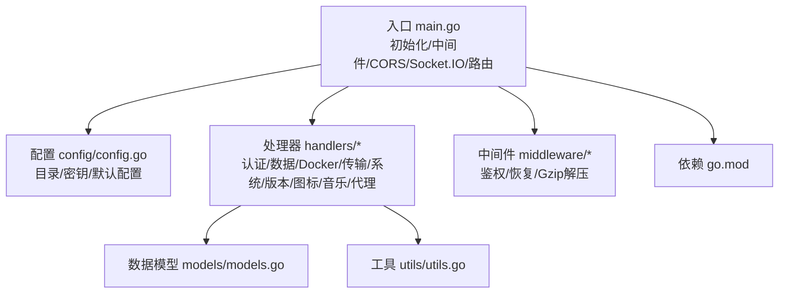
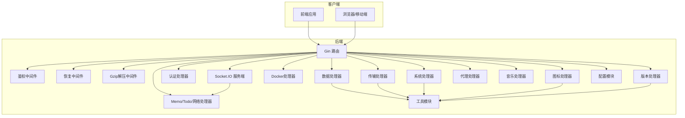
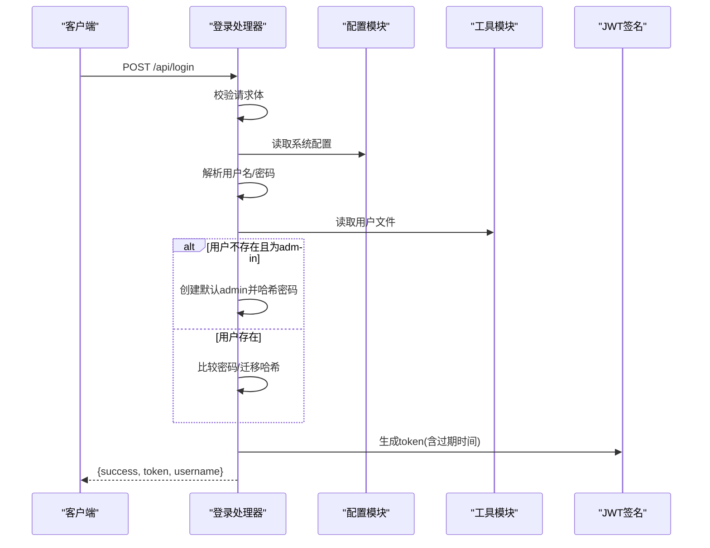
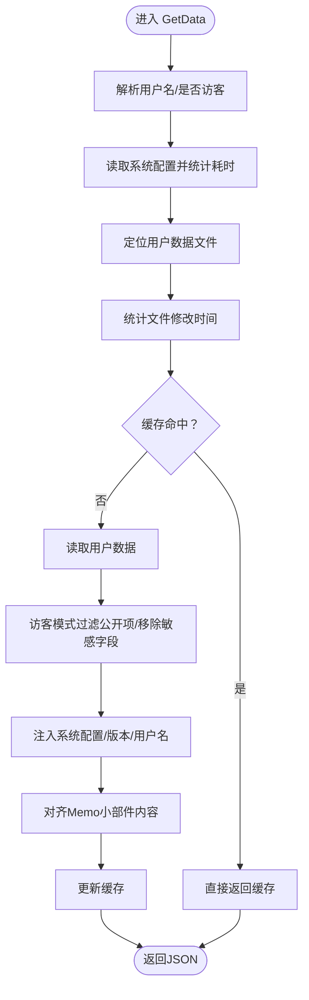
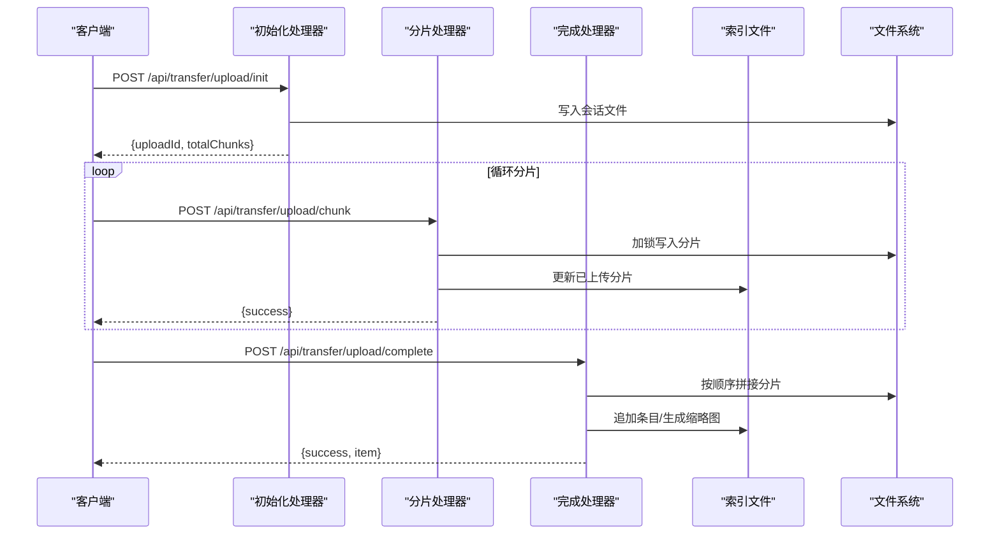
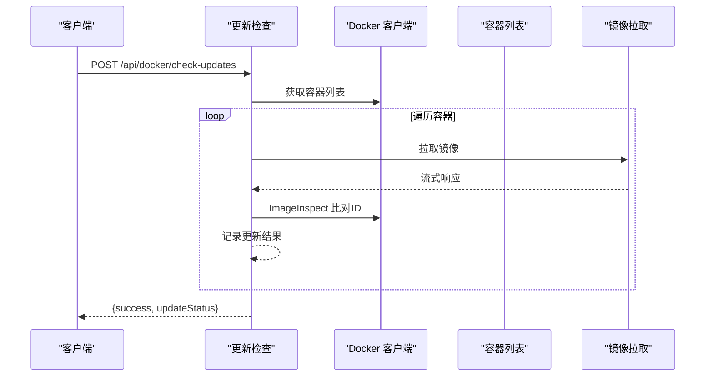
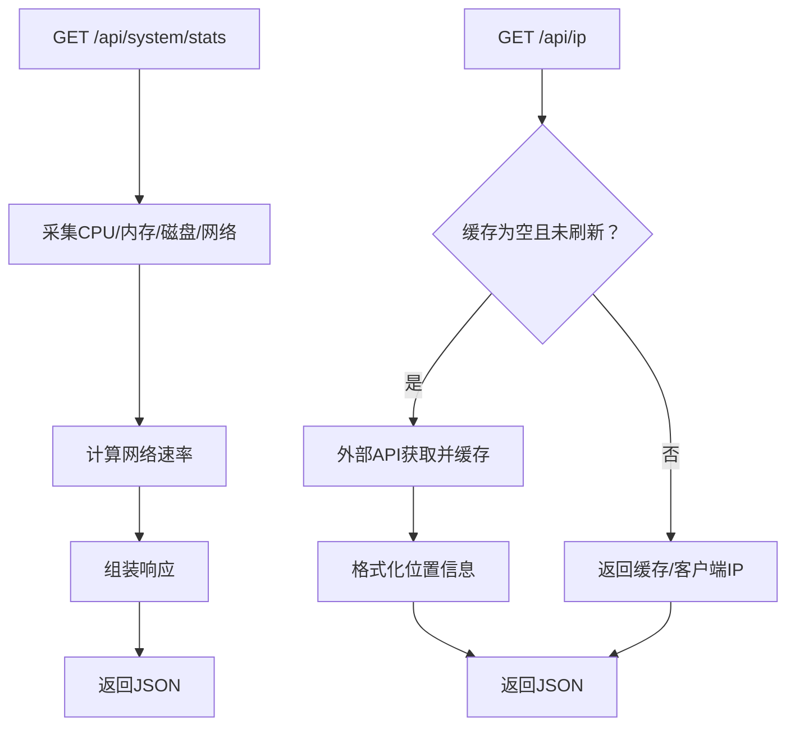
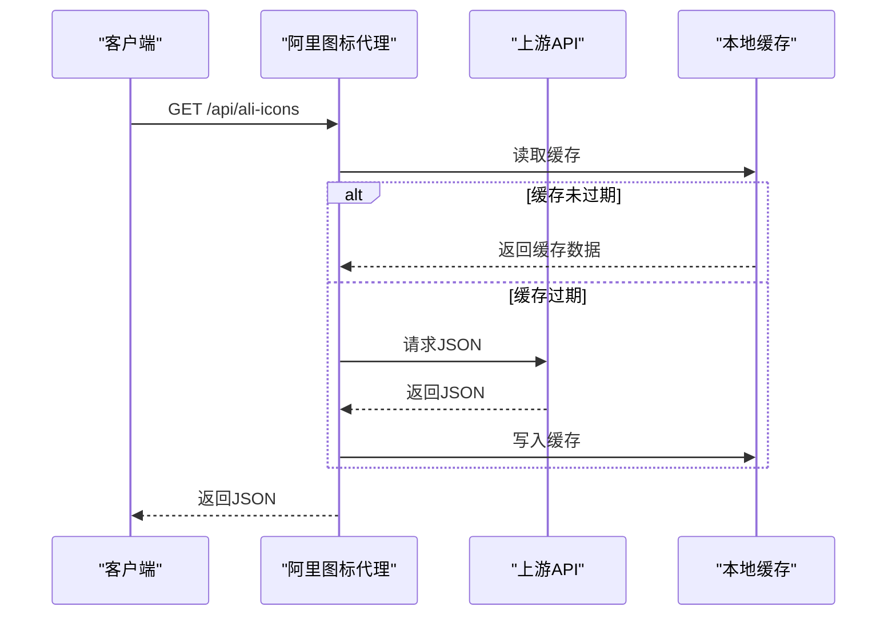
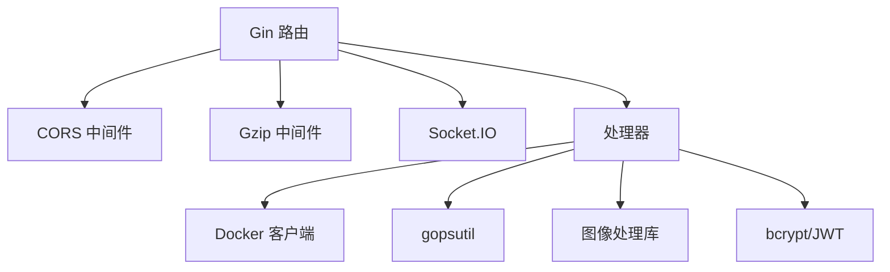

# API 开发

<cite>
**本文档引用的文件**
- [main.go](file://backend/main.go)
- [config.go](file://backend/config/config.go)
- [go.mod](file://backend/go.mod)
- [auth.go](file://backend/handlers/auth.go)
- [data.go](file://backend/handlers/data.go)
- [docker.go](file://backend/handlers/docker.go)
- [transfer.go](file://backend/handlers/transfer.go)
- [system.go](file://backend/handlers/system.go)
- [versions.go](file://backend/handlers/versions.go)
- [icons.go](file://backend/handlers/icons.go)
- [memo.go](file://backend/handlers/memo.go)
- [music.go](file://backend/handlers/music.go)
- [proxy.go](file://backend/handlers/proxy.go)
- [auth.go](file://backend/middleware/auth.go)
- [recovery.go](file://backend/middleware/recovery.go)
- [gzip_decompress.go](file://backend/middleware/gzip_decompress.go)
- [models.go](file://backend/models/models.go)
- [utils.go](file://backend/utils/utils.go)
</cite>

## 目录
1. [简介](#简介)
2. [项目结构](#项目结构)
3. [核心组件](#核心组件)
4. [架构总览](#架构总览)
5. [详细组件分析](#详细组件分析)
6. [依赖分析](#依赖分析)
7. [性能考虑](#性能考虑)
8. [故障排查指南](#故障排查指南)
9. [结论](#结论)
10. [附录](#附录)

## 简介
本指南面向 OFlatNas 后端 API 的开发与集成，基于 Gin 框架与 Socket.IO 实现实时通信，覆盖认证、数据管理、文件传输、Docker 管理、系统信息、图标缓存、音乐上传、代理与网络等模块。文档提供 RESTful API 设计原则、路由配置、请求响应规范、参数校验、错误处理、中间件与安全策略、版本管理、速率限制与性能优化建议，并给出调用示例与最佳实践。

## 项目结构
后端采用分层设计：
- 入口与路由：main.go 统一初始化配置、中间件、静态资源、Socket.IO 与路由组
- 配置：config/config.go 提供目录结构、密钥与默认配置初始化
- 处理器：handlers 下按功能拆分，如认证、数据、Docker、传输、系统、版本、图标、音乐、代理等
- 中间件：middleware 提供鉴权、恢复、Gzip 解压等
- 数据模型：models 定义请求/响应结构
- 工具：utils 提供原子写文件、锁等通用能力
- 依赖：go.mod 管理第三方库

**图表来源**
- [main.go:25-267](file://backend/main.go#L25-L267)
- [config.go:35-86](file://backend/config/config.go#L35-L86)
- [go.mod:1-83](file://backend/go.mod#L1-L83)

**章节来源**
- [main.go:25-267](file://backend/main.go#L25-L267)
- [config.go:35-86](file://backend/config/config.go#L35-L86)
- [go.mod:1-83](file://backend/go.mod#L1-L83)

## 核心组件
- 路由与中间件
  - 日志、恢复、Gzip 解压中间件在全局生效
  - Gzip 压缩减少传输体积
  - CORS 支持动态允许源，允许凭证与常用头部
  - Socket.IO 服务端初始化，支持轮询与 WebSocket，跨域校验
- 静态资源与 SPA 回退
  - 静态目录映射 /assets、/icons、/music、/backgrounds、/mobile_backgrounds、/icon-cache、/public
  - 非 API 且非 /socket.io 的路径优先尝试本地 public 文件，否则回退到 SPA index.html
- 路由分组
  - /api 分组下按功能划分公开与受保护接口
  - 受保护接口通过 AuthMiddleware 强制鉴权
  - 可选鉴权接口通过 OptionalAuthMiddleware 放行匿名访问

**章节来源**
- [main.go:34-164](file://backend/main.go#L34-L164)
- [main.go:165-254](file://backend/main.go#L165-L254)

## 架构总览
整体架构围绕 Gin 路由与 Socket.IO 实时通道展开，处理器负责业务逻辑，中间件统一处理安全与异常，配置模块提供运行时目录与密钥，工具模块提供文件操作保障。

**图表来源**
- [main.go:34-164](file://backend/main.go#L34-L164)
- [auth.go:18-114](file://backend/handlers/auth.go#L18-L114)
- [data.go:159-322](file://backend/handlers/data.go#L159-L322)
- [docker.go:42-66](file://backend/handlers/docker.go#L42-L66)
- [transfer.go:200-280](file://backend/handlers/transfer.go#L200-L280)
- [system.go:51-203](file://backend/handlers/system.go#L51-L203)
- [icons.go:109-228](file://backend/handlers/icons.go#L109-L228)
- [memo.go:25-96](file://backend/handlers/memo.go#L25-L96)
- [proxy.go:132-198](file://backend/handlers/proxy.go#L132-L198)
- [music.go:14-56](file://backend/handlers/music.go#L14-L56)
- [versions.go:33-76](file://backend/handlers/versions.go#L33-L76)
- [config.go:35-86](file://backend/config/config.go#L35-L86)
- [utils.go:16-75](file://backend/utils/utils.go#L16-L75)

## 详细组件分析

### 认证与鉴权
- 登录接口
  - 方法：POST /api/login
  - 请求体：用户名与密码
  - 行为：单用户模式自动映射 admin；密码支持明文迁移为 bcrypt；签发 JWT（有效期 30 天）
  - 响应：成功返回 token 与用户名，失败返回错误
- 用户管理
  - 获取用户列表：GET /api/admin/users（仅管理员）
  - 新增用户：POST /api/admin/users（仅管理员）
  - 删除用户：DELETE /api/admin/users/:usr（仅管理员）
- 鉴权中间件
  - Authorization 头或查询参数 token 均可；支持 Bearer 前缀
  - 可选鉴权：OptionalAuthMiddleware 放行匿名但注入用户名（若存在）

**图表来源**
- [auth.go:18-114](file://backend/handlers/auth.go#L18-L114)
- [config.go:102-151](file://backend/config/config.go#L102-L151)
- [utils.go:57-67](file://backend/utils/utils.go#L57-L67)

**章节来源**
- [auth.go:18-114](file://backend/handlers/auth.go#L18-L114)
- [auth.go:121-208](file://backend/handlers/auth.go#L121-L208)
- [auth.go:116-119](file://backend/handlers/auth.go#L116-L119)
- [auth.go:146-186](file://backend/handlers/auth.go#L146-L186)
- [auth.go:188-208](file://backend/handlers/auth.go#L188-L208)
- [auth.go:116-119](file://backend/handlers/auth.go#L116-L119)
- [auth.go:146-186](file://backend/handlers/auth.go#L146-L186)
- [auth.go:188-208](file://backend/handlers/auth.go#L188-L208)
- [auth.go:18-114](file://backend/handlers/auth.go#L18-L114)
- [auth.go:121-208](file://backend/handlers/auth.go#L121-L208)
- [auth.go:116-119](file://backend/handlers/auth.go#L116-L119)
- [auth.go:146-186](file://backend/handlers/auth.go#L146-L186)
- [auth.go:188-208](file://backend/handlers/auth.go#L188-L208)

### 数据管理与版本控制
- 获取数据
  - 方法：GET /api/data
  - 行为：支持访客过滤公开项；移除敏感字段；注入系统配置与版本；对 Memo 小部件对齐文件内容
  - 缓存：基于用户与系统配置文件修改时间的内存缓存
- 获取版本号
  - 方法：GET /api/version
  - 行为：返回当前用户数据版本号
- 保存数据
  - 方法：POST /api/save
  - 行为：全量替换用户数据；保留密码；版本递增；广播数据更新事件
- 导入/重置/默认模板
  - 导入：POST /api/data/import（复用保存逻辑）
  - 保存默认：POST /api/default/save（清理敏感字段后写入默认模板）
  - 重置：POST /api/reset（从默认模板恢复）
- 版本管理
  - 列表：GET /api/config-versions
  - 保存：POST /api/config-versions
  - 恢复：POST /api/config-versions/restore
  - 删除：DELETE /api/config-versions/:id

**图表来源**
- [data.go:159-322](file://backend/handlers/data.go#L159-L322)
- [data.go:324-343](file://backend/handlers/data.go#L324-L343)
- [data.go:638-744](file://backend/handlers/data.go#L638-L744)
- [data.go:746-750](file://backend/handlers/data.go#L746-L750)
- [data.go:752-788](file://backend/handlers/data.go#L752-L788)
- [data.go:790-800](file://backend/handlers/data.go#L790-L800)

**章节来源**
- [data.go:159-322](file://backend/handlers/data.go#L159-L322)
- [data.go:324-343](file://backend/handlers/data.go#L324-L343)
- [data.go:638-744](file://backend/handlers/data.go#L638-L744)
- [data.go:746-750](file://backend/handlers/data.go#L746-L750)
- [data.go:752-788](file://backend/handlers/data.go#L752-L788)
- [data.go:790-800](file://backend/handlers/data.go#L790-L800)
- [versions.go:33-76](file://backend/handlers/versions.go#L33-L76)
- [versions.go:78-124](file://backend/handlers/versions.go#L78-L124)
- [versions.go:126-184](file://backend/handlers/versions.go#L126-L184)
- [versions.go:186-205](file://backend/handlers/versions.go#L186-L205)

### 文件传输与下载令牌
- 传输列表
  - 方法：GET /api/transfer/items
  - 参数：type（photo/file/text/all），limit
  - 行为：按时间倒序返回条目；补充已存在的缩略图 URL
- 发送文本
  - 方法：POST /api/transfer/text
  - 请求体：text
  - 行为：写入索引文件
- 分片上传
  - 初始化：POST /api/transfer/upload/init
  - 上传分片：POST /api/transfer/upload/chunk
  - 完成合并：POST /api/transfer/upload/complete
  - 并发安全：会话文件加锁，记录已上传分片
- 下载令牌
  - 方法：POST /api/transfer/download-token
  - 请求体：url
  - 行为：签发带过期时间的 JWT，用于直链下载
- 文件/缩略图服务
  - GET /api/transfer/file/:filename
  - GET /api/transfer/thumb/:filename/:size（64/128/256）
  - 权限：登录用户或携带有效 token
- 手动生成缩略图
  - POST /api/transfer/generate-thumb/:filename/:size
  - POST /api/transfer/regenerate-thumbs

**图表来源**
- [transfer.go:331-381](file://backend/handlers/transfer.go#L331-L381)
- [transfer.go:383-467](file://backend/handlers/transfer.go#L383-L467)
- [transfer.go:469-580](file://backend/handlers/transfer.go#L469-L580)
- [transfer.go:582-622](file://backend/handlers/transfer.go#L582-L622)
- [transfer.go:673-720](file://backend/handlers/transfer.go#L673-L720)
- [transfer.go:724-794](file://backend/handlers/transfer.go#L724-L794)

**章节来源**
- [transfer.go:200-280](file://backend/handlers/transfer.go#L200-L280)
- [transfer.go:282-316](file://backend/handlers/transfer.go#L282-L316)
- [transfer.go:331-381](file://backend/handlers/transfer.go#L331-L381)
- [transfer.go:383-467](file://backend/handlers/transfer.go#L383-L467)
- [transfer.go:469-580](file://backend/handlers/transfer.go#L469-L580)
- [transfer.go:582-622](file://backend/handlers/transfer.go#L582-L622)
- [transfer.go:673-720](file://backend/handlers/transfer.go#L673-L720)
- [transfer.go:724-794](file://backend/handlers/transfer.go#L724-L794)

### Docker 管理
- 容器列表
  - 方法：GET /api/docker-status
  - 行为：返回是否有可用更新标记
- 容器状态
  - 方法：GET /api/docker/containers
  - 行为：列出容器并注入更新标记与统计信息
- 容器详情
  - 方法：GET /api/docker/container/:id/inspect-lite
  - 行为：解析网络模式与暴露端口
- 容器操作
  - 方法：POST /api/docker/container/:id/:action（start/stop/restart）
- 信息与调试
  - 方法：GET /api/docker/info
  - 方法：GET /api/docker/debug
  - 方法：GET /api/docker/export-logs
- 更新检查
  - 方法：POST /api/docker/check-updates
  - 行为：并发拉取镜像并比对 ID，记录更新结果

**图表来源**
- [docker.go:421-421](file://backend/handlers/docker.go#L421-L421)
- [docker.go:664-758](file://backend/handlers/docker.go#L664-L758)

**章节来源**
- [docker.go:423-436](file://backend/handlers/docker.go#L423-L436)
- [docker.go:354-421](file://backend/handlers/docker.go#L354-L421)
- [docker.go:613-662](file://backend/handlers/docker.go#L613-L662)
- [docker.go:438-483](file://backend/handlers/docker.go#L438-L483)
- [docker.go:485-510](file://backend/handlers/docker.go#L485-L510)
- [docker.go:572-575](file://backend/handlers/docker.go#L572-L575)
- [docker.go:577-606](file://backend/handlers/docker.go#L577-L606)
- [docker.go:664-758](file://backend/handlers/docker.go#L664-L758)

### 系统信息与网络工具
- 系统统计
  - 方法：GET /api/system/stats
  - 行为：CPU/内存/磁盘/网络/主机信息，计算网络速率
- 自定义脚本
  - 获取：GET /api/custom-scripts
  - 保存：POST /api/custom-scripts
- 公网 IP
  - 方法：GET /api/ip
  - 行为：优先缓存，支持刷新；回退到客户端 IP
- Ping/Round-Trip
  - 方法：GET /api/ping（目标可选）
  - 方法：GET /api/rtt
- 音乐列表
  - 方法：GET /api/music-list

**图表来源**
- [system.go:51-203](file://backend/handlers/system.go#L51-L203)
- [system.go:205-272](file://backend/handlers/system.go#L205-L272)
- [system.go:289-465](file://backend/handlers/system.go#L289-L465)
- [system.go:534-592](file://backend/handlers/system.go#L534-L592)
- [system.go:621-628](file://backend/handlers/system.go#L621-L628)
- [system.go:595-619](file://backend/handlers/system.go#L595-L619)

**章节来源**
- [system.go:51-203](file://backend/handlers/system.go#L51-L203)
- [system.go:205-272](file://backend/handlers/system.go#L205-L272)
- [system.go:289-465](file://backend/handlers/system.go#L289-L465)
- [system.go:534-592](file://backend/handlers/system.go#L534-L592)
- [system.go:621-628](file://backend/handlers/system.go#L621-L628)
- [system.go:595-619](file://backend/handlers/system.go#L595-L619)

### 图标缓存与代理
- 阿里图标代理
  - 方法：GET /api/ali-icons
  - 行为：缓存上游 JSON，避免 CORS 问题
- 图标缓存
  - 方法：POST /api/icon-cache
  - 行为：支持 URL 或 dataUrl；校验类型与大小；SVG 安全性检查；可选 WebP 归一化；写入本地缓存
- 获取 Base64
  - 方法：GET /api/get-icon-base64?url=...
  - 行为：代理抓取并返回 data URI
- 壁纸代理
  - 方法：GET /api/wallpaper/proxy?url=...&uuid=...
  - 行为：白名单校验，转发请求头与响应头
- 代理状态
  - 方法：GET /api/config/proxy-status

**图表来源**
- [icons.go:231-277](file://backend/handlers/icons.go#L231-L277)
- [icons.go:109-228](file://backend/handlers/icons.go#L109-L228)
- [icons.go:279-334](file://backend/handlers/icons.go#L279-L334)
- [proxy.go:53-121](file://backend/handlers/proxy.go#L53-L121)
- [proxy.go:123-130](file://backend/handlers/proxy.go#L123-L130)

**章节来源**
- [icons.go:231-277](file://backend/handlers/icons.go#L231-L277)
- [icons.go:109-228](file://backend/handlers/icons.go#L109-L228)
- [icons.go:279-334](file://backend/handlers/icons.go#L279-L334)
- [proxy.go:53-121](file://backend/handlers/proxy.go#L53-L121)
- [proxy.go:123-130](file://backend/handlers/proxy.go#L123-L130)

### 音乐上传
- 方法：POST /api/music/upload
- 行为：多文件上传，校验扩展名（.mp3/.flac/.wav/.m4a/.ogg），保存至 /music 目录

**章节来源**
- [music.go:14-56](file://backend/handlers/music.go#L14-L56)

### 实时通信（Socket.IO）
- 事件绑定
  - Memo 更新：memo:update -> 广播 memo:updated
  - Todo 更新：todo:update -> 广播 todo:updated
  - 网络模式：network:mode -> 广播 network:mode
  - 心跳：network:heartbeat -> 回显时间戳
- 令牌校验
  - 使用 JWT 校验连接方身份，确保事件来源可信

**章节来源**
- [memo.go:25-96](file://backend/handlers/memo.go#L25-L96)
- [memo.go:204-225](file://backend/handlers/memo.go#L204-L225)

## 依赖分析
- Gin 生态
  - 路由、日志、Gzip、CORS、WebSocket（Socket.IO）
- Docker 客户端
  - 通过 Docker API 列表、状态、镜像拉取与检查
- 系统信息
  - gopsutil 采集 CPU/内存/磁盘/网络/主机信息
- 图像处理
  - golang.org/x/image 与 webp 库用于缩略图生成
- 加解密
  - bcrypt 用于密码哈希，JWT 用于令牌签发与校验

**图表来源**
- [go.mod:5-17](file://backend/go.mod#L5-L17)
- [main.go:15-23](file://backend/main.go#L15-L23)
- [docker.go:22-26](file://backend/handlers/docker.go#L22-L26)
- [system.go:23-28](file://backend/handlers/system.go#L23-L28)
- [transfer.go:29](file://backend/handlers/transfer.go#L29)

**章节来源**
- [go.mod:1-83](file://backend/go.mod#L1-L83)
- [main.go:15-23](file://backend/main.go#L15-L23)
- [docker.go:22-26](file://backend/handlers/docker.go#L22-L26)
- [system.go:23-28](file://backend/handlers/system.go#L23-L28)
- [transfer.go:29](file://backend/handlers/transfer.go#L29)

## 性能考虑
- 压缩传输
  - 全局启用 Gzip 中间件，显著降低大文件与 JSON 传输体积
- 缓存策略
  - 数据接口缓存：基于文件修改时间的内存缓存，减少重复读盘与过滤开销
  - Docker 统计缓存：10 秒 TTL，批量并发采集，避免频繁 API 调用
  - 阿里图标缓存：24 小时缓存上游 JSON
- 并发与限流
  - 传输分片并发采集，使用信号量限制最大并发数
  - 建议在网关层引入速率限制（如每 IP 每分钟请求数）
- I/O 原子性
  - 文件写入采用临时文件 + 原子重命名，避免部分写入
- 网络代理
  - 复用共享 HTTP 客户端，设置合理超时与连接池参数

[本节为通用指导，无需特定文件引用]

## 故障排查指南
- 通用错误
  - 服务器内部错误：统一由恢复中间件捕获并返回标准错误结构
- 认证相关
  - 无效 token 或未登录：返回 401
  - 管理员权限不足：返回 403
- 传输相关
  - 分片索引越界、会话不存在、权限不符：返回相应错误码
  - 缺少分片导致合并失败：提示缺失分片编号
- Docker 相关
  - 客户端初始化失败：记录具体错误信息
  - 更新检查失败：记录失败容器与原因
- 系统与代理
  - 外部 API 超时：返回客户端 IP 作为回退
  - 代理不可用：返回代理状态不可用

**章节来源**
- [recovery.go:9-15](file://backend/middleware/recovery.go#L9-L15)
- [auth.go:18-114](file://backend/handlers/auth.go#L18-L114)
- [transfer.go:383-467](file://backend/handlers/transfer.go#L383-L467)
- [transfer.go:469-580](file://backend/handlers/transfer.go#L469-L580)
- [docker.go:664-758](file://backend/handlers/docker.go#L664-L758)
- [system.go:394-465](file://backend/handlers/system.go#L394-L465)
- [proxy.go:132-198](file://backend/handlers/proxy.go#L132-L198)

## 结论
本指南系统梳理了 OFlatNas 后端 API 的设计与实现，涵盖认证、数据、传输、Docker、系统、图标、音乐与代理等模块。通过 Gin 路由与 Socket.IO 实时通道、中间件统一安全与异常处理、配置与工具模块提供运行时支撑，形成清晰的分层架构。建议在生产环境中结合网关层实施速率限制、TLS 终端与访问审计，持续优化缓存与并发策略以提升吞吐与稳定性。

[本节为总结，无需特定文件引用]

## 附录

### API 请求/响应规范与参数校验
- 通用响应
  - 成功：{success: true, ...}
  - 失败：{error: "描述信息"}
  - 版本冲突：{error: "Version conflict", currentVersion: N}
- 认证
  - 登录：POST /api/login，请求体包含 username/password；返回 token
  - 受保护接口：Authorization: Bearer <token> 或查询参数 token
- 数据
  - GET /api/data：访客模式自动过滤公开项
  - POST /api/save：全量替换，保留密码与版本递增
  - GET /api/version：返回版本号
- 传输
  - 初始化：{fileName,size,mime,fileKey,chunkSize}
  - 分片：uploadId, index, file（multipart）
  - 完成：{uploadId}
  - 下载令牌：{url} -> {token}
- Docker
  - 列表：返回容器数组与更新状态
  - 操作：{id}/{action} -> {success}
- 系统
  - GET /api/system/stats：返回 CPU/内存/磁盘/网络/主机信息
  - GET /api/ip：返回公网 IP 与位置信息
- 图标
  - POST /api/icon-cache：{url|dataUrl} -> {path,mimeType,sizeBytes}
  - GET /api/ali-icons：返回图标列表
  - GET /api/get-icon-base64?url=...：返回 data URI
- 音乐
  - POST /api/music/upload：多文件上传，校验扩展名

**章节来源**
- [auth.go:18-114](file://backend/handlers/auth.go#L18-L114)
- [data.go:159-322](file://backend/handlers/data.go#L159-L322)
- [data.go:638-744](file://backend/handlers/data.go#L638-L744)
- [transfer.go:331-381](file://backend/handlers/transfer.go#L331-L381)
- [transfer.go:383-467](file://backend/handlers/transfer.go#L383-L467)
- [transfer.go:469-580](file://backend/handlers/transfer.go#L469-L580)
- [transfer.go:582-622](file://backend/handlers/transfer.go#L582-L622)
- [docker.go:354-421](file://backend/handlers/docker.go#L354-L421)
- [docker.go:438-483](file://backend/handlers/docker.go#L438-L483)
- [system.go:51-203](file://backend/handlers/system.go#L51-L203)
- [system.go:289-465](file://backend/handlers/system.go#L289-L465)
- [icons.go:109-228](file://backend/handlers/icons.go#L109-L228)
- [icons.go:231-277](file://backend/handlers/icons.go#L231-L277)
- [icons.go:279-334](file://backend/handlers/icons.go#L279-L334)
- [music.go:14-56](file://backend/handlers/music.go#L14-L56)

### 中间件与安全策略
- 鉴权中间件
  - AuthMiddleware：强制要求有效 token
  - OptionalAuthMiddleware：允许匿名，但注入用户名（若存在）
- 恢复中间件
  - 统一捕获 panic，返回 500 错误
- Gzip 解压中间件
  - 支持 gzip 压缩请求体，限制最大解压大小
- CORS
  - 动态允许源，支持凭证与常用头部
- 代理与主机白名单
  - 壁纸代理与通用代理均执行主机白名单/黑名单校验

**章节来源**
- [auth.go:33-60](file://backend/middleware/auth.go#L33-L60)
- [recovery.go:9-15](file://backend/middleware/recovery.go#L9-L15)
- [gzip_decompress.go:12-37](file://backend/middleware/gzip_decompress.go#L12-L37)
- [main.go:67-77](file://backend/main.go#L67-L77)
- [proxy.go:19-51](file://backend/handlers/proxy.go#L19-L51)
- [proxy.go:314-341](file://backend/handlers/proxy.go#L314-L341)

### API 版本管理与最佳实践
- 版本管理
  - 通过 /api/version 获取当前版本，/api/save 递增版本
  - 配置版本：保存/恢复/删除，保留密码与用户名字段
- 最佳实践
  - 使用 X-Idempotency-Key 防重（Memo 保存）
  - 传输接口采用分片与断点续传
  - Docker 操作前先检查更新状态
  - 图标缓存写入前进行类型与大小校验
  - 代理请求设置合理的超时与 User-Agent

**章节来源**
- [data.go:324-343](file://backend/handlers/data.go#L324-L343)
- [data.go:638-744](file://backend/handlers/data.go#L638-L744)
- [versions.go:33-76](file://backend/handlers/versions.go#L33-L76)
- [versions.go:78-124](file://backend/handlers/versions.go#L78-L124)
- [versions.go:126-184](file://backend/handlers/versions.go#L126-L184)
- [versions.go:186-205](file://backend/handlers/versions.go#L186-L205)
- [data.go:535-636](file://backend/handlers/data.go#L535-L636)