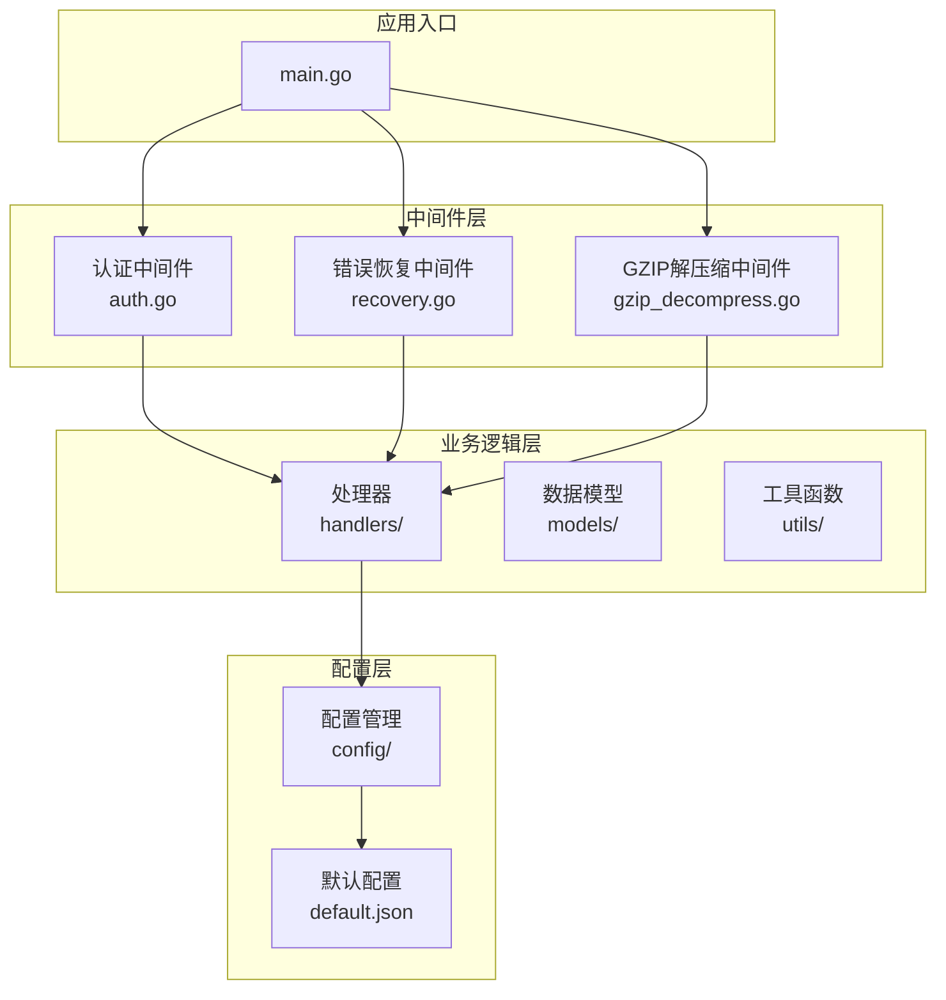
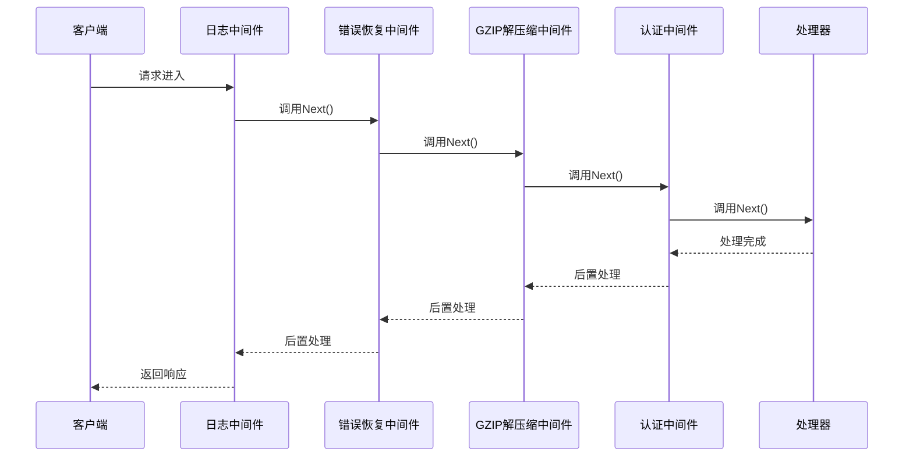
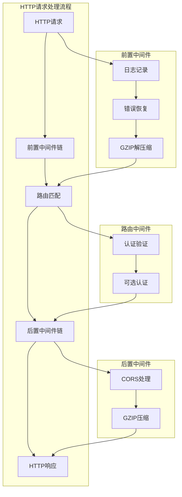
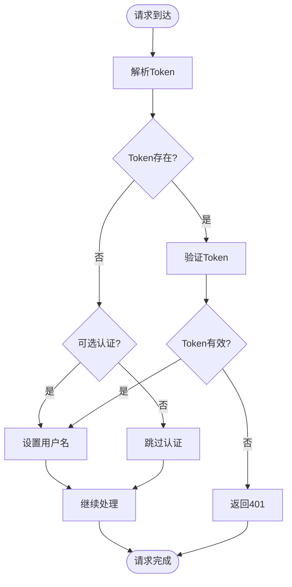
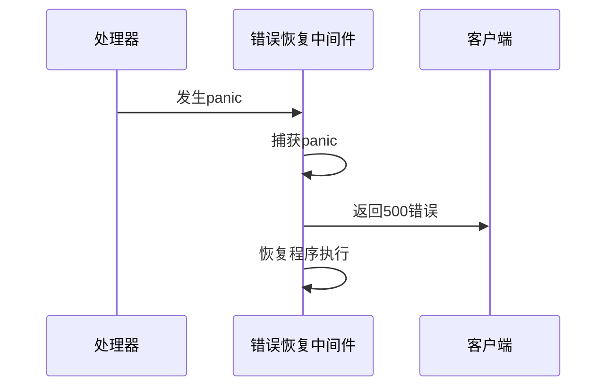
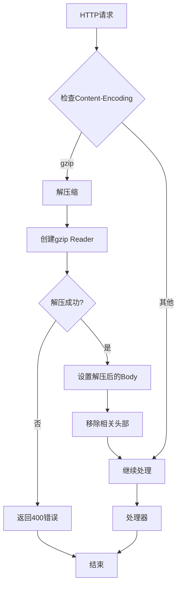
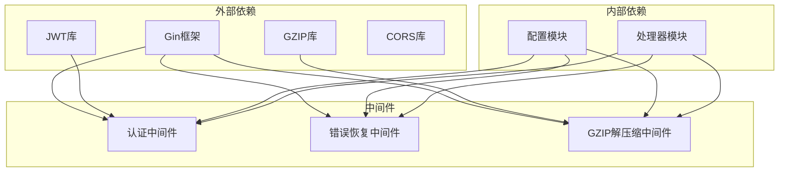

# 中间件开发

<cite>
**本文档引用的文件**
- [main.go](file://backend/main.go)
- [auth.go](file://backend/middleware/auth.go)
- [recovery.go](file://backend/middleware/recovery.go)
- [gzip_decompress.go](file://backend/middleware/gzip_decompress.go)
- [auth_test.go](file://backend/middleware/auth_test.go)
- [config.go](file://backend/config/config.go)
- [default.json](file://backend/config/default.json)
- [auth.go](file://backend/handlers/auth.go)
- [data.go](file://backend/handlers/data.go)
- [transfer.go](file://backend/handlers/transfer.go)
</cite>

## 目录
1. [简介](#简介)
2. [项目结构](#项目结构)
3. [核心组件](#核心组件)
4. [架构概览](#架构概览)
5. [详细组件分析](#详细组件分析)
6. [依赖分析](#依赖分析)
7. [性能考虑](#性能考虑)
8. [故障排除指南](#故障排除指南)
9. [结论](#结论)
10. [附录](#附录)

## 简介

OFlatNas 是一个基于 Gin 框架构建的现代化 Web 应用程序，专注于提供丰富的桌面和移动设备体验。本项目特别注重中间件开发的最佳实践，包括认证中间件、错误恢复中间件和 GZIP 解压缩中间件的实现。

本文档深入解释了 Gin 中间件链的工作原理和执行顺序，详细说明了各个中间件的实现细节，并提供了完整的开发规范、参数传递和上下文管理方法。同时包含了自定义中间件创建指南、错误处理策略和性能优化技巧。

## 项目结构

OFlatNas 采用模块化架构设计，中间件相关代码主要位于 `backend/middleware` 目录下：



**图表来源**
- [main.go:34-43](file://backend/main.go#L34-L43)
- [auth.go:33-47](file://backend/middleware/auth.go#L33-L47)
- [recovery.go:9-15](file://backend/middleware/recovery.go#L9-L15)
- [gzip_decompress.go:12-37](file://backend/middleware/gzip_decompress.go#L12-L37)

**章节来源**
- [main.go:1-267](file://backend/main.go#L1-L267)

## 核心组件

### Gin 中间件链工作原理

Gin 框架采用中间件链模式，请求按注册顺序依次经过每个中间件，然后到达最终的处理器。中间件可以执行以下操作：

1. **前置处理**：在请求到达处理器之前执行
2. **调用 Next()**：继续执行下一个中间件或处理器
3. **后置处理**：在处理器返回后执行
4. **中断处理**：使用 Abort() 或 AbortWithStatus() 终止请求链

### 中间件执行顺序

根据主程序中的注册顺序，中间件链的执行顺序如下：



**图表来源**
- [main.go:34-43](file://backend/main.go#L34-L43)

**章节来源**
- [main.go:34-43](file://backend/main.go#L34-L43)

## 架构概览

OFlatNas 的中间件架构采用了分层设计，确保了功能的模块化和可维护性：



**图表来源**
- [main.go:34-77](file://backend/main.go#L34-L77)
- [auth.go:33-60](file://backend/middleware/auth.go#L33-L60)

**章节来源**
- [main.go:34-77](file://backend/main.go#L34-L77)

## 详细组件分析

### 认证中间件

认证中间件是系统安全的核心组件，负责验证用户身份并设置用户信息到上下文中。

#### 实现架构

```mermaid
classDiagram
class AuthMiddleware {
+parseToken(c *gin.Context) (*jwt.Token, error)
+AuthMiddleware() gin.HandlerFunc
+OptionalAuthMiddleware() gin.HandlerFunc
}
class JWTToken {
+Claims jwt.MapClaims
+Valid bool
+Parse(tokenString string, keyFunc jwt.Keyfunc) (*Token, error)
}
class Context {
+username string
+Get(key string) interface{}
+Set(key string, value interface{})
+Next()
}
AuthMiddleware --> JWTToken : 使用
AuthMiddleware --> Context : 操作
```

**图表来源**
- [auth.go:12-60](file://backend/middleware/auth.go#L12-L60)

#### 认证流程



**图表来源**
- [auth.go:33-60](file://backend/middleware/auth.go#L33-L60)

#### 关键特性

1. **多源Token支持**：支持从 Authorization 头部和查询参数获取 Token
2. **可选认证**：提供强制认证和可选认证两种模式
3. **上下文集成**：将用户名存储在 Gin 上下文中供后续处理器使用
4. **安全验证**：仅接受 HS256 签名算法的 Token

**章节来源**
- [auth.go:12-60](file://backend/middleware/auth.go#L12-L60)

### 错误恢复中间件

错误恢复中间件确保应用程序在发生异常时能够优雅地处理错误并返回适当的响应。

#### 实现模式



**图表来源**
- [recovery.go:9-15](file://backend/middleware/recovery.go#L9-L15)

#### 错误处理策略

1. **全局异常捕获**：使用 `gin.CustomRecovery` 捕获所有未处理的异常
2. **统一错误格式**：返回标准化的 JSON 错误响应
3. **状态码设置**：始终返回 500 Internal Server Error
4. **程序恢复**：捕获异常后恢复程序正常执行

**章节来源**
- [recovery.go:9-15](file://backend/middleware/recovery.go#L9-L15)

### GZIP 解压缩中间件

GZIP 解压缩中间件处理客户端发送的压缩请求体，确保后续处理器能够正常处理原始数据。

#### 数据流处理



**图表来源**
- [gzip_decompress.go:12-37](file://backend/middleware/gzip_decompress.go#L12-L37)

#### 关键配置

1. **最大解压大小**：限制解压后的数据大小为 100MB
2. **头部处理**：自动移除 Content-Encoding 和 Content-Length 头部
3. **错误处理**：解压失败时返回 400 Bad Request
4. **内存保护**：使用 `http.MaxBytesReader` 防止内存溢出

**章节来源**
- [gzip_decompress.go:12-37](file://backend/middleware/gzip_decompress.go#L12-L37)

## 依赖分析

### 中间件依赖关系



**图表来源**
- [auth.go:3-10](file://backend/middleware/auth.go#L3-L10)
- [recovery.go:3-7](file://backend/middleware/recovery.go#L3-L7)
- [gzip_decompress.go:3-9](file://backend/middleware/gzip_decompress.go#L3-L9)

### 配置依赖

中间件与配置系统的集成确保了灵活的安全策略和运行时行为：

| 配置项 | 类型 | 默认值 | 描述 |
|--------|------|--------|------|
| SecretKey | 字节数组 | 自动生成 | JWT 签名密钥 |
| BASE_DIR | 字符串 | 自动检测 | 基础目录路径 |
| CORS_ALLOW_ORIGINS | 字符串 | 空 | 允许的跨域来源 |

**章节来源**
- [config.go:18-33](file://backend/config/config.go#L18-L33)
- [config.go:182-208](file://backend/config/config.go#L182-L208)

## 性能考虑

### 中间件性能优化

1. **执行顺序优化**：将最常用的中间件放在前面，减少不必要的处理
2. **内存管理**：及时释放中间件中创建的大对象
3. **缓存策略**：对重复计算的结果进行缓存
4. **异步处理**：对于耗时操作考虑异步处理

### 性能监控指标

| 指标类型 | 监控点 | 目标值 |
|----------|--------|--------|
| 响应时间 | 整个请求处理链路 | < 500ms |
| 内存使用 | 单个请求处理峰值 | < 10MB |
| CPU 使用率 | 并发请求处理 | < 80% |
| 错误率 | 5xx 错误比例 | < 1% |

## 故障排除指南

### 常见问题诊断

#### 认证失败问题

**症状**：用户无法登录或访问受保护资源

**诊断步骤**：
1. 检查 Token 生成和验证过程
2. 验证 SecretKey 配置正确性
3. 确认 Token 签名算法兼容性

**解决方案**：
- 确保使用 HS256 算法签名
- 验证 Token 未过期
- 检查用户权限配置

#### GZIP 解压错误

**症状**：上传文件时出现解压错误

**诊断步骤**：
1. 检查客户端发送的 Content-Encoding 头部
2. 验证压缩数据的完整性
3. 确认中间件正确处理了头部信息

**解决方案**：
- 确保客户端正确设置 Content-Encoding
- 检查压缩数据格式
- 调整最大解压大小限制

#### 错误恢复失效

**症状**：应用程序崩溃且没有适当的错误响应

**诊断步骤**：
1. 检查 Recovery 中间件是否正确注册
2. 验证 panic 捕获机制
3. 确认错误日志记录

**解决方案**：
- 确保 Recovery 中间件在中间件链中的正确位置
- 检查自定义恢复函数的实现
- 验证错误日志配置

**章节来源**
- [auth_test.go:12-61](file://backend/middleware/auth_test.go#L12-L61)

## 结论

OFlatNas 的中间件系统展现了现代 Web 应用程序的最佳实践。通过精心设计的中间件链，系统实现了：

1. **安全性**：通过认证中间件确保只有授权用户才能访问受保护资源
2. **可靠性**：通过错误恢复中间件提供健壮的异常处理机制
3. **效率**：通过 GZIP 解压缩中间件优化网络传输性能
4. **可维护性**：通过模块化的中间件设计便于扩展和维护

这些中间件不仅满足了当前的功能需求，还为未来的功能扩展奠定了坚实的基础。通过遵循本文档提供的开发规范和最佳实践，开发者可以创建更多高质量的中间件来增强应用程序的功能。

## 附录

### 开发规范

#### 中间件开发标准

1. **命名规范**：使用 `Middleware` 后缀命名中间件函数
2. **错误处理**：始终处理可能的错误情况并返回适当的 HTTP 状态码
3. **日志记录**：在关键节点添加详细的日志记录
4. **性能考虑**：避免在中间件中执行耗时操作
5. **线程安全**：确保中间件在并发环境下正常工作

#### 参数传递和上下文管理

1. **上下文使用**：使用 `c.Set()` 和 `c.Get()` 在中间件间传递数据
2. **错误传播**：通过 `c.AbortWithStatusJSON()` 传播错误信息
3. **状态码设置**：根据业务逻辑设置合适的 HTTP 状态码
4. **响应头管理**：合理设置和修改响应头信息

#### 自定义中间件创建指南

1. **需求分析**：明确中间件需要解决的具体问题
2. **接口设计**：设计清晰的中间件接口和参数
3. **实现开发**：按照 Gin 中间件的标准模式实现
4. **测试验证**：编写全面的单元测试和集成测试
5. **文档编写**：提供详细的使用说明和配置指南

#### 测试方法和调试技巧

1. **单元测试**：为每个中间件编写独立的单元测试
2. **集成测试**：测试中间件链的整体行为
3. **性能测试**：评估中间件对系统性能的影响
4. **调试工具**：使用 Gin 提供的调试工具和日志功能
5. **监控指标**：建立中间件性能和错误率的监控体系