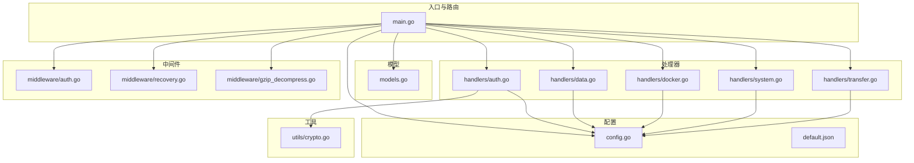
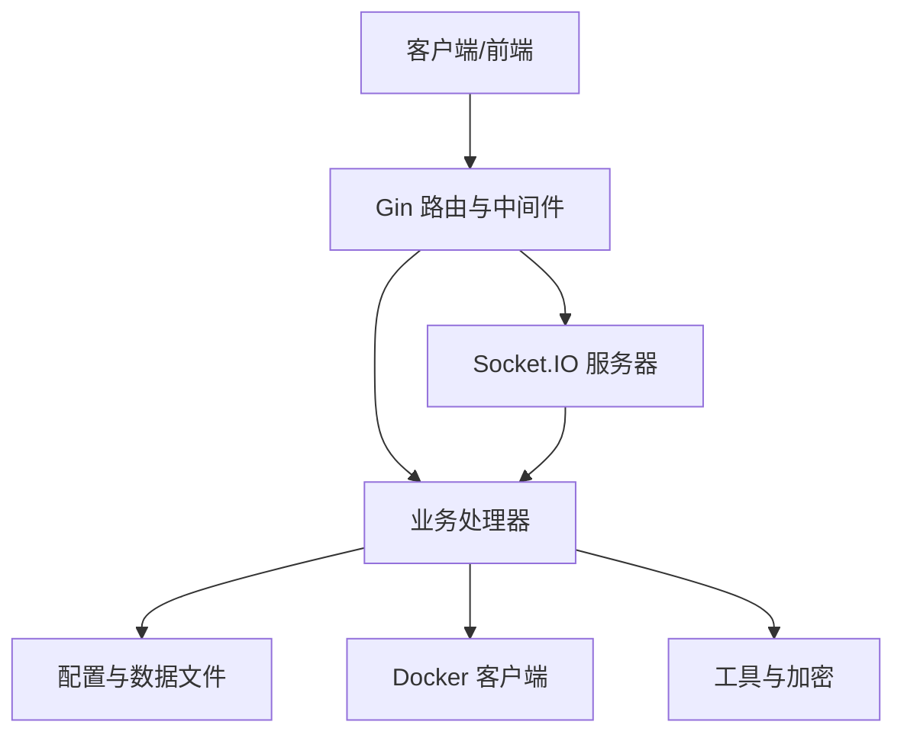
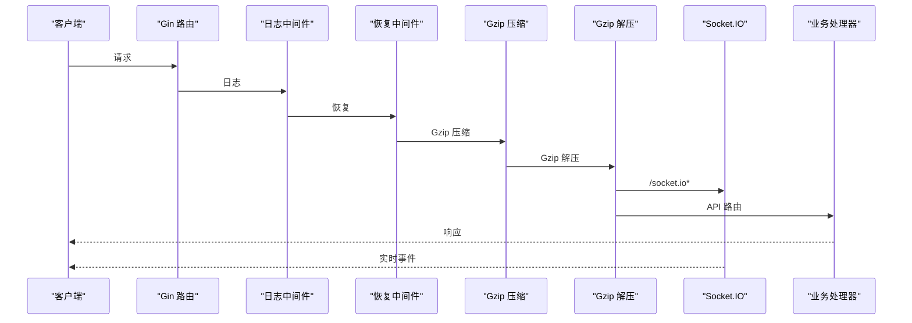
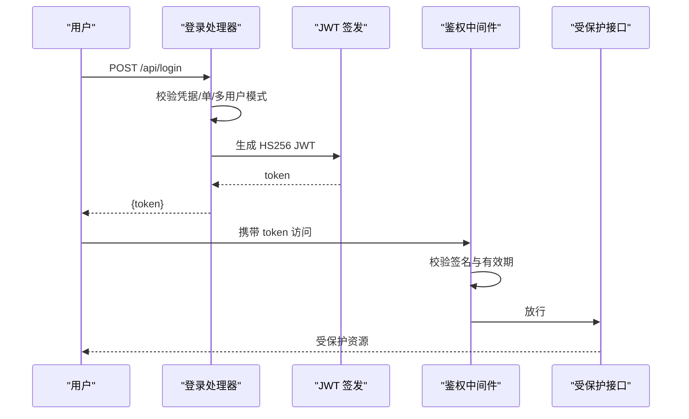
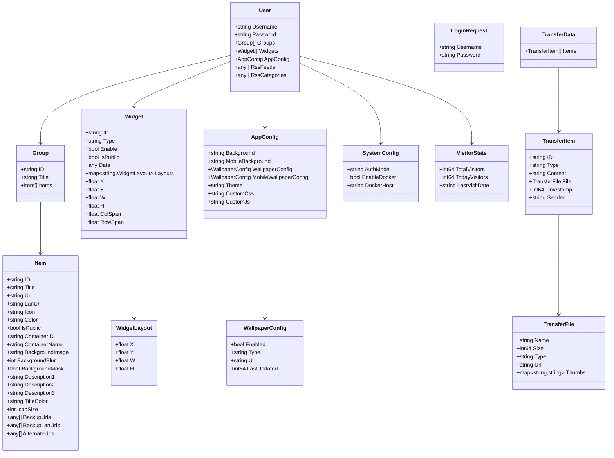
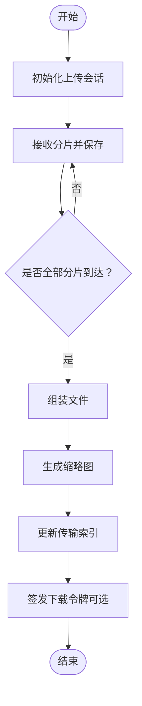
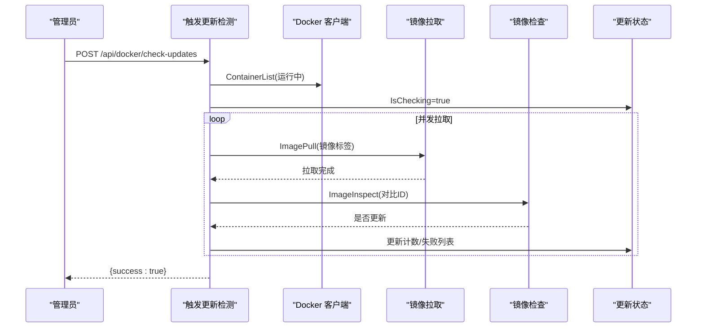
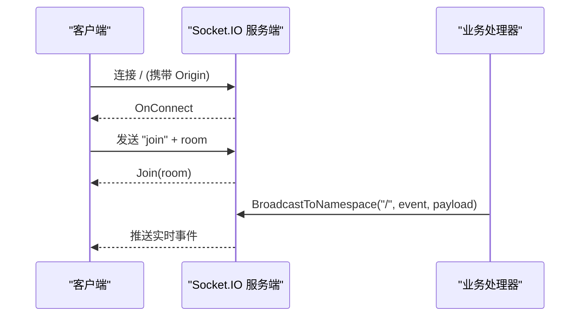
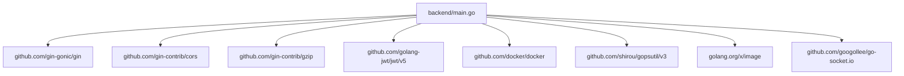

# 后端开发

<cite>
**本文引用的文件**
- [main.go](file://backend/main.go)
- [go.mod](file://backend/go.mod)
- [config.go](file://backend/config/config.go)
- [default.json](file://backend/config/default.json)
- [models.go](file://backend/models/models.go)
- [auth.go](file://backend/handlers/auth.go)
- [data.go](file://backend/handlers/data.go)
- [docker.go](file://backend/handlers/docker.go)
- [system.go](file://backend/handlers/system.go)
- [transfer.go](file://backend/handlers/transfer.go)
- [auth.go](file://backend/middleware/auth.go)
- [recovery.go](file://backend/middleware/recovery.go)
- [gzip_decompress.go](file://backend/middleware/gzip_decompress.go)
- [start_backend.ps1](file://backend/start_backend.ps1)
</cite>

## 目录
1. [简介](#简介)
2. [项目结构](#项目结构)
3. [核心组件](#核心组件)
4. [架构总览](#架构总览)
5. [详细组件分析](#详细组件分析)
6. [依赖分析](#依赖分析)
7. [性能考虑](#性能考虑)
8. [故障排查指南](#故障排查指南)
9. [结论](#结论)
10. [附录](#附录)

## 简介
本指南面向 OFlatNas 后端开发，基于 Go 语言与 Gin 框架构建。内容涵盖路由设计、中间件开发、API 设计与 REST 规范、数据模型、认证授权与 JWT、数据库与文件持久化、配置管理、错误处理与日志、性能监控、WebSocket/Socket.IO 实时通信、消息广播、API 测试策略、安全编码实践以及 Docker 集成与外部服务调用等。

## 项目结构
后端采用模块化分层组织：
- 入口与路由：backend/main.go
- 配置管理：backend/config
- 数据模型：backend/models
- 处理器（Handlers）：backend/handlers
- 中间件（Middleware）：backend/middleware
- 工具与加密：backend/utils
- 开发启动脚本：backend/start_backend.ps1

**图表来源**
- [main.go:1-267](file://backend/main.go#L1-L267)
- [config.go:1-257](file://backend/config/config.go#L1-L257)
- [models.go:1-118](file://backend/models/models.go#L1-L118)
- [auth.go:1-211](file://backend/handlers/auth.go#L1-L211)
- [data.go:1-800](file://backend/handlers/data.go#L1-L800)
- [docker.go:1-789](file://backend/handlers/docker.go#L1-L789)
- [system.go:1-629](file://backend/handlers/system.go#L1-L629)
- [transfer.go:1-968](file://backend/handlers/transfer.go#L1-L968)
- [auth.go:1-61](file://backend/middleware/auth.go#L1-L61)
- [recovery.go:1-16](file://backend/middleware/recovery.go#L1-L16)
- [gzip_decompress.go:1-38](file://backend/middleware/gzip_decompress.go#L1-L38)
- [crypto.go:1-16](file://backend/utils/crypto.go#L1-L16)

**章节来源**
- [main.go:1-267](file://backend/main.go#L1-L267)
- [go.mod:1-83](file://backend/go.mod#L1-L83)

## 核心组件
- 路由与中间件：统一注册 CORS、Gzip、日志、恢复、Gzip 解压、静态资源与 SPA 回退。
- 认证与授权：JWT 中间件、登录与用户管理、可选认证中间件。
- 数据与配置：用户数据、系统配置、默认模板、密钥管理。
- 文件与传输：上传分片、缩略图生成、下载令牌、访客统计。
- Docker 集成：容器列表、状态采集、更新检测、日志导出。
- 系统信息：CPU/内存/磁盘/网络、公网 IP、延迟测试、音乐列表。
- 实时通信：Socket.IO 服务端、房间加入、命名空间广播。

**章节来源**
- [main.go:34-266](file://backend/main.go#L34-L266)
- [auth.go:18-114](file://backend/handlers/auth.go#L18-L114)
- [auth.go:12-60](file://backend/middleware/auth.go#L12-L60)
- [config.go:35-204](file://backend/config/config.go#L35-L204)
- [data.go:159-322](file://backend/handlers/data.go#L159-L322)
- [transfer.go:331-580](file://backend/handlers/transfer.go#L331-L580)
- [docker.go:42-789](file://backend/handlers/docker.go#L42-L789)
- [system.go:51-203](file://backend/handlers/system.go#L51-L203)

## 架构总览
后端以 Gin 为核心，结合中间件实现统一处理；通过 Socket.IO 提供实时通信；通过 Docker 客户端访问宿主 Docker；配置与数据持久化于本地文件系统；JWT 实现鉴权与会话。

**图表来源**
- [main.go:34-115](file://backend/main.go#L34-L115)
- [docker.go:158-167](file://backend/handlers/docker.go#L158-L167)
- [system.go:51-203](file://backend/handlers/system.go#L51-L203)

## 详细组件分析

### 路由与中间件
- 统一中间件链：日志、恢复、Gzip 压缩、Gzip 请求体解压。
- CORS：支持动态允许来源、凭证、跨域头。
- 静态资源与 SPA 回退：优先返回前端产物，未命中则回退到 index.html。
- Socket.IO：在 /socket.io 路径下接入，支持房间 join 与命名空间广播。

**图表来源**
- [main.go:34-115](file://backend/main.go#L34-L115)
- [gzip_decompress.go:11-37](file://backend/middleware/gzip_decompress.go#L11-L37)
- [recovery.go:9-15](file://backend/middleware/recovery.go#L9-L15)

**章节来源**
- [main.go:34-166](file://backend/main.go#L34-L166)
- [gzip_decompress.go:1-38](file://backend/middleware/gzip_decompress.go#L1-L38)
- [recovery.go:1-16](file://backend/middleware/recovery.go#L1-L16)

### 认证与授权（JWT）
- 登录：校验用户名/密码，单/多用户模式，bcrypt 密码哈希，签发 HS256 JWT。
- 中间件：Authorization 头或查询参数 token，支持可选认证。
- 用户管理：仅管理员可列出/添加/删除用户。

**图表来源**
- [auth.go:18-114](file://backend/handlers/auth.go#L18-L114)
- [auth.go:12-47](file://backend/middleware/auth.go#L12-L47)

**章节来源**
- [auth.go:18-114](file://backend/handlers/auth.go#L18-L114)
- [auth.go:12-60](file://backend/middleware/auth.go#L12-L60)
- [crypto.go:7-15](file://backend/utils/crypto.go#L7-L15)

### 数据模型与持久化
- 用户、分组、条目、小部件、应用配置、系统配置、访客统计、传输项等模型。
- 数据持久化：用户数据与系统配置写入 JSON 文件；默认模板与密钥文件初始化；memo 小部件独立 JSON 文件。

**图表来源**
- [models.go:1-118](file://backend/models/models.go#L1-L118)

**章节来源**
- [models.go:1-118](file://backend/models/models.go#L1-L118)
- [data.go:458-503](file://backend/handlers/data.go#L458-L503)
- [config.go:102-180](file://backend/config/config.go#L102-L180)

### API 设计与 REST 规范
- 分组路由：/api 与 /api/*，受中间件保护。
- 受保护路由：/api/admin/* 与 /api/*（需认证）。
- 资源命名：名词复数形式，动词动作作为路径后缀（如 /save、/reset、/export-logs）。
- 状态码：遵循 REST 语义，成功 2xx，错误 4xx/5xx。
- 错误响应：统一返回 {error: "..."} 或 {success: false, error: "..."}。

**章节来源**
- [main.go:165-254](file://backend/main.go#L165-L254)
- [data.go:638-744](file://backend/handlers/data.go#L638-L744)
- [docker.go:423-436](file://backend/handlers/docker.go#L423-L436)

### 配置管理
- 初始化：根据 BASE_DIR 推断根目录，确保 server/data、server/doc、music、PC、APP、icon-cache、public、config_versions 等目录存在。
- 系统配置：system.json 默认值与迁移；authMode、enableDocker 等字段。
- 默认模板：default.json 注入首次运行数据。
- 密钥：secret.key 自动生成与读取，用于 JWT 签名。

**章节来源**
- [config.go:35-204](file://backend/config/config.go#L35-L204)
- [default.json:1-147](file://backend/config/default.json#L1-L147)

### 文件与传输（分片上传、缩略图、下载令牌）
- 上传分片：初始化会话、按索引保存分片、组装完成。
- 缩略图：按 64/128/256 生成 JPEG 缩略图并回填索引。
- 下载令牌：JWT 限时限权访问私有文件。
- 访客统计：访客总数/当日计数与日期。

**图表来源**
- [transfer.go:331-580](file://backend/handlers/transfer.go#L331-L580)

**章节来源**
- [transfer.go:331-794](file://backend/handlers/transfer.go#L331-L794)

### Docker 集成与异步任务
- 客户端初始化：自动解析 DOCKER_HOST，兼容不同平台。
- 列表与状态：容器列表、运行中容器并发采集统计、缓存 TTL。
- 更新检测：并发拉取镜像并比对 ID，记录更新结果与失败。
- 日志导出：生成包含 Docker 状态、更新状态与容器 ID 的 JSON。

**图表来源**
- [docker.go:664-759](file://backend/handlers/docker.go#L664-L759)

**章节来源**
- [docker.go:42-789](file://backend/handlers/docker.go#L42-L789)

### 系统信息与网络
- 系统指标：CPU/内存/磁盘/网络 IO，按接口计算速率。
- 公网 IP：定时缓存并支持刷新。
- 延迟测试：ping 目标地址并解析往返时间。
- 音乐列表：扫描目录返回媒体文件相对路径。

**章节来源**
- [system.go:51-203](file://backend/handlers/system.go#L51-L203)
- [system.go:288-465](file://backend/handlers/system.go#L288-L465)
- [system.go:534-592](file://backend/handlers/system.go#L534-L592)
- [system.go:594-628](file://backend/handlers/system.go#L594-L628)

### 实时通信（Socket.IO）
- 服务端：启用 polling/websocket，CheckOrigin 基于 CORS 配置。
- 房间：客户端发送 join(room) 加入房间。
- 广播：命名空间 / 上线事件与数据变更事件广播。

**图表来源**
- [main.go:79-111](file://backend/main.go#L79-L111)
- [data.go:736-741](file://backend/handlers/data.go#L736-L741)

**章节来源**
- [main.go:79-111](file://backend/main.go#L79-L111)
- [data.go:626-631](file://backend/handlers/data.go#L626-L631)

## 依赖分析
- Gin 生态：gin、cors、gzip。
- JWT：golang-jwt/jwt/v5。
- Docker 客户端：github.com/docker/docker。
- 系统信息：github.com/shirou/gopsutil/v3。
- 图像处理：golang.org/x/image。
- WebSocket：github.com/googollee/go-socket.io。

**图表来源**
- [go.mod:5-17](file://backend/go.mod#L5-L17)

**章节来源**
- [go.mod:1-83](file://backend/go.mod#L1-L83)

## 性能考虑
- 缓存：GetData 增加文件修改时间缓存；Docker 统计缓存与 TTL 控制；memo 保存幂等缓存。
- 并发：Docker 统计并发抓取与信号量控制；传输缩略图生成并发处理。
- 压缩：Gzip 压缩响应体；Gzip 请求体解压中间件。
- I/O：分片上传避免大包内存压力；缩略图生成后写入磁盘并回填索引。
- 监控：慢请求日志阈值（SaveData 超过 5 秒告警）。

**章节来源**
- [data.go:22-34](file://backend/handlers/data.go#L22-L34)
- [docker.go:292-352](file://backend/handlers/docker.go#L292-L352)
- [transfer.go:140-192](file://backend/handlers/transfer.go#L140-L192)
- [main.go:42-46](file://backend/main.go#L42-L46)
- [data.go:728-735](file://backend/handlers/data.go#L728-L735)

## 故障排查指南
- 认证失败：检查 Authorization 头或 token 查询参数；确认签名算法与密钥一致。
- 文件访问：检查 /api/transfer/file 与 /api/transfer/thumb 的访问权限与 token。
- Docker 不可用：查看 /api/docker-status 与 /api/docker/debug；核对 DOCKER_HOST 与权限。
- 上传失败：检查分片索引合法性、会话文件权限、磁盘配额。
- 日志：开启 Gin 日志与自定义恢复中间件，定位 500 错误。

**章节来源**
- [auth.go:12-47](file://backend/middleware/auth.go#L12-L47)
- [transfer.go:96-114](file://backend/handlers/transfer.go#L96-L114)
- [docker.go:423-436](file://backend/handlers/docker.go#L423-L436)
- [docker.go:572-575](file://backend/handlers/docker.go#L572-L575)
- [recovery.go:9-15](file://backend/middleware/recovery.go#L9-L15)

## 结论
本后端以 Gin 为基础，结合中间件、Socket.IO、Docker 客户端与文件系统，提供了完整的认证授权、数据持久化、实时通信与系统集成能力。通过缓存、并发与压缩等手段优化性能，并提供完善的错误处理与日志监控。建议在生产环境进一步完善安全审计、限流与可观测性建设。

## 附录
- 开发启动：使用 air 实现实时热更新，便于快速迭代。
- 部署：结合 Dockerfile 与 docker-compose 使用，注意环境变量与卷挂载。

**章节来源**
- [start_backend.ps1:1-5](file://backend/start_backend.ps1#L1-L5)