# 实时通信

<cite>
**本文档引用的文件**
- [main.go](file://backend/main.go)
- [hot.go](file://backend/handlers/hot.go)
- [weather.go](file://backend/handlers/weather.go)
- [rss.go](file://backend/handlers/rss.go)
- [memo.go](file://backend/handlers/memo.go)
- [data.go](file://backend/handlers/data.go)
- [widget_cache.go](file://backend/handlers/widget_cache.go)
- [main.ts](file://frontend/src/stores/main.ts)
- [MemoWidget.vue](file://frontend/src/components/MemoWidget.vue)
- [HotWidget.vue](file://frontend/src/components/HotWidget.vue)
- [RssWidget.vue](file://frontend/src/components/RssWidget.vue)
</cite>

## 目录
1. [简介](#简介)
2. [项目结构](#项目结构)
3. [核心组件](#核心组件)
4. [架构总览](#架构总览)
5. [详细组件分析](#详细组件分析)
6. [依赖关系分析](#依赖关系分析)
7. [性能考虑](#性能考虑)
8. [故障排除指南](#故障排除指南)
9. [结论](#结论)

## 简介
本指南面向 OFlatNas 的实时通信系统，围绕 Socket.IO 集成、连接管理与事件处理机制展开，涵盖 WebSocket 服务器配置、房间管理与消息广播实现，并深入讲解热搜更新、天气数据推送与 RSS 订阅通知等实时事件的处理流程。同时提供客户端连接建立、心跳检测与断线重连机制说明，解释消息序列化、事件命名规范与数据格式约定，并给出调试方法、性能优化策略与故障排除建议。

## 项目结构
- 后端使用 Gin 作为 HTTP 框架，集成 Socket.IO 作为实时通信层，统一通过 /socket.io/*any 路由转发至 Socket.IO 服务器。
- 前端使用 socket.io-client 连接后端，内置心跳检测与断线重连逻辑，部分组件支持基于 Socket.IO 的实时同步。

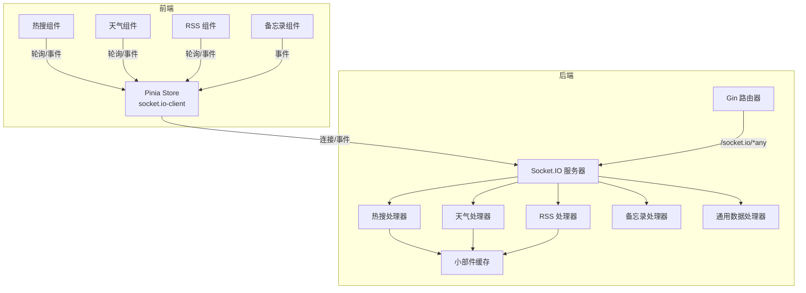

**图表来源**
- [main.go:79-115](file://backend/main.go#L79-L115)
- [hot.go:31-79](file://backend/handlers/hot.go#L31-L79)
- [weather.go:114-146](file://backend/handlers/weather.go#L114-L146)
- [rss.go:82-135](file://backend/handlers/rss.go#L82-L135)
- [memo.go:25-39](file://backend/handlers/memo.go#L25-L39)
- [data.go:155-157](file://backend/handlers/data.go#L155-L157)

**章节来源**
- [main.go:79-115](file://backend/main.go#L79-L115)
- [main.ts:30-96](file://frontend/src/stores/main.ts#L30-L96)

## 核心组件
- Socket.IO 服务器与路由
  - 后端在 /socket.io/*any 上注册 Socket.IO 处理器，启用轮询与 WebSocket 两种传输方式，并通过 CORS 允许来源校验。
  - 提供连接回调、断开回调与 join 房间事件，绑定各类业务处理器。
- 事件处理器
  - 热搜：hot:fetch 触发后端抓取并缓存，必要时广播 hot:data 或 hot:error。
  - 天气：weather:fetch 触发后端抓取并缓存，必要时广播 weather:data 或 weather:error。
  - RSS：rss:fetch 触发后端抓取并缓存，必要时广播 rss:data 或 rss:error。
  - 备忘录：memo:update 接收内容变更，验证令牌后广播 memo:updated。
  - 网络：network:heartbeat 与 network:mode 用于心跳检测与网络模式广播。
- 小部件缓存
  - 统一缓存热搜、天气、RSS 数据，支持 TTL、并发刷新控制与持久化。

**章节来源**
- [main.go:79-115](file://backend/main.go#L79-L115)
- [hot.go:31-79](file://backend/handlers/hot.go#L31-L79)
- [weather.go:114-146](file://backend/handlers/weather.go#L114-L146)
- [rss.go:82-135](file://backend/handlers/rss.go#L82-L135)
- [memo.go:25-39](file://backend/handlers/memo.go#L25-L39)
- [widget_cache.go:13-44](file://backend/handlers/widget_cache.go#L13-L44)

## 架构总览
以下序列图展示典型实时事件流：前端发起事件 → 后端处理与缓存 → 必要时广播给所有连接。

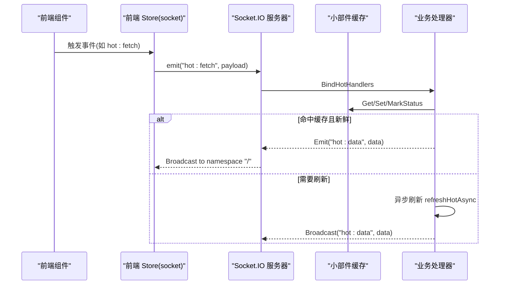

**图表来源**
- [hot.go:31-79](file://backend/handlers/hot.go#L31-L79)
- [widget_cache.go:80-123](file://backend/handlers/widget_cache.go#L80-L123)

## 详细组件分析

### Socket.IO 集成与连接管理
- 传输与跨域
  - 同时启用轮询与 WebSocket 传输，CheckOrigin 基于 CORS 允许列表动态判断。
  - 支持自定义 CORS 配置，允许凭据与指定头部。
- 连接生命周期
  - OnConnect 设置上下文为空，便于后续扩展。
  - OnDisconnect 留空，可按需记录断开原因。
  - 提供 join 事件用于房间管理（当前未使用房间功能，保留以备扩展）。
- 事件绑定
  - 绑定热搜、天气、RSS、备忘录、网络等处理器，并设置 Socket 服务器指针供其他模块使用。

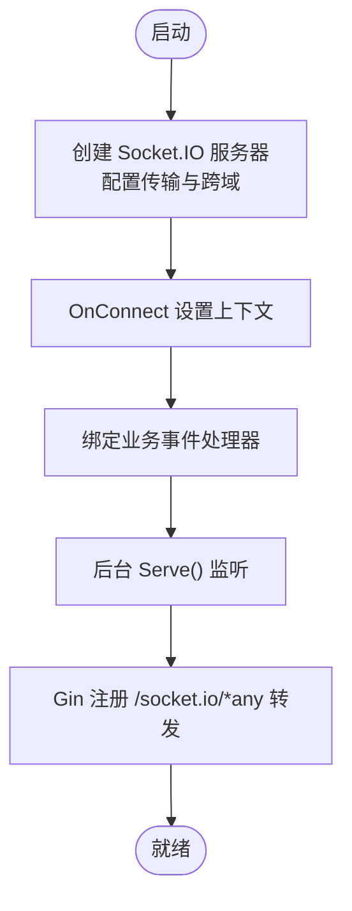

**图表来源**
- [main.go:79-115](file://backend/main.go#L79-L115)

**章节来源**
- [main.go:79-115](file://backend/main.go#L79-L115)

### 热搜实时更新
- 事件与数据流
  - 前端触发 hot:fetch，携带 type 与 force 参数。
  - 后端根据类型构建缓存键，命中则直接返回；否则抓取并缓存，必要时广播 hot:data。
  - 错误时返回 hot:error。
- 并发与刷新
  - 使用 StartRefresh/EndRefresh 控制同一类型并发刷新，避免重复抓取。
  - 异步刷新 refreshHotAsync 完成后广播最新数据。

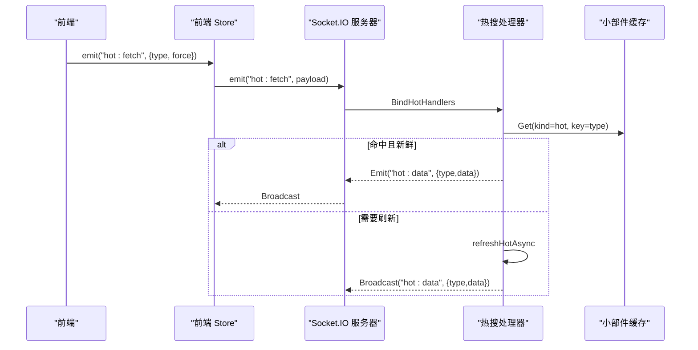

**图表来源**
- [hot.go:31-79](file://backend/handlers/hot.go#L31-L79)
- [hot.go:107-121](file://backend/handlers/hot.go#L107-L121)
- [widget_cache.go:80-123](file://backend/handlers/widget_cache.go#L80-L123)

**章节来源**
- [hot.go:31-79](file://backend/handlers/hot.go#L31-L79)
- [hot.go:107-121](file://backend/handlers/hot.go#L107-L121)

### 天气数据推送
- 事件与数据流
  - 前端触发 weather:fetch，携带城市与来源信息。
  - 后端标准化参数，构建缓存键，命中则返回；否则抓取 OpenMeteo/Amap 并缓存，必要时广播 weather:data。
  - 错误时返回 weather:error。
- 刷新策略
  - refreshWeatherAsync 在后台刷新并广播最新数据。

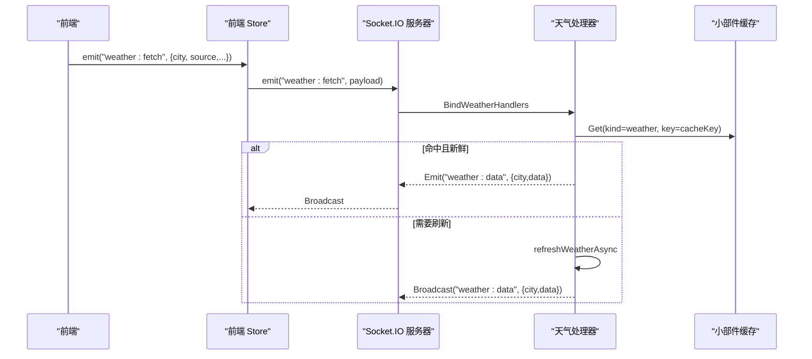

**图表来源**
- [weather.go:114-146](file://backend/handlers/weather.go#L114-L146)
- [weather.go:367-380](file://backend/handlers/weather.go#L367-L380)
- [widget_cache.go:80-123](file://backend/handlers/widget_cache.go#L80-L123)

**章节来源**
- [weather.go:114-146](file://backend/handlers/weather.go#L114-L146)
- [weather.go:367-380](file://backend/handlers/weather.go#L367-L380)

### RSS 订阅通知
- 事件与数据流
  - 前端触发 rss:fetch，携带订阅地址。
  - 后端解析并缓存，命中则返回；否则抓取 RSS/Atom 并缓存，必要时广播 rss:data。
  - 错误时返回 rss:error。
- 刷新策略
  - refreshRssAsync 在后台刷新并广播最新条目。

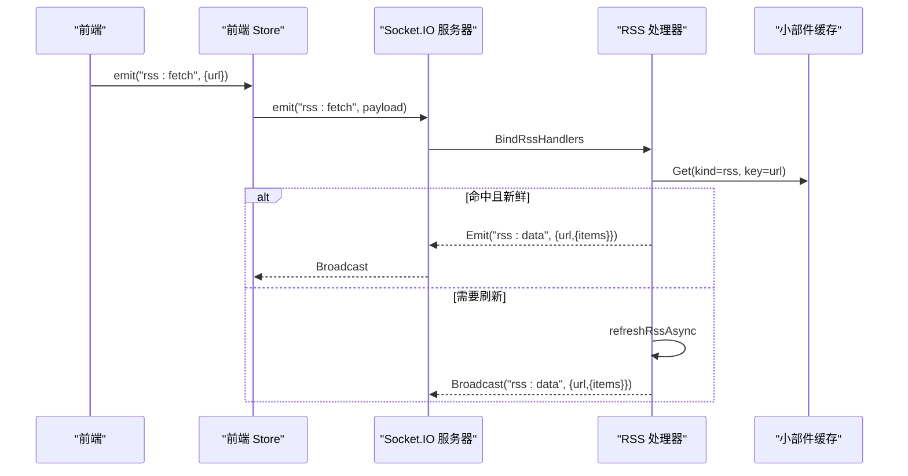

**图表来源**
- [rss.go:82-135](file://backend/handlers/rss.go#L82-L135)
- [rss.go:161-182](file://backend/handlers/rss.go#L161-L182)
- [widget_cache.go:80-123](file://backend/handlers/widget_cache.go#L80-L123)

**章节来源**
- [rss.go:82-135](file://backend/handlers/rss.go#L82-L135)
- [rss.go:161-182](file://backend/handlers/rss.go#L161-L182)

### 备忘录实时同步
- 事件与数据流
  - 前端触发 memo:update，携带 token、widgetId 与 content。
  - 后端校验令牌，校验通过后广播 memo:updated，通知所有连接更新对应 widget 的内容。
- 广播与一致性
  - 广播使用命名空间 "/"，确保全站可见。

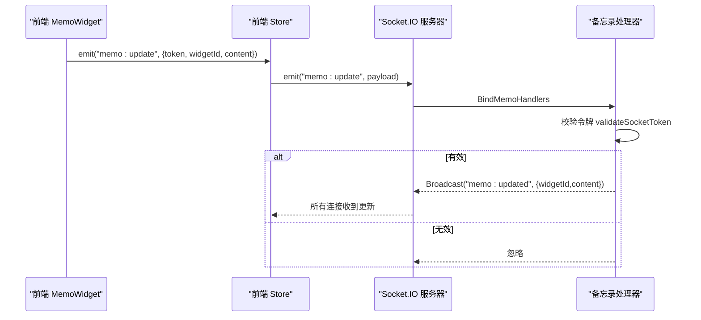

**图表来源**
- [memo.go:25-39](file://backend/handlers/memo.go#L25-L39)
- [memo.go:66-96](file://backend/handlers/memo.go#L66-L96)

**章节来源**
- [memo.go:25-39](file://backend/handlers/memo.go#L25-L39)
- [memo.go:66-96](file://backend/handlers/memo.go#L66-L96)

### 网络心跳与模式广播
- 心跳
  - 前端定时发送 network:heartbeat，后端校验令牌后回显 ts。
- 模式广播
  - 前端发送 network:mode，后端校验令牌与模式合法性后，广播 network:mode，包含用户名与模式。

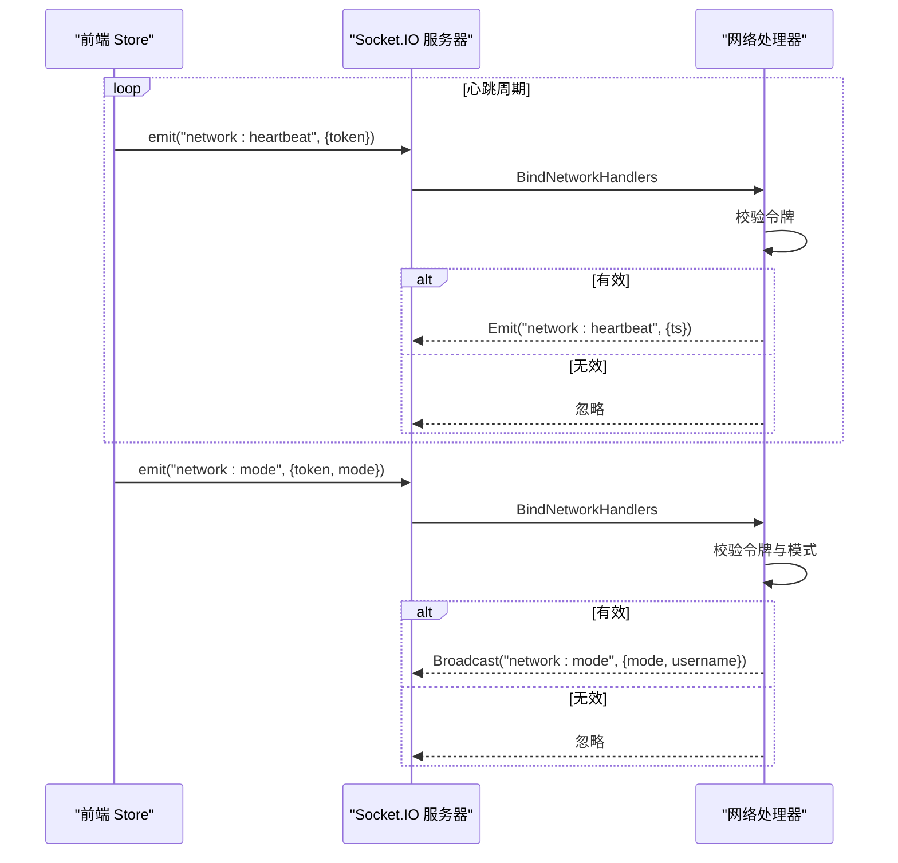

**图表来源**
- [main.ts:440-467](file://frontend/src/stores/main.ts#L440-L467)
- [memo.go:66-96](file://backend/handlers/memo.go#L66-L96)

**章节来源**
- [main.ts:440-467](file://frontend/src/stores/main.ts#L440-L467)
- [memo.go:66-96](file://backend/handlers/memo.go#L66-L96)

### 客户端连接建立、心跳与断线重连
- 连接建立
  - 前端初始化 socket.io-client，声明传输优先级为轮询优先，开启自动重连与最大尝试次数。
  - 连接成功后触发 connect 事件，启动心跳定时器与检查器。
- 心跳检测
  - 定时发送 network:heartbeat，检查上次心跳时间与超时阈值，动态调整网络同步状态。
- 断线重连
  - 自动重连，断开时停止心跳，重连后重新拉取系统配置并进行必要的状态同步。

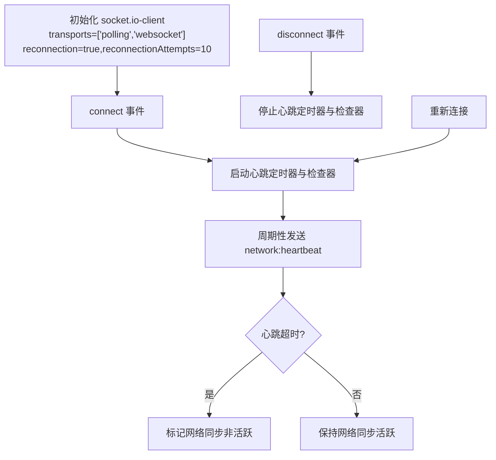

**图表来源**
- [main.ts:30-96](file://frontend/src/stores/main.ts#L30-L96)
- [main.ts:444-467](file://frontend/src/stores/main.ts#L444-L467)

**章节来源**
- [main.ts:30-96](file://frontend/src/stores/main.ts#L30-L96)
- [main.ts:444-467](file://frontend/src/stores/main.ts#L444-L467)

### 备忘录组件的 Socket 同步
- 事件监听
  - 组件在登录态与启用 Socket 同步时，绑定 memo:updated 与 connect 事件。
- 广播与去抖
  - 用户输入变化时，组件进行节流与指数退避重试，避免频繁广播。
- 远端应用
  - 收到 memo:updated 后，应用远端内容并触发本地渲染更新。

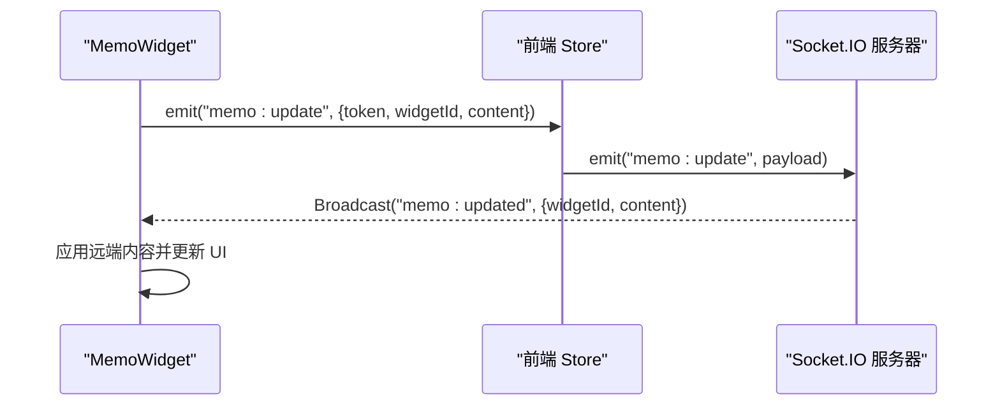

**图表来源**
- [MemoWidget.vue:571-617](file://frontend/src/components/MemoWidget.vue#L571-L617)
- [MemoWidget.vue:902-918](file://frontend/src/components/MemoWidget.vue#L902-L918)

**章节来源**
- [MemoWidget.vue:571-617](file://frontend/src/components/MemoWidget.vue#L571-L617)
- [MemoWidget.vue:902-918](file://frontend/src/components/MemoWidget.vue#L902-L918)

### 热搜与 RSS 组件的混合模式
- 热搜组件
  - 采用定时轮询与可见性感知，短时前端缓存与后端缓存结合，提升体验与稳定性。
- RSS 组件
  - 定时轮询与超时控制，支持多源尝试与错误处理，避免单点失败影响整体。

**章节来源**
- [HotWidget.vue:64-121](file://frontend/src/components/HotWidget.vue#L64-L121)
- [RssWidget.vue:112-168](file://frontend/src/components/RssWidget.vue#L112-L168)

## 依赖关系分析
- 后端模块耦合
  - main.go 仅负责初始化与路由转发，Socket.IO 服务器通过 handlers 包暴露的 BindXXXHandlers 注册事件。
  - data.go 提供 SetSocketServer，供 SaveMemo 等场景广播 data-updated。
  - widget_cache.go 提供统一缓存接口，被热搜、天气、RSS 处理器共享。
- 前端模块耦合
  - main.ts 统一管理 socket.io-client，心跳与系统配置拉取。
  - 各组件按需监听与发送事件，避免跨组件直接耦合。

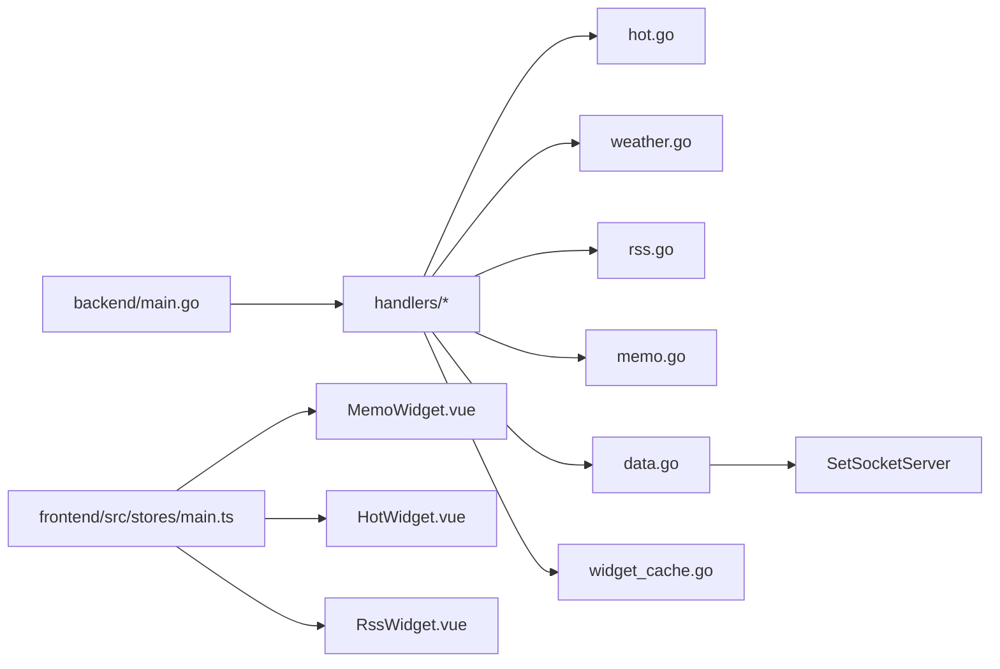

**图表来源**
- [main.go:103-109](file://backend/main.go#L103-L109)
- [data.go:155-157](file://backend/handlers/data.go#L155-L157)
- [widget_cache.go:13-44](file://backend/handlers/widget_cache.go#L13-L44)

**章节来源**
- [main.go:103-109](file://backend/main.go#L103-L109)
- [data.go:155-157](file://backend/handlers/data.go#L155-L157)
- [widget_cache.go:13-44](file://backend/handlers/widget_cache.go#L13-L44)

## 性能考虑
- 缓存策略
  - 小部件缓存统一管理，支持 TTL 与并发刷新控制，避免重复抓取与风暴效应。
- 传输优化
  - 后端启用 Gzip 压缩，减少静态资源与响应体积。
  - Socket.IO 同时支持轮询与 WebSocket，保障弱网与反代环境下的可用性。
- 前端节流与退避
  - 备忘录组件对广播进行节流与指数退避，降低网络压力与服务端负载。
- 轮询与可见性
  - 热搜与 RSS 组件在页面隐藏时停止轮询，恢复可见后再拉取，节省带宽与计算资源。

[本节为通用指导，无需特定文件引用]

## 故障排除指南
- 连接问题
  - 检查 CORS 允许来源是否正确配置，确保 Origin 校验通过。
  - 确认 /socket.io/*any 路由已正确转发至 Socket.IO 服务器。
- 心跳异常
  - 前端心跳定时器与超时阈值需匹配，避免误判网络状态。
  - 后端 network:heartbeat 事件需正确校验令牌，避免无效请求。
- 广播未达
  - 确认广播使用命名空间 "/"，且事件名称与载荷结构一致。
  - 检查前端是否绑定了对应事件监听。
- 缓存问题
  - 若出现陈旧数据，检查缓存 TTL 与刷新标签，必要时强制刷新或清理缓存文件。
- 日志与可观测性
  - 后端日志包含缓存命中/未命中、慢请求等关键指标，便于定位性能瓶颈。

**章节来源**
- [main.go:67-77](file://backend/main.go#L67-L77)
- [main.go:79-115](file://backend/main.go#L79-L115)
- [main.ts:444-467](file://frontend/src/stores/main.ts#L444-L467)
- [widget_cache.go:80-123](file://backend/handlers/widget_cache.go#L80-L123)

## 结论
OFlatNas 的实时通信体系以 Socket.IO 为核心，结合统一的小部件缓存与前后端协同的心跳/重连机制，实现了热搜、天气、RSS 与备忘录等多类实时场景的稳定运行。通过事件命名规范、数据格式约定与严格的错误处理，系统在复杂网络环境下仍能保持良好的用户体验与可维护性。建议持续关注缓存策略与传输优化，配合日志与监控进一步提升稳定性与性能。