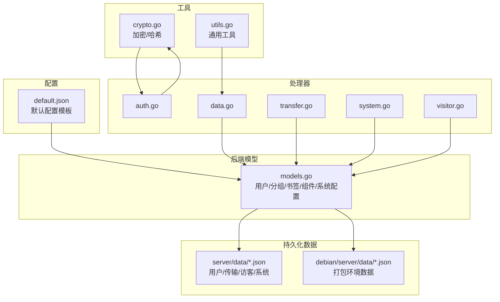
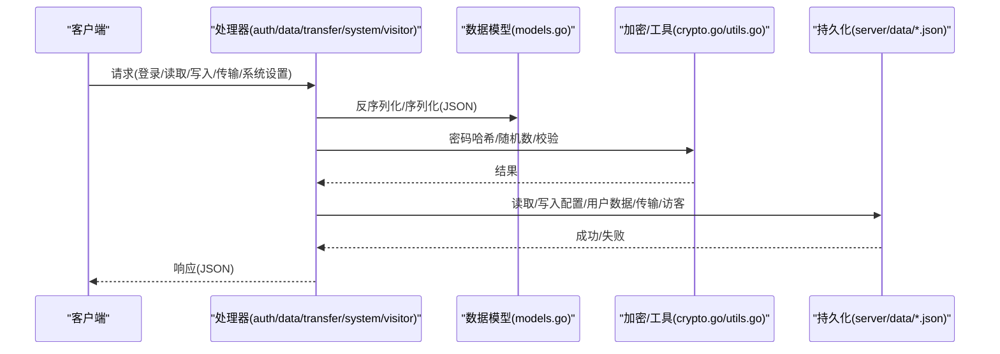
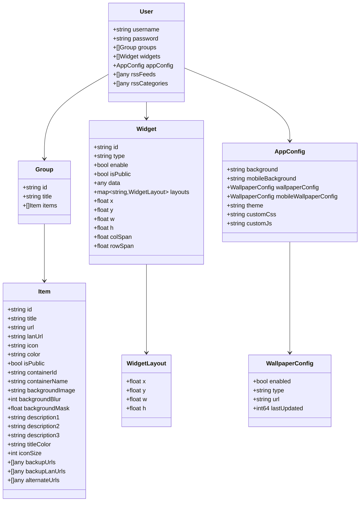
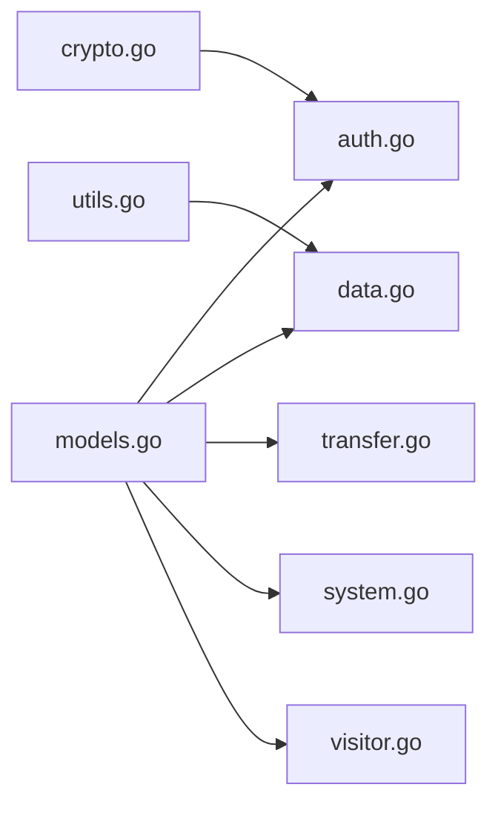

# 数据模型

<cite>
**本文引用的文件**
- [models.go](file://backend/models/models.go)
- [default.json](file://backend/config/default.json)
- [data.json](file://server/data/data.json)
- [crypto.go](file://backend/utils/crypto.go)
- [utils.go](file://backend/utils/utils.go)
- [auth.go](file://backend/handlers/auth.go)
- [data.go](file://backend/handlers/data.go)
- [transfer.go](file://backend/handlers/transfer.go)
- [system.go](file://backend/handlers/system.go)
- [visitor.go](file://backend/handlers/visitor.go)
- [admin.json](file://server/data/users/admin.json)
- [testuser.json](file://server/data/users/testuser.json)
- [index.json](file://server/doc/transfer/index.json)
- [index.json](file://debian/server/data/doc/transfer/index.json)
</cite>

## 目录
1. [简介](#简介)
2. [项目结构](#项目结构)
3. [核心组件](#核心组件)
4. [架构总览](#架构总览)
5. [详细组件分析](#详细组件分析)
6. [依赖分析](#依赖分析)
7. [性能考虑](#性能考虑)
8. [故障排除指南](#故障排除指南)
9. [结论](#结论)
10. [附录](#附录)

## 简介
本文件系统性梳理 OFlatNas 的数据模型与持久化机制，覆盖用户模型、组件模型（书签/小组件）、传输项模型以及系统配置的数据结构定义；明确字段约束与验证规则；阐述数据加密存储与敏感信息保护策略；解释数据版本控制、备份恢复与迁移机制；并提供使用示例与最佳实践。

## 项目结构
- 后端数据模型集中于 backend/models/models.go，采用 Go 结构体映射 JSON 字段，支持嵌套对象与可选字段。
- 默认配置位于 backend/config/default.json，运行时作为初始模板。
- 实际持久化数据位于 server/data/ 下，包含用户数据、传输数据、访客统计等。
- 加密与工具函数位于 backend/utils/，用于密码哈希、随机数生成等。
- 处理器层在 backend/handlers/，负责读写数据、鉴权与业务流程编排。

**图表来源**
- [models.go:1-118](file://backend/models/models.go#L1-L118)
- [default.json:1-147](file://backend/config/default.json#L1-L147)
- [data.json:1-104](file://server/data/data.json#L1-L104)
- [crypto.go:1-200](file://backend/utils/crypto.go#L1-L200)
- [utils.go:1-200](file://backend/utils/utils.go#L1-L200)
- [auth.go:1-200](file://backend/handlers/auth.go#L1-L200)
- [data.go:1-200](file://backend/handlers/data.go#L1-L200)
- [transfer.go:1-200](file://backend/handlers/transfer.go#L1-L200)
- [system.go:1-200](file://backend/handlers/system.go#L1-L200)
- [visitor.go:1-200](file://backend/handlers/visitor.go#L1-L200)

**章节来源**
- [models.go:1-118](file://backend/models/models.go#L1-L118)
- [default.json:1-147](file://backend/config/default.json#L1-L147)
- [data.json:1-104](file://server/data/data.json#L1-L104)

## 核心组件
- 用户模型：包含用户名、密码（哈希）、分组、组件、应用配置、RSS 列表等。
- 分组与书签：分组包含标题与书签列表；书签支持多语言 URL、图标、颜色、背景等属性。
- 组件模型：支持多种类型、启用状态、布局与坐标尺寸等。
- 应用配置：背景图、主题、自定义 CSS/JS 等。
- 系统配置：认证模式、Docker 开关与主机地址等。
- 传输项模型：文本或文件传输，含缩略图映射。
- 访客统计：访问总量、当日访客、最后访问日期。

**章节来源**
- [models.go:3-118](file://backend/models/models.go#L3-L118)

## 架构总览
数据流从配置模板到持久化文件，处理器通过模型进行读写与校验，加密模块保障敏感信息安全。

**图表来源**
- [auth.go:1-200](file://backend/handlers/auth.go#L1-L200)
- [data.go:1-200](file://backend/handlers/data.go#L1-L200)
- [transfer.go:1-200](file://backend/handlers/transfer.go#L1-L200)
- [system.go:1-200](file://backend/handlers/system.go#L1-L200)
- [visitor.go:1-200](file://backend/handlers/visitor.go#L1-L200)
- [models.go:1-118](file://backend/models/models.go#L1-L118)
- [crypto.go:1-200](file://backend/utils/crypto.go#L1-L200)
- [utils.go:1-200](file://backend/utils/utils.go#L1-L200)

## 详细组件分析

### 用户模型(User)
- 关键字段
  - username: 用户名
  - password: 密码（服务端存储为哈希）
  - groups: 分组数组
  - widgets: 组件数组
  - appConfig: 应用配置
  - rssFeeds/rssCategories: RSS 列表（当前简化为 any）
- 约束与规则
  - password 必须经哈希存储，禁止明文保存
  - groups/widgets/appConfig 为空时可省略
  - username 唯一性由业务层保证
- 数据持久化
  - 用户数据通常位于 server/data/users/<username>.json 或 debian 对应路径
  - 示例文件：admin.json、testuser.json

**图表来源**
- [models.go:3-79](file://backend/models/models.go#L3-L79)

**章节来源**
- [models.go:3-79](file://backend/models/models.go#L3-L79)
- [admin.json:1-200](file://server/data/users/admin.json#L1-L200)
- [testuser.json:1-200](file://server/data/users/testuser.json#L1-L200)

### 组件模型(Widget)
- 字段说明
  - id/type/enable/isPublic：标识与可见性
  - data：灵活数据结构，承载具体组件内容
  - layouts：按视口尺寸定义的布局映射
  - x/y/w/h/colSpan/rowSpan：布局坐标与尺寸
- 使用建议
  - 布局采用相对单位，适配不同屏幕
  - data 内容需与前端组件类型匹配

**章节来源**
- [models.go:42-62](file://backend/models/models.go#L42-L62)

### 应用配置(AppConfig)与壁纸配置(WallpaperConfig)
- AppConfig
  - 背景图、移动端背景、主题、自定义 CSS/JS 等
  - 支持壁纸配置嵌套对象
- WallpaperConfig
  - enabled/type/url/lastUpdated
  - type 支持 api、bing、upload 等类型
- 验证规则
  - url 在 type 为 api/upload 时可选
  - lastUpdated 为时间戳，用于缓存更新判断

**章节来源**
- [models.go:64-79](file://backend/models/models.go#L64-L79)
- [default.json:125-130](file://backend/config/default.json#L125-L130)
- [data.json:2-97](file://server/data/data.json#L2-L97)

### 系统配置(SystemConfig)
- authMode: single 或 multi
- enableDocker: 是否启用 Docker
- dockerHost: Docker 主机地址（可选）

**章节来源**
- [models.go:81-85](file://backend/models/models.go#L81-L85)

### 传输项模型(TransferItem/TransferFile)
- TransferItem
  - id/type/content/file/timestamp/sender
  - type 支持 text/file
- TransferFile
  - name/size/type/url/thumbs
  - thumbs 为缩略图尺寸到 URL 的映射
- 传输索引
  - server/doc/transfer/index.json 记录传输项索引

**章节来源**
- [models.go:98-118](file://backend/models/models.go#L98-L118)
- [index.json:1-200](file://server/doc/transfer/index.json#L1-L200)
- [index.json:1-200](file://debian/server/data/doc/transfer/index.json#L1-L200)

### 访客统计(VisitorStats)
- totalVisitors/todayVisitors/lastVisitDate
- 用于统计与展示访问情况

**章节来源**
- [models.go:92-96](file://backend/models/models.go#L92-L96)

## 依赖分析
- 模型依赖
  - User 依赖 Group、Widget、AppConfig
  - Widget 依赖 WidgetLayout
  - AppConfig 依赖 WallpaperConfig
- 处理器依赖
  - auth.go 依赖 crypto.go 进行密码处理
  - data.go/transfer.go/system.go/visitor.go 依赖 models.go 进行数据读写
- 配置依赖
  - default.json 提供初始模板，实际运行以 server/data/*.json 为准

**图表来源**
- [models.go:1-118](file://backend/models/models.go#L1-L118)
- [auth.go:1-200](file://backend/handlers/auth.go#L1-L200)
- [data.go:1-200](file://backend/handlers/data.go#L1-L200)
- [transfer.go:1-200](file://backend/handlers/transfer.go#L1-L200)
- [system.go:1-200](file://backend/handlers/system.go#L1-L200)
- [visitor.go:1-200](file://backend/handlers/visitor.go#L1-L200)
- [crypto.go:1-200](file://backend/utils/crypto.go#L1-L200)
- [utils.go:1-200](file://backend/utils/utils.go#L1-L200)

**章节来源**
- [models.go:1-118](file://backend/models/models.go#L1-L118)

## 性能考虑
- JSON 序列化/反序列化
  - 使用结构体标签优化字段映射，避免不必要的字段解析
- 布局与组件
  - Widget.layouts 仅在需要时加载，减少内存占用
- 文件读写
  - 批量写入时使用原子写入策略，避免部分写入导致的数据损坏
- 缓存与更新
  - wallpaperConfig.lastUpdated 用于判断是否需要刷新壁纸资源

[本节为通用指导，无需特定文件引用]

## 故障排除指南
- 登录失败
  - 检查密码是否正确（服务端存储为哈希），确认用户名存在且未被锁定
  - 参考处理器中的鉴权流程
- 数据读取异常
  - 确认 server/data/*.json 文件存在且格式正确
  - 若缺失默认配置，检查 backend/config/default.json 是否可用
- 传输项丢失
  - 检查 server/doc/transfer/index.json 是否存在
  - 确认文件夹权限与磁盘空间充足
- 壁纸不更新
  - 检查 wallpaperConfig.enabled 与 type
  - 验证 lastUpdated 是否最新

**章节来源**
- [auth.go:1-200](file://backend/handlers/auth.go#L1-L200)
- [data.go:1-200](file://backend/handlers/data.go#L1-L200)
- [transfer.go:1-200](file://backend/handlers/transfer.go#L1-L200)
- [system.go:1-200](file://backend/handlers/system.go#L1-L200)
- [visitor.go:1-200](file://backend/handlers/visitor.go#L1-L200)

## 结论
OFlatNas 的数据模型以清晰的结构体定义 JSON 数据契约，结合处理器层的读写与校验、工具层的加密与通用能力，形成稳定的数据持久化体系。通过合理的字段约束、安全存储策略与备份恢复机制，确保系统在功能与安全之间取得平衡。

[本节为总结性内容，无需特定文件引用]

## 附录

### 数据验证规则与字段约束
- 必填字段
  - User.username、User.password、Group.id、Item.id、Widget.id
- 可选字段
  - Item.lanUrl、Item.color、Item.containerId、Item.background*、Item.description*、Item.titleColor、Item.iconSize、Item.backupUrls/backupLanUrls/alternateUrls
  - Widget.layouts、Widget.x/y/w/h/colSpan/rowSpan
  - AppConfig.background、mobileBackground、theme、customCss、customJs
  - WallpaperConfig.url、lastUpdated
- 类型约束
  - 数值类字段（如 backgroundBlur、iconSize）应为非负整数
  - 时间戳（lastUpdated）为整型
  - 布尔字段仅接受 true/false
- 业务规则
  - password 必须哈希存储
  - WallpaperConfig.type 为 api/bing/upload 之一
  - TransferItem.type 为 text/file 之一

**章节来源**
- [models.go:3-118](file://backend/models/models.go#L3-L118)

### 数据加密存储与敏感信息保护
- 密码处理
  - 使用哈希算法对密码进行单向加密存储
  - 登录时进行哈希比对，不存储明文
- 敏感字段
  - 仅 password 属于敏感信息；其他字段不涉及敏感数据
- 最佳实践
  - 服务器仅在内存中持有明文密码进行比对
  - 配置文件与数据库均不记录明文密码

**章节来源**
- [crypto.go:1-200](file://backend/utils/crypto.go#L1-L200)
- [auth.go:1-200](file://backend/handlers/auth.go#L1-L200)

### 数据版本控制、备份恢复与迁移机制
- 版本控制
  - 通过 lastUpdated 等时间戳字段辅助判断数据变更
  - 建议在升级时保留旧字段兼容，新增字段使用可选
- 备份
  - 备份 server/data/ 下的全部 JSON 文件
  - 备份 debian/server/data/ 下的打包数据
- 恢复
  - 将备份文件还原至对应目录，重启服务后生效
- 迁移
  - 新增字段时保持向后兼容
  - 对历史数据进行字段补齐或默认值填充

**章节来源**
- [models.go:64-79](file://backend/models/models.go#L64-L79)
- [data.json:1-104](file://server/data/data.json#L1-L104)
- [default.json:1-147](file://backend/config/default.json#L1-L147)

### 数据模型使用示例与最佳实践
- 用户数据示例
  - 参考 server/data/users/admin.json、testuser.json
- 传输数据示例
  - 参考 server/doc/transfer/index.json
- 最佳实践
  - 严格区分必填/可选字段，避免空值污染
  - 对外暴露的接口返回最小必要字段
  - 对大文件传输使用缩略图映射，降低带宽压力
  - 定期清理过期传输项与无效索引

**章节来源**
- [admin.json:1-200](file://server/data/users/admin.json#L1-L200)
- [testuser.json:1-200](file://server/data/users/testuser.json#L1-L200)
- [index.json:1-200](file://server/doc/transfer/index.json#L1-L200)