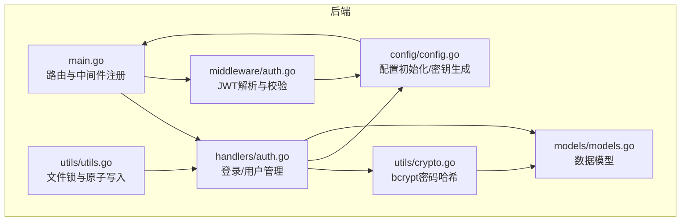
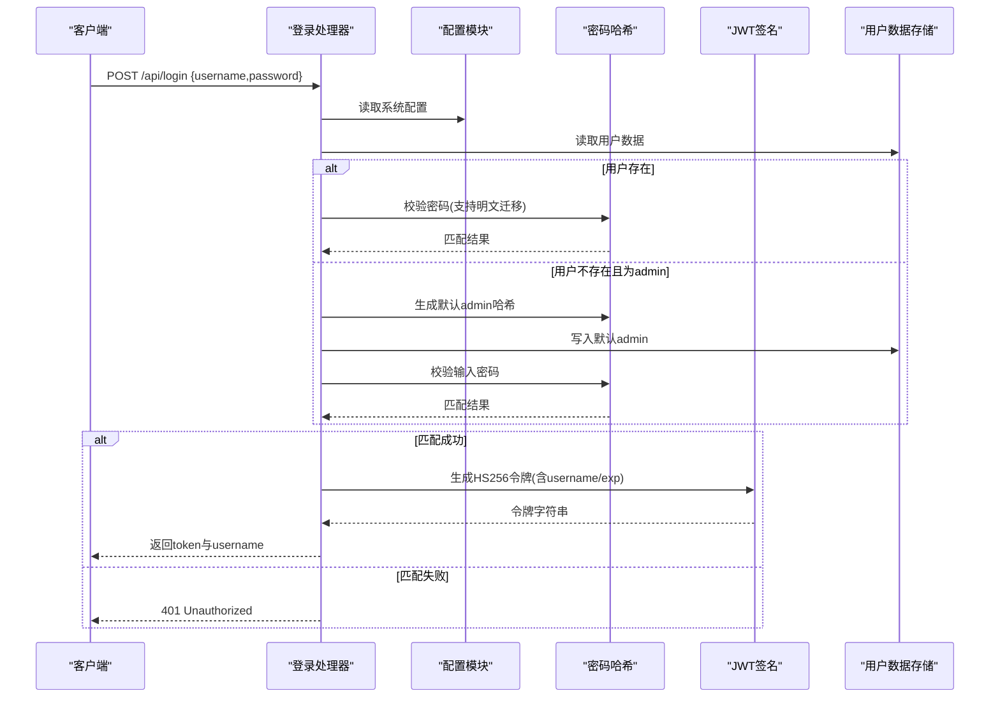
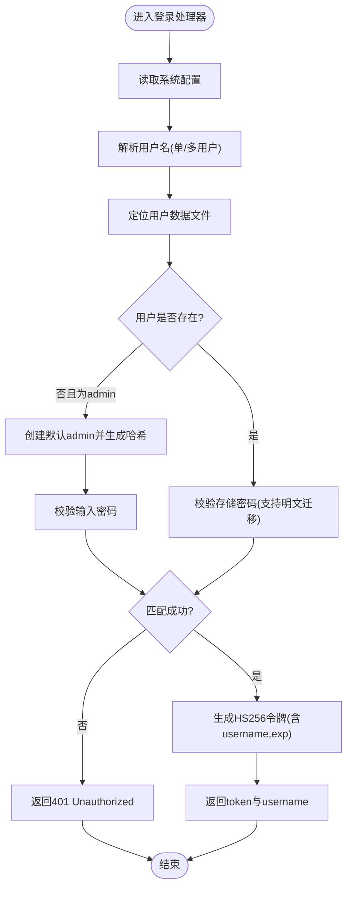
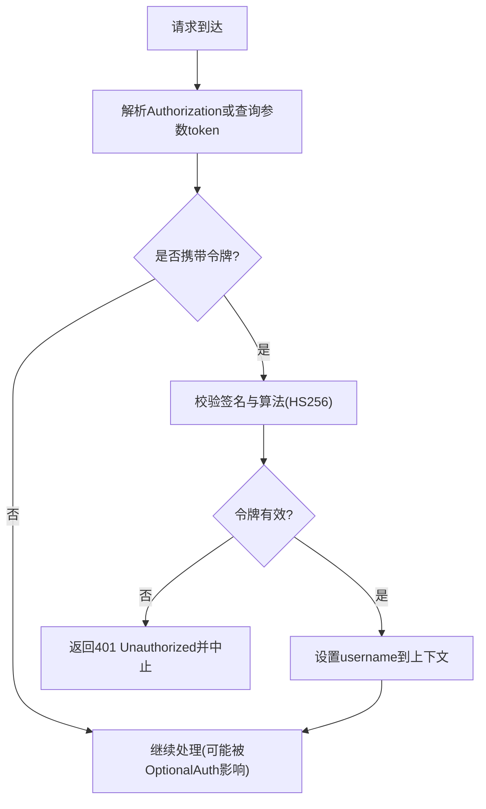
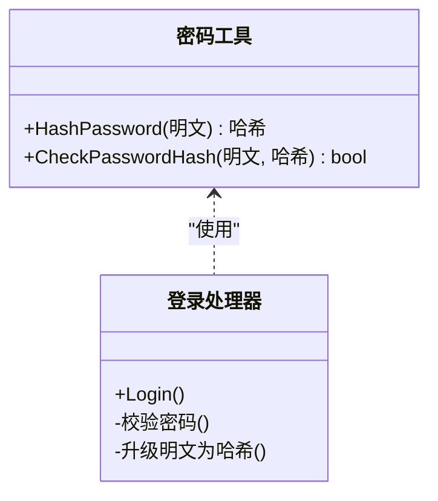
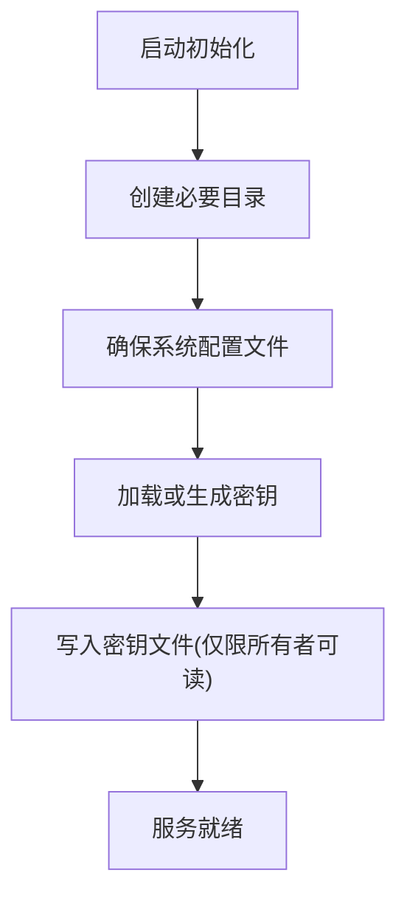
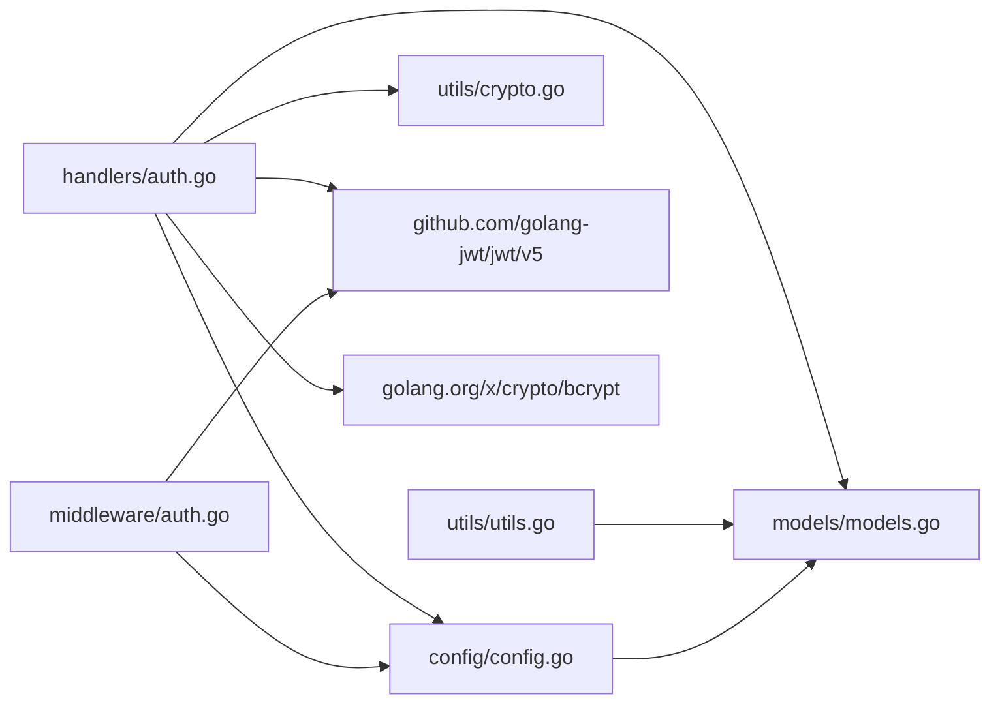

# 认证系统

<cite>
**本文档引用的文件**
- [main.go](file://backend/main.go)
- [auth.go](file://backend/handlers/auth.go)
- [auth.go](file://backend/middleware/auth.go)
- [crypto.go](file://backend/utils/crypto.go)
- [models.go](file://backend/models/models.go)
- [config.go](file://backend/config/config.go)
- [default.json](file://backend/config/default.json)
- [utils.go](file://backend/utils/utils.go)
- [auth_test.go](file://backend/middleware/auth_test.go)
- [security.ts](file://frontend/src/utils/security.ts)
- [env.ts](file://frontend/src/lib/env.ts)
</cite>

## 目录
1. [简介](#简介)
2. [项目结构](#项目结构)
3. [核心组件](#核心组件)
4. [架构总览](#架构总览)
5. [详细组件分析](#详细组件分析)
6. [依赖关系分析](#依赖关系分析)
7. [性能考虑](#性能考虑)
8. [故障排除指南](#故障排除指南)
9. [结论](#结论)

## 简介
本文件为 OFlatNas 认证系统的权威技术文档，覆盖 JWT 令牌生成、验证与刷新机制，用户登录流程、会话管理与权限控制实现，多用户支持模式与角色权限分配，访问控制列表设计，密码加密存储与安全哈希算法使用，以及中间件认证流程、请求拦截与权限验证机制。同时提供认证配置示例、安全最佳实践与常见问题解决方案。

## 项目结构
后端采用 Gin 框架，认证相关代码主要分布在以下模块：
- handlers：处理登录、用户管理等业务逻辑
- middleware：全局认证中间件与可选认证中间件
- utils：密码哈希与文件读写原子操作
- config：配置初始化、密钥生成与系统配置
- models：数据模型定义（用户、系统配置等）

**图表来源**
- [main.go:165-254](file://backend/main.go#L165-L254)
- [auth.go:18-114](file://backend/handlers/auth.go#L18-L114)
- [auth.go:12-31](file://backend/middleware/auth.go#L12-L31)
- [crypto.go:7-15](file://backend/utils/crypto.go#L7-L15)
- [utils.go:16-75](file://backend/utils/utils.go#L16-L75)
- [config.go:35-208](file://backend/config/config.go#L35-L208)
- [models.go:3-11](file://backend/models/models.go#L3-L11)

**章节来源**
- [main.go:165-254](file://backend/main.go#L165-L254)

## 核心组件
- 登录处理器：接收用户名/密码，校验系统配置与用户凭证，签发 JWT 令牌
- 中间件：解析 Authorization 或查询参数中的令牌，校验签名与算法，注入当前用户信息
- 密码哈希：bcrypt 实现安全密码存储与校验
- 配置与密钥：自动生成对称密钥并持久化，确保 JWT 签名一致性
- 文件原子写：保证用户数据与配置文件写入的原子性与并发安全

**章节来源**
- [auth.go:18-114](file://backend/handlers/auth.go#L18-L114)
- [auth.go:12-60](file://backend/middleware/auth.go#L12-L60)
- [crypto.go:7-15](file://backend/utils/crypto.go#L7-L15)
- [config.go:182-208](file://backend/config/config.go#L182-L208)
- [utils.go:16-75](file://backend/utils/utils.go#L16-L75)

## 架构总览
下图展示从客户端发起登录请求到服务端签发 JWT 的完整流程，以及后续请求通过中间件进行认证与授权的关键节点。

**图表来源**
- [auth.go:18-114](file://backend/handlers/auth.go#L18-L114)
- [config.go:25-26](file://backend/config/config.go#L25-L26)
- [crypto.go:7-15](file://backend/utils/crypto.go#L7-L15)

## 详细组件分析

### 组件A：登录与令牌签发
- 支持单用户与多用户模式：根据系统配置决定用户名为空时的默认行为
- 用户凭证校验：优先使用 bcrypt 存储的哈希；若发现明文密码则自动升级为哈希并回写
- 令牌签发：使用 HS256 算法，载荷包含 username 与过期时间，默认有效期 30 天
- 安全要点：仅在匹配成功时签发令牌；默认 admin 创建失败时返回错误

**图表来源**
- [auth.go:18-114](file://backend/handlers/auth.go#L18-L114)

**章节来源**
- [auth.go:18-114](file://backend/handlers/auth.go#L18-L114)

### 组件B：JWT 中间件与权限控制
- 解析策略：优先从 Authorization 头获取 Bearer 令牌，否则从查询参数 token 获取
- 校验策略：限定仅 HS256 算法；使用服务端密钥进行签名验证
- 注入上下文：校验通过后将 username 注入上下文，供后续处理器使用
- 可选认证：OptionalAuthMiddleware 允许未携带有效令牌的请求继续，但会尝试解析并注入用户信息

**图表来源**
- [auth.go:12-60](file://backend/middleware/auth.go#L12-L60)

**章节来源**
- [auth.go:12-60](file://backend/middleware/auth.go#L12-L60)
- [auth_test.go:12-61](file://backend/middleware/auth_test.go#L12-L61)

### 组件C：密码加密与安全哈希
- bcrypt 使用：生成哈希时使用 14 轮成本因子，确保抗暴力破解能力
- 明文迁移：检测到明文密码时自动升级为 bcrypt 哈希并回写，提升历史兼容性
- 校验流程：使用 bcrypt.CompareHashAndPassword 进行快速比对

**图表来源**
- [crypto.go:7-15](file://backend/utils/crypto.go#L7-L15)
- [auth.go:44-98](file://backend/handlers/auth.go#L44-L98)

**章节来源**
- [crypto.go:7-15](file://backend/utils/crypto.go#L7-L15)
- [auth.go:44-98](file://backend/handlers/auth.go#L44-L98)

### 组件D：配置与密钥管理
- 自动初始化：确保数据目录、用户目录、配置文件等存在
- 密钥生成：随机生成 32 字节密钥并以十六进制形式持久化，作为 JWT HS256 的共享密钥
- 系统配置：默认 authMode 为 single，enableDocker 为 true，并提供更新接口

**图表来源**
- [config.go:35-208](file://backend/config/config.go#L35-L208)
- [default.json:141-142](file://backend/config/default.json#L141-L142)

**章节来源**
- [config.go:35-208](file://backend/config/config.go#L35-L208)
- [default.json:141-142](file://backend/config/default.json#L141-L142)

### 组件E：文件原子写与并发安全
- 文件锁：基于 sync.Map 的按文件粒度互斥锁，避免并发写冲突
- 原子写：先写临时文件再重命名，保证写入完整性
- 适用场景：用户数据、系统配置、日志等关键文件的写入

**章节来源**
- [utils.go:16-75](file://backend/utils/utils.go#L16-L75)

### 组件F：前端安全与环境检测
- 内部域名白名单：支持本地与私有网段域名，可扩展自定义域名白名单
- URL 处理：强制 HTTPS、绝对路径与编码，降低 SSRF 与 URL 注入风险
- 环境检测：区分 Vercel 与 Docker 环境，便于前端配置与行为调整

**章节来源**
- [security.ts:1-52](file://frontend/src/utils/security.ts#L1-L52)
- [env.ts:1-14](file://frontend/src/lib/env.ts#L1-L14)

## 依赖关系分析
- handlers/auth.go 依赖 config、models、utils 与 bcrypt/jwt 库
- middleware/auth.go 依赖 config 与 jwt 库
- utils/crypto.go 依赖 bcrypt
- config/config.go 依赖随机数与文件系统
- models/models.go 提供用户与系统配置的数据结构

**图表来源**
- [auth.go:3-16](file://backend/handlers/auth.go#L3-L16)
- [auth.go:3-10](file://backend/middleware/auth.go#L3-L10)
- [config.go:3-12](file://backend/config/config.go#L3-L12)
- [models.go:1-11](file://backend/models/models.go#L1-L11)
- [utils.go:3-7](file://backend/utils/utils.go#L3-L7)
- [crypto.go:3-5](file://backend/utils/crypto.go#L3-L5)

**章节来源**
- [auth.go:3-16](file://backend/handlers/auth.go#L3-L16)
- [auth.go:3-10](file://backend/middleware/auth.go#L3-L10)
- [config.go:3-12](file://backend/config/config.go#L3-L12)
- [models.go:1-11](file://backend/models/models.go#L1-L11)
- [utils.go:3-7](file://backend/utils/utils.go#L3-L7)
- [crypto.go:3-5](file://backend/utils/crypto.go#L3-L5)

## 性能考虑
- JWT 验证开销极低：仅需一次 HMAC 校验与负载解析
- bcrypt 成本因子：14 轮在安全性与性能间取得平衡；登录时一次性计算，不影响后续 JWT 校验
- 文件写入优化：原子写与文件锁避免磁盘竞争，减少 IO 错误与数据损坏风险
- 并发安全：全局文件锁按文件粒度控制，避免热点文件争用

## 故障排除指南
- 401 未授权
  - 检查 Authorization 头是否为 Bearer 令牌格式
  - 确认令牌使用 HS256 算法，且未被篡改
  - 核对服务端密钥是否正确加载
- 密码错误
  - 确认输入密码与存储哈希匹配
  - 若为首次登录且使用默认 admin，确认默认密码策略
- 用户不存在或权限不足
  - 确认用户文件存在且格式正确
  - 管理员操作需具备 admin 权限
- 令牌无效或过期
  - 检查 exp 时间戳是否正确设置
  - 如需长期会话，建议在客户端轮换令牌或调整过期策略

**章节来源**
- [auth.go:33-47](file://backend/middleware/auth.go#L33-L47)
- [auth.go:100-114](file://backend/handlers/auth.go#L100-L114)
- [auth_test.go:12-61](file://backend/middleware/auth_test.go#L12-L61)

## 结论
OFlatNas 认证系统以 bcrypt 保障密码安全，以 HS256 JWT 实现轻量级会话管理，并通过中间件统一拦截与授权。配置模块负责密钥与系统参数的初始化与持久化，文件工具提供原子写与并发安全。整体设计兼顾易用性与安全性，适合内网与跨网络部署场景。建议结合前端安全策略与最小权限原则，进一步完善访问控制与审计机制。