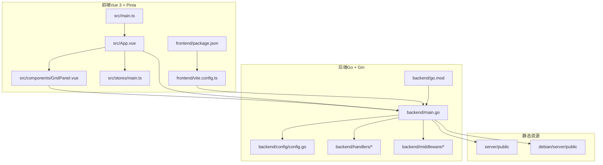
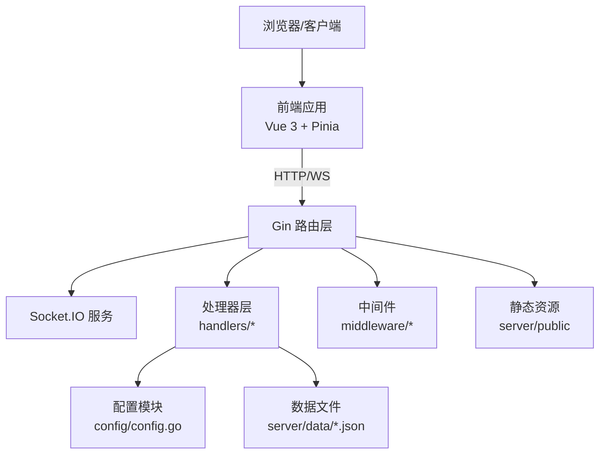
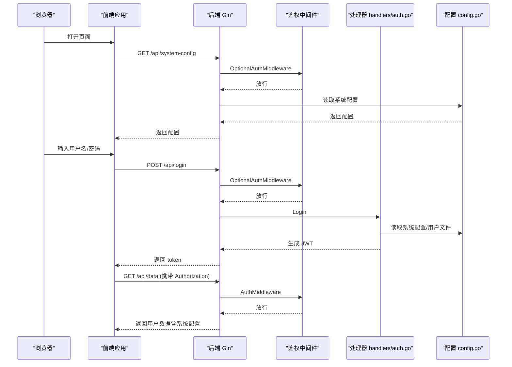
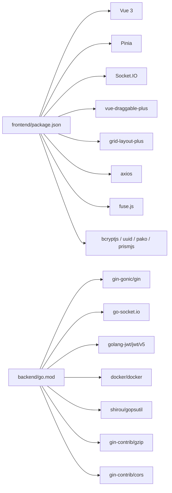

# 开发指南

<cite>
**本文档引用的文件**
- [README.md](file://README.md)
- [frontend/package.json](file://frontend/package.json)
- [backend/go.mod](file://backend/go.mod)
- [frontend/src/main.ts](file://frontend/src/main.ts)
- [backend/main.go](file://backend/main.go)
- [frontend/vite.config.ts](file://frontend/vite.config.ts)
- [backend/config/config.go](file://backend/config/config.go)
- [backend/handlers/auth.go](file://backend/handlers/auth.go)
- [frontend/src/App.vue](file://frontend/src/App.vue)
- [frontend/src/types.ts](file://frontend/src/types.ts)
- [frontend/src/components/GridPanel.vue](file://frontend/src/components/GridPanel.vue)
- [backend/handlers/data.go](file://backend/handlers/data.go)
- [backend/middleware/auth.go](file://backend/middleware/auth.go)
- [frontend/src/stores/counter.ts](file://frontend/src/stores/counter.ts)
</cite>

## 目录
1. [简介](#简介)
2. [项目结构](#项目结构)
3. [核心组件](#核心组件)
4. [架构总览](#架构总览)
5. [详细组件分析](#详细组件分析)
6. [依赖关系分析](#依赖关系分析)
7. [性能考虑](#性能考虑)
8. [故障排查指南](#故障排查指南)
9. [结论](#结论)
10. [附录](#附录)

## 简介
本指南面向新加入的开发者，帮助你快速理解并参与 OFlatNas（原 FlatNas）项目的开发。项目采用前后端分离架构：前端基于 Vue 3 + Pinia，后端基于 Go + Gin，提供个人导航页与仪表盘、组件生态、文件传输、音乐播放、Docker 管理、系统监控、代理与网络环境识别等能力。文档涵盖开发环境搭建、代码结构理解、开发流程规范、调试技巧、组件开发规范、API 设计原则、测试策略、性能优化与安全实践。

## 项目结构
- 前端（Vue 3 + TypeScript + Vite）
  - 应用入口与状态管理：src/main.ts、src/stores/*.ts
  - 页面与组件：src/App.vue、src/components/*.vue
  - 工具与类型：src/utils/*、src/types.ts
  - 构建配置：frontend/vite.config.ts、frontend/package.json
- 后端（Go + Gin）
  - 入口与路由：backend/main.go
  - 配置与数据：backend/config/config.go
  - 处理器与业务：backend/handlers/*
  - 中间件：backend/middleware/*
- 静态资源与部署
  - server/public 与 debian/server/public 提供静态资源
  - Docker 与部署脚本位于根目录与 debian 目录

图表来源
- [frontend/src/main.ts:1-37](file://frontend/src/main.ts#L1-L37)
- [frontend/src/App.vue:1-666](file://frontend/src/App.vue#L1-L666)
- [frontend/src/components/GridPanel.vue:1-800](file://frontend/src/components/GridPanel.vue#L1-L800)
- [frontend/vite.config.ts:1-65](file://frontend/vite.config.ts#L1-L65)
- [backend/main.go:1-267](file://backend/main.go#L1-L267)
- [backend/config/config.go:1-257](file://backend/config/config.go#L1-L257)
- [backend/go.mod:1-83](file://backend/go.mod#L1-L83)

章节来源
- [README.md:1-292](file://README.md#L1-L292)
- [frontend/package.json:1-76](file://frontend/package.json#L1-L76)
- [backend/go.mod:1-83](file://backend/go.mod#L1-L83)
- [frontend/vite.config.ts:1-65](file://frontend/vite.config.ts#L1-L65)
- [backend/main.go:1-267](file://backend/main.go#L1-L267)
- [backend/config/config.go:1-257](file://backend/config/config.go#L1-L257)

## 核心组件
- 前端应用入口与状态初始化
  - 应用挂载、Pinia 注册、全局 store 初始化与错误捕获
  - 参考路径：[frontend/src/main.ts:1-37](file://frontend/src/main.ts#L1-L37)
- 主题与全局样式
  - 自定义 CSS 注入、响应式增强标签、标题与全局样式处理
  - 参考路径：[frontend/src/App.vue:1-666](file://frontend/src/App.vue#L1-L666)
- 网格布局与组件渲染
  - 动态异步组件加载、拖拽布局、天气特效、壁纸轮播、搜索引擎等
  - 参考路径：[frontend/src/components/GridPanel.vue:1-800](file://frontend/src/components/GridPanel.vue#L1-L800)
- 状态管理（Pinia）
  - 全局 store（useMainStore）、计数器示例（useCounterStore）
  - 参考路径：[frontend/src/stores/main.ts:1-800](file://frontend/src/stores/main.ts#L1-L800)、[frontend/src/stores/counter.ts:1-13](file://frontend/src/stores/counter.ts#L1-L13)
- 后端入口与路由
  - Gin 路由注册、CORS、Gzip、静态资源、Socket.IO、认证中间件
  - 参考路径：[backend/main.go:1-267](file://backend/main.go#L1-L267)
- 配置与数据
  - 配置初始化、系统配置、数据文件、密钥生成与校验
  - 参考路径：[backend/config/config.go:1-257](file://backend/config/config.go#L1-L257)
- 认证与授权
  - JWT 解析、鉴权中间件、可选鉴权中间件
  - 参考路径：[backend/middleware/auth.go:1-61](file://backend/middleware/auth.go#L1-L61)、[backend/handlers/auth.go:1-211](file://backend/handlers/auth.go#L1-L211)

章节来源
- [frontend/src/main.ts:1-37](file://frontend/src/main.ts#L1-L37)
- [frontend/src/App.vue:1-666](file://frontend/src/App.vue#L1-L666)
- [frontend/src/components/GridPanel.vue:1-800](file://frontend/src/components/GridPanel.vue#L1-L800)
- [frontend/src/stores/main.ts:1-800](file://frontend/src/stores/main.ts#L1-L800)
- [frontend/src/stores/counter.ts:1-13](file://frontend/src/stores/counter.ts#L1-L13)
- [backend/main.go:1-267](file://backend/main.go#L1-L267)
- [backend/config/config.go:1-257](file://backend/config/config.go#L1-L257)
- [backend/middleware/auth.go:1-61](file://backend/middleware/auth.go#L1-L61)
- [backend/handlers/auth.go:1-211](file://backend/handlers/auth.go#L1-L211)

## 架构总览
系统采用前后端分离架构，前端通过 HTTP 与 Socket.IO 与后端通信，后端提供 REST API 与静态资源服务，同时负责配置、用户、数据、Docker、文件传输、天气、RSS、访客统计等功能。

图表来源
- [backend/main.go:34-164](file://backend/main.go#L34-L164)
- [backend/config/config.go:35-86](file://backend/config/config.go#L35-L86)
- [backend/handlers/data.go:159-322](file://backend/handlers/data.go#L159-L322)
- [frontend/src/App.vue:1-666](file://frontend/src/App.vue#L1-L666)

章节来源
- [backend/main.go:1-267](file://backend/main.go#L1-L267)
- [backend/config/config.go:1-257](file://backend/config/config.go#L1-L257)
- [backend/handlers/data.go:1-800](file://backend/handlers/data.go#L1-L800)
- [frontend/src/App.vue:1-666](file://frontend/src/App.vue#L1-L666)

## 详细组件分析

### 前端应用入口与状态初始化
- 初始化流程
  - 创建应用实例与 Pinia，挂载应用
  - 全局 store 初始化，确保配置加载
  - 开发模式下附加错误捕获与覆盖处理
- 关键点
  - 浏览器 UA 识别（HarmonyOS/Huawei/Alook）以设置样式类
  - 全局 store 的 init() 调用确保系统配置与数据拉取
- 参考路径
  - [frontend/src/main.ts:1-37](file://frontend/src/main.ts#L1-L37)

章节来源
- [frontend/src/main.ts:1-37](file://frontend/src/main.ts#L1-L37)

### 主题与全局样式（App.vue）
- 功能要点
  - 自定义 CSS 注入：支持增强语法（mobile/desktop/dark/light）
  - 自定义 JS 注入：沙箱运行、生命周期钩子（init/update/destroy）、DOM 观察与去抖
  - 全局错误提示与保存失败反馈
  - 市场组件安装消息桥接与安全提示
- 参考路径
  - [frontend/src/App.vue:1-666](file://frontend/src/App.vue#L1-L666)

章节来源
- [frontend/src/App.vue:1-666](file://frontend/src/App.vue#L1-L666)

### 网格布局与组件渲染（GridPanel.vue）
- 功能要点
  - 动态异步组件加载，失败时自动刷新解决 chunk 加载问题
  - 响应式布局与拖拽排序，按设备类型计算列数与行高
  - 天气特效（雨/雾）与 WebGL 渲染
  - 搜索引擎配置与会话记忆
  - 图标 SVG 修复（无效颜色类名清洗）
  - 背景图预加载与加载状态
- 参考路径
  - [frontend/src/components/GridPanel.vue:1-800](file://frontend/src/components/GridPanel.vue#L1-L800)

章节来源
- [frontend/src/components/GridPanel.vue:1-800](file://frontend/src/components/GridPanel.vue#L1-L800)

### 状态管理（Pinia）
- useMainStore（主 store）
  - Socket 连接与心跳、网络模式检测、系统配置与版本检查
  - 壁纸列表构建与排序、天气网络状态检测
  - 全局拖拽状态、仪表盘脉冲定时器、资源版本缓存
  - 与后端数据同步、冲突解决与版本一致性
- 计数器示例（useCounterStore）
  - 展示 Pinia 基本用法
- 参考路径
  - [frontend/src/stores/main.ts:1-800](file://frontend/src/stores/main.ts#L1-L800)
  - [frontend/src/stores/counter.ts:1-13](file://frontend/src/stores/counter.ts#L1-L13)

章节来源
- [frontend/src/stores/main.ts:1-800](file://frontend/src/stores/main.ts#L1-L800)
- [frontend/src/stores/counter.ts:1-13](file://frontend/src/stores/counter.ts#L1-L13)

### 后端入口与路由（main.go）
- 功能要点
  - 初始化配置、Socket.IO、静态资源、CORS、Gzip、路由注册
  - API 分组与鉴权中间件：公开接口与受保护接口
  - 静态文件回退与 SPA 路由处理
- 参考路径
  - [backend/main.go:1-267](file://backend/main.go#L1-L267)

章节来源
- [backend/main.go:1-267](file://backend/main.go#L1-L267)

### 配置与数据（config/config.go）
- 功能要点
  - 自动推断 BaseDir，确保目录存在
  - 初始化系统配置、数据文件、密钥文件
  - 额外数据文件（访客统计、自定义脚本、组件缓存）
- 参考路径
  - [backend/config/config.go:1-257](file://backend/config/config.go#L1-L257)

章节来源
- [backend/config/config.go:1-257](file://backend/config/config.go#L1-L257)

### 认证与授权（middleware/auth.go、handlers/auth.go）
- 功能要点
  - JWT 解析与校验，支持 Authorization 头与查询参数
  - 鉴权中间件与可选鉴权中间件
  - 登录接口：支持单用户/多用户模式，密码哈希与令牌签发
- 参考路径
  - [backend/middleware/auth.go:1-61](file://backend/middleware/auth.go#L1-L61)
  - [backend/handlers/auth.go:1-211](file://backend/handlers/auth.go#L1-L211)

章节来源
- [backend/middleware/auth.go:1-61](file://backend/middleware/auth.go#L1-L61)
- [backend/handlers/auth.go:1-211](file://backend/handlers/auth.go#L1-L211)

### 数据读取与保存（handlers/data.go）
- 功能要点
  - GetData 缓存：基于文件修改时间的缓存命中
  - 过滤公开数据、移除敏感字段、注入系统配置
  - SaveData 版本控制、冲突检测、密码哈希保持
  - Memo 文件对齐与幂等保存、Socket 广播
- 参考路径
  - [backend/handlers/data.go:1-800](file://backend/handlers/data.go#L1-L800)

章节来源
- [backend/handlers/data.go:1-800](file://backend/handlers/data.go#L1-L800)

### 类型定义（frontend/src/types.ts）
- 功能要点
  - 导航项、分组、应用配置、小部件配置、RSS、书签、任务、天气等类型
  - 为组件与 store 提供强类型支撑
- 参考路径
  - [frontend/src/types.ts:1-298](file://frontend/src/types.ts#L1-L298)

章节来源
- [frontend/src/types.ts:1-298](file://frontend/src/types.ts#L1-L298)

### 前端构建与开发服务器（vite.config.ts）
- 功能要点
  - 根据环境变量决定 publicDir 与 outDir（Windows/Debian/Vercel/Docker）
  - 开发服务器配置、忽略 data/server 监视、插件（Vue、DevTools、Partytown）
- 参考路径
  - [frontend/vite.config.ts:1-65](file://frontend/vite.config.ts#L1-L65)

章节来源
- [frontend/vite.config.ts:1-65](file://frontend/vite.config.ts#L1-L65)

### API 调用序列（登录与数据同步）

图表来源
- [backend/main.go:165-254](file://backend/main.go#L165-L254)
- [backend/middleware/auth.go:33-60](file://backend/middleware/auth.go#L33-L60)
- [backend/handlers/auth.go:18-114](file://backend/handlers/auth.go#L18-L114)
- [backend/config/config.go:102-151](file://backend/config/config.go#L102-L151)
- [frontend/src/App.vue:122-154](file://frontend/src/App.vue#L122-L154)

章节来源
- [backend/main.go:165-254](file://backend/main.go#L165-L254)
- [backend/middleware/auth.go:33-60](file://backend/middleware/auth.go#L33-L60)
- [backend/handlers/auth.go:18-114](file://backend/handlers/auth.go#L18-L114)
- [backend/config/config.go:102-151](file://backend/config/config.go#L102-L151)
- [frontend/src/App.vue:122-154](file://frontend/src/App.vue#L122-L154)

## 依赖关系分析
- 前端依赖
  - Vue 3、Pinia、Socket.IO、Draggable、Grid Layout Plus、Fuse.js、Axios、bcryptjs、DomPurify、Smooth Corners、xlsx 等
  - 参考路径：[frontend/package.json:1-76](file://frontend/package.json#L1-L76)
- 后端依赖
  - Gin、Socket.IO、JWT、Docker SDK、gopsutil、gzip、cors、image 等
  - 参考路径：[backend/go.mod:1-83](file://backend/go.mod#L1-L83)

图表来源
- [frontend/package.json:21-46](file://frontend/package.json#L21-L46)
- [backend/go.mod:5-17](file://backend/go.mod#L5-L17)

章节来源
- [frontend/package.json:1-76](file://frontend/package.json#L1-L76)
- [backend/go.mod:1-83](file://backend/go.mod#L1-L83)

## 性能考虑
- 前端
  - 动态组件按需加载，失败自动刷新解决 chunk 加载问题
  - 资源版本缓存与缓存破坏参数，避免静态资源缓存导致的兼容性问题
  - WebGL 雨/雾特效按需初始化与销毁，减少不必要的渲染
  - 仪表盘脉冲定时器统一调度，降低分散请求
- 后端
  - Gzip 压缩、CORS 白名单、请求体大小限制
  - GetData 缓存：基于文件修改时间的缓存命中，减少 IO
  - Socket 广播与心跳检测，保障实时性与稳定性
- 参考路径
  - [frontend/src/components/GridPanel.vue:24-52](file://frontend/src/components/GridPanel.vue#L24-L52)
  - [frontend/src/App.vue:561-577](file://frontend/src/App.vue#L561-L577)
  - [backend/main.go:42-46](file://backend/main.go#L42-L46)
  - [backend/handlers/data.go:193-209](file://backend/handlers/data.go#L193-L209)

章节来源
- [frontend/src/components/GridPanel.vue:24-52](file://frontend/src/components/GridPanel.vue#L24-L52)
- [frontend/src/App.vue:561-577](file://frontend/src/App.vue#L561-L577)
- [backend/main.go:42-46](file://backend/main.go#L42-L46)
- [backend/handlers/data.go:193-209](file://backend/handlers/data.go#L193-L209)

## 故障排查指南
- 代理相关
  - 确认环境变量 PROXY_URL 格式正确，后端日志中查看代理错误
  - 前端开启代理开关后，组件请求将通过 /api/proxy 转发
  - 参考路径：[README.md:71-96](file://README.md#L71-L96)
- 登录与鉴权
  - 检查 Authorization 头或查询参数 token，确认 JWT 有效
  - 受保护接口需携带有效 token
  - 参考路径：[backend/middleware/auth.go:12-47](file://backend/middleware/auth.go#L12-L47)、[backend/handlers/auth.go:18-114](file://backend/handlers/auth.go#L18-L114)
- 数据保存冲突
  - SaveData 会比较版本号，冲突时返回当前版本
  - 参考路径：[backend/handlers/data.go:675-678](file://backend/handlers/data.go#L675-L678)
- Chunk 加载失败
  - 前端动态组件加载失败时自动刷新，避免白屏
  - 参考路径：[frontend/src/components/GridPanel.vue:24-52](file://frontend/src/components/GridPanel.vue#L24-L52)
- SPA 路由与缓存
  - 后端对 / 与 /index.html 禁用强缓存，避免引用旧 chunk
  - 参考路径：[backend/main.go:119-128](file://backend/main.go#L119-L128)

章节来源
- [README.md:71-96](file://README.md#L71-L96)
- [backend/middleware/auth.go:12-47](file://backend/middleware/auth.go#L12-L47)
- [backend/handlers/auth.go:18-114](file://backend/handlers/auth.go#L18-L114)
- [backend/handlers/data.go:675-678](file://backend/handlers/data.go#L675-L678)
- [frontend/src/components/GridPanel.vue:24-52](file://frontend/src/components/GridPanel.vue#L24-L52)
- [backend/main.go:119-128](file://backend/main.go#L119-L128)

## 结论
本指南提供了 OFlatNas 的整体架构、前后端关键组件、开发流程与调试方法。建议新开发者先从前端入口与主 store、后端入口与路由入手，再逐步深入到具体处理器与组件。遵循本文的开发规范、API 设计原则与安全实践，可高效扩展新功能、创建自定义组件并与第三方服务集成。

## 附录

### 开发环境搭建
- 前端
  - Node.js 版本要求：参见 package.json engines 字段
  - 安装依赖后可通过 npm 脚本启动开发服务器
  - 参考路径：[frontend/package.json:7-20](file://frontend/package.json#L7-L20)
- 后端
  - Go 版本要求：参见 go.mod
  - 使用 go run 或 go build 启动服务
  - 参考路径：[backend/go.mod](file://backend/go.mod#L3)

章节来源
- [frontend/package.json:7-20](file://frontend/package.json#L7-L20)
- [backend/go.mod](file://backend/go.mod#L3)

### 开发流程规范
- 前端
  - 使用 Composition API 与 TypeScript，组件按功能拆分
  - Pinia 状态集中管理，避免跨组件共享复杂状态
  - 使用 defineAsyncComponent 管理动态组件加载
  - 参考路径：[frontend/src/components/GridPanel.vue:24-52](file://frontend/src/components/GridPanel.vue#L24-L52)
- 后端
  - 路由按功能分组，鉴权中间件明确区分公开与受保护接口
  - 处理器职责单一，必要时引入缓存与幂等机制
  - 参考路径：[backend/main.go:165-254](file://backend/main.go#L165-L254)、[backend/handlers/data.go:638-744](file://backend/handlers/data.go#L638-L744)

章节来源
- [frontend/src/components/GridPanel.vue:24-52](file://frontend/src/components/GridPanel.vue#L24-L52)
- [backend/main.go:165-254](file://backend/main.go#L165-L254)
- [backend/handlers/data.go:638-744](file://backend/handlers/data.go#L638-L744)

### API 设计原则
- 统一鉴权：受保护接口必须携带有效 token
- 版本控制：前端保存时携带版本号，后端进行冲突检测
- 缓存策略：热点数据（如系统配置、用户数据）使用文件修改时间缓存
- 错误处理：明确的状态码与错误信息，便于前端展示与用户理解
- 参考路径：[backend/middleware/auth.go:33-60](file://backend/middleware/auth.go#L33-L60)、[backend/handlers/data.go:675-678](file://backend/handlers/data.go#L675-L678)

章节来源
- [backend/middleware/auth.go:33-60](file://backend/middleware/auth.go#L33-L60)
- [backend/handlers/data.go:675-678](file://backend/handlers/data.go#L675-L678)

### 测试策略
- 单元测试与快照：前端使用 Vitest 与 jsdom，组件与工具函数可独立测试
- 端到端测试：Playwright 配置可用于交互流程验证
- 参考路径：[frontend/package.json:16-19](file://frontend/package.json#L16-L19)

章节来源
- [frontend/package.json:16-19](file://frontend/package.json#L16-L19)

### 性能优化建议
- 前端
  - 动态组件懒加载、资源版本缓存、特效按需初始化
- 后端
  - Gzip 压缩、缓存命中、Socket 广播与心跳检测
- 参考路径：[frontend/src/components/GridPanel.vue:318-377](file://frontend/src/components/GridPanel.vue#L318-L377)、[backend/main.go:42-46](file://backend/main.go#L42-L46)

章节来源
- [frontend/src/components/GridPanel.vue:318-377](file://frontend/src/components/GridPanel.vue#L318-L377)
- [backend/main.go:42-46](file://backend/main.go#L42-L46)

### 安全编码实践
- 密码处理：bcrypt 哈希，避免明文存储
- JWT 签名：使用随机生成的密钥，定期轮换
- CORS 白名单：限制允许来源，避免跨域风险
- SSRF 防护：代理请求时严格校验目标地址
- 参考路径：[backend/handlers/auth.go:46-98](file://backend/handlers/auth.go#L46-L98)、[backend/config/config.go:182-204](file://backend/config/config.go#L182-L204)、[backend/main.go:67-77](file://backend/main.go#L67-L77)

章节来源
- [backend/handlers/auth.go:46-98](file://backend/handlers/auth.go#L46-L98)
- [backend/config/config.go:182-204](file://backend/config/config.go#L182-L204)
- [backend/main.go:67-77](file://backend/main.go#L67-L77)

### 扩展新功能与自定义组件
- 新增前端组件
  - 在 src/components 下创建组件，使用 defineAsyncComponent 管理加载
  - 在 GridPanel 中注册并添加到可用小部件类型集合
  - 参考路径：[frontend/src/components/GridPanel.vue:88-110](file://frontend/src/components/GridPanel.vue#L88-L110)
- 新增后端处理器
  - 在 backend/handlers 下新增处理器文件，注册路由并添加鉴权中间件
  - 参考路径：[backend/main.go:165-254](file://backend/main.go#L165-L254)
- 集成第三方服务
  - 通过 /api/proxy 转发请求，或在后端新增代理处理器
  - 参考路径：[backend/main.go](file://backend/main.go#L135)

章节来源
- [frontend/src/components/GridPanel.vue:88-110](file://frontend/src/components/GridPanel.vue#L88-L110)
- [backend/main.go:135-135](file://backend/main.go#L135-L135)
- [backend/main.go:165-254](file://backend/main.go#L165-L254)