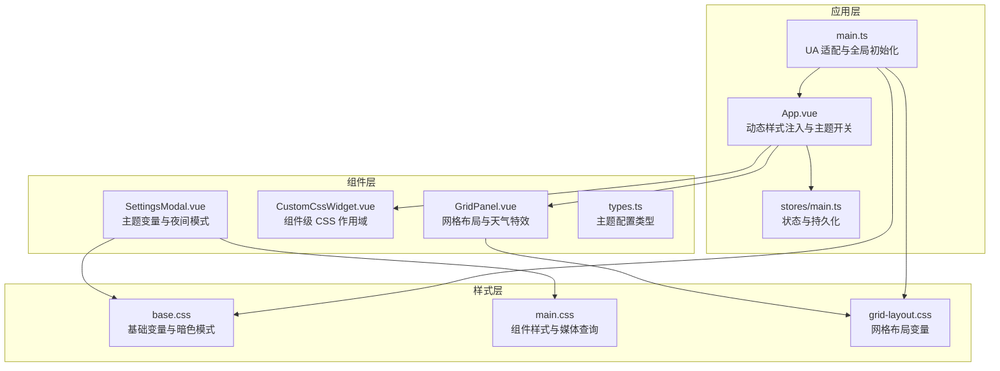
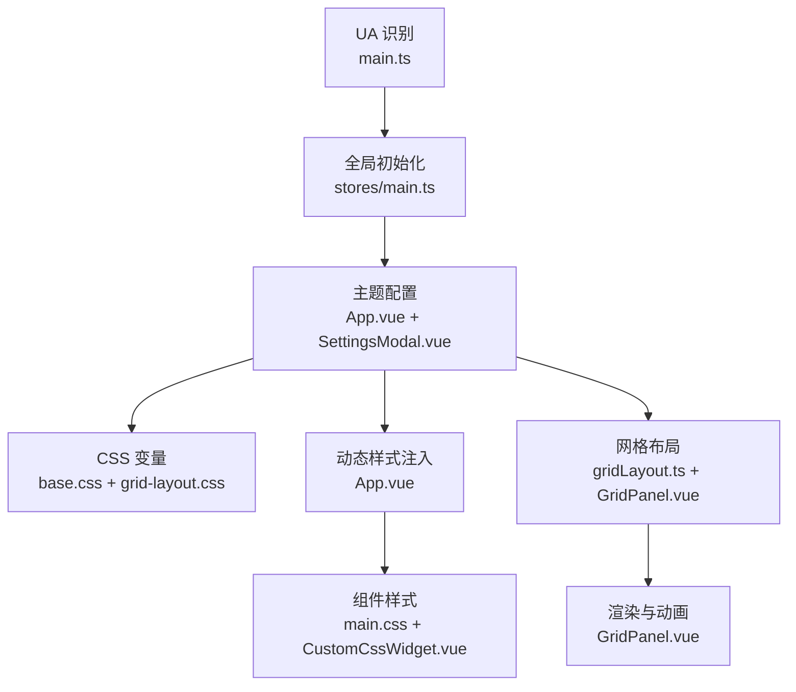
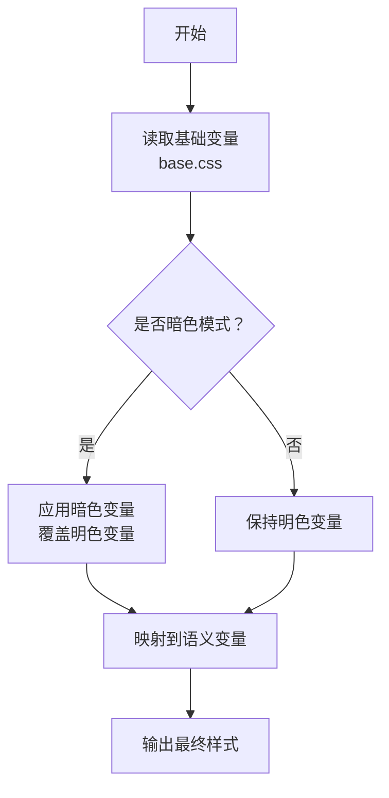
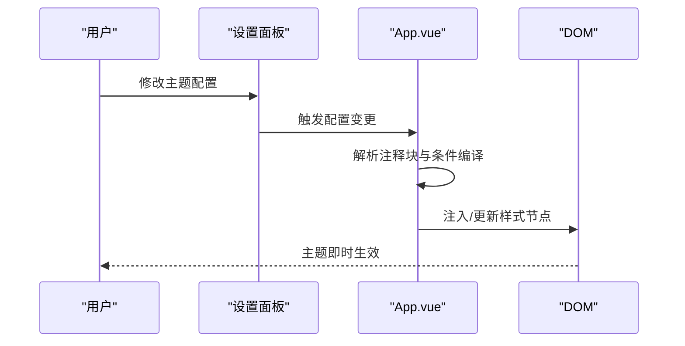
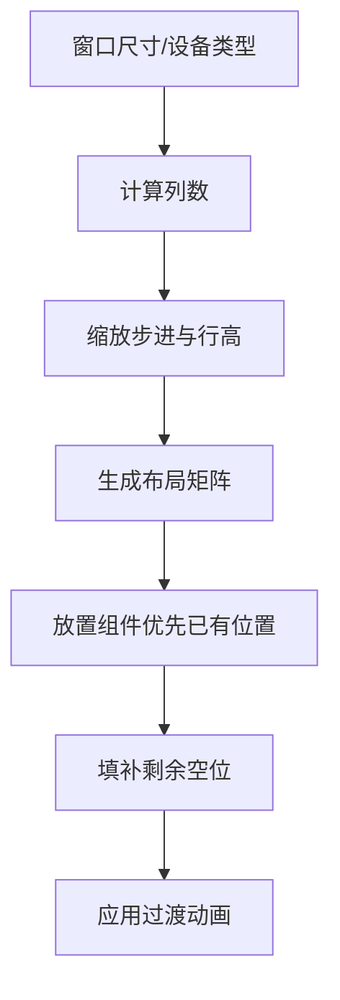
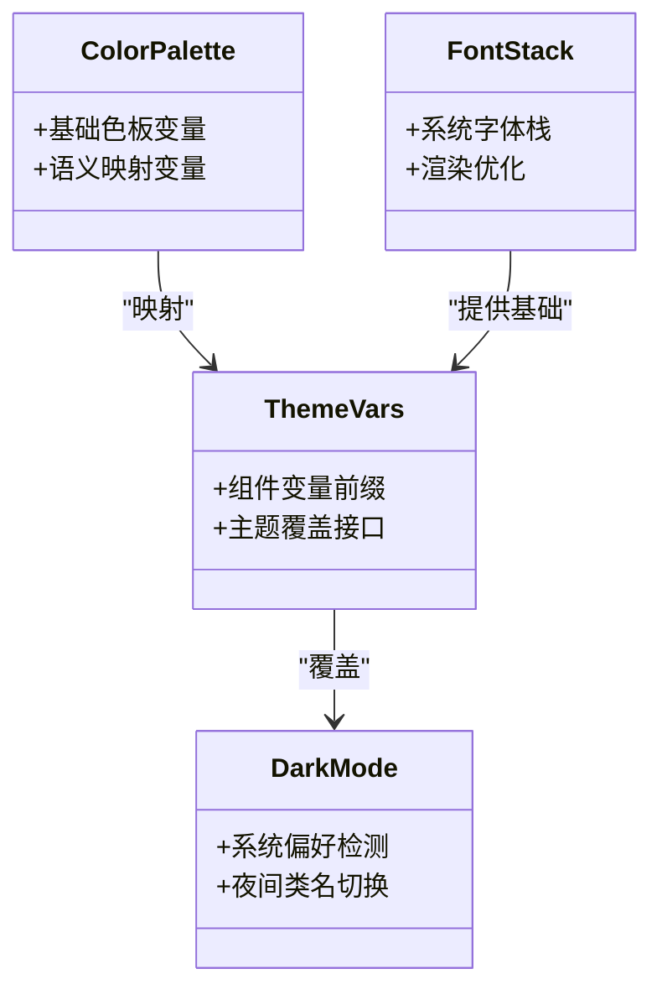
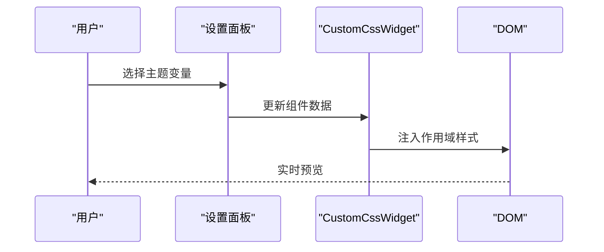
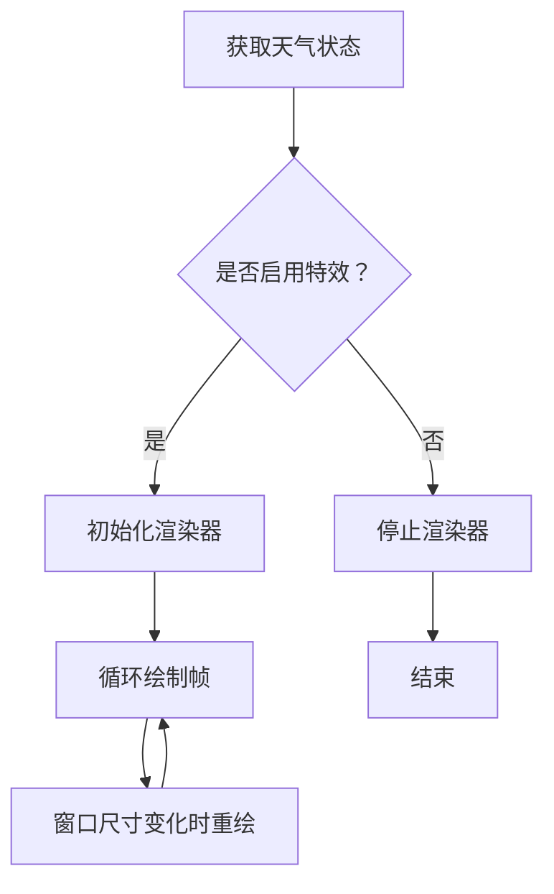
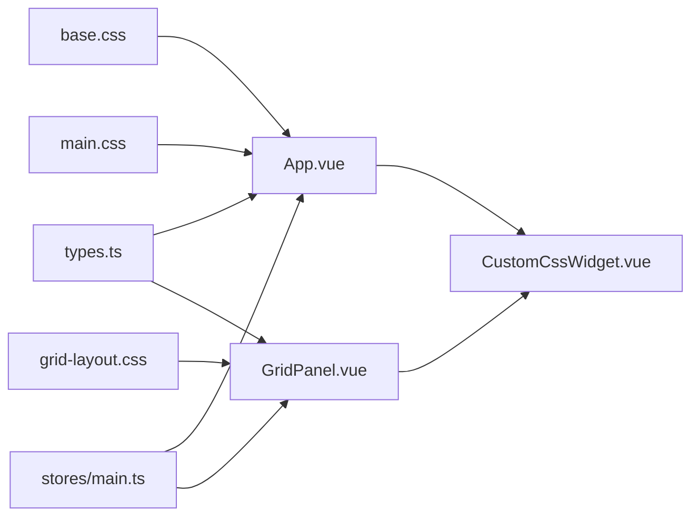

# 主题开发

<cite>
**本文引用的文件**
- [frontend/src/assets/base.css](file://frontend/src/assets/base.css)
- [frontend/src/assets/main.css](file://frontend/src/assets/main.css)
- [frontend/src/assets/grid-layout.css](file://frontend/src/assets/grid-layout.css)
- [frontend/src/App.vue](file://frontend/src/App.vue)
- [frontend/src/main.ts](file://frontend/src/main.ts)
- [frontend/src/stores/main.ts](file://frontend/src/stores/main.ts)
- [frontend/src/components/GridPanel.vue](file://frontend/src/components/GridPanel.vue)
- [frontend/src/utils/gridLayout.ts](file://frontend/src/utils/gridLayout.ts)
- [frontend/src/types.ts](file://frontend/src/types.ts)
- [frontend/src/components/CustomCssWidget.vue](file://frontend/src/components/CustomCssWidget.vue)
- [frontend/src/components/SettingsModal.vue](file://frontend/src/components/SettingsModal.vue)
- [frontend/vite.config.ts](file://frontend/vite.config.ts)
</cite>

## 目录
1. [引言](#引言)
2. [项目结构](#项目结构)
3. [核心组件](#核心组件)
4. [架构总览](#架构总览)
5. [详细组件分析](#详细组件分析)
6. [依赖关系分析](#依赖关系分析)
7. [性能考量](#性能考量)
8. [故障排查指南](#故障排查指南)
9. [结论](#结论)
10. [附录](#附录)

## 引言
本指南面向 OFlatNas 主题开发者，系统阐述主题系统架构、样式继承机制与变量系统，详解 CSS 变量使用、响应式设计与暗色模式支持，解析网格布局系统、组件样式定制与动画效果实现，并提供主题打包、分发与版本管理方法，涵盖颜色系统设计、字体管理与图标库集成，以及主题切换机制、用户偏好保存与动态样式更新策略。文档同时给出主题开发工具、调试技巧与性能优化建议，帮助快速构建与维护高质量主题。

## 项目结构
前端主题相关的核心文件集中在 frontend 目录，主要分为三类：
- 样式层：基础样式、主题变量与网格布局
- 应用层：入口初始化、主题切换与动态样式注入
- 组件层：网格面板、自定义 CSS 组件与设置面板

**图表来源**
- [frontend/src/main.ts:1-37](file://frontend/src/main.ts#L1-L37)
- [frontend/src/App.vue:1-666](file://frontend/src/App.vue#L1-L666)
- [frontend/src/stores/main.ts:1-800](file://frontend/src/stores/main.ts#L1-L800)
- [frontend/src/assets/base.css:1-116](file://frontend/src/assets/base.css#L1-L116)
- [frontend/src/assets/main.css:1-132](file://frontend/src/assets/main.css#L1-L132)
- [frontend/src/assets/grid-layout.css:1-109](file://frontend/src/assets/grid-layout.css#L1-L109)
- [frontend/src/components/GridPanel.vue:1-800](file://frontend/src/components/GridPanel.vue#L1-L800)
- [frontend/src/components/CustomCssWidget.vue:1-444](file://frontend/src/components/CustomCssWidget.vue#L1-L444)
- [frontend/src/components/SettingsModal.vue:1-800](file://frontend/src/components/SettingsModal.vue#L1-L800)
- [frontend/src/types.ts:1-298](file://frontend/src/types.ts#L1-L298)

**章节来源**
- [frontend/src/main.ts:1-37](file://frontend/src/main.ts#L1-L37)
- [frontend/src/App.vue:1-666](file://frontend/src/App.vue#L1-L666)
- [frontend/src/stores/main.ts:1-800](file://frontend/src/stores/main.ts#L1-L800)
- [frontend/src/assets/base.css:1-116](file://frontend/src/assets/base.css#L1-L116)
- [frontend/src/assets/main.css:1-132](file://frontend/src/assets/main.css#L1-L132)
- [frontend/src/assets/grid-layout.css:1-109](file://frontend/src/assets/grid-layout.css#L1-L109)
- [frontend/src/components/GridPanel.vue:1-800](file://frontend/src/components/GridPanel.vue#L1-L800)
- [frontend/src/components/CustomCssWidget.vue:1-444](file://frontend/src/components/CustomCssWidget.vue#L1-L444)
- [frontend/src/components/SettingsModal.vue:1-800](file://frontend/src/components/SettingsModal.vue#L1-L800)
- [frontend/src/types.ts:1-298](file://frontend/src/types.ts#L1-L298)

## 核心组件
- 样式变量与主题继承
  - 基础变量：通过语义化 CSS 变量定义背景、文本、分割线等基础色板，支持明/暗两套体系。
  - 组件变量：以命名空间前缀统一管理组件级变量，便于按组件维度覆盖与扩展。
  - 暗色模式：基于系统偏好与组件级夜间类名组合，实现渐变过渡与视觉一致性。
- 动态样式注入
  - 应用级：根据用户配置动态注入自定义 CSS 与 JS，支持条件编译（移动端/桌面端/暗/亮）。
  - 组件级：自定义 CSS 组件对内部样式进行作用域隔离，避免污染全局。
- 响应式与网格布局
  - 基于 CSS 变量的网格尺寸与间距，结合设备检测与窗口尺寸变化，实现自适应布局。
  - 网格算法：采用缩放步进与矩阵占用检测，保障布局紧凑与不重叠。
- 主题切换与偏好保存
  - 通过 Pinia 存储持久化主题配置，结合浏览器存储实现跨会话记忆。
  - 设置面板集中管理主题变量，支持即时预览与批量导出导入。

**章节来源**
- [frontend/src/assets/base.css:1-116](file://frontend/src/assets/base.css#L1-L116)
- [frontend/src/assets/main.css:1-132](file://frontend/src/assets/main.css#L1-L132)
- [frontend/src/App.vue:63-105](file://frontend/src/App.vue#L63-L105)
- [frontend/src/components/CustomCssWidget.vue:30-84](file://frontend/src/components/CustomCssWidget.vue#L30-L84)
- [frontend/src/components/GridPanel.vue:676-800](file://frontend/src/components/GridPanel.vue#L676-L800)
- [frontend/src/utils/gridLayout.ts:11-113](file://frontend/src/utils/gridLayout.ts#L11-L113)
- [frontend/src/stores/main.ts:165-167](file://frontend/src/stores/main.ts#L165-L167)

## 架构总览
OFaltNas 的主题系统围绕“样式变量 + 动态注入 + 组件作用域 + 响应式网格”展开，形成从基础变量到组件样式的完整链路。

**图表来源**
- [frontend/src/main.ts:9-20](file://frontend/src/main.ts#L9-L20)
- [frontend/src/stores/main.ts:165-167](file://frontend/src/stores/main.ts#L165-L167)
- [frontend/src/App.vue:63-105](file://frontend/src/App.vue#L63-L105)
- [frontend/src/components/SettingsModal.vue:215-241](file://frontend/src/components/SettingsModal.vue#L215-L241)
- [frontend/src/assets/base.css:24-51](file://frontend/src/assets/base.css#L24-L51)
- [frontend/src/assets/grid-layout.css:1-54](file://frontend/src/assets/grid-layout.css#L1-L54)
- [frontend/src/assets/main.css:35-125](file://frontend/src/assets/main.css#L35-L125)
- [frontend/src/components/CustomCssWidget.vue:30-97](file://frontend/src/components/CustomCssWidget.vue#L30-L97)
- [frontend/src/utils/gridLayout.ts:11-113](file://frontend/src/utils/gridLayout.ts#L11-L113)
- [frontend/src/components/GridPanel.vue:676-800](file://frontend/src/components/GridPanel.vue#L676-L800)

## 详细组件分析

### 样式变量与主题继承
- 基础变量与语义化映射
  - 通过基础色板变量与语义变量分离，确保主题切换时仅需调整基础变量即可。
  - 支持明/暗两套体系，配合媒体查询实现系统偏好联动。
- 组件变量与命名空间
  - 以组件前缀命名变量，避免冲突并提升可维护性。
  - 在设置面板中集中展示与编辑，便于主题作者快速定位与修改。
- 暗色模式实现
  - 通过夜间类名与组件级样式组合，实现局部与全局的暗色覆盖。
  - 使用过渡动画与滤镜增强视觉体验。

**图表来源**
- [frontend/src/assets/base.css:24-51](file://frontend/src/assets/base.css#L24-L51)

**章节来源**
- [frontend/src/assets/base.css:1-116](file://frontend/src/assets/base.css#L1-L116)
- [frontend/src/components/SettingsModal.vue:215-241](file://frontend/src/components/SettingsModal.vue#L215-L241)

### 动态样式注入与主题切换
- 应用级动态注入
  - 监听用户配置变更，解析自定义 CSS 注释块，按条件编译为媒体查询。
  - 将最终样式注入页面 head，实现无需刷新的主题切换。
- 组件级作用域
  - 自定义 CSS 组件对内部样式进行作用域隔离，避免影响其他组件。
  - 支持实时预览与保存，便于主题作者迭代。

**图表来源**
- [frontend/src/App.vue:63-105](file://frontend/src/App.vue#L63-L105)
- [frontend/src/components/CustomCssWidget.vue:30-97](file://frontend/src/components/CustomCssWidget.vue#L30-L97)

**章节来源**
- [frontend/src/App.vue:63-105](file://frontend/src/App.vue#L63-L105)
- [frontend/src/components/CustomCssWidget.vue:30-97](file://frontend/src/components/CustomCssWidget.vue#L30-L97)

### 响应式设计与网格布局
- 响应式断点与缩放
  - 基于窗口尺寸与设备类型，动态计算网格列数与行高，适配桌面、平板与手机。
  - 使用 CSS 变量控制缩放比例与间距，确保在不同分辨率下的一致体验。
- 网格算法与紧凑布局
  - 采用步进缩放与矩阵占用检测，优先保留已有布局，再自动填补空位。
  - 支持拖拽、调整大小与动画过渡，提升交互体验。

**图表来源**
- [frontend/src/components/GridPanel.vue:676-800](file://frontend/src/components/GridPanel.vue#L676-L800)
- [frontend/src/utils/gridLayout.ts:11-113](file://frontend/src/utils/gridLayout.ts#L11-L113)

**章节来源**
- [frontend/src/components/GridPanel.vue:676-800](file://frontend/src/components/GridPanel.vue#L676-L800)
- [frontend/src/utils/gridLayout.ts:11-113](file://frontend/src/utils/gridLayout.ts#L11-L113)

### 颜色系统设计与字体管理
- 颜色系统
  - 基于语义变量与组件变量双层映射，支持主题作者快速替换主色、强调色与背景色。
  - 暗色模式下自动调整对比度与透明度，确保可读性与层次感。
- 字体管理
  - 采用系统字体栈与优化渲染参数，兼顾跨平台一致性与性能。
  - 针对特定平台（如 HarmonyOS/Alook 浏览器）提供额外优化。

**图表来源**
- [frontend/src/assets/base.css:1-51](file://frontend/src/assets/base.css#L1-L51)
- [frontend/src/main.ts:9-20](file://frontend/src/main.ts#L9-L20)

**章节来源**
- [frontend/src/assets/base.css:1-116](file://frontend/src/assets/base.css#L1-L116)
- [frontend/src/main.ts:9-20](file://frontend/src/main.ts#L9-L20)

### 图标库集成与组件样式定制
- 图标库
  - 通过 SVG 与内联处理，兼容多种图标源，支持按需加载与缓存。
- 组件样式定制
  - 自定义 CSS 组件提供 HTML/CSS/JS 三段式编辑，支持作用域隔离与事件总线。
  - 设置面板集中管理卡片背景、边框、标题色等主题变量，便于批量调整。

**图表来源**
- [frontend/src/components/CustomCssWidget.vue:30-97](file://frontend/src/components/CustomCssWidget.vue#L30-L97)
- [frontend/src/components/SettingsModal.vue:215-241](file://frontend/src/components/SettingsModal.vue#L215-L241)

**章节来源**
- [frontend/src/components/CustomCssWidget.vue:30-97](file://frontend/src/components/CustomCssWidget.vue#L30-L97)
- [frontend/src/components/SettingsModal.vue:215-241](file://frontend/src/components/SettingsModal.vue#L215-L241)

### 动画效果与天气特效
- 动画效果
  - 通过过渡与变换属性实现平滑的显隐与交互反馈。
- 天气特效
  - 基于 Canvas/WebGL 的雨雪粒子系统，按天气状态动态启停与重绘。
  - 支持夜间模式下的遮罩与对比度调整，确保视觉一致。

**图表来源**
- [frontend/src/components/GridPanel.vue:172-377](file://frontend/src/components/GridPanel.vue#L172-L377)

**章节来源**
- [frontend/src/components/GridPanel.vue:172-377](file://frontend/src/components/GridPanel.vue#L172-L377)

## 依赖关系分析
- 样式依赖
  - base.css 为全局基础变量来源，main.css 与 grid-layout.css 作为补充变量与组件样式。
  - App.vue 与 SettingsModal.vue 通过 Pinia 读取与写入主题配置，驱动样式变更。
- 组件依赖
  - GridPanel.vue 依赖网格算法与设备检测，负责布局与渲染。
  - CustomCssWidget.vue 依赖作用域解析与事件总线，负责组件级样式注入。

**图表来源**
- [frontend/src/assets/base.css:1-116](file://frontend/src/assets/base.css#L1-L116)
- [frontend/src/assets/main.css:1-132](file://frontend/src/assets/main.css#L1-L132)
- [frontend/src/assets/grid-layout.css:1-109](file://frontend/src/assets/grid-layout.css#L1-L109)
- [frontend/src/App.vue:1-666](file://frontend/src/App.vue#L1-L666)
- [frontend/src/stores/main.ts:1-800](file://frontend/src/stores/main.ts#L1-L800)
- [frontend/src/components/GridPanel.vue:1-800](file://frontend/src/components/GridPanel.vue#L1-L800)
- [frontend/src/components/CustomCssWidget.vue:1-444](file://frontend/src/components/CustomCssWidget.vue#L1-L444)
- [frontend/src/types.ts:1-298](file://frontend/src/types.ts#L1-L298)

**章节来源**
- [frontend/src/types.ts:1-298](file://frontend/src/types.ts#L1-L298)
- [frontend/src/stores/main.ts:1-800](file://frontend/src/stores/main.ts#L1-L800)
- [frontend/src/App.vue:1-666](file://frontend/src/App.vue#L1-L666)
- [frontend/src/components/GridPanel.vue:1-800](file://frontend/src/components/GridPanel.vue#L1-L800)
- [frontend/src/components/CustomCssWidget.vue:1-444](file://frontend/src/components/CustomCssWidget.vue#L1-L444)

## 性能考量
- 样式注入与缓存
  - 动态样式注入采用一次性创建与复用策略，避免重复 DOM 操作。
  - 资源 URL 添加时间戳参数，防止缓存导致的样式不更新。
- 渲染优化
  - 网格布局采用缩放步进与矩阵检测，减少重排与回流。
  - Canvas/WebGL 动画使用 requestAnimationFrame 与按需重绘，降低 CPU/GPU 开销。
- 构建与分发
  - Vite 构建配置按环境输出至不同目录，支持 Docker/Vercel 等多环境部署。
  - 关闭 Source Map 以减小产物体积，提升加载速度。

**章节来源**
- [frontend/src/App.vue:63-105](file://frontend/src/App.vue#L63-L105)
- [frontend/src/stores/main.ts:562-577](file://frontend/src/stores/main.ts#L562-L577)
- [frontend/src/components/GridPanel.vue:200-316](file://frontend/src/components/GridPanel.vue#L200-L316)
- [frontend/vite.config.ts:27-40](file://frontend/vite.config.ts#L27-L40)

## 故障排查指南
- 样式不生效
  - 检查动态样式注入是否成功，确认注释块语法与条件编译是否正确。
  - 核对组件作用域是否正确，避免选择器前缀缺失。
- 主题切换异常
  - 确认 Pinia 存储中的主题配置是否持久化成功。
  - 检查夜间类名是否正确添加到根元素或目标容器。
- 网格布局错乱
  - 排查设备类型与窗口尺寸变化是否触发重新计算。
  - 检查布局矩阵与占用检测逻辑，确保组件尺寸与位置合法。
- 动画卡顿
  - 检查 Canvas/WebGL 初始化与重绘频率，必要时降低粒子数量或帧率。
  - 确保在窗口尺寸变化时及时调用重绘回调。

**章节来源**
- [frontend/src/App.vue:63-105](file://frontend/src/App.vue#L63-L105)
- [frontend/src/components/CustomCssWidget.vue:30-97](file://frontend/src/components/CustomCssWidget.vue#L30-L97)
- [frontend/src/stores/main.ts:165-167](file://frontend/src/stores/main.ts#L165-L167)
- [frontend/src/components/GridPanel.vue:676-800](file://frontend/src/components/GridPanel.vue#L676-L800)
- [frontend/src/components/GridPanel.vue:200-316](file://frontend/src/components/GridPanel.vue#L200-L316)

## 结论
OFaltNas 的主题系统以 CSS 变量为核心，结合动态样式注入、组件作用域与响应式网格，实现了灵活、可维护且高性能的主题开发框架。通过统一的变量体系与设置面板，主题作者可以高效地完成颜色、字体、图标与布局的定制，并借助暗色模式与动画特效提升用户体验。配合完善的打包与分发流程，主题可稳定地服务于多环境部署与版本管理。

## 附录
- 主题打包与分发
  - 使用 Vite 构建，按环境输出至 server/public 或 dist，支持 Docker 与 Vercel。
  - 发布前清理空目录并关闭 Source Map，确保产物最小化。
- 版本管理
  - 使用 Pinia 存储资源版本号，为静态资源添加时间戳参数，避免缓存问题。
- 开发工具与调试
  - 使用 Vue DevTools（开发环境）辅助组件与状态调试。
  - 在设置面板中集中查看与修改主题变量，支持导出导入以便团队协作。

**章节来源**
- [frontend/vite.config.ts:13-23](file://frontend/vite.config.ts#L13-L23)
- [frontend/vite.config.ts:27-40](file://frontend/vite.config.ts#L27-L40)
- [frontend/src/stores/main.ts:562-577](file://frontend/src/stores/main.ts#L562-L577)
- [frontend/src/components/SettingsModal.vue:215-241](file://frontend/src/components/SettingsModal.vue#L215-L241)